# API参考

<cite>
**本文档引用的文件**
- [Agent.java](file://agentscope-core/src/main/java/io/agentscope/core/agent/Agent.java)
- [AgentBase.java](file://agentscope-core/src/main/java/io/agentscope/core/agent/AgentBase.java)
- [CallableAgent.java](file://agentscope-core/src/main/java/io/agentscope/core/agent/CallableAgent.java)
- [ObservableAgent.java](file://agentscope-core/src/main/java/io/agentscope/core/agent/ObservableAgent.java)
- [StreamableAgent.java](file://agentscope-core/src/main/java/io/agentscope/core/agent/StreamableAgent.java)
- [ReActAgent.java](file://agentscope-core/src/main/java/io/agentscope/core/ReActAgent.java)
- [RuntimeContext.java](file://agentscope-core/src/main/java/io/agentscope/core/RuntimeContext.java)
- [StreamOptions.java](file://agentscope-core/src/main/java/io/agentscope/core/StreamOptions.java)
- [SubagentEventBus.java](file://agentscope-core/src/main/java/io/agentscope/core/SubagentEventBus.java)
- [CompositeAgentException.java](file://agentscope-core/src/main/java/io/agentscope/core/exception/CompositeAgentException.java)
- [Version.java](file://agentscope-core/src/main/java/io/agentscope/core/Version.java)
- [CredentialBase.java](file://agentscope-core/src/main/java/io/agentscope/core/credential/CredentialBase.java)
- [OpenAICredential.java](file://agentscope-core/src/main/java/io/agentscope/core/credential/OpenAICredential.java)
- [DashScopeCredential.java](file://agentscope-core/src/main/java/io/agentscope/core/credential/DashScopeCredential.java)
- [GeminiCredential.java](file://agentscope-core/src/main/java/io/agentscope/core/credential/GeminiCredential.java)
- [AnthropicCredential.java](file://agentscope-core/src/main/java/io/agentscope/core/credential/AnthropicCredential.java)
- [OllamaCredential.java](file://agentscope-core/src/main/java/io/agentscope/core/credential/OllamaCredential.java)
- [DeepSeekCredential.java](file://agentscope-core/src/main/java/io/agentscope/core/credential/DeepSeekCredential.java)
- [KimiCredential.java](file://agentscope-core/src/main/java/io/agentscope/core/credential/KimiCredential.java)
- [XAICredential.java](file://agentscope-core/src/main/java/io/agentscope/core/credential/XAICredential.java)
- [Model.java](file://agentscope-core/src/main/java/io/agentscope/core/model/Model.java)
- [ChatModelBase.java](file://agentscope-core/src/main/java/io/agentscope/core/model/ChatModelBase.java)
- [OpenAIChatModel.java](file://agentscope-core/src/main/java/io/agentscope/core/model/OpenAIChatModel.java)
- [DashScopeChatModel.java](file://agentscope-core/src/main/java/io/agentscope/core/model/DashScopeChatModel.java)
- [GeminiChatModel.java](file://agentscope-core/src/main/java/io/agentscope/core/model/GeminiChatModel.java)
- [AnthropicChatModel.java](file://agentscope-core/src/main/java/io/agentscope/core/model/AnthropicChatModel.java)
- [OllamaChatModel.java](file://agentscope-core/src/main/java/io/agentscope/core/model/OllamaChatModel.java)
- [ChatResponse.java](file://agentscope-core/src/main/java/io/agentscope/core/model/ChatResponse.java)
- [GenerateOptions.java](file://agentscope-core/src/main/java/io/agentscope/core/model/GenerateOptions.java)
- [ExecutionConfig.java](file://agentscope-core/src/main/java/io/agentscope/core/model/ExecutionConfig.java)
- [ModelRegistry.java](file://agentscope-core/src/main/java/io/agentscope/core/model/ModelRegistry.java)
- [ModelUtils.java](file://agentscope-core/src/main/java/io/agentscope/core/model/ModelUtils.java)
- [MiddlewareBase.java](file://agentscope-core/src/main/java/io/agentscope/core/middleware/MiddlewareBase.java)
- [MiddlewareChain.java](file://agentscope-core/src/main/java/io/agentscope/core/middleware/MiddlewareChain.java)
- [TaskReminderMiddleware.java](file://agentscope-core/src/main/java/io/agentscope/core/middleware/TaskReminderMiddleware.java)
- [AgentInput.java](file://agentscope-core/src/main/java/io/agentscope/core/middleware/AgentInput.java)
- [ReasoningInput.java](file://agentscope-core/src/main/java/io/agentscope/core/middleware/ReasoningInput.java)
- [ActingInput.java](file://agentscope-core/src/main/java/io/agentscope/core/middleware/ActingInput.java)
- [ModelCallInput.java](file://agentscope-core/src/main/java/io/agentscope/core/middleware/ModelCallInput.java)
- [Msg.java](file://agentscope-core/src/main/java/io/agentscope/core/message/Msg.java)
- [SystemMessage.java](file://agentscope-core/src/main/java/io/agentscope/core/message/SystemMessage.java)
- [UserMessage.java](file://agentscope-core/src/main/java/io/agentscope/core/message/UserMessage.java)
- [AssistantMessage.java](file://agentscope-core/src/main/java/io/agentscope/core/message/AssistantMessage.java)
- [ContentBlock.java](file://agentscope-core/src/main/java/io/agentscope/core/message/ContentBlock.java)
- [TextBlock.java](file://agentscope-core/src/main/java/io/agentscope/core/message/TextBlock.java)
- [ThinkingBlock.java](file://agentscope-core/src/main/java/io/agentscope/core/message/ThinkingBlock.java)
- [HintBlock.java](file://agentscope-core/src/main/java/io/agentscope/core/message/HintBlock.java)
- [ImageBlock.java](file://agentscope-core/src/main/java/io/agentscope/core/message/ImageBlock.java)
- [AudioBlock.java](file://agentscope-core/src/main/java/io/agentscope/core/message/AudioBlock.java)
- [VideoBlock.java](file://agentscope-core/src/main/java/io/agentscope/core/message/VideoBlock.java)
- [DataBlock.java](file://agentscope-core/src/main/java/io/agentscope/core/message/DataBlock.java)
- [ToolUseBlock.java](file://agentscope-core/src/main/java/io/agentscope/core/message/ToolUseBlock.java)
- [ToolResultBlock.java](file://agentscope-core/src/main/java/io/agentscope/core/message/ToolResultBlock.java)
- [ToolResultMessage.java](file://agentscope-core/src/main/java/io/agentscope/core/message/ToolResultMessage.java)
- [ToolCallState.java](file://agentscope-core/src/main/java/io/agentscope/core/message/ToolCallState.java)
- [ToolResultState.java](file://agentscope-core/src/main/java/io/agentscope/core/message/ToolResultState.java)
- [MessageMetadataKeys.java](file://agentscope-core/src/main/java/io/agentscope/core/message/MessageMetadataKeys.java)
- [MsgRole.java](file://agentscope-core/src/main/java/io/agentscope/core/message/MsgRole.java)
- [Source.java](file://agentscope-core/src/main/java/io/agentscope/core/message/Source.java)
- [URLSource.java](file://agentscope-core/src/main/java/io/agentscope/core/message/URLSource.java)
- [Base64Source.java](file://agentscope-core/src/main/java/io/agentscope/core/message/Base64Source.java)
- [AgentSkill.java](file://agentscope-core/src/main/java/io/agentscope/core/skill/AgentSkill.java)
- [RegisteredSkill.java](file://agentscope-core/src/main/java/io/agentscope/core/skill/RegisteredSkill.java)
- [SkillBox.java](file://agentscope-core/src/main/java/io/agentscope/core/skill/SkillBox.java)
- [SkillRegistry.java](file://agentscope-core/src/main/java/io/agentscope/core/skill/SkillRegistry.java)
- [SkillToolFactory.java](file://agentscope-core/src/main/java/io/agentscope/core/skill/SkillToolFactory.java)
- [DynamicSkillMiddleware.java](file://agentscope-core/src/main/java/io/agentscope/core/skill/DynamicSkillMiddleware.java)
- [AgentTool.java](file://agentscope-core/src/main/java/io/agentscope/core/tool/AgentTool.java)
- [Tool.java](file://agentscope-core/src/main/java/io/agentscope/core/tool/Tool.java)
- [ToolBase.java](file://agentscope-core/src/main/java/io/agentscope/core/tool/ToolBase.java)
- [ToolGroup.java](file://agentscope-core/src/main/java/io/agentscope/core/tool/ToolGroup.java)
- [ToolGroupManager.java](file://agentscope-core/src/main/java/io/agentscope/core/tool/ToolGroupManager.java)
- [ToolGroupScope.java](file://agentscope-core/src/main/java/io/agentscope/core/tool/ToolGroupScope.java)
- [ToolRegistry.java](file://agentscope-core/src/main/java/io/agentscope/core/tool/ToolRegistry.java)
- [ToolExecutor.java](file://agentscope-core/src/main/java/io/agentscope/core/tool/ToolExecutor.java)
- [ToolExecutionContext.java](file://agentscope-core/src/main/java/io/agentscope/core/tool/ToolExecutionContext.java)
- [ToolResultConverter.java](file://agentscope-core/src/main/java/io/agentscope/core/tool/ToolResultConverter.java)
- [DefaultToolResultConverter.java](file://agentscope-core/src/main/java/io/agentscope/core/tool/DefaultToolResultConverter.java)
- [ToolResultMessageBuilder.java](file://agentscope-core/src/main/java/io/agentscope/core/tool/ToolResultMessageBuilder.java)
- [Toolkit.java](file://agentscope-core/src/main/java/io/agentscope/core/tool/Toolkit.java)
- [ToolkitConfig.java](file://agentscope-core/src/main/java/io/agentscope/core/tool/ToolkitConfig.java)
- [MetaToolFactory.java](file://agentscope-core/src/main/java/io/agentscope/core/tool/MetaToolFactory.java)
- [ReflectiveFunctionTool.java](file://agentscope-core/src/main/java/io/agentscope/core/tool/ReflectiveFunctionTool.java)
- [SchemaOnlyTool.java](file://agentscope-core/src/main/java/io/agentscope/core/tool/SchemaOnlyTool.java)
- [ToolSchemaGenerator.java](file://agentscope-core/src/main/java/io/agentscope/core/tool/ToolSchemaGenerator.java)
- [ToolSchemaProvider.java](file://agentscope-core/src/main/java/io/agentscope/core/tool/ToolSchemaProvider.java)
- [ToolSchemaModule.java](file://agentscope-core/src/main/java/io/agentscope/core/tool/ToolSchemaModule.java)
- [ToolValidator.java](file://agentscope-core/src/main/java/io/agentscope/core/tool/ToolValidator.java)
- [ContextStore.java](file://agentscope-core/src/main/java/io/agentscope/core/tool/ContextStore.java)
- [DefaultContextStore.java](file://agentscope-core/src/main/java/io/agentscope/core/tool/DefaultContextStore.java)
- [ToolEmitter.java](file://agentscope-core/src/main/java/io/agentscope/core/tool/ToolEmitter.java)
- [DefaultToolEmitter.java](file://agentscope-core/src/main/java/io/agentscope/core/tool/DefaultToolEmitter.java)
- [NoOpToolEmitter.java](file://agentscope-core/src/main/java/io/agentscope/core/tool/NoOpToolEmitter.java)
- [McpClientManager.java](file://agentscope-core/src/main/java/io/agentscope/core/tool/McpClientManager.java)
- [SkillToolGroup.java](file://agentscope-core/src/main/java/io/agentscope/core/tool/SkillToolGroup.java)
- [AgentState.java](file://agentscope-core/src/main/java/io/agentscope/core/state/AgentState.java)
- [State.java](file://agentscope-core/src/main/java/io/agentscope/core/state/State.java)
- [AgentStateStore.java](file://agentscope-core/src/main/java/io/agentscope/core/state/AgentStateStore.java)
- [InMemoryAgentStateStore.java](file://agentscope-core/src/main/java/io/agentscope/core/state/InMemoryAgentStateStore.java)
- [JsonFileAgentStateStore.java](file://agentscope-core/src/main/java/io/agentscope/core/state/JsonFileAgentStateStore.java)
- [Task.java](file://agentscope-core/src/main/java/io/agentscope/core/state/Task.java)
- [TaskContextState.java](file://agentscope-core/src/main/java/io/agentscope/core/state/TaskContextState.java)
- [PlanModeContextState.java](file://agentscope-core/src/main/java/io/agentscope/core/state/PlanModeContextState.java)
- [ToolContextState.java](file://agentscope-core/src/main/java/io/agentscope/core/state/ToolContextState.java)
- [SessionInfo.java](file://agentscope-core/src/main/java/io/agentscope/core/state/SessionInfo.java)
- [LegacyStateLoader.java](file://agentscope-core/src/main/java/io/agentscope/core/state/LegacyStateLoader.java)
- [Hook.java](file://agentscope-core/src/main/java/io/agentscope/core/hook/Hook.java)
- [HookEvent.java](file://agentscope-core/src/main/java/io/agentscope/core/hook/HookEvent.java)
- [HookEventType.java](file://agentscope-core/src/main/java/io/agentscope/core/hook/HookEventType.java)
- [ReasoningEvent.java](file://agentscope-core/src/main/java/io/agentscope/core/hook/ReasoningEvent.java)
- [ActingEvent.java](file://agentscope-core/src/main/java/io/agentscope/core/hook/ActingEvent.java)
- [SummaryEvent.java](file://agentscope-core/src/main/java/io/agentscope/core/hook/SummaryEvent.java)
- [ReasoningChunkEvent.java](file://agentscope-core/src/main/java/io/agentscope/core/hook/ReasoningChunkEvent.java)
- [ActingChunkEvent.java](file://agentscope-core/src/main/java/io/agentscope/core/hook/ActingChunkEvent.java)
- [SummaryChunkEvent.java](file://agentscope-core/src/main/java/io/agentscope/core/hook/SummaryChunkEvent.java)
- [PreReasoningEvent.java](file://agentscope-core/src/main/java/io/agentscope/core/hook/PreReasoningEvent.java)
- [PostReasoningEvent.java](file://agentscope-core/src/main/java/io/agentscope/core/hook/PostReasoningEvent.java)
- [PreActingEvent.java](file://agentscope-core/src/main/java/io/agentscope/core/hook/PreActingEvent.java)
- [PostActingEvent.java](file://agentscope-core/src/main/java/io/agentscope/core/hook/PostActingEvent.java)
- [PreSummaryEvent.java](file://agentscope-core/src/main/java/io/agentscope/core/hook/PreSummaryEvent.java)
- [PostSummaryEvent.java](file://agentscope-core/src/main/java/io/agentscope/core/hook/PostSummaryEvent.java)
- [PreCallEvent.java](file://agentscope-core/src/main/java/io/agentscope/core/hook/PreCallEvent.java)
- [PostCallEvent.java](file://agentscope-core/src/main/java/io/agentscope/core/hook/PostCallEvent.java)
- [ErrorEvent.java](file://agentscope-core/src/main/java/io/agentscope/core/hook/ErrorEvent.java)
- [RuntimeContextAware.java](file://agentscope-core/src/main/java/io/agentscope/core/hook/RuntimeContextAware.java)
- [LegacyHookDispatcher.java](file://agentscope-core/src/main/java/io/agentscope/core/hook/LegacyHookDispatcher.java)
- [InterruptContext.java](file://agentscope-core/src/main/java/io/agentscope/core/interruption/InterruptContext.java)
- [InterruptControl.java](file://agentscope-core/src/main/java/io/agentscope/core/interruption/InterruptControl.java)
- [InterruptSource.java](file://agentscope-core/src/main/java/io/agentscope/core/interruption/InterruptSource.java)
- [PermissionEngine.java](file://agentscope-core/src/main/java/io/agentscope/core/permission/PermissionEngine.java)
- [PermissionRule.java](file://agentscope-core/src/main/java/io/agentscope/core/permission/PermissionRule.java)
- [PermissionDecision.java](file://agentscope-core/src/main/java/io/agentscope/core/permission/PermissionDecision.java)
- [PermissionContextState.java](file://agentscope-core/src/main/java/io/agentscope/core/permission/PermissionContextState.java)
- [PermissionBehavior.java](file://agentscope-core/src/main/java/io/agentscope/core/permission/PermissionBehavior.java)
- [PermissionMode.java](file://agentscope-core/src/main/java/io/agentscope/core/permission/PermissionMode.java)
- [AdditionalWorkingDirectory.java](file://agentscope-core/src/main/java/io/agentscope/core/permission/AdditionalWorkingDirectory.java)
- [GracefulShutdownManager.java](file://agentscope-core/src/main/java/io/agentscope/core/shutdown/GracefulShutdownManager.java)
- [GracefulShutdownConfig.java](file://agentscope-core/src/main/java/io/agentscope/core/shutdown/GracefulShutdownConfig.java)
- [GracefulShutdownMiddleware.java](file://agentscope-core/src/main/java/io/agentscope/core/shutdown/GracefulShutdownMiddleware.java)
- [ShutdownState.java](file://agentscope-core/src/main/java/io/agentscope/core/shutdown/ShutdownState.java)
- [ShutdownStateSaver.java](file://agentscope-core/src/main/java/io/agentscope/core/shutdown/ShutdownStateSaver.java)
- [ActiveRequestContext.java](file://agentscope-core/src/main/java/io/agentscope/core/shutdown/ActiveRequestContext.java)
- [AgentShuttingDownException.java](file://agentscope-core/src/main/java/io/agentscope/core/shutdown/AgentShuttingDownException.java)
- [GenericRAGHook.java](file://agentscope-core/src/main/java/io/agentscope/core/rag/GenericRAGHook.java)
- [Knowledge.java](file://agentscope-core/src/main/java/io/agentscope/core/rag/Knowledge.java)
- [KnowledgeRetrievalTools.java](file://agentscope-core/src/main/java/io/agentscope/core/rag/KnowledgeRetrievalTools.java)
- [RAGMode.java](file://agentscope-core/src/main/java/io/agentscope/core/rag/RAGMode.java)
- [Tracer.java](file://agentscope-core/src/main/java/io/agentscope/core/tracing/Tracer.java)
- [NoopTracer.java](file://agentscope-core/src/main/java/io/agentscope/core/tracing/NoopTracer.java)
- [OtelTracingMiddleware.java](file://agentscope-core/src/main/java/io/agentscope/core/tracing/OtelTracingMiddleware.java)
- [TracerRegistry.java](file://agentscope-core/src/main/java/io/agentscope/core/tracing/TracerRegistry.java)
- [JsonUtils.java](file://agentscope-core/src/main/java/io/agentscope/core/util/JsonUtils.java)
- [JacksonJsonCodec.java](file://agentscope-core/src/main/java/io/agentscope/core/util/JacksonJsonCodec.java)
- [JsonCodec.java](file://agentscope-core/src/main/java/io/agentscope/core/util/JsonCodec.java)
- [JsonSchemaUtils.java](file://agentscope-core/src/main/java/io/agentscope/core/util/JsonSchemaUtils.java)
- [MessageUtils.java](file://agentscope-core/src/main/java/io/agentscope/core/util/MessageUtils.java)
- [TypeUtils.java](file://agentscope-core/src/main/java/io/agentscope/core/util/TypeUtils.java)
- [ExceptionUtils.java](file://agentscope-core/src/main/java/io/agentscope/core/util/ExceptionUtils.java)
- [JsonException.java](file://agentscope-core/src/main/java/io/agentscope/core/util/JsonException.java)
- [AgentEvent.java](file://agentscope-core/src/main/java/io/agentscope/core/event/AgentEvent.java)
- [AgentStartEvent.java](file://agentscope-core/src/main/java/io/agentscope/core/event/AgentStartEvent.java)
- [AgentEndEvent.java](file://agentscope-core/src/main/java/io/agentscope/core/event/AgentEndEvent.java)
- [AgentResultEvent.java](file://agentscope-core/src/main/java/io/agentscope/core/event/AgentResultEvent.java)
- [TextBlockStartEvent.java](file://agentscope-core/src/main/java/io/agentscope/core/event/TextBlockStartEvent.java)
- [TextBlockDeltaEvent.java](file://agentscope-core/src/main/java/io/agentscope/core/event/TextBlockDeltaEvent.java)
- [TextBlockEndEvent.java](file://agentscope-core/src/main/java/io/agentscope/core/event/TextBlockEndEvent.java)
- [ThinkingBlockStartEvent.java](file://agentscope-core/src/main/java/io/agentscope/core/event/ThinkingBlockStartEvent.java)
- [ThinkingBlockDeltaEvent.java](file://agentscope-core/src/main/java/io/agentscope/core/event/ThinkingBlockDeltaEvent.java)
- [ThinkingBlockEndEvent.java](file://agentscope-core/src/main/java/io/agentscope/core/event/ThinkingBlockEndEvent.java)
- [ToolCallStartEvent.java](file://agentscope-core/src/main/java/io/agentscope/core/event/ToolCallStartEvent.java)
- [ToolCallDeltaEvent.java](file://agentscope-core/src/main/java/io/agentscope/core/event/ToolCallDeltaEvent.java)
- [ToolCallEndEvent.java](file://agentscope-core/src/main/java/io/agentscope/core/event/ToolCallEndEvent.java)
- [ToolResultStartEvent.java](file://agentscope-core/src/main/java/io/agentscope/core/event/ToolResultStartEvent.java)
- [ToolResultDataDeltaEvent.java](file://agentscope-core/src/main/java/io/agentscope/core/event/ToolResultDataDeltaEvent.java)
- [ToolResultTextDeltaEvent.java](file://agentscope-core/src/main/java/io/agentscope/core/event/ToolResultTextDeltaEvent.java)
- [ToolResultEndEvent.java](file://agentscope-core/src/main/java/io/agentscope/core/event/ToolResultEndEvent.java)
- [DataBlockStartEvent.java](file://agentscope-core/src/main/java/io/agentscope/core/event/DataBlockStartEvent.java)
- [DataBlockDeltaEvent.java](file://agentscope-core/src/main/java/io/agentscope/core/event/DataBlockDeltaEvent.java)
- [DataBlockEndEvent.java](file://agentscope-core/src/main/java/io/agentscope/core/event/DataBlockEndEvent.java)
- [RequireUserConfirmEvent.java](file://agentscope-core/src/main/java/io/agentscope/core/event/RequireUserConfirmEvent.java)
- [UserConfirmResultEvent.java](file://agentscope-core/src/main/java/io/agentscope/core/event/UserConfirmResultEvent.java)
- [ExceedMaxItersEvent.java](file://agentscope-core/src/main/java/io/agentscope/core/event/ExceedMaxItersEvent.java)
- [RequestStopEvent.java](file://agentscope-core/src/main/java/io/agentscope/core/event/RequestStopEvent.java)
- [CustomEvent.java](file://agentscope-core/src/main/java/io/agentscope/core/event/CustomEvent.java)
- [AgentEventEmitter.java](file://agentscope-core/src/main/java/io/agentscope/core/event/AgentEventEmitter.java)
- [AgentEventType.java](file://agentscope-core/src/main/java/io/agentscope/core/event/AgentEventType.java)
- [ConfirmResult.java](file://agentscope-core/src/main/java/io/agentscope/core/event/ConfirmResult.java)
- [AgentScopeJvmShutdownHook.java](file://agentscope-core/src/main/java/io/agentscope/core/shutdown/AgentScopeJvmShutdownHook.java)
- [DingTalkChannel.java](file://agentscope-extensions/agentscope-extensions-channel-dingtalk/src/main/java/io/agentscope/extensions/channel/dingtalk/DingTalkChannel.java)
- [FeishuChannel.java](file://agentscope-extensions/agentscope-extensions-channel-feishu/src/main/java/io/agentscope/extensions/channel/feishu/FeishuChannel.java)
- [GitHubChannel.java](file://agentscope-extensions/agentscope-extensions-channel-github/src/main/java/io/agentscope/extensions/channel/github/GitHubChannel.java)
- [GitLabChannel.java](file://agentscope-extensions/agentscope-extensions-channel-gitlab/src/main/java/io/agentscope/extensions/channel/gitlab/GitLabChannel.java)
- [WeComChannel.java](file://agentscope-extensions/agentscope-extensions-channel-wecom/src/main/java/io/agentscope/extensions/channel/wecom/WeComChannel.java)
- [HigressToolkit.java](file://agentscope-extensions/agentscope-extensions-higress/src/main/java/io/agentscope/extensions/higress/HigressToolkit.java)
- [Mem0Memory.java](file://agentscope-extensions/agentscope-extensions-mem/agentscope-extensions-mem0/src/main/java/io/agentscope/core/memory/mem0/Mem0Memory.java)
- [BailianMemory.java](file://agentscope-extensions/agentscope-extensions-mem/agentscope-extensions-memory-bailian/src/main/java/io/agentscope/core/memory/bailian/BailianMemory.java)
- [MysqlDistributedStore.java](file://agentscope-extensions/agentscope-extensions-mysql/src/main/java/io/agentscope/extensions/mysql/MysqlDistributedStore.java)
- [RedisDistributedStore.java](file://agentscope-extensions/agentscope-extensions-redis/src/main/java/io/agentscope/extensions/redis/RedisDistributedStore.java)
- [DaytonaSandbox.java](file://agentscope-extensions/agentscope-extensions-sandbox-daytona/src/main/java/io/agentscope/extensions/sandbox/daytona/DaytonaSandbox.java)
- [E2BSandbox.java](file://agentscope-extensions/agentscope-extensions-sandbox-e2b/src/main/java/io/agentscope/extensions/sandbox/e2b/E2BSandbox.java)
- [KubernetesSandbox.java](file://agentscope-extensions/agentscope-extensions-sandbox-kubernetes/src/main/java/io/agentscope/extensions/sandbox/kubernetes/KubernetesSandbox.java)
- [QuartzScheduler.java](file://agentscope-extensions/agentscope-extensions-scheduler-quartz/src/main/java/io/agentscope/extensions/scheduler/quartz/QuartzScheduler.java)
- [XxlJobScheduler.java](file://agentscope-extensions/agentscope-extensions-scheduler-xxl-job/src/main/java/io/agentscope/extensions/scheduler/xxl-job/XxlJobScheduler.java)
- [NacosSkillRepository.java](file://agentscope-extensions/agentscope-extensions-skills/agentscope-extensions-skill-git-repository/src/main/java/io/agentscope/extensions/skill/git/repository/NacosSkillRepository.java)
- [MysqlSkillRepository.java](file://agentscope-extensions/agentscope-extensions-skills/agentscope-extensions-skill-mysql-repository/src/main/java/io/agentscope/extensions/skill/mysql/repository/NacosSkillRepository.java)
- [PostgresqlSkillRepository.java](file://agentscope-extensions/agentscope-extensions-skills/agentscope-extensions-skill-postgresql-repository/src/main/java/io/agentscope/extensions/skill/postgresql/repository/NacosSkillRepository.java)
- [AgentScopeSpringBootStarter.java](file://agentscope-extensions/agentscope-spring-boot-starters/agentscope-spring-boot-starter/src/main/java/io/agentscope/core/AgentScopeSpringBootStarter.java)
</cite>

## 目录
1. [简介](#简介)
2. [项目结构](#项目结构)
3. [核心组件](#核心组件)
4. [架构总览](#架构总览)
5. [详细组件分析](#详细组件分析)
6. [依赖关系分析](#依赖关系分析)
7. [性能考虑](#性能考虑)
8. [故障排查指南](#故障排查指南)
9. [结论](#结论)
10. [附录](#附录)

## 简介
本API参考文档面向开发者，系统梳理AgentScope框架的核心API、扩展API与工具API，覆盖代理（Agent）、消息（Message）、模型（Model）、工具（Tool）、技能（Skill）、状态（State）、中间件（Middleware）、事件（Event）与钩子（Hook）等模块。文档提供各接口的职责、参数与返回值说明、使用示例指引、参数校验与异常处理策略、版本兼容性与废弃迁移建议、性能特征与最佳实践，并通过图示展示关键流程与数据流。

## 项目结构
AgentScope采用多模块分层设计：核心内核（agentscope-core）提供代理、消息、模型、工具、技能、状态、中间件、事件与钩子等基础能力；扩展模块（agentscope-extensions）提供渠道（Channel）、内存（Memory）、调度（Scheduler）、技能仓库（Skill Repository）、Spring Boot Starter等能力；示例模块（agentscope-examples）提供快速入门与场景化示例。

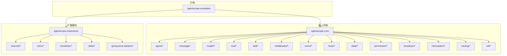

图表来源
- [Agent.java](file://agentscope-core/src/main/java/io/agentscope/core/agent/Agent.java)
- [Msg.java](file://agentscope-core/src/main/java/io/agentscope/core/message/Msg.java)
- [Model.java](file://agentscope-core/src/main/java/io/agentscope/core/model/Model.java)
- [Tool.java](file://agentscope-core/src/main/java/io/agentscope/core/tool/Tool.java)
- [SkillBox.java](file://agentscope-core/src/main/java/io/agentscope/core/skill/SkillBox.java)
- [MiddlewareChain.java](file://agentscope-core/src/main/java/io/agentscope/core/middleware/MiddlewareChain.java)
- [AgentEventEmitter.java](file://agentscope-core/src/main/java/io/agentscope/core/event/AgentEventEmitter.java)
- [Hook.java](file://agentscope-core/src/main/java/io/agentscope/core/hook/Hook.java)
- [AgentStateStore.java](file://agentscope-core/src/main/java/io/agentscope/core/state/AgentStateStore.java)
- [PermissionEngine.java](file://agentscope-core/src/main/java/io/agentscope/core/permission/PermissionEngine.java)
- [GracefulShutdownManager.java](file://agentscope-core/src/main/java/io/agentscope/core/shutdown/GracefulShutdownManager.java)
- [InterruptContext.java](file://agentscope-core/src/main/java/io/agentscope/core/interruption/InterruptContext.java)
- [Tracer.java](file://agentscope-core/src/main/java/io/agentscope/core/tracing/Tracer.java)
- [JsonUtils.java](file://agentscope-core/src/main/java/io/agentscope/core/util/JsonUtils.java)

章节来源
- [Version.java](file://agentscope-core/src/main/java/io/agentscope/core/Version.java)

## 核心组件
本节概述AgentScope的核心API族，包括代理基类与实现、消息类型、模型抽象与具体实现、工具与工具组、技能与技能注册、中间件链、事件与钩子、状态存储与权限控制、优雅停机与中断控制、追踪与工具集等。

- 代理API
  - 基类与接口：Agent、AgentBase、CallableAgent、ObservableAgent、StreamableAgent
  - 运行时上下文：RuntimeContext、SubagentEventBus、StreamOptions
  - 示例：ReActAgent
- 消息API
  - 消息与角色：Msg、MsgRole、MessageMetadataKeys
  - 内容块：ContentBlock、TextBlock、ThinkingBlock、HintBlock、ImageBlock、AudioBlock、VideoBlock、DataBlock
  - 工具相关：ToolUseBlock、ToolResultBlock、ToolResultMessage、ToolCallState、ToolResultState
- 模型API
  - 抽象与注册：Model、ChatModelBase、ModelRegistry、ModelUtils
  - 具体实现：OpenAIChatModel、DashScopeChatModel、GeminiChatModel、AnthropicChatModel、OllamaChatModel
  - 调用配置：ChatResponse、GenerateOptions、ExecutionConfig
- 工具API
  - 工具与执行：Tool、ToolBase、ToolExecutor、ToolExecutionContext、ToolResultConverter
  - 工具组与注册：ToolGroup、ToolGroupManager、ToolGroupScope、ToolRegistry、Toolkit、ToolkitConfig
  - 工厂与模式：MetaToolFactory、ReflectiveFunctionTool、SchemaOnlyTool、ToolSchemaGenerator、ToolSchemaProvider、ToolSchemaModule、ToolValidator
  - 上下文与发射器：ContextStore、DefaultContextStore、ToolEmitter、DefaultToolEmitter、NoOpToolEmitter、McpClientManager、SkillToolGroup
- 技能API
  - 抽象与注册：AgentSkill、RegisteredSkill、SkillBox、SkillRegistry、SkillToolFactory、DynamicSkillMiddleware
- 中间件API
  - 基类与链：MiddlewareBase、MiddlewareChain、TaskReminderMiddleware
  - 输入封装：AgentInput、ReasoningInput、ActingInput、ModelCallInput
- 事件与钩子API
  - 事件：AgentEvent、AgentStartEvent、AgentEndEvent、AgentResultEvent、文本/思考/工具/数据块事件、用户确认/最大迭代/停止请求/自定义事件
  - 钩子：Hook、HookEvent、HookEventType、ReasoningEvent、ActingEvent、SummaryEvent、Pre/Post系列事件、ErrorEvent、RuntimeContextAware、LegacyHookDispatcher
- 状态与权限API
  - 状态：AgentState、State、AgentStateStore、InMemoryAgentStateStore、JsonFileAgentStateStore、Task、TaskContextState、PlanModeContextState、ToolContextState、SessionInfo、LegacyStateLoader
  - 权限：PermissionEngine、PermissionRule、PermissionDecision、PermissionContextState、PermissionBehavior、PermissionMode、AdditionalWorkingDirectory
- 优雅停机与中断
  - 优雅停机：GracefulShutdownManager、GracefulShutdownConfig、GracefulShutdownMiddleware、ShutdownState、ShutdownStateSaver、ActiveRequestContext、AgentShuttingDownException、AgentScopeJvmShutdownHook
  - 中断：InterruptContext、InterruptControl、InterruptSource
- 追踪与工具集
  - 追踪：Tracer、NoopTracer、OtelTracingMiddleware、TracerRegistry
  - 工具集：JsonUtils、JacksonJsonCodec、JsonCodec、JsonSchemaUtils、MessageUtils、TypeUtils、ExceptionUtils、JsonException

章节来源
- [Agent.java](file://agentscope-core/src/main/java/io/agentscope/core/agent/Agent.java)
- [AgentBase.java](file://agentscope-core/src/main/java/io/agentscope/core/agent/AgentBase.java)
- [CallableAgent.java](file://agentscope-core/src/main/java/io/agentscope/core/agent/CallableAgent.java)
- [ObservableAgent.java](file://agentscope-core/src/main/java/io/agentscope/core/agent/ObservableAgent.java)
- [StreamableAgent.java](file://agentscope-core/src/main/java/io/agentscope/core/agent/StreamableAgent.java)
- [ReActAgent.java](file://agentscope-core/src/main/java/io/agentscope/core/ReActAgent.java)
- [RuntimeContext.java](file://agentscope-core/src/main/java/io/agentscope/core/RuntimeContext.java)
- [SubagentEventBus.java](file://agentscope-core/src/main/java/io/agentscope/core/SubagentEventBus.java)
- [StreamOptions.java](file://agentscope-core/src/main/java/io/agentscope/core/StreamOptions.java)
- [Msg.java](file://agentscope-core/src/main/java/io/agentscope/core/message/Msg.java)
- [SystemMessage.java](file://agentscope-core/src/main/java/io/agentscope/core/message/SystemMessage.java)
- [UserMessage.java](file://agentscope-core/src/main/java/io/agentscope/core/message/UserMessage.java)
- [AssistantMessage.java](file://agentscope-core/src/main/java/io/agentscope/core/message/AssistantMessage.java)
- [ContentBlock.java](file://agentscope-core/src/main/java/io/agentscope/core/message/ContentBlock.java)
- [TextBlock.java](file://agentscope-core/src/main/java/io/agentscope/core/message/TextBlock.java)
- [ThinkingBlock.java](file://agentscope-core/src/main/java/io/agentscope/core/message/ThinkingBlock.java)
- [HintBlock.java](file://agentscope-core/src/main/java/io/agentscope/core/message/HintBlock.java)
- [ImageBlock.java](file://agentscope-core/src/main/java/io/agentscope/core/message/ImageBlock.java)
- [AudioBlock.java](file://agentscope-core/src/main/java/io/agentscope/core/message/AudioBlock.java)
- [VideoBlock.java](file://agentscope-core/src/main/java/io/agentscope/core/message/VideoBlock.java)
- [DataBlock.java](file://agentscope-core/src/main/java/io/agentscope/core/message/DataBlock.java)
- [ToolUseBlock.java](file://agentscope-core/src/main/java/io/agentscope/core/message/ToolUseBlock.java)
- [ToolResultBlock.java](file://agentscope-core/src/main/java/io/agentscope/core/message/ToolResultBlock.java)
- [ToolResultMessage.java](file://agentscope-core/src/main/java/io/agentscope/core/message/ToolResultMessage.java)
- [ToolCallState.java](file://agentscope-core/src/main/java/io/agentscope/core/message/ToolCallState.java)
- [ToolResultState.java](file://agentscope-core/src/main/java/io/agentscope/core/message/ToolResultState.java)
- [MessageMetadataKeys.java](file://agentscope-core/src/main/java/io/agentscope/core/message/MessageMetadataKeys.java)
- [MsgRole.java](file://agentscope-core/src/main/java/io/agentscope/core/message/MsgRole.java)
- [Source.java](file://agentscope-core/src/main/java/io/agentscope/core/message/Source.java)
- [URLSource.java](file://agentscope-core/src/main/java/io/agentscope/core/message/URLSource.java)
- [Base64Source.java](file://agentscope-core/src/main/java/io/agentscope/core/message/Base64Source.java)
- [Model.java](file://agentscope-core/src/main/java/io/agentscope/core/model/Model.java)
- [ChatModelBase.java](file://agentscope-core/src/main/java/io/agentscope/core/model/ChatModelBase.java)
- [OpenAIChatModel.java](file://agentscope-core/src/main/java/io/agentscope/core/model/OpenAIChatModel.java)
- [DashScopeChatModel.java](file://agentscope-core/src/main/java/io/agentscope/core/model/DashScopeChatModel.java)
- [GeminiChatModel.java](file://agentscope-core/src/main/java/io/agentscope/core/model/GeminiChatModel.java)
- [AnthropicChatModel.java](file://agentscope-core/src/main/java/io/agentscope/core/model/AnthropicChatModel.java)
- [OllamaChatModel.java](file://agentscope-core/src/main/java/io/agentscope/core/model/OllamaChatModel.java)
- [ChatResponse.java](file://agentscope-core/src/main/java/io/agentscope/core/model/ChatResponse.java)
- [GenerateOptions.java](file://agentscope-core/src/main/java/io/agentscope/core/model/GenerateOptions.java)
- [ExecutionConfig.java](file://agentscope-core/src/main/java/io/agentscope/core/model/ExecutionConfig.java)
- [ModelRegistry.java](file://agentscope-core/src/main/java/io/agentscope/core/model/ModelRegistry.java)
- [ModelUtils.java](file://agentscope-core/src/main/java/io/agentscope/core/model/ModelUtils.java)
- [Tool.java](file://agentscope-core/src/main/java/io/agentscope/core/tool/Tool.java)
- [ToolBase.java](file://agentscope-core/src/main/java/io/agentscope/core/tool/ToolBase.java)
- [ToolExecutor.java](file://agentscope-core/src/main/java/io/agentscope/core/tool/ToolExecutor.java)
- [ToolExecutionContext.java](file://agentscope-core/src/main/java/io/agentscope/core/tool/ToolExecutionContext.java)
- [ToolResultConverter.java](file://agentscope-core/src/main/java/io/agentscope/core/tool/ToolResultConverter.java)
- [DefaultToolResultConverter.java](file://agentscope-core/src/main/java/io/agentscope/core/tool/DefaultToolResultConverter.java)
- [ToolResultMessageBuilder.java](file://agentscope-core/src/main/java/io/agentscope/core/tool/ToolResultMessageBuilder.java)
- [Toolkit.java](file://agentscope-core/src/main/java/io/agentscope/core/tool/Toolkit.java)
- [ToolkitConfig.java](file://agentscope-core/src/main/java/io/agentscope/core/tool/ToolkitConfig.java)
- [MetaToolFactory.java](file://agentscope-core/src/main/java/io/agentscope/core/tool/MetaToolFactory.java)
- [ReflectiveFunctionTool.java](file://agentscope-core/src/main/java/io/agentscope/core/tool/ReflectiveFunctionTool.java)
- [SchemaOnlyTool.java](file://agentscope-core/src/main/java/io/agentscope/core/tool/SchemaOnlyTool.java)
- [ToolSchemaGenerator.java](file://agentscope-core/src/main/java/io/agentscope/core/tool/ToolSchemaGenerator.java)
- [ToolSchemaProvider.java](file://agentscope-core/src/main/java/io/agentscope/core/tool/ToolSchemaProvider.java)
- [ToolSchemaModule.java](file://agentscope-core/src/main/java/io/agentscope/core/tool/ToolSchemaModule.java)
- [ToolValidator.java](file://agentscope-core/src/main/java/io/agentscope/core/tool/ToolValidator.java)
- [ContextStore.java](file://agentscope-core/src/main/java/io/agentscope/core/tool/ContextStore.java)
- [DefaultContextStore.java](file://agentscope-core/src/main/java/io/agentscope/core/tool/DefaultContextStore.java)
- [ToolEmitter.java](file://agentscope-core/src/main/java/io/agentscope/core/tool/ToolEmitter.java)
- [DefaultToolEmitter.java](file://agentscope-core/src/main/java/io/agentscope/core/tool/DefaultToolEmitter.java)
- [NoOpToolEmitter.java](file://agentscope-core/src/main/java/io/agentscope/core/tool/NoOpToolEmitter.java)
- [McpClientManager.java](file://agentscope-core/src/main/java/io/agentscope/core/tool/McpClientManager.java)
- [SkillToolGroup.java](file://agentscope-core/src/main/java/io/agentscope/core/tool/SkillToolGroup.java)
- [AgentSkill.java](file://agentscope-core/src/main/java/io/agentscope/core/skill/AgentSkill.java)
- [RegisteredSkill.java](file://agentscope-core/src/main/java/io/agentscope/core/skill/RegisteredSkill.java)
- [SkillBox.java](file://agentscope-core/src/main/java/io/agentscope/core/skill/SkillBox.java)
- [SkillRegistry.java](file://agentscope-core/src/main/java/io/agentscope/core/skill/SkillRegistry.java)
- [SkillToolFactory.java](file://agentscope-core/src/main/java/io/agentscope/core/skill/SkillToolFactory.java)
- [DynamicSkillMiddleware.java](file://agentscope-core/src/main/java/io/agentscope/core/skill/DynamicSkillMiddleware.java)
- [MiddlewareBase.java](file://agentscope-core/src/main/java/io/agentscope/core/middleware/MiddlewareBase.java)
- [MiddlewareChain.java](file://agentscope-core/src/main/java/io/agentscope/core/middleware/MiddlewareChain.java)
- [TaskReminderMiddleware.java](file://agentscope-core/src/main/java/io/agentscope/core/middleware/TaskReminderMiddleware.java)
- [AgentInput.java](file://agentscope-core/src/main/java/io/agentscope/core/middleware/AgentInput.java)
- [ReasoningInput.java](file://agentscope-core/src/main/java/io/agentscope/core/middleware/ReasoningInput.java)
- [ActingInput.java](file://agentscope-core/src/main/java/io/agentscope/core/middleware/ActingInput.java)
- [ModelCallInput.java](file://agentscope-core/src/main/java/io/agentscope/core/middleware/ModelCallInput.java)
- [AgentEvent.java](file://agentscope-core/src/main/java/io/agentscope/core/event/AgentEvent.java)
- [AgentStartEvent.java](file://agentscope-core/src/main/java/io/agentscope/core/event/AgentStartEvent.java)
- [AgentEndEvent.java](file://agentscope-core/src/main/java/io/agentscope/core/event/AgentEndEvent.java)
- [AgentResultEvent.java](file://agentscope-core/src/main/java/io/agentscope/core/event/AgentResultEvent.java)
- [TextBlockStartEvent.java](file://agentscope-core/src/main/java/io/agentscope/core/event/TextBlockStartEvent.java)
- [TextBlockDeltaEvent.java](file://agentscope-core/src/main/java/io/agentscope/core/event/TextBlockDeltaEvent.java)
- [TextBlockEndEvent.java](file://agentscope-core/src/main/java/io/agentscope/core/event/TextBlockEndEvent.java)
- [ThinkingBlockStartEvent.java](file://agentscope-core/src/main/java/io/agentscope/core/event/ThinkingBlockStartEvent.java)
- [ThinkingBlockDeltaEvent.java](file://agentscope-core/src/main/java/io/agentscope/core/event/ThinkingBlockDeltaEvent.java)
- [ThinkingBlockEndEvent.java](file://agentscope-core/src/main/java/io/agentscope/core/event/ThinkingBlockEndEvent.java)
- [ToolCallStartEvent.java](file://agentscope-core/src/main/java/io/agentscope/core/event/ToolCallStartEvent.java)
- [ToolCallDeltaEvent.java](file://agentscope-core/src/main/java/io/agentscope/core/event/ToolCallDeltaEvent.java)
- [ToolCallEndEvent.java](file://agentscope-core/src/main/java/io/agentscope/core/event/ToolCallEndEvent.java)
- [ToolResultStartEvent.java](file://agentscope-core/src/main/java/io/agentscope/core/event/ToolResultStartEvent.java)
- [ToolResultDataDeltaEvent.java](file://agentscope-core/src/main/java/io/agentscope/core/event/ToolResultDataDeltaEvent.java)
- [ToolResultTextDeltaEvent.java](file://agentscope-core/src/main/java/io/agentscope/core/event/ToolResultTextDeltaEvent.java)
- [ToolResultEndEvent.java](file://agentscope-core/src/main/java/io/agentscope/core/event/ToolResultEndEvent.java)
- [DataBlockStartEvent.java](file://agentscope-core/src/main/java/io/agentscope/core/event/DataBlockStartEvent.java)
- [DataBlockDeltaEvent.java](file://agentscope-core/src/main/java/io/agentscope/core/event/DataBlockDeltaEvent.java)
- [DataBlockEndEvent.java](file://agentscope-core/src/main/java/io/agentscope/core/event/DataBlockEndEvent.java)
- [RequireUserConfirmEvent.java](file://agentscope-core/src/main/java/io/agentscope/core/event/RequireUserConfirmEvent.java)
- [UserConfirmResultEvent.java](file://agentscope-core/src/main/java/io/agentscope/core/event/UserConfirmResultEvent.java)
- [ExceedMaxItersEvent.java](file://agentscope-core/src/main/java/io/agentscope/core/event/ExceedMaxItersEvent.java)
- [RequestStopEvent.java](file://agentscope-core/src/main/java/io/agentscope/core/event/RequestStopEvent.java)
- [CustomEvent.java](file://agentscope-core/src/main/java/io/agentscope/core/event/CustomEvent.java)
- [AgentEventEmitter.java](file://agentscope-core/src/main/java/io/agentscope/core/event/AgentEventEmitter.java)
- [Hook.java](file://agentscope-core/src/main/java/io/agentscope/core/hook/Hook.java)
- [HookEvent.java](file://agentscope-core/src/main/java/io/agentscope/core/hook/HookEvent.java)
- [HookEventType.java](file://agentscope-core/src/main/java/io/agentscope/core/hook/HookEventType.java)
- [ReasoningEvent.java](file://agentscope-core/src/main/java/io/agentscope/core/hook/ReasoningEvent.java)
- [ActingEvent.java](file://agentscope-core/src/main/java/io/agentscope/core/hook/ActingEvent.java)
- [SummaryEvent.java](file://agentscope-core/src/main/java/io/agentscope/core/hook/SummaryEvent.java)
- [ReasoningChunkEvent.java](file://agentscope-core/src/main/java/io/agentscope/core/hook/ReasoningChunkEvent.java)
- [ActingChunkEvent.java](file://agentscope-core/src/main/java/io/agentscope/core/hook/ActingChunkEvent.java)
- [SummaryChunkEvent.java](file://agentscope-core/src/main/java/io/agentscope/core/hook/SummaryChunkEvent.java)
- [PreReasoningEvent.java](file://agentscope-core/src/main/java/io/agentscope/core/hook/PreReasoningEvent.java)
- [PostReasoningEvent.java](file://agentscope-core/src/main/java/io/agentscope/core/hook/PostReasoningEvent.java)
- [PreActingEvent.java](file://agentscope-core/src/main/java/io/agentscope/core/hook/PreActingEvent.java)
- [PostActingEvent.java](file://agentscope-core/src/main/java/io/agentscope/core/hook/PostActingEvent.java)
- [PreSummaryEvent.java](file://agentscope-core/src/main/java/io/agentscope/core/hook/PreSummaryEvent.java)
- [PostSummaryEvent.java](file://agentscope-core/src/main/java/io/agentscope/core/hook/PostSummaryEvent.java)
- [PreCallEvent.java](file://agentscope-core/src/main/java/io/agentscope/core/hook/PreCallEvent.java)
- [PostCallEvent.java](file://agentscope-core/src/main/java/io/agentscope/core/hook/PostCallEvent.java)
- [ErrorEvent.java](file://agentscope-core/src/main/java/io/agentscope/core/hook/ErrorEvent.java)
- [RuntimeContextAware.java](file://agentscope-core/src/main/java/io/agentscope/core/hook/RuntimeContextAware.java)
- [LegacyHookDispatcher.java](file://agentscope-core/src/main/java/io/agentscope/core/hook/LegacyHookDispatcher.java)
- [AgentState.java](file://agentscope-core/src/main/java/io/agentscope/core/state/AgentState.java)
- [State.java](file://agentscope-core/src/main/java/io/agentscope/core/state/State.java)
- [AgentStateStore.java](file://agentscope-core/src/main/java/io/agentscope/core/state/AgentStateStore.java)
- [InMemoryAgentStateStore.java](file://agentscope-core/src/main/java/io/agentscope/core/state/InMemoryAgentStateStore.java)
- [JsonFileAgentStateStore.java](file://agentscope-core/src/main/java/io/agentscope/core/state/JsonFileAgentStateStore.java)
- [Task.java](file://agentscope-core/src/main/java/io/agentscope/core/state/Task.java)
- [TaskContextState.java](file://agentscope-core/src/main/java/io/agentscope/core/state/TaskContextState.java)
- [PlanModeContextState.java](file://agentscope-core/src/main/java/io/agentscope/core/state/PlanModeContextState.java)
- [ToolContextState.java](file://agentscope-core/src/main/java/io/agentscope/core/state/ToolContextState.java)
- [SessionInfo.java](file://agentscope-core/src/main/java/io/agentscope/core/state/SessionInfo.java)
- [LegacyStateLoader.java](file://agentscope-core/src/main/java/io/agentscope/core/state/LegacyStateLoader.java)
- [PermissionEngine.java](file://agentscope-core/src/main/java/io/agentscope/core/permission/PermissionEngine.java)
- [PermissionRule.java](file://agentscope-core/src/main/java/io/agentscope/core/permission/PermissionRule.java)
- [PermissionDecision.java](file://agentscope-core/src/main/java/io/agentscope/core/permission/PermissionDecision.java)
- [PermissionContextState.java](file://agentscope-core/src/main/java/io/agentscope/core/permission/PermissionContextState.java)
- [PermissionBehavior.java](file://agentscope-core/src/main/java/io/agentscope/core/permission/PermissionBehavior.java)
- [PermissionMode.java](file://agentscope-core/src/main/java/io/agentscope/core/permission/PermissionMode.java)
- [AdditionalWorkingDirectory.java](file://agentscope-core/src/main/java/io/agentscope/core/permission/AdditionalWorkingDirectory.java)
- [GracefulShutdownManager.java](file://agentscope-core/src/main/java/io/agentscope/core/shutdown/GracefulShutdownManager.java)
- [GracefulShutdownConfig.java](file://agentscope-core/src/main/java/io/agentscope/core/shutdown/GracefulShutdownConfig.java)
- [GracefulShutdownMiddleware.java](file://agentscope-core/src/main/java/io/agentscope/core/shutdown/GracefulShutdownMiddleware.java)
- [ShutdownState.java](file://agentscope-core/src/main/java/io/agentscope/core/shutdown/ShutdownState.java)
- [ShutdownStateSaver.java](file://agentscope-core/src/main/java/io/agentscope/core/shutdown/ShutdownStateSaver.java)
- [ActiveRequestContext.java](file://agentscope-core/src/main/java/io/agentscope/core/shutdown/ActiveRequestContext.java)
- [AgentShuttingDownException.java](file://agentscope-core/src/main/java/io/agentscope/core/shutdown/AgentShuttingDownException.java)
- [InterruptContext.java](file://agentscope-core/src/main/java/io/agentscope/core/interruption/InterruptContext.java)
- [InterruptControl.java](file://agentscope-core/src/main/java/io/agentscope/core/interruption/InterruptControl.java)
- [InterruptSource.java](file://agentscope-core/src/main/java/io/agentscope/core/interruption/InterruptSource.java)
- [Tracer.java](file://agentscope-core/src/main/java/io/agentscope/core/tracing/Tracer.java)
- [NoopTracer.java](file://agentscope-core/src/main/java/io/agentscope/core/tracing/NoopTracer.java)
- [OtelTracingMiddleware.java](file://agentscope-core/src/main/java/io/agentscope/core/tracing/OtelTracingMiddleware.java)
- [TracerRegistry.java](file://agentscope-core/src/main/java/io/agentscope/core/tracing/TracerRegistry.java)
- [JsonUtils.java](file://agentscope-core/src/main/java/io/agentscope/core/util/JsonUtils.java)
- [JacksonJsonCodec.java](file://agentscope-core/src/main/java/io/agentscope/core/util/JacksonJsonCodec.java)
- [JsonCodec.java](file://agentscope-core/src/main/java/io/agentscope/core/util/JsonCodec.java)
- [JsonSchemaUtils.java](file://agentscope-core/src/main/java/io/agentscope/core/util/JsonSchemaUtils.java)
- [MessageUtils.java](file://agentscope-core/src/main/java/io/agentscope/core/util/MessageUtils.java)
- [TypeUtils.java](file://agentscope-core/src/main/java/io/agentscope/core/util/TypeUtils.java)
- [ExceptionUtils.java](file://agentscope-core/src/main/java/io/agentscope/core/util/ExceptionUtils.java)
- [JsonException.java](file://agentscope-core/src/main/java/io/agentscope/core/util/JsonException.java)

## 架构总览
AgentScope以“代理-消息-模型-工具-技能-中间件-事件-钩子-状态-权限-停机-中断-追踪”为核心闭环，结合扩展模块提供渠道接入、分布式存储、调度与Spring Boot集成。

```mermaid
graph TB
subgraph "代理层"
A0["Agent"]
A1["AgentBase"]
A2["CallableAgent"]
A3["ObservableAgent"]
A4["StreamableAgent"]
A5["ReActAgent"]
end
subgraph "消息层"
M0["Msg"]
M1["ContentBlock<br/>Text/Thinking/Hint/Image/Audio/Video/Data"]
M2["ToolUseBlock"]
M3["ToolResultBlock/Message"]
end
subgraph "模型层"
MD0["Model"]
MD1["ChatModelBase"]
MD2["OpenAIChatModel"]
MD3["DashScopeChatModel"]
MD4["GeminiChatModel"]
MD5["AnthropicChatModel"]
MD6["OllamaChatModel"]
MD7["ChatResponse"]
MD8["GenerateOptions"]
MD9["ExecutionConfig"]
MD10["ModelRegistry"]
MD11["ModelUtils"]
end
subgraph "工具层"
T0["Tool"]
T1["ToolBase"]
T2["ToolExecutor"]
T3["ToolExecutionContext"]
T4["ToolResultConverter"]
T5["ToolGroup/Manager/Scope"]
T6["ToolRegistry"]
T7["Toolkit/Config"]
T8["Meta/Reflective/SchemaOnly"]
T9["ContextStore/Emitter/McpClientManager/SkillToolGroup"]
end
subgraph "技能层"
S0["AgentSkill"]
S1["RegisteredSkill"]
S2["SkillBox"]
S3["SkillRegistry"]
S4["SkillToolFactory"]
S5["DynamicSkillMiddleware"]
end
subgraph "中间件层"
W0["MiddlewareBase"]
W1["MiddlewareChain"]
W2["TaskReminderMiddleware"]
W3["AgentInput/ReasoningInput/ActingInput/ModelCallInput"]
end
subgraph "事件与钩子"
E0["AgentEventEmitter"]
E1["AgentEvent/Start/End/Result"]
E2["Text/Thinking/Tool/Data Block Events"]
E3["Hook/HookEvent/HookEventType"]
E4["Pre/Post/Reasoning/Acting/Summary Events"]
E5["ErrorEvent/RuntimeContextAware"]
end
subgraph "状态与权限"
ST0["AgentState/State"]
ST1["AgentStateStore<br/>InMemory/JsonFile"]
ST2["Task/TaskContextState"]
ST3["PlanModeContextState"]
ST4["ToolContextState"]
ST5["SessionInfo/LegacyStateLoader"]
P0["PermissionEngine/Rule/Decision"]
P1["PermissionContextState/Behavior/Mode"]
P2["AdditionalWorkingDirectory"]
end
subgraph "停机与中断"
SD0["GracefulShutdownManager/Config/Middleware"]
SD1["ShutdownState/StateSaver/ActiveRequestContext"]
SD2["AgentShuttingDownException/JvmShutdownHook"]
I0["InterruptContext/Control/Source"]
end
subgraph "追踪与工具集"
TR0["Tracer/NoopTracer/OtelTracingMiddleware"]
TR1["TracerRegistry"]
UT0["JsonUtils/JacksonJsonCodec/JsonCodec"]
UT1["JsonSchemaUtils/MessageUtils/TypeUtils/ExceptionUtils/JsonException"]
end
A0 --> M0
A0 --> MD0
A0 --> T0
A0 --> S0
A0 --> W0
A0 --> E0
A0 --> ST0
A0 --> SD0
A0 --> I0
A0 --> TR0
A0 --> UT0
A1 --> A0
A2 --> A0
A3 --> A0
A4 --> A0
A5 --> A0
M0 --> M1
M0 --> M2
M0 --> M3
MD0 --> MD1
MD1 --> MD2
MD1 --> MD3
MD1 --> MD4
MD1 --> MD5
MD1 --> MD6
MD0 --> MD7
MD0 --> MD8
MD0 --> MD9
MD0 --> MD10
MD0 --> MD11
T0 --> T1
T1 --> T2
T2 --> T3
T3 --> T4
T0 --> T5
T5 --> T6
T0 --> T7
T7 --> T8
T0 --> T9
S0 --> S1
S1 --> S2
S2 --> S3
S3 --> S4
S4 --> S5
W0 --> W1
W1 --> W2
W2 --> W3
E0 --> E1
E1 --> E2
E0 --> E3
E3 --> E4
E4 --> E5
ST0 --> ST1
ST1 --> ST2
ST2 --> ST3
ST3 --> ST4
ST4 --> ST5
P0 --> P1
P1 --> P2
SD0 --> SD1
SD1 --> SD2
TR0 --> TR1
UT0 --> UT1
```

图表来源
- [Agent.java](file://agentscope-core/src/main/java/io/agentscope/core/agent/Agent.java)
- [Msg.java](file://agentscope-core/src/main/java/io/agentscope/core/message/Msg.java)
- [Model.java](file://agentscope-core/src/main/java/io/agentscope/core/model/Model.java)
- [Tool.java](file://agentscope-core/src/main/java/io/agentscope/core/tool/Tool.java)
- [AgentSkill.java](file://agentscope-core/src/main/java/io/agentscope/core/skill/AgentSkill.java)
- [MiddlewareBase.java](file://agentscope-core/src/main/java/io/agentscope/core/middleware/MiddlewareBase.java)
- [AgentEventEmitter.java](file://agentscope-core/src/main/java/io/agentscope/core/event/AgentEventEmitter.java)
- [AgentStateStore.java](file://agentscope-core/src/main/java/io/agentscope/core/state/AgentStateStore.java)
- [PermissionEngine.java](file://agentscope-core/src/main/java/io/agentscope/core/permission/PermissionEngine.java)
- [GracefulShutdownManager.java](file://agentscope-core/src/main/java/io/agentscope/core/shutdown/GracefulShutdownManager.java)
- [InterruptContext.java](file://agentscope-core/src/main/java/io/agentscope/core/interruption/InterruptContext.java)
- [Tracer.java](file://agentscope-core/src/main/java/io/agentscope/core/tracing/Tracer.java)
- [JsonUtils.java](file://agentscope-core/src/main/java/io/agentscope/core/util/JsonUtils.java)

## 详细组件分析

### 代理API
- Agent：代理接口，定义统一的调用与生命周期管理契约
- AgentBase：通用代理基类，提供默认行为与扩展点
- CallableAgent：可调用代理，支持同步/异步执行
- ObservableAgent：可观测代理，支持事件订阅与发布
- StreamableAgent：可流式代理，支持增量输出与流式回调
- ReActAgent：基于推理-行动循环的代理实现
- 运行时上下文：RuntimeContext、SubagentEventBus、StreamOptions

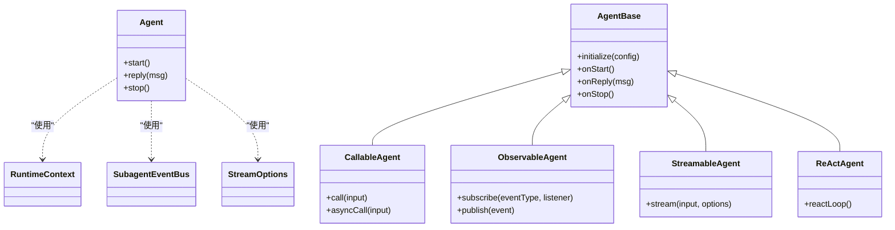

图表来源
- [Agent.java](file://agentscope-core/src/main/java/io/agentscope/core/agent/Agent.java)
- [AgentBase.java](file://agentscope-core/src/main/java/io/agentscope/core/agent/AgentBase.java)
- [CallableAgent.java](file://agentscope-core/src/main/java/io/agentscope/core/agent/CallableAgent.java)
- [ObservableAgent.java](file://agentscope-core/src/main/java/io/agentscope/core/agent/ObservableAgent.java)
- [StreamableAgent.java](file://agentscope-core/src/main/java/io/agentscope/core/agent/StreamableAgent.java)
- [ReActAgent.java](file://agentscope-core/src/main/java/io/agentscope/core/ReActAgent.java)
- [RuntimeContext.java](file://agentscope-core/src/main/java/io/agentscope/core/RuntimeContext.java)
- [SubagentEventBus.java](file://agentscope-core/src/main/java/io/agentscope/core/SubagentEventBus.java)
- [StreamOptions.java](file://agentscope-core/src/main/java/io/agentscope/core/StreamOptions.java)

章节来源
- [Agent.java](file://agentscope-core/src/main/java/io/agentscope/core/agent/Agent.java)
- [AgentBase.java](file://agentscope-core/src/main/java/io/agentscope/core/agent/AgentBase.java)
- [CallableAgent.java](file://agentscope-core/src/main/java/io/agentscope/core/agent/CallableAgent.java)
- [ObservableAgent.java](file://agentscope-core/src/main/java/io/agentscope/core/agent/ObservableAgent.java)
- [StreamableAgent.java](file://agentscope-core/src/main/java/io/agentscope/core/agent/StreamableAgent.java)
- [ReActAgent.java](file://agentscope-core/src/main/java/io/agentscope/core/ReActAgent.java)
- [RuntimeContext.java](file://agentscope-core/src/main/java/io/agentscope/core/RuntimeContext.java)
- [SubagentEventBus.java](file://agentscope-core/src/main/java/io/agentscope/core/SubagentEventBus.java)
- [StreamOptions.java](file://agentscope-core/src/main/java/io/agentscope/core/StreamOptions.java)

### 消息API
- 消息与元数据：Msg、MsgRole、MessageMetadataKeys
- 内容块：TextBlock、ThinkingBlock、HintBlock、ImageBlock、AudioBlock、VideoBlock、DataBlock
- 工具相关：ToolUseBlock、ToolResultBlock、ToolResultMessage、ToolCallState、ToolResultState
- 源类型：URLSource、Base64Source

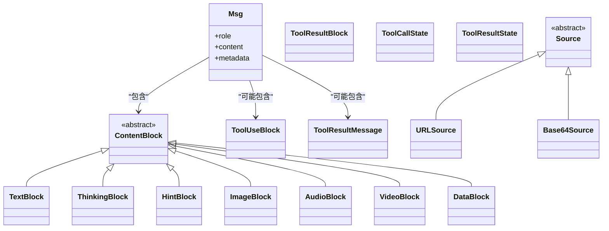

图表来源
- [Msg.java](file://agentscope-core/src/main/java/io/agentscope/core/message/Msg.java)
- [ContentBlock.java](file://agentscope-core/src/main/java/io/agentscope/core/message/ContentBlock.java)
- [TextBlock.java](file://agentscope-core/src/main/java/io/agentscope/core/message/TextBlock.java)
- [ThinkingBlock.java](file://agentscope-core/src/main/java/io/agentscope/core/message/ThinkingBlock.java)
- [HintBlock.java](file://agentscope-core/src/main/java/io/agentscope/core/message/HintBlock.java)
- [ImageBlock.java](file://agentscope-core/src/main/java/io/agentscope/core/message/ImageBlock.java)
- [AudioBlock.java](file://agentscope-core/src/main/java/io/agentscope/core/message/AudioBlock.java)
- [VideoBlock.java](file://agentscope-core/src/main/java/io/agentscope/core/message/VideoBlock.java)
- [DataBlock.java](file://agentscope-core/src/main/java/io/agentscope/core/message/DataBlock.java)
- [ToolUseBlock.java](file://agentscope-core/src/main/java/io/agentscope/core/message/ToolUseBlock.java)
- [ToolResultBlock.java](file://agentscope-core/src/main/java/io/agentscope/core/message/ToolResultBlock.java)
- [ToolResultMessage.java](file://agentscope-core/src/main/java/io/agentscope/core/message/ToolResultMessage.java)
- [ToolCallState.java](file://agentscope-core/src/main/java/io/agentscope/core/message/ToolCallState.java)
- [ToolResultState.java](file://agentscope-core/src/main/java/io/agentscope/core/message/ToolResultState.java)
- [Source.java](file://agentscope-core/src/main/java/io/agentscope/core/message/Source.java)
- [URLSource.java](file://agentscope-core/src/main/java/io/agentscope/core/message/URLSource.java)
- [Base64Source.java](file://agentscope-core/src/main/java/io/agentscope/core/message/Base64Source.java)

章节来源
- [Msg.java](file://agentscope-core/src/main/java/io/agentscope/core/message/Msg.java)
- [SystemMessage.java](file://agentscope-core/src/main/java/io/agentscope/core/message/SystemMessage.java)
- [UserMessage.java](file://agentscope-core/src/main/java/io/agentscope/core/message/UserMessage.java)
- [AssistantMessage.java](file://agentscope-core/src/main/java/io/agentscope/core/message/AssistantMessage.java)
- [ContentBlock.java](file://agentscope-core/src/main/java/io/agentscope/core/message/ContentBlock.java)
- [TextBlock.java](file://agentscope-core/src/main/java/io/agentscope/core/message/TextBlock.java)
- [ThinkingBlock.java](file://agentscope-core/src/main/java/io/agentscope/core/message/ThinkingBlock.java)
- [HintBlock.java](file://agentscope-core/src/main/java/io/agentscope/core/message/HintBlock.java)
- [ImageBlock.java](file://agentscope-core/src/main/java/io/agentscope/core/message/ImageBlock.java)
- [AudioBlock.java](file://agentscope-core/src/main/java/io/agentscope/core/message/AudioBlock.java)
- [VideoBlock.java](file://agentscope-core/src/main/java/io/agentscope/core/message/VideoBlock.java)
- [DataBlock.java](file://agentscope-core/src/main/java/io/agentscope/core/message/DataBlock.java)
- [ToolUseBlock.java](file://agentscope-core/src/main/java/io/agentscope/core/message/ToolUseBlock.java)
- [ToolResultBlock.java](file://agentscope-core/src/main/java/io/agentscope/core/message/ToolResultBlock.java)
- [ToolResultMessage.java](file://agentscope-core/src/main/java/io/agentscope/core/message/ToolResultMessage.java)
- [ToolCallState.java](file://agentscope-core/src/main/java/io/agentscope/core/message/ToolCallState.java)
- [ToolResultState.java](file://agentscope-core/src/main/java/io/agentscope/core/message/ToolResultState.java)
- [MessageMetadataKeys.java](file://agentscope-core/src/main/java/io/agentscope/core/message/MessageMetadataKeys.java)
- [MsgRole.java](file://agentscope-core/src/main/java/io/agentscope/core/message/MsgRole.java)
- [Source.java](file://agentscope-core/src/main/java/io/agentscope/core/message/Source.java)
- [URLSource.java](file://agentscope-core/src/main/java/io/agentscope/core/message/URLSource.java)
- [Base64Source.java](file://agentscope-core/src/main/java/io/agentscope/core/message/Base64Source.java)

### 模型API
- 抽象与注册：Model、ChatModelBase、ModelRegistry、ModelUtils
- 具体实现：OpenAIChatModel、DashScopeChatModel、GeminiChatModel、AnthropicChatModel、OllamaChatModel
- 调用配置：ChatResponse、GenerateOptions、ExecutionConfig

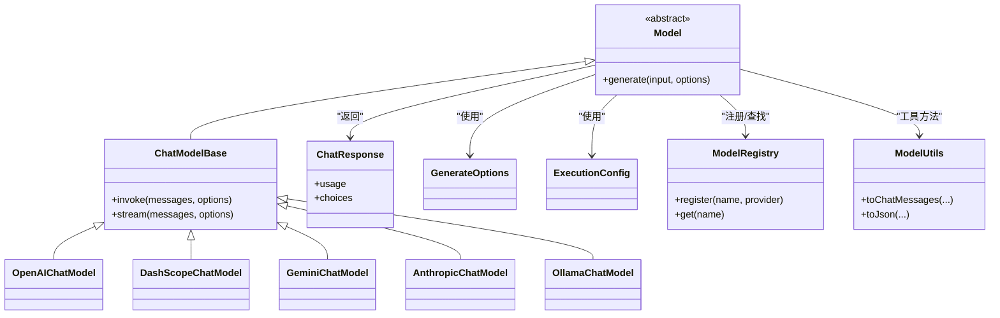

图表来源
- [Model.java](file://agentscope-core/src/main/java/io/agentscope/core/model/Model.java)
- [ChatModelBase.java](file://agentscope-core/src/main/java/io/agentscope/core/model/ChatModelBase.java)
- [OpenAIChatModel.java](file://agentscope-core/src/main/java/io/agentscope/core/model/OpenAIChatModel.java)
- [DashScopeChatModel.java](file://agentscope-core/src/main/java/io/agentscope/core/model/DashScopeChatModel.java)
- [GeminiChatModel.java](file://agentscope-core/src/main/java/io/agentscope/core/model/GeminiChatModel.java)
- [AnthropicChatModel.java](file://agentscope-core/src/main/java/io/agentscope/core/model/AnthropicChatModel.java)
- [OllamaChatModel.java](file://agentscope-core/src/main/java/io/agentscope/core/model/OllamaChatModel.java)
- [ChatResponse.java](file://agentscope-core/src/main/java/io/agentscope/core/model/ChatResponse.java)
- [GenerateOptions.java](file://agentscope-core/src/main/java/io/agentscope/core/model/GenerateOptions.java)
- [ExecutionConfig.java](file://agentscope-core/src/main/java/io/agentscope/core/model/ExecutionConfig.java)
- [ModelRegistry.java](file://agentscope-core/src/main/java/io/agentscope/core/model/ModelRegistry.java)
- [ModelUtils.java](file://agentscope-core/src/main/java/io/agentscope/core/model/ModelUtils.java)

章节来源
- [Model.java](file://agentscope-core/src/main/java/io/agentscope/core/model/Model.java)
- [ChatModelBase.java](file://agentscope-core/src/main/java/io/agentscope/core/model/ChatModelBase.java)
- [OpenAIChatModel.java](file://agentscope-core/src/main/java/io/agentscope/core/model/OpenAIChatModel.java)
- [DashScopeChatModel.java](file://agentscope-core/src/main/java/io/agentscope/core/model/DashScopeChatModel.java)
- [GeminiChatModel.java](file://agentscope-core/src/main/java/io/agentscope/core/model/GeminiChatModel.java)
- [AnthropicChatModel.java](file://agentscope-core/src/main/java/io/agentscope/core/model/AnthropicChatModel.java)
- [OllamaChatModel.java](file://agentscope-core/src/main/java/io/agentscope/core/model/OllamaChatModel.java)
- [ChatResponse.java](file://agentscope-core/src/main/java/io/agentscope/core/model/ChatResponse.java)
- [GenerateOptions.java](file://agentscope-core/src/main/java/io/agentscope/core/model/GenerateOptions.java)
- [ExecutionConfig.java](file://agentscope-core/src/main/java/io/agentscope/core/model/ExecutionConfig.java)
- [ModelRegistry.java](file://agentscope-core/src/main/java/io/agentscope/core/model/ModelRegistry.java)
- [ModelUtils.java](file://agentscope-core/src/main/java/io/agentscope/core/model/ModelUtils.java)

### 工具API
- 工具与执行：Tool、ToolBase、ToolExecutor、ToolExecutionContext、ToolResultConverter
- 工具组与注册：ToolGroup、ToolGroupManager、ToolGroupScope、ToolRegistry、Toolkit、ToolkitConfig
- 工厂与模式：MetaToolFactory、ReflectiveFunctionTool、SchemaOnlyTool、ToolSchemaGenerator、ToolSchemaProvider、ToolSchemaModule、ToolValidator
- 上下文与发射器：ContextStore、DefaultContextStore、ToolEmitter、DefaultToolEmitter、NoOpToolEmitter、McpClientManager、SkillToolGroup

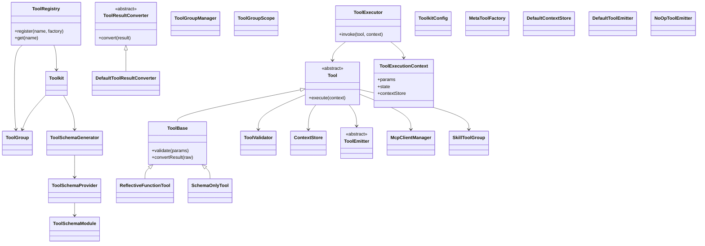

图表来源
- [Tool.java](file://agentscope-core/src/main/java/io/agentscope/core/tool/Tool.java)
- [ToolBase.java](file://agentscope-core/src/main/java/io/agentscope/core/tool/ToolBase.java)
- [ToolExecutor.java](file://agentscope-core/src/main/java/io/agentscope/core/tool/ToolExecutor.java)
- [ToolExecutionContext.java](file://agentscope-core/src/main/java/io/agentscope/core/tool/ToolExecutionContext.java)
- [ToolResultConverter.java](file://agentscope-core/src/main/java/io/agentscope/core/tool/ToolResultConverter.java)
- [DefaultToolResultConverter.java](file://agentscope-core/src/main/java/io/agentscope/core/tool/DefaultToolResultConverter.java)
- [ToolGroup.java](file://agentscope-core/src/main/java/io/agentscope/core/tool/ToolGroup.java)
- [ToolGroupManager.java](file://agentscope-core/src/main/java/io/agentscope/core/tool/ToolGroupManager.java)
- [ToolGroupScope.java](file://agentscope-core/src/main/java/io/agentscope/core/tool/ToolGroupScope.java)
- [ToolRegistry.java](file://agentscope-core/src/main/java/io/agentscope/core/tool/ToolRegistry.java)
- [Toolkit.java](file://agentscope-core/src/main/java/io/agentscope/core/tool/Toolkit.java)
- [ToolkitConfig.java](file://agentscope-core/src/main/java/io/agentscope/core/tool/ToolkitConfig.java)
- [MetaToolFactory.java](file://agentscope-core/src/main/java/io/agentscope/core/tool/MetaToolFactory.java)
- [ReflectiveFunctionTool.java](file://agentscope-core/src/main/java/io/agentscope/core/tool/ReflectiveFunctionTool.java)
- [SchemaOnlyTool.java](file://agentscope-core/src/main/java/io/agentscope/core/tool/SchemaOnlyTool.java)
- [ToolSchemaGenerator.java](file://agentscope-core/src/main/java/io/agentscope/core/tool/ToolSchemaGenerator.java)
- [ToolSchemaProvider.java](file://agentscope-core/src/main/java/io/agentscope/core/tool/ToolSchemaProvider.java)
- [ToolSchemaModule.java](file://agentscope-core/src/main/java/io/agentscope/core/tool/ToolSchemaModule.java)
- [ToolValidator.java](file://agentscope-core/src/main/java/io/agentscope/core/tool/ToolValidator.java)
- [ContextStore.java](file://agentscope-core/src/main/java/io/agentscope/core/tool/ContextStore.java)
- [DefaultContextStore.java](file://agentscope-core/src/main/java/io/agentscope/core/tool/DefaultContextStore.java)
- [ToolEmitter.java](file://agentscope-core/src/main/java/io/agentscope/core/tool/ToolEmitter.java)
- [DefaultToolEmitter.java](file://agentscope-core/src/main/java/io/agentscope/core/tool/DefaultToolEmitter.java)
- [NoOpToolEmitter.java](file://agentscope-core/src/main/java/io/agentscope/core/tool/NoOpToolEmitter.java)
- [McpClientManager.java](file://agentscope-core/src/main/java/io/agentscope/core/tool/McpClientManager.java)
- [SkillToolGroup.java](file://agentscope-core/src/main/java/io/agentscope/core/tool/SkillToolGroup.java)

章节来源
- [Tool.java](file://agentscope-core/src/main/java/io/agentscope/core/tool/Tool.java)
- [ToolBase.java](file://agentscope-core/src/main/java/io/agentscope/core/tool/ToolBase.java)
- [ToolExecutor.java](file://agentscope-core/src/main/java/io/agentscope/core/tool/ToolExecutor.java)
- [ToolExecutionContext.java](file://agentscope-core/src/main/java/io/agentscope/core/tool/ToolExecutionContext.java)
- [ToolResultConverter.java](file://agentscope-core/src/main/java/io/agentscope/core/tool/ToolResultConverter.java)
- [DefaultToolResultConverter.java](file://agentscope-core/src/main/java/io/agentscope/core/tool/DefaultToolResultConverter.java)
- [ToolGroup.java](file://agentscope-core/src/main/java/io/agentscope/core/tool/ToolGroup.java)
- [ToolGroupManager.java](file://agentscope-core/src/main/java/io/agentscope/core/tool/ToolGroupManager.java)
- [ToolGroupScope.java](file://agentscope-core/src/main/java/io/agentscope/core/tool/ToolGroupScope.java)
- [ToolRegistry.java](file://agentscope-core/src/main/java/io/agentscope/core/tool/ToolRegistry.java)
- [Toolkit.java](file://agentscope-core/src/main/java/io/agentscope/core/tool/Toolkit.java)
- [ToolkitConfig.java](file://agentscope-core/src/main/java/io/agentscope/core/tool/ToolkitConfig.java)
- [MetaToolFactory.java](file://agentscope-core/src/main/java/io/agentscope/core/tool/MetaToolFactory.java)
- [ReflectiveFunctionTool.java](file://agentscope-core/src/main/java/io/agentscope/core/tool/ReflectiveFunctionTool.java)
- [SchemaOnlyTool.java](file://agentscope-core/src/main/java/io/agentscope/core/tool/SchemaOnlyTool.java)
- [ToolSchemaGenerator.java](file://agentscope-core/src/main/java/io/agentscope/core/tool/ToolSchemaGenerator.java)
- [ToolSchemaProvider.java](file://agentscope-core/src/main/java/io/agentscope/core/tool/ToolSchemaProvider.java)
- [ToolSchemaModule.java](file://agentscope-core/src/main/java/io/agentscope/core/tool/ToolSchemaModule.java)
- [ToolValidator.java](file://agentscope-core/src/main/java/io/agentscope/core/tool/ToolValidator.java)
- [ContextStore.java](file://agentscope-core/src/main/java/io/agentscope/core/tool/ContextStore.java)
- [DefaultContextStore.java](file://agentscope-core/src/main/java/io/agentscope/core/tool/DefaultContextStore.java)
- [ToolEmitter.java](file://agentscope-core/src/main/java/io/agentscope/core/tool/ToolEmitter.java)
- [DefaultToolEmitter.java](file://agentscope-core/src/main/java/io/agentscope/core/tool/DefaultToolEmitter.java)
- [NoOpToolEmitter.java](file://agentscope-core/src/main/java/io/agentscope/core/tool/NoOpToolEmitter.java)
- [McpClientManager.java](file://agentscope-core/src/main/java/io/agentscope/core/tool/McpClientManager.java)
- [SkillToolGroup.java](file://agentscope-core/src/main/java/io/agentscope/core/tool/SkillToolGroup.java)

### 技能API
- 抽象与注册：AgentSkill、RegisteredSkill、SkillBox、SkillRegistry、SkillToolFactory、DynamicSkillMiddleware

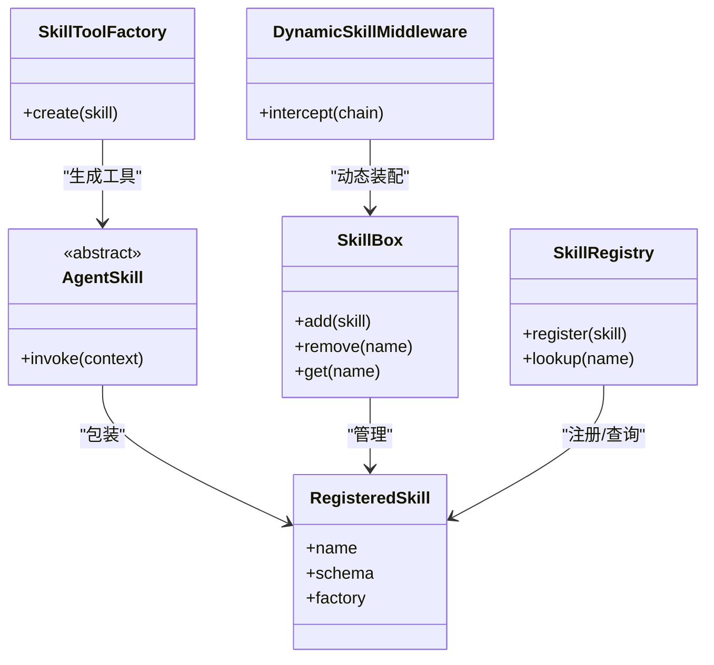

图表来源
- [AgentSkill.java](file://agentscope-core/src/main/java/io/agentscope/core/skill/AgentSkill.java)
- [RegisteredSkill.java](file://agentscope-core/src/main/java/io/agentscope/core/skill/RegisteredSkill.java)
- [SkillBox.java](file://agentscope-core/src/main/java/io/agentscope/core/skill/SkillBox.java)
- [SkillRegistry.java](file://agentscope-core/src/main/java/io/agentscope/core/skill/SkillRegistry.java)
- [SkillToolFactory.java](file://agentscope-core/src/main/java/io/agentscope/core/skill/SkillToolFactory.java)
- [DynamicSkillMiddleware.java](file://agentscope-core/src/main/java/io/agentscope/core/skill/DynamicSkillMiddleware.java)

章节来源
- [AgentSkill.java](file://agentscope-core/src/main/java/io/agentscope/core/skill/AgentSkill.java)
- [RegisteredSkill.java](file://agentscope-core/src/main/java/io/agentscope/core/skill/RegisteredSkill.java)
- [SkillBox.java](file://agentscope-core/src/main/java/io/agentscope/core/skill/SkillBox.java)
- [SkillRegistry.java](file://agentscope-core/src/main/java/io/agentscope/core/skill/SkillRegistry.java)
- [SkillToolFactory.java](file://agentscope-core/src/main/java/io/agentscope/core/skill/SkillToolFactory.java)
- [DynamicSkillMiddleware.java](file://agentscope-core/src/main/java/io/agentscope/core/skill/DynamicSkillMiddleware.java)

### 中间件API
- 基类与链：MiddlewareBase、MiddlewareChain、TaskReminderMiddleware
- 输入封装：AgentInput、ReasoningInput、ActingInput、ModelCallInput

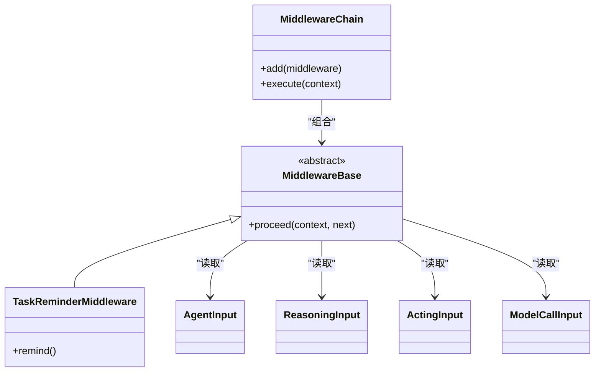

图表来源
- [MiddlewareBase.java](file://agentscope-core/src/main/java/io/agentscope/core/middleware/MiddlewareBase.java)
- [MiddlewareChain.java](file://agentscope-core/src/main/java/io/agentscope/core/middleware/MiddlewareChain.java)
- [TaskReminderMiddleware.java](file://agentscope-core/src/main/java/io/agentscope/core/middleware/TaskReminderMiddleware.java)
- [AgentInput.java](file://agentscope-core/src/main/java/io/agentscope/core/middleware/AgentInput.java)
- [ReasoningInput.java](file://agentscope-core/src/main/java/io/agentscope/core/middleware/ReasoningInput.java)
- [ActingInput.java](file://agentscope-core/src/main/java/io/agentscope/core/middleware/ActingInput.java)
- [ModelCallInput.java](file://agentscope-core/src/main/java/io/agentscope/core/middleware/ModelCallInput.java)

章节来源
- [MiddlewareBase.java](file://agentscope-core/src/main/java/io/agentscope/core/middleware/MiddlewareBase.java)
- [MiddlewareChain.java](file://agentscope-core/src/main/java/io/agentscope/core/middleware/MiddlewareChain.java)
- [TaskReminderMiddleware.java](file://agentscope-core/src/main/java/io/agentscope/core/middleware/TaskReminderMiddleware.java)
- [AgentInput.java](file://agentscope-core/src/main/java/io/agentscope/core/middleware/AgentInput.java)
- [ReasoningInput.java](file://agentscope-core/src/main/java/io/agentscope/core/middleware/ReasoningInput.java)
- [ActingInput.java](file://agentscope-core/src/main/java/io/agentscope/core/middleware/ActingInput.java)
- [ModelCallInput.java](file://agentscope-core/src/main/java/io/agentscope/core/middleware/ModelCallInput.java)

### 事件与钩子API
- 事件：AgentEvent、AgentStartEvent、AgentEndEvent、AgentResultEvent、文本/思考/工具/数据块事件、用户确认/最大迭代/停止请求/自定义事件
- 钩子：Hook、HookEvent、HookEventType、ReasoningEvent、ActingEvent、SummaryEvent、Pre/Post系列事件、ErrorEvent、RuntimeContextAware、LegacyHookDispatcher

```mermaid
classDiagram
class AgentEvent {
<<abstract>>
}
class AgentStartEvent
class AgentEndEvent
class AgentResultEvent
class TextBlockStartEvent
class TextBlockDeltaEvent
class TextBlockEndEvent
class ThinkingBlockStartEvent
class ThinkingBlockDeltaEvent
class ThinkingBlockEndEvent
class ToolCallStartEvent
class ToolCallDeltaEvent
class ToolCallEndEvent
class ToolResultStartEvent
class ToolResultDataDeltaEvent
class ToolResultTextDeltaEvent
class ToolResultEndEvent
class DataBlockStartEvent
class DataBlockDeltaEvent
class DataBlockEndEvent
class RequireUserConfirmEvent
class UserConfirmResultEvent
class ExceedMaxItersEvent
class RequestStopEvent
class CustomEvent
class Hook {
<<abstract>>
+onEvent(event)
}
class HookEvent {
<<abstract>>
}
class HookEventType
class ReasoningEvent
class ActingEvent
class SummaryEvent
class ReasoningChunkEvent
class ActingChunkEvent
class SummaryChunkEvent
class PreReasoningEvent
class PostReasoningEvent
class PreActingEvent
class PostActingEvent
class PreSummaryEvent
class PostSummaryEvent
class PreCallEvent
class PostCallEvent
class ErrorEvent
class RuntimeContextAware {
+setRuntimeContext(ctx)
}
class LegacyHookDispatcher
AgentEvent <|-- AgentStartEvent
AgentEvent <|-- AgentEndEvent
AgentEvent <|-- AgentResultEvent
AgentEvent <|-- TextBlockStartEvent
AgentEvent <|-- TextBlockDeltaEvent
AgentEvent <|-- TextBlockEndEvent
AgentEvent <|-- ThinkingBlockStartEvent
AgentEvent <|-- ThinkingBlockDeltaEvent
AgentEvent <|-- ThinkingBlockEndEvent
AgentEvent <|-- ToolCallStartEvent
AgentEvent <|-- ToolCallDeltaEvent
AgentEvent <|-- ToolCallEndEvent
AgentEvent <|-- ToolResultStartEvent
AgentEvent <|-- ToolResultDataDeltaEvent
AgentEvent <|-- ToolResultTextDeltaEvent
AgentEvent <|-- ToolResultEndEvent
AgentEvent <|-- DataBlockStartEvent
AgentEvent <|-- DataBlockDeltaEvent
AgentEvent <|-- DataBlockEndEvent
AgentEvent <|-- RequireUserConfirmEvent
AgentEvent <|-- UserConfirmResultEvent
AgentEvent <|-- ExceedMaxItersEvent
AgentEvent <|-- RequestStopEvent
AgentEvent <|-- CustomEvent
HookEvent <|-- ReasoningEvent
HookEvent <|-- ActingEvent
HookEvent <|-- SummaryEvent
HookEvent <|-- ReasoningChunkEvent
HookEvent <|-- ActingChunkEvent
HookEvent <|-- SummaryChunkEvent
HookEvent <|-- PreReasoningEvent
HookEvent <|-- PostReasoningEvent
HookEvent <|-- PreActingEvent
HookEvent <|-- PostActingEvent
HookEvent <|-- PreSummaryEvent
HookEvent <|-- PostSummaryEvent
HookEvent <|-- PreCallEvent
HookEvent <|-- PostCallEvent
HookEvent <|-- ErrorEvent
Hook <|-- RuntimeContextAware
Hook --> LegacyHookDispatcher : "兼容"
```

图表来源
- [AgentEvent.java](file://agentscope-core/src/main/java/io/agentscope/core/event/AgentEvent.java)
- [AgentStartEvent.java](file://agentscope-core/src/main/java/io/agentscope/core/event/AgentStartEvent.java)
- [AgentEndEvent.java](file://agentscope-core/src/main/java/io/agentscope/core/event/AgentEndEvent.java)
- [AgentResultEvent.java](file://agentscope-core/src/main/java/io/agentscope/core/event/AgentResultEvent.java)
- [TextBlockStartEvent.java](file://agentscope-core/src/main/java/io/agentscope/core/event/TextBlockStartEvent.java)
- [TextBlockDeltaEvent.java](file://agentscope-core/src/main/java/io/agentscope/core/event/TextBlockDeltaEvent.java)
- [TextBlockEndEvent.java](file://agentscope-core/src/main/java/io/agentscope/core/event/TextBlockEndEvent.java)
- [ThinkingBlockStartEvent.java](file://agentscope-core/src/main/java/io/agentscope/core/event/ThinkingBlockStartEvent.java)
- [ThinkingBlockDeltaEvent.java](file://agentscope-core/src/main/java/io/agentscope/core/event/ThinkingBlockDeltaEvent.java)
- [ThinkingBlockEndEvent.java](file://agentscope-core/src/main/java/io/agentscope/core/event/ThinkingBlockEndEvent.java)
- [ToolCallStartEvent.java](file://agentscope-core/src/main/java/io/agentscope/core/event/ToolCallStartEvent.java)
- [ToolCallDeltaEvent.java](file://agentscope-core/src/main/java/io/agentscope/core/event/ToolCallDeltaEvent.java)
- [ToolCallEndEvent.java](file://agentscope-core/src/main/java/io/agentscope/core/event/ToolCallEndEvent.java)
- [ToolResultStartEvent.java](file://agentscope-core/src/main/java/io/agentscope/core/event/ToolResultStartEvent.java)
- [ToolResultDataDeltaEvent.java](file://agentscope-core/src/main/java/io/agentscope/core/event/ToolResultDataDeltaEvent.java)
- [ToolResultTextDeltaEvent.java](file://agentscope-core/src/main/java/io/agentscope/core/event/ToolResultTextDeltaEvent.java)
- [ToolResultEndEvent.java](file://agentscope-core/src/main/java/io/agentscope/core/event/ToolResultEndEvent.java)
- [DataBlockStartEvent.java](file://agentscope-core/src/main/java/io/agentscope/core/event/DataBlockStartEvent.java)
- [DataBlockDeltaEvent.java](file://agentscope-core/src/main/java/io/agentscope/core/event/DataBlockDeltaEvent.java)
- [DataBlockEndEvent.java](file://agentscope-core/src/main/java/io/agentscope/core/event/DataBlockEndEvent.java)
- [RequireUserConfirmEvent.java](file://agentscope-core/src/main/java/io/agentscope/core/event/RequireUserConfirmEvent.java)
- [UserConfirmResultEvent.java](file://agentscope-core/src/main/java/io/agentscope/core/event/UserConfirmResultEvent.java)
- [ExceedMaxItersEvent.java](file://agentscope-core/src/main/java/io/agentscope/core/event/ExceedMaxItersEvent.java)
- [RequestStopEvent.java](file://agentscope-core/src/main/java/io/agentscope/core/event/RequestStopEvent.java)
- [CustomEvent.java](file://agentscope-core/src/main/java/io/agentscope/core/event/CustomEvent.java)
- [Hook.java](file://agentscope-core/src/main/java/io/agentscope/core/hook/Hook.java)
- [HookEvent.java](file://agentscope-core/src/main/java/io/agentscope/core/hook/HookEvent.java)
- [HookEventType.java](file://agentscope-core/src/main/java/io/agentscope/core/hook/HookEventType.java)
- [ReasoningEvent.java](file://agentscope-core/src/main/java/io/agentscope/core/hook/ReasoningEvent.java)
- [ActingEvent.java](file://agentscope-core/src/main/java/io/agentscope/core/hook/ActingEvent.java)
- [SummaryEvent.java](file://agentscope-core/src/main/java/io/agentscope/core/hook/SummaryEvent.java)
- [ReasoningChunkEvent.java](file://agentscope-core/src/main/java/io/agentscope/core/hook/ReasoningChunkEvent.java)
- [ActingChunkEvent.java](file://agentscope-core/src/main/java/io/agentscope/core/hook/ActingChunkEvent.java)
- [SummaryChunkEvent.java](file://agentscope-core/src/main/java/io/agentscope/core/hook/SummaryChunkEvent.java)
- [PreReasoningEvent.java](file://agentscope-core/src/main/java/io/agentscope/core/hook/PreReasoningEvent.java)
- [PostReasoningEvent.java](file://agentscope-core/src/main/java/io/agentscope/core/hook/PostReasoningEvent.java)
- [PreActingEvent.java](file://agentscope-core/src/main/java/io/agentscope/core/hook/PreActingEvent.java)
- [PostActingEvent.java](file://agentscope-core/src/main/java/io/agentscope/core/hook/PostActingEvent.java)
- [PreSummaryEvent.java](file://agentscope-core/src/main/java/io/agentscope/core/hook/PreSummaryEvent.java)
- [PostSummaryEvent.java](file://agentscope-core/src/main/java/io/agentscope/core/hook/PostSummaryEvent.java)
- [PreCallEvent.java](file://agentscope-core/src/main/java/io/agentscope/core/hook/PreCallEvent.java)
- [PostCallEvent.java](file://agentscope-core/src/main/java/io/agentscope/core/hook/PostCallEvent.java)
- [ErrorEvent.java](file://agentscope-core/src/main/java/io/agentscope/core/hook/ErrorEvent.java)
- [RuntimeContextAware.java](file://agentscope-core/src/main/java/io/agentscope/core/hook/RuntimeContextAware.java)
- [LegacyHookDispatcher.java](file://agentscope-core/src/main/java/io/agentscope/core/hook/LegacyHookDispatcher.java)

章节来源
- [AgentEventEmitter.java](file://agentscope-core/src/main/java/io/agentscope/core/event/AgentEventEmitter.java)
- [AgentEventType.java](file://agentscope-core/src/main/java/io/agentscope/core/event/AgentEventType.java)
- [ConfirmResult.java](file://agentscope-core/src/main/java/io/agentscope/core/event/ConfirmResult.java)

### 状态与权限API
- 状态：AgentState、State、AgentStateStore、InMemoryAgentStateStore、JsonFileAgentStateStore、Task、TaskContextState、PlanModeContextState、ToolContextState、SessionInfo、LegacyStateLoader
- 权限：PermissionEngine、PermissionRule、PermissionDecision、PermissionContextState、PermissionBehavior、PermissionMode、AdditionalWorkingDirectory

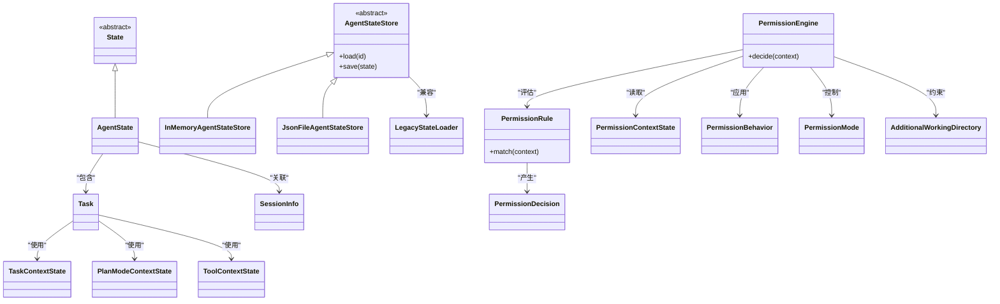

图表来源
- [AgentState.java](file://agentscope-core/src/main/java/io/agentscope/core/state/AgentState.java)
- [State.java](file://agentscope-core/src/main/java/io/agentscope/core/state/State.java)
- [AgentStateStore.java](file://agentscope-core/src/main/java/io/agentscope/core/state/AgentStateStore.java)
- [InMemoryAgentStateStore.java](file://agentscope-core/src/main/java/io/agentscope/core/state/InMemoryAgentStateStore.java)
- [JsonFileAgentStateStore.java](file://agentscope-core/src/main/java/io/agentscope/core/state/JsonFileAgentStateStore.java)
- [Task.java](file://agentscope-core/src/main/java/io/agentscope/core/state/Task.java)
- [TaskContextState.java](file://agentscope-core/src/main/java/io/agentscope/core/state/TaskContextState.java)
- [PlanModeContextState.java](file://agentscope-core/src/main/java/io/agentscope/core/state/PlanModeContextState.java)
- [ToolContextState.java](file://agentscope-core/src/main/java/io/agentscope/core/state/ToolContextState.java)
- [SessionInfo.java](file://agentscope-core/src/main/java/io/agentscope/core/state/SessionInfo.java)
- [LegacyStateLoader.java](file://agentscope-core/src/main/java/io/agentscope/core/state/LegacyStateLoader.java)
- [PermissionEngine.java](file://agentscope-core/src/main/java/io/agentscope/core/permission/PermissionEngine.java)
- [PermissionRule.java](file://agentscope-core/src/main/java/io/agentscope/core/permission/PermissionRule.java)
- [PermissionDecision.java](file://agentscope-core/src/main/java/io/agentscope/core/permission/PermissionDecision.java)
- [PermissionContextState.java](file://agentscope-core/src/main/java/io/agentscope/core/permission/PermissionContextState.java)
- [PermissionBehavior.java](file://agentscope-core/src/main/java/io/agentscope/core/permission/PermissionBehavior.java)
- [PermissionMode.java](file://agentscope-core/src/main/java/io/agentscope/core/permission/PermissionMode.java)
- [AdditionalWorkingDirectory.java](file://agentscope-core/src/main/java/io/agentscope/core/permission/AdditionalWorkingDirectory.java)

章节来源
- [AgentStateStore.java](file://agentscope-core/src/main/java/io/agentscope/core/state/AgentStateStore.java)
- [InMemoryAgentStateStore.java](file://agentscope-core/src/main/java/io/agentscope/core/state/InMemoryAgentStateStore.java)
- [JsonFileAgentStateStore.java](file://agentscope-core/src/main/java/io/agentscope/core/state/JsonFileAgentStateStore.java)
- [Task.java](file://agentscope-core/src/main/java/io/agentscope/core/state/Task.java)
- [TaskContextState.java](file://agentscope-core/src/main/java/io/agentscope/core/state/TaskContextState.java)
- [PlanModeContextState.java](file://agentscope-core/src/main/java/io/agentscope/core/state/PlanModeContextState.java)
- [ToolContextState.java](file://agentscope-core/src/main/java/io/agentscope/core/state/ToolContextState.java)
- [SessionInfo.java](file://agentscope-core/src/main/java/io/agentscope/core/state/SessionInfo.java)
- [LegacyStateLoader.java](file://agentscope-core/src/main/java/io/agentscope/core/state/LegacyStateLoader.java)
- [PermissionEngine.java](file://agentscope-core/src/main/java/io/agentscope/core/permission/PermissionEngine.java)
- [PermissionRule.java](file://agentscope-core/src/main/java/io/agentscope/core/permission/PermissionRule.java)
- [PermissionDecision.java](file://agentscope-core/src/main/java/io/agentscope/core/permission/PermissionDecision.java)
- [PermissionContextState.java](file://agentscope-core/src/main/java/io/agentscope/core/permission/PermissionContextState.java)
- [PermissionBehavior.java](file://agentscope-core/src/main/java/io/agentscope/core/permission/PermissionBehavior.java)
- [PermissionMode.java](file://agentscope-core/src/main/java/io/agentscope/core/permission/PermissionMode.java)
- [AdditionalWorkingDirectory.java](file://agentscope-core/src/main/java/io/agentscope/core/permission/AdditionalWorkingDirectory.java)

### 优雅停机与中断API
- 优雅停机：GracefulShutdownManager、GracefulShutdownConfig、GracefulShutdownMiddleware、ShutdownState、ShutdownStateSaver、ActiveRequestContext、AgentShuttingDownException、AgentScopeJvmShutdownHook
- 中断：InterruptContext、InterruptControl、InterruptSource

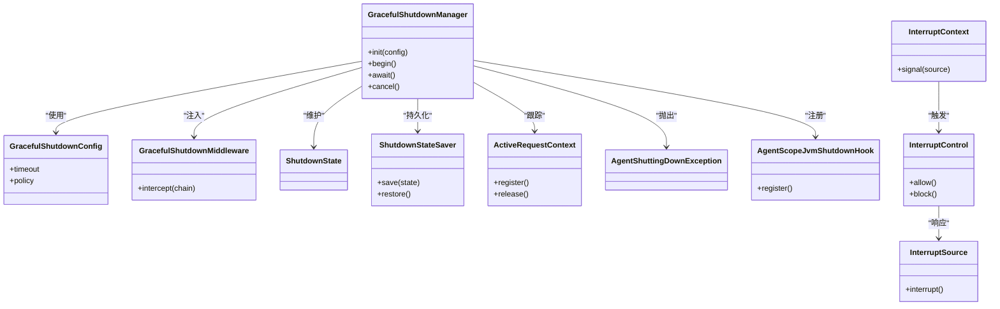

图表来源
- [GracefulShutdownManager.java](file://agentscope-core/src/main/java/io/agentscope/core/shutdown/GracefulShutdownManager.java)
- [GracefulShutdownConfig.java](file://agentscope-core/src/main/java/io/agentscope/core/shutdown/GracefulShutdownConfig.java)
- [GracefulShutdownMiddleware.java](file://agentscope-core/src/main/java/io/agentscope/core/shutdown/GracefulShutdownMiddleware.java)
- [ShutdownState.java](file://agentscope-core/src/main/java/io/agentscope/core/shutdown/ShutdownState.java)
- [ShutdownStateSaver.java](file://agentscope-core/src/main/java/io/agentscope/core/shutdown/ShutdownStateSaver.java)
- [ActiveRequestContext.java](file://agentscope-core/src/main/java/io/agentscope/core/shutdown/ActiveRequestContext.java)
- [AgentShuttingDownException.java](file://agentscope-core/src/main/java/io/agentscope/core/shutdown/AgentShuttingDownException.java)
- [AgentScopeJvmShutdownHook.java](file://agentscope-core/src/main/java/io/agentscope/core/shutdown/AgentScopeJvmShutdownHook.java)
- [InterruptContext.java](file://agentscope-core/src/main/java/io/agentscope/core/interruption/InterruptContext.java)
- [InterruptControl.java](file://agentscope-core/src/main/java/io/agentscope/core/interruption/InterruptControl.java)
- [InterruptSource.java](file://agentscope-core/src/main/java/io/agentscope/core/interruption/InterruptSource.java)

章节来源
- [GracefulShutdownManager.java](file://agentscope-core/src/main/java/io/agentscope/core/shutdown/GracefulShutdownManager.java)
- [GracefulShutdownConfig.java](file://agentscope-core/src/main/java/io/agentscope/core/shutdown/GracefulShutdownConfig.java)
- [GracefulShutdownMiddleware.java](file://agentscope-core/src/main/java/io/agentscope/core/shutdown/GracefulShutdownMiddleware.java)
- [ShutdownState.java](file://agentscope-core/src/main/java/io/agentscope/core/shutdown/ShutdownState.java)
- [ShutdownStateSaver.java](file://agentscope-core/src/main/java/io/agentscope/core/shutdown/ShutdownStateSaver.java)
- [ActiveRequestContext.java](file://agentscope-core/src/main/java/io/agentscope/core/shutdown/ActiveRequestContext.java)
- [AgentShuttingDownException.java](file://agentscope-core/src/main/java/io/agentscope/core/shutdown/AgentShuttingDownException.java)
- [InterruptContext.java](file://agentscope-core/src/main/java/io/agentscope/core/interruption/InterruptContext.java)
- [InterruptControl.java](file://agentscope-core/src/main/java/io/agentscope/core/interruption/InterruptControl.java)
- [InterruptSource.java](file://agentscope-core/src/main/java/io/agentscope/core/interruption/InterruptSource.java)

### 追踪与工具集API
- 追踪：Tracer、NoopTracer、OtelTracingMiddleware、TracerRegistry
- 工具集：JsonUtils、JacksonJsonCodec、JsonCodec、JsonSchemaUtils、MessageUtils、TypeUtils、ExceptionUtils、JsonException

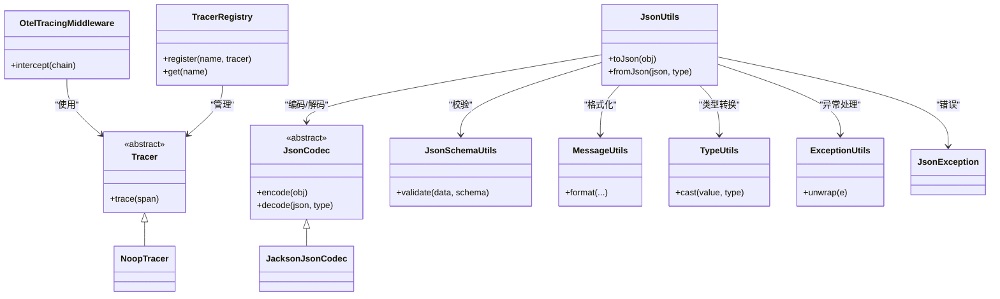

图表来源
- [Tracer.java](file://agentscope-core/src/main/java/io/agentscope/core/tracing/Tracer.java)
- [NoopTracer.java](file://agentscope-core/src/main/java/io/agentscope/core/tracing/NoopTracer.java)
- [OtelTracingMiddleware.java](file://agentscope-core/src/main/java/io/agentscope/core/tracing/OtelTracingMiddleware.java)
- [TracerRegistry.java](file://agentscope-core/src/main/java/io/agentscope/core/tracing/TracerRegistry.java)
- [JsonUtils.java](file://agentscope-core/src/main/java/io/agentscope/core/util/JsonUtils.java)
- [JacksonJsonCodec.java](file://agentscope-core/src/main/java/io/agentscope/core/util/JacksonJsonCodec.java)
- [JsonCodec.java](file://agentscope-core/src/main/java/io/agentscope/core/util/JsonCodec.java)
- [JsonSchemaUtils.java](file://agentscope-core/src/main/java/io/agentscope/core/util/JsonSchemaUtils.java)
- [MessageUtils.java](file://agentscope-core/src/main/java/io/agentscope/core/util/MessageUtils.java)
- [TypeUtils.java](file://agentscope-core/src/main/java/io/agentscope/core/util/TypeUtils.java)
- [ExceptionUtils.java](file://agentscope-core/src/main/java/io/agentscope/core/util/ExceptionUtils.java)
- [JsonException.java](file://agentscope-core/src/main/java/io/agentscope/core/util/JsonException.java)

章节来源
- [Tracer.java](file://agentscope-core/src/main/java/io/agentscope/core/tracing/Tracer.java)
- [NoopTracer.java](file://agentscope-core/src/main/java/io/agentscope/core/tracing/NoopTracer.java)
- [OtelTracingMiddleware.java](file://agentscope-core/src/main/java/io/agentscope/core/tracing/OtelTracingMiddleware.java)
- [TracerRegistry.java](file://agentscope-core/src/main/java/io/agentscope/core/tracing/TracerRegistry.java)
- [JsonUtils.java](file://agentscope-core/src/main/java/io/agentscope/core/util/JsonUtils.java)
- [JacksonJsonCodec.java](file://agentscope-core/src/main/java/io/agentscope/core/util/JacksonJsonCodec.java)
- [JsonCodec.java](file://agentscope-core/src/main/java/io/agentscope/core/util/JsonCodec.java)
- [JsonSchemaUtils.java](file://agentscope-core/src/main/java/io/agentscope/core/util/JsonSchemaUtils.java)
- [MessageUtils.java](file://agentscope-core/src/main/java/io/agentscope/core/util/MessageUtils.java)
- [TypeUtils.java](file://agentscope-core/src/main/java/io/agentscope/core/util/TypeUtils.java)
- [ExceptionUtils.java](file://agentscope-core/src/main/java/io/agentscope/core/util/ExceptionUtils.java)
- [JsonException.java](file://agentscope-core/src/main/java/io/agentscope/core/util/JsonException.java)

### 扩展API概览
- 渠道（Channel）：钉钉、飞书、GitHub、GitLab、企业微信
- 内存（Memory）：Mem0、百炼
- 分布式存储：MySQL、Redis
- 沙箱（Sandbox）：Daytona、E2B、Kubernetes
- 调度（Scheduler）：Quartz、XXL-Job
- 技能仓库（Skill Repository）：Git、MySQL、PostgreSQL
- Spring Boot Starter：A2A、Admin、AGUI、Chat Completions Web、Nacos、AgentScope

章节来源
- [DingTalkChannel.java](file://agentscope-extensions/agentscope-extensions-channel-dingtalk/src/main/java/io/agentscope/extensions/channel/dingtalk/DingTalkChannel.java)
- [FeishuChannel.java](file://agentscope-extensions/agentscope-extensions-channel-feishu/src/main/java/io/agentscope/extensions/channel/feishu/FeishuChannel.java)
- [GitHubChannel.java](file://agentscope-extensions/agentscope-extensions-channel-github/src/main/java/io/agentscope/extensions/channel/github/GitHubChannel.java)
- [GitLabChannel.java](file://agentscope-extensions/agentscope-extensions-channel-gitlab/src/main/java/io/agentscope/extensions/channel/gitlab/GitLabChannel.java)
- [WeComChannel.java](file://agentscope-extensions/agentscope-extensions-channel-wecom/src/main/java/io/agentscope/extensions/channel/wecom/WeComChannel.java)
- [Mem0Memory.java](file://agentscope-extensions/agentscope-extensions-mem/agentscope-extensions-mem0/src/main/java/io/agentscope/core/memory/mem0/Mem0Memory.java)
- [BailianMemory.java](file://agentscope-extensions/agentscope-extensions-mem/agentscope-extensions-memory-bailian/src/main/java/io/agentscope/core/memory/bailian/BailianMemory.java)
- [MysqlDistributedStore.java](file://agentscope-extensions/agentscope-extensions-mysql/src/main/java/io/agentscope/extensions/mysql/MysqlDistributedStore.java)
- [RedisDistributedStore.java](file://agentscope-extensions/agentscope-extensions-redis/src/main/java/io/agentscope/extensions/redis/RedisDistributedStore.java)
- [DaytonaSandbox.java](file://agentscope-extensions/agentscope-extensions-sandbox-daytona/src/main/java/io/agentscope/extensions/sandbox/daytona/DaytonaSandbox.java)
- [E2BSandbox.java](file://agentscope-extensions/agentscope-extensions-sandbox-e2b/src/main/java/io/agentscope/extensions/sandbox/e2b/E2BSandbox.java)
- [KubernetesSandbox.java](file://agentscope-extensions/agentscope-extensions-sandbox-kubernetes/src/main/java/io/agentscope/extensions/sandbox/kubernetes/KubernetesSandbox.java)
- [QuartzScheduler.java](file://agentscope-extensions/agentscope-extensions-scheduler-quartz/src/main/java/io/agentscope/extensions/scheduler/quartz/QuartzScheduler.java)
- [XxlJobScheduler.java](file://agentscope-extensions/agentscope-extensions-scheduler-xxl-job/src/main/java/io/agentscope/extensions/scheduler/xxl-job/XxlJobScheduler.java)
- [NacosSkillRepository.java](file://agentscope-extensions/agentscope-extensions-skills/agentscope-extensions-skill-git-repository/src/main/java/io/agentscope/extensions/skill/git/repository/NacosSkillRepository.java)
- [MysqlSkillRepository.java](file://agentscope-extensions/agentscope-extensions-skills/agentscope-extensions-skill-mysql-repository/src/main/java/io/agentscope/extensions/skill/mysql/repository/NacosSkillRepository.java)
- [PostgresqlSkillRepository.java](file://agentscope-extensions/agentscope-extensions-skills/agentscope-extensions-skill-postgresql-repository/src/main/java/io/agentscope/extensions/skill/postgresql/repository/NacosSkillRepository.java)
- [AgentScopeSpringBootStarter.java](file://agentscope-extensions/agentscope-spring-boot-starters/agentscope-spring-boot-starter/src/main/java/io/agentscope/core/AgentScopeSpringBootStarter.java)

## 依赖关系分析
AgentScope通过模块化设计实现高内聚低耦合：核心内核提供抽象与通用实现，扩展模块通过SPI或直接依赖的方式增强能力。中间件链贯穿代理生命周期，事件与钩子提供横切关注点，状态与权限保障运行安全，追踪与工具集提升可观测性与易用性。

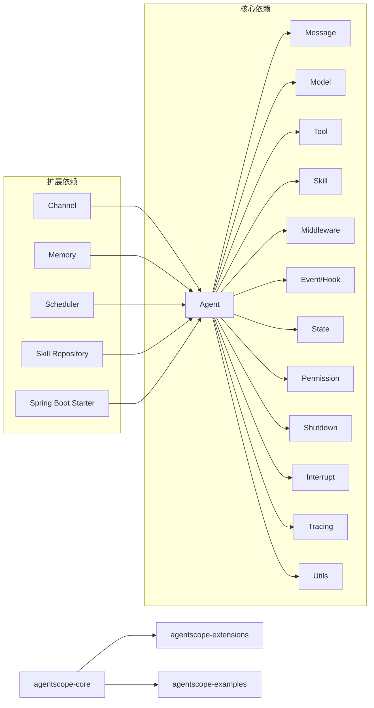

图表来源
- [Agent.java](file://agentscope-core/src/main/java/io/agentscope/core/agent/Agent.java)
- [Msg.java](file://agentscope-core/src/main/java/io/agentscope/core/message/Msg.java)
- [Model.java](file://agentscope-core/src/main/java/io/agentscope/core/model/Model.java)
- [Tool.java](file://agentscope-core/src/main/java/io/agentscope/core/tool/Tool.java)
- [SkillBox.java](file://agentscope-core/src/main/java/io/agentscope/core/skill/SkillBox.java)
- [MiddlewareChain.java](file://agentscope-core/src/main/java/io/agentscope/core/middleware/MiddlewareChain.java)
- [AgentEventEmitter.java](file://agentscope-core/src/main/java/io/agentscope/core/event/AgentEventEmitter.java)
- [Hook.java](file://agentscope-core/src/main/java/io/agentscope/core/hook/Hook.java)
- [AgentStateStore.java](file://agentscope-core/src/main/java/io/agentscope/core/state/AgentStateStore.java)
- [PermissionEngine.java](file://agentscope-core/src/main/java/io/agentscope/core/permission/PermissionEngine.java)
- [GracefulShutdownManager.java](file://agentscope-core/src/main/java/io/agentscope/core/shutdown/GracefulShutdownManager.java)
- [InterruptContext.java](file://agentscope-core/src/main/java/io/agentscope/core/interruption/InterruptContext.java)
- [Tracer.java](file://agentscope-core/src/main/java/io/agentscope/core/tracing/Tracer.java)
- [JsonUtils.java](file://agentscope-core/src/main/java/io/agentscope/core/util/JsonUtils.java)

## 性能考虑
- 模型调用
  - 使用流式响应（stream）降低首字延迟，合理设置超时与重试策略
  - 复用模型实例与连接池，避免频繁创建销毁
- 工具执行
  - 异步执行长耗时工具，配合上下文存储与结果转换器
  - 对外部系统调用进行并发限制与熔断保护
- 代理生命周期
  - 合理使用中间件链，避免深度嵌套导致的性能损耗
  - 在可观测代理中按需订阅事件，减少事件风暴
- 状态与权限
  - 优先选择内存状态存储用于短期会话，文件存储用于持久化
  - 权限决策应尽量缓存，避免重复计算
- 追踪与日志
  - 控制采样率，避免追踪开销过大
  - 使用轻量级编码器与序列化工具

## 故障排查指南
- 参数校验与异常
  - 工具与模型输入参数必须满足Schema约束，使用工具验证器与JSON Schema校验工具
  - 消息内容块与工具调用状态需保持一致性，避免状态错配
- 错误事件与恢复
  - 订阅ErrorEvent捕获运行期异常，结合ExceptionUtils进行异常解包
  - 对AgentShuttingDownException进行特殊处理，确保资源释放
- 中断与优雅停机
  - 使用InterruptControl在关键节点检查中断信号，及时终止危险操作
  - 通过GracefulShutdownMiddleware与ShutdownStateSaver保证停机过程可控
- 日志与追踪
  - 结合OtelTracingMiddleware与TracerRegistry定位问题根因
  - 使用JsonException与JsonSchemaUtils辅助诊断序列化与校验失败

章节来源
- [ToolValidator.java](file://agentscope-core/src/main/java/io/agentscope/core/tool/ToolValidator.java)
- [JsonSchemaUtils.java](file://agentscope-core/src/main/java/io/agentscope/core/util/JsonSchemaUtils.java)
- [ExceptionUtils.java](file://agentscope-core/src/main/java/io/agentscope/core/util/ExceptionUtils.java)
- [AgentShuttingDownException.java](file://agentscope-core/src/main/java/io/agentscope/core/shutdown/AgentShuttingDownException.java)
- [InterruptControl.java](file://agentscope-core/src/main/java/io/agentscope/core/interruption/InterruptControl.java)
- [GracefulShutdownMiddleware.java](file://agentscope-core/src/main/java/io/agentscope/core/shutdown/GracefulShutdownMiddleware.java)
- [OtelTracingMiddleware.java](file://agentscope-core/src/main/java/io/agentscope/core/tracing/OtelTracingMiddleware.java)
- [TracerRegistry.java](file://agentscope-core/src/main/java/io/agentscope/core/tracing/TracerRegistry.java)
- [JsonException.java](file://agentscope-core/src/main/java/io/agentscope/core/util/JsonException.java)

## 结论
AgentScope通过清晰的分层与模块化设计，提供了从代理到工具、从消息到事件、从状态到权限的全栈能力，并通过扩展模块实现渠道、内存、调度与Spring Boot集成。开发者可依据本文档的API参考与最佳实践，快速构建稳定、可观测、可扩展的智能体应用。

## 附录
- 版本兼容性与废弃策略
  - 版本号遵循语义化版本，主版本变更可能引入破坏性更新
  - 废弃功能会在当前主版本中保留并标注，下一主版本移除
  - 迁移指南：关注ChangeLog与注释中的迁移提示，逐步替换旧接口
- 迁移示例路径
  - 代理实现：从旧版ObservableAgent迁移到新版StreamableAgent
  - 工具注册：从ToolRegistry.registerOld迁移到新的工厂模式
  - 中间件：从LegacyHookDispatcher迁移到Hook与MiddlewareChain
- 最佳实践
  - 明确职责边界，避免在代理中直接耦合外部系统
  - 使用工具结果转换器统一输出格式
  - 为每个关键流程添加钩子与追踪，便于排障
  - 合理配置权限与工作目录，确保沙箱安全

章节来源
- [Version.java](file://agentscope-core/src/main/java/io/agentscope/core/Version.java)
- [CompositeAgentException.java](file://agentscope-core/src/main/java/io/agentscope/core/exception/CompositeAgentException.java)
