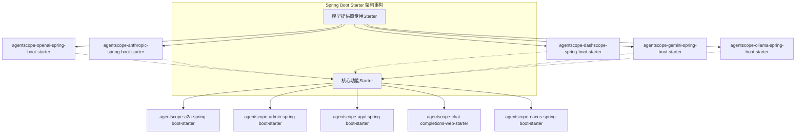
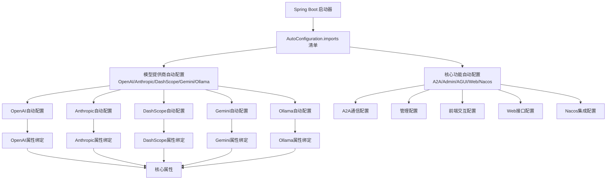
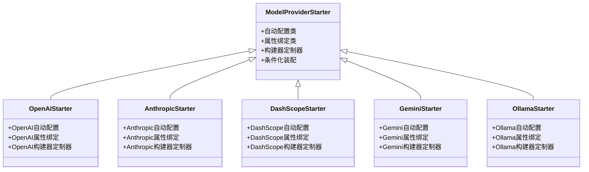
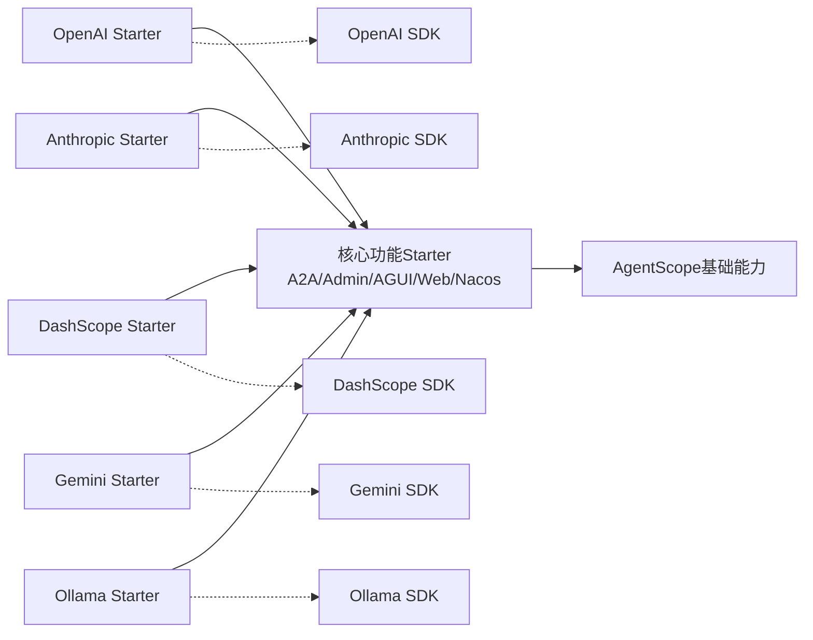

# Spring Boot集成

<cite>
**本文引用的文件**
- [agentscope-openai-spring-boot-starter](file://agentscope-extensions/agentscope-spring-boot-starters/agentscope-openai-spring-boot-starter)
- [agentscope-anthropic-spring-boot-starter](file://agentscope-extensions/agentscope-spring-boot-starters/agentscope-anthropic-spring-boot-starter)
- [agentscope-dashscope-spring-boot-starter](file://agentscope-extensions/agentscope-spring-boot-starters/agentscope-dashscope-spring-boot-starter)
- [agentscope-gemini-spring-boot-starter](file://agentscope-extensions/agentscope-spring-boot-starters/agentscope-gemini-spring-boot-starter)
- [agentscope-ollama-spring-boot-starter](file://agentscope-extensions/agentscope-spring-boot-starters/agentscope-ollama-spring-boot-starter)
- [agentscope-a2a-spring-boot-starter](file://agentscope-extensions/agentscope-spring-boot-starters/agentscope-a2a-spring-boot-starter)
- [agentscope-admin-spring-boot-starter](file://agentscope-extensions/agentscope-spring-boot-starters/agentscope-admin-spring-boot-starter)
- [agentscope-agui-spring-boot-starter](file://agentscope-extensions/agentscope-spring-boot-starters/agentscope-agui-spring-boot-starter)
- [agentscope-nacos-spring-boot-starter](file://agentscope-extensions/agentscope-spring-boot-starters/agentscope-nacos-spring-boot-starter)
- [agentscope-chat-completions-web-starter](file://agentscope-extensions/agentscope-spring-boot-starters/agentscope-chat-completions-web-starter)
</cite>

## 更新摘要
**所做更改**
- 重构了Spring Boot Starter架构，从单体starter拆分为provider-specific starters
- 新增OpenAI、Anthropic、DashScope、Gemini、Ollama等独立模型提供商Starter
- 每个Starter包含独立的自动配置类和构建器定制器
- 更新了项目结构图和组件关系图以反映新的架构设计

## 目录
1. [简介](#简介)
2. [项目结构](#项目结构)
3. [核心组件](#核心组件)
4. [架构总览](#架构总览)
5. [详细组件分析](#详细组件分析)
6. [依赖关系分析](#依赖关系分析)
7. [性能考虑](#性能考虑)
8. [故障排除指南](#故障排除指南)
9. [结论](#结论)
10. [附录](#附录)

## 简介
本技术文档面向在Spring Boot中集成AgentScope的开发者与运维人员，系统性阐述Spring Boot Starter的自动配置机制、组件扫描与依赖注入策略；详解各starter模块的功能特性、配置项与适用场景；并结合微服务架构给出集成模式、服务发现与配置管理建议。同时覆盖与Spring Cloud的协同、安全认证与监控告警实践，并提供最佳实践、性能优化与故障排除指南，以及可落地的项目示例与部署方案。

**更新** 架构已重构为provider-specific starters，每个模型提供商都有独立的Starter模块，提供更好的模块化和解耦能力。

## 项目结构
AgentScope的Spring Boot集成采用"多模块Starter"架构，现已重构为基于模型提供商的专用Starter设计。每个功能域独立封装为一个starter模块，通过Spring Boot的自动配置机制按需装配。核心starter位于agentscope-spring-boot-starters目录下，包含：

- **模型提供商专用Starter**：
  - agentscope-openai-spring-boot-starter（OpenAI模型支持）
  - agentscope-anthropic-spring-boot-starter（Anthropic Claude模型支持）
  - agentscope-dashscope-spring-boot-starter（阿里云DashScope模型支持）
  - agentscope-gemini-spring-boot-starter（Google Gemini模型支持）
  - agentscope-ollama-spring-boot-starter（本地Ollama模型支持）

- **功能扩展Starter**：a2a、admin、agui、chat-completions-web、nacos等

**图表来源**
- [agentscope-openai-spring-boot-starter](file://agentscope-extensions/agentscope-spring-boot-starters/agentscope-openai-spring-boot-starter)
- [agentscope-anthropic-spring-boot-starter](file://agentscope-extensions/agentscope-spring-boot-starters/agentscope-anthropic-spring-boot-starter)
- [agentscope-dashscope-spring-boot-starter](file://agentscope-extensions/agentscope-spring-boot-starters/agentscope-dashscope-spring-boot-starter)
- [agentscope-gemini-spring-boot-starter](file://agentscope-extensions/agentscope-spring-boot-starters/agentscope-gemini-spring-boot-starter)
- [agentscope-ollama-spring-boot-starter](file://agentscope-extensions/agentscope-spring-boot-starters/agentscope-ollama-spring-boot-starter)

## 核心组件
- **自动配置入口**
  - 每个模型提供商Starter都提供独立的AutoConfiguration类，实现特定模型的自动装配。
  - 通过AutoConfiguration.imports声明自动配置类，由Spring Boot在启动时扫描并装配。
  - 支持条件化装配，仅在相关依赖存在时启用对应功能。

- **属性绑定**
  - 每个模型提供商Starter提供专用的Properties类进行配置绑定。
  - 统一的AgentscopeProperties用于全局开关与默认行为控制。
  - 支持模型提供商类型枚举与默认参数设置，便于在不同环境切换。

- **构建器定制器**
  - 每个Starter提供BuilderCustomizer接口实现，允许自定义模型构建逻辑。
  - 支持链式配置和条件化Bean创建。

**章节来源**
- [agentscope-openai-spring-boot-starter](file://agentscope-extensions/agentscope-spring-boot-starters/agentscope-openai-spring-boot-starter)
- [agentscope-anthropic-spring-boot-starter](file://agentscope-extensions/agentscope-spring-boot-starters/agentscope-anthropic-spring-boot-starter)
- [agentscope-dashscope-spring-boot-starter](file://agentscope-extensions/agentscope-spring-boot-starters/agentscope-dashscope-spring-boot-starter)
- [agentscope-gemini-spring-boot-starter](file://agentscope-extensions/agentscope-spring-boot-starters/agentscope-gemini-spring-boot-starter)
- [agentscope-ollama-spring-boot-starter](file://agentscope-extensions/agentscope-spring-boot-starters/agentscope-ollama-spring-boot-starter)

## 架构总览
下图展示了Spring Boot启动阶段如何通过AutoConfiguration导入清单装配AgentScope相关组件，以及重构后的Starter之间的依赖关系。

**图表来源**
- [agentscope-openai-spring-boot-starter](file://agentscope-extensions/agentscope-spring-boot-starters/agentscope-openai-spring-boot-starter)
- [agentscope-anthropic-spring-boot-starter](file://agentscope-extensions/agentscope-spring-boot-starters/agentscope-anthropic-spring-boot-starter)
- [agentscope-dashscope-spring-boot-starter](file://agentscope-extensions/agentscope-spring-boot-starters/agentscope-dashscope-spring-boot-starter)
- [agentscope-gemini-spring-boot-starter](file://agentscope-extensions/agentscope-spring-boot-starters/agentscope-gemini-spring-boot-starter)
- [agentscope-ollama-spring-boot-starter](file://agentscope-extensions/agentscope-spring-boot-starters/agentscope-ollama-spring-boot-starter)

## 详细组件分析

### 模型提供商专用Starter架构
**更新** 架构已从单体starter重构为provider-specific starters，每个模型提供商都有独立的Starter模块。

- **OpenAI Starter**
  - 提供OpenAI API的完整支持，包括ChatGPT、Embeddings等功能
  - 独立的自动配置类和属性绑定类
  - 支持流式响应和异步调用

- **Anthropic Starter**
  - 提供Claude模型的完整支持
  - 独立的自动配置和构建器定制器
  - 支持系统提示词和消息历史管理

- **DashScope Starter**
  - 提供阿里云DashScope平台支持
  - 支持通义千问等国内大模型
  - 集成阿里云认证和限流机制

- **Gemini Starter**
  - 提供Google Gemini模型支持
  - 支持多模态输入输出
  - 集成Google Cloud认证

- **Ollama Starter**
  - 提供本地Ollama服务支持
  - 支持开源模型本地部署
  - 简化本地开发调试流程

**图表来源**
- [agentscope-openai-spring-boot-starter](file://agentscope-extensions/agentscope-spring-boot-starters/agentscope-openai-spring-boot-starter)
- [agentscope-anthropic-spring-boot-starter](file://agentscope-extensions/agentscope-spring-boot-starters/agentscope-anthropic-spring-boot-starter)
- [agentscope-dashscope-spring-boot-starter](file://agentscope-extensions/agentscope-spring-boot-starters/agentscope-dashscope-spring-boot-starter)
- [agentscope-gemini-spring-boot-starter](file://agentscope-extensions/agentscope-spring-boot-starters/agentscope-gemini-spring-boot-starter)
- [agentscope-ollama-spring-boot-starter](file://agentscope-extensions/agentscope-spring-boot-starters/agentscope-ollama-spring-boot-starter)

### 核心功能Starter
- **A2A通信Starter**
  - 提供Agent到Agent的通信能力
  - 包含控制器、监听器、属性配置与运行器
  - 通过AutoConfiguration导入清单启用A2A自动配置

- **管理与可观测性Starter**
  - 提供审计、命令、控制器、DTO、端点、指标、注册表、服务、快照与子Agent管理等能力
  - 通过AutoConfiguration导入清单启用管理与可观测性自动配置

- **前端交互注册Starter**
  - 提供前端交互注册能力，包含通用组件与MVC/WebFlux适配
  - 通过AutoConfiguration导入清单启用前端交互注册

- **聊天补全Web接口Starter**
  - 提供聊天补全的Web接口能力，包含配置、服务与Web层
  - 通过AutoConfiguration导入清单启用聊天补全Web接口

- **Nacos集成Starter**
  - 提供与Nacos的服务注册与配置中心集成能力
  - 通过AutoConfiguration导入清单启用Nacos集成

**章节来源**
- [agentscope-a2a-spring-boot-starter](file://agentscope-extensions/agentscope-spring-boot-starters/agentscope-a2a-spring-boot-starter)
- [agentscope-admin-spring-boot-starter](file://agentscope-extensions/agentscope-spring-boot-starters/agentscope-admin-spring-boot-starter)
- [agentscope-agui-spring-boot-starter](file://agentscope-extensions/agentscope-spring-boot-starters/agentscope-agui-spring-boot-starter)
- [agentscope-chat-completions-web-starter](file://agentscope-extensions/agentscope-spring-boot-starters/agentscope-chat-completions-web-starter)
- [agentscope-nacos-spring-boot-starter](file://agentscope-extensions/agentscope-spring-boot-starters/agentscope-nacos-spring-boot-starter)

## 依赖关系分析
**更新** 依赖关系已重构，模型提供商Starter现在作为独立模块，通过核心功能Starter提供基础能力。

- **组件耦合**
  - 模型提供商Starter（OpenAI、Anthropic、DashScope、Gemini、Ollama）相互独立，无直接依赖
  - 所有Starter都依赖核心功能Starter提供的Base能力
  - AutoConfiguration.imports是解耦的关键，避免硬编码依赖，提升可插拔性

- **外部依赖**
  - Spring Boot Starter生态（自动配置、条件装配、属性绑定）
  - 各模型提供商SDK（OpenAI、Anthropic、DashScope、Gemini、Ollama）
  - 可选的Nacos、Web框架（MVC/WebFlux）、管理端点等

**图表来源**
- [agentscope-openai-spring-boot-starter](file://agentscope-extensions/agentscope-spring-boot-starters/agentscope-openai-spring-boot-starter)
- [agentscope-anthropic-spring-boot-starter](file://agentscope-extensions/agentscope-spring-boot-starters/agentscope-anthropic-spring-boot-starter)
- [agentscope-dashscope-spring-boot-starter](file://agentscope-extensions/agentscope-spring-boot-starters/agentscope-dashscope-spring-boot-starter)
- [agentscope-gemini-spring-boot-starter](file://agentscope-extensions/agentscope-spring-boot-starters/agentscope-gemini-spring-boot-starter)
- [agentscope-ollama-spring-boot-starter](file://agentscope-extensions/agentscope-spring-boot-starters/agentscope-ollama-spring-boot-starter)

## 性能考虑
- **自动配置与Bean装配**
  - 使用条件化装配，避免不必要的Bean创建；仅在启用对应功能时装配相关组件
  - 模型提供商Starter独立加载，减少启动时的内存占用

- **模型调用**
  - 合理设置超时与重试策略；对高并发场景使用连接池与异步调用
  - 不同模型提供商的HTTP客户端配置独立优化

- **中间件与钩子**
  - 控制中间件链长度，减少不必要的拦截与转换；对耗时操作采用异步化

- **缓存与持久化**
  - 对频繁访问的状态与配置使用缓存；对长时任务采用分布式存储与幂等设计

- **监控与日志**
  - 开启关键指标埋点与链路追踪，定位性能瓶颈；避免过度打印日志影响吞吐

## 故障排除指南
- **自动配置未生效**
  - 检查AutoConfiguration.imports是否正确声明；确认Starter依赖已加入工程
  - 验证模型提供商Starter的依赖是否完整

- **属性绑定失败**
  - 核对配置项命名与层级是否匹配；检查默认值与必填项
  - 确认使用的Properties类与对应的Starter匹配

- **模型调用异常**
  - 校验凭据与Endpoint；查看网络连通性与限流策略；确认SDK版本兼容性
  - 检查对应模型提供商Starter的版本兼容性

- **管理端点不可用**
  - 检查端点暴露与安全配置；确认管理Starter依赖与端点开关

- **Nacos集成问题**
  - 核对注册中心地址与命名空间；检查服务名与分组配置；确认权限与鉴权

## 结论
AgentScope的Spring Boot集成经过重大架构重构，现已采用provider-specific starters设计，实现了更好的模块化和解耦。每个模型提供商都有独立的Starter模块，包含专属的自动配置类和构建器定制器。配合核心功能Starter提供的A2A通信、管理可观测性、前端交互、Web接口与Nacos集成能力，开发者可以按需选择模型提供商和功能模块，快速落地微服务场景。这种架构设计提升了系统的可维护性和可扩展性，同时保持了向后兼容性。

## 附录
- **最佳实践**
  - 明确功能边界，按需引入对应的模型提供商Starter；统一配置命名规范；开启必要的监控与日志
  - 对外暴露的Web接口应具备鉴权与限流；内部服务间采用服务发现与配置中心
  - 根据业务需求选择合适的模型提供商，考虑成本、性能和可用性

- **部署方案**
  - 容器化部署：将Starter打包为镜像，结合Kubernetes进行扩缩容与滚动更新
  - 云原生：接入Nacos作为配置中心与服务注册；结合Prometheus/Grafana做监控告警
  - 多模型提供商混合部署：根据业务场景动态路由到不同的模型提供商

- **迁移指南**
  - 从单体starter迁移到provider-specific starters的步骤
  - 配置文件的重构和迁移方法
  - 依赖管理的调整建议
