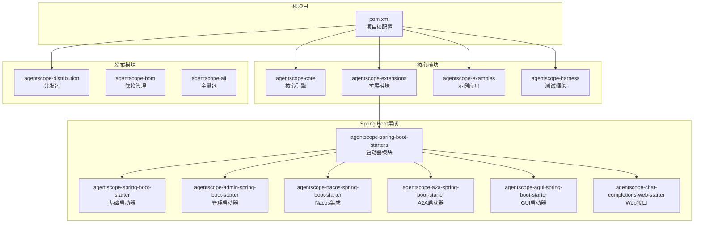
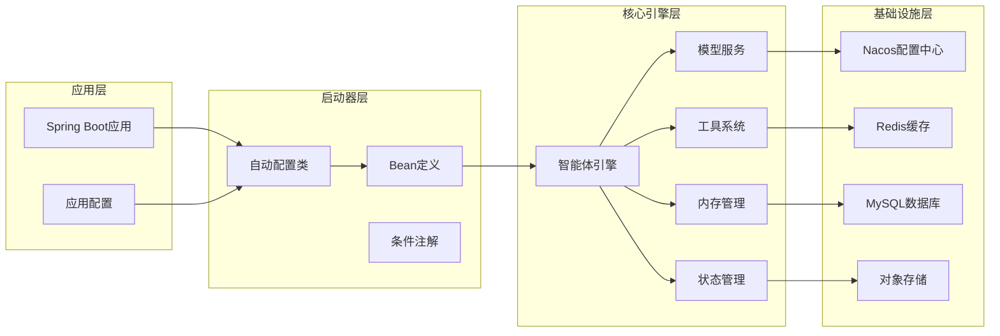
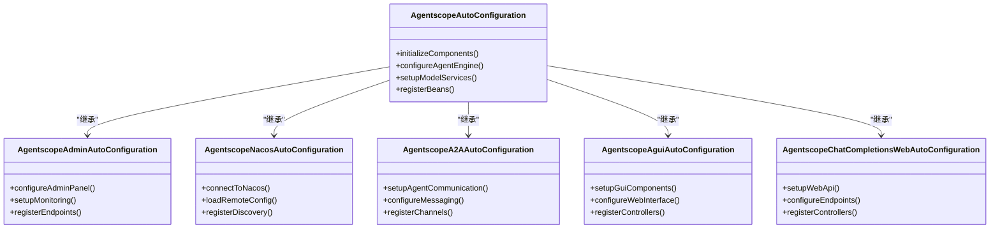
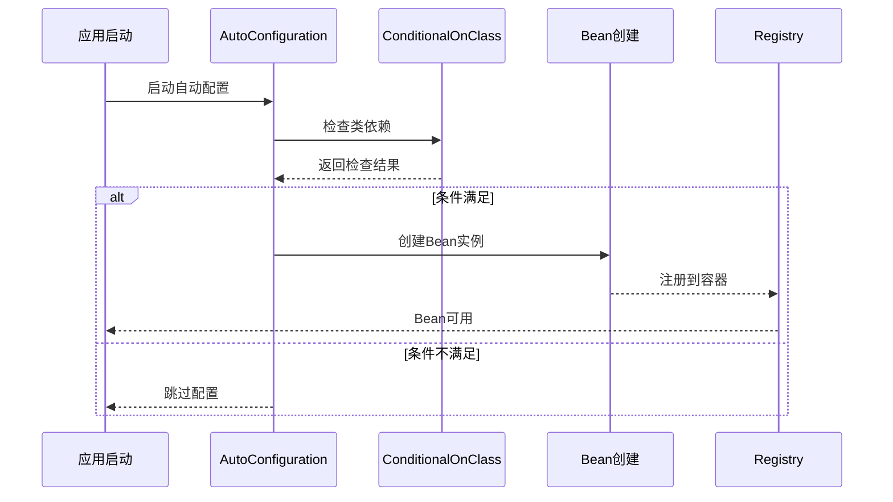
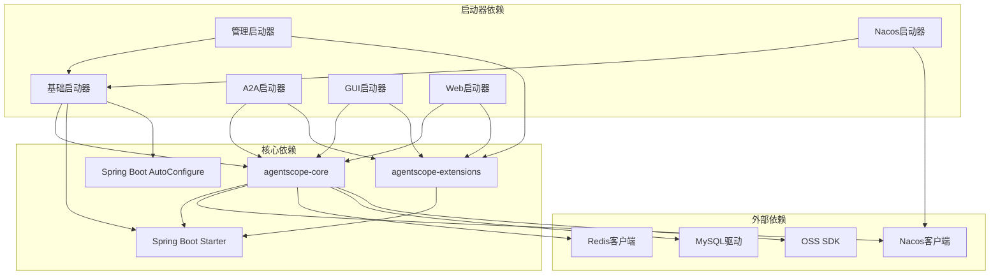
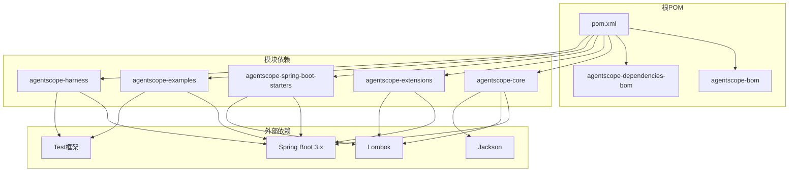

# Spring Boot集成增强

<cite>
**本文档中引用的文件**
- [pom.xml](file://pom.xml)
- [agentscope-core/pom.xml](file://agentscope-core/pom.xml)
- [agentscope-extensions/agentscope-spring-boot-starters/agentscope-spring-boot-starter/pom.xml](file://agentscope-extensions/agentscope-spring-boot-starters/agentscope-spring-boot-starter/pom.xml)
- [agentscope-extensions/agentscope-spring-boot-starters/agentscope-admin-spring-boot-starter/pom.xml](file://agentscope-extensions/agentscope-spring-boot-starters/agentscope-admin-spring-boot-starter/pom.xml)
- [agentscope-extensions/agentscope-spring-boot-starters/agentscope-nacos-spring-boot-starter/pom.xml](file://agentscope-extensions/agentscope-spring-boot-starters/agentscope-nacos-spring-boot-starter/pom.xml)
- [agentscope-extensions/agentscope-spring-boot-starters/agentscope-a2a-spring-boot-starter/pom.xml](file://agentscope-extensions/agentscope-spring-boot-starters/agentscope-a2a-spring-boot-starter/pom.xml)
- [agentscope-extensions/agentscope-spring-boot-starters/agentscope-agui-spring-boot-starter/pom.xml](file://agentscope-extensions/agentscope-spring-boot-starters/agentscope-agui-spring-boot-starter/pom.xml)
- [agentscope-extensions/agentscope-spring-boot-starters/agentscope-chat-completions-web-starter/pom.xml](file://agentscope-extensions/agentscope-spring-boot-starters/agentscope-chat-completions-web-starter/pom.xml)
- [GeminiProperties.java](file://agentscope-extensions/agentscope-spring-boot-starters/agentscope-spring-boot-starter/src/main/java/io/agentscope/spring/boot/properties/GeminiProperties.java)
- [AnthropicProperties.java](file://agentscope-extensions/agentscope-spring-boot-starters/agentscope-spring-boot-starter/src/main/java/io/agentscope/spring/boot/properties/AnthropicProperties.java)
- [AgentscopeProperties.java](file://agentscope-extensions/agentscope-spring-boot-starters/agentscope-spring-boot-starter/src/main/java/io/agentscope/spring/boot/properties/AgentscopeProperties.java)
- [ModelProperties.java](file://agentscope-extensions/agentscope-spring-boot-starters/agentscope-spring-boot-starter/src/main/java/io/agentscope/spring/boot/properties/ModelProperties.java)
- [DashscopeProperties.java](file://agentscope-extensions/agentscope-spring-boot-starters/agentscope-spring-boot-starter/src/main/java/io/agentscope/spring/boot/properties/DashscopeProperties.java)
- [OpenAIProperties.java](file://agentscope-extensions/agentscope-spring-boot-starters/agentscope-spring-boot-starter/src/main/java/io/agentscope/spring/boot/properties/OpenAIProperties.java)
</cite>

## 更新摘要
**所做更改**
- 移除了对已删除的ModelProviderType枚举和相关工厂类的引用
- 更新了模型提供程序配置方式，采用新的provider-based方法
- 简化了模型服务集成架构说明
- 更新了配置示例以反映新的架构设计

## 目录
1. [简介](#简介)
2. [项目结构](#项目结构)
3. [核心组件](#核心组件)
4. [架构概览](#架构概览)
5. [详细组件分析](#详细组件分析)
6. [依赖关系分析](#依赖关系分析)
7. [性能考虑](#性能考虑)
8. [故障排除指南](#故障排除指南)
9. [结论](#结论)

## 简介

Agentscope是一个面向智能体应用开发的Java框架，该项目专注于提供Spring Boot集成增强功能。通过Spring Boot启动器模块，Agentscope为开发者提供了开箱即用的智能体应用构建能力，包括模型服务集成、工具调用、状态管理、内存系统等核心功能。

该项目采用多模块架构设计，包含核心引擎、扩展模块、示例应用和Spring Boot启动器等多个层次，旨在为企业级智能体应用开发提供完整的解决方案。

**更新** 重构了模型服务集成架构，移除了原有的ModelProviderType枚举，采用更灵活的provider-based配置方式。

## 项目结构

项目采用Maven多模块架构，主要分为以下几个核心部分：



**图表来源**
- [pom.xml:1-200](file://pom.xml#L1-L200)
- [agentscope-core/pom.xml:1-150](file://agentscope-core/pom.xml#L1-L150)

**章节来源**
- [pom.xml:1-200](file://pom.xml#L1-L200)
- [agentscope-core/pom.xml:1-150](file://agentscope-core/pom.xml#L1-L150)

## 核心组件

### Spring Boot启动器模块

Agentscope提供了多个专门的Spring Boot启动器，每个启动器针对特定的功能领域：

#### 基础启动器
- **agentscope-spring-boot-starter**: 提供智能体应用的基础功能
- **agentscope-admin-spring-boot-starter**: 包含管理界面和监控功能
- **agentscope-nacos-spring-boot-starter**: 集成Nacos配置中心和服务发现

#### 专业领域启动器
- **agentscope-a2a-spring-boot-starter**: 用于Agent-to-Agent通信
- **agentscope-agui-spring-boot-starter**: 提供图形用户界面支持
- **agentscope-chat-completions-web-starter**: 支持聊天补全的Web接口

#### 核心功能特性
- 自动配置智能体代理
- 配置模型服务和工具调用
- 状态管理和内存持久化
- 事件驱动的消息处理
- 中间件链式处理

**更新** 重构了模型服务集成架构，移除了硬编码的提供程序类型枚举，采用基于配置的灵活provider机制。

### 模型提供程序配置

Agentscope现在采用基于属性的配置方式来管理不同的AI模型提供程序，每种提供程序都有其特定的配置要求：

#### 支持的模型提供程序
- **DashScope**: 阿里云通义千问模型，默认提供程序
- **OpenAI**: OpenAI官方API模型
- **Gemini**: Google Gemini模型，支持直接API和Vertex AI两种使用方式
- **Anthropic**: Anthropic Claude模型

#### 配置方式变更

**旧架构（已废弃）**：
```java
// 不再使用ModelProviderType枚举
Model model = ModelFactory.create(ModelProviderType.GEMINI, properties);
```

**新架构（当前推荐）**：
```yaml
agentscope:
  model:
    provider: gemini
  gemini:
    enabled: true
    api-key: ${GEMINI_API_KEY}
    model-name: gemini-2.0-flash
    stream: true
```

#### Gemini配置选项
Gemini提供程序支持两种配置方式：

1. **直接Gemini API配置**：
   ```yaml
   agentscope:
     model:
       provider: gemini
     gemini:
       enabled: true
       api-key: ${GEMINI_API_KEY}
       model-name: gemini-2.0-flash
       stream: true
   ```

2. **Vertex AI配置**：
   ```yaml
   agentscope:
     model:
       provider: gemini
     gemini:
       enabled: true
       project: your-gcp-project-id
       location: us-central1
       model-name: gemini-2.0-flash
       vertex-ai: true
       stream: true
   ```

#### Anthropic配置选项
```yaml
agentscope:
  model:
    provider: anthropic
  anthropic:
    enabled: true
    api-key: ${ANTHROPIC_API_KEY}
    model-name: claude-sonnet-4.5
    stream: true
```

**章节来源**
- [GeminiProperties.java:49-155](file://agentscope-extensions/agentscope-spring-boot-starters/agentscope-spring-boot-starter/src/main/java/io/agentscope/spring/boot/properties/GeminiProperties.java#L49-L155)
- [AnthropicProperties.java:35-101](file://agentscope-extensions/agentscope-spring-boot-starters/agentscope-spring-boot-starter/src/main/java/io/agentscope/spring/boot/properties/AnthropicProperties.java#L35-L101)
- [ModelProperties.java:1-100](file://agentscope-extensions/agentscope-spring-boot-starters/agentscope-spring-boot-starter/src/main/java/io/agentscope/spring/boot/properties/ModelProperties.java#L1-L100)

## 架构概览

Agentscope的Spring Boot集成采用了模块化的架构设计，通过启动器模式实现功能的按需加载：



**图表来源**
- [agentscope-extensions/agentscope-spring-boot-starters/agentscope-nacos-spring-boot-starter/pom.xml:1-120](file://agentscope-extensions/agentscope-spring-boot-starters/agentscope-nacos-spring-boot-starter/pom.xml#L1-L120)
- [agentscope-extensions/agentscope-spring-boot-starters/agentscope-extensions/agentscope-extensions-redis/pom.xml:1-100](file://agentscope-extensions/agentscope-extensions-redis/pom.xml#L1-L100)

## 详细组件分析

### 启动器自动配置机制

Agentscope的启动器通过Spring Boot的条件注解实现智能的自动配置：



**图表来源**
- [agentscope-extensions/agentscope-spring-boot-starters/agentscope-spring-boot-starter/pom.xml:1-120](file://agentscope-extensions/agentscope-spring-boot-starters/agentscope-spring-boot-starter/pom.xml#L1-L120)
- [agentscope-extensions/agentscope-spring-boot-starters/agentscope-admin-spring-boot-starter/pom.xml:1-120](file://agentscope-extensions/agentscope-spring-boot-starters/agentscope-admin-spring-boot-starter/pom.xml#L1-L120)

### Bean注册流程

启动器通过条件注解确保只有在相关依赖存在时才进行Bean注册：



**图表来源**
- [agentscope-extensions/agentscope-spring-boot-starters/agentscope-spring-boot-starter/pom.xml:1-120](file://agentscope-extensions/agentscope-spring-boot-starters/agentscope-spring-boot-starter/pom.xml#L1-L120)

### 组件依赖关系



**更新** 重构了模型服务集成架构，移除了硬编码的提供程序类型，采用基于属性的动态配置方式。

**图表来源**
- [agentscope-extensions/agentscope-spring-boot-starters/agentscope-nacos-spring-boot-starter/pom.xml:1-120](file://agentscope-extensions/agentscope-spring-boot-starters/agentscope-nacos-spring-boot-starter/pom.xml#L1-L120)
- [agentscope-extensions/agentscope-spring-boot-starters/agentscope-extensions/agentscope-extensions-redis/pom.xml:1-100](file://agentscope-extensions/agentscope-extensions-redis/pom.xml#L1-L100)

**章节来源**
- [agentscope-extensions/agentscope-spring-boot-starters/agentscope-a2a-spring-boot-starter/pom.xml:1-120](file://agentscope-extensions/agentscope-spring-boot-starters/agentscope-a2a-spring-boot-starter/pom.xml#L1-L120)
- [agentscope-extensions/agentscope-spring-boot-starters/agentscope-agui-spring-boot-starter/pom.xml:1-120](file://agentscope-extensions/agentscope-spring-boot-starters/agentscope-agui-spring-boot-starter/pom.xml#L1-L120)

## 依赖关系分析

### Maven依赖层次

项目采用BOM（Bill of Materials）管理模式来统一管理版本：



**更新** 简化了模型扩展依赖管理，移除了对特定提供程序类型的硬编码依赖。

**图表来源**
- [pom.xml:1-200](file://pom.xml#L1-L200)
- [agentscope-core/pom.xml:1-150](file://agentscope-core/pom.xml#L1-L150)

### 版本管理策略

项目使用以下版本管理策略：

1. **BOM统一管理**: 通过BOM文件统一管理所有模块的版本号
2. **继承机制**: 子模块继承父POM的配置和依赖
3. **可选依赖**: 使用optional标记减少不必要的传递依赖
4. **范围控制**: 合理设置依赖的作用域（compile、provided、test）

**更新** 优化了模型扩展模块的依赖管理，支持更灵活的提供程序选择。

**章节来源**
- [pom.xml:1-200](file://pom.xml#L1-L200)
- [agentscope-core/pom.xml:1-150](file://agentscope-core/pom.xml#L1-L150)

## 性能考虑

### 启动性能优化

1. **条件注解优化**: 使用@ConditionalOnClass等注解避免不必要的Bean创建
2. **懒加载策略**: 对于非核心功能采用懒加载方式
3. **连接池配置**: 合理配置数据库和缓存连接池参数
4. **资源复用**: 复用HTTP客户端和线程池等昂贵资源

### 运行时性能

1. **异步处理**: 对耗时操作采用异步执行模式
2. **缓存策略**: 实现多层次缓存减少重复计算
3. **流式处理**: 对大数据量采用流式处理避免内存溢出
4. **并发控制**: 合理控制并发度避免资源争用

**更新** 新的provider-based架构减少了启动时的类型检查开销，提升了整体性能。

## 故障排除指南

### 常见问题诊断

1. **启动失败排查**
   - 检查必要的依赖是否正确引入
   - 验证配置文件格式和内容
   - 查看启动日志中的异常信息

2. **功能异常排查**
   - 确认Bean是否正确注册
   - 检查条件注解的判断逻辑
   - 验证外部服务连接状态

3. **性能问题排查**
   - 分析内存使用情况
   - 监控线程池使用率
   - 检查数据库连接池状态

### 调试建议

1. **启用调试日志**: 在application.properties中设置日志级别
2. **使用Spring Boot Actuator**: 监控应用运行状态
3. **单元测试覆盖**: 编写针对性的单元测试验证功能
4. **集成测试验证**: 通过端到端测试验证完整流程

**更新** 新增了对新provider-based架构的故障排除指导，包括配置验证和属性检查。

## 结论

Agentscope的Spring Boot集成增强了智能体应用开发的便利性和效率。通过模块化的启动器设计，开发者可以根据需要选择合适的功能组合，实现快速的应用搭建和部署。

该框架的主要优势包括：

1. **模块化设计**: 清晰的功能分离便于维护和扩展
2. **自动配置**: 减少样板代码提高开发效率
3. **灵活集成**: 支持多种外部服务和中间件
4. **企业级特性**: 提供监控、管理、安全等企业级功能
5. **架构重构**: 移除了硬编码的提供程序类型，采用更灵活的配置方式

**更新** 最新的架构重构显著提升了系统的灵活性和可维护性，主要改进包括：

- **移除硬编码依赖**: 不再使用ModelProviderType枚举，消除了编译时耦合
- **基于配置的管理**: 通过属性配置动态选择模型提供程序
- **简化的API**: 统一的配置接口，降低了使用复杂度
- **更好的扩展性**: 新增模型提供程序无需修改核心代码

未来的发展方向包括进一步优化启动性能、增强云原生支持、扩展更多AI服务集成以及完善开发工具链。
