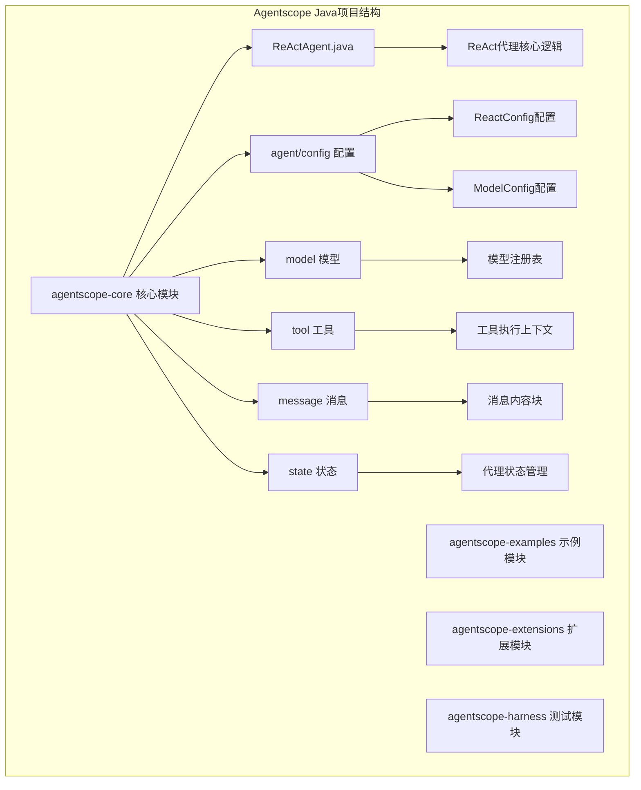
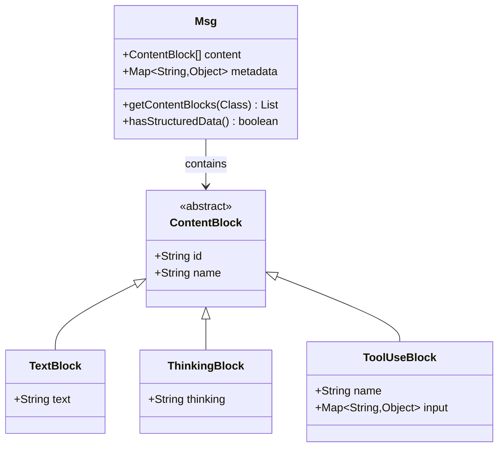
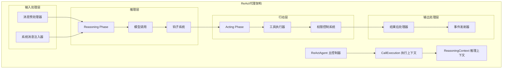
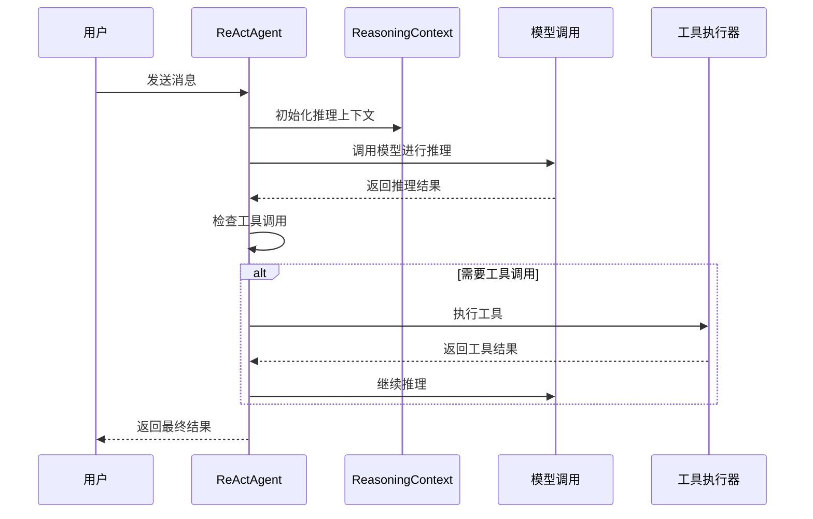
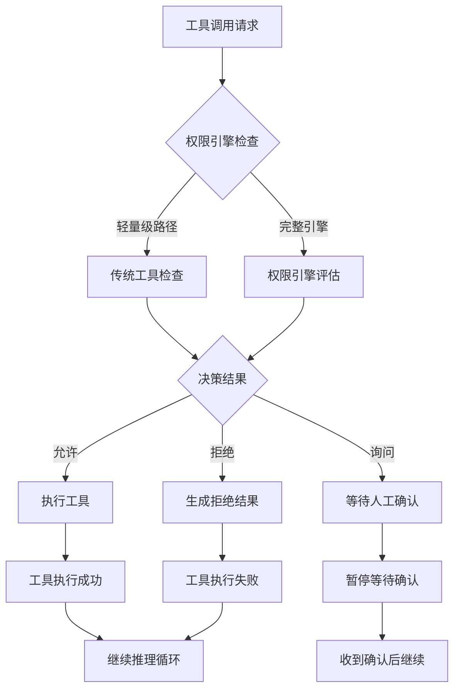
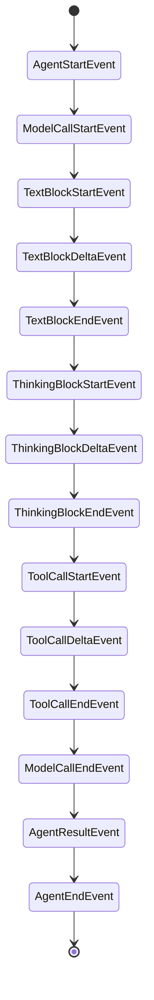
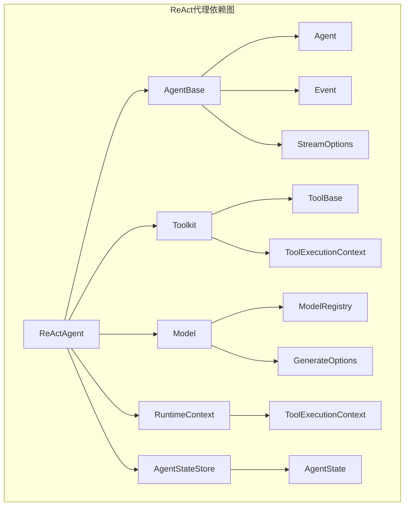

# ReAct代理增强

<cite>
**本文档引用的文件**
- [ReActAgent.java](file://agentscope-core/src/main/java/io/agentscope/core/ReActAgent.java)
- [ReactConfig.java](file://agentscope-core/src/main/java/io/agentscope/core/agent/config/ReactConfig.java)
- [ModelConfig.java](file://agentscope-core/src/main/java/io/agentscope/core/agent/config/ModelConfig.java)
- [Msg.java](file://agentscope-core/src/main/java/io/agentscope/core/message/Msg.java)
- [TextBlock.java](file://agentscope-core/src/main/java/io/agentscope/core/message/TextBlock.java)
- [ToolExecutionContext.java](file://agentscope-core/src/main/java/io/agentscope/core/tool/ToolExecutionContext.java)
- [ModelRegistry.java](file://agentscope-core/src/main/java/io/agentscope/core/model/ModelRegistry.java)
- [GenerateOptions.java](file://agentscope-core/src/main/java/io/agentscope/core/model/GenerateOptions.java)
</cite>

## 目录
1. [简介](#简介)
2. [项目结构](#项目结构)
3. [核心组件](#核心组件)
4. [架构概览](#架构概览)
5. [详细组件分析](#详细组件分析)
6. [依赖关系分析](#依赖关系分析)
7. [性能考虑](#性能考虑)
8. [故障排除指南](#故障排除指南)
9. [结论](#结论)

## 简介

ReAct代理增强是Agentscope Java框架中的一个核心功能模块，它实现了ReAct（推理和行动）代理模式。该模式结合了推理（思考和规划）与行动（工具执行）在一个迭代循环中，使AI代理能够智能地决定何时进行思考以及何时调用工具来完成任务。

ReAct代理的主要特点包括：
- **响应式流处理**：使用Project Reactor实现非阻塞执行
- **钩子系统**：可扩展的钩子用于监控和拦截代理执行
- **人工介入支持**：通过停止机制支持人工干预
- **结构化输出**：每调用提供类型安全的输出
- **权限控制**：内置的工具权限管理系统
- **会话持久化**：支持状态存储和恢复

## 项目结构

Agentscope Java项目采用模块化的架构设计，ReAct代理作为核心模块位于agentscope-core包中：

**图表来源**
- [ReActAgent.java:148-200](file://agentscope-core/src/main/java/io/agentscope/core/ReActAgent.java#L148-L200)
- [ReactConfig.java:22-55](file://agentscope-core/src/main/java/io/agentscope/core/agent/config/ReactConfig.java#L22-L55)
- [ModelConfig.java:21-44](file://agentscope-core/src/main/java/io/agentscope/core/agent/config/ModelConfig.java#L21-L44)

**章节来源**
- [ReActAgent.java:148-200](file://agentscope-core/src/main/java/io/agentscope/core/ReActAgent.java#L148-L200)
- [ReactConfig.java:22-55](file://agentscope-core/src/main/java/io/agentscope/core/agent/config/ReactConfig.java#L22-L55)
- [ModelConfig.java:21-44](file://agentscope-core/src/main/java/io/agentscope/core/agent/config/ModelConfig.java#L21-L44)

## 核心组件

### ReAct代理主类

ReActAgent是整个系统的中心控制器，负责协调推理和行动两个阶段的执行。它继承自AgentBase类，提供了完整的代理生命周期管理。

**主要特性：**
- **多线程安全**：每个代理实例在同一时间只处理一个调用
- **会话管理**：支持基于用户ID和会话ID的状态缓存
- **事件驱动**：通过细粒度的AgentEvent流实现事件驱动的执行
- **中间件支持**：可插拔的中间件链路支持

### 配置系统

ReAct代理使用两个核心配置类来控制行为：

**ReactConfig配置：**
- `maxIters`：单次回复内的推理→行动迭代次数上限
- `stopOnReject`：工具调用拒绝时是否终止循环

**ModelConfig配置：**
- `maxRetries`：单次模型调用的最大重试次数
- `fallbackModel`：主模型失败后的备用模型

### 消息系统

ReAct代理使用灵活的消息系统来处理不同类型的通信内容：

**图表来源**
- [Msg.java:335-388](file://agentscope-core/src/main/java/io/agentscope/core/message/Msg.java#L335-L388)
- [TextBlock.java:31-33](file://agentscope-core/src/main/java/io/agentscope/core/message/TextBlock.java#L31-L33)

**章节来源**
- [ReActAgent.java:218-330](file://agentscope-core/src/main/java/io/agentscope/core/ReActAgent.java#L218-L330)
- [ReactConfig.java:29-55](file://agentscope-core/src/main/java/io/agentscope/core/agent/config/ReactConfig.java#L29-L55)
- [ModelConfig.java:30-44](file://agentscope-core/src/main/java/io/agentscope/core/agent/config/ModelConfig.java#L30-L44)
- [Msg.java:335-388](file://agentscope-core/src/main/java/io/agentscope/core/message/Msg.java#L335-L388)

## 架构概览

ReAct代理采用分层架构设计，实现了清晰的关注点分离：

**图表来源**
- [ReActAgent.java:820-875](file://agentscope-core/src/main/java/io/agentscope/core/ReActAgent.java#L820-L875)
- [ReActAgent.java:1891-2018](file://agentscope-core/src/main/java/io/agentscope/core/ReActAgent.java#L1891-L2018)
- [ReActAgent.java:2273-2355](file://agentscope-core/src/main/java/io/agentscope/core/ReActAgent.java#L2273-L2355)

## 详细组件分析

### 推理循环实现

ReAct代理的核心是其推理循环，它在推理和行动之间交替执行：

**图表来源**
- [ReActAgent.java:1865-1875](file://agentscope-core/src/main/java/io/agentscope/core/ReActAgent.java#L1865-L1875)
- [ReActAgent.java:2019-2064](file://agentscope-core/src/main/java/io/agentscope/core/ReActAgent.java#L2019-L2064)

### 权限控制系统

ReAct代理内置了强大的权限控制系统，支持多种权限决策模式：

**图表来源**
- [ReActAgent.java:2626-2688](file://agentscope-core/src/main/java/io/agentscope/core/ReActAgent.java#L2626-L2688)
- [ReActAgent.java:2404-2428](file://agentscope-core/src/main/java/io/agentscope/core/ReActAgent.java#L2404-L2428)

### 结构化输出处理

ReAct代理支持两种结构化输出路径：

**原生路径：**
- 使用模型的原生结构化输出能力
- 通过response_format参数传递JSON模式
- 模型直接返回结构化JSON

**回退路径：**
- 注入generate_response合成工具
- 通过PostActingEvent停止循环
- 提供类型安全的结果提取

**章节来源**
- [ReActAgent.java:1015-1038](file://agentscope-core/src/main/java/io/agentscope/core/ReActAgent.java#L1015-L1038)
- [ReActAgent.java:1045-1079](file://agentscope-core/src/main/java/io/agentscope/core/ReActAgent.java#L1045-L1079)
- [ReActAgent.java:1086-1131](file://agentscope-core/src/main/java/io/agentscope/core/ReActAgent.java#L1086-L1131)

### 事件系统

ReAct代理使用细粒度的事件系统来跟踪执行过程：

**图表来源**
- [ReActAgent.java:2143-2246](file://agentscope-core/src/main/java/io/agentscope/core/ReActAgent.java#L2143-L2246)
- [ReActAgent.java:1707-1714](file://agentscope-core/src/main/java/io/agentscope/core/ReActAgent.java#L1707-L1714)

## 依赖关系分析

ReAct代理与其他核心组件的依赖关系如下：

**图表来源**
- [ReActAgent.java:18-125](file://agentscope-core/src/main/java/io/agentscope/core/ReActAgent.java#L18-L125)
- [ReActAgent.java:3727-4000](file://agentscope-core/src/main/java/io/agentscope/core/ReActAgent.java#L3727-L4000)

**章节来源**
- [ReActAgent.java:18-125](file://agentscope-core/src/main/java/io/agentscope/core/ReActAgent.java#L18-L125)
- [ToolExecutionContext.java:140-184](file://agentscope-core/src/main/java/io/agentscope/core/tool/ToolExecutionContext.java#L140-L184)
- [ModelRegistry.java:232-254](file://agentscope-core/src/main/java/io/agentscope/core/model/ModelRegistry.java#L232-L254)

## 性能考虑

ReAct代理在设计时充分考虑了性能优化：

### 并发处理
- **单实例限制**：每个ReActAgent实例同一时间只处理一个调用
- **会话隔离**：基于(userId, sessionId)的缓存隔离
- **无共享状态**：并发调用不共享任何状态

### 内存管理
- **增量状态更新**：只在必要时更新AgentState
- **事件流背压**：使用Project Reactor的背压策略
- **内存友好的消息格式**：使用ContentBlock减少内存占用

### 缓存策略
- **状态缓存**：基于ConcurrentHashMap的线程安全缓存
- **权限引擎缓存**：每个会话独立的权限引擎实例
- **工具执行缓存**：工具执行结果的短期缓存

## 故障排除指南

### 常见问题及解决方案

**问题1：工具执行超时**
- 检查工具的超时设置
- 考虑增加重试次数
- 检查网络连接稳定性

**问题2：权限拒绝导致循环停止**
- 检查权限规则配置
- 验证用户权限状态
- 考虑调整权限模式

**问题3：结构化输出解析失败**
- 验证JSON模式定义
- 检查模型对结构化输出的支持
- 确认回退路径的正确性

**问题4：会话状态丢失**
- 检查AgentStateStore配置
- 验证持久化存储可用性
- 确认会话ID的一致性

**章节来源**
- [ReActAgent.java:2804-2834](file://agentscope-core/src/main/java/io/agentscope/core/ReActAgent.java#L2804-L2834)
- [ReActAgent.java:1546-1551](file://agentscope-core/src/main/java/io/agentscope/core/ReActAgent.java#L1546-L1551)
- [ReActAgent.java:1154-1158](file://agentscope-core/src/main/java/io/agentscope/core/ReActAgent.java#L1154-L1158)

## 结论

ReAct代理增强为Agentscope Java框架提供了强大而灵活的AI代理解决方案。通过实现ReAct模式，该系统能够在推理和行动之间智能切换，提供更接近人类思维模式的AI交互体验。

主要优势包括：
- **模块化设计**：清晰的职责分离和可扩展的架构
- **事件驱动**：细粒度的事件系统支持丰富的监控和调试能力
- **权限安全**：内置的权限控制系统确保工具调用的安全性
- **性能优化**：针对高并发场景进行了专门的性能优化
- **易用性**：简洁的API设计降低了使用门槛

未来的发展方向可能包括：
- 更多模型提供商的支持
- 增强的学习和适应能力
- 更丰富的中间件生态系统
- 改进的性能监控和诊断工具
