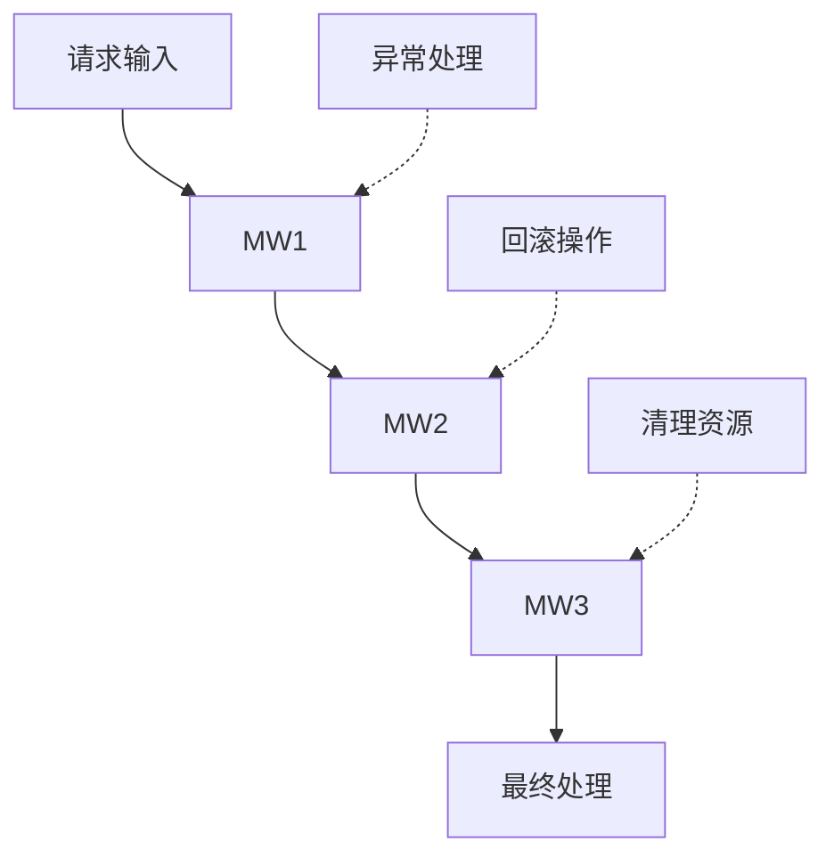
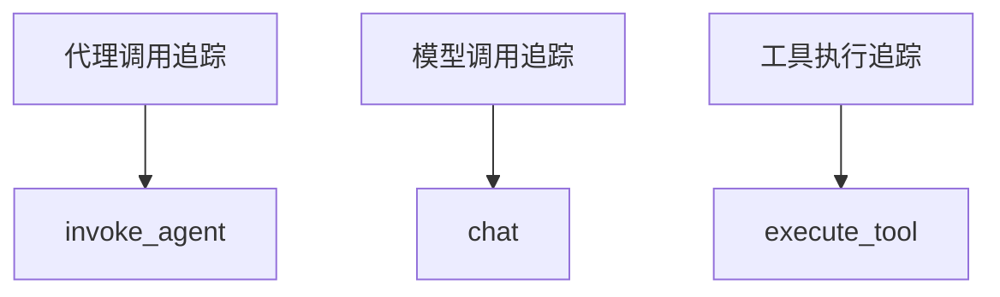
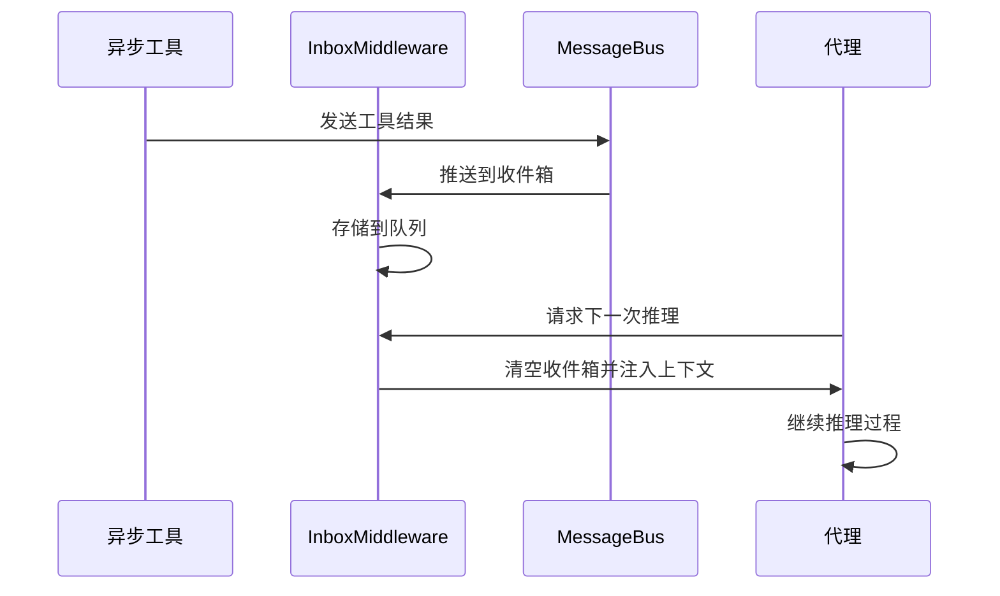
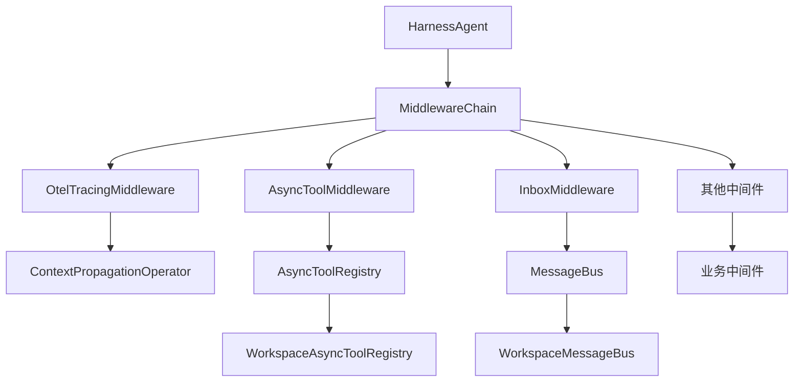
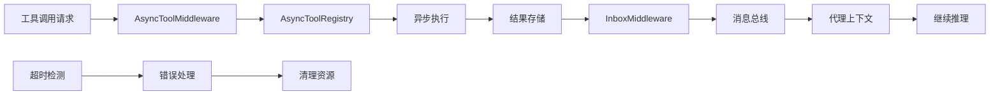

# 中间件系统

<cite>
**本文档引用的文件**
- [AsyncToolMiddleware.java](file://agentscope-harness/src/main/java/io/agentscope/harness/agent/middleware/AsyncToolMiddleware.java)
- [InboxMiddleware.java](file://agentscope-harness/src/main/java/io/agentscope/harness/agent/middleware/InboxMiddleware.java)
- [AsyncToolRegistry.java](file://agentscope-harness/src/main/java/io/agentscope/harness/agent/bus/AsyncToolRegistry.java)
- [WorkspaceAsyncToolRegistry.java](file://agentscope-harness/src/main/java/io/agentscope/harness/agent/bus/WorkspaceAsyncToolRegistry.java)
- [HarnessAgent.java](file://agentscope-harness/src/main/java/io/agentscope/harness/agent/HarnessAgent.java)
- [MiddlewareBase.java](file://agentscope-core/src/main/java/io/agentscope/core/middleware/MiddlewareBase.java)
- [MiddlewareChain.java](file://agentscope-core/src/main/java/io/agentscope/core/middleware/MiddlewareChain.java)
- [TaskReminderMiddleware.java](file://agentscope-core/src/main/java/io/agentscope/core/middleware/TaskReminderMiddleware.java)
- [GracefulShutdownMiddleware.java](file://agentscope-core/src/main/java/io/agentscope/core/shutdown/GracefulShutdownMiddleware.java)
- [DynamicSkillMiddleware.java](file://agentscope-core/src/main/java/io/agentscope/core/skill/DynamicSkillMiddleware.java)
- [OtelTracingMiddleware.java](file://agentscope-core/src/main/java/io/agentscope/core/tracing/OtelTracingMiddleware.java)
- [TracerRegistry.java](file://agentscope-core/src/main/java/io/agentscope/core/tracing/TracerRegistry.java)
- [Tracer.java](file://agentscope-core/src/main/java/io/agentscope/core/tracing/Tracer.java)
- [NoopTracer.java](file://agentscope-core/src/main/java/io/agentscope/core/tracing/NoopTracer.java)
- [OtelTracingMiddlewareTest.java](file://agentscope-core/src/test/java/io/agentscope/core/tracing/OtelTracingMiddlewareTest.java)
- [TracerContextPropagationTest.java](file://agentscope-core/src/test/java/io/agentscope/core/legacy/tracing/TracerContextPropagationTest.java)
- [AsyncToolExample.java](file://agentscope-examples/documentation/src/main/java/io/agentscope/examples/documentation2/harness/async/AsyncToolExample.java)
- [AsyncSubagentExample.java](file://agentscope-examples/documentation/src/main/java/io/agentscope/examples/documentation2/harness/async/AsyncSubagentExample.java)
- [AsyncWaitModeExample.java](file://agentscope-examples/documentation/src/main/java/io/agentscope/examples/documentation2/harness/async/AsyncWaitModeExample.java)
</cite>

## 更新摘要
**所做更改**
- 新增OpenTelemetry追踪中间件重大改进说明
- 新增resolveOtelContext()方法解决孤儿跨度问题
- 新增buildToolSpanName()方法实现工具跨度名称的基数控制
- 更新上下文传播机制的实现细节
- 新增工具跨度名称基数控制的最佳实践
- 新增孤儿跨度问题的诊断和解决方案

## 目录
- [概述](#概述)
- [核心中间件组件](#核心中间件组件)
- [追踪中间件系统](#追踪中间件系统)
- [异步处理中间件](#异步处理中间件)
- [中间件链架构](#中间件链架构)
- [异步工具处理流程](#异步工具处理流程)
- [配置与使用示例](#配置与使用示例)
- [最佳实践](#最佳实践)
- [故障排除](#故障排除)

## 概述

中间件系统是Agentscope框架的核心扩展机制，通过可插拔的中间件组件实现对代理执行流程的灵活控制和增强。系统采用责任链模式，支持同步和异步两种处理模式，为复杂的AI代理应用提供了强大的扩展能力。

**更新** 系统现已集成OpenTelemetry追踪中间件，提供准确的分布式追踪和上下文传播能力，确保跨线程边界的追踪信息完整性和准确性。最新的改进包括孤儿跨度问题的解决和工具跨度名称的基数控制，进一步提升了追踪系统的稳定性和性能。

中间件系统的主要特点包括：
- **可插拔架构**：支持动态添加、移除和配置中间件
- **异步处理**：提供完整的异步工具调用和结果收集机制
- **事件驱动**：基于消息总线的消息传递和事件分发
- **生命周期管理**：完整的中间件生命周期管理和资源清理
- **分布式追踪**：基于OpenTelemetry的完整追踪和上下文传播
- **Reactor集成**：与Reactor响应式编程模型深度集成
- **基数控制**：智能的追踪数据基数控制机制

## 核心中间件组件

### MiddlewareBase基础抽象

所有中间件都继承自`MiddlewareBase`抽象类，该类定义了中间件的基本接口和生命周期方法：

```java
public abstract class MiddlewareBase {
    // 中间件名称标识
    protected String name;
    
    // 初始化方法
    public abstract void init();
    
    // 处理方法
    public abstract MiddlewareResult process(MiddlewareContext context);
    
    // 销毁方法
    public abstract void destroy();
}
```

### MiddlewareChain中间件链

`MiddlewareChain`实现了责任链模式，负责协调多个中间件的执行顺序：



**图表来源**
- [MiddlewareChain.java:1-79](file://agentscope-core/src/main/java/io/agentscope/core/middleware/MiddlewareChain.java#L1-L79)

**章节来源**
- [MiddlewareBase.java:1-144](file://agentscope-core/src/main/java/io/agentscope/core/middleware/MiddlewareBase.java#L1-L144)
- [MiddlewareChain.java:1-79](file://agentscope-core/src/main/java/io/agentscope/core/middleware/MiddlewareChain.java#L1-L79)

## 追踪中间件系统

### OtelTracingMiddleware追踪中间件

**更新** `OtelTracingMiddleware`是全新的OpenTelemetry追踪中间件，提供准确的分布式追踪和上下文传播能力。最新版本包含了孤儿跨度问题的解决方案和工具跨度名称的基数控制机制。

#### 主要功能特性

- **分布式追踪**：基于OpenTelemetry实现完整的分布式追踪
- **上下文传播**：通过`ContextPropagationOperator`确保跨线程边界的上下文正确传播
- **多级追踪**：支持代理调用、模型调用和工具执行的多级追踪
- **孤儿跨度解决**：通过`resolveOtelContext()`方法解决孤儿跨度问题
- **基数控制**：通过`buildToolSpanName()`方法实现工具跨度名称的基数控制
- **自动注册**：全局钩子一次性注册，确保所有Reactor操作的上下文传播
- **零开销降级**：当没有OTel SDK配置时，自动降级为近零开销

#### 核心配置参数

| 参数名 | 类型 | 默认值 | 描述 |
|--------|------|--------|------|
| instrumentationName | String | "io.agentscope" | 追踪器标识符 |
| hookRegistered | boolean | false | 全局钩子注册状态 |

#### 追踪范围类型

中间件自动创建以下类型的追踪范围：



**图表来源**
- [OtelTracingMiddleware.java:46-52](file://agentscope-core/src/main/java/io/agentscope/core/tracing/OtelTracingMiddleware.java#L46-L52)

#### 上下文传播机制

**更新** 最新版本通过`resolveOtelContext()`方法解决了孤儿跨度问题：

```java
// 解决孤儿跨度问题，确保在Reactor上下文中正确解析OpenTelemetry上下文
private Context resolveOtelContext(ContextView ctxView) {
    return ContextPropagationOperator.getOpenTelemetryContextFromContextView(
            ctxView, Context.current());
}

// 全局钩子注册，确保跨线程边界正确传播
ContextPropagationOperator.builder().build().registerOnEachOperator();

// 在每个中间件钩子中使用正确的上下文
return ContextPropagationOperator.runWithContext(
    next.apply(input)
        .doOnNext(event -> {...})
        .doOnComplete(() -> {...})
        .doOnError(e -> {...})
        .doOnCancel(() -> {...}),
    otelCtx
);
```

**章节来源**
- [OtelTracingMiddleware.java:77-86](file://agentscope-core/src/main/java/io/agentscope/core/tracing/OtelTracingMiddleware.java#L77-L86)
- [OtelTracingMiddleware.java:120-155](file://agentscope-core/src/main/java/io/agentscope/core/tracing/OtelTracingMiddleware.java#L120-L155)
- [OtelTracingMiddleware.java:311-317](file://agentscope-core/src/main/java/io/agentscope/core/tracing/OtelTracingMiddleware.java#L311-L317)

#### 工具跨度名称基数控制

**更新** 通过`buildToolSpanName()`方法实现工具跨度名称的基数控制：

```java
// 使用第一个工具名称作为跨度名称；对批量工具调用附加"(+N更多)"以控制基数
// 完整的工具名称列表仍可通过gen_ai.tool.name属性获得
private static String buildToolSpanName(ActingInput input) {
    if (input.toolCalls() == null || input.toolCalls().isEmpty()) {
        return "unknown";
    }
    String first = input.toolCalls().get(0).getName();
    int rest = input.toolCalls().size() - 1;
    return rest > 0 ? first + " (+" + rest + " more)" : first;
}

// 测试验证：多工具调用时跨度名称被截断但属性包含所有工具名称
// assertEquals("execute_tool search (+2 more)", span.getName());
// String toolNames = span.getAttributes().get("gen_ai.tool.name");
// assertTrue(toolNames.contains("search"));
// assertTrue(toolNames.contains("calc"));
// assertTrue(toolNames.contains("fetchUrl"));
```

**章节来源**
- [OtelTracingMiddleware.java:319-329](file://agentscope-core/src/main/java/io/agentscope/core/tracing/OtelTracingMiddleware.java#L319-L329)
- [OtelTracingMiddlewareTest.java:400-432](file://agentscope-core/src/test/java/io/agentscope/core/tracing/OtelTracingMiddlewareTest.java#L400-L432)

### 已弃用的Tracer系统

**更新** 旧的Tracer系统已被标记为弃用，推荐使用新的`OtelTracingMiddleware`。

#### TracerRegistry注册表

```java
@Deprecated(forRemoval = true, since = "2.0.0")
public class TracerRegistry {
    // 全局Reactors钩子启用/禁用
    public static synchronized void enableTracingHook()
    public static synchronized void disableTracingHook()
    
    // Tracer实例注册和重置
    public static void register(Tracer tracer)
    public static void resetToNoop()
}
```

#### Tracer接口

```java
@Deprecated(forRemoval = true, since = "2.0.0")
public interface Tracer {
    // 代理调用追踪
    default Mono<Msg> callAgent(...)
    // 模型调用追踪  
    default Flux<ChatResponse> callModel(...)
    // 工具调用追踪
    default Mono<ToolResultBlock> callTool(...)
    // 上下文执行
    default <TResp> TResp runWithContext(ContextView reactorCtx, Supplier<TResp> inner)
}
```

**章节来源**
- [TracerRegistry.java:42-165](file://agentscope-core/src/main/java/io/agentscope/core/tracing/TracerRegistry.java#L42-L165)
- [Tracer.java:39-75](file://agentscope-core/src/main/java/io/agentscope/core/tracing/Tracer.java#L39-L75)

## 异步处理中间件

### AsyncToolMiddleware异步工具中间件

`AsyncToolMiddleware`是专门处理异步工具调用的中间件组件，支持长时间运行的工具执行和超时管理。

#### 主要功能特性

- **异步工具执行**：支持非阻塞的工具调用，避免主线程阻塞
- **超时管理**：可配置的执行超时时间，防止无限等待
- **状态跟踪**：实时跟踪异步工具的执行状态和进度
- **结果收集**：自动收集异步执行的结果并注入到后续处理中

#### 核心配置参数

| 参数名 | 类型 | 默认值 | 描述 |
|--------|------|--------|------|
| messageBus | MessageBus | 必需 | 消息总线实例 |
| offloadTimeout | Duration | 30秒 | 异步执行超时时间 |
| registry | AsyncToolRegistry | 可选 | 异步工具注册表 |

#### 使用场景

```java
// 配置异步工具中间件
AsyncToolMiddleware asyncMiddleware = new AsyncToolMiddleware(
    messageBus, 
    Duration.ofSeconds(60)
);

// 在中间件链中注册
middlewareChain.add(asyncMiddleware);
```

**章节来源**
- [AsyncToolMiddleware.java:1-200](file://agentscope-harness/src/main/java/io/agentscope/harness/agent/middleware/AsyncToolMiddleware.java#L1-L200)

### InboxMiddleware收件箱中间件

`InboxMiddleware`负责管理和处理异步工具产生的消息和通知，确保结果能够正确传递给后续处理步骤。

#### 核心功能

- **消息收集**：从消息总线收集异步工具产生的消息
- **队列管理**：维护消息队列，支持批量处理和优先级排序
- **上下文注入**：将收集到的消息注入到代理的执行上下文中
- **Drain策略**：支持按需或定时的队列清空策略

#### 配置选项

| 参数 | 类型 | 默认值 | 描述 |
|------|------|--------|------|
| messageBus | MessageBus | 必需 | 消息总线实例 |
| maxDrainCount | int | 100 | 最大清空数量 |
| registry | AsyncToolRegistry | 可选 | 异步工具注册表 |
| filter | Predicate | null | 消息过滤器 |

#### 工作流程



**图表来源**
- [InboxMiddleware.java:1-150](file://agentscope-harness/src/main/java/io/agentscope/harness/agent/middleware/InboxMiddleware.java#L1-L150)

**章节来源**
- [InboxMiddleware.java:1-200](file://agentscope-harness/src/main/java/io/agentscope/harness/agent/middleware/InboxMiddleware.java#L1-L200)

## 中间件链架构

### 架构层次结构

中间件系统采用分层架构设计，确保各组件职责清晰、耦合度低：



**图表来源**
- [HarnessAgent.java:1600-2200](file://agentscope-harness/src/main/java/io/agentscope/harness/agent/HarnessAgent.java#L1600-L2200)

### 生命周期管理

中间件具有明确的生命周期，包括初始化、执行、清理三个阶段：

1. **初始化阶段**：加载配置，建立必要的资源连接
2. **执行阶段**：处理传入的请求，调用下一个中间件
3. **清理阶段**：释放资源，执行清理逻辑

**章节来源**
- [HarnessAgent.java:1600-2200](file://agentscope-harness/src/main/java/io/agentscope/harness/agent/HarnessAgent.java#L1600-L2200)

## 异步工具处理流程

### 完整处理流程

异步工具处理涉及多个组件的协同工作，形成完整的异步处理管道：



**图表来源**
- [AsyncToolMiddleware.java:1-200](file://agentscope-harness/src/main/java/io/agentscope/harness/agent/middleware/AsyncToolMiddleware.java#L1-L200)
- [InboxMiddleware.java:1-150](file://agentscope-harness/src/main/java/io/agentscope/harness/agent/middleware/InboxMiddleware.java#L1-L150)

### 超时管理机制

系统提供了完善的超时管理机制，确保异步操作不会无限期占用资源：

```java
// 超时配置示例
Duration timeout = Duration.ofSeconds(30);
AsyncToolMiddleware middleware = new AsyncToolMiddleware(
    messageBus, 
    timeout,
    registry
);
```

**章节来源**
- [AsyncToolMiddleware.java:1-200](file://agentscope-harness/src/main/java/io/agentscope/harness/agent/middleware/AsyncToolMiddleware.java#L1-L200)
- [AsyncToolRegistry.java:1-100](file://agentscope-harness/src/main/java/io/agentscope/harness/agent/bus/AsyncToolRegistry.java#L1-L100)

## 配置与使用示例

### 基本配置

在`HarnessAgent`中启用异步处理功能：

```java
// 启用异步工具中间件
builder.asyncToolMiddleware(true);

// 设置异步工具超时时间
builder.asyncToolTimeout(Duration.ofSeconds(60));

// 自动注册InboxMiddleware
builder.inboxMiddleware(true);
```

### 追踪中间件配置

**更新** 新的追踪中间件配置方式：

```java
// 创建OpenTelemetry追踪中间件
OtelTracingMiddleware tracingMiddleware = new OtelTracingMiddleware();

// 在中间件链中注册
middlewareChain.add(tracingMiddleware);

// 或者在代理构建时配置
ReActAgent agent = ReActAgent.builder()
    .name("assistant")
    .model(model)
    .middleware(new OtelTracingMiddleware())
    .build();
```

### 高级配置

```java
// 自定义异步工具注册表
AsyncToolRegistry customRegistry = new WorkspaceAsyncToolRegistry();
customRegistry.setMaxConcurrentTasks(10);

// 创建自定义中间件
AsyncToolMiddleware asyncMiddleware = new AsyncToolMiddleware(
    messageBus,
    Duration.ofMinutes(5),
    customRegistry
);

// 注册到中间件链
middlewareChain.add(asyncMiddleware);
```

**章节来源**
- [HarnessAgent.java:1600-2200](file://agentscope-harness/src/main/java/io/agentscope/harness/agent/HarnessAgent.java#L1600-L2200)
- [AsyncToolExample.java:1-100](file://agentscope-examples/documentation/src/main/java/io/agentscope/examples/documentation2/harness/async/AsyncToolExample.java#L1-L100)

## 最佳实践

### 性能优化建议

1. **合理设置超时时间**：根据工具执行时间特征设置合适的超时阈值
2. **监控资源使用**：定期检查异步工具的内存和CPU使用情况
3. **批量处理策略**：对于大量小任务，考虑批量处理以提高效率

### 追踪最佳实践

**更新** 新的追踪中间件最佳实践：

1. **孤儿跨度解决**：确保所有Reactor操作都能正确传播追踪上下文
2. **基数控制**：利用工具跨度名称的基数控制机制减少追踪数据的基数
3. **追踪范围命名**：使用语义化的追踪范围名称便于识别
4. **属性标注**：合理添加追踪属性以便于查询和分析
5. **性能监控**：监控追踪中间件的性能影响，必要时进行优化

### 错误处理策略

```java
try {
    // 异步工具执行
    middleware.process(context);
} catch (AsyncToolTimeoutException e) {
    // 处理超时异常
    logger.warn("异步工具执行超时: {}", e.getMessage());
} catch (AsyncToolExecutionException e) {
    // 处理执行异常
    logger.error("异步工具执行失败: {}", e.getMessage());
}
```

### 资源管理

- **及时清理**：确保异步工具执行完成后及时释放相关资源
- **连接池管理**：合理配置消息总线的连接池大小
- **内存监控**：监控异步工具注册表的内存使用情况

## 故障排除

### 常见问题及解决方案

**问题1：异步工具执行超时**
- 检查超时配置是否合理
- 分析工具执行时间分布
- 考虑增加超时时间或优化工具性能

**问题2：消息丢失**
- 验证InboxMiddleware的配置
- 检查消息总线的连接状态
- 确认异步工具注册表的正确性

**问题3：内存泄漏**
- 检查异步工具的生命周期管理
- 验证资源清理逻辑
- 监控异步工具注册表的增长情况

**问题4：孤儿跨度问题**
- **更新** 检查`resolveOtelContext()`方法是否正确解析上下文
- 验证Reactor操作链中的上下文传播
- 确保在所有异步操作中正确使用`ContextPropagationOperator.runWithContext`

**问题5：追踪数据基数过高**
- **更新** 检查工具跨度名称的基数控制是否生效
- 验证`buildToolSpanName()`方法的实现
- 确认工具名称列表的截断逻辑是否正确

### 调试技巧

1. **启用详细日志**：配置中间件的日志级别以获取更多调试信息
2. **监控指标**：收集异步工具的执行时间和成功率
3. **单元测试**：编写针对异步中间件的测试用例
4. **追踪验证**：使用测试工具验证上下文传播的正确性
5. **基数分析**：监控追踪数据的基数变化趋势

**章节来源**
- [AsyncToolMiddleware.java:1-200](file://agentscope-harness/src/main/java/io/agentscope/harness/agent/middleware/AsyncToolMiddleware.java#L1-L200)
- [InboxMiddleware.java:1-150](file://agentscope-harness/src/main/java/io/agentscope/harness/agent/middleware/InboxMiddleware.java#L1-L150)
- [OtelTracingMiddlewareTest.java:291-344](file://agentscope-core/src/test/java/io/agentscope/core/tracing/OtelTracingMiddlewareTest.java#L291-L344)
