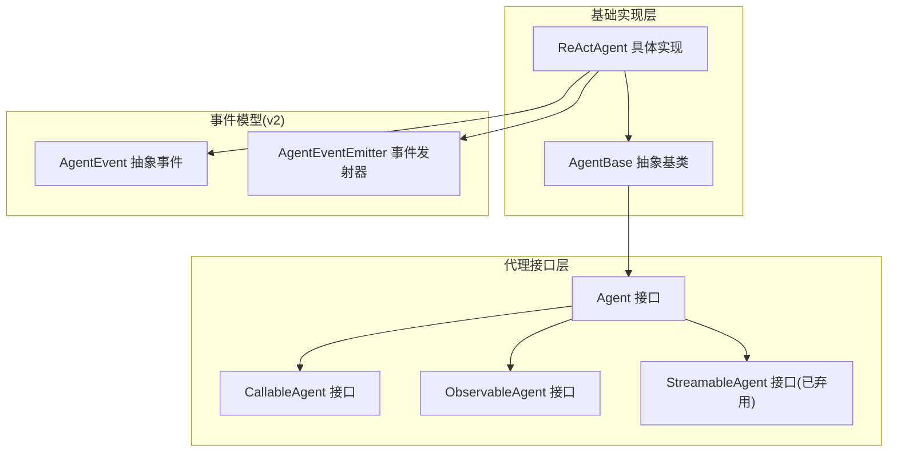
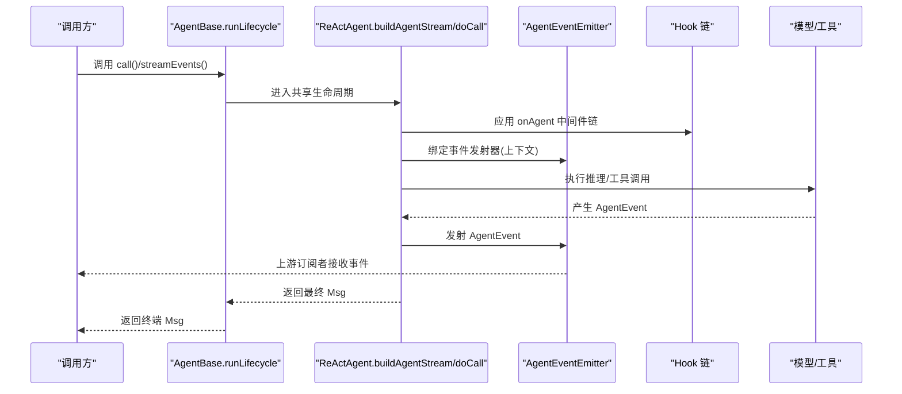
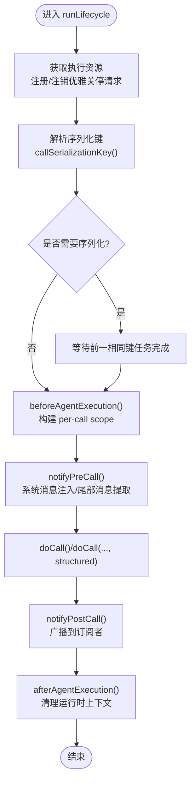
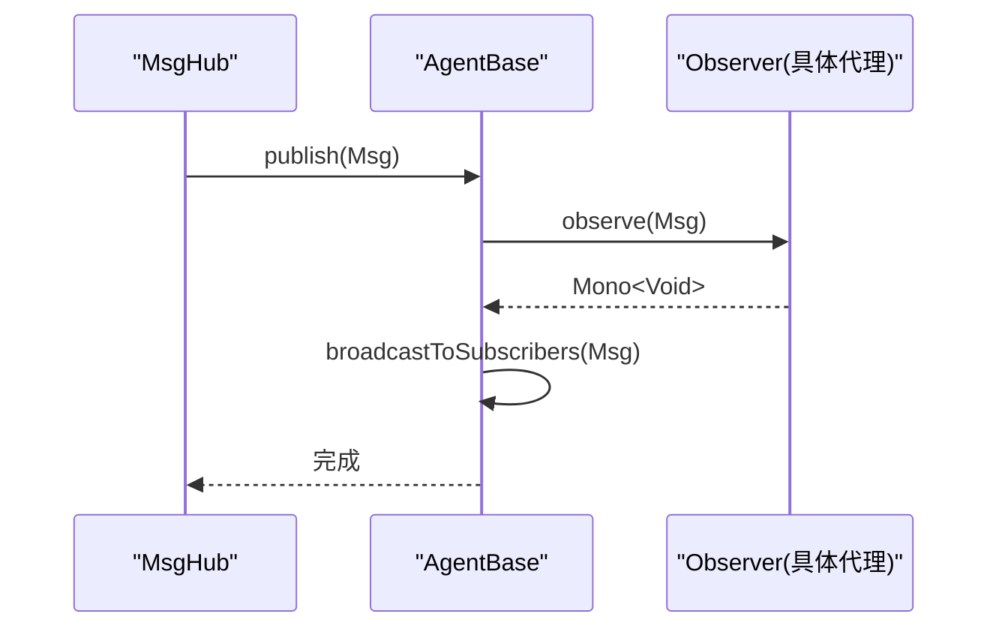
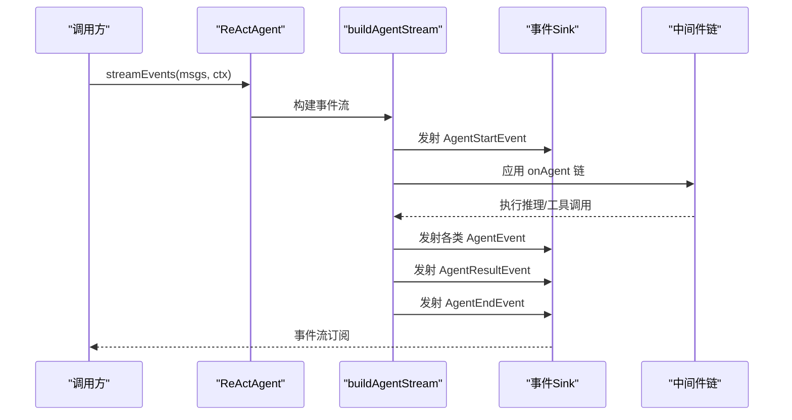
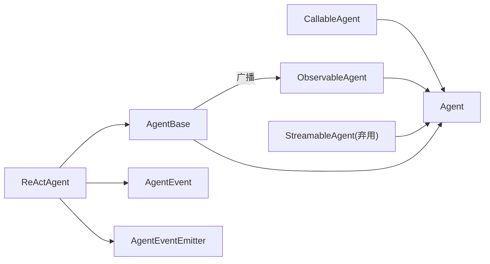

# 代理接口设计

<cite>
**本文引用的文件**
- [Agent.java](file://agentscope-core/src/main/java/io/agentscope/core/agent/Agent.java)
- [AgentBase.java](file://agentscope-core/src/main/java/io/agentscope/core/agent/AgentBase.java)
- [CallableAgent.java](file://agentscope-core/src/main/java/io/agentscope/core/agent/CallableAgent.java)
- [ObservableAgent.java](file://agentscope-core/src/main/java/io/agentscope/core/agent/ObservableAgent.java)
- [StreamableAgent.java](file://agentscope-core/src/main/java/io/agentscope/core/agent/StreamableAgent.java)
- [AgentEvent.java](file://agentscope-core/src/main/java/io/agentscope/core/event/AgentEvent.java)
- [AgentEventEmitter.java](file://agentscope-core/src/main/java/io/agentscope/core/event/AgentEventEmitter.java)
- [ReActAgent.java](file://agentscope-core/src/main/java/io/agentscope/core/ReActAgent.java)
</cite>

## 目录
1. [引言](#引言)
2. [项目结构](#项目结构)
3. [核心组件](#核心组件)
4. [架构总览](#架构总览)
5. [详细组件分析](#详细组件分析)
6. [依赖关系分析](#依赖关系分析)
7. [性能考量](#性能考量)
8. [故障排查指南](#故障排查指南)
9. [结论](#结论)
10. [附录：实现自定义代理示例](#附录实现自定义代理示例)

## 引言
本文件系统化梳理 AgentScope 框架中的代理接口设计与实现，重点覆盖以下主题：
- 接口设计理念与职责边界：Agent、CallableAgent、ObservableAgent、StreamableAgent 的抽象规范与协作方式
- 基类 AgentBase 的通用能力封装：生命周期管理、钩子（Hook）系统、订阅广播、中断控制、状态与运行时上下文
- 观察者模式实现：ObservableAgent 的消息观察与自动广播机制
- 可调用性设计：CallableAgent 的统一调用入口与结构化输出支持
- 流式事件体系：从已弃用的 Event/StreamableAgent 到 v2 的细粒度 AgentEvent/AgentEventEmitter
- 扩展点与最佳实践：如何基于 AgentBase 构建自定义代理，如何正确使用钩子、中间件与事件发射器

## 项目结构
围绕代理接口设计的核心代码位于 agentscope-core 模块的 agent 与 event 包中：
- agent 包：定义代理接口族与基础设施（Agent、AgentBase、CallableAgent、ObservableAgent、StreamableAgent）
- event 包：定义 v2 事件模型（AgentEvent 及其子类型）与事件发射器（AgentEventEmitter），用于替代 v1 的 Event/StreamableAgent

图示来源
- [Agent.java:47-114](file://agentscope-core/src/main/java/io/agentscope/core/agent/Agent.java#L47-L114)
- [CallableAgent.java:35-139](file://agentscope-core/src/main/java/io/agentscope/core/agent/CallableAgent.java#L35-L139)
- [ObservableAgent.java:36-53](file://agentscope-core/src/main/java/io/agentscope/core/agent/ObservableAgent.java#L36-L53)
- [StreamableAgent.java:44-193](file://agentscope-core/src/main/java/io/agentscope/core/agent/StreamableAgent.java#L44-L193)
- [AgentBase.java:92-1036](file://agentscope-core/src/main/java/io/agentscope/core/agent/AgentBase.java#L92-L1036)
- [ReActAgent.java:200-850](file://agentscope-core/src/main/java/io/agentscope/core/ReActAgent.java#L200-L850)
- [AgentEvent.java:72-138](file://agentscope-core/src/main/java/io/agentscope/core/event/AgentEvent.java#L72-L138)
- [AgentEventEmitter.java:39-97](file://agentscope-core/src/main/java/io/agentscope/core/event/AgentEventEmitter.java#L39-L97)

章节来源
- [Agent.java:21-46](file://agentscope-core/src/main/java/io/agentscope/core/agent/Agent.java#L21-L46)
- [AgentBase.java:47-90](file://agentscope-core/src/main/java/io/agentscope/core/agent/AgentBase.java#L47-L90)

## 核心组件
本节聚焦代理接口族与基类的关键抽象与职责划分。

- Agent 接口
  - 组合三类能力：可调用（CallableAgent）、可观测（ObservableAgent）、可流式（StreamableAgent）
  - 提供标识与描述、中断语义、运行时状态与工具包访问等扩展点
  - 设计哲学强调“内存管理不在核心接口”“结构化输出是特定代理能力”

- CallableAgent 接口
  - 定义 call(List<Msg>) 及其便捷变体（单消息、变长参数、带结构化输出）
  - 结构化输出通过 Class 或 JsonNode 描述期望结构，结果以元数据承载

- ObservableAgent 接口
  - 定义 observe(Msg/List<Msg>)，用于被动接收消息而不生成回复
  - 支持多播：AgentBase 内置订阅者管理与自动广播

- StreamableAgent 接口（已弃用）
  - 提供 stream(...) 多重重载，返回粗粒度 Event 流
  - v2 推荐使用 ReActAgent.streamEvents(...) 返回细粒度 AgentEvent 流

- AgentBase 抽象基类
  - 生命周期：runLifecycle/runLifecycleBody，贯穿预处理、钩子链、实际执行、后处理与错误处理
  - 钩子系统：动态增删、优先级排序、运行时上下文绑定
  - 订阅与广播：MsgHub 订阅者列表、自动广播到所有订阅者
  - 中断机制：基于会话级 InterruptControl，配合 Reactive Mono 链路传播
  - 状态与运行时上下文：getAgentState()/getToolkit() 默认空实现，具体代理按需覆盖
  - 结构化输出：doCall(List<Msg>, Class/JsonNode) 默认抛出不支持异常，具体代理可覆盖

章节来源
- [Agent.java:47-114](file://agentscope-core/src/main/java/io/agentscope/core/agent/Agent.java#L47-L114)
- [CallableAgent.java:35-139](file://agentscope-core/src/main/java/io/agentscope/core/agent/CallableAgent.java#L35-L139)
- [ObservableAgent.java:36-53](file://agentscope-core/src/main/java/io/agentscope/core/agent/ObservableAgent.java#L36-L53)
- [StreamableAgent.java:44-193](file://agentscope-core/src/main/java/io/agentscope/core/agent/StreamableAgent.java#L44-L193)
- [AgentBase.java:189-322](file://agentscope-core/src/main/java/io/agentscope/core/agent/AgentBase.java#L189-L322)
- [AgentBase.java:434-460](file://agentscope-core/src/main/java/io/agentscope/core/agent/AgentBase.java#L434-L460)
- [AgentBase.java:531-551](file://agentscope-core/src/main/java/io/agentscope/core/agent/AgentBase.java#L531-L551)
- [AgentBase.java:899-916](file://agentscope-core/src/main/java/io/agentscope/core/agent/AgentBase.java#L899-L916)

## 架构总览
下图展示 v2 事件流与 ReActAgent 的核心交互：AgentBase.runLifecycle 负责生命周期与钩子，ReActAgent.buildAgentStream 将 call 与 streamEvents 共享同一核心，事件通过 AgentEventEmitter 注入父流。

图示来源
- [AgentBase.java:252-296](file://agentscope-core/src/main/java/io/agentscope/core/agent/AgentBase.java#L252-L296)
- [ReActAgent.java:795-850](file://agentscope-core/src/main/java/io/agentscope/core/ReActAgent.java#L795-L850)
- [AgentEventEmitter.java:77-96](file://agentscope-core/src/main/java/io/agentscope/core/event/AgentEventEmitter.java#L77-L96)

## 详细组件分析

### Agent 接口设计
- 设计理念
  - 组合式接口：将调用、可观测与流式能力组合，避免单一职责过重
  - 明确边界：内存管理、结构化输出、观察模式等作为扩展点由具体实现承担
  - 终端契约：call(...) 返回单一 Msg，流式变体最终收敛为单一 Msg
- 关键方法
  - getAgentId()/getName()/getDescription()：标识与描述
  - interrupt()/interrupt(Msg)：会话级中断
  - getAgentState()/getToolkit()：运行时状态与工具包访问（默认空）

章节来源
- [Agent.java:21-46](file://agentscope-core/src/main/java/io/agentscope/core/agent/Agent.java#L21-L46)
- [Agent.java:47-114](file://agentscope-core/src/main/java/io/agentscope/core/agent/Agent.java#L47-L114)

### AgentBase 基类实现
- 生命周期与钩子
  - runLifecycle/runLifecycleBody：在 Mono.using 资源作用域内执行，确保释放；结合 TracerRegistry、GracefulShutdownManager、Hook 链
  - notifyPreCall/notifyPostCall/notifyError：在不同阶段触发 Hook 事件，支持系统消息注入与尾部消息过滤
- 订阅与广播
  - resetSubscribers/removeSubscribers：维护 MsgHub 订阅拓扑
  - broadcastToSubscribers：对所有订阅者异步 observe 消息
- 中断与序列化
  - callSerializationKey：按 (userId, sessionId) 键串行化同会话调用，避免并发污染
  - serializeOnKey：基于 Sinks 的门闩机制保证 FIFO
- 结构化输出与运行时上下文
  - doCall(List<Msg>, Class/JsonNode) 默认不支持，具体代理可覆盖
  - seedSystemMsg/consumeSystemMsgAfterPreCall/stateForCall：为 v2 事件流提供系统消息与状态快照

图示来源
- [AgentBase.java:252-322](file://agentscope-core/src/main/java/io/agentscope/core/agent/AgentBase.java#L252-L322)
- [AgentBase.java:738-795](file://agentscope-core/src/main/java/io/agentscope/core/agent/AgentBase.java#L738-L795)
- [AgentBase.java:804-816](file://agentscope-core/src/main/java/io/agentscope/core/agent/AgentBase.java#L804-L816)
- [AgentBase.java:881-889](file://agentscope-core/src/main/java/io/agentscope/core/agent/AgentBase.java#L881-L889)

章节来源
- [AgentBase.java:252-322](file://agentscope-core/src/main/java/io/agentscope/core/agent/AgentBase.java#L252-L322)
- [AgentBase.java:334-365](file://agentscope-core/src/main/java/io/agentscope/core/agent/AgentBase.java#L334-L365)
- [AgentBase.java:738-795](file://agentscope-core/src/main/java/io/agentscope/core/agent/AgentBase.java#L738-L795)
- [AgentBase.java:804-816](file://agentscope-core/src/main/java/io/agentscope/core/agent/AgentBase.java#L804-L816)
- [AgentBase.java:881-889](file://agentscope-core/src/main/java/io/agentscope/core/agent/AgentBase.java#L881-L889)

### ObservableAgent 观察者模式
- 角色定位：允许代理被动接收消息，不生成回复
- 实现要点
  - doObserve 默认空实现，具体代理可选择存储消息或触发副作用
  - AgentBase.observe(Msg/List) 直接委托至 doObserve，并对空列表进行短路
  - 自动广播：notifyPostCall 后通过 broadcastToSubscribers 将最终 Msg 广播给所有订阅者

图示来源
- [ObservableAgent.java:36-53](file://agentscope-core/src/main/java/io/agentscope/core/agent/ObservableAgent.java#L36-L53)
- [AgentBase.java:899-916](file://agentscope-core/src/main/java/io/agentscope/core/agent/AgentBase.java#L899-L916)
- [AgentBase.java:881-889](file://agentscope-core/src/main/java/io/agentscope/core/agent/AgentBase.java#L881-L889)

章节来源
- [ObservableAgent.java:22-35](file://agentscope-core/src/main/java/io/agentscope/core/agent/ObservableAgent.java#L22-L35)
- [AgentBase.java:899-916](file://agentscope-core/src/main/java/io/agentscope/core/agent/AgentBase.java#L899-L916)
- [AgentBase.java:881-889](file://agentscope-core/src/main/java/io/agentscope/core/agent/AgentBase.java#L881-L889)

### CallableAgent 可调用性设计
- 方法族覆盖
  - call(): 无输入继续生成
  - call(Msg/Msg.../List<Msg>): 单条或多条消息输入
  - call(List<Msg>, Class/JsonNode): 结构化输出（类定义或 JSON Schema）
- 设计原则
  - 便捷方法均委托至核心 call(List<Msg>)
  - 结构化输出通过元数据承载，便于下游工具链消费

章节来源
- [CallableAgent.java:35-139](file://agentscope-core/src/main/java/io/agentscope/core/agent/CallableAgent.java#L35-L139)

### StreamableAgent 与 v2 事件流
- 已弃用状态
  - StreamableAgent 在 v2 中被弃用，统一推荐使用 ReActAgent.streamEvents(...)
- v2 事件模型
  - AgentEvent 抽象事件及其丰富子类型，覆盖推理、思考、工具调用、结果、用户确认等全生命周期
  - AgentEventEmitter 提供线程安全的事件注入能力，支持父子事件转发与源路径标记

```mermaid
classDiagram
class AgentEvent {
+getId()
+getCreatedAt()
+getType()
+getSource()
+withSource()
+getMetadata()
+withMetadata()
}
class AgentStartEvent
class AgentEndEvent
class AgentResultEvent
class ModelCallStartEvent
class ModelCallEndEvent
class TextBlockStartEvent
class TextBlockDeltaEvent
class TextBlockEndEvent
class ThinkingBlockStartEvent
class ThinkingBlockDeltaEvent
class ThinkingBlockEndEvent
class ToolCallStartEvent
class ToolCallDeltaEvent
class ToolCallEndEvent
class ToolResultStartEvent
class ToolResultTextDeltaEvent
class ToolResultDataDeltaEvent
class ToolResultEndEvent
class RequireUserConfirmEvent
class UserConfirmResultEvent
class ExternalExecutionResultEvent
class ExceedMaxItersEvent
class RequestStopEvent
class SubagentExposedEvent
class HintBlockEvent
class CustomEvent
AgentEvent <|-- AgentStartEvent
AgentEvent <|-- AgentEndEvent
AgentEvent <|-- AgentResultEvent
AgentEvent <|-- ModelCallStartEvent
AgentEvent <|-- ModelCallEndEvent
AgentEvent <|-- TextBlockStartEvent
AgentEvent <|-- TextBlockDeltaEvent
AgentEvent <|-- TextBlockEndEvent
AgentEvent <|-- ThinkingBlockStartEvent
AgentEvent <|-- ThinkingBlockDeltaEvent
AgentEvent <|-- ThinkingBlockEndEvent
AgentEvent <|-- ToolCallStartEvent
AgentEvent <|-- ToolCallDeltaEvent
AgentEvent <|-- ToolCallEndEvent
AgentEvent <|-- ToolResultStartEvent
AgentEvent <|-- ToolResultTextDeltaEvent
AgentEvent <|-- ToolResultDataDeltaEvent
AgentEvent <|-- ToolResultEndEvent
AgentEvent <|-- RequireUserConfirmEvent
AgentEvent <|-- UserConfirmResultEvent
AgentEvent <|-- ExternalExecutionResultEvent
AgentEvent <|-- ExceedMaxItersEvent
AgentEvent <|-- RequestStopEvent
AgentEvent <|-- SubagentExposedEvent
AgentEvent <|-- HintBlockEvent
AgentEvent <|-- CustomEvent
```

图示来源
- [AgentEvent.java:72-138](file://agentscope-core/src/main/java/io/agentscope/core/event/AgentEvent.java#L72-L138)

章节来源
- [StreamableAgent.java:36-42](file://agentscope-core/src/main/java/io/agentscope/core/agent/StreamableAgent.java#L36-L42)
- [AgentEvent.java:27-71](file://agentscope-core/src/main/java/io/agentscope/core/event/AgentEvent.java#L27-L71)
- [AgentEventEmitter.java:21-37](file://agentscope-core/src/main/java/io/agentscope/core/event/AgentEventEmitter.java#L21-L37)

### ReActAgent：完整生命周期与事件流
- 共享核心
  - buildAgentStream：统一 call 与 streamEvents 的核心，bookend 以 AgentStartEvent/AgentEndEvent，中间发射 AgentResultEvent
  - callInternal：将 call 路径映射到事件流，提取 AgentResultEvent 中的最终 Msg
- 事件发射
  - 通过 AgentEventEmitter 将事件注入父流；支持转发上下文以标注子代理事件源路径
- 结构化输出
  - 原生路径：通过模型 response_format
  - 回退路径：注入 generate_response 合成工具，借助 PostActingEvent 停止循环

图示来源
- [ReActAgent.java:795-850](file://agentscope-core/src/main/java/io/agentscope/core/ReActAgent.java#L795-L850)
- [ReActAgent.java:865-904](file://agentscope-core/src/main/java/io/agentscope/core/ReActAgent.java#L865-L904)
- [AgentEventEmitter.java:77-96](file://agentscope-core/src/main/java/io/agentscope/core/event/AgentEventEmitter.java#L77-L96)

章节来源
- [ReActAgent.java:769-777](file://agentscope-core/src/main/java/io/agentscope/core/ReActAgent.java#L769-L777)
- [ReActAgent.java:865-904](file://agentscope-core/src/main/java/io/agentscope/core/ReActAgent.java#L865-L904)

## 依赖关系分析
- 接口与实现
  - Agent 组合 CallableAgent/ObservableAgent/StreamableAgent
  - AgentBase 实现 Agent，提供通用生命周期与钩子
  - ReActAgent 继承 AgentBase，实现 v2 事件流与中间件链
- 事件与发射器
  - ReActAgent 通过 AgentEventEmitter 将 AgentEvent 注入父流
  - AgentBase.notifyPostCall 在后处理阶段广播最终 Msg 至订阅者

图示来源
- [Agent.java:47-114](file://agentscope-core/src/main/java/io/agentscope/core/agent/Agent.java#L47-L114)
- [AgentBase.java:881-889](file://agentscope-core/src/main/java/io/agentscope/core/agent/AgentBase.java#L881-L889)
- [ReActAgent.java:795-850](file://agentscope-core/src/main/java/io/agentscope/core/ReActAgent.java#L795-L850)

章节来源
- [Agent.java:47-114](file://agentscope-core/src/main/java/io/agentscope/core/agent/Agent.java#L47-L114)
- [AgentBase.java:881-889](file://agentscope-core/src/main/java/io/agentscope/core/agent/AgentBase.java#L881-L889)
- [ReActAgent.java:795-850](file://agentscope-core/src/main/java/io/agentscope/core/ReActAgent.java#L795-L850)

## 性能考量
- 并发与线程安全
  - 单实例非并发：AgentBase 注释明确指出实例不应被多线程同时调用
  - Reactor 上下文隔离：通过 RUNTIME_CONTEXT_KEY/CALL_SCOPE_KEY 确保并发调用不共享可变状态
- 序列化与锁竞争
  - callSerializationKey + serializeOnKey 以键控串行，避免会话级状态竞态
- 资源释放
  - runLifecycle 使用 Mono.using 确保 acquire/release 成对执行，防止资源泄漏
- 事件发射
  - AgentEventEmitter 采用 FluxSink，线程安全；建议避免在高频事件中阻塞操作

## 故障排查指南
- 中断未生效
  - 检查是否使用会话级中断（ReActAgent.interrupt(userId, sessionId)）
  - 确认在关键检查点调用中断检查（如 ReActAgent.CallExecution.checkInterrupted）
- 事件未到达订阅者
  - 确认订阅者列表已通过 resetSubscribers 设置
  - 检查 notifyPostCall 是否正常触发广播
- 结构化输出异常
  - 若模型不支持原生结构化输出，回退路径依赖合成工具；检查工具是否成功注入与调用
- 钩子顺序问题
  - 使用 getSortedHooks() 获取按优先级排序的钩子链，必要时调整 Hook.priority

章节来源
- [AgentBase.java:494-502](file://agentscope-core/src/main/java/io/agentscope/core/agent/AgentBase.java#L494-L502)
- [AgentBase.java:881-889](file://agentscope-core/src/main/java/io/agentscope/core/agent/AgentBase.java#L881-L889)
- [ReActAgent.java:1399-1406](file://agentscope-core/src/main/java/io/agentscope/core/ReActAgent.java#L1399-L1406)

## 结论
- Agent 接口族以组合式设计实现高内聚低耦合，职责清晰且可扩展
- AgentBase 提供一致的生命周期、钩子、订阅与中断机制，降低具体代理实现复杂度
- v2 事件模型（AgentEvent/AgentEventEmitter）替代 v1 的 Event/StreamableAgent，提供更细粒度的可观测性与可追踪性
- ReActAgent 展示了如何在统一生命周期下整合中间件、事件流与结构化输出

## 附录：实现自定义代理示例
以下步骤指导你基于 AgentBase 实现一个最小可用代理：

- 步骤 1：继承 AgentBase，实现 doCall(List<Msg>) 与 handleInterrupt
  - 示例参考路径：[AgentBase.java:402](file://agentscope-core/src/main/java/io/agentscope/core/agent/AgentBase.java#L402)，[AgentBase.java:551](file://agentscope-core/src/main/java/io/agentscope/core/agent/AgentBase.java#L551)
- 步骤 2：（可选）实现 doCall(List<Msg>, Class/JsonNode) 支持结构化输出
  - 示例参考路径：[AgentBase.java:413](file://agentscope-core/src/main/java/io/agentscope/core/agent/AgentBase.java#L413)，[AgentBase.java:428](file://agentscope-core/src/main/java/io/agentscope/core/agent/AgentBase.java#L428)
- 步骤 3：（可选）重写 beforeAgentExecution/afterAgentExecution 管理 per-call 状态
  - 示例参考路径：[AgentBase.java:587](file://agentscope-core/src/main/java/io/agentscope/core/agent/AgentBase.java#L587)，[AgentBase.java:595](file://agentscope-core/src/main/java/io/agentscope/core/agent/AgentBase.java#L595)
- 步骤 4：（可选）使用 ReActAgent 的事件流能力
  - 参考 ReActAgent.streamEvents(...) 与 AgentEventEmitter.fromContext(...)
  - 示例参考路径：[ReActAgent.java:865](file://agentscope-core/src/main/java/io/agentscope/core/ReActAgent.java#L865)，[AgentEventEmitter.java:77](file://agentscope-core/src/main/java/io/agentscope/core/event/AgentEventEmitter.java#L77)

最佳实践
- 保持 doCall 的幂等性与可恢复性，配合中断与优雅关停
- 使用钩子而非硬编码逻辑，提升可测试性与可维护性
- 对外暴露最小接口：仅在必要时覆写扩展点，遵循组合优于继承
