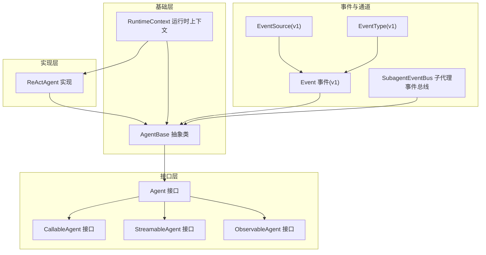
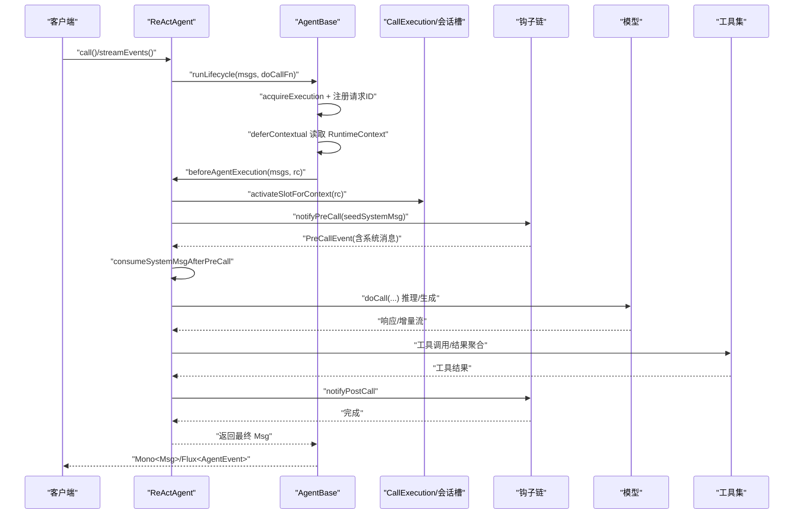
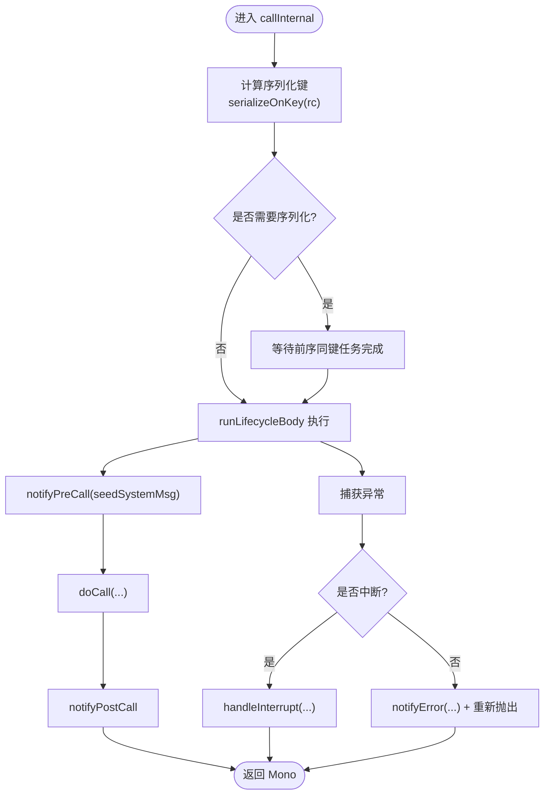
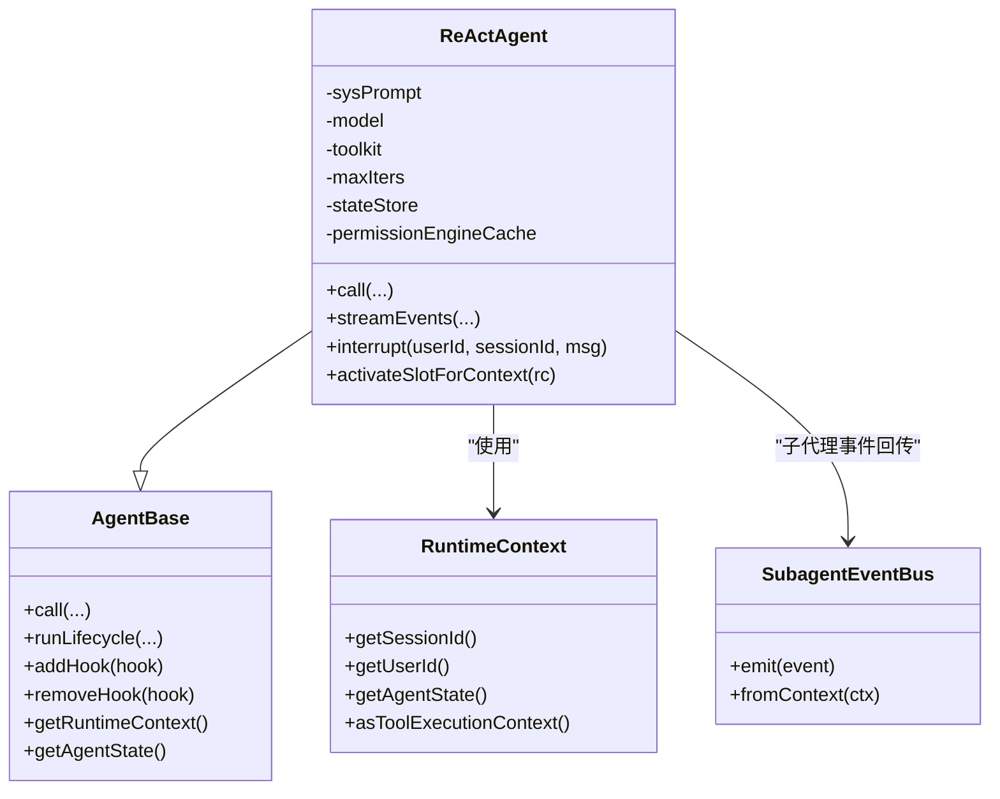
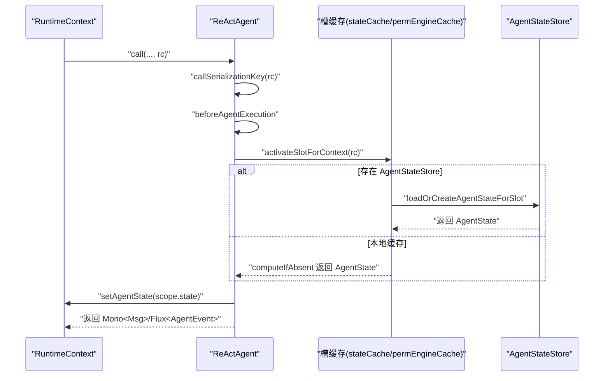
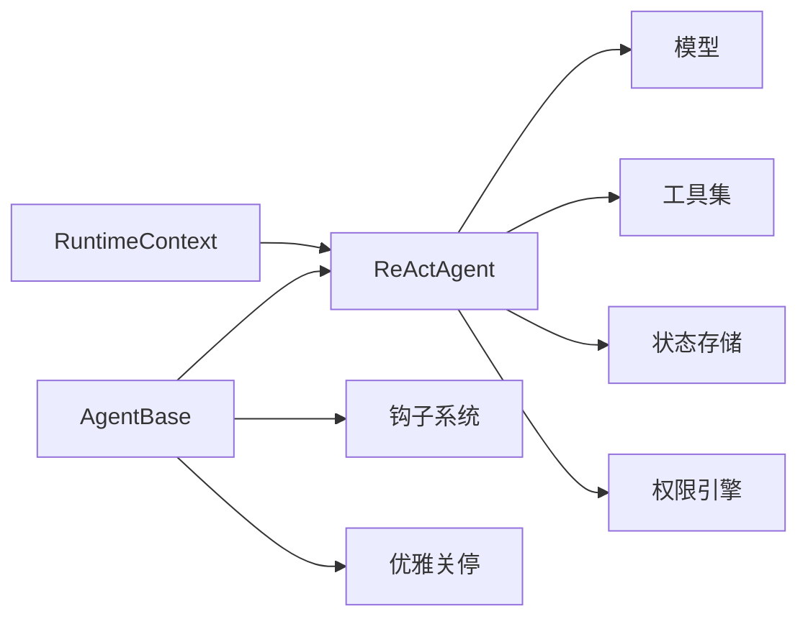

# 代理系统

<cite>
**本文引用的文件**
- [Agent.java](file://agentscope-core/src/main/java/io/agentscope/core/agent/Agent.java)
- [AgentBase.java](file://agentscope-core/src/main/java/io/agentscope/core/agent/AgentBase.java)
- [ReActAgent.java](file://agentscope-core/src/main/java/io/agentscope/core/ReActAgent.java)
- [RuntimeContext.java](file://agentscope-core/src/main/java/io/agentscope/core/agent/RuntimeContext.java)
- [ObservableAgent.java](file://agentscope-core/src/main/java/io/agentscope/core/agent/ObservableAgent.java)
- [CallableAgent.java](file://agentscope-core/src/main/java/io/agentscope/core/agent/CallableAgent.java)
- [StreamableAgent.java](file://agentscope-core/src/main/java/io/agentscope/core/agent/StreamableAgent.java)
- [SubagentEventBus.java](file://agentscope-core/src/main/java/io/agentscope/core/agent/SubagentEventBus.java)
- [Event.java](file://agentscope-core/src/main/java/io/agentscope/core/agent/Event.java)
- [EventSource.java](file://agentscope-core/src/main/java/io/agentscope/core/agent/EventSource.java)
- [EventType.java](file://agentscope-core/src/main/java/io/agentscope/core/agent/EventType.java)
</cite>

## 目录
1. [引言](#引言)
2. [项目结构](#项目结构)
3. [核心组件](#核心组件)
4. [架构总览](#架构总览)
5. [详细组件分析](#详细组件分析)
6. [依赖关系分析](#依赖关系分析)
7. [性能考量](#性能考量)
8. [故障排除指南](#故障排除指南)
9. [结论](#结论)
10. [附录](#附录)

## 引言
本文件面向希望深入理解与使用 AgentScope 代理系统的开发者与架构师，系统性梳理代理接口设计、AgentBase 基类实现与 ReActAgent 具体实现，阐释代理的生命周期管理、状态维护与上下文传递机制，解析代理间通信、协作模式与权限控制，并覆盖代理配置选项、中间件系统与扩展机制。文档同时提供最佳实践、性能优化建议与故障排除指南，辅以丰富的代码级图示与示例路径，帮助读者快速上手并在生产环境中稳定落地。

## 项目结构
AgentScope 的核心位于 agentscope-core 模块，围绕“接口定义—基础能力—具体实现”的分层组织：
- 接口层：Agent、CallableAgent、StreamableAgent、ObservableAgent 定义代理能力边界与契约。
- 基础层：AgentBase 提供统一的生命周期、钩子、中断、序列化与运行时上下文绑定等基础设施。
- 实现层：ReActAgent 作为典型实现，展示推理-行动循环、状态持久化、权限引擎、中间件链路与事件流。
- 上下文与事件：RuntimeContext 承载每调用会话元数据；Event/EventSource/EventType 为旧版事件模型（v1）；新版由 ReActAgent.streamEvents 提供细粒度 AgentEvent 流。

图表来源
- [Agent.java:47-115](file://agentscope-core/src/main/java/io/agentscope/core/agent/Agent.java#L47-L115)
- [CallableAgent.java:35-140](file://agentscope-core/src/main/java/io/agentscope/core/agent/CallableAgent.java#L35-L140)
- [StreamableAgent.java:44-194](file://agentscope-core/src/main/java/io/agentscope/core/agent/StreamableAgent.java#L44-L194)
- [ObservableAgent.java:36-54](file://agentscope-core/src/main/java/io/agentscope/core/agent/ObservableAgent.java#L36-L54)
- [AgentBase.java:92-1036](file://agentscope-core/src/main/java/io/agentscope/core/agent/AgentBase.java#L92-L1036)
- [RuntimeContext.java:33-386](file://agentscope-core/src/main/java/io/agentscope/core/agent/RuntimeContext.java#L33-L386)
- [ReActAgent.java:200-4305](file://agentscope-core/src/main/java/io/agentscope/core/ReActAgent.java#L200-L4305)
- [Event.java:60-220](file://agentscope-core/src/main/java/io/agentscope/core/agent/Event.java#L60-L220)
- [EventSource.java:113-274](file://agentscope-core/src/main/java/io/agentscope/core/agent/EventSource.java#L113-L274)
- [EventType.java:29-100](file://agentscope-core/src/main/java/io/agentscope/core/agent/EventType.java#L29-L100)
- [SubagentEventBus.java:37-70](file://agentscope-core/src/main/java/io/agentscope/core/agent/SubagentEventBus.java#L37-L70)

章节来源
- [Agent.java:21-115](file://agentscope-core/src/main/java/io/agentscope/core/agent/Agent.java#L21-L115)
- [AgentBase.java:47-1036](file://agentscope-core/src/main/java/io/agentscope/core/agent/AgentBase.java#L47-L1036)
- [ReActAgent.java:148-4305](file://agentscope-core/src/main/java/io/agentscope/core/ReActAgent.java#L148-L4305)
- [RuntimeContext.java:26-386](file://agentscope-core/src/main/java/io/agentscope/core/agent/RuntimeContext.java#L26-L386)
- [Event.java:24-220](file://agentscope-core/src/main/java/io/agentscope/core/agent/Event.java#L24-L220)
- [EventSource.java:21-274](file://agentscope-core/src/main/java/io/agentscope/core/agent/EventSource.java#L21-L274)
- [EventType.java:18-100](file://agentscope-core/src/main/java/io/agentscope/core/agent/EventType.java#L18-L100)
- [SubagentEventBus.java:21-70](file://agentscope-core/src/main/java/io/agentscope/core/agent/SubagentEventBus.java#L21-L70)

## 核心组件
- Agent 接口：聚合可调用、可流式、可观测三大能力，统一标识符与描述，提供中断与状态/工具包访问入口。
- AgentBase 抽象类：提供生命周期编排（acquire/release）、钩子通知、序列化门禁、运行时上下文绑定、预/后置钩子与错误处理、观察模式等通用能力。
- ReActAgent 实现：基于 AgentBase，实现 ReAct 推理-行动循环，支持系统提示注入中间件、结构化输出、权限引擎、长程记忆、RAG、工具执行与事件流。
- RuntimeContext：每调用会话的轻量元数据容器，承载用户/会话标识、调用态 AgentState、Typed/字符串属性与工具执行上下文投影。
- 事件与通道：旧版 Event/EventSource/EventType 用于 v1 流式输出；新版通过 ReActAgent.streamEvents 提供细粒度 AgentEvent 流；SubagentEventBus 支持同步子代理事件回传至父流。

章节来源
- [Agent.java:21-115](file://agentscope-core/src/main/java/io/agentscope/core/agent/Agent.java#L21-L115)
- [AgentBase.java:47-800](file://agentscope-core/src/main/java/io/agentscope/core/agent/AgentBase.java#L47-L800)
- [ReActAgent.java:148-800](file://agentscope-core/src/main/java/io/agentscope/core/ReActAgent.java#L148-L800)
- [RuntimeContext.java:26-264](file://agentscope-core/src/main/java/io/agentscope/core/agent/RuntimeContext.java#L26-L264)
- [Event.java:24-180](file://agentscope-core/src/main/java/io/agentscope/core/agent/Event.java#L24-L180)
- [EventSource.java:21-110](file://agentscope-core/src/main/java/io/agentscope/core/agent/EventSource.java#L21-L110)
- [EventType.java:18-100](file://agentscope-core/src/main/java/io/agentscope/core/agent/EventType.java#L18-L100)
- [SubagentEventBus.java:21-70](file://agentscope-core/src/main/java/io/agentscope/core/agent/SubagentEventBus.java#L21-L70)

## 架构总览
AgentScope 采用“接口+抽象基类+具体实现”的分层架构，ReActAgent 作为典型实现，贯穿以下关键路径：
- 生命周期：AgentBase.runLifecycle 统一编排，含执行获取、序列化门禁、预钩子、doCall、后钩子、错误处理与优雅关停。
- 状态与上下文：ReActAgent.activateSlotForContext 将 RuntimeContext 解析为 (userId, sessionId) 会话槽，绑定 CallExecution 与权限引擎缓存，确保并发安全。
- 中间件与钩子：系统级与构建期钩子排序执行，ReActAgent 在 onAgent 链中统一调度；RuntimeContextAware 钩子在每次调用绑定/解绑上下文。
- 事件流：ReActAgent.buildAgentStream 贯穿 AgentStart/AgentResult/AgentEnd 等事件，streamEvents 对外暴露细粒度 AgentEvent 流。

图表来源
- [AgentBase.java:252-322](file://agentscope-core/src/main/java/io/agentscope/core/agent/AgentBase.java#L252-L322)
- [ReActAgent.java:511-603](file://agentscope-core/src/main/java/io/agentscope/core/ReActAgent.java#L511-L603)
- [RuntimeContext.java:33-127](file://agentscope-core/src/main/java/io/agentscope/core/agent/RuntimeContext.java#L33-L127)

章节来源
- [AgentBase.java:252-322](file://agentscope-core/src/main/java/io/agentscope/core/agent/AgentBase.java#L252-L322)
- [ReActAgent.java:511-603](file://agentscope-core/src/main/java/io/agentscope/core/ReActAgent.java#L511-L603)
- [RuntimeContext.java:33-127](file://agentscope-core/src/main/java/io/agentscope/core/agent/RuntimeContext.java#L33-L127)

## 详细组件分析

### Agent 接口设计
- 设计理念：将可调用、可流式、可观测三类能力组合为单一契约，避免重复实现；明确内存管理与结构化输出为实现细节。
- 关键点：统一的 getAgentId/getName/getDescription；中断语义；状态与工具包访问器默认返回 null，由具体实现按需覆盖。

章节来源
- [Agent.java:21-115](file://agentscope-core/src/main/java/io/agentscope/core/agent/Agent.java#L21-L115)

### AgentBase 基类实现
- 生命周期：runLifecycle 使用 Mono.using/acquireExecution/releaseExecution 确保资源回收；序列化门禁 serializeOnKey 保证同会话串行、不同会话并行。
- 钩子系统：系统钩子与构建期钩子合并，按优先级排序；RuntimeContextAware 钩子在 beforeAgentExecution 绑定、afterAgentExecution 解绑。
- 错误处理：拦截 InterruptedException 并委派 handleInterrupt；其他错误通过 notifyError 传播。
- 观察模式：doObserve 默认空实现，便于多代理协作场景复用。

图表来源
- [AgentBase.java:252-322](file://agentscope-core/src/main/java/io/agentscope/core/agent/AgentBase.java#L252-L322)
- [AgentBase.java:344-365](file://agentscope-core/src/main/java/io/agentscope/core/agent/AgentBase.java#L344-L365)
- [AgentBase.java:494-502](file://agentscope-core/src/main/java/io/agentscope/core/agent/AgentBase.java#L494-L502)

章节来源
- [AgentBase.java:252-365](file://agentscope-core/src/main/java/io/agentscope/core/agent/AgentBase.java#L252-L365)
- [AgentBase.java:494-502](file://agentscope-core/src/main/java/io/agentscope/core/agent/AgentBase.java#L494-L502)
- [AgentBase.java:531-551](file://agentscope-core/src/main/java/io/agentscope/core/agent/AgentBase.java#L531-L551)

### ReActAgent 具体实现
- 推理-行动循环：maxIters 控制迭代上限；ReAct 循环交替进行“思考/计划”与“工具执行”，直至完成或超限。
- 系统提示注入：applySystemPromptMiddlewares 支持中间件对系统提示进行动态调整。
- 结构化输出：支持 per-call generate_response 工具，结合 JsonSchema/类定义生成类型安全输出。
- 会话槽与状态：activateSlotForContext 基于 (userId, sessionId) 解析/加载 AgentState 与权限引擎缓存；saveStateToSession 支持持久化。
- 中断与优雅关停：每个会话独立 InterruptControl；GracefulShutdownManager 为并发调用注册独立请求 ID，确保精准中断与保存。
- 事件流：buildAgentStream 统一产出 AgentStart/AgentResult/AgentEnd 等事件；streamEvents 对外暴露细粒度 AgentEvent 流。

图表来源
- [AgentBase.java:92-1036](file://agentscope-core/src/main/java/io/agentscope/core/agent/AgentBase.java#L92-L1036)
- [ReActAgent.java:200-4305](file://agentscope-core/src/main/java/io/agentscope/core/ReActAgent.java#L200-L4305)
- [RuntimeContext.java:33-127](file://agentscope-core/src/main/java/io/agentscope/core/agent/RuntimeContext.java#L33-L127)
- [SubagentEventBus.java:37-70](file://agentscope-core/src/main/java/io/agentscope/core/agent/SubagentEventBus.java#L37-L70)

章节来源
- [ReActAgent.java:288-330](file://agentscope-core/src/main/java/io/agentscope/core/ReActAgent.java#L288-L330)
- [ReActAgent.java:437-478](file://agentscope-core/src/main/java/io/agentscope/core/ReActAgent.java#L437-L478)
- [ReActAgent.java:795-800](file://agentscope-core/src/main/java/io/agentscope/core/ReActAgent.java#L795-L800)
- [ReActAgent.java:627-637](file://agentscope-core/src/main/java/io/agentscope/core/ReActAgent.java#L627-L637)

### 生命周期管理、状态维护与上下文传递
- 生命周期：AgentBase.runLifecycle 统一入口，确保 acquireExecution 与 releaseExecution 成对出现；序列化门禁 serializeOnKey 保障同一会话串行。
- 状态维护：ReActAgent 以 (userId, sessionId) 为槽键，缓存 AgentState 与 PermissionEngine；支持从 AgentStateStore 加载/保存；saveStateToSession 在后台线程异步写入。
- 上下文传递：RuntimeContext 携带 sessionId/userId、调用态 AgentState、Typed/字符串属性与工具上下文投影；AgentBase 将其写入 Reactor Context，避免共享实例字段引发竞态。

图表来源
- [AgentBase.java:269-296](file://agentscope-core/src/main/java/io/agentscope/core/agent/AgentBase.java#L269-L296)
- [ReActAgent.java:437-478](file://agentscope-core/src/main/java/io/agentscope/core/ReActAgent.java#L437-L478)
- [ReActAgent.java:412-422](file://agentscope-core/src/main/java/io/agentscope/core/ReActAgent.java#L412-L422)
- [RuntimeContext.java:99-127](file://agentscope-core/src/main/java/io/agentscope/core/agent/RuntimeContext.java#L99-L127)

章节来源
- [AgentBase.java:269-296](file://agentscope-core/src/main/java/io/agentscope/core/agent/AgentBase.java#L269-L296)
- [ReActAgent.java:412-478](file://agentscope-core/src/main/java/io/agentscope/core/ReActAgent.java#L412-L478)
- [RuntimeContext.java:99-127](file://agentscope-core/src/main/java/io/agentscope/core/agent/RuntimeContext.java#L99-L127)

### 代理间通信、协作模式与权限控制
- 协作模式：通过 ObservableAgent.observe 接收消息；通过 SubagentEventBus.emit 将子代理事件回传到父流；EventSource 标注事件来源，便于 UI/适配器区分层级。
- 权限控制：每个会话槽维护独立 PermissionEngine；初始 PermissionContext 可在构建期注入；ASK 规则累积在槽内，避免跨会话泄漏。
- 人类在回路（HITL）：通过 RequireUserConfirmEvent/HITL 中断与恢复；ReActAgent 支持在 PostReasoning/PostActing 阶段触发停止与确认。

章节来源
- [ObservableAgent.java:36-54](file://agentscope-core/src/main/java/io/agentscope/core/agent/ObservableAgent.java#L36-L54)
- [SubagentEventBus.java:37-70](file://agentscope-core/src/main/java/io/agentscope/core/agent/SubagentEventBus.java#L37-L70)
- [EventSource.java:104-110](file://agentscope-core/src/main/java/io/agentscope/core/agent/EventSource.java#L104-L110)
- [ReActAgent.java:268-269](file://agentscope-core/src/main/java/io/agentscope/core/ReActAgent.java#L268-L269)

### 代理配置选项、中间件系统与扩展机制
- 配置项：系统提示 sysPrompt、最大迭代 maxIters、模型执行配置 modelExecutionConfig、工具执行配置 toolExecutionConfig、生成选项 generateOptions、默认会话 ID、权限模板 initialPermissionContext。
- 中间件链：AgentBase.callInternal 将 RuntimeContext 写入 Reactor Context；ReActAgent 在 onAgent 链中统一调度；applySystemPromptMiddlewares 支持系统提示动态注入。
- 扩展机制：钩子系统支持动态增删；RuntimeContextAware 钩子自动绑定/解绑；工具上下文投影 asToolExecutionContext 与 ContextStore 使中间件/工具共享运行时数据。

章节来源
- [ReActAgent.java:271-314](file://agentscope-core/src/main/java/io/agentscope/core/ReActAgent.java#L271-L314)
- [AgentBase.java:210-216](file://agentscope-core/src/main/java/io/agentscope/core/agent/AgentBase.java#L210-L216)
- [RuntimeContext.java:253-264](file://agentscope-core/src/main/java/io/agentscope/core/agent/RuntimeContext.java#L253-L264)

## 依赖关系分析
- 组件耦合：ReActAgent 依赖 AgentBase、RuntimeContext、模型/工具栈、权限引擎、状态存储；AgentBase 依赖钩子、中断、追踪与关停管理器。
- 外部依赖：Reactor Flux/Mono 用于非阻塞流式执行；Jackson 用于事件与上下文序列化；SLF4J 用于日志。
- 潜在循环：接口层与实现层单向依赖，基础层不依赖实现层，避免循环依赖。

图表来源
- [AgentBase.java:92-1036](file://agentscope-core/src/main/java/io/agentscope/core/agent/AgentBase.java#L92-L1036)
- [ReActAgent.java:200-4305](file://agentscope-core/src/main/java/io/agentscope/core/ReActAgent.java#L200-L4305)

章节来源
- [AgentBase.java:92-1036](file://agentscope-core/src/main/java/io/agentscope/core/agent/AgentBase.java#L92-L1036)
- [ReActAgent.java:200-4305](file://agentscope-core/src/main/java/io/agentscope/core/ReActAgent.java#L200-L4305)

## 性能考量
- 序列化与并发：通过 callSerializationKey 与 serializeOnKey 将同会话调用串行化，避免状态竞争；不同会话并行提升吞吐。
- 异步持久化：saveStateToSession 使用 boundedElastic Scheduler 异步写入，降低主链路阻塞。
- 流式执行：Reactor 非阻塞模型减少线程切换开销；事件流仅在需要时开启，避免不必要的订阅。
- 缓存策略：stateCache 与 permissionEngineCache 以槽键为单位缓存，命中高且并发安全。
- 中间件最小化：applySystemPromptMiddlewares 仅在存在覆盖实现时构建链路，避免无谓阻塞。

## 故障排除指南
- 中断未生效：检查是否通过 ReActAgent.interrupt(userId, sessionId, msg) 指定正确会话；确认在合适检查点调用中断逻辑。
- 状态未持久化：确认已配置 AgentStateStore；检查 saveStateToSession 是否被调用；核对 sessionId/userId 是否一致。
- 钩子未绑定上下文：确保钩子实现 RuntimeContextAware，并在 beforeAgentExecution 中已绑定；在 afterAgentExecution 中解绑。
- 事件流缺失：确认使用 ReActAgent.streamEvents 而非已废弃的 stream(...)；检查中间件是否正确转发 AgentEvent。
- 结构化输出失败：确认 generateOptions/schema/type 正确；检查工具注册与参数校验。

章节来源
- [AgentBase.java:494-502](file://agentscope-core/src/main/java/io/agentscope/core/agent/AgentBase.java#L494-L502)
- [ReActAgent.java:686-722](file://agentscope-core/src/main/java/io/agentscope/core/ReActAgent.java#L686-L722)
- [ReActAgent.java:412-422](file://agentscope-core/src/main/java/io/agentscope/core/ReActAgent.java#L412-L422)

## 结论
AgentScope 通过清晰的接口分层、强大的 AgentBase 基础设施与 ReActAgent 的典型实现，提供了可扩展、可观测、可协作的代理系统。借助 RuntimeContext 的会话级上下文、中间件链与钩子系统，以及细粒度事件流与权限控制，开发者可以快速构建复杂多代理协作场景，并在生产环境中保持高性能与稳定性。

## 附录
- 最佳实践
  - 单实例单请求：避免在并发场景共享同一 ReActAgent 实例；使用工厂方法为每个请求创建实例。
  - 会话隔离：合理设置 sessionId/userId，确保状态与权限在会话间隔离。
  - 中间件最小化：仅在必要时注入系统提示中间件；避免在主线程阻塞操作。
  - 事件选择：优先使用 ReActAgent.streamEvents 获取细粒度 AgentEvent；避免使用已废弃的 Event 流。
- 示例路径
  - ReActAgent 基本使用与结构化输出：[ReActAgent.java:164-190](file://agentscope-core/src/main/java/io/agentscope/core/ReActAgent.java#L164-L190)
  - 会话槽激活与状态持久化：[ReActAgent.java:437-478](file://agentscope-core/src/main/java/io/agentscope/core/ReActAgent.java#L437-L478)
  - 生命周期与钩子链：[AgentBase.java:252-322](file://agentscope-core/src/main/java/io/agentscope/core/agent/AgentBase.java#L252-L322)
  - 运行时上下文与工具上下文投影：[RuntimeContext.java:253-264](file://agentscope-core/src/main/java/io/agentscope/core/agent/RuntimeContext.java#L253-L264)
