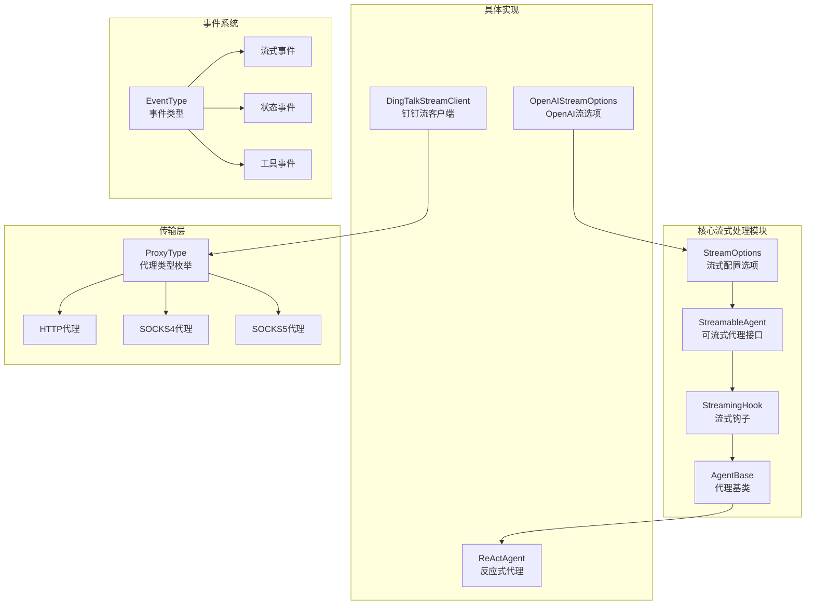
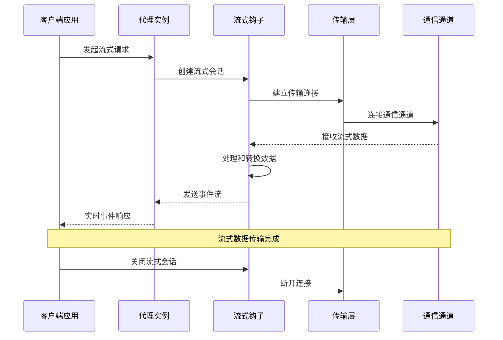
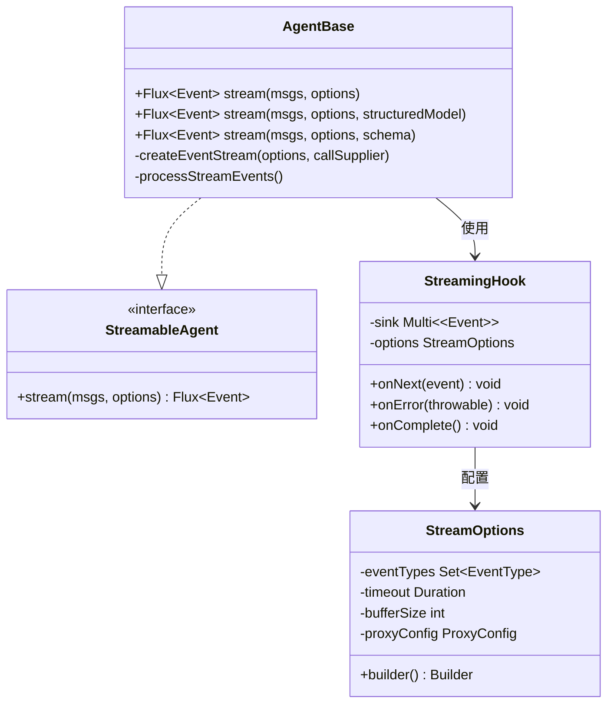
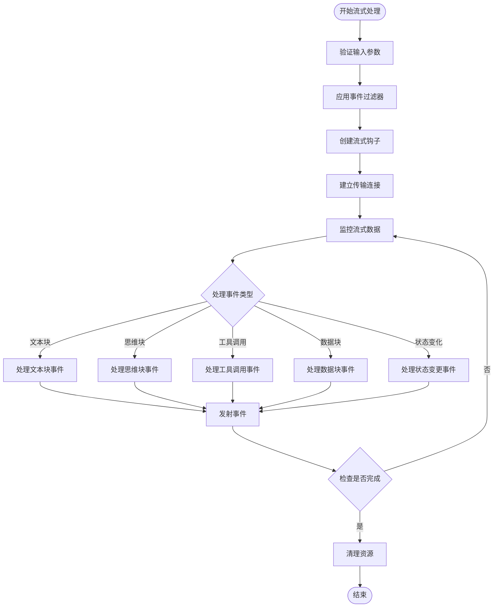
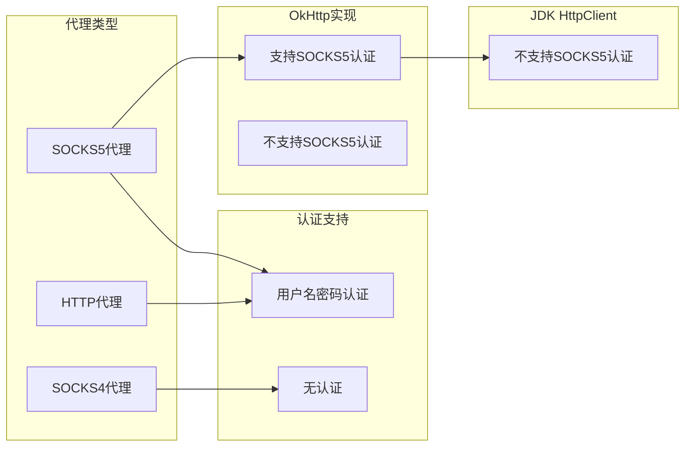
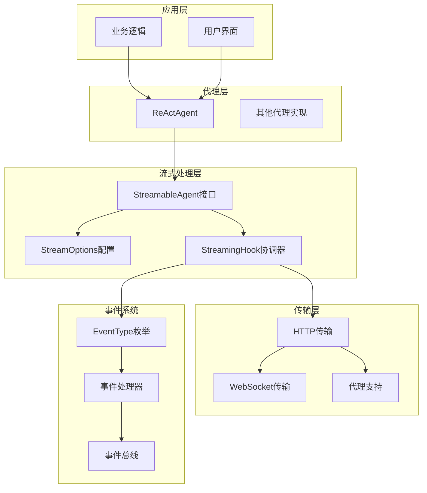

# 流式代理功能

<cite>
**本文档引用的文件**
- [StreamOptions.java](file://agentscope-core/src/main/java/io/agentscope/core/agent/StreamOptions.java)
- [StreamableAgent.java](file://agentscope-core/src/main/java/io/agentscope/core/agent/StreamableAgent.java)
- [StreamingHook.java](file://agentscope-core/src/main/java/io/agentscope/core/agent/StreamingHook.java)
- [AgentBase.java](file://agentscope-core/src/main/java/io/agentscope/core/agent/AgentBase.java)
- [ReActAgent.java](file://agentscope-core/src/main/java/io/agentscope/core/ReActAgent.java)
- [EventType.java](file://agentscope-core/src/main/java/io/agentscope/core/agent/EventType.java)
- [ProxyType.java](file://agentscope-core/src/main/java/io/agentscope/core/model/transport/ProxyType.java)
- [DingTalkStreamClient.java](file://agentscope-extensions/agentscope-extensions-channel/agentscope-extensions-channel-dingtalk/src/main/java/io/agentscope/extensions/channel/dingtalk/DingTalkStreamClient.java)
- [OpenAIStreamOptions.java](file://agentscope-extensions/agentscope-extensions-model/openai/src/main/java/io/agentscope/extensions/model/openai/dto/OpenAIStreamOptions.java)
</cite>

## 目录
1. [简介](#简介)
2. [项目结构](#项目结构)
3. [核心组件](#核心组件)
4. [架构概览](#架构概览)
5. [详细组件分析](#详细组件分析)
6. [依赖关系分析](#依赖关系分析)
7. [性能考虑](#性能考虑)
8. [故障排除指南](#故障排除指南)
9. [结论](#结论)

## 简介

Agentscope Java项目的流式代理功能是一个强大的实时数据传输和事件处理系统。该功能允许应用程序以流式方式接收和处理来自各种代理服务的数据，支持多种传输协议和代理类型。流式代理功能通过事件驱动的方式提供实时响应，使得应用程序能够及时处理用户输入、模型输出和其他异步事件。

该系统的核心设计目标是提供高效、可靠的流式数据传输机制，支持从简单的文本对话到复杂的多模态交互场景。通过流式处理，系统能够在数据到达时立即进行处理，而不是等待完整的响应，从而显著改善用户体验和应用性能。

## 项目结构

流式代理功能在项目中的组织结构如下：

**图表来源**
- [StreamOptions.java:61-365](file://agentscope-core/src/main/java/io/agentscope/core/agent/StreamOptions.java#L61-L365)
- [StreamableAgent.java:1-50](file://agentscope-core/src/main/java/io/agentscope/core/agent/StreamableAgent.java#L1-L50)
- [StreamingHook.java:1-80](file://agentscope-core/src/main/java/io/agentscope/core/agent/StreamingHook.java#L1-L80)
- [AgentBase.java:928-980](file://agentscope-core/src/main/java/io/agentscope/core/agent/AgentBase.java#L928-L980)

**章节来源**
- [StreamOptions.java:1-400](file://agentscope-core/src/main/java/io/agentscope/core/agent/StreamOptions.java#L1-L400)
- [StreamableAgent.java:1-50](file://agentscope-core/src/main/java/io/agentscope/core/agent/StreamableAgent.java#L1-L50)
- [StreamingHook.java:1-80](file://agentscope-core/src/main/java/io/agentscope/core/agent/StreamingHook.java#L1-L80)

## 核心组件

### StreamOptions - 流式配置选项

StreamOptions是流式代理功能的核心配置类，提供了灵活的流式处理参数设置。该类支持多种配置选项，包括事件过滤、超时控制、缓冲策略等。

主要特性：
- **事件过滤**：支持按事件类型过滤流式事件
- **超时控制**：提供连接超时和读取超时配置
- **缓冲策略**：支持不同的缓冲模式和大小设置
- **认证支持**：集成代理认证机制
- **结构化输出**：支持JSON Schema验证的结构化输出

### StreamableAgent - 可流式代理接口

StreamableAgent定义了所有支持流式处理的代理必须实现的基本接口。该接口扩展了基础代理能力，增加了流式数据处理方法。

关键方法：
- `stream()`方法族：提供不同参数组合的流式调用
- 事件发射：支持实时事件流式传输
- 状态管理：维护流式会话的状态信息

### StreamingHook - 流式钩子

StreamingHook作为流式处理的核心协调器，负责管理事件流的生命周期和数据传输。它充当代理与外部系统之间的桥梁，确保数据的正确传递和处理。

主要职责：
- **事件调度**：协调不同类型事件的发送顺序
- **错误处理**：捕获和处理流式过程中的异常
- **资源管理**：管理流式连接的建立和释放
- **数据转换**：将内部数据格式转换为外部兼容格式

**章节来源**
- [StreamOptions.java:61-365](file://agentscope-core/src/main/java/io/agentscope/core/agent/StreamOptions.java#L61-L365)
- [StreamableAgent.java:1-50](file://agentscope-core/src/main/java/io/agentscope/core/agent/StreamableAgent.java#L1-L50)
- [StreamingHook.java:1-80](file://agentscope-core/src/main/java/io/agentscope/core/agent/StreamingHook.java#L1-L80)

## 架构概览

流式代理系统的整体架构采用分层设计，从底层传输到上层应用形成清晰的抽象层次。

**图表来源**
- [AgentBase.java:980-987](file://agentscope-core/src/main/java/io/agentscope/core/agent/AgentBase.java#L980-L987)
- [StreamingHook.java:1-80](file://agentscope-core/src/main/java/io/agentscope/core/agent/StreamingHook.java#L1-L80)

系统架构的关键特点：
- **异步处理**：基于响应式编程模型，支持非阻塞操作
- **事件驱动**：通过事件总线实现松耦合的组件通信
- **可扩展性**：支持多种传输协议和代理类型
- **容错性**：内置错误处理和重试机制

## 详细组件分析

### 代理基类架构

AgentBase作为所有代理的基础实现，提供了流式处理的核心框架。它包含了流式会话管理、事件处理和状态维护等关键功能。

**图表来源**
- [AgentBase.java:928-980](file://agentscope-core/src/main/java/io/agentscope/core/agent/AgentBase.java#L928-L980)
- [StreamableAgent.java:1-50](file://agentscope-core/src/main/java/io/agentscope/core/agent/StreamableAgent.java#L1-L50)
- [StreamingHook.java:1-80](file://agentscope-core/src/main/java/io/agentscope/core/agent/StreamingHook.java#L1-L80)
- [StreamOptions.java:61-131](file://agentscope-core/src/main/java/io/agentscope/core/agent/StreamOptions.java#L61-L131)

### 事件系统设计

流式代理功能的事件系统是整个架构的核心，负责管理和传播各种类型的事件。

**图表来源**
- [EventType.java:95-150](file://agentscope-core/src/main/java/io/agentscope/core/agent/EventType.java#L95-L150)
- [AgentBase.java:980-987](file://agentscope-core/src/main/java/io/agentscope/core/agent/AgentBase.java#L980-L987)

### 传输层代理支持

系统支持多种代理类型，每种代理都有其特定的配置要求和使用场景。

**图表来源**
- [ProxyType.java:24-47](file://agentscope-core/src/main/java/io/agentscope/core/model/transport/ProxyType.java#L24-L47)

**章节来源**
- [ProxyType.java:18-47](file://agentscope-core/src/main/java/io/agentscope/core/model/transport/ProxyType.java#L18-L47)
- [DingTalkStreamClient.java:1-100](file://agentscope-extensions/agentscope-extensions-channel/agentscope-extensions-channel-dingtalk/src/main/java/io/agentscope/extensions/channel/dingtalk/DingTalkStreamClient.java#L1-L100)

### 具体实现示例

#### ReActAgent流式处理

ReActAgent展示了如何在实际代理中实现流式功能，包括事件流的创建和处理。

#### OpenAI集成

OpenAIStreamOptions提供了针对OpenAI API的流式配置，支持结构化输出和流式响应处理。

**章节来源**
- [ReActAgent.java:754-777](file://agentscope-core/src/main/java/io/agentscope/core/ReActAgent.java#L754-L777)
- [OpenAIStreamOptions.java:1-80](file://agentscope-extensions/agentscope-extensions-model/openai/src/main/java/io/agentscope/extensions/model/openai/dto/OpenAIStreamOptions.java#L1-L80)

## 依赖关系分析

流式代理功能的依赖关系体现了清晰的分层架构和模块化设计。

**图表来源**
- [AgentBase.java:928-980](file://agentscope-core/src/main/java/io/agentscope/core/agent/AgentBase.java#L928-L980)
- [StreamOptions.java:61-131](file://agentscope-core/src/main/java/io/agentscope/core/agent/StreamOptions.java#L61-L131)

**章节来源**
- [AgentBase.java:928-987](file://agentscope-core/src/main/java/io/agentscope/core/agent/AgentBase.java#L928-L987)
- [StreamOptions.java:124-131](file://agentscope-core/src/main/java/io/agentscope/core/agent/StreamOptions.java#L124-L131)

## 性能考虑

流式代理功能在设计时充分考虑了性能优化，采用了多种策略来确保高效的流式数据处理。

### 内存管理
- **背压处理**：实现响应式背压机制，防止内存溢出
- **流式缓冲**：动态调整缓冲区大小以适应不同数据流量
- **资源回收**：及时释放不再使用的连接和对象

### 网络优化
- **连接复用**：重用HTTP连接减少建立开销
- **压缩传输**：支持GZIP压缩减少网络带宽占用
- **批量处理**：合并小事件提高传输效率

### 并发控制
- **线程池管理**：合理配置线程池大小避免过度并发
- **异步处理**：使用非阻塞I/O提高吞吐量
- **限流机制**：防止过载情况下系统崩溃

## 故障排除指南

### 常见问题及解决方案

**连接超时问题**
- 检查网络连接和代理配置
- 调整超时参数设置
- 验证防火墙和安全组规则

**事件丢失问题**
- 检查事件过滤器配置
- 验证事件订阅者状态
- 确认缓冲区大小设置

**内存泄漏问题**
- 检查流式会话的正确关闭
- 验证资源清理机制
- 监控内存使用情况

### 调试技巧

1. **启用详细日志**：配置流式处理的日志级别
2. **监控指标**：跟踪事件处理延迟和吞吐量
3. **性能分析**：使用性能分析工具识别瓶颈

**章节来源**
- [EventType.java:95-150](file://agentscope-core/src/main/java/io/agentscope/core/agent/EventType.java#L95-L150)
- [ProxyType.java:24-47](file://agentscope-core/src/main/java/io/agentscope/core/model/transport/ProxyType.java#L24-L47)

## 结论

Agentscope Java项目的流式代理功能提供了一个强大而灵活的实时数据处理框架。通过精心设计的架构和模块化实现，系统能够支持各种复杂的流式应用场景。

该功能的主要优势包括：
- **高度可配置**：通过StreamOptions提供丰富的配置选项
- **强扩展性**：支持多种传输协议和代理类型
- **高性能**：采用响应式编程模型确保高效的流式处理
- **易用性**：简洁的API设计降低使用复杂度

未来的发展方向可能包括：
- 更多传输协议的支持
- 增强的错误处理和恢复机制
- 更精细的性能优化
- 扩展的监控和调试工具

流式代理功能为构建现代、响应式的AI应用奠定了坚实的基础，是Agentscope生态系统中的重要组成部分。
