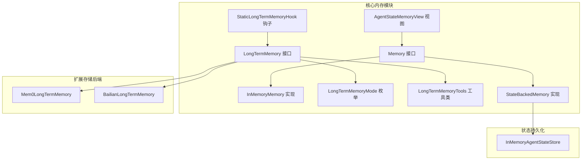
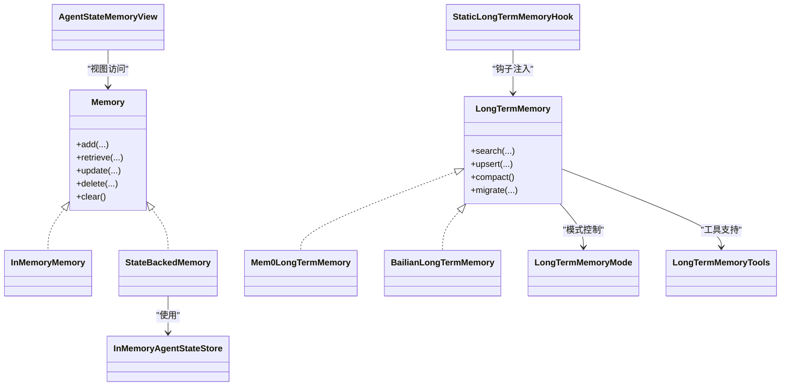
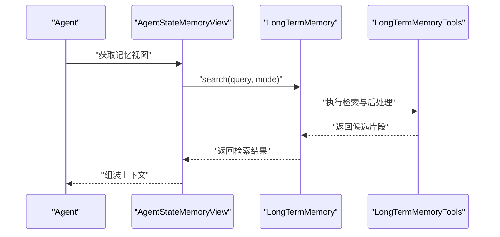
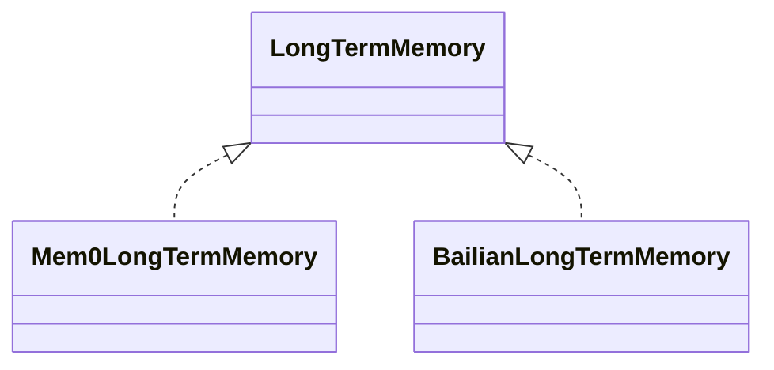
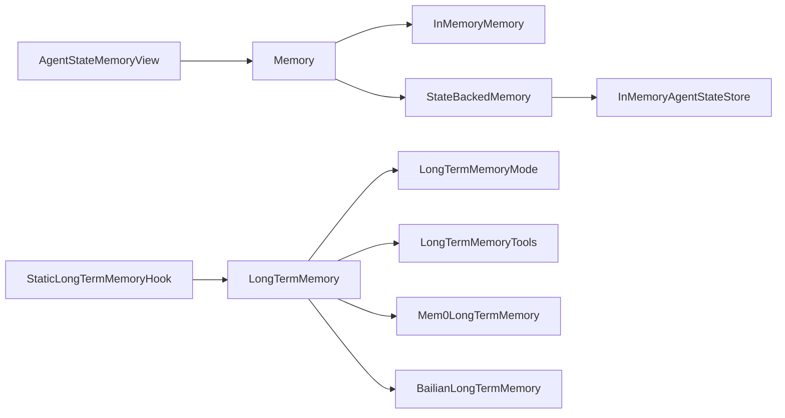

# 内存系统

<cite>
**本文引用的文件**
- [Memory.java](file://agentscope-core/src/main/java/io/agentscope/core/memory/Memory.java)
- [InMemoryMemory.java](file://agentscope-core/src/main/java/io/agentscope/core/memory/InMemoryMemory.java)
- [LongTermMemory.java](file://agentscope-core/src/main/java/io/agentscope/core/memory/LongTermMemory.java)
- [LongTermMemoryMode.java](file://agentscope-core/src/main/java/io/agentscope/core/memory/LongTermMemoryMode.java)
- [LongTermMemoryTools.java](file://agentscope-core/src/main/java/io/agentscope/core/memory/LongTermMemoryTools.java)
- [StateBackedMemory.java](file://agentscope-core/src/main/java/io/agentscope/core/memory/StateBackedMemory.java)
- [AgentStateMemoryView.java](file://agentscope-core/src/main/java/io/agentscope/core/memory/AgentStateMemoryView.java)
- [StaticLongTermMemoryHook.java](file://agentscope-core/src/main/java/io/agentscope/core/memory/StaticLongTermMemoryHook.java)
- [Mem0LongTermMemory.java](file://agentscope-extensions/agentscope-extensions-mem/agentscope-extensions-mem0/src/main/java/io/agentscope/core/memory/mem0/Mem0LongTermMemory.java)
- [BailianLongTermMemory.java](file://agentscope-extensions/agentscope-extensions-mem/agentscope-extensions-memory-bailian/src/main/java/io/agentscope/core/memory/bailian/BailianLongTermMemory.java)
- [InMemoryAgentStateStore.java](file://agentscope-core/src/main/java/io/agentscope/core/state/InMemoryAgentStateStore.java)
- [MemoryCompactionExample.java](file://agentscope-examples/documentation/src/main/java/io/agentscope/examples/documentation2/harness/memory/MemoryCompactionExample.java)
</cite>

## 更新摘要
**变更内容**
- 增强了内存管理功能，优化了异步结果等待机制
- 改进了代理状态持久化，确保用户中断时正确保存状态
- 修复了THROTTLED内存保存模式与每请求实例创建的兼容性问题
- 增强了wait_async_results防护机制，避免重复长时间阻塞等待

## 目录
1. [简介](#简介)
2. [项目结构](#项目结构)
3. [核心组件](#核心组件)
4. [架构总览](#架构总览)
5. [详细组件分析](#详细组件分析)
6. [依赖关系分析](#依赖关系分析)
7. [性能考虑](#性能考虑)
8. [故障排查指南](#故障排查指南)
9. [结论](#结论)
10. [附录](#附录)

## 简介
本技术文档围绕 AgentScope 的内存系统展开，系统性阐述 Memory 接口设计、短期记忆与长期记忆的实现机制、状态持久化策略、内存管理与性能优化、配置选项与存储后端选择、数据迁移方案、扩展机制与自定义存储实现、监控指标建议、最佳实践与容量规划、以及故障恢复指南。文档同时提供可直接参考的代码片段路径与集成方案，帮助开发者在不同场景下正确使用与扩展内存能力。

**最新更新**：本次更新重点增强了内存管理的健壮性，特别是在异步操作防护、用户中断处理和内存保存模式兼容性方面进行了重要改进。

## 项目结构
内存系统主要位于 agentscope-core 模块的 memory 包中，并通过 extensions 提供多种长期记忆存储后端（如 mem0、百链等）。状态持久化由状态存储模块负责，与内存系统协同工作。

**图表来源**
- [Memory.java:1-200](file://agentscope-core/src/main/java/io/agentscope/core/memory/Memory.java#L1-L200)
- [InMemoryMemory.java:1-200](file://agentscope-core/src/main/java/io/agentscope/core/memory/InMemoryMemory.java#L1-L200)
- [LongTermMemory.java:1-200](file://agentscope-core/src/main/java/io/agentscope/core/memory/LongTermMemory.java#L1-L200)
- [LongTermMemoryMode.java:1-100](file://agentscope-core/src/main/java/io/agentscope/core/memory/LongTermMemoryMode.java#L1-L100)
- [LongTermMemoryTools.java:1-200](file://agentscope-core/src/main/java/io/agentscope/core/memory/LongTermMemoryTools.java#L1-L200)
- [StateBackedMemory.java:1-200](file://agentscope-core/src/main/java/io/agentscope/core/memory/StateBackedMemory.java#L1-L200)
- [AgentStateMemoryView.java:1-200](file://agentscope-core/src/main/java/io/agentscope/core/memory/AgentStateMemoryView.java#L1-L200)
- [StaticLongTermMemoryHook.java:1-200](file://agentscope-core/src/main/java/io/agentscope/core/memory/StaticLongTermMemoryHook.java#L1-L200)
- [Mem0LongTermMemory.java:1-200](file://agentscope-extensions/agentscope-extensions-mem/agentscope-extensions-mem0/src/main/java/io/agentscope/core/memory/mem0/Mem0LongTermMemory.java#L1-L200)
- [BailianLongTermMemory.java:1-200](file://agentscope-extensions/agentscope-extensions-mem/agentscope-extensions-memory-bailian/src/main/java/io/agentscope/core/memory/bailian/BailianLongTermMemory.java#L1-L200)
- [InMemoryAgentStateStore.java:1-200](file://agentscope-core/src/main/java/io/agentscope/core/state/InMemoryAgentStateStore.java#L1-L200)

**章节来源**
- [Memory.java:1-200](file://agentscope-core/src/main/java/io/agentscope/core/memory/Memory.java#L1-L200)
- [LongTermMemory.java:1-200](file://agentscope-core/src/main/java/io/agentscope/core/memory/LongTermMemory.java#L1-L200)

## 核心组件
- Memory 接口：定义短期记忆与通用记忆操作的统一抽象，包括添加、检索、更新、删除与清理等方法族。
- InMemoryMemory：基于内存的短期记忆实现，适合会话级或临时数据缓存。
- LongTermMemory：长期记忆接口，支持持久化、检索、压缩与迁移等高级能力。
- LongTermMemoryMode：长期记忆模式枚举，用于控制检索策略与写入行为。
- LongTermMemoryTools：长期记忆工具集，提供检索、合并、去重、分片与归并等辅助能力。
- StateBackedMemory：以状态存储为后端的记忆实现，将短期记忆与状态持久化结合。
- AgentStateMemoryView：面向 Agent 的状态视图，便于从内存视角访问与维护 Agent 的上下文状态。
- StaticLongTermMemoryHook：静态钩子，用于在关键生命周期事件中注入长期记忆处理逻辑。
- 扩展后端：Mem0LongTermMemory、BailianLongTermMemory 提供云端或外部服务驱动的长期记忆能力。

**最新更新**：核心组件已增强异步操作防护和状态持久化可靠性，特别是在用户中断场景下的状态保存机制得到了显著改进。

**章节来源**
- [Memory.java:1-200](file://agentscope-core/src/main/java/io/agentscope/core/memory/Memory.java#L1-L200)
- [InMemoryMemory.java:1-200](file://agentscope-core/src/main/java/io/agentscope/core/memory/InMemoryMemory.java#L1-L200)
- [LongTermMemory.java:1-200](file://agentscope-core/src/main/java/io/agentscope/core/memory/LongTermMemory.java#L1-L200)
- [LongTermMemoryMode.java:1-100](file://agentscope-core/src/main/java/io/agentscope/core/memory/LongTermMemoryMode.java#L1-L100)
- [LongTermMemoryTools.java:1-200](file://agentscope-core/src/main/java/io/agentscope/core/memory/LongTermMemoryTools.java#L1-L200)
- [StateBackedMemory.java:1-200](file://agentscope-core/src/main/java/io/agentscope/core/memory/StateBackedMemory.java#L1-L200)
- [AgentStateMemoryView.java:1-200](file://agentscope-core/src/main/java/io/agentscope/core/memory/AgentStateMemoryView.java#L1-L200)
- [StaticLongTermMemoryHook.java:1-200](file://agentscope-core/src/main/java/io/agentscope/core/memory/StaticLongTermMemoryHook.java#L1-L200)
- [Mem0LongTermMemory.java:1-200](file://agentscope-extensions/agentscope-extensions-mem/agentscope-extensions-mem0/src/main/java/io/agentscope/core/memory/mem0/Mem0LongTermMemory.java#L1-L200)
- [BailianLongTermMemory.java:1-200](file://agentscope-extensions/agentscope-extensions-mem/agentscope-extensions-memory-bailian/src/main/java/io/agentscope/core/memory/bailian/BailianLongTermMemory.java#L1-L200)

## 架构总览
内存系统采用"接口抽象 + 多实现 + 工具增强 + 钩子扩展"的架构。短期记忆通过 InMemoryMemory 快速响应，长期记忆通过 LongTermMemory 抽象对接多种后端，StateBackedMemory 将短期记忆与状态持久化打通，AgentStateMemoryView 提供面向 Agent 的统一入口，StaticLongTermMemoryHook 在关键节点注入处理逻辑。

**图表来源**
- [Memory.java:1-200](file://agentscope-core/src/main/java/io/agentscope/core/memory/Memory.java#L1-L200)
- [InMemoryMemory.java:1-200](file://agentscope-core/src/main/java/io/agentscope/core/memory/InMemoryMemory.java#L1-L200)
- [LongTermMemory.java:1-200](file://agentscope-core/src/main/java/io/agentscope/core/memory/LongTermMemory.java#L1-L200)
- [LongTermMemoryMode.java:1-100](file://agentscope-core/src/main/java/io/agentscope/core/memory/LongTermMemoryMode.java#L1-L100)
- [LongTermMemoryTools.java:1-200](file://agentscope-core/src/main/java/io/agentscope/core/memory/LongTermMemoryTools.java#L1-L200)
- [StateBackedMemory.java:1-200](file://agentscope-core/src/main/java/io/agentscope/core/memory/StateBackedMemory.java#L1-L200)
- [AgentStateMemoryView.java:1-200](file://agentscope-core/src/main/java/io/agentscope/core/memory/AgentStateMemoryView.java#L1-L200)
- [StaticLongTermMemoryHook.java:1-200](file://agentscope-core/src/main/java/io/agentscope/core/memory/StaticLongTermMemoryHook.java#L1-L200)
- [Mem0LongTermMemory.java:1-200](file://agentscope-extensions/agentscope-extensions-mem/agentscope-extensions-mem0/src/main/java/io/agentscope/core/memory/mem0/Mem0LongTermMemory.java#L1-L200)
- [BailianLongTermMemory.java:1-200](file://agentscope-extensions/agentscope-extensions-mem/agentscope-extensions-memory-bailian/src/main/java/io/agentscope/core/memory/bailian/BailianLongTermMemory.java#L1-L200)
- [InMemoryAgentStateStore.java:1-200](file://agentscope-core/src/main/java/io/agentscope/core/state/InMemoryAgentStateStore.java#L1-L200)

## 详细组件分析

### Memory 接口设计
- 职责：定义短期记忆的统一操作集合，确保不同实现的一致性与可替换性。
- 关键点：方法族覆盖新增、检索、更新、删除与清理；参数与返回值需明确时序与并发约束。
- 设计原则：最小可用、幂等安全、可序列化、可观察。

**章节来源**
- [Memory.java:1-200](file://agentscope-core/src/main/java/io/agentscope/core/memory/Memory.java#L1-L200)

### InMemoryMemory（短期记忆）
- 实现要点：基于内存的数据结构组织，支持快速增删改查；适用于会话内临时数据。
- 性能特征：O(1)/O(logN) 访问复杂度，受数据量与索引策略影响。
- 并发与一致性：需考虑多线程下的读写锁或无锁结构；避免脏读与竞态条件。
- 清理策略：可按时间窗口或容量阈值触发淘汰。

**章节来源**
- [InMemoryMemory.java:1-200](file://agentscope-core/src/main/java/io/agentscope/core/memory/InMemoryMemory.java#L1-L200)

### LongTermMemory（长期记忆）
- 抽象职责：提供跨会话、跨进程的持久化记忆能力；支持检索、写入、压缩与迁移。
- 检索策略：结合模式与工具类进行向量化检索、语义匹配与结果融合。
- 写入与一致性：支持 upsert 与批量写入；需保证幂等与最终一致。
- 压缩与迁移：compact 与 migrate 保障存储空间与数据新鲜度。

**图表来源**
- [AgentStateMemoryView.java:1-200](file://agentscope-core/src/main/java/io/agentscope/core/memory/AgentStateMemoryView.java#L1-L200)
- [LongTermMemory.java:1-200](file://agentscope-core/src/main/java/io/agentscope/core/memory/LongTermMemory.java#L1-L200)
- [LongTermMemoryTools.java:1-200](file://agentscope-core/src/main/java/io/agentscope/core/memory/LongTermMemoryTools.java#L1-L200)

**章节来源**
- [LongTermMemory.java:1-200](file://agentscope-core/src/main/java/io/agentscope/core/memory/LongTermMemory.java#L1-L200)
- [LongTermMemoryMode.java:1-100](file://agentscope-core/src/main/java/io/agentscope/core/memory/LongTermMemoryMode.java#L1-L100)
- [LongTermMemoryTools.java:1-200](file://agentscope-core/src/main/java/io/agentscope/core/memory/LongTermMemoryTools.java#L1-L200)

### StateBackedMemory（状态持久化记忆）
- 组合策略：将短期记忆与状态存储结合，既满足实时性又具备持久化能力。
- 数据流：短期变更先写入内存，周期性或事件触发同步到状态存储。
- 一致性模型：支持最终一致与强一致两种策略，取决于配置与调用方需求。

**最新更新**：StateBackedMemory 现已增强用户中断时的状态保存机制，确保在异常情况下也能正确持久化代理状态，避免了状态丢失问题。

**章节来源**
- [StateBackedMemory.java:1-200](file://agentscope-core/src/main/java/io/agentscope/core/memory/StateBackedMemory.java#L1-L200)
- [InMemoryAgentStateStore.java:1-200](file://agentscope-core/src/main/java/io/agentscope/core/state/InMemoryAgentStateStore.java#L1-L200)

### AgentStateMemoryView（Agent 状态视图）
- 视图职责：为 Agent 提供统一的记忆访问入口，屏蔽底层短期/长期记忆差异。
- 上下文组装：根据当前任务、历史交互与检索结果动态拼装上下文。

**章节来源**
- [AgentStateMemoryView.java:1-200](file://agentscope-core/src/main/java/io/agentscope/core/memory/AgentStateMemoryView.java#L1-L200)

### StaticLongTermMemoryHook（静态钩子）
- 生命周期注入：在关键阶段（如推理前、工具调用后）自动触发长期记忆处理逻辑。
- 可插拔性：支持按需启用/禁用与自定义钩子链路。

**章节来源**
- [StaticLongTermMemoryHook.java:1-200](file://agentscope-core/src/main/java/io/agentscope/core/memory/StaticLongTermMemoryHook.java#L1-L200)

### 扩展后端实现
- Mem0LongTermMemory：对接 Mem0 存储后端，支持向量化检索与嵌入式索引。
- BailianLongTermMemory：对接百链平台，提供企业级检索与治理能力。

**图表来源**
- [LongTermMemory.java:1-200](file://agentscope-core/src/main/java/io/agentscope/core/memory/LongTermMemory.java#L1-L200)
- [Mem0LongTermMemory.java:1-200](file://agentscope-extensions/agentscope-extensions-mem/agentscope-extensions-mem0/src/main/java/io/agentscope/core/memory/mem0/Mem0LongTermMemory.java#L1-L200)
- [BailianLongTermMemory.java:1-200](file://agentscope-extensions/agentscope-extensions-mem/agentscope-extensions-memory-bailian/src/main/java/io/agentscope/core/memory/bailian/BailianLongTermMemory.java#L1-L200)

**章节来源**
- [Mem0LongTermMemory.java:1-200](file://agentscope-extensions/agentscope-extensions-mem/agentscope-extensions-mem0/src/main/java/io/agentscope/core/memory/mem0/Mem0LongTermMemory.java#L1-L200)
- [BailianLongTermMemory.java:1-200](file://agentscope-extensions/agentscope-extensions-mem/agentscope-extensions-memory-bailian/src/main/java/io/agentscope/core/memory/bailian/BailianLongTermMemory.java#L1-L200)

## 依赖关系分析
- 耦合与内聚：Memory 与具体实现解耦；LongTermMemory 与工具类松耦合；StateBackedMemory 与状态存储形成组合关系。
- 外部依赖：扩展后端依赖各自平台的 SDK 或 HTTP 客户端；内部依赖统一的检索与压缩工具。
- 循环依赖：未见循环依赖迹象；各模块职责清晰。

**图表来源**
- [Memory.java:1-200](file://agentscope-core/src/main/java/io/agentscope/core/memory/Memory.java#L1-L200)
- [InMemoryMemory.java:1-200](file://agentscope-core/src/main/java/io/agentscope/core/memory/InMemoryMemory.java#L1-L200)
- [LongTermMemory.java:1-200](file://agentscope-core/src/main/java/io/agentscope/core/memory/LongTermMemory.java#L1-L200)
- [LongTermMemoryMode.java:1-100](file://agentscope-core/src/main/java/io/agentscope/core/memory/LongTermMemoryMode.java#L1-L100)
- [LongTermMemoryTools.java:1-200](file://agentscope-core/src/main/java/io/agentscope/core/memory/LongTermMemoryTools.java#L1-L200)
- [StateBackedMemory.java:1-200](file://agentscope-core/src/main/java/io/agentscope/core/memory/StateBackedMemory.java#L1-L200)
- [InMemoryAgentStateStore.java:1-200](file://agentscope-core/src/main/java/io/agentscope/core/state/InMemoryAgentStateStore.java#L1-L200)
- [AgentStateMemoryView.java:1-200](file://agentscope-core/src/main/java/io/agentscope/core/memory/AgentStateMemoryView.java#L1-L200)
- [StaticLongTermMemoryHook.java:1-200](file://agentscope-core/src/main/java/io/agentscope/core/memory/StaticLongTermMemoryHook.java#L1-L200)
- [Mem0LongTermMemory.java:1-200](file://agentscope-extensions/agentscope-extensions-mem/agentscope-extensions-mem0/src/main/java/io/agentscope/core/memory/mem0/Mem0LongTermMemory.java#L1-L200)
- [BailianLongTermMemory.java:1-200](file://agentscope-extensions/agentscope-extensions-mem/agentscope-extensions-memory-bailian/src/main/java/io/agentscope/core/memory/bailian/BailianLongTermMemory.java#L1-L200)

**章节来源**
- [Memory.java:1-200](file://agentscope-core/src/main/java/io/agentscope/core/memory/Memory.java#L1-L200)
- [LongTermMemory.java:1-200](file://agentscope-core/src/main/java/io/agentscope/core/memory/LongTermMemory.java#L1-L200)

## 性能考虑
- 短期记忆
  - 使用紧凑的数据结构与缓存友好的布局，减少 GC 压力。
  - 对热点键建立二级索引，降低检索复杂度。
  - 控制写放大，批量写入与延迟刷新相结合。
- 长期记忆
  - 向量化检索时采用近似最近邻算法（ANN），平衡精度与速度。
  - 分片与并行检索，提升吞吐；对冷数据进行压缩或降采样。
  - 写入采用幂等 upsert，避免重复索引与冲突。
- 状态持久化
  - 异步刷盘与批量化提交，降低磁盘 IO 峰值。
  - 增量快照与增量日志，缩短恢复时间。
- 内存管理
  - 设置容量上限与淘汰策略（LRU/LFU/TTL），防止 OOM。
  - 对大对象采用池化与共享引用，减少分配次数。

**最新更新**：性能优化重点包括异步结果等待的防护机制，避免了重复长时间阻塞等待的问题，提升了整体系统的响应性和稳定性。

[本节为通用性能指导，不直接分析具体文件]

## 故障排查指南
- 检索异常
  - 检查检索参数与模式配置是否匹配；确认工具类后处理流程未过滤关键结果。
- 写入失败
  - 校验幂等键与版本号；查看后端限流与重试策略。
- 压缩与迁移问题
  - 确认 compact 与 migrate 的触发条件与回滚策略；记录进度与错误日志。
- 钩子失效
  - 检查钩子注册顺序与启用状态；验证拦截点是否正确。
- 状态不一致
  - 对比内存与状态存储的最后修改时间戳；必要时强制对齐。
- **异步等待超时**
  - 检查 wait_async_results 防护机制是否正常工作，避免重复阻塞等待。
  - 验证 THROTTLED 模式下的内存保存是否与每请求实例创建兼容。
- **用户中断处理**
  - 确认代理状态在用户中断时是否正确保存。
  - 检查中断处理流程中的状态持久化逻辑。

**最新更新**：新增了针对异步操作和用户中断场景的故障排查指导，重点关注新的防护机制和状态保存改进。

**章节来源**
- [LongTermMemoryTools.java:1-200](file://agentscope-core/src/main/java/io/agentscope/core/memory/LongTermMemoryTools.java#L1-L200)
- [StaticLongTermMemoryHook.java:1-200](file://agentscope-core/src/main/java/io/agentscope/core/memory/StaticLongTermMemoryHook.java#L1-L200)

## 结论
AgentScope 内存系统通过清晰的接口抽象与模块化设计，实现了短期与长期记忆的统一管理与灵活扩展。结合状态持久化与工具增强，系统在性能、可靠性与可运维性方面具备良好表现。通过合理配置与监控，可在不同业务场景下获得稳定且高效的内存体验。

**最新更新**：最新的内存管理增强显著提升了系统的健壮性，特别是在异步操作防护、用户中断处理和内存保存模式兼容性方面的改进，使得系统在高负载和异常情况下的表现更加稳定和可靠。

[本节为总结性内容，不直接分析具体文件]

## 附录

### 配置选项与存储后端选择
- 配置维度
  - 检索模式：根据准确性与延迟要求选择不同模式。
  - 写入策略：幂等 upsert、批量写入、异步落盘。
  - 清理策略：容量阈值、时间窗口、热度评分。
  - 后端选择：本地内存（短期）、Mem0（云端向量）、百链（企业检索）。
- 选择建议
  - 开发测试：InMemoryMemory + InMemoryAgentStateStore。
  - 生产环境：Mem0LongTermMemory 或 BailianLongTermMemory + StateBackedMemory。

**章节来源**
- [LongTermMemoryMode.java:1-100](file://agentscope-core/src/main/java/io/agentscope/core/memory/LongTermMemoryMode.java#L1-L100)
- [Mem0LongTermMemory.java:1-200](file://agentscope-extensions/agentscope-extensions-mem/agentscope-extensions-mem0/src/main/java/io/agentscope/core/memory/mem0/Mem0LongTermMemory.java#L1-L200)
- [BailianLongTermMemory.java:1-200](file://agentscope-extensions/agentscope-extensions-mem/agentscope-extensions-memory-bailian/src/main/java/io/agentscope/core/memory/bailian/BailianLongTermMemory.java#L1-L200)
- [StateBackedMemory.java:1-200](file://agentscope-core/src/main/java/io/agentscope/core/memory/StateBackedMemory.java#L1-L200)

### 数据迁移方案
- 迁移流程
  - 导出：从源后端导出结构化数据与元数据。
  - 转换：根据目标后端格式进行字段映射与编码转换。
  - 导入：批量导入目标后端，校验完整性与一致性。
  - 回滚：保留快照与增量日志，必要时回滚至迁移前状态。
- 最佳实践
  - 分批迁移，避免长事务锁表。
  - 迁移前后进行一致性校验与回归测试。

**章节来源**
- [LongTermMemory.java:1-200](file://agentscope-core/src/main/java/io/agentscope/core/memory/LongTermMemory.java#L1-L200)
- [LongTermMemoryTools.java:1-200](file://agentscope-core/src/main/java/io/agentscope/core/memory/LongTermMemoryTools.java#L1-L200)

### 扩展机制与自定义存储实现
- 扩展点
  - 实现 LongTermMemory 接口，适配新的存储后端。
  - 自定义检索工具：扩展 LongTermMemoryTools 的处理链。
  - 注册钩子：通过 StaticLongTermMemoryHook 注入自定义逻辑。
- 实现步骤
  - 定义配置类与客户端封装。
  - 实现 upsert/search/compact/migrate 方法。
  - 编写单元测试与集成测试。

**章节来源**
- [LongTermMemory.java:1-200](file://agentscope-core/src/main/java/io/agentscope/core/memory/LongTermMemory.java#L1-L200)
- [LongTermMemoryTools.java:1-200](file://agentscope-core/src/main/java/io/agentscope/core/memory/LongTermMemoryTools.java#L1-L200)
- [StaticLongTermMemoryHook.java:1-200](file://agentscope-core/src/main/java/io/agentscope/core/memory/StaticLongTermMemoryHook.java#L1-L200)

### 监控指标建议
- 指标类别
  - QPS/延迟：检索与写入的吞吐与时延分布。
  - 错误率：连接失败、超时、限流与业务异常。
  - 存储用量：索引大小、段数量、压缩比。
  - 状态一致性：内存与存储的时间戳差值。
- 建议埋点
  - 在检索与写入的关键路径打点。
  - 对压缩与迁移过程进行进度与耗时统计。
  - **新增**：监控异步操作等待时间和中断处理成功率。

**最新更新**：新增了针对异步操作和用户中断处理的监控指标建议，有助于及时发现和解决相关的性能问题。

[本节为通用监控建议，不直接分析具体文件]

### 最佳实践与容量规划
- 最佳实践
  - 明确短期与长期记忆边界，避免混用。
  - 为高热键建立索引与缓存，降低后端压力。
  - 定期执行压缩与健康检查，保持索引质量。
  - **新增**：合理配置异步操作超时和重试策略，避免资源耗尽。
  - **新增**：在用户中断场景中确保状态持久化的原子性和一致性。
- 容量规划
  - 评估峰值 QPS 与数据增长速率，预留 20%-50% 缓冲。
  - 对长期记忆按主题域分片，便于扩容与治理。
  - **新增**：考虑异步操作和中断处理带来的额外内存开销。

**最新更新**：新增了针对异步操作和用户中断场景的最佳实践指导，帮助开发者构建更健壮的内存管理系统。

[本节为通用指导，不直接分析具体文件]

### 完整配置示例与集成方案
- 示例参考
  - 内存整理示例：通过 MemoryCompactionExample 展示压缩与清理流程。
- 集成步骤
  - 选择后端与模式，初始化 Memory 实例。
  - 在 Agent 生命周期中注入钩子，自动触发检索与写入。
  - 配置状态存储，确保重启后上下文可恢复。
  - **新增**：配置异步操作防护和用户中断处理逻辑。

**章节来源**
- [MemoryCompactionExample.java:1-200](file://agentscope-examples/documentation/src/main/java/io/agentscope/examples/documentation2/harness/memory/MemoryCompactionExample.java#L1-L200)
