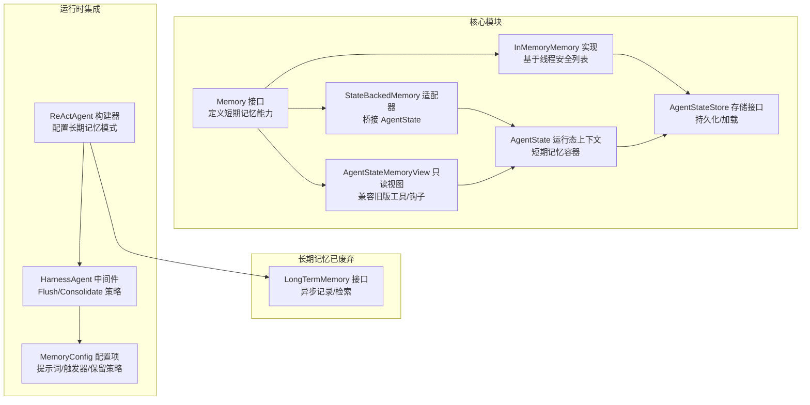
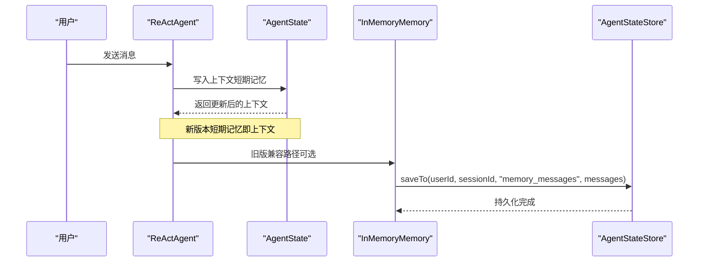
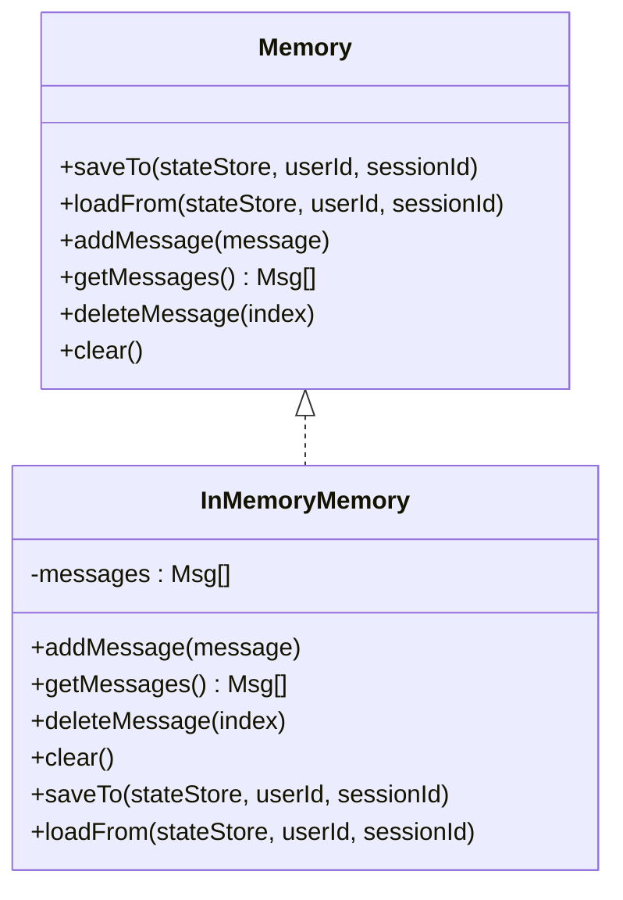
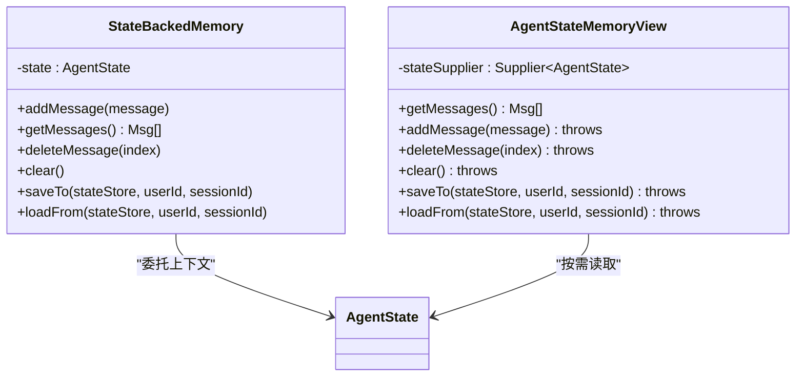
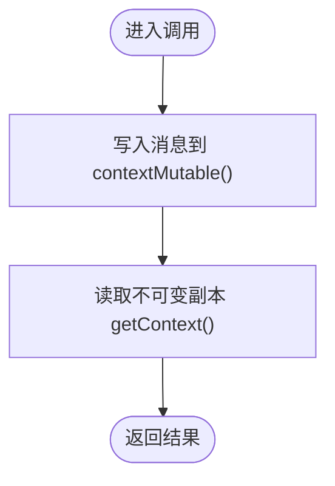
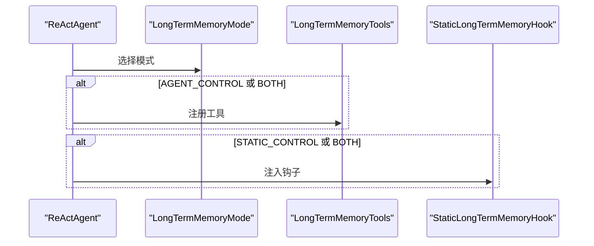
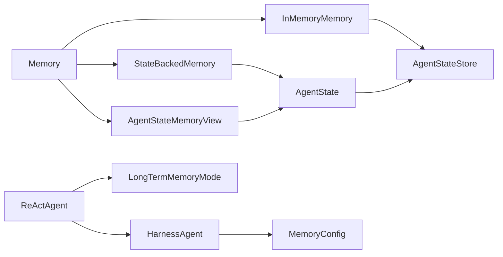

# 短期记忆

<cite>
**本文引用的文件**
- [Memory.java](file://agentscope-core/src/main/java/io/agentscope/core/memory/Memory.java)
- [InMemoryMemory.java](file://agentscope-core/src/main/java/io/agentscope/core/memory/InMemoryMemory.java)
- [StateBackedMemory.java](file://agentscope-core/src/main/java/io/agentscope/core/memory/StateBackedMemory.java)
- [AgentStateMemoryView.java](file://agentscope-core/src/main/java/io/agentscope/core/memory/AgentStateMemoryView.java)
- [LongTermMemory.java](file://agentscope-core/src/main/java/io/agentscope/core/memory/LongTermMemory.java)
- [AgentState.java](file://agentscope-core/src/main/java/io/agentscope/core/state/AgentState.java)
- [AgentStateStore.java](file://agentscope-core/src/main/java/io/agentscope/core/state/AgentStateStore.java)
- [InMemoryMemoryTest.java](file://agentscope-core/src/test/java/io/agentscope/core/legacy/memory/InMemoryMemoryTest.java)
- [InMemoryMemoryNewApiTest.java](file://agentscope-core/src/test/java/io/agentscope/core/legacy/memory/InMemoryMemoryNewApiTest.java)
- [ReActAgentTest.java](file://agentscope-core/src/test/java/io/agentscope/core/agent/ReActAgentTest.java)
- [ReActAgent.java](file://agentscope-core/src/main/java/io/agentscope/core/ReActAgent.java)
- [LongTermMemoryMode.java](file://agentscope-core/src/main/java/io/agentscope/core/memory/LongTermMemoryMode.java)
- [HarnessAgent.java](file://agentscope-harness/src/main/java/io/agentscope/harness/agent/HarnessAgent.java)
- [MemoryConfig.java](file://agentscope-harness/src/main/java/io/agentscope/harness/agent/memory/MemoryConfig.java)
</cite>

## 目录
1. [简介](#简介)
2. [项目结构](#项目结构)
3. [核心组件](#核心组件)
4. [架构总览](#架构总览)
5. [详细组件分析](#详细组件分析)
6. [依赖关系分析](#依赖关系分析)
7. [性能考虑](#性能考虑)
8. [故障排查指南](#故障排查指南)
9. [结论](#结论)
10. [附录](#附录)

## 简介
本文件面向AgentScope短期记忆系统，聚焦于InMemoryMemory实现机制、Memory接口设计原理与短期记忆数据结构，系统阐述短期记忆的生命周期管理、缓存策略与内存回收机制，并给出配置选项、容量限制与性能调优方法。同时提供使用场景、最佳实践、常见问题解决方案以及完整配置示例与集成指南。

## 项目结构
短期记忆相关代码主要位于agentscope-core模块的memory与state包中，配合Harness侧的内存管理中间件与配置项，形成从接口到实现再到运行时集成的完整链路。

**图表来源**
- [Memory.java:35-78](file://agentscope-core/src/main/java/io/agentscope/core/memory/Memory.java#L35-L78)
- [InMemoryMemory.java:37-134](file://agentscope-core/src/main/java/io/agentscope/core/memory/InMemoryMemory.java#L37-L134)
- [StateBackedMemory.java:36-79](file://agentscope-core/src/main/java/io/agentscope/core/memory/StateBackedMemory.java#L36-L79)
- [AgentStateMemoryView.java:43-60](file://agentscope-core/src/main/java/io/agentscope/core/memory/AgentStateMemoryView.java#L43-L60)
- [AgentState.java:59-188](file://agentscope-core/src/main/java/io/agentscope/core/state/AgentState.java#L59-L188)
- [AgentStateStore.java:61-166](file://agentscope-core/src/main/java/io/agentscope/core/state/AgentStateStore.java#L61-L166)
- [LongTermMemory.java:71-111](file://agentscope-core/src/main/java/io/agentscope/core/memory/LongTermMemory.java#L71-L111)
- [ReActAgent.java:4117-4146](file://agentscope-core/src/main/java/io/agentscope/core/ReActAgent.java#L4117-L4146)
- [HarnessAgent.java:1935-1945](file://agentscope-harness/src/main/java/io/agentscope/harness/agent/HarnessAgent.java#L1935-L1945)
- [MemoryConfig.java:170-281](file://agentscope-harness/src/main/java/io/agentscope/harness/agent/memory/MemoryConfig.java#L170-L281)

**章节来源**
- [Memory.java:22-78](file://agentscope-core/src/main/java/io/agentscope/core/memory/Memory.java#L22-L78)
- [InMemoryMemory.java:26-134](file://agentscope-core/src/main/java/io/agentscope/core/memory/InMemoryMemory.java#L26-L134)
- [AgentState.java:31-188](file://agentscope-core/src/main/java/io/agentscope/core/state/AgentState.java#L31-L188)
- [AgentStateStore.java:22-166](file://agentscope-core/src/main/java/io/agentscope/core/state/AgentStateStore.java#L22-L166)

## 核心组件
- Memory接口：定义短期记忆的核心能力，包括消息增删查清与状态持久化/加载。
- InMemoryMemory：基于线程安全列表的内存实现，支持状态序列化/反序列化。
- StateBackedMemory：将Memory操作委托给AgentState的上下文列表，保持向后兼容。
- AgentStateMemoryView：只读视图，供旧版工具/钩子读取AgentState上下文。
- AgentState：承载会话级上下文（短期记忆）、摘要、权限/工具/任务等子上下文。
- AgentStateStore：统一的状态存储接口，支持保存/加载/删除/列举会话。
- LongTermMemory（已废弃）：框架级长期记忆抽象，提供异步记录/检索能力。
- ReActAgent构建器：通过模式控制是否注册工具或自动注入钩子。
- Harness中间件与配置：提供Flush/Consolidate策略与保留策略等运行时优化。

**章节来源**
- [Memory.java:35-78](file://agentscope-core/src/main/java/io/agentscope/core/memory/Memory.java#L35-L78)
- [InMemoryMemory.java:37-134](file://agentscope-core/src/main/java/io/agentscope/core/memory/InMemoryMemory.java#L37-L134)
- [StateBackedMemory.java:36-79](file://agentscope-core/src/main/java/io/agentscope/core/memory/StateBackedMemory.java#L36-L79)
- [AgentStateMemoryView.java:43-60](file://agentscope-core/src/main/java/io/agentscope/core/memory/AgentStateMemoryView.java#L43-L60)
- [AgentState.java:59-188](file://agentscope-core/src/main/java/io/agentscope/core/state/AgentState.java#L59-L188)
- [AgentStateStore.java:61-166](file://agentscope-core/src/main/java/io/agentscope/core/state/AgentStateStore.java#L61-L166)
- [LongTermMemory.java:71-111](file://agentscope-core/src/main/java/io/agentscope/core/memory/LongTermMemory.java#L71-L111)
- [ReActAgent.java:4117-4146](file://agentscope-core/src/main/java/io/agentscope/core/ReActAgent.java#L4117-L4146)
- [HarnessAgent.java:1935-1945](file://agentscope-harness/src/main/java/io/agentscope/harness/agent/HarnessAgent.java#L1935-L1945)
- [MemoryConfig.java:170-281](file://agentscope-harness/src/main/java/io/agentscope/harness/agent/memory/MemoryConfig.java#L170-L281)

## 架构总览
短期记忆在新版本中的定位是“会话上下文”，由AgentState持有；旧版Memory接口与InMemoryMemory仍保留用于兼容与迁移。运行时可通过Harness中间件对短期记忆进行Flush/合并等策略化处理。

**图表来源**
- [AgentState.java:179-188](file://agentscope-core/src/main/java/io/agentscope/core/state/AgentState.java#L179-L188)
- [InMemoryMemory.java:62-81](file://agentscope-core/src/main/java/io/agentscope/core/memory/InMemoryMemory.java#L62-L81)
- [AgentStateStore.java:73-92](file://agentscope-core/src/main/java/io/agentscope/core/state/AgentStateStore.java#L73-L92)

## 详细组件分析

### Memory接口设计原理
- 能力边界：提供消息增删查清与状态持久化/加载能力，面向短期记忆场景。
- 兼容性：标注为废弃，保留写入镜像以兼容1.x用户代码；新代码应直接使用AgentState上下文。
- 线程安全：具体实现需保证并发安全（如InMemoryMemory采用CopyOnWriteArrayList）。

**章节来源**
- [Memory.java:22-78](file://agentscope-core/src/main/java/io/agentscope/core/memory/Memory.java#L22-L78)

### InMemoryMemory实现机制
- 数据结构：内部使用线程安全列表存储消息，支持并发读取与安全清理。
- 生命周期：
  - 添加：addMessage追加消息。
  - 查询：getMessages过滤空值并返回副本。
  - 删除：deleteMessage按索引删除，越界无操作。
  - 清空：clear清空所有消息。
- 状态持久化：saveTo/loadFrom通过AgentStateStore保存/加载消息列表，支持增量保存（不同实现策略不同）。
- 并发模型：基于CopyOnWriteArrayList，读多写少场景下具备良好并发性能。

**图表来源**
- [Memory.java:35-78](file://agentscope-core/src/main/java/io/agentscope/core/memory/Memory.java#L35-L78)
- [InMemoryMemory.java:37-134](file://agentscope-core/src/main/java/io/agentscope/core/memory/InMemoryMemory.java#L37-L134)

**章节来源**
- [InMemoryMemory.java:26-134](file://agentscope-core/src/main/java/io/agentscope/core/memory/InMemoryMemory.java#L26-L134)
- [InMemoryMemoryTest.java:38-176](file://agentscope-core/src/test/java/io/agentscope/core/legacy/memory/InMemoryMemoryTest.java#L38-L176)
- [InMemoryMemoryNewApiTest.java:51-113](file://agentscope-core/src/test/java/io/agentscope/core/legacy/memory/InMemoryMemoryNewApiTest.java#L51-L113)

### StateBackedMemory与AgentStateMemoryView
- StateBackedMemory：将Memory操作委托至AgentState.contextMutable()，实现与AgentState的无缝衔接，保持向后兼容。
- AgentStateMemoryView：只读代理，按调用时刻从AgentState获取上下文快照，供旧版工具/钩子使用。

**图表来源**
- [StateBackedMemory.java:36-79](file://agentscope-core/src/main/java/io/agentscope/core/memory/StateBackedMemory.java#L36-L79)
- [AgentStateMemoryView.java:43-60](file://agentscope-core/src/main/java/io/agentscope/core/memory/AgentStateMemoryView.java#L43-L60)
- [AgentState.java:185-188](file://agentscope-core/src/main/java/io/agentscope/core/state/AgentState.java#L185-L188)

**章节来源**
- [StateBackedMemory.java:24-79](file://agentscope-core/src/main/java/io/agentscope/core/memory/StateBackedMemory.java#L24-L79)
- [AgentStateMemoryView.java:25-60](file://agentscope-core/src/main/java/io/agentscope/core/memory/AgentStateMemoryView.java#L25-L60)

### AgentState与短期记忆数据结构
- 上下文容器：AgentState.context为短期记忆的承载容器，提供不可变副本与可变句柄。
- 不可变访问：getContext返回防御性拷贝，避免外部修改。
- 可变访问：contextMutable返回原生列表，供框架内部追加/替换消息。
- 序列化：支持整体序列化为JSON字符串，便于持久化与传输。

**图表来源**
- [AgentState.java:179-188](file://agentscope-core/src/main/java/io/agentscope/core/state/AgentState.java#L179-L188)

**章节来源**
- [AgentState.java:31-188](file://agentscope-core/src/main/java/io/agentscope/core/state/AgentState.java#L31-L188)
- [ReActAgentTest.java:494-521](file://agentscope-core/src/test/java/io/agentscope/core/agent/ReActAgentTest.java#L494-L521)

### 长期记忆（已废弃）与运行时集成
- LongTermMemory：提供异步记录/检索能力，作为框架级长期记忆抽象（已废弃）。
- ReActAgent构建器：根据LongTermMemoryMode决定是否注册工具或自动注入钩子。
- HarnessAgent中间件：在运行时通过MemoryFlushMiddleware应用Flush/Consolidate策略。

**图表来源**
- [LongTermMemory.java:71-111](file://agentscope-core/src/main/java/io/agentscope/core/memory/LongTermMemory.java#L71-L111)
- [LongTermMemoryMode.java:56-70](file://agentscope-core/src/main/java/io/agentscope/core/memory/LongTermMemoryMode.java#L56-L70)
- [ReActAgent.java:4117-4146](file://agentscope-core/src/main/java/io/agentscope/core/ReActAgent.java#L4117-L4146)

**章节来源**
- [LongTermMemory.java:22-111](file://agentscope-core/src/main/java/io/agentscope/core/memory/LongTermMemory.java#L22-L111)
- [LongTermMemoryMode.java:56-70](file://agentscope-core/src/main/java/io/agentscope/core/memory/LongTermMemoryMode.java#L56-L70)
- [ReActAgent.java:3918-3950](file://agentscope-core/src/main/java/io/agentscope/core/ReActAgent.java#L3918-L3950)

## 依赖关系分析
短期记忆相关组件之间的依赖关系如下：

**图表来源**
- [Memory.java:35-78](file://agentscope-core/src/main/java/io/agentscope/core/memory/Memory.java#L35-L78)
- [InMemoryMemory.java:37-134](file://agentscope-core/src/main/java/io/agentscope/core/memory/InMemoryMemory.java#L37-L134)
- [StateBackedMemory.java:36-79](file://agentscope-core/src/main/java/io/agentscope/core/memory/StateBackedMemory.java#L36-L79)
- [AgentStateMemoryView.java:43-60](file://agentscope-core/src/main/java/io/agentscope/core/memory/AgentStateMemoryView.java#L43-L60)
- [AgentState.java:59-188](file://agentscope-core/src/main/java/io/agentscope/core/state/AgentState.java#L59-L188)
- [AgentStateStore.java:61-166](file://agentscope-core/src/main/java/io/agentscope/core/state/AgentStateStore.java#L61-L166)
- [ReActAgent.java:4117-4146](file://agentscope-core/src/main/java/io/agentscope/core/ReActAgent.java#L4117-L4146)
- [HarnessAgent.java:1935-1945](file://agentscope-harness/src/main/java/io/agentscope/harness/agent/HarnessAgent.java#L1935-L1945)
- [MemoryConfig.java:170-281](file://agentscope-harness/src/main/java/io/agentscope/harness/agent/memory/MemoryConfig.java#L170-L281)

**章节来源**
- [AgentStateStore.java:22-166](file://agentscope-core/src/main/java/io/agentscope/core/state/AgentStateStore.java#L22-L166)

## 性能考虑
- 并发读取：InMemoryMemory使用线程安全列表，适合高并发读取场景；写入开销相对较高。
- 列表复制：getMessages返回副本并过滤空值，避免外部修改且确保数据一致性。
- 增量持久化：AgentStateStore对列表保存采用不同策略（如JsonFileAgentStateStore增量追加），减少IO压力。
- 运行时优化：Harness中间件提供Flush/Consolidate策略，结合配置项控制触发时机与保留周期，降低上下文膨胀风险。

**章节来源**
- [InMemoryMemory.java:97-108](file://agentscope-core/src/main/java/io/agentscope/core/memory/InMemoryMemory.java#L97-L108)
- [AgentStateStore.java:75-92](file://agentscope-core/src/main/java/io/agentscope/core/state/AgentStateStore.java#L75-L92)
- [HarnessAgent.java:1935-1945](file://agentscope-harness/src/main/java/io/agentscope/harness/agent/HarnessAgent.java#L1935-L1945)
- [MemoryConfig.java:170-281](file://agentscope-harness/src/main/java/io/agentscope/harness/agent/memory/MemoryConfig.java#L170-L281)

## 故障排查指南
- 空消息过滤：getMessages会过滤空值，若发现历史消息缺失，请检查是否存在空值插入。
- 越界删除：deleteMessage对越界索引不抛异常，若删除无效，请确认索引范围与当前列表长度。
- 并发冲突：在高并发场景下，建议使用AgentState.contextMutable()进行批量写入，减少频繁复制。
- 持久化不生效：确认saveTo/loadFrom调用顺序与会话键一致；不同实现的增量策略可能不同。
- 旧版兼容：若使用旧版Memory接口，请确保StateBackedMemory正确绑定AgentState。

**章节来源**
- [InMemoryMemoryTest.java:58-133](file://agentscope-core/src/test/java/io/agentscope/core/legacy/memory/InMemoryMemoryTest.java#L58-L133)
- [InMemoryMemoryNewApiTest.java:51-113](file://agentscope-core/src/test/java/io/agentscope/core/legacy/memory/InMemoryMemoryNewApiTest.java#L51-L113)
- [StateBackedMemory.java:54-65](file://agentscope-core/src/main/java/io/agentscope/core/memory/StateBackedMemory.java#L54-L65)

## 结论
短期记忆在AgentScope 2.0中被整合进AgentState的上下文容器，InMemoryMemory与StateBackedMemory提供兼容与桥接能力；配合Harness中间件与配置项，可在运行时实现Flush/Consolidate等策略化优化。对于新开发，建议直接使用AgentState上下文；对于迁移场景，可借助StateBackedMemory与旧版接口平滑过渡。

## 附录

### 使用场景与最佳实践
- 会话级对话历史：直接使用AgentState.contextMutable()追加消息，避免额外封装。
- 旧版兼容迁移：在工具/钩子中仍可使用Memory接口，但建议逐步迁移到AgentState。
- 多会话隔离：通过AgentStateStore的userId/sessionId组合键实现会话隔离与持久化。
- 高并发读取：利用InMemoryMemory的线程安全特性，读多写少场景表现更佳。

**章节来源**
- [AgentState.java:179-188](file://agentscope-core/src/main/java/io/agentscope/core/state/AgentState.java#L179-L188)
- [InMemoryMemory.java:85-108](file://agentscope-core/src/main/java/io/agentscope/core/memory/InMemoryMemory.java#L85-L108)
- [AgentStateStore.java:30-59](file://agentscope-core/src/main/java/io/agentscope/core/state/AgentStateStore.java#L30-L59)

### 配置选项与容量限制
- 提示词与触发器：Harness中间件支持自定义Flush提示词与Consolidate提示词，以及触发器类型。
- 合并参数：支持最大token数与字符数占位符，确保上下文压缩符合模型约束。
- 保留策略：支持按天的文件与会话保留周期，避免无限增长。
- 容量限制：短期记忆容量受AgentState上下文大小与模型上下文窗口限制，建议结合Consolidate策略控制。

**章节来源**
- [HarnessAgent.java:1935-1945](file://agentscope-harness/src/main/java/io/agentscope/harness/agent/HarnessAgent.java#L1935-L1945)
- [MemoryConfig.java:170-281](file://agentscope-harness/src/main/java/io/agentscope/harness/agent/memory/MemoryConfig.java#L170-L281)

### 集成指南
- 直接使用AgentState：在Agent内部通过contextMutable()追加/读取消息，无需额外封装。
- 旧版兼容：若存在工具/钩子依赖Memory接口，可使用StateBackedMemory桥接。
- 持久化：通过AgentStateStore保存/加载会话状态，注意不同实现的增量策略差异。
- 运行时优化：在HarnessAgent中启用MemoryFlushMiddleware，结合MemoryConfig配置触发策略与保留周期。

**章节来源**
- [StateBackedMemory.java:36-79](file://agentscope-core/src/main/java/io/agentscope/core/memory/StateBackedMemory.java#L36-L79)
- [AgentStateStore.java:73-117](file://agentscope-core/src/main/java/io/agentscope/core/state/AgentStateStore.java#L73-L117)
- [HarnessAgent.java:1935-1945](file://agentscope-harness/src/main/java/io/agentscope/harness/agent/HarnessAgent.java#L1935-L1945)
