# 工具系统

<cite>
**本文引用的文件**
- [Tool.java](file://agentscope-core/src/main/java/io/agentscope/core/tool/Tool.java)
- [ToolBase.java](file://agentscope-core/src/main/java/io/agentscope/core/tool/ToolBase.java)
- [ToolRegistry.java](file://agentscope-core/src/main/java/io/agentscope/core/tool/ToolRegistry.java)
- [ToolExecutor.java](file://agentscope-core/src/main/java/io/agentscope/core/tool/ToolExecutor.java)
- [ToolGroup.java](file://agentscope-core/src/main/java/io/agentscope/core/tool/ToolGroup.java)
- [ToolGroupManager.java](file://agentscope-core/src/main/java/io/agentscope/core/tool/ToolGroupManager.java)
- [Toolkit.java](file://agentscope-core/src/main/java/io/agentscope/core/tool/Toolkit.java)
- [ToolkitConfig.java](file://agentscope-core/src/main/java/io/agentscope/core/tool/ToolkitConfig.java)
- [ToolCallParam.java](file://agentscope-core/src/main/java/io/agentscope/core/tool/ToolCallParam.java)
- [ToolParam.java](file://agentscope-core/src/main/java/io/agentscope/core/tool/ToolParam.java)
- [ToolValidator.java](file://agentscope-core/src/main/java/io/agentscope/core/tool/ToolValidator.java)
- [ToolResultConverter.java](file://agentscope-core/src/main/java/io/agentscope/core/tool/ToolResultConverter.java)
- [DefaultToolResultConverter.java](file://agentscope-core/src/main/java/io/agentscope/core/tool/DefaultToolResultConverter.java)
- [ToolResultMessageBuilder.java](file://agentscope-core/src/main/java/io/agentscope/core/tool/ToolResultMessageBuilder.java)
- [ToolSchemaGenerator.java](file://agentscope-core/src/main/java/io/agentscope/core/tool/ToolSchemaGenerator.java)
- [ToolSchemaProvider.java](file://agentscope-core/src/main/java/io/agentscope/core/tool/ToolSchemaProvider.java)
- [ToolSchemaModule.java](file://agentscope-core/src/main/java/io/agentscope/core/tool/ToolSchemaModule.java)
- [McpClientManager.java](file://agentscope-core/src/main/java/io/agentscope/core/tool/McpClientManager.java)
- [McpTool.java](file://agentscope-core/src/main/java/io/agentscope/core/tool/mcp/McpTool.java)
- [McpClientWrapper.java](file://agentscope-core/src/main/java/io/agentscope/core/tool/mcp/McpClientWrapper.java)
- [McpAsyncClientWrapper.java](file://agentscope-core/src/main/java/io/agentscope/core/tool/mcp/McpAsyncClientWrapper.java)
- [McpSyncClientWrapper.java](file://agentscope-core/src/main/java/io/agentscope/core/tool/mcp/McpSyncClientWrapper.java)
- [McpClientBuilder.java](file://agentscope-core/src/main/java/io/agentscope/core/tool/mcp/McpClientBuilder.java)
- [McpContentConverter.java](file://agentscope-core/src/main/java/io/agentscope/core/tool/mcp/McpContentConverter.java)
- [McpMeta.java](file://agentscope-core/src/main/java/io/agentscope/core/tool/mcp/McpMeta.java)
- [ReflectiveFunctionTool.java](file://agentscope-core/src/main/java/io/agentscope/core/tool/ReflectiveFunctionTool.java)
- [SchemaOnlyTool.java](file://agentscope-core/src/main/java/io/agentscope/core/tool/SchemaOnlyTool.java)
- [SkillToolGroup.java](file://agentscope-core/src/main/java/io/agentscope/core/tool/SkillToolGroup.java)
- [ToolExecutionContext.java](file://agentscope-core/src/main/java/io/agentscope/core/tool/ToolExecutionContext.java)
- [ToolExecutionContextProvider.java](file://agentscope-core/src/main/java/io/agentscope/core/tool/ToolExecutionContextProvider.java)
- [ToolEmitter.java](file://agentscope-core/src/main/java/io/agentscope/core/tool/ToolEmitter.java)
- [DefaultToolEmitter.java](file://agentscope-core/src/main/java/io/agentscope/core/tool/DefaultToolEmitter.java)
- [NoOpToolEmitter.java](file://agentscope-core/src/main/java/io/agentscope/core/tool/NoOpToolEmitter.java)
- [ToolDangerousPathConstants.java](file://agentscope-core/src/main/java/io/agentscope/core/tool/ToolDangerousPathConstants.java)
- [ToolSuspendException.java](file://agentscope-core/src/main/java/io/agentscope/core/tool/ToolSuspendException.java)
- [ToolMethodInvoker.java](file://agentscope-core/src/main/java/io/agentscope/core/tool/ToolMethodInvoker.java)
- [ExtendedModel.java](file://agentscope-core/src/main/java/io/agentscope/core/tool/ExtendedModel.java)
- [SimpleExtendedModel.java](file://agentscope-core/src/main/java/io/agentscope/core/tool/SimpleExtendedModel.java)
- [MetaToolFactory.java](file://agentscope-core/src/main/java/io/agentscope/core/tool/MetaToolFactory.java)
- [ContextStore.java](file://agentscope-core/src/main/java/io/agentscope/core/tool/ContextStore.java)
- [DefaultContextStore.java](file://agentscope-core/src/main/java/io/agentscope/core/tool/DefaultContextStore.java)
- [ToolCallDeltaEvent.java](file://agentscope-core/src/main/java/io/agentscope/core/event/ToolCallDeltaEvent.java)
- [ToolCallStartEvent.java](file://agentscope-core/src/main/java/io/agentscope/core/event/ToolCallStartEvent.java)
- [ToolCallEndEvent.java](file://agentscope-core/src/main/java/io/agentscope/core/event/ToolCallEndEvent.java)
- [ToolResultDataDeltaEvent.java](file://agentscope-core/src/main/java/io/agentscope/core/event/ToolResultDataDeltaEvent.java)
- [ToolResultStartEvent.java](file://agentscope-core/src/main/java/io/agentscope/core/event/ToolResultStartEvent.java)
- [ToolResultEndEvent.java](file://agentscope-core/src/main/java/io/agentscope/core/event/ToolResultEndEvent.java)
- [ToolResultTextDeltaEvent.java](file://agentscope-core/src/main/java/io/agentscope/core/event/ToolResultTextDeltaEvent.java)
- [AnthropicToolsHelper.java](file://agentscope-core/src/main/java/io/agentscope/core/formatter/anthropic/AnthropicToolsHelper.java)
- [DashScopeToolsHelper.java](file://agentscope-core/src/main/java/io/agentscope/core/formatter/dashscope/DashScopeToolsHelper.java)
- [GeminiToolsHelper.java](file://agentscope-core/src/main/java/io/agentscope/core/formatter/gemini/GeminiToolsHelper.java)
- [OllamaToolsHelper.java](file://agentscope-core/src/main/java/io/agentscope/core/formatter/ollama/OllamaToolsHelper.java)
- [OpenAIToolsHelper.java](file://agentscope-core/src/main/java/io/agentscope/core/formatter/openai/dto/OpenAIToolsHelper.java)
- [DashScopeTool.java](file://agentscope-core/src/main/java/io/agentscope/core/formatter/dashscope/dto/DashScopeTool.java)
- [DashScopeToolCall.java](file://agentscope-core/src/main/java/io/agentscope/core/formatter/dashscope/dto/DashScopeToolCall.java)
- [DashScopeToolFunction.java](file://agentscope-core/src/main/java/io/agentscope/core/formatter/dashscope/dto/DashScopeToolFunction.java)
- [OllamaTool.java](file://agentscope-core/src/main/java/io/agentscope/core/formatter/ollama/dto/OllamaTool.java)
- [OllamaToolCall.java](file://agentscope-core/src/main/java/io/agentscope/core/formatter/ollama/dto/OllamaToolCall.java)
- [OllamaToolFunction.java](file://agentscope-core/src/main/java/io/agentscope/core/formatter/ollama/dto/OllamaToolFunction.java)
- [OpenAITool.java](file://agentscope-core/src/main/java/io/agentscope/core/formatter/openai/dto/OpenAITool.java)
- [OpenAIToolCall.java](file://agentscope-core/src/main/java/io/agentscope/core/formatter/openai/dto/OpenAIToolCall.java)
- [ToolGroupScope.java](file://agentscope-core/src/main/java/io/agentscope/core/tool/ToolGroupScope.java)
- [ToolContextState.java](file://agentscope-core/src/main/java/io/agentscope/core/state/ToolContextState.java)
- [PermissionEngine.java](file://agentscope-core/src/main/java/io/agentscope/core/permission/PermissionEngine.java)
- [PermissionRule.java](file://agentscope-core/src/main/java/io/agentscope/core/permission/PermissionRule.java)
- [PermissionMode.java](file://agentscope-core/src/main/java/io/agentscope/core/permission/PermissionMode.java)
- [PermissionBehavior.java](file://agentscope-core/src/main/java/io/agentscope/core/permission/PermissionBehavior.java)
- [AdditionalWorkingDirectory.java](file://agentscope-core/src/main/java/io/agentscope/core/permission/AdditionalWorkingDirectory.java)
- [RuntimeContext.java](file://agentscope-core/src/main/java/io/agentscope/core/agent/RuntimeContext.java)
- [MessageBus.java](file://agentscope-harness/src/main/java/io/agentscope/harness/agent/bus/MessageBus.java)
- [WaitAsyncResultsTool.java](file://agentscope-harness/src/main/java/io/agentscope/harness/agent/tool/WaitAsyncResultsTool.java)
- [MemorySaveTool.java](file://agentscope-harness/src/main/java/io/agentscope/harness/agent/tool/MemorySaveTool.java)
- [HarnessAgent.java](file://agentscope-harness/src/main/java/io/agentscope/harness/agent/HarnessAgent.java)
- [AsyncToolMiddleware.java](file://agentscope-harness/src/main/java/io/agentscope/harness/agent/middleware/AsyncToolMiddleware.java)
- [ToolResultState.java](file://agentscope-core/src/main/java/io/agentscope/core/message/ToolResultState.java)
- [ToolResultBlock.java](file://agentscope-core/src/main/java/io/agentscope/core/message/ToolResultBlock.java)
- [ToolRegistryTest.java](file://agentscope-core/src/test/java/io/agentscope/core/tool/ToolRegistryTest.java)
- [McpToolTest.java](file://agentscope-core/src/test/java/io/agentscope/core/tool/mcp/McpToolTest.java)
- [McpClientWrapperTest.java](file://agentscope-core/src/test/java/io/agentscope/core/tool/mcp/McpClientWrapperTest.java)
- [McpClientBuilderTest.java](file://agentscope-core/src/test/java/io/agentscope/core/tool/mcp/McpClientBuilderTest.java)
- [McpAsyncClientWrapperTest.java](file://agentscope-core/src/test/java/io/agentscope/core/tool/mcp/McpAsyncClientWrapperTest.java)
- [McpSyncClientWrapperTest.java](file://agentscope-core/src/test/java/io/agentscope/core/tool/mcp/McpSyncClientWrapperTest.java)
- [McpContentConverterTest.java](file://agentscope-core/src/test/java/io/agentscope/core/tool/mcp/McpContentConverterTest.java)
- [McpMetaTest.java](file://agentscope-core/src/test/java/io/agentscope/core/tool/mcp/McpMetaTest.java)
- [McpSseExample.java](file://agentscope-examples/documentation/src/main/java/io/agentscope/examples/documentation2/mcp/McpSseExample.java)
- [McpStdioExample.java](file://agentscope-examples/documentation/src/main/java/io/agentscope/examples/documentation2/mcp/McpStdioExample.java)
- [McpStreamableHttpExample.java](file://agentscope-examples/documentation/src/main/java/io/agentscope/examples/documentation2/mcp/McpStreamableHttpExample.java)
- [HigressToolkit.java](file://agentscope-extensions/agentscope-extensions-higress/src/main/java/io/agentscope/extensions/higress/HigressToolkit.java)
- [HigressMcpClientBuilder.java](file://agentscope-extensions/agentscope-extensions-higress/src/main/java/io/agentscope/extensions/higress/HigressMcpClientBuilder.java)
- [HigressMcpClientWrapper.java](file://agentscope-extensions/agentscope-extensions-higress/src/main/java/io/agentscope/extensions/higress/HigressMcpClientWrapper.java)
- [HigressToolSearchResult.java](file://agentscope-extensions/agentscope-extensions-higress/src/main/java/io/agentscope/extensions/higress/HigressToolSearchResult.java)
</cite>

## 更新摘要
**所做更改**
- 增强MCP协议支持，MCP客户端构建器新增httpRequestCustomizer方法支持动态令牌注入
- 改进AgentRun MCP通道处理嵌套JSON格式和markdown横幅前缀的能力
- 更新MCP客户端配置和使用示例，反映新的HTTP请求自定义功能

## 目录
1. [简介](#简介)
2. [项目结构](#项目结构)
3. [核心组件](#核心组件)
4. [架构总览](#架构总览)
5. [详细组件分析](#详细组件分析)
6. [依赖关系分析](#依赖关系分析)
7. [性能考虑](#性能考虑)
8. [故障排查指南](#故障排查指南)
9. [结论](#结论)
10. [附录](#附录)

## 简介
本文件面向AgentScope工具系统，系统性阐述工具集的设计理念、注册与执行机制、参数校验、结果处理与错误管理，并覆盖工具组管理、工具链组合、动态加载、MCP协议支持、自定义工具开发与安全控制。文档同时提供最佳实践、性能优化建议与调试技巧，并给出可直接参考的示例与集成指南。

**更新** 增强MCP协议支持能力，新增httpRequestCustomizer方法支持动态令牌注入，改进AgentRun MCP通道对嵌套JSON格式和markdown横幅前缀的处理能力。

## 项目结构
工具系统位于agentscope-core模块的tool包下，围绕Tool接口、ToolBase抽象基类、ToolRegistry注册中心、ToolExecutor执行器、ToolGroup/ToolGroupManager工具组管理、Toolkit工具集封装、MCP客户端与转换器等形成完整闭环。事件层提供流式工具调用与结果的增量通知；格式化器负责与不同模型服务（如OpenAI、DashScope、Gemini、Ollama、Anthropic）的工具schema互操作；权限模块提供工具执行的安全控制。

```mermaid
graph TB
subgraph "工具核心"
T["Tool 接口"]
TB["ToolBase 抽象基类"]
TR["ToolRegistry 注册中心"]
TE["ToolExecutor 执行器"]
TG["ToolGroup 工具组"]
TGM["ToolGroupManager 工具组管理"]
TK["Toolkit 工具集"]
TKC["ToolkitConfig 配置"]
end
subgraph "参数与校验"
TCP["ToolCallParam 调用参数"]
TP["ToolParam 参数定义"]
TV["ToolValidator 校验器"]
TSC["ToolSchemaGenerator 模式生成"]
TSP["ToolSchemaProvider 提供者"]
TSM["ToolSchemaModule 模块"]
end
subgraph "结果与消息"
TRC["ToolResultConverter 结果转换"]
DTRC["DefaultToolResultConverter 默认转换"]
TRMB["ToolResultMessageBuilder 消息构建"]
end
subgraph "MCP 协议"
MCM["McpClientManager 管理器"]
MCW["McpClientWrapper 同步包装"]
MACW["McpAsyncClientWrapper 异步包装"]
MCSW["McpSyncClientWrapper 同步包装"]
MCB["McpClientBuilder 构建器"]
MCC["McpContentConverter 内容转换"]
MCMeta["McpMeta 元数据"]
MT["McpTool MCP 工具"]
HC["httpRequestCustomizer HTTP请求定制"]
end
subgraph "异步执行与内存工具"
WART["WaitAsyncResultsTool 异步结果等待"]
MS["MemorySaveTool 内存保存"]
ATM["AsyncToolMiddleware 异步工具中间件"]
MB["MessageBus 消息总线"]
end
subgraph "事件与上下文"
TECtx["ToolExecutionContext 上下文"]
TECtxP["ToolExecutionContextProvider 提供者"]
E1["ToolCallStartEvent"]
E2["ToolCallEndEvent"]
E3["ToolResultStartEvent"]
E4["ToolResultEndEvent"]
CS["ContextStore 上下文存储"]
DCS["DefaultContextStore 默认实现"]
end
T --> TB
TB --> TR
TR --> TE
TG --> TGM
TK --> TGM
TKC --> TK
TCP --> TE
TP --> TV
TSC --> TSP
TSP --> TSM
TRC --> DTRC
TRMB --> TE
MCM --> MCW
MCM --> MACW
MCM --> MCSW
MCB --> MCM
MCB --> HC
MCC --> MT
MT --> TE
WART --> MB
MS --> MB
ATM --> MB
TECtx --> TE
TECtxP --> TECtx
E1 --> TE
E2 --> TE
E3 --> TE
E4 --> TE
CS --> TECtx
DCS --> CS
```

**章节来源**
- [Tool.java:1-200](file://agentscope-core/src/main/java/io/agentscope/core/tool/Tool.java#L1-L200)
- [ToolBase.java:1-200](file://agentscope-core/src/main/java/io/agentscope/core/tool/ToolBase.java#L1-L200)
- [ToolRegistry.java:1-200](file://agentscope-core/src/main/java/io/agentscope/core/tool/ToolRegistry.java#L1-L200)
- [ToolExecutor.java:1-200](file://agentscope-core/src/main/java/io/agentscope/core/tool/ToolExecutor.java#L1-L200)
- [ToolGroup.java:1-200](file://agentscope-core/src/main/java/io/agentscope/core/tool/ToolGroup.java#L1-L200)
- [ToolGroupManager.java:1-200](file://agentscope-core/src/main/java/io/agentscope/core/tool/ToolGroupManager.java#L1-L200)
- [Toolkit.java:1-200](file://agentscope-core/src/main/java/io/agentscope/core/tool/Toolkit.java#L1-L200)
- [ToolkitConfig.java:1-200](file://agentscope-core/src/main/java/io/agentscope/core/tool/ToolkitConfig.java#L1-L200)

## 核心组件
- 工具接口与基类：Tool定义工具契约，ToolBase提供通用能力与默认行为，便于扩展具体工具实现。
- 注册中心：ToolRegistry集中管理工具注册、查询与生命周期，支持按名称检索与批量导入。
- 执行器：ToolExecutor负责解析调用参数、执行工具方法、处理结果与异常，并触发事件。
- 工具组：ToolGroup与ToolGroupManager用于将多个工具组织为逻辑分组，支持作用域隔离与动态装配。
- 工具集：Toolkit对工具组进行封装，提供统一配置与加载入口。
- 参数与校验：ToolCallParam/ToolParam描述参数结构，ToolValidator执行参数校验，ToolSchemaGenerator/Provider/Module生成与提供工具模式。
- 结果处理：ToolResultConverter/DefaultToolResultConverter统一结果类型转换，ToolResultMessageBuilder构建消息体。
- MCP协议：McpClientManager/McpClientWrapper/McpAsyncClientWrapper/McpSyncClientWrapper/McpClientBuilder/McpContentConverter/McpMeta/McpTool支撑MCP协议的连接、请求与内容转换，新增httpRequestCustomizer支持动态令牌注入。
- 事件与上下文：ToolCallStart/End、ToolResultStart/End/TextDelta等事件提供流式回调；ToolExecutionContext/Provider与ContextStore/DefaultContextStore提供执行上下文与状态持久化。
- 安全控制：PermissionEngine/PermissionRule/PermissionMode/PermissionBehavior/AdditionalWorkingDirectory等提供权限决策与工作目录限制。

**更新** MCP协议增强：McpClientBuilder新增httpRequestCustomizer方法，支持在HTTP请求中动态注入认证令牌和其他自定义头部信息，提升MCP客户端的安全性和灵活性。

**章节来源**
- [Tool.java:1-200](file://agentscope-core/src/main/java/io/agentscope/core/tool/Tool.java#L1-L200)
- [ToolBase.java:1-200](file://agentscope-core/src/main/java/io/agentscope/core/tool/ToolBase.java#L1-L200)
- [ToolRegistry.java:1-200](file://agentscope-core/src/main/java/io/agentscope/core/tool/ToolRegistry.java#L1-L200)
- [ToolExecutor.java:1-200](file://agentscope-core/src/main/java/io/agentscope/core/tool/ToolExecutor.java#L1-L200)
- [ToolGroup.java:1-200](file://agentscope-core/src/main/java/io/agentscope/core/tool/ToolGroup.java#L1-L200)
- [ToolGroupManager.java:1-200](file://agentscope-core/src/main/java/io/agentscope/core/tool/ToolGroupManager.java#L1-L200)
- [Toolkit.java:1-200](file://agentscope-core/src/main/java/io/agentscope/core/tool/Toolkit.java#L1-L200)
- [ToolkitConfig.java:1-200](file://agentscope-core/src/main/java/io/agentscope/core/tool/ToolkitConfig.java#L1-L200)
- [ToolCallParam.java:1-200](file://agentscope-core/src/main/java/io/agentscope/core/tool/ToolCallParam.java#L1-L200)
- [ToolParam.java:1-200](file://agentscope-core/src/main/java/io/agentscope/core/tool/ToolParam.java#L1-L200)
- [ToolValidator.java:1-200](file://agentscope-core/src/main/java/io/agentscope/core/tool/ToolValidator.java#L1-L200)
- [ToolSchemaGenerator.java:1-200](file://agentscope-core/src/main/java/io/agentscope/core/tool/ToolSchemaGenerator.java#L1-L200)
- [ToolSchemaProvider.java:1-200](file://agentscope-core/src/main/java/io/agentscope/core/tool/ToolSchemaProvider.java#L1-L200)
- [ToolSchemaModule.java:1-200](file://agentscope-core/src/main/java/io/agentscope/core/tool/ToolSchemaModule.java#L1-L200)
- [ToolResultConverter.java:1-200](file://agentscope-core/src/main/java/io/agentscope/core/tool/ToolResultConverter.java#L1-L200)
- [DefaultToolResultConverter.java:1-200](file://agentscope-core/src/main/java/io/agentscope/core/tool/DefaultToolResultConverter.java#L1-L200)
- [ToolResultMessageBuilder.java:1-200](file://agentscope-core/src/main/java/io/agentscope/core/tool/ToolResultMessageBuilder.java#L1-L200)
- [McpClientManager.java:1-200](file://agentscope-core/src/main/java/io/agentscope/core/tool/McpClientManager.java#L1-L200)
- [McpClientWrapper.java:1-200](file://agentscope-core/src/main/java/io/agentscope/core/tool/mcp/McpClientWrapper.java#L1-L200)
- [McpAsyncClientWrapper.java:1-200](file://agentscope-core/src/main/java/io/agentscope/core/tool/mcp/McpAsyncClientWrapper.java#L1-L200)
- [McpSyncClientWrapper.java:1-200](file://agentscope-core/src/main/java/io/agentscope/core/tool/mcp/McpSyncClientWrapper.java#L1-L200)
- [McpClientBuilder.java:1-200](file://agentscope-core/src/main/java/io/agentscope/core/tool/mcp/McpClientBuilder.java#L1-L200)
- [McpContentConverter.java:1-200](file://agentscope-core/src/main/java/io/agentscope/core/tool/mcp/McpContentConverter.java#L1-L200)
- [McpMeta.java:1-200](file://agentscope-core/src/main/java/io/agentscope/core/tool/mcp/McpMeta.java#L1-L200)
- [McpTool.java:1-200](file://agentscope-core/src/main/java/io/agentscope/core/tool/mcp/McpTool.java#L1-L200)
- [ToolExecutionContext.java:1-200](file://agentscope-core/src/main/java/io/agentscope/core/tool/ToolExecutionContext.java#L1-L200)
- [ToolExecutionContextProvider.java:1-200](file://agentscope-core/src/main/java/io/agentscope/core/tool/ToolExecutionContextProvider.java#L1-L200)
- [ToolCallDeltaEvent.java:1-200](file://agentscope-core/src/main/java/io/agentscope/core/event/ToolCallDeltaEvent.java#L1-L200)
- [ToolCallStartEvent.java:1-200](file://agentscope-core/src/main/java/io/agentscope/core/event/ToolCallStartEvent.java#L1-L200)
- [ToolCallEndEvent.java:1-200](file://agentscope-core/src/main/java/io/agentscope/core/event/ToolCallEndEvent.java#L1-L200)
- [ToolResultDataDeltaEvent.java:1-200](file://agentscope-core/src/main/java/io/agentscope/core/event/ToolResultDataDeltaEvent.java#L1-L200)
- [ToolResultStartEvent.java:1-200](file://agentscope-core/src/main/java/io/agentscope/core/event/ToolResultStartEvent.java#L1-L200)
- [ToolResultEndEvent.java:1-200](file://agentscope-core/src/main/java/io/agentscope/core/event/ToolResultEndEvent.java#L1-L200)
- [ToolResultTextDeltaEvent.java:1-200](file://agentscope-core/src/main/java/io/agentscope/core/event/ToolResultTextDeltaEvent.java#L1-L200)
- [ContextStore.java:1-200](file://agentscope-core/src/main/java/io/agentscope/core/tool/ContextStore.java#L1-L200)
- [DefaultContextStore.java:1-200](file://agentscope-core/src/main/java/io/agentscope/core/tool/DefaultContextStore.java#L1-L200)
- [PermissionEngine.java:1-200](file://agentscope-core/src/main/java/io/agentscope/core/permission/PermissionEngine.java#L1-L200)
- [PermissionRule.java:1-200](file://agentscope-core/src/main/java/io/agentscope/core/permission/PermissionRule.java#L1-L200)
- [PermissionMode.java:1-200](file://agentscope-core/src/main/java/io/agentscope/core/permission/PermissionMode.java#L1-L200)
- [PermissionBehavior.java:1-200](file://agentscope-core/src/main/java/io/agentscope/core/permission/PermissionBehavior.java#L1-L200)
- [AdditionalWorkingDirectory.java:1-200](file://agentscope-core/src/main/java/io/agentscope/core/permission/AdditionalWorkingDirectory.java#L1-L200)

## 架构总览
工具系统采用"注册—执行—结果—事件"的闭环架构。工具通过ToolRegistry注册后，由ToolExecutor根据ToolCallParam解析参数并调用具体工具实现；执行过程中通过ToolResultConverter统一结果类型，并以ToolResultMessageBuilder构建消息；事件层在工具调用开始、结束以及结果增量阶段发出通知，便于上层观察与记录。MCP协议通过McpClientManager与McpClientWrapper族类对接外部工具源，实现动态加载与远程工具调用。

**更新** MCP协议增强流程：McpClientBuilder通过httpRequestCustomizer方法在建立HTTP连接时动态注入认证令牌，支持多种认证方式和令牌刷新机制，确保MCP客户端的安全访问。

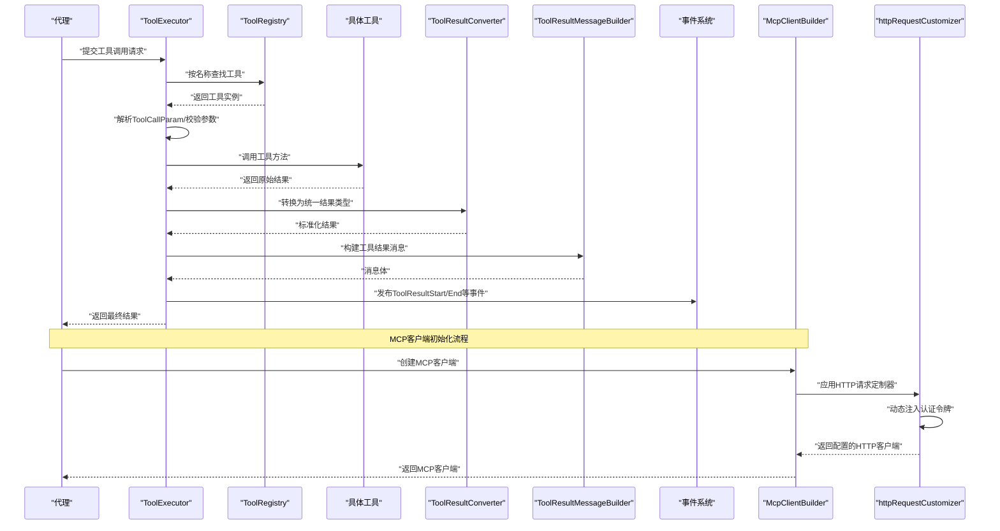

**图示来源**
- [ToolExecutor.java:1-200](file://agentscope-core/src/main/java/io/agentscope/core/tool/ToolExecutor.java#L1-L200)
- [ToolRegistry.java:1-200](file://agentscope-core/src/main/java/io/agentscope/core/tool/ToolRegistry.java#L1-L200)
- [ToolResultConverter.java:1-200](file://agentscope-core/src/main/java/io/agentscope/core/tool/ToolResultConverter.java#L1-L200)
- [ToolResultMessageBuilder.java:1-200](file://agentscope-core/src/main/java/io/agentscope/core/tool/ToolResultMessageBuilder.java#L1-L200)
- [ToolCallStartEvent.java:1-200](file://agentscope-core/src/main/java/io/agentscope/core/event/ToolCallStartEvent.java#L1-L200)
- [ToolCallEndEvent.java:1-200](file://agentscope-core/src/main/java/io/agentscope/core/event/ToolCallEndEvent.java#L1-L200)
- [ToolResultStartEvent.java:1-200](file://agentscope-core/src/main/java/io/agentscope/core/event/ToolResultStartEvent.java#L1-L200)
- [ToolResultEndEvent.java:1-200](file://agentscope-core/src/main/java/io/agentscope/core/event/ToolResultEndEvent.java#L1-L200)
- [McpClientBuilder.java:1-200](file://agentscope-core/src/main/java/io/agentscope/core/tool/mcp/McpClientBuilder.java#L1-L200)

## 详细组件分析

### 工具定义与基类
- Tool接口定义工具的基本契约，包括名称、描述、参数schema与执行方法等。
- ToolBase提供默认实现与通用能力，便于开发者快速继承并实现业务逻辑。
- ReflectiveFunctionTool与SchemaOnlyTool分别用于反射式函数工具与仅模式工具，满足不同场景需求。

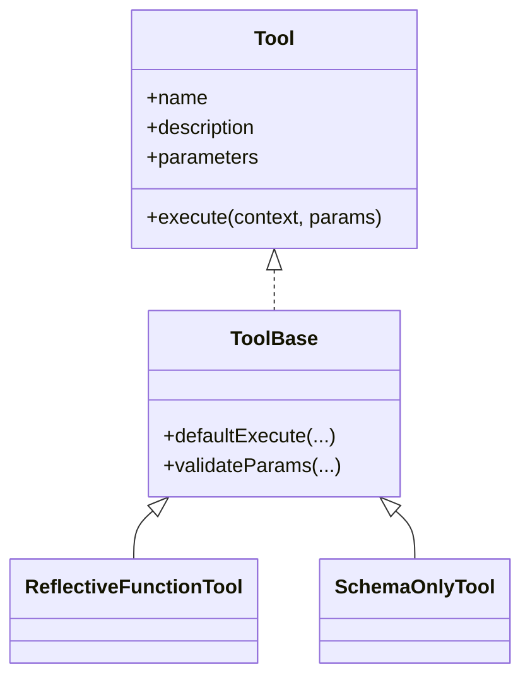

**图示来源**
- [Tool.java:1-200](file://agentscope-core/src/main/java/io/agentscope/core/tool/Tool.java#L1-L200)
- [ToolBase.java:1-200](file://agentscope-core/src/main/java/io/agentscope/core/tool/ToolBase.java#L1-L200)
- [ReflectiveFunctionTool.java:1-200](file://agentscope-core/src/main/java/io/agentscope/core/tool/ReflectiveFunctionTool.java#L1-L200)
- [SchemaOnlyTool.java:1-200](file://agentscope-core/src/main/java/io/agentscope/core/tool/SchemaOnlyTool.java#L1-L200)

**章节来源**
- [Tool.java:1-200](file://agentscope-core/src/main/java/io/agentscope/core/tool/Tool.java#L1-L200)
- [ToolBase.java:1-200](file://agentscope-core/src/main/java/io/agentscope/core/tool/ToolBase.java#L1-L200)
- [ReflectiveFunctionTool.java:1-200](file://agentscope-core/src/main/java/io/agentscope/core/tool/ReflectiveFunctionTool.java#L1-L200)
- [SchemaOnlyTool.java:1-200](file://agentscope-core/src/main/java/io/agentscope/core/tool/SchemaOnlyTool.java#L1-L200)

### 注册机制：ToolRegistry
- 职责：维护工具映射表，提供注册、注销、查询与批量导入能力。
- 设计要点：支持按名称唯一标识工具；可与ToolSchemaGenerator/Provider配合生成工具模式；与ToolGroupManager协作实现工具组注册。

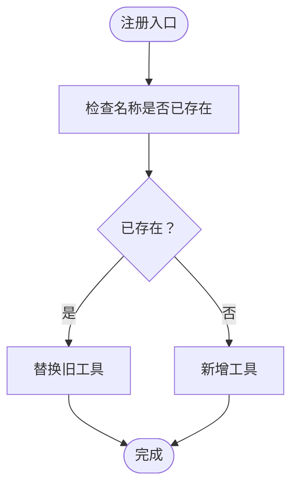

**图示来源**
- [ToolRegistry.java:1-200](file://agentscope-core/src/main/java/io/agentscope/core/tool/ToolRegistry.java#L1-L200)

**章节来源**
- [ToolRegistry.java:1-200](file://agentscope-core/src/main/java/io/agentscope/core/tool/ToolRegistry.java#L1-L200)

### 执行流程：ToolExecutor
- 职责：解析ToolCallParam，调用工具执行，处理异常与结果，触发事件。
- 关键步骤：参数解析与校验、上下文准备、工具调用、结果转换、消息构建、事件发布。
- 错误处理：捕获工具执行异常，抛出ToolSuspendException或包装为标准异常，保证执行器可恢复。

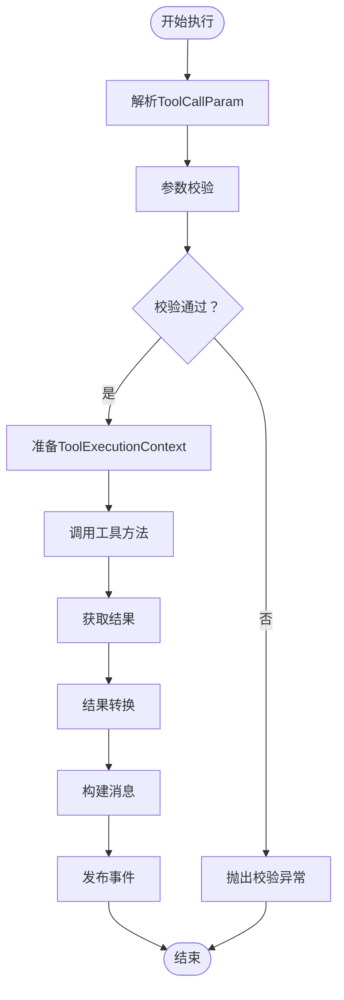

**图示来源**
- [ToolExecutor.java:1-200](file://agentscope-core/src/main/java/io/agentscope/core/tool/ToolExecutor.java#L1-L200)
- [ToolValidator.java:1-200](file://agentscope-core/src/main/java/io/agentscope/core/tool/ToolValidator.java#L1-L200)
- [ToolResultConverter.java:1-200](file://agentscope-core/src/main/java/io/agentscope/core/tool/ToolResultConverter.java#L1-L200)
- [ToolResultMessageBuilder.java:1-200](file://agentscope-core/src/main/java/io/agentscope/core/tool/ToolResultMessageBuilder.java#L1-L200)
- [ToolSuspendException.java:1-200](file://agentscope-core/src/main/java/io/agentscope/core/tool/ToolSuspendException.java#L1-L200)

**章节来源**
- [ToolExecutor.java:1-200](file://agentscope-core/src/main/java/io/agentscope/core/tool/ToolExecutor.java#L1-L200)
- [ToolValidator.java:1-200](file://agentscope-core/src/main/java/io/agentscope/core/tool/ToolValidator.java#L1-L200)
- [ToolResultConverter.java:1-200](file://agentscope-core/src/main/java/io/agentscope/core/tool/ToolResultConverter.java#L1-L200)
- [ToolResultMessageBuilder.java:1-200](file://agentscope-core/src/main/java/io/agentscope/core/tool/ToolResultMessageBuilder.java#L1-L200)
- [ToolSuspendException.java:1-200](file://agentscope-core/src/main/java/io/agentscope/core/tool/ToolSuspendException.java#L1-L200)

### 工具组与动态加载：ToolGroup/ToolGroupManager/Toolkit
- ToolGroup：将多个工具按逻辑分组，便于统一管理与作用域控制。
- ToolGroupManager：负责工具组的创建、更新与销毁，支持动态装配与卸载。
- Toolkit：封装工具组与配置，提供统一加载入口与生命周期管理。
- ToolGroupScope：限定工具组的作用域，避免命名冲突与资源竞争。

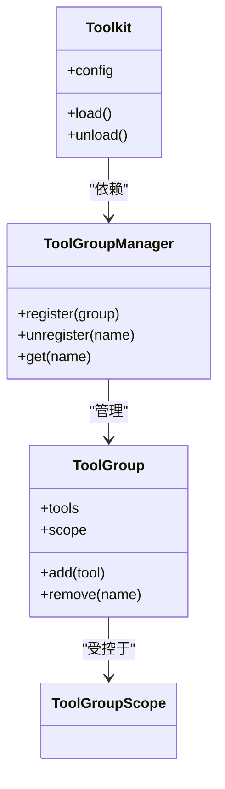

**图示来源**
- [ToolGroup.java:1-200](file://agentscope-core/src/main/java/io/agentscope/core/tool/ToolGroup.java#L1-L200)
- [ToolGroupManager.java:1-200](file://agentscope-core/src/main/java/io/agentscope/core/tool/ToolGroupManager.java#L1-L200)
- [Toolkit.java:1-200](file://agentscope-core/src/main/java/io/agentscope/core/tool/Toolkit.java#L1-L200)
- [ToolGroupScope.java:1-200](file://agentscope-core/src/main/java/io/agentscope/core/tool/ToolGroupScope.java#L1-L200)

**章节来源**
- [ToolGroup.java:1-200](file://agentscope-core/src/main/java/io/agentscope/core/tool/ToolGroup.java#L1-L200)
- [ToolGroupManager.java:1-200](file://agentscope-core/src/main/java/io/agentscope/core/tool/ToolGroupManager.java#L1-L200)
- [Toolkit.java:1-200](file://agentscope-core/src/main/java/io/agentscope/core/tool/Toolkit.java#L1-L200)
- [ToolGroupScope.java:1-200](file://agentscope-core/src/main/java/io/agentscope/core/tool/ToolGroupScope.java#L1-L200)

### 参数验证与模式生成：ToolValidator/ToolSchema*
- ToolValidator：对ToolCallParam进行参数合法性、必填项、范围约束等校验。
- ToolSchemaGenerator/Provider/Module：生成工具的JSON Schema，确保与模型侧工具调用格式一致。
- 格式化器：AnthropicToolsHelper、DashScopeToolsHelper、GeminiToolsHelper、OllamaToolsHelper、OpenAIToolsHelper及其DTO对象，负责与各平台工具schema互操作。

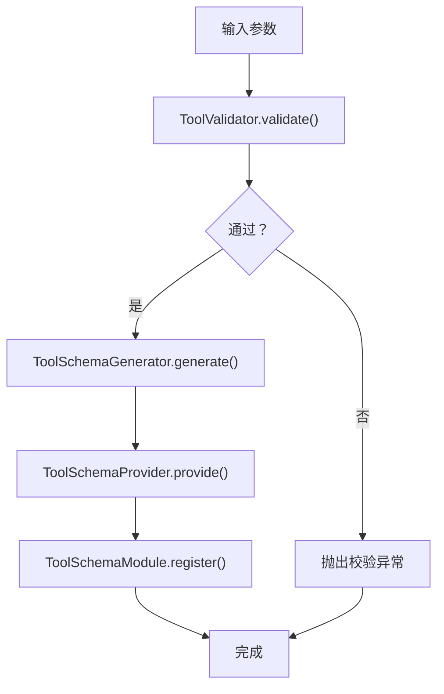

**图示来源**
- [ToolValidator.java:1-200](file://agentscope-core/src/main/java/io/agentscope/core/tool/ToolValidator.java#L1-L200)
- [ToolSchemaGenerator.java:1-200](file://agentscope-core/src/main/java/io/agentscope/core/tool/ToolSchemaGenerator.java#L1-L200)
- [ToolSchemaProvider.java:1-200](file://agentscope-core/src/main/java/io/agentscope/core/tool/ToolSchemaProvider.java#L1-L200)
- [ToolSchemaModule.java:1-200](file://agentscope-core/src/main/java/io/agentscope/core/tool/ToolSchemaModule.java#L1-L200)
- [AnthropicToolsHelper.java:1-200](file://agentscope-core/src/main/java/io/agentscope/core/formatter/anthropic/AnthropicToolsHelper.java#L1-L200)
- [DashScopeToolsHelper.java:1-200](file://agentscope-core/src/main/java/io/agentscope/core/formatter/dashscope/DashScopeToolsHelper.java#L1-L200)
- [GeminiToolsHelper.java:1-200](file://agentscope-core/src/main/java/io/agentscope/core/formatter/gemini/GeminiToolsHelper.java#L1-L200)
- [OllamaToolsHelper.java:1-200](file://agentscope-core/src/main/java/io/agentscope/core/formatter/ollama/OllamaToolsHelper.java#L1-L200)
- [OpenAIToolsHelper.java:1-200](file://agentscope-core/src/main/java/io/agentscope/core/formatter/openai/dto/OpenAIToolsHelper.java#L1-L200)

**章节来源**
- [ToolValidator.java:1-200](file://agentscope-core/src/main/java/io/agentscope/core/tool/ToolValidator.java#L1-L200)
- [ToolSchemaGenerator.java:1-200](file://agentscope-core/src/main/java/io/agentscope/core/tool/ToolSchemaGenerator.java#L1-L200)
- [ToolSchemaProvider.java:1-200](file://agentscope-core/src/main/java/io/agentscope/core/tool/ToolSchemaProvider.java#L1-L200)
- [ToolSchemaModule.java:1-200](file://agentscope-core/src/main/java/io/agentscope/core/tool/ToolSchemaModule.java#L1-L200)
- [AnthropicToolsHelper.java:1-200](file://agentscope-core/src/main/java/io/agentscope/core/formatter/anthropic/AnthropicToolsHelper.java#L1-L200)
- [DashScopeToolsHelper.java:1-200](file://agentscope-core/src/main/java/io/agentscope/core/formatter/dashscope/DashScopeToolsHelper.java#L1-L200)
- [GeminiToolsHelper.java:1-200](file://agentscope-core/src/main/java/io/agentscope/core/formatter/gemini/GeminiToolsHelper.java#L1-L200)
- [OllamaToolsHelper.java:1-200](file://agentscope-core/src/main/java/io/agentscope/core/formatter/ollama/OllamaToolsHelper.java#L1-L200)
- [OpenAIToolsHelper.java:1-200](file://agentscope-core/src/main/java/io/agentscope/core/formatter/openai/dto/OpenAIToolsHelper.java#L1-L200)

### 结果处理与消息构建：ToolResultConverter/ToolResultMessageBuilder
- ToolResultConverter：将工具返回的任意类型结果转换为统一的工具结果类型，便于后续处理与序列化。
- DefaultToolResultConverter：提供默认转换策略，适配常见返回值。
- ToolResultMessageBuilder：基于转换后的结果构建消息体，支持文本、数据块等多种形式。

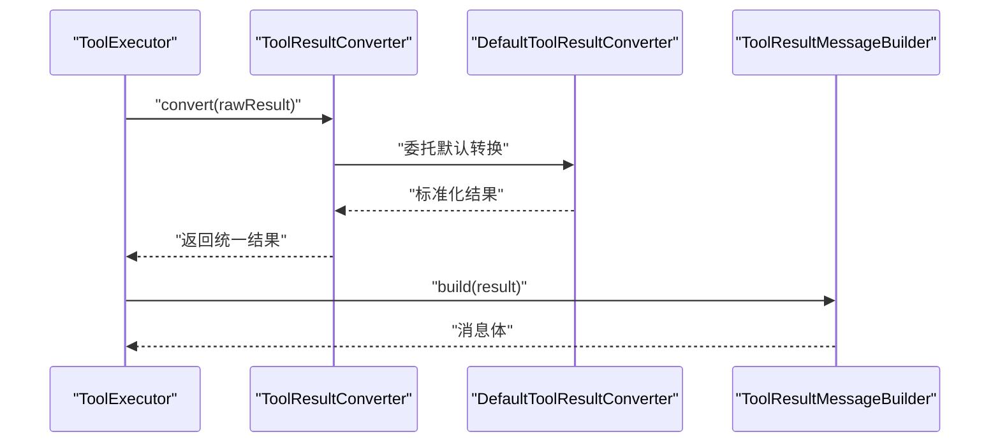

**图示来源**
- [ToolResultConverter.java:1-200](file://agentscope-core/src/main/java/io/agentscope/core/tool/ToolResultConverter.java#L1-L200)
- [DefaultToolResultConverter.java:1-200](file://agentscope-core/src/main/java/io/agentscope/core/tool/DefaultToolResultConverter.java#L1-L200)
- [ToolResultMessageBuilder.java:1-200](file://agentscope-core/src/main/java/io/agentscope/core/tool/ToolResultMessageBuilder.java#L1-L200)

**章节来源**
- [ToolResultConverter.java:1-200](file://agentscope-core/src/main/java/io/agentscope/core/tool/ToolResultConverter.java#L1-L200)
- [DefaultToolResultConverter.java:1-200](file://agentscope-core/src/main/java/io/agentscope/core/tool/DefaultToolResultConverter.java#L1-L200)
- [ToolResultMessageBuilder.java:1-200](file://agentscope-core/src/main/java/io/agentscope/core/tool/ToolResultMessageBuilder.java#L1-L200)

### MCP协议支持：McpClientManager/McpClientWrapper/McpTool
- McpClientManager：统一管理MCP客户端，负责连接建立、会话维护与资源回收。
- McpClientWrapper/McpAsyncClientWrapper/McpSyncClientWrapper：封装同步/异步MCP客户端，屏蔽底层差异。
- McpClientBuilder：构建MCP客户端，支持HTTP、STDIO、SSE等多种传输方式，新增httpRequestCustomizer支持动态令牌注入。
- McpContentConverter：将MCP协议内容转换为内部工具表示，或将内部结果转换为MCP响应，改进嵌套JSON格式和markdown横幅前缀处理。
- McpMeta：MCP元数据，描述工具能力与能力清单。
- McpTool：基于MCP协议的工具实现，可动态发现与加载外部工具。

**更新** MCP客户端增强：McpClientBuilder新增httpRequestCustomizer方法，允许在HTTP请求建立时动态注入认证令牌、自定义头部信息等；McpContentConverter改进对嵌套JSON格式和markdown横幅前缀的处理能力，提升MCP协议兼容性和数据处理准确性。

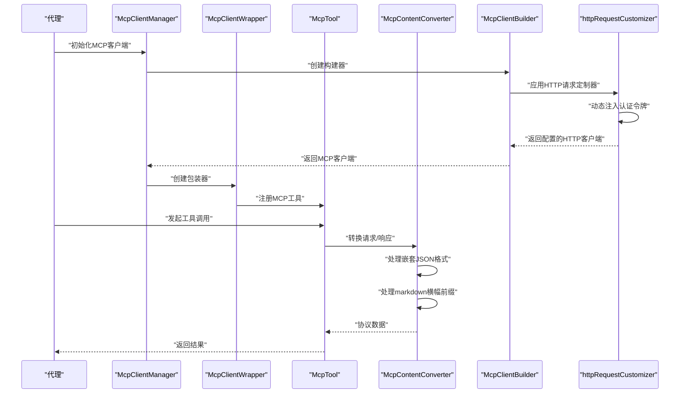

**图示来源**
- [McpClientManager.java:1-200](file://agentscope-core/src/main/java/io/agentscope/core/tool/McpClientManager.java#L1-L200)
- [McpClientWrapper.java:1-200](file://agentscope-core/src/main/java/io/agentscope/core/tool/mcp/McpClientWrapper.java#L1-L200)
- [McpAsyncClientWrapper.java:1-200](file://agentscope-core/src/main/java/io/agentscope/core/tool/mcp/McpAsyncClientWrapper.java#L1-L200)
- [McpSyncClientWrapper.java:1-200](file://agentscope-core/src/main/java/io/agentscope/core/tool/mcp/McpSyncClientWrapper.java#L1-L200)
- [McpClientBuilder.java:1-200](file://agentscope-core/src/main/java/io/agentscope/core/tool/mcp/McpClientBuilder.java#L1-L200)
- [McpContentConverter.java:1-200](file://agentscope-core/src/main/java/io/agentscope/core/tool/mcp/McpContentConverter.java#L1-L200)
- [McpMeta.java:1-200](file://agentscope-core/src/main/java/io/agentscope/core/tool/mcp/McpMeta.java#L1-L200)
- [McpTool.java:1-200](file://agentscope-core/src/main/java/io/agentscope/core/tool/mcp/McpTool.java#L1-L200)

**章节来源**
- [McpClientManager.java:1-200](file://agentscope-core/src/main/java/io/agentscope/core/tool/McpClientManager.java#L1-L200)
- [McpClientWrapper.java:1-200](file://agentscope-core/src/main/java/io/agentscope/core/tool/mcp/McpClientWrapper.java#L1-L200)
- [McpAsyncClientWrapper.java:1-200](file://agentscope-core/src/main/java/io/agentscope/core/tool/mcp/McpAsyncClientWrapper.java#L1-L200)
- [McpSyncClientWrapper.java:1-200](file://agentscope-core/src/main/java/io/agentscope/core/tool/mcp/McpSyncClientWrapper.java#L1-L200)
- [McpClientBuilder.java:1-200](file://agentscope-core/src/main/java/io/agentscope/core/tool/mcp/McpClientBuilder.java#L1-L200)
- [McpContentConverter.java:1-200](file://agentscope-core/src/main/java/io/agentscope/core/tool/mcp/McpContentConverter.java#L1-L200)
- [McpMeta.java:1-200](file://agentscope-core/src/main/java/io/agentscope/core/tool/mcp/McpMeta.java#L1-L200)
- [McpTool.java:1-200](file://agentscope-core/src/main/java/io/agentscope/core/tool/mcp/McpTool.java#L1-L200)

### 异步执行与内存工具：WaitAsyncResultsTool/MemorySaveTool
- WaitAsyncResultsTool：阻塞等待异步结果到达会话收件箱，支持超时控制和轮询机制，确保LLM可以在单次调用中等待后台任务完成。
- MemorySaveTool：专门用于将用户记忆持久化到MEMORY.md和当日日记文件，提供只写入口点，消除LLM选择任意文件名的不确定性。
- AsyncToolMiddleware：协调异步工具执行，与MessageBus配合实现消息传递和唤醒机制。
- MessageBus：提供消息传输基础设施，支持收件箱推送、队列操作、广播发布等功能。

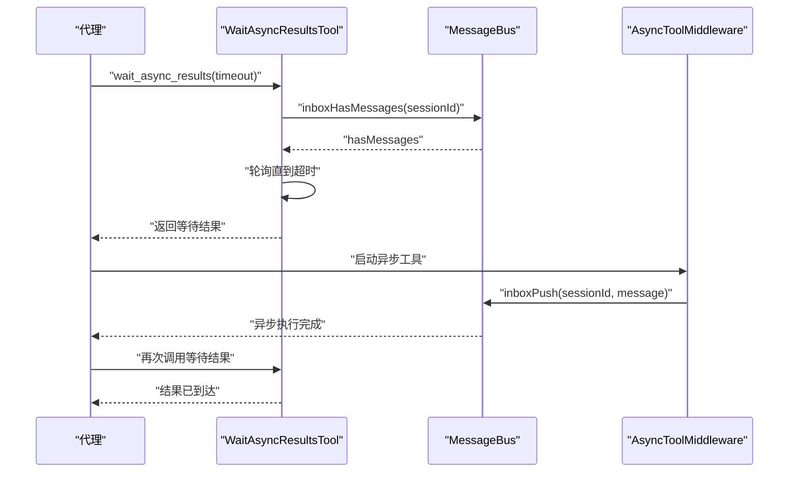

**图示来源**
- [WaitAsyncResultsTool.java:1-100](file://agentscope-harness/src/main/java/io/agentscope/harness/agent/tool/WaitAsyncResultsTool.java#L1-L100)
- [MemorySaveTool.java:1-89](file://agentscope-harness/src/main/java/io/agentscope/harness/agent/tool/MemorySaveTool.java#L1-L89)
- [AsyncToolMiddleware.java](file://agentscope-harness/src/main/java/io/agentscope/harness/agent/middleware/AsyncToolMiddleware.java)
- [MessageBus.java:1-268](file://agentscope-harness/src/main/java/io/agentscope/harness/agent/bus/MessageBus.java#L1-L268)

**章节来源**
- [WaitAsyncResultsTool.java:1-100](file://agentscope-harness/src/main/java/io/agentscope/harness/agent/tool/WaitAsyncResultsTool.java#L1-L100)
- [MemorySaveTool.java:1-89](file://agentscope-harness/src/main/java/io/agentscope/harness/agent/tool/MemorySaveTool.java#L1-L89)
- [AsyncToolMiddleware.java](file://agentscope-harness/src/main/java/io/agentscope/harness/agent/middleware/AsyncToolMiddleware.java)
- [MessageBus.java:1-268](file://agentscope-harness/src/main/java/io/agentscope/harness/agent/bus/MessageBus.java#L1-L268)

### 自定义工具开发与工具链组合
- 自定义工具：继承ToolBase或实现Tool接口，定义参数与执行逻辑；通过ToolSchemaGenerator生成模式；注册到ToolRegistry。
- 工具链组合：将多个工具放入同一ToolGroup，按顺序或条件选择执行；结合ToolGroupManager实现动态编排。
- 动态加载：通过Toolkit与ToolGroupManager实现按需加载与卸载，支持热插拔。

**章节来源**
- [ToolBase.java:1-200](file://agentscope-core/src/main/java/io/agentscope/core/tool/ToolBase.java#L1-L200)
- [Tool.java:1-200](file://agentscope-core/src/main/java/io/agentscope/core/tool/Tool.java#L1-L200)
- [ToolSchemaGenerator.java:1-200](file://agentscope-core/src/main/java/io/agentscope/core/tool/ToolSchemaGenerator.java#L1-L200)
- [ToolRegistry.java:1-200](file://agentscope-core/src/main/java/io/agentscope/core/tool/ToolRegistry.java#L1-L200)
- [ToolGroup.java:1-200](file://agentscope-core/src/main/java/io/agentscope/core/tool/ToolGroup.java#L1-L200)
- [ToolGroupManager.java:1-200](file://agentscope-core/src/main/java/io/agentscope/core/tool/ToolGroupManager.java#L1-L200)
- [Toolkit.java:1-200](file://agentscope-core/src/main/java/io/agentscope/core/tool/Toolkit.java#L1-L200)

### 工具安全控制
- 权限引擎：PermissionEngine基于PermissionRule与PermissionMode进行权限决策，支持白名单/黑名单与行为控制。
- 工作目录：AdditionalWorkingDirectory限制工具可访问的文件路径，防止越权访问。
- 危险路径常量：ToolDangerousPathConstants定义危险路径集合，作为安全检查的基础。

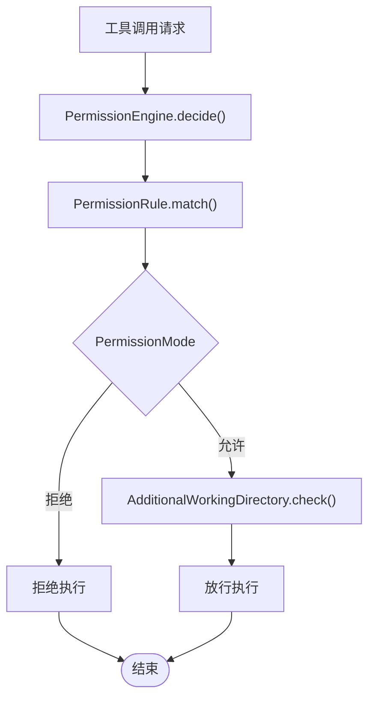

**图示来源**
- [PermissionEngine.java:1-200](file://agentscope-core/src/main/java/io/agentscope/core/permission/PermissionEngine.java#L1-L200)
- [PermissionRule.java:1-200](file://agentscope-core/src/main/java/io/agentscope/core/permission/PermissionRule.java#L1-L200)
- [PermissionMode.java:1-200](file://agentscope-core/src/main/java/io/agentscope/core/permission/PermissionMode.java#L1-L200)
- [PermissionBehavior.java:1-200](file://agentscope-core/src/main/java/io/agentscope/core/permission/PermissionBehavior.java#L1-L200)
- [AdditionalWorkingDirectory.java:1-200](file://agentscope-core/src/main/java/io/agentscope/core/permission/AdditionalWorkingDirectory.java#L1-L200)
- [ToolDangerousPathConstants.java:1-200](file://agentscope-core/src/main/java/io/agentscope/core/tool/ToolDangerousPathConstants.java#L1-L200)

**章节来源**
- [PermissionEngine.java:1-200](file://agentscope-core/src/main/java/io/agentscope/core/permission/PermissionEngine.java#L1-L200)
- [PermissionRule.java:1-200](file://agentscope-core/src/main/java/io/agentscope/core/permission/PermissionRule.java#L1-L200)
- [PermissionMode.java:1-200](file://agentscope-core/src/main/java/io/agentscope/core/permission/PermissionMode.java#L1-L200)
- [PermissionBehavior.java:1-200](file://agentscope-core/src/main/java/io/agentscope/core/permission/PermissionBehavior.java#L1-L200)
- [AdditionalWorkingDirectory.java:1-200](file://agentscope-core/src/main/java/io/agentscope/core/permission/AdditionalWorkingDirectory.java#L1-L200)
- [ToolDangerousPathConstants.java:1-200](file://agentscope-core/src/main/java/io/agentscope/core/tool/ToolDangerousPathConstants.java#L1-L200)

### 事件与上下文
- 事件：ToolCallStart/End、ToolResultStart/End/TextDelta、ToolCallDeltaEvent等，提供工具调用过程的可观测性。
- 上下文：ToolExecutionContext/Provider与ContextStore/DefaultContextStore提供执行上下文注入与状态持久化，支持跨工具共享数据。

**章节来源**
- [ToolCallStartEvent.java:1-200](file://agentscope-core/src/main/java/io/agentscope/core/event/ToolCallStartEvent.java#L1-L200)
- [ToolCallEndEvent.java:1-200](file://agentscope-core/src/main/java/io/agentscope/core/event/ToolCallEndEvent.java#L1-L200)
- [ToolResultStartEvent.java:1-200](file://agentscope-core/src/main/java/io/agentscope/core/event/ToolResultStartEvent.java#L1-L200)
- [ToolResultEndEvent.java:1-200](file://agentscope-core/src/main/java/io/agentscope/core/event/ToolResultEndEvent.java#L1-L200)
- [ToolResultTextDeltaEvent.java:1-200](file://agentscope-core/src/main/java/io/agentscope/core/event/ToolResultTextDeltaEvent.java#L1-L200)
- [ToolCallDeltaEvent.java:1-200](file://agentscope-core/src/main/java/io/agentscope/core/event/ToolCallDeltaEvent.java#L1-L200)
- [ToolExecutionContext.java:1-200](file://agentscope-core/src/main/java/io/agentscope/core/tool/ToolExecutionContext.java#L1-L200)
- [ToolExecutionContextProvider.java:1-200](file://agentscope-core/src/main/java/io/agentscope/core/tool/ToolExecutionContextProvider.java#L1-L200)
- [ContextStore.java:1-200](file://agentscope-core/src/main/java/io/agentscope/core/tool/ContextStore.java#L1-L200)
- [DefaultContextStore.java:1-200](file://agentscope-core/src/main/java/io/agentscope/core/tool/DefaultContextStore.java#L1-L200)

## 依赖关系分析
工具系统内部模块耦合度低，职责清晰：
- 工具实现与注册中心解耦，通过名称标识与接口契约交互。
- 执行器与结果转换器、消息构建器松耦合，便于替换与扩展。
- 事件系统与执行器弱耦合，通过发布订阅模式实现可观测性。
- MCP模块独立于核心工具层，通过McpTool与McpClientWrapper接入。

**更新** MCP协议增强模块：httpRequestCustomizer作为可选的HTTP请求定制器，通过McpClientBuilder集成到MCP客户端构建流程中，不影响现有MCP客户端的使用方式。

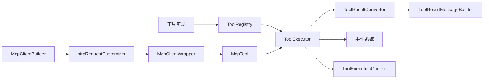

**图示来源**
- [ToolRegistry.java:1-200](file://agentscope-core/src/main/java/io/agentscope/core/tool/ToolRegistry.java#L1-L200)
- [ToolExecutor.java:1-200](file://agentscope-core/src/main/java/io/agentscope/core/tool/ToolExecutor.java#L1-L200)
- [ToolResultConverter.java:1-200](file://agentscope-core/src/main/java/io/agentscope/core/tool/ToolResultConverter.java#L1-L200)
- [ToolResultMessageBuilder.java:1-200](file://agentscope-core/src/main/java/io/agentscope/core/tool/ToolResultMessageBuilder.java#L1-L200)
- [ToolExecutionContext.java:1-200](file://agentscope-core/src/main/java/io/agentscope/core/tool/ToolExecutionContext.java#L1-L200)
- [McpTool.java:1-200](file://agentscope-core/src/main/java/io/agentscope/core/tool/mcp/McpTool.java#L1-L200)
- [McpClientWrapper.java:1-200](file://agentscope-core/src/main/java/io/agentscope/core/tool/mcp/McpClientWrapper.java#L1-L200)
- [McpClientBuilder.java:1-200](file://agentscope-core/src/main/java/io/agentscope/core/tool/mcp/McpClientBuilder.java#L1-L200)

**章节来源**
- [ToolRegistry.java:1-200](file://agentscope-core/src/main/java/io/agentscope/core/tool/ToolRegistry.java#L1-L200)
- [ToolExecutor.java:1-200](file://agentscope-core/src/main/java/io/agentscope/core/tool/ToolExecutor.java#L1-L200)
- [ToolResultConverter.java:1-200](file://agentscope-core/src/main/java/io/agentscope/core/tool/ToolResultConverter.java#L1-L200)
- [ToolResultMessageBuilder.java:1-200](file://agentscope-core/src/main/java/io/agentscope/core/tool/ToolResultMessageBuilder.java#L1-L200)
- [ToolExecutionContext.java:1-200](file://agentscope-core/src/main/java/io/agentscope/core/tool/ToolExecutionContext.java#L1-L200)
- [McpTool.java:1-200](file://agentscope-core/src/main/java/io/agentscope/core/tool/mcp/McpTool.java#L1-L200)
- [McpClientWrapper.java:1-200](file://agentscope-core/src/main/java/io/agentscope/core/tool/mcp/McpClientWrapper.java#L1-L200)
- [McpClientBuilder.java:1-200](file://agentscope-core/src/main/java/io/agentscope/core/tool/mcp/McpClientBuilder.java#L1-L200)

## 性能考虑
- 参数校验前置：在ToolExecutor中尽早进行参数校验，减少无效调用开销。
- 结果转换缓存：对重复类型的结果转换可引入缓存策略，降低重复计算成本。
- 流式事件：利用ToolResultTextDeltaEvent等增量事件，减少大结果一次性序列化的内存压力。
- MCP异步：优先使用McpAsyncClientWrapper进行异步调用，提升并发吞吐。
- 上下文复用：通过ToolExecutionContext与ContextStore复用昂贵资源，避免重复初始化。
- 工具组作用域：合理划分ToolGroupScope，避免全局锁争用与状态污染。
- 异步等待优化：WaitAsyncResultsTool使用轮询机制，合理设置超时时间和轮询间隔，避免过度占用CPU资源。
- **更新** MCP性能优化：httpRequestCustomizer应实现高效的令牌缓存和刷新机制，避免每次请求都重新获取令牌；McpContentConverter改进的嵌套JSON处理应采用增量解析策略，减少内存占用。

## 故障排查指南
- 注册失败：检查工具名称是否唯一，确认ToolSchemaGenerator生成的模式合法。
- 执行异常：查看ToolSuspendException与ToolExecutor中的异常堆栈，定位工具实现问题。
- 参数校验失败：核对ToolValidator规则与ToolCallParam构造，确保必填字段与类型匹配。
- MCP连接失败：检查McpClientBuilder配置与McpClientWrapper日志，确认传输协议与端点可达。
- 权限拒绝：审查PermissionRule与AdditionalWorkingDirectory设置，确认工具可访问路径。
- 事件缺失：确认ToolEmitter配置为DefaultToolEmitter而非NoOpToolEmitter，确保事件被发布。
- 异步等待超时：检查WaitAsyncResultsTool的超时设置和MessageBus配置，确认会话ID正确传递。
- 内存保存失败：验证MemorySaveTool的文件路径权限和磁盘空间，确保写入操作成功。
- **更新** MCP认证失败：检查httpRequestCustomizer的实现是否正确注入认证令牌，确认令牌有效期和刷新机制；验证McpContentConverter的嵌套JSON处理逻辑，确保数据格式正确。

**章节来源**
- [ToolSuspendException.java:1-200](file://agentscope-core/src/main/java/io/agentscope/core/tool/ToolSuspendException.java#L1-L200)
- [ToolExecutor.java:1-200](file://agentscope-core/src/main/java/io/agentscope/core/tool/ToolExecutor.java#L1-L200)
- [ToolValidator.java:1-200](file://agentscope-core/src/main/java/io/agentscope/core/tool/ToolValidator.java#L1-L200)
- [McpClientBuilder.java:1-200](file://agentscope-core/src/main/java/io/agentscope/core/tool/mcp/McpClientBuilder.java#L1-L200)
- [McpClientWrapper.java:1-200](file://agentscope-core/src/main/java/io/agentscope/core/tool/mcp/McpClientWrapper.java#L1-L200)
- [PermissionRule.java:1-200](file://agentscope-core/src/main/java/io/agentscope/core/permission/PermissionRule.java#L1-L200)
- [AdditionalWorkingDirectory.java:1-200](file://agentscope-core/src/main/java/io/agentscope/core/permission/AdditionalWorkingDirectory.java#L1-L200)
- [DefaultToolEmitter.java:1-200](file://agentscope-core/src/main/java/io/agentscope/core/tool/DefaultToolEmitter.java#L1-L200)
- [NoOpToolEmitter.java:1-200](file://agentscope-core/src/main/java/io/agentscope/core/tool/NoOpToolEmitter.java#L1-L200)
- [WaitAsyncResultsTool.java:1-100](file://agentscope-harness/src/main/java/io/agentscope/harness/agent/tool/WaitAsyncResultsTool.java#L1-L100)
- [MemorySaveTool.java:1-89](file://agentscope-harness/src/main/java/io/agentscope/harness/agent/tool/MemorySaveTool.java#L1-L89)
- [MessageBus.java:1-268](file://agentscope-harness/src/main/java/io/agentscope/harness/agent/bus/MessageBus.java#L1-L268)

## 结论
AgentScope工具系统通过清晰的接口设计、完善的注册与执行机制、灵活的工具组与动态加载能力、强大的MCP协议支持以及严格的安全控制，形成了高内聚、低耦合且易于扩展的工具生态。

**更新** 本次更新增强了MCP协议支持能力，通过McpClientBuilder的httpRequestCustomizer方法实现了动态令牌注入，提升了MCP客户端的安全性和灵活性。同时改进了McpContentConverter对嵌套JSON格式和markdown横幅前缀的处理能力，确保了更好的协议兼容性。这些增强功能使得AgentScope能够更好地支持复杂的企业级应用场景，特别是在需要动态认证和复杂数据格式处理的场景中。

遵循本文的最佳实践与调试技巧，可高效地开发、集成与运维各类工具，满足复杂应用场景下的工具链组合与动态调度需求。

## 附录
- 示例与集成指南
  - MCP示例：参见McpSseExample、McpStdioExample、McpStreamableHttpExample，了解不同传输方式的MCP集成。
  - Higress扩展：参见HigressToolkit、HigressMcpClientBuilder、HigressMcpClientWrapper、HigressToolSearchResult，了解如何通过Higress扩展接入MCP工具源。
  - 异步工具示例：参见HarnessAgent中的WaitAsyncResultsTool注册和使用，了解异步任务等待机制。
  - 内存工具示例：参见MemorySaveTool的实现，了解长期记忆持久化功能。
  - 单元测试：参见ToolRegistryTest、McpToolTest、McpClientWrapperTest、McpClientBuilderTest、McpAsyncClientWrapperTest、McpSyncClientWrapperTest、McpContentConverterTest、McpMetaTest，验证工具注册与MCP功能的正确性。
  - **更新** MCP认证示例：参考McpClientBuilder的httpRequestCustomizer使用方法，学习如何实现动态令牌注入和自定义HTTP头部配置。

**章节来源**
- [McpSseExample.java:1-200](file://agentscope-examples/documentation/src/main/java/io/agentscope/examples/documentation2/mcp/McpSseExample.java#L1-L200)
- [McpStdioExample.java:1-200](file://agentscope-examples/documentation/src/main/java/io/agentscope/examples/documentation2/mcp/McpStdioExample.java#L1-L200)
- [McpStreamableHttpExample.java:1-200](file://agentscope-examples/documentation/src/main/java/io/agentscope/examples/documentation2/mcp/McpStreamableHttpExample.java#L1-L200)
- [HigressToolkit.java:1-200](file://agentscope-extensions/agentscope-extensions-higress/src/main/java/io/agentscope/extensions/higress/HigressToolkit.java#L1-L200)
- [HigressMcpClientBuilder.java:1-200](file://agentscope-extensions/agentscope-extensions-higress/src/main/java/io/agentscope/extensions/higress/HigressMcpClientBuilder.java#L1-L200)
- [HigressMcpClientWrapper.java:1-200](file://agentscope-extensions/agentscope-extensions-higress/src/main/java/io/agentscope/extensions/higress/HigressMcpClientWrapper.java#L1-L200)
- [HigressToolSearchResult.java:1-200](file://agentscope-extensions/agentscope-extensions-higress/src/main/java/io/agentscope/extensions/higress/HigressToolSearchResult.java#L1-L200)
- [ToolRegistryTest.java:1-200](file://agentscope-core/src/test/java/io/agentscope/core/tool/ToolRegistryTest.java#L1-L200)
- [McpToolTest.java:1-200](file://agentscope-core/src/test/java/io/agentscope/core/tool/mcp/McpToolTest.java#L1-L200)
- [McpClientWrapperTest.java:1-200](file://agentscope-core/src/test/java/io/agentscope/core/tool/mcp/McpClientWrapperTest.java#L1-L200)
- [McpClientBuilderTest.java:1-200](file://agentscope-core/src/test/java/io/agentscope/core/tool/mcp/McpClientBuilderTest.java#L1-L200)
- [McpAsyncClientWrapperTest.java:1-200](file://agentscope-core/src/test/java/io/agentscope/core/tool/mcp/McpAsyncClientWrapperTest.java#L1-L200)
- [McpSyncClientWrapperTest.java:1-200](file://agentscope-core/src/test/java/io/agentscope/core/tool/mcp/McpSyncClientWrapperTest.java#L1-L200)
- [McpContentConverterTest.java:1-200](file://agentscope-core/src/test/java/io/agentscope/core/tool/mcp/McpContentConverterTest.java#L1-L200)
- [McpMetaTest.java:1-200](file://agentscope-core/src/test/java/io/agentscope/core/tool/mcp/McpMetaTest.java#L1-L200)
- [HarnessAgent.java:2195-2202](file://agentscope-harness/src/main/java/io/agentscope/harness/agent/HarnessAgent.java#L2195-L2202)
- [WaitAsyncResultsTool.java:1-100](file://agentscope-harness/src/main/java/io/agentscope/harness/agent/tool/WaitAsyncResultsTool.java#L1-L100)
- [MemorySaveTool.java:1-89](file://agentscope-harness/src/main/java/io/agentscope/harness/agent/tool/MemorySaveTool.java#L1-L89)
