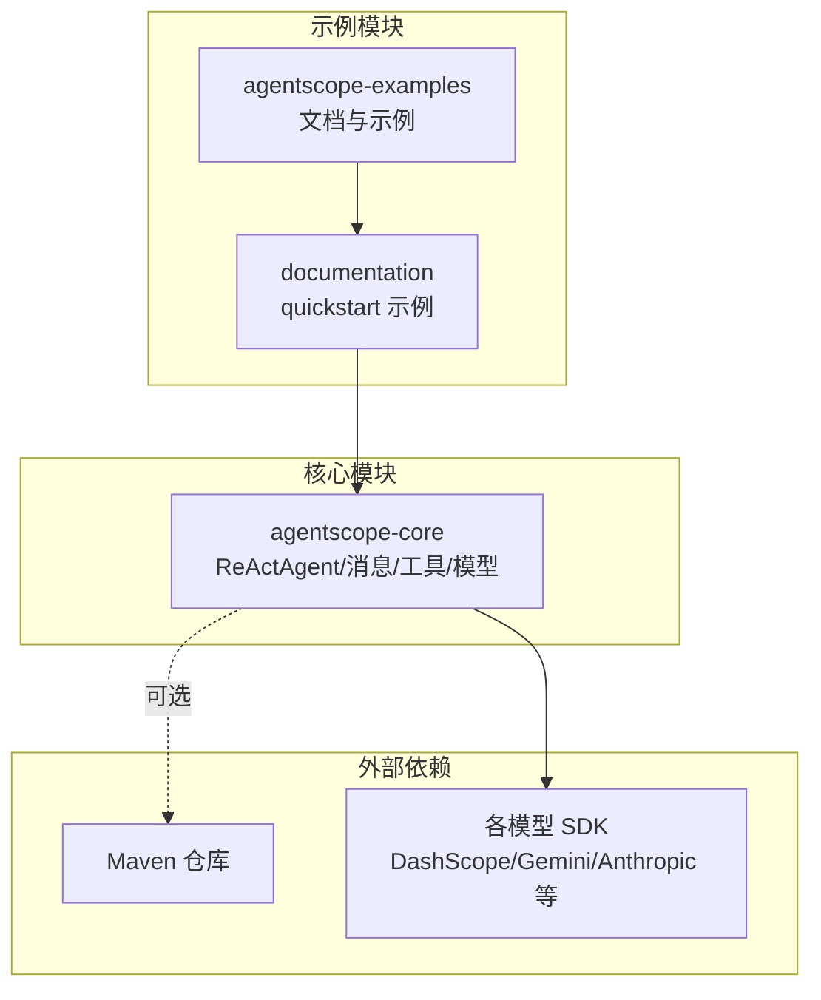
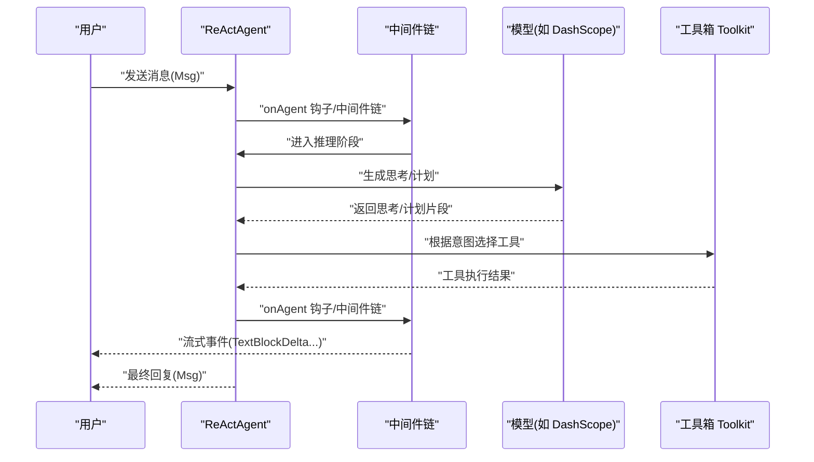
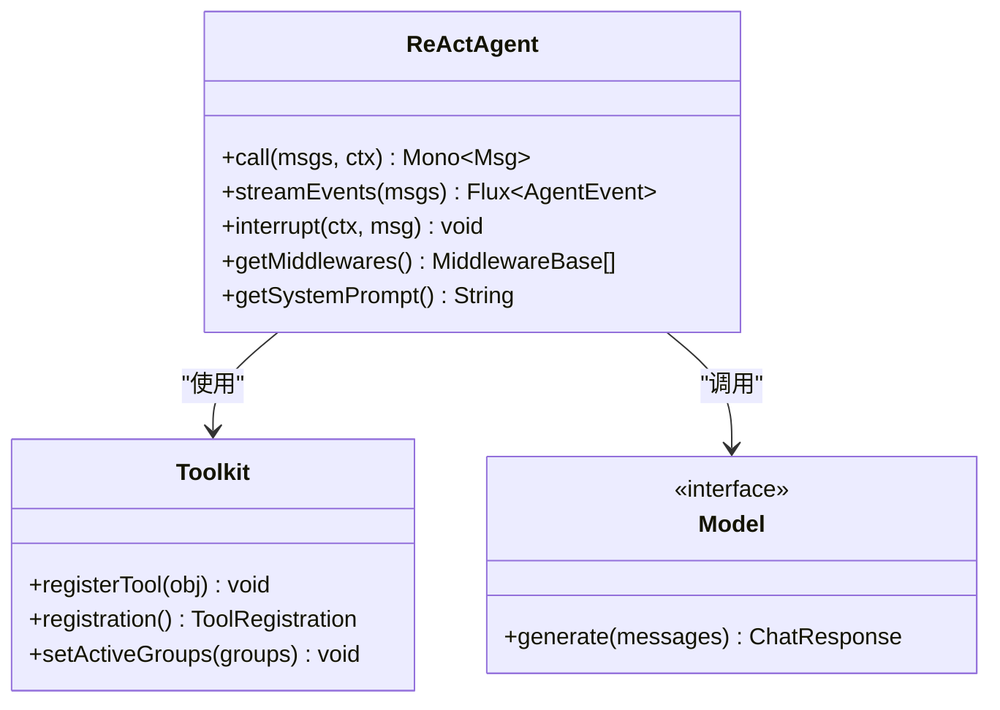
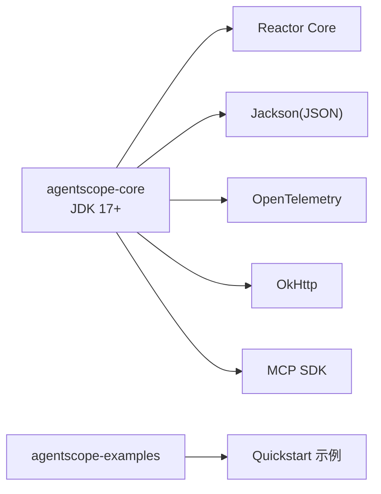

# 快速开始

<cite>
**本文引用的文件**
- [README.md](file://README.md)
- [agentscope-core/pom.xml](file://agentscope-core/pom.xml)
- [agentscope-examples/pom.xml](file://agentscope-examples/pom.xml)
- [ReActAgent.java](file://agentscope-core/src/main/java/io/agentscope/core/ReActAgent.java)
- [BasicChatExample.java](file://agentscope-examples/documentation/src/main/java/io/agentscope/examples/documentation2/quickstart/BasicChatExample.java)
- [UserIsolatedMultiTurnsExample.java](file://agentscope-examples/documentation/src/main/java/io/agentscope/examples/documentation2/quickstart/UserIsolatedMultiTurnsExample.java)
- [ModelRegistry.java](file://agentscope-core/src/main/java/io/agentscope/core/model/ModelRegistry.java)
- [Toolkit.java](file://agentscope-core/src/main/java/io/agentscope/core/tool/Toolkit.java)
- [DashScopeChatModel.java](file://agentscope-core/src/main/java/io/agentscope/core/model/DashScopeChatModel.java)
</cite>

## 目录
1. [简介](#简介)
2. [项目结构](#项目结构)
3. [核心组件](#核心组件)
4. [架构总览](#架构总览)
5. [详细组件解析](#详细组件解析)
6. [依赖关系分析](#依赖关系分析)
7. [性能与并发特性](#性能与并发特性)
8. [故障排查与调试](#故障排查与调试)
9. [结论](#结论)
10. [附录：从入门到进阶的学习路径](#附录从入门到进阶的学习路径)

## 简介
本指南面向首次接触 AgentScope 的开发者，目标是在约 30 分钟内完成环境准备、安装依赖、运行第一个 ReAct 代理，并掌握基础的消息处理、模型集成与工具调用方法。你将学到：
- 如何在本地搭建符合要求的开发环境（JDK 17+）
- 如何通过 Maven 引入 AgentScope 核心依赖
- 如何创建你的第一个 Hello World ReAct 代理
- 如何进行基本的模型配置与消息交互
- 常见问题与调试技巧
- 从简单到复杂的进阶学习路径建议

## 项目结构
AgentScope 采用多模块组织方式，核心能力集中在 agentscope-core，示例与扩展分布在 agentscope-examples 与其他模块中。对于快速开始，你需要关注以下关键点：
- agentscope-core 提供 ReActAgent、消息模型、工具箱 Toolkit、模型注册与适配等核心能力
- agentscope-examples 提供入门示例，如 BasicChatExample 和多轮对话示例
- 各子模块（如 extensions、harness）提供企业级能力（内存、RAG、沙箱、调度等），可按需引入

图示来源
- [agentscope-examples/pom.xml:34-40](file://agentscope-examples/pom.xml#L34-L40)
- [agentscope-core/pom.xml:51-231](file://agentscope-core/pom.xml#L51-L231)

章节来源
- [agentscope-examples/pom.xml:34-40](file://agentscope-examples/pom.xml#L34-L40)
- [agentscope-core/pom.xml:33-49](file://agentscope-core/pom.xml#L33-L49)

## 核心组件
- ReActAgent：遵循 ReAct 思想的智能体，支持推理-行动迭代、流式事件、钩子系统、权限控制与长程记忆等
- 消息模型：Msg、UserMessage、AssistantMessage、SystemMessage、内容块（文本/思考/工具调用/结果）等
- 工具箱 Toolkit：统一管理工具注册、分组、执行、参数预设与 MCP 客户端接入
- 模型注册与适配：ModelRegistry 支持字符串模型标识自动解析；内置 DashScopeChatModel 等
- 示例：BasicChatExample 展示最简交互与流式输出；UserIsolatedMultiTurnsExample 展示会话隔离与多轮记忆

章节来源
- [ReActAgent.java:148-198](file://agentscope-core/src/main/java/io/agentscope/core/ReActAgent.java#L148-L198)
- [BasicChatExample.java:26-43](file://agentscope-examples/documentation/src/main/java/io/agentscope/examples/documentation2/quickstart/BasicChatExample.java#L26-L43)
- [UserIsolatedMultiTurnsExample.java:29-60](file://agentscope-examples/documentation/src/main/java/io/agentscope/examples/documentation2/quickstart/UserIsolatedMultiTurnsExample.java#L29-L60)
- [Toolkit.java:37-762](file://agentscope-core/src/main/java/io/agentscope/core/tool/Toolkit.java#L37-L762)
- [ModelRegistry.java:214-242](file://agentscope-core/src/main/java/io/agentscope/core/model/ModelRegistry.java#L214-L242)

## 架构总览
下图展示了从“用户输入”到“ReAct 推理-行动循环”的整体流程，以及事件流与中间件链路。

图示来源
- [ReActAgent.java:795-805](file://agentscope-core/src/main/java/io/agentscope/core/ReActAgent.java#L795-L805)
- [BasicChatExample.java:86-93](file://agentscope-examples/documentation/src/main/java/io/agentscope/examples/documentation2/quickstart/BasicChatExample.java#L86-L93)

## 详细组件解析

### 组件一：ReActAgent（推理-行动循环）
- 职责：封装 ReAct 循环、事件流、中间件、权限与状态持久化
- 关键点：
  - 支持阻塞式 call() 与流式 streamEvents()，二者共享同一核心生命周期
  - 中间件链在 onAgent 阶段统一执行，保证一致性
  - 支持中断/优雅关闭、权限引擎、状态缓存与会话隔离
- 并发与线程安全：单实例一次仅处理一个 call()，并发场景请按请求工厂化创建实例

图示来源
- [ReActAgent.java:288-330](file://agentscope-core/src/main/java/io/agentscope/core/ReActAgent.java#L288-L330)
- [Toolkit.java:146-148](file://agentscope-core/src/main/java/io/agentscope/core/tool/Toolkit.java#L146-L148)

章节来源
- [ReActAgent.java:148-198](file://agentscope-core/src/main/java/io/agentscope/core/ReActAgent.java#L148-L198)
- [ReActAgent.java:795-805](file://agentscope-core/src/main/java/io/agentscope/core/ReActAgent.java#L795-L805)

### 组件二：消息与内容块
- 消息类型：SystemMessage、UserMessage、AssistantMessage
- 内容块：TextBlock、ThinkingBlock、ToolUseBlock、ToolResultBlock 等
- 作用：承载多模态内容与结构化数据，支撑 ReAct 的“思考-行动”可视化与增量输出

章节来源
- [ReActAgent.java:66-78](file://agentscope-core/src/main/java/io/agentscope/core/ReActAgent.java#L66-L78)

### 组件三：工具箱 Toolkit
- 功能：注册工具对象、动态分组、参数预设、MCP 客户端接入、并行/串行执行与结果转换
- 典型用法：registration().tool(obj).group("group").presetParameters(...).apply()

章节来源
- [Toolkit.java:37-762](file://agentscope-core/src/main/java/io/agentscope/core/tool/Toolkit.java#L37-L762)

### 组件四：模型注册与适配（ModelRegistry）
- 特性：支持字符串模型标识（如 dashscope:qwen-plus），自动解析提供商与读取环境变量中的密钥
- 适用：在示例中直接以字符串传入模型，即可由注册表解析并创建对应模型实例

章节来源
- [ModelRegistry.java:214-242](file://agentscope-core/src/main/java/io/agentscope/core/model/ModelRegistry.java#L214-L242)
- [BasicChatExample.java:61-67](file://agentscope-examples/documentation/src/main/java/io/agentscope/examples/documentation2/quickstart/BasicChatExample.java#L61-L67)

### 组件五：DashScopeChatModel（示例模型）
- 说明：示例中使用的 DashScope 模型实现，支持流式与非流式调用
- 使用：在示例中通过 builder 设置 apiKey 与 modelName

章节来源
- [DashScopeChatModel.java](file://agentscope-core/src/main/java/io/agentscope/core/model/DashScopeChatModel.java)
- [UserIsolatedMultiTurnsExample.java:37-42](file://agentscope-examples/documentation/src/main/java/io/agentscope/examples/documentation2/quickstart/UserIsolatedMultiTurnsExample.java#L37-L42)

## 依赖关系分析
- JDK 版本：核心模块与示例均声明为 JDK 17+
- Maven 依赖：agentscope-core 引入 Reactor、Jackson、OpenTelemetry、MCP SDK、HTTP 客户端等；示例模块聚合多个示例工程
- 运行时依赖：示例通过环境变量注入模型密钥（如 DASHSCOPE_API_KEY）

图示来源
- [agentscope-core/pom.xml:51-231](file://agentscope-core/pom.xml#L51-L231)
- [agentscope-examples/pom.xml:34-40](file://agentscope-examples/pom.xml#L34-L40)

章节来源
- [agentscope-core/pom.xml:33-49](file://agentscope-core/pom.xml#L33-L49)
- [agentscope-examples/pom.xml:42-49](file://agentscope-examples/pom.xml#L42-L49)

## 性能与并发特性
- 非阻塞执行：基于 Project Reactor，支持响应式流式事件与中间件链
- 并发模型：单个 ReActAgent 实例一次仅处理一个 call()；高并发场景建议按请求创建实例
- 会话隔离：通过 userId 与 sessionId 缓存状态，避免跨会话污染
- 中断与优雅关闭：支持在任意阶段中断或取消，保障状态一致与资源回收

章节来源
- [ReActAgent.java:192-198](file://agentscope-core/src/main/java/io/agentscope/core/ReActAgent.java#L192-L198)
- [ReActAgent.java:437-478](file://agentscope-core/src/main/java/io/agentscope/core/ReActAgent.java#L437-L478)

## 故障排查与调试
- 环境变量缺失
  - 症状：启动时报错提示未设置模型密钥
  - 处理：设置 DASHSCOPE_API_KEY 或其他模型提供商密钥
- 模型不可用或网络异常
  - 症状：调用超时或返回错误
  - 处理：检查密钥、网络连通性与模型可用性；必要时开启日志与追踪
- 流式输出无增量
  - 症状：只看到最终结果，没有增量文本
  - 处理：确认使用 streamEvents() 并监听 TextBlockDeltaEvent
- 并发调用报错
  - 症状：并发调用抛出非法状态异常
  - 处理：为每个请求创建独立 ReActAgent 实例，或使用线程池隔离

章节来源
- [BasicChatExample.java:47-53](file://agentscope-examples/documentation/src/main/java/io/agentscope/examples/documentation2/quickstart/BasicChatExample.java#L47-L53)
- [ReActAgent.java:192-198](file://agentscope-core/src/main/java/io/agentscope/core/ReActAgent.java#L192-L198)

## 结论
通过本指南，你已了解 AgentScope 的核心组成与运行机制，完成了从环境准备到第一个 Hello World ReAct 代理的全流程实践。建议继续深入示例与官方文档，逐步掌握工具注册、结构化输出、RAG、长程记忆与分布式协作等高级能力。

## 附录：从入门到进阶的学习路径
- 第 1 步：环境与依赖
  - 准备 JDK 17+，在项目中引入 agentscope 依赖
  - 参考：[README.md:72-82](file://README.md#L72-L82)
- 第 2 步：第一个 ReAct 代理
  - 使用 BasicChatExample 的思路创建最小可运行示例
  - 参考：[BasicChatExample.java:61-67](file://agentscope-examples/documentation/src/main/java/io/agentscope/examples/documentation2/quickstart/BasicChatExample.java#L61-L67)
- 第 3 步：消息与事件
  - 使用 streamEvents() 订阅 TextBlockDeltaEvent，观察增量输出
  - 参考：[BasicChatExample.java:86-93](file://agentscope-examples/documentation/src/main/java/io/agentscope/examples/documentation2/quickstart/BasicChatExample.java#L86-L93)
- 第 4 步：模型集成
  - 使用 ModelRegistry 字符串标识或 DashScopeChatModel 构建器
  - 参考：[ModelRegistry.java:214-242](file://agentscope-core/src/main/java/io/agentscope/core/model/ModelRegistry.java#L214-L242)，[DashScopeChatModel.java](file://agentscope-core/src/main/java/io/agentscope/core/model/DashScopeChatModel.java)
- 第 5 步：工具与技能
  - 注册工具对象，使用 Toolkit 的 registration 接口
  - 参考：[Toolkit.java:146-148](file://agentscope-core/src/main/java/io/agentscope/core/tool/Toolkit.java#L146-L148)
- 第 6 步：多轮与会话隔离
  - 使用 RuntimeContext 的 sessionId 与 userId 实现用户隔离与状态恢复
  - 参考：[UserIsolatedMultiTurnsExample.java:64-89](file://agentscope-examples/documentation/src/main/java/io/agentscope/examples/documentation2/quickstart/UserIsolatedMultiTurnsExample.java#L64-L89)
- 第 7 步：结构化输出与中间件
  - 尝试结构化输出与自定义中间件链，增强可控性
  - 参考：[ReActAgent.java:795-805](file://agentscope-core/src/main/java/io/agentscope/core/ReActAgent.java#L795-L805)
- 第 8 步：扩展与企业能力
  - 按需引入扩展模块（内存、RAG、沙箱、调度、A2A/MCP 协议等）
  - 参考：[agentscope-examples/pom.xml:34-40](file://agentscope-examples/pom.xml#L34-L40)
