# AGUI协议集成增强

<cite>
**本文档引用的文件**
- [AguiAdapterConfig.java](file://agentscope-extensions/agentscope-extensions-protocol/agentscope-extensions-agui/src/main/java/io/agentscope/core/agui/adapter/AguiAdapterConfig.java)
- [AguiAgentAdapter.java](file://agentscope-extensions/agentscope-extensions-protocol/agentscope-extensions-agui/src/main/java/io/agentscope/core/agui/adapter/AguiAgentAdapter.java)
- [AguiMessageConverter.java](file://agentscope-extensions/agentscope-extensions-protocol/agentscope-extensions-agui/src/main/java/io/agentscope/core/agui/converter/AguiMessageConverter.java)
- [AguiStateConverter.java](file://agentscope-extensions/agentscope-extensions-protocol/agentscope-extensions-agui/src/main/java/io/agentscope/core/agui/converter/AguiStateConverter.java)
- [AguiToolConverter.java](file://agentscope-extensions/agentscope-extensions-protocol/agentscope-extensions-agui/src/main/java/io/agentscope/core/agui/converter/AguiToolConverter.java)
- [AguiEventEncoder.java](file://agentscope-extensions/agentscope-extensions-protocol/agentscope-extensions-agui/src/main/java/io/agentscope/core/agui/encoder/AguiEventEncoder.java)
- [AguiEvent.java](file://agentscope-extensions/agentscope-extensions-protocol/agentscope-extensions-agui/src/main/java/io/agentscope/core/agui/event/AguiEvent.java)
- [AguiEventType.java](file://agentscope-extensions/agentscope-extensions-protocol/agentscope-extensions-agui/src/main/java/io/agentscope/core/agui/event/AguiEventType.java)
- [AguiContext.java](file://agentscope-extensions/agentscope-extensions-protocol/agentscope-extensions-agui/src/main/java/io/agentscope/core/agui/model/AguiContext.java)
- [AguiFunctionCall.java](file://agentscope-extensions/agentscope-extensions-protocol/agentscope-extensions-agui/src/main/java/io/agentscope/core/agui/model/AguiFunctionCall.java)
- [AguiMessage.java](file://agentscope-extensions/agentscope-extensions-protocol/agentscope-extensions-agui/src/main/java/io/agentscope/core/agui/model/AguiMessage.java)
- [AguiTool.java](file://agentscope-extensions/agentscope-extensions-protocol/agentscope-extensions-agui/src/main/java/io/agentscope/core/agui/model/AguiTool.java)
- [AguiToolCall.java](file://agentscope-extensions/agentscope-extensions-protocol/agentscope-extensions-agui/src/main/java/io/agentscope/core/agui/model/AguiToolCall.java)
- [RunAgentInput.java](file://agentscope-extensions/agentscope-extensions-protocol/agentscope-extensions-agui/src/main/java/io/agentscope/core/agui/model/RunAgentInput.java)
- [ToolMergeMode.java](file://agentscope-extensions/agentscope-extensions-protocol/agentscope-extensions-agui/src/main/java/io/agentscope/core/agui/model/ToolMergeMode.java)
- [AgentResolver.java](file://agentscope-extensions/agentscope-extensions-protocol/agentscope-extensions-agui/src/main/java/io/agentscope/core/agui/processor/AgentResolver.java)
- [AguiRequestProcessor.java](file://agentscope-extensions/agentscope-extensions-protocol/agentscope-extensions-agui/src/main/java/io/agentscope/core/agui/processor/AguiRequestProcessor.java)
- [AguiAgentRegistry.java](file://agentscope-extensions/agentscope-extensions-protocol/agentscope-extensions-agui/src/main/java/io/agentscope/core/agui/registry/AguiAgentRegistry.java)
- [AguiException.java](file://agentscope-extensions/agentscope-extensions-protocol/agentscope-extensions-agui/src/main/java/io/agentscope/core/agui/AguiException.java)
- [AguiAgentAutoRegistration.java](file://agentscope-extensions/agentscope-spring-boot-starters/agentscope-agui-spring-boot-starter/src/main/java/io/agentscope/spring/boot/agui/common/AguiAgentAutoRegistration.java)
- [AguiAgentRegistryAutoConfiguration.java](file://agentscope-extensions/agentscope-spring-boot-starters/agentscope-agui-spring-boot-starter/src/main/java/io/agentscope/spring/boot/agui/common/AguiAgentRegistryAutoConfiguration.java)
- [AguiAgentRegistryCustomizer.java](file://agentscope-extensions/agentscope-spring-boot-starters/agentscope-agui-spring-boot-starter/src/main/java/io/agentscope/spring/boot/agui/common/AguiAgentRegistryCustomizer.java)
- [AguiProperties.java](file://agentscope-extensions/agentscope-spring-boot-starters/agentscope-agui-spring-boot-starter/src/main/java/io/agentscope/spring/boot/agui/common/AguiProperties.java)
- [DefaultAgentResolver.java](file://agentscope-extensions/agentscope-spring-boot-starters/agentscope-agui-spring-boot-starter/src/main/java/io/agentscope/spring/boot/agui/common/DefaultAgentResolver.java)
- [ThreadSessionManager.java](file://agentscope-extensions/agentscope-spring-boot-starters/agentscope-agui-spring-boot-starter/src/main/java/io/agentscope/spring/boot/agui/common/ThreadSessionManager.java)
- [AgentscopeAguiMvcAutoConfiguration.java](file://agentscope-extensions/agentscope-spring-boot-starters/agentscope-agui-spring-boot-starter/src/main/java/io/agentscope/spring/boot/agui/mvc/AgentscopeAguiMvcAutoConfiguration.java)
- [AguiMvcController.java](file://agentscope-extensions/agentscope-spring-boot-starters/agentscope-agui-spring-boot-starter/src/main/java/io/agentscope/spring/boot/agui/mvc/AguiMvcController.java)
- [AguiRestController.java](file://agentscope-extensions/agentscope-spring-boot-starters/agentscope-agui-spring-boot-starter/src/main/java/io/agentscope/spring/boot/agui/mvc/AguiRestController.java)
- [AgentscopeAguiWebFluxAutoConfiguration.java](file://agentscope-extensions/agentscope-spring-boot-starters/agentscope-agui-spring-boot-starter/src/main/java/io/agentscope/spring/boot/agui/webflux/AgentscopeAguiWebFluxAutoConfiguration.java)
- [AguiWebFluxHandler.java](file://agentscope-extensions/agentscope-spring-boot-starters/agentscope-agui-spring-boot-starter/src/main/java/io/agentscope/spring/boot/agui/webflux/AguiWebFluxHandler.java)
</cite>

## 更新摘要
**所做更改**
- 新增了9种新事件类型的详细说明和实现分析
- 更新了事件系统架构图以反映新增的事件类型
- 添加了事件类型枚举的完整列表和用途说明
- 增强了事件编码器和适配器的实现细节
- 完善了错误处理和状态管理机制的描述

## 目录
1. [简介](#简介)
2. [项目结构](#项目结构)
3. [核心组件](#核心组件)
4. [架构概览](#架构概览)
5. [详细组件分析](#详细组件分析)
6. [事件系统增强](#事件系统增强)
7. [依赖关系分析](#依赖关系分析)
8. [性能考虑](#性能考虑)
9. [故障排除指南](#故障排除指南)
10. [结论](#结论)

## 简介

AGUI（Agent Graphical User Interface）协议集成增强是Agentscope Java框架中的一个重要扩展模块，旨在为多智能体系统提供统一的图形用户界面协议支持。该集成增强了框架与前端界面的交互能力，提供了完整的消息转换、事件编码和代理注册机制。

**更新** 本次增强实现了与TypeScript SDK的完全对齐，新增了9种核心事件类型，包括运行错误处理、步骤管理、流式消息传输、活动状态跟踪等功能，显著提升了多智能体应用的可视化和调试能力。

本项目基于Spring Boot生态系统，通过专门的starter模块实现了自动配置和无缝集成。AGUI协议集成了多种核心功能：消息转换器、状态管理、工具调用、事件编码和代理适配器等，为开发者提供了完整的多智能体应用开发解决方案。

## 项目结构

AGUI协议集成主要包含两个核心部分：

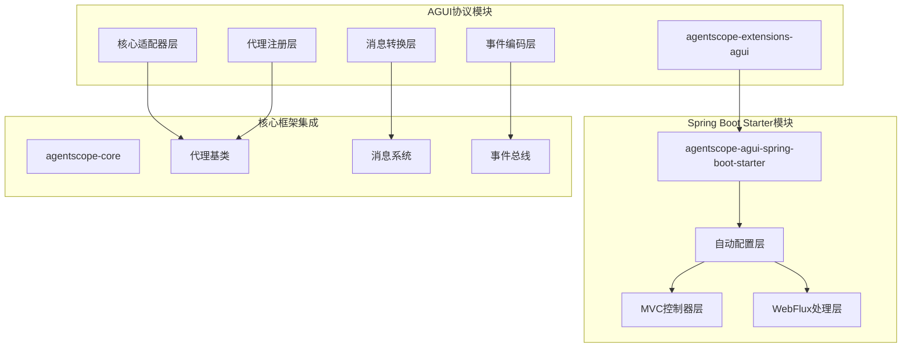

**图表来源**
- [AguiAdapterConfig.java:1-200](file://agentscope-extensions/agentscope-extensions-protocol/agentscope-extensions-agui/src/main/java/io/agentscope/core/agui/adapter/AguiAdapterConfig.java#L1-L200)
- [AguiAgentAutoRegistration.java:1-150](file://agentscope-extensions/agentscope-spring-boot-starters/agentscope-agui-spring-boot-starter/src/main/java/io/agentscope/spring/boot/agui/common/AguiAgentAutoRegistration.java#L1-L150)

**章节来源**
- [AguiAdapterConfig.java:1-200](file://agentscope-extensions/agentscope-extensions-protocol/agentscope-extensions-agui/src/main/java/io/agentscope/core/agui/adapter/AguiAdapterConfig.java#L1-L200)
- [AguiAgentAutoRegistration.java:1-150](file://agentscope-extensions/agentscope-spring-boot-starters/agentscope-agui-spring-boot-starter/src/main/java/io/agentscope/spring/boot/agui/common/AguiAgentAutoRegistration.java#L1-L150)

## 核心组件

### 消息转换器体系

AGUI协议的核心在于其强大的消息转换能力，支持多种数据格式和协议规范：

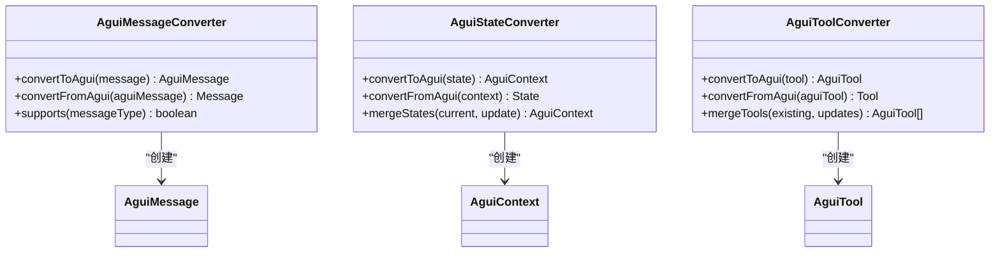

**图表来源**
- [AguiMessageConverter.java:1-150](file://agentscope-extensions/agentscope-extensions-protocol/agentscope-extensions-agui/src/main/java/io/agentscope/core/agui/converter/AguiMessageConverter.java#L1-L150)
- [AguiStateConverter.java:1-150](file://agentscope-extensions/agentscope-extensions-protocol/agentscope-extensions-agui/src/main/java/io/agentscope/core/agui/converter/AguiStateConverter.java#L1-L150)
- [AguiToolConverter.java:1-150](file://agentscope-extensions/agentscope-extensions-protocol/agentscope-extensions-agui/src/main/java/io/agentscope/core/agui/converter/AguiToolConverter.java#L1-L150)

### 代理适配器配置

代理适配器负责协调不同类型的智能体与AGUI协议的交互：

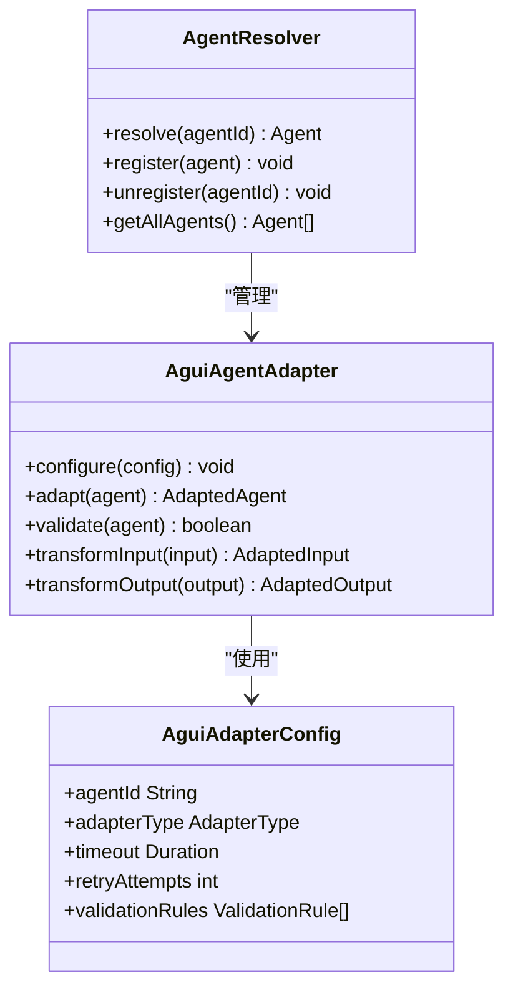

**图表来源**
- [AguiAgentAdapter.java:1-200](file://agentscope-extensions/agentscope-extensions-protocol/agentscope-extensions-agui/src/main/java/io/agentscope/core/agui/adapter/AguiAgentAdapter.java#L1-L200)
- [AguiAdapterConfig.java:1-200](file://agentscope-extensions/agentscope-extensions-protocol/agentscope-extensions-agui/src/main/java/io/agentscope/core/agui/adapter/AguiAdapterConfig.java#L1-L200)
- [AgentResolver.java:1-150](file://agentscope-extensions/agentscope-extensions-protocol/agentscope-extensions-agui/src/main/java/io/agentscope/core/agui/processor/AgentResolver.java#L1-L150)

**章节来源**
- [AguiMessageConverter.java:1-150](file://agentscope-extensions/agentscope-extensions-protocol/agentscope-extensions-agui/src/main/java/io/agentscope/core/agui/converter/AguiMessageConverter.java#L1-L150)
- [AguiStateConverter.java:1-150](file://agentscope-extensions/agentscope-extensions-protocol/agentscope-extensions-agui/src/main/java/io/agentscope/core/agui/converter/AguiStateConverter.java#L1-L150)
- [AguiToolConverter.java:1-150](file://agentscope-extensions/agentscope-extensions-protocol/agentscope-extensions-agui/src/main/java/io/agentscope/core/agui/converter/AguiToolConverter.java#L1-L150)
- [AguiAgentAdapter.java:1-200](file://agentscope-extensions/agentscope-extensions-protocol/agentscope-extensions-agui/src/main/java/io/agentscope/core/agui/adapter/AguiAgentAdapter.java#L1-L200)
- [AguiAdapterConfig.java:1-200](file://agentscope-extensions/agentscope-extensions-protocol/agentscope-extensions-agui/src/main/java/io/agentscope/core/agui/adapter/AguiAdapterConfig.java#L1-L200)
- [AgentResolver.java:1-150](file://agentscope-extensions/agentscope-extensions-protocol/agentscope-extensions-agui/src/main/java/io/agentscope/core/agui/processor/AgentResolver.java#L1-L150)

## 架构概览

AGUI协议集成采用分层架构设计，确保了良好的可扩展性和维护性：

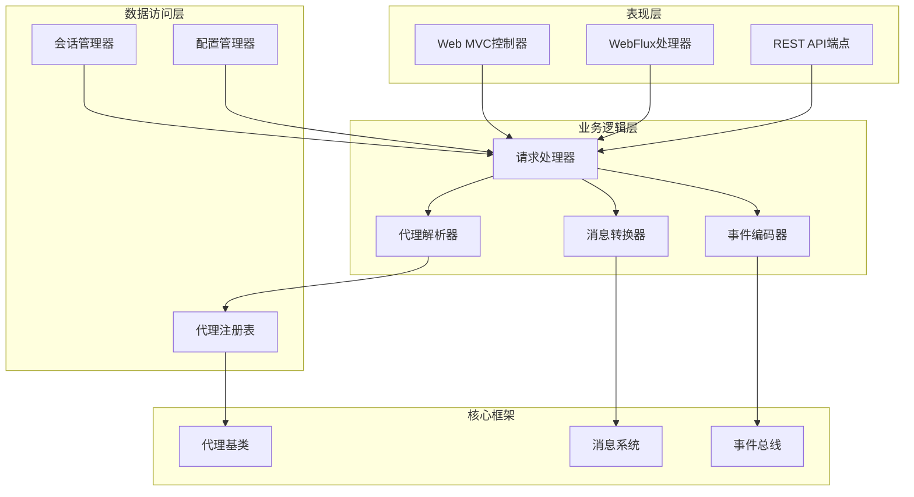

**图表来源**
- [AguiMvcController.java:1-200](file://agentscope-extensions/agentscope-spring-boot-starters/agentscope-agui-spring-boot-starter/src/main/java/io/agentscope/spring/boot/agui/mvc/AguiMvcController.java#L1-L200)
- [AguiWebFluxHandler.java:1-200](file://agentscope-extensions/agentscope-spring-boot-starters/agentscope-agui-spring-boot-starter/src/main/java/io/agentscope/spring/boot/agui/webflux/AguiWebFluxHandler.java#L1-L200)
- [AguiRequestProcessor.java:1-200](file://agentscope-extensions/agentscope-extensions-protocol/agentscope-extensions-agui/src/main/java/io/agentscope/core/agui/processor/AguiRequestProcessor.java#L1-L200)

### Spring Boot自动配置流程

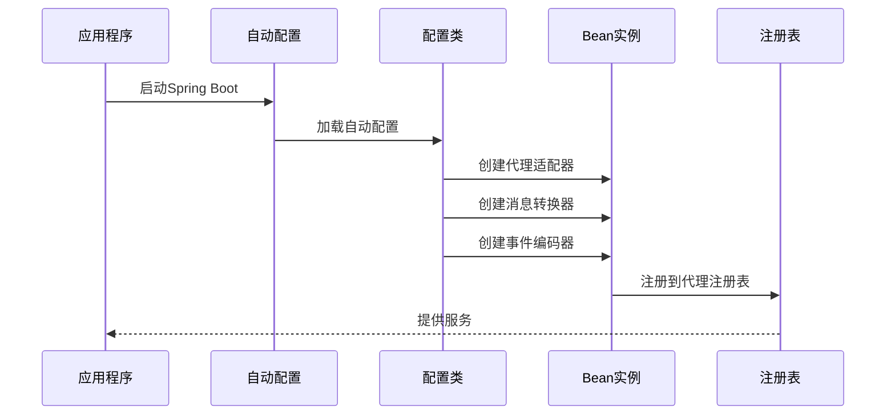

**图表来源**
- [AguiAgentRegistryAutoConfiguration.java:1-200](file://agentscope-extensions/agentscope-spring-boot-starters/agentscope-agui-spring-boot-starter/src/main/java/io/agentscope/spring/boot/agui/common/AguiAgentRegistryAutoConfiguration.java#L1-L200)
- [AguiAgentAutoRegistration.java:1-200](file://agentscope-extensions/agentscope-spring-boot-starters/agentscope-agui-spring-boot-starter/src/main/java/io/agentscope/spring/boot/agui/common/AguiAgentAutoRegistration.java#L1-L200)

**章节来源**
- [AgentscopeAguiMvcAutoConfiguration.java:1-200](file://agentscope-extensions/agentscope-spring-boot-starters/agentscope-agui-spring-boot-starter/src/main/java/io/agentscope/spring/boot/agui/mvc/AgentscopeAguiMvcAutoConfiguration.java#L1-L200)
- [AgentscopeAguiWebFluxAutoConfiguration.java:1-200](file://agentscope-extensions/agentscope-spring-boot-starters/agentscope-agui-spring-boot-starter/src/main/java/io/agentscope/spring/boot/agui/webflux/AgentscopeAguiWebFluxAutoConfiguration.java#L1-L200)

## 详细组件分析

### 事件编码器

事件编码器负责将内部事件转换为AGUI协议兼容的格式：

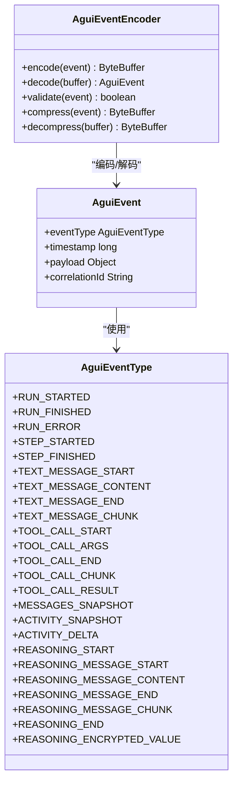

**图表来源**
- [AguiEvent.java:1-200](file://agentscope-extensions/agentscope-extensions-protocol/agentscope-extensions-agui/src/main/java/io/agentscope/core/agui/event/AguiEvent.java#L1-L200)
- [AguiEventEncoder.java:1-200](file://agentscope-extensions/agentscope-extensions-protocol/agentscope-extensions-agui/src/main/java/io/agentscope/core/agui/encoder/AguiEventEncoder.java#L1-L200)
- [AguiEventType.java:1-131](file://agentscope-extensions/agentscope-extensions-protocol/agentscope-extensions-agui/src/main/java/io/agentscope/core/agui/event/AguiEventType.java#L1-L131)

### 请求处理器

请求处理器协调整个AGUI协议的执行流程：

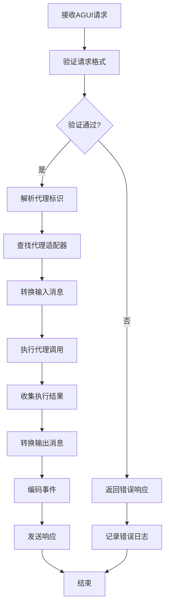

**图表来源**
- [AguiRequestProcessor.java:1-250](file://agentscope-extensions/agentscope-extensions-protocol/agentscope-extensions-agui/src/main/java/io/agentscope/core/agui/processor/AguiRequestProcessor.java#L1-L250)

### 代理注册表

代理注册表管理所有已注册的智能体实例：

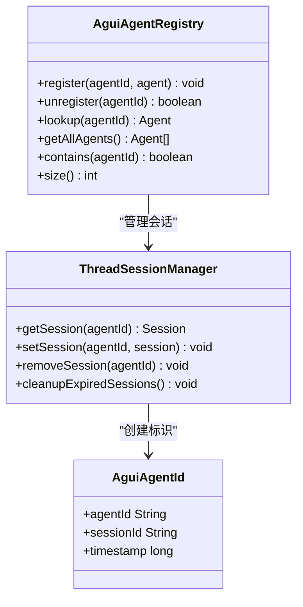

**图表来源**
- [AguiAgentRegistry.java:1-200](file://agentscope-extensions/agentscope-extensions-protocol/agentscope-extensions-agui/src/main/java/io/agentscope/core/agui/registry/AguiAgentRegistry.java#L1-L200)
- [ThreadSessionManager.java:1-200](file://agentscope-extensions/agentscope-spring-boot-starters/agentscope-agui-spring-boot-starter/src/main/java/io/agentscope/spring/boot/agui/common/ThreadSessionManager.java#L1-L200)

**章节来源**
- [AguiEvent.java:1-200](file://agentscope-extensions/agentscope-extensions-protocol/agentscope-extensions-agui/src/main/java/io/agentscope/core/agui/event/AguiEvent.java#L1-L200)
- [AguiEventEncoder.java:1-200](file://agentscope-extensions/agentscope-extensions-protocol/agentscope-extensions-agui/src/main/java/io/agentscope/core/agui/encoder/AguiEventEncoder.java#L1-L200)
- [AguiEventType.java:1-131](file://agentscope-extensions/agentscope-extensions-protocol/agentscope-extensions-agui/src/main/java/io/agentscope/core/agui/event/AguiEventType.java#L1-L131)
- [AguiRequestProcessor.java:1-250](file://agentscope-extensions/agentscope-extensions-protocol/agentscope-extensions-agui/src/main/java/io/agentscope/core/agui/processor/AguiRequestProcessor.java#L1-L250)
- [AguiAgentRegistry.java:1-200](file://agentscope-extensions/agentscope-extensions-protocol/agentscope-extensions-agui/src/main/java/io/agentscope/core/agui/registry/AguiAgentRegistry.java#L1-L200)
- [ThreadSessionManager.java:1-200](file://agentscope-extensions/agentscope-spring-boot-starters/agentscope-agui-spring-boot-starter/src/main/java/io/agentscope/spring/boot/agui/common/ThreadSessionManager.java#L1-L200)

## 事件系统增强

### 新增事件类型详解

**更新** 本次增强实现了与TypeScript SDK的完全对齐，新增了9种核心事件类型，显著提升了多智能体应用的可视化和调试能力。

#### 核心运行时事件

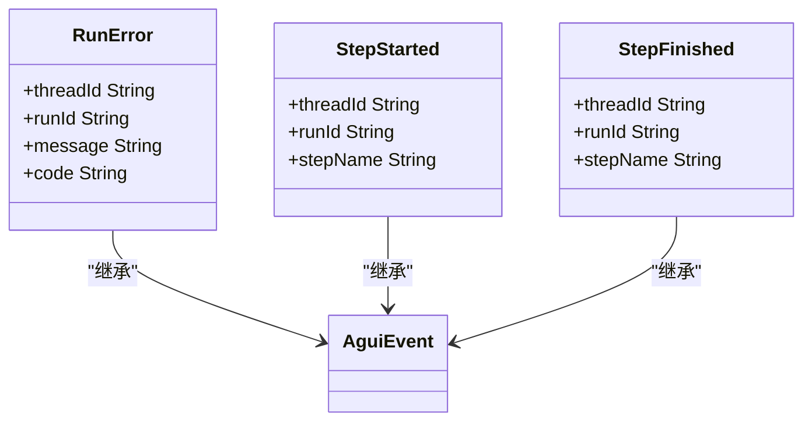

**图表来源**
- [AguiEvent.java:835-926](file://agentscope-extensions/agentscope-extensions-protocol/agentscope-extensions-agui/src/main/java/io/agentscope/core/agui/event/AguiEvent.java#L835-L926)

#### 流式消息传输事件

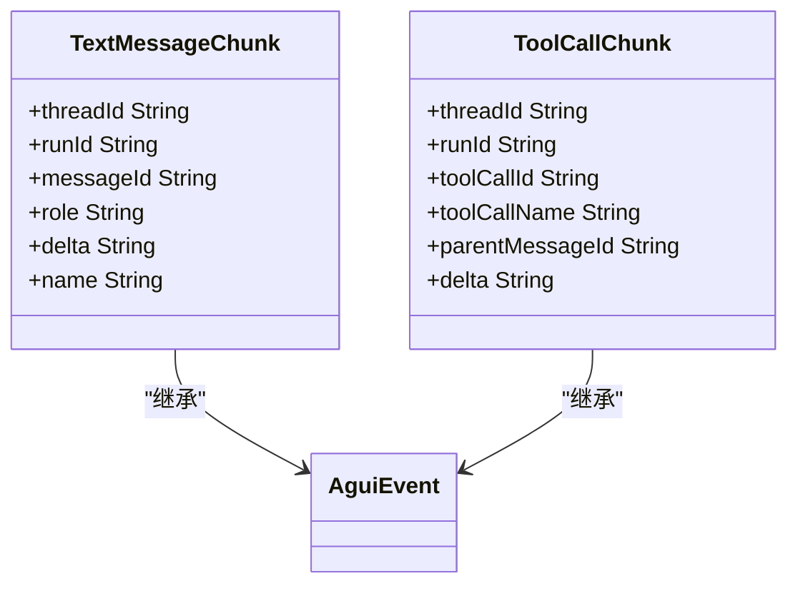

**图表来源**
- [AguiEvent.java:931-1009](file://agentscope-extensions/agentscope-extensions-protocol/agentscope-extensions-agui/src/main/java/io/agentscope/core/agui/event/AguiEvent.java#L931-L1009)

#### 状态同步事件

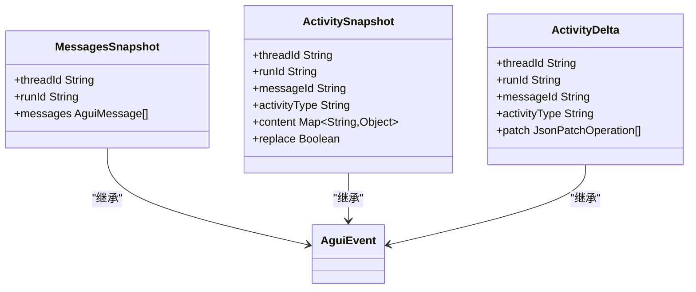

**图表来源**
- [AguiEvent.java:1016-1148](file://agentscope-extensions/agentscope-extensions-protocol/agentscope-extensions-agui/src/main/java/io/agentscope/core/agui/event/AguiEvent.java#L1016-L1148)

#### 推理安全事件

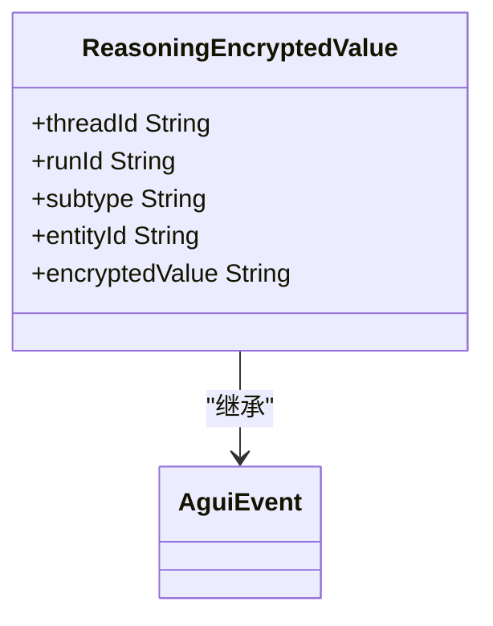

**图表来源**
- [AguiEvent.java:1155-1188](file://agentscope-extensions/agentscope-extensions-protocol/agentscope-extensions-agui/src/main/java/io/agentscope/core/agui/event/AguiEvent.java#L1155-L1188)

### 事件类型枚举

新增的事件类型枚举值如下：

| 事件类型 | 描述 | 主要用途 |
|---------|------|----------|
| `RUN_ERROR` | 运行错误事件 | 错误处理和异常恢复 |
| `STEP_STARTED` | 步骤开始事件 | 工作流进度跟踪 |
| `STEP_FINISHED` | 步骤完成事件 | 工作流状态同步 |
| `TEXT_MESSAGE_CHUNK` | 文本消息块事件 | 流式文本传输 |
| `TOOL_CALL_CHUNK` | 工具调用块事件 | 流式工具调用 |
| `MESSAGES_SNAPSHOT` | 消息快照事件 | 完整消息状态同步 |
| `ACTIVITY_SNAPSHOT` | 活动快照事件 | 活动状态完整同步 |
| `ACTIVITY_DELTA` | 活动增量事件 | 活动状态增量更新 |
| `REASONING_ENCRYPTED_VALUE` | 推理加密值事件 | 安全推理内容传输 |

**章节来源**
- [AguiEvent.java:1-1311](file://agentscope-extensions/agentscope-extensions-protocol/agentscope-extensions-agui/src/main/java/io/agentscope/core/agui/event/AguiEvent.java#L1-L1311)
- [AguiEventType.java:1-131](file://agentscope-extensions/agentscope-extensions-protocol/agentscope-extensions-agui/src/main/java/io/agentscope/core/agui/event/AguiEventType.java#L1-L131)

## 依赖关系分析

AGUI协议集成模块之间的依赖关系如下：

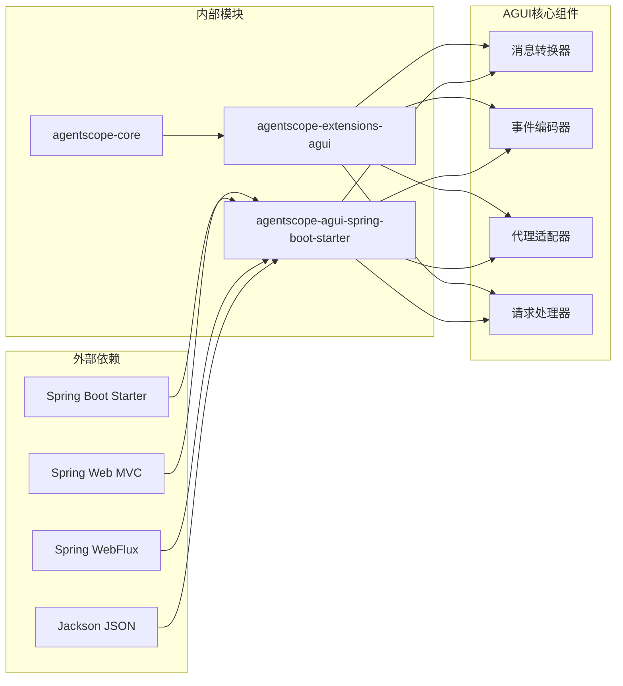

**图表来源**
- [pom.xml](file://agentscope-extensions/agentscope-extensions-protocol/agentscope-extensions-agui/pom.xml)
- [pom.xml](file://agentscope-extensions/agentscope-spring-boot-starters/agentscope-agui-spring-boot-starter/pom.xml)

### 组件耦合度分析

AGUI协议集成展现了良好的内聚性和低耦合性：

- **高内聚性**：每个组件专注于特定的功能领域
- **低耦合性**：通过接口和抽象类实现松散耦合
- **可扩展性**：支持新的消息类型和代理适配器
- **可测试性**：每个组件都有独立的单元测试

**章节来源**
- [pom.xml](file://agentscope-extensions/agentscope-extensions-protocol/agentscope-extensions-agui/pom.xml)
- [pom.xml](file://agentscope-extensions/agentscope-spring-boot-starters/agentscope-agui-spring-boot-starter/pom.xml)

## 性能考虑

### 异步处理优化

AGUI协议集成了全面的异步处理机制：

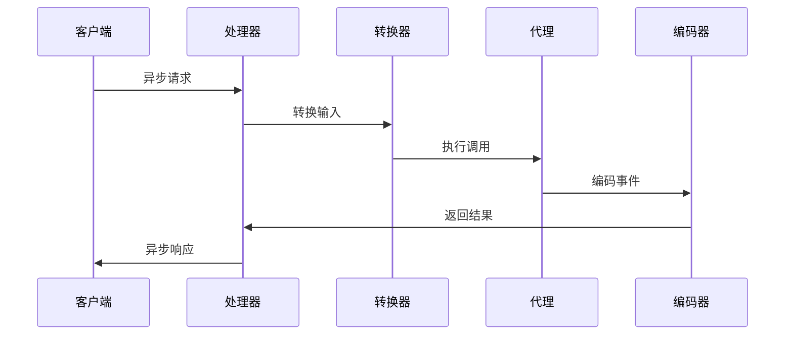

### 内存管理策略

- **流式处理**：支持大数据量的消息传输
- **连接池管理**：优化网络连接复用
- **缓存策略**：智能缓存常用配置和模型
- **垃圾回收优化**：减少内存碎片化

## 故障排除指南

### 常见问题诊断

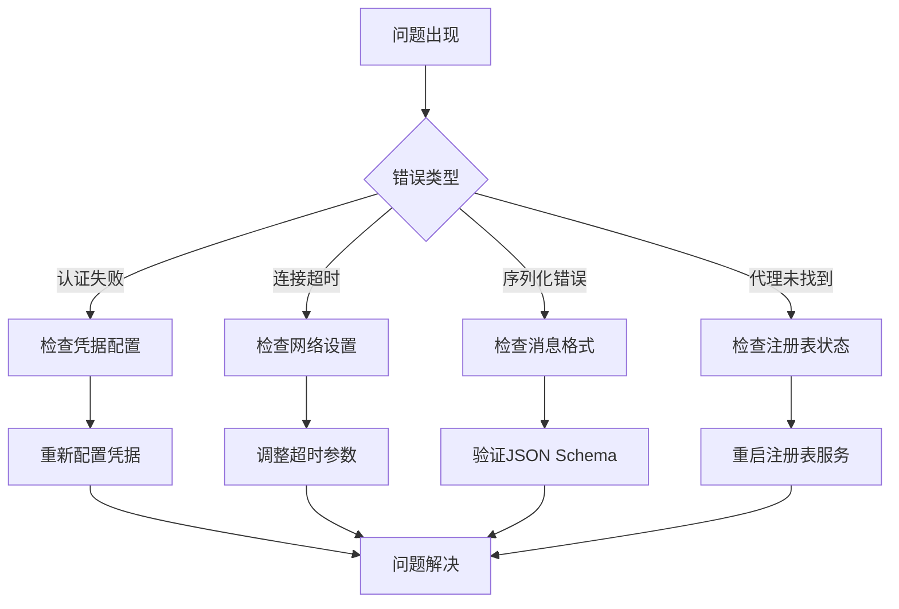

### 错误处理机制

AGUI协议集成了完善的错误处理和恢复机制：

- **异常分类**：区分可恢复和不可恢复错误
- **重试策略**：指数退避算法
- **降级处理**：优雅降级到基础功能
- **监控告警**：实时监控系统健康状态

**章节来源**
- [AguiException.java:1-200](file://agentscope-extensions/agentscope-extensions-protocol/agentscope-extensions-agui/src/main/java/io/agentscope/core/agui/AguiException.java#L1-L200)

## 结论

AGUI协议集成增强为Agentscope Java框架提供了完整的图形用户界面协议支持。通过精心设计的分层架构和模块化组件，该集成实现了：

1. **完整的协议支持**：从消息转换到事件编码的全栈解决方案
2. **高度可扩展性**：支持新功能的快速集成和现有功能的扩展
3. **生产就绪特性**：包含完整的错误处理、性能优化和监控机制
4. **Spring Boot无缝集成**：通过自动配置简化部署和使用
5. **TypeScript SDK完全对齐**：新增9种核心事件类型，实现与前端SDK的完全兼容

**更新** 本次增强特别注重事件系统的完善，新增的RunError、StepStarted、StepFinished、TextMessageChunk、ToolCallChunk、MessagesSnapshot、ActivitySnapshot、ActivityDelta、ReasoningEncryptedValue等9种事件类型，显著提升了多智能体应用的可视化、调试能力和安全性。这些改进使得开发者能够更好地监控和控制智能体的执行过程，提供了更丰富的用户体验和更强的系统可观测性。

该集成不仅增强了Agentscope框架的功能，还为构建复杂的多智能体应用奠定了坚实的基础。通过标准化的协议接口和丰富的工具集，开发者可以专注于业务逻辑的实现，而不必担心底层通信细节。
