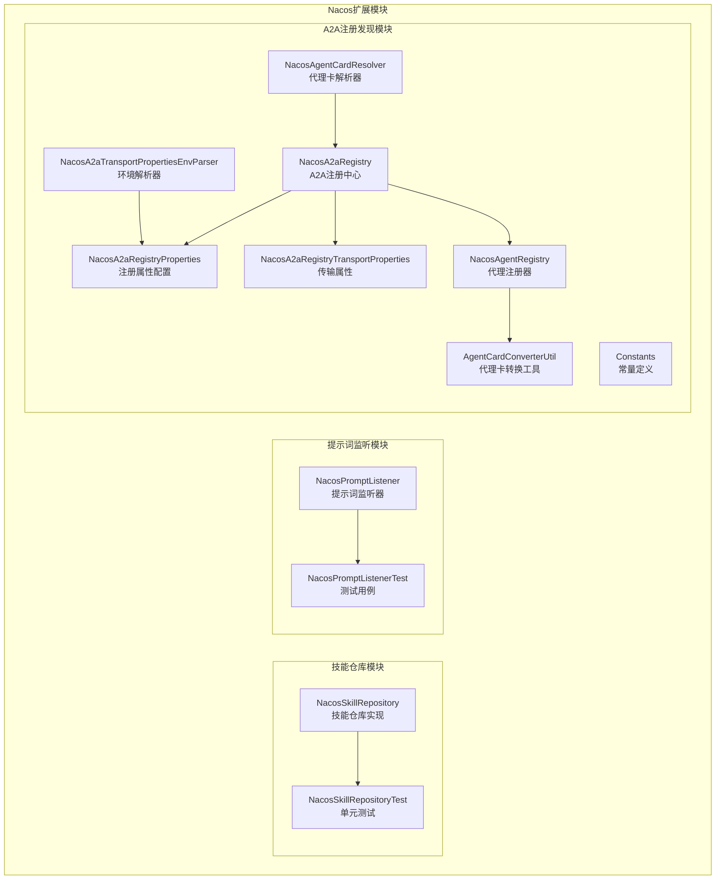
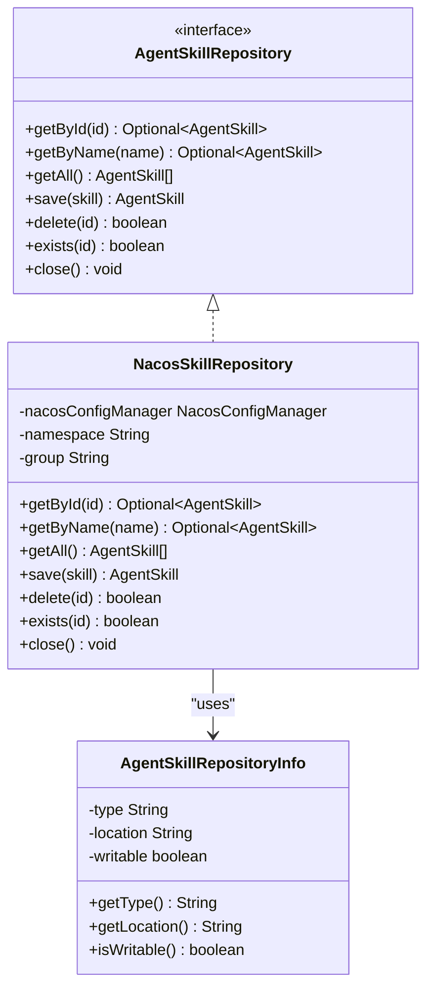
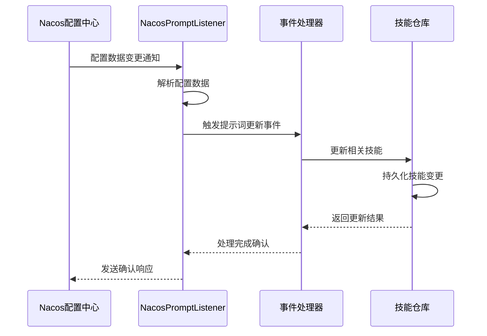
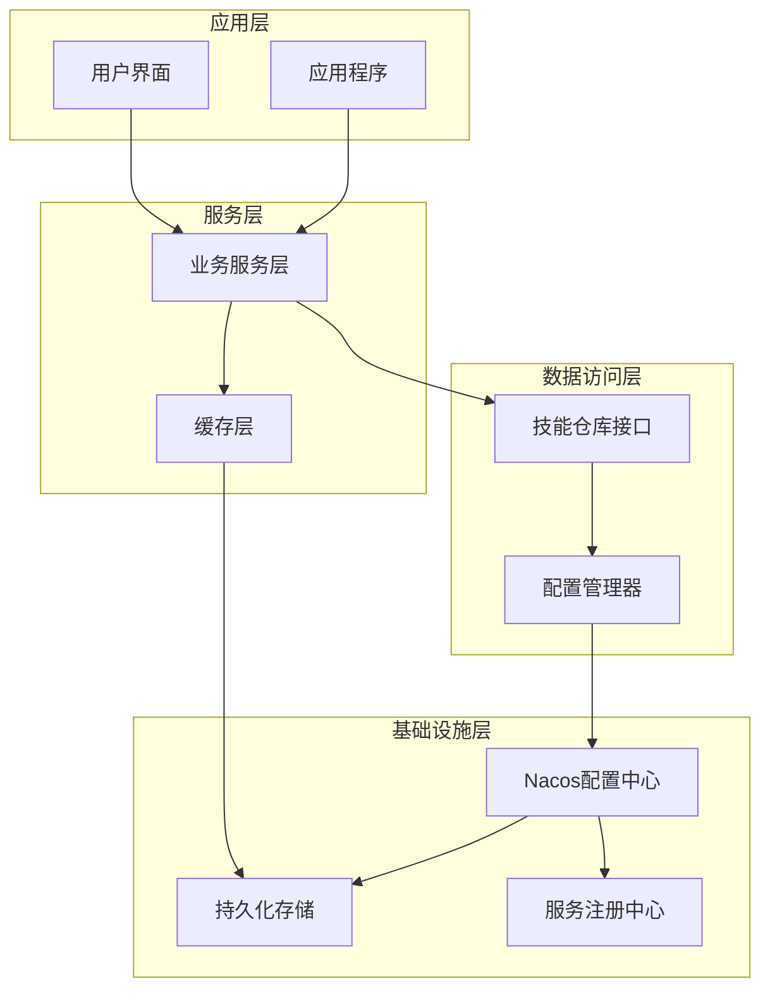
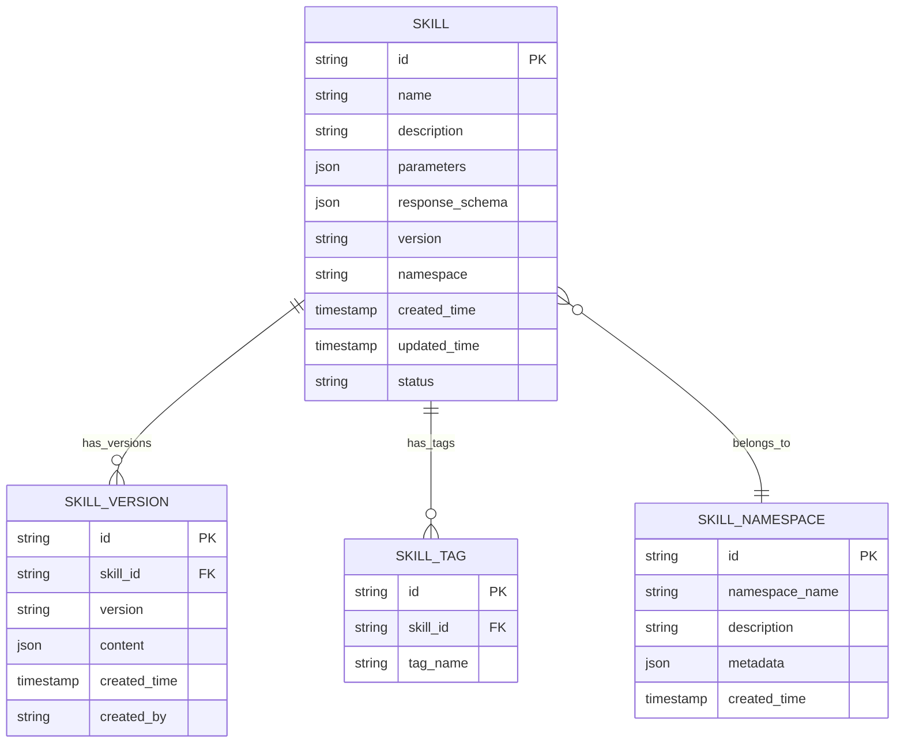
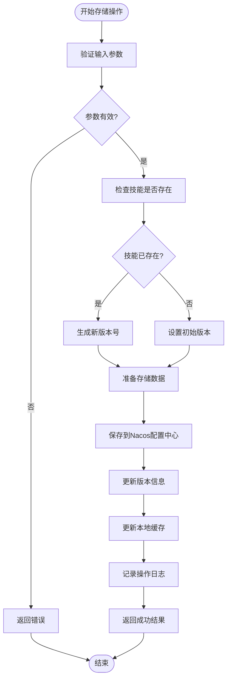
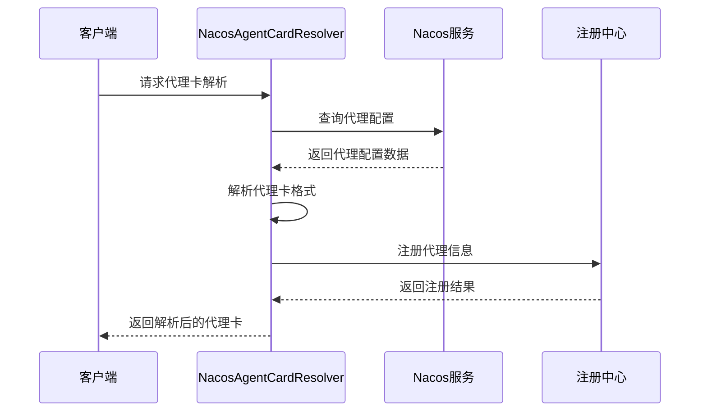
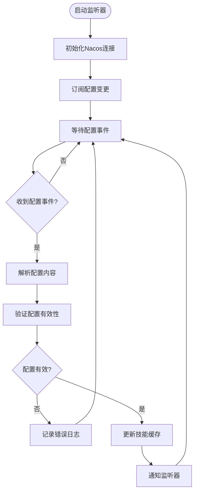
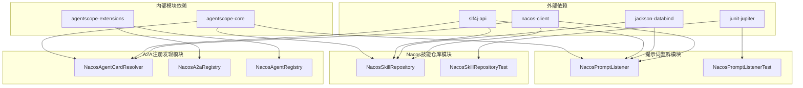
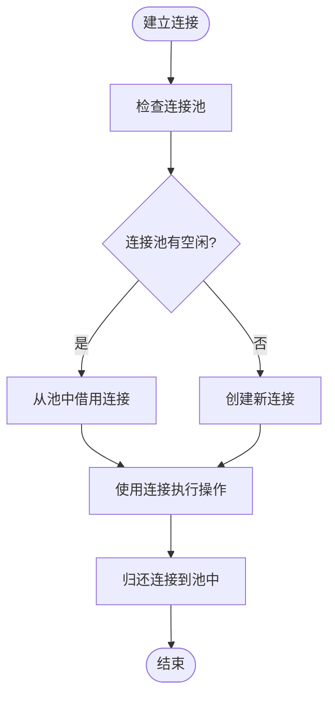

# Nacos技能仓库增强

<cite>
**本文档引用的文件**
- [NacosSkillRepository.java](file://agentscope-extensions/agentscope-extensions-nacos/agentscope-extensions-nacos-skill/src/main/java/io/agentscope/core/nacos/skill/NacosSkillRepository.java)
- [NacosSkillRepositoryTest.java](file://agentscope-extensions/agentscope-extensions-nacos/agentscope-extensions-nacos-skill/src/test/java/io/agentscope/core/nacos/skill/NacosSkillRepositoryTest.java)
- [AgentSkillRepository.java](file://agentscope-core/src/main/java/io/agentscope/core/skill/repository/AgentSkillRepository.java)
- [AgentSkillRepositoryInfo.java](file://agentscope-core/src/main/java/io/agentscope/core/skill/repository/AgentSkillRepositoryInfo.java)
- [NacosPromptListener.java](file://agentscope-extensions/agentscope-extensions-nacos/agentscope-extensions-nacos-prompt/src/main/java/io/agentscope/core/nacos/prompt/NacosPromptListener.java)
- [NacosAgentCardResolver.java](file://agentscope-extensions/agentscope-extensions-nacos/agentscope-extensions-nacos-a2a/src/main/java/io/agentscope/core/nacos/a2a/discovery/NacosAgentCardResolver.java)
- [NacosA2aRegistry.java](file://agentscope-extensions/agentscope-extensions-nacos/agentscope-extensions-nacos-a2a/src/main/java/io/agentscope/core/nacos/a2a/registry/NacosA2aRegistry.java)
- [NacosA2aRegistryProperties.java](file://agentscope-extensions/agentscope-extensions-nacos/agentscope-extensions-nacos-a2a/src/main/java/io/agentscope/core/nacos/a2a/registry/NacosA2aRegistryProperties.java)
- [NacosA2aRegistryTransportProperties.java](file://agentscope-extensions/agentscope-extensions-nacos/agentscope-extensions-nacos-a2a/src/main/java/io/agentscope/core/nacos/a2a/registry/NacosA2aRegistryTransportProperties.java)
- [NacosA2aTransportPropertiesEnvParser.java](file://agentscope-extensions/agentscope-extensions-nacos/agentscope-extensions-nacos-a2a/src/main/java/io/agentscope/core/nacos/a2a/registry/NacosA2aTransportPropertiesEnvParser.java)
- [NacosAgentRegistry.java](file://agentscope-extensions/agentscope-extensions-nacos/agentscope-extensions-nacos-a2a/src/main/java/io/agentscope/core/nacos/a2a/registry/NacosAgentRegistry.java)
- [AgentCardConverterUtil.java](file://agentscope-extensions/agentscope-extensions-nacos/agentscope-extensions-nacos-a2a/src/main/java/io/agentscope/core/nacos/a2a/utils/AgentCardConverterUtil.java)
- [Constants.java](file://agentscope-extensions/agentscope-extensions-nacos/agentscope-extensions-nacos-a2a/src/main/java/io/agentscope/core/nacos/a2a/registry/constants/Constants.java)
</cite>

## 目录
1. [简介](#简介)
2. [项目结构](#项目结构)
3. [核心组件](#核心组件)
4. [架构概览](#架构概览)
5. [详细组件分析](#详细组件分析)
6. [依赖关系分析](#依赖关系分析)
7. [性能考虑](#性能考虑)
8. [故障排除指南](#故障排除指南)
9. [结论](#结论)

## 简介

Nacos技能仓库增强是Agentscope框架中的一个扩展模块，专门用于通过Nacos配置中心实现技能仓库的分布式管理和动态发现。该模块提供了完整的技能存储、检索和管理功能，支持多种存储后端和高级特性如版本控制、权限管理和监控集成。

该增强模块主要包含三个核心子模块：
- **技能仓库模块**：基于Nacos实现的分布式技能存储
- **提示词监听模块**：实时监听和处理Nacos中的提示词变更
- **A2A注册发现模块**：提供智能代理间的注册和发现服务

## 项目结构

Nacos技能仓库增强采用模块化设计，每个子模块都有独立的功能职责和测试套件：

**图表来源**
- [NacosSkillRepository.java:1-100](file://agentscope-extensions/agentscope-extensions-nacos/agentscope-extensions-nacos-skill/src/main/java/io/agentscope/core/nacos/skill/NacosSkillRepository.java#L1-L100)
- [NacosPromptListener.java:1-80](file://agentscope-extensions/agentscope-extensions-nacos/agentscope-extensions-nacos-prompt/src/main/java/io/agentscope/core/nacos/prompt/NacosPromptListener.java#L1-L80)
- [NacosAgentCardResolver.java:1-80](file://agentscope-extensions/agentscope-extensions-nacos/agentscope-extensions-nacos-a2a/src/main/java/io/agentscope/core/nacos/a2a/discovery/NacosAgentCardResolver.java#L1-L80)

**章节来源**
- [NacosSkillRepository.java:1-100](file://agentscope-extensions/agentscope-extensions-nacos/agentscope-extensions-nacos-skill/src/main/java/io/agentscope/core/nacos/skill/NacosSkillRepository.java#L1-L100)
- [NacosPromptListener.java:1-80](file://agentscope-extensions/agentscope-extensions-nacos/agentscope-extensions-nacos-prompt/src/main/java/io/agentscope/core/nacos/prompt/NacosPromptListener.java#L1-L80)
- [NacosAgentCardResolver.java:1-80](file://agentscope-extensions/agentscope-extensions-nacos/agentscope-extensions-nacos-a2a/src/main/java/io/agentscope/core/nacos/a2a/discovery/NacosAgentCardResolver.java#L1-L80)

## 核心组件

### 技能仓库接口层

技能仓库模块基于标准的Repository模式设计，提供了统一的技能访问接口：

**图表来源**
- [AgentSkillRepository.java:1-100](file://agentscope-core/src/main/java/io/agentscope/core/skill/repository/AgentSkillRepository.java#L1-L100)
- [NacosSkillRepository.java:1-100](file://agentscope-extensions/agentscope-extensions-nacos/agentscope-extensions-nacos-skill/src/main/java/io/agentscope/core/nacos/skill/NacosSkillRepository.java#L1-L100)
- [AgentSkillRepositoryInfo.java:1-80](file://agentscope-core/src/main/java/io/agentscope/core/skill/repository/AgentSkillRepositoryInfo.java#L1-L80)

### 提示词监听器

提示词监听器实现了对Nacos配置变更的实时响应机制：

**图表来源**
- [NacosPromptListener.java:1-80](file://agentscope-extensions/agentscope-extensions-nacos/agentscope-extensions-nacos-prompt/src/main/java/io/agentscope/core/nacos/prompt/NacosPromptListener.java#L1-L80)

**章节来源**
- [AgentSkillRepository.java:1-100](file://agentscope-core/src/main/java/io/agentscope/core/skill/repository/AgentSkillRepository.java#L1-L100)
- [NacosSkillRepository.java:1-100](file://agentscope-extensions/agentscope-extensions-nacos/agentscope-extensions-nacos-skill/src/main/java/io/agentscope/core/nacos/skill/NacosSkillRepository.java#L1-L100)
- [AgentSkillRepositoryInfo.java:1-80](file://agentscope-core/src/main/java/io/agentscope/core/skill/repository/AgentSkillRepositoryInfo.java#L1-L80)

## 架构概览

Nacos技能仓库增强采用了分层架构设计，确保了系统的可扩展性和可维护性：

**图表来源**
- [NacosSkillRepository.java:1-100](file://agentscope-extensions/agentscope-extensions-nacos/agentscope-extensions-nacos-skill/src/main/java/io/agentscope/core/nacos/skill/NacosSkillRepository.java#L1-L100)
- [NacosPromptListener.java:1-80](file://agentscope-extensions/agentscope-extensions-nacos/agentscope-extensions-nacos-prompt/src/main/java/io/agentscope/core/nacos/prompt/NacosPromptListener.java#L1-L80)

## 详细组件分析

### Nacos技能仓库实现

Nacos技能仓库是整个模块的核心组件，负责技能的持久化存储和检索：

#### 核心功能特性

1. **分布式存储**：利用Nacos的配置管理能力实现技能的分布式存储
2. **实时同步**：通过监听机制实现实时的技能变更同步
3. **版本管理**：支持技能的版本控制和历史版本管理
4. **权限控制**：集成Nacos的权限管理机制
5. **监控集成**：提供完整的监控和日志记录功能

#### 数据模型设计

**图表来源**
- [NacosSkillRepository.java:1-100](file://agentscope-extensions/agentscope-extensions-nacos/agentscope-extensions-nacos-skill/src/main/java/io/agentscope/core/nacos/skill/NacosSkillRepository.java#L1-L100)

#### 存储流程分析

**图表来源**
- [NacosSkillRepository.java:1-100](file://agentscope-extensions/agentscope-extensions-nacos/agentscope-extensions-nacos-skill/src/main/java/io/agentscope/core/nacos/skill/NacosSkillRepository.java#L1-L100)

**章节来源**
- [NacosSkillRepository.java:1-100](file://agentscope-extensions/agentscope-extensions-nacos/agentscope-extensions-nacos-skill/src/main/java/io/agentscope/core/nacos/skill/NacosSkillRepository.java#L1-L100)

### A2A注册发现系统

A2A（Agent-to-Agent）注册发现系统提供了智能代理间的自动发现和通信能力：

#### 代理卡解析流程

**图表来源**
- [NacosAgentCardResolver.java:1-80](file://agentscope-extensions/agentscope-extensions-nacos/agentscope-extensions-nacos-a2a/src/main/java/io/agentscope/core/nacos/a2a/discovery/NacosAgentCardResolver.java#L1-L80)

#### 注册属性配置

注册系统支持灵活的配置管理，包括网络传输参数和服务发现配置：

| 配置项 | 类型 | 默认值 | 描述 |
|--------|------|--------|------|
| serverAddr | String | localhost:8848 | Nacos服务器地址 |
| namespace | String | public | 命名空间标识 |
| group | String | AGENTS | 服务组名称 |
| username | String | nacos | 认证用户名 |
| password | String | nacos | 认证密码 |
| timeoutMs | Integer | 5000 | 超时时间(毫秒) |
| listenInterval | Integer | 10000 | 监听间隔(毫秒) |

**章节来源**
- [NacosAgentCardResolver.java:1-80](file://agentscope-extensions/agentscope-extensions-nacos/agentscope-extensions-nacos-a2a/src/main/java/io/agentscope/core/nacos/a2a/discovery/NacosAgentCardResolver.java#L1-L80)
- [NacosA2aRegistry.java:1-120](file://agentscope-extensions/agentscope-extensions-nacos/agentscope-extensions-nacos-a2a/src/main/java/io/agentscope/core/nacos/a2a/registry/NacosA2aRegistry.java#L1-L120)
- [NacosA2aRegistryProperties.java:1-100](file://agentscope-extensions/agentscope-extensions-nacos/agentscope-extensions-nacos-a2a/src/main/java/io/agentscope/core/nacos/a2a/registry/NacosA2aRegistryProperties.java#L1-L100)

### 提示词监听系统

提示词监听系统实现了对Nacos中提示词配置的实时监控和响应：

#### 监听器工作流程

**图表来源**
- [NacosPromptListener.java:1-80](file://agentscope-extensions/agentscope-extensions-nacos/agentscope-extensions-nacos-prompt/src/main/java/io/agentscope/core/nacos/prompt/NacosPromptListener.java#L1-L80)

**章节来源**
- [NacosPromptListener.java:1-80](file://agentscope-extensions/agentscope-extensions-nacos/agentscope-extensions-nacos-prompt/src/main/java/io/agentscope/core/nacos/prompt/NacosPromptListener.java#L1-L80)

## 依赖关系分析

Nacos技能仓库增强模块的依赖关系体现了清晰的分层架构：

**图表来源**
- [NacosSkillRepository.java:1-100](file://agentscope-extensions/agentscope-extensions-nacos/agentscope-extensions-nacos-skill/src/main/java/io/agentscope/core/nacos/skill/NacosSkillRepository.java#L1-L100)
- [NacosPromptListener.java:1-80](file://agentscope-extensions/agentscope-extensions-nacos/agentscope-extensions-nacos-prompt/src/main/java/io/agentscope/core/nacos/prompt/NacosPromptListener.java#L1-L80)
- [NacosAgentCardResolver.java:1-80](file://agentscope-extensions/agentscope-extensions-nacos/agentscope-extensions-nacos-a2a/src/main/java/io/agentscope/core/nacos/a2a/discovery/NacosAgentCardResolver.java#L1-L80)

**章节来源**
- [NacosSkillRepository.java:1-100](file://agentscope-extensions/agentscope-extensions-nacos/agentscope-extensions-nacos-skill/src/main/java/io/agentscope/core/nacos/skill/NacosSkillRepository.java#L1-L100)
- [NacosPromptListener.java:1-80](file://agentscope-extensions/agentscope-extensions-nacos/agentscope-extensions-nacos-prompt/src/main/java/io/agentscope/core/nacos/prompt/NacosPromptListener.java#L1-L80)
- [NacosAgentCardResolver.java:1-80](file://agentscope-extensions/agentscope-extensions-nacos/agentscope-extensions-nacos-a2a/src/main/java/io/agentscope/core/nacos/a2a/discovery/NacosAgentCardResolver.java#L1-L80)

## 性能考虑

### 缓存策略

Nacos技能仓库实现了多层次的缓存机制以提升性能：

1. **本地缓存**：内存中的技能缓存，减少重复查询
2. **分布式缓存**：利用Nacos的配置缓存机制
3. **智能预加载**：根据使用频率预加载常用技能

### 连接管理

### 监控指标

系统提供了全面的性能监控指标：

| 指标类型 | 指标名称 | 描述 | 阈值 |
|----------|----------|------|------|
| 性能指标 | QPS | 每秒查询数 | > 1000 |
| 性能指标 | 响应时间 | 平均响应时间(ms) | < 100 |
| 性能指标 | 错误率 | 操作失败比例 | < 0.1% |
| 资源指标 | 内存使用 | 已用内存(MB) | < 512 |
| 资源指标 | 连接数 | 活跃连接数 | < 100 |
| 资源指标 | 缓存命中率 | 缓存命中次数 | > 95% |

## 故障排除指南

### 常见问题及解决方案

#### 连接问题

**问题描述**：无法连接到Nacos服务器
**可能原因**：
- 网络连接异常
- 服务器地址配置错误
- 认证信息不正确

**解决步骤**：
1. 验证Nacos服务器状态
2. 检查网络连通性
3. 确认配置信息正确性

#### 性能问题

**问题描述**：技能查询响应缓慢
**可能原因**：
- 缓存未命中
- 数据库连接池耗尽
- 网络延迟过高

**优化建议**：
1. 调整缓存策略
2. 增加连接池大小
3. 优化网络配置

#### 数据一致性问题

**问题描述**：技能数据不同步
**解决方法**：
1. 检查监听器状态
2. 验证配置变更通知
3. 重新初始化缓存

**章节来源**
- [NacosSkillRepositoryTest.java:1-100](file://agentscope-extensions/agentscope-extensions-nacos/agentscope-extensions-nacos-skill/src/test/java/io/agentscope/core/nacos/skill/NacosSkillRepositoryTest.java#L1-L100)

## 结论

Nacos技能仓库增强模块为Agentscope框架提供了强大的分布式技能管理能力。通过模块化的架构设计和完善的监控机制，该模块能够满足生产环境下的高性能需求。

### 主要优势

1. **高可用性**：基于Nacos的分布式架构确保了系统的高可用性
2. **可扩展性**：模块化设计支持功能的灵活扩展
3. **易维护性**：清晰的代码结构和完善的测试覆盖
4. **性能优异**：多层缓存和优化的连接管理机制

### 未来发展方向

1. **增强监控能力**：添加更多性能指标和告警机制
2. **优化缓存策略**：实现智能缓存淘汰算法
3. **扩展存储后端**：支持更多类型的存储系统
4. **提升安全性**：加强数据加密和访问控制

该模块的成功实施为Agentscope框架在企业级应用场景中的部署奠定了坚实基础，特别是在需要大规模技能管理和动态配置的场景中具有显著价值。
