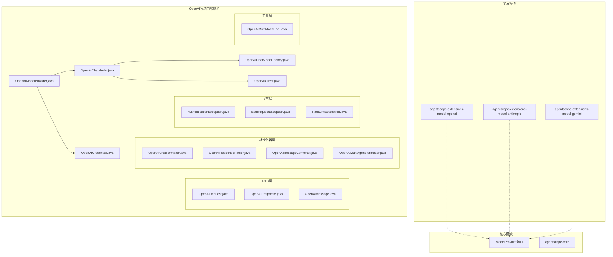
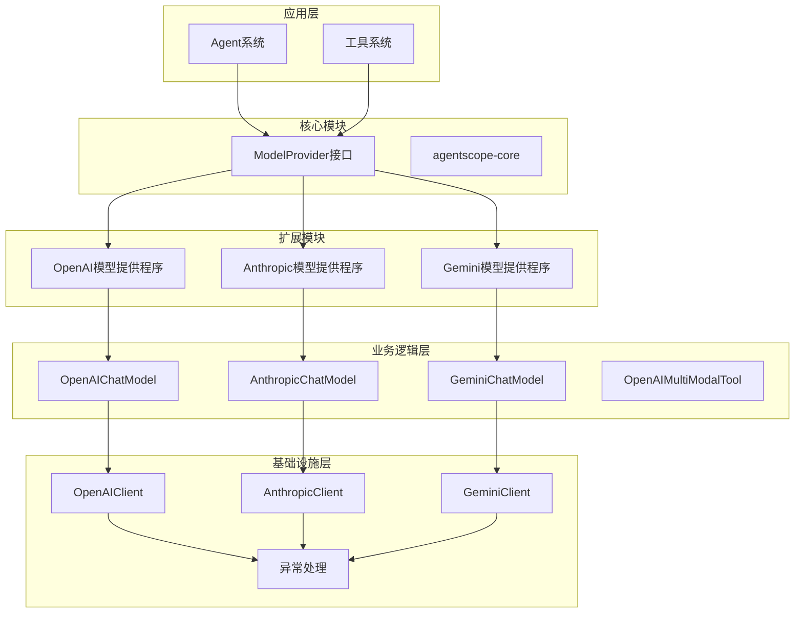
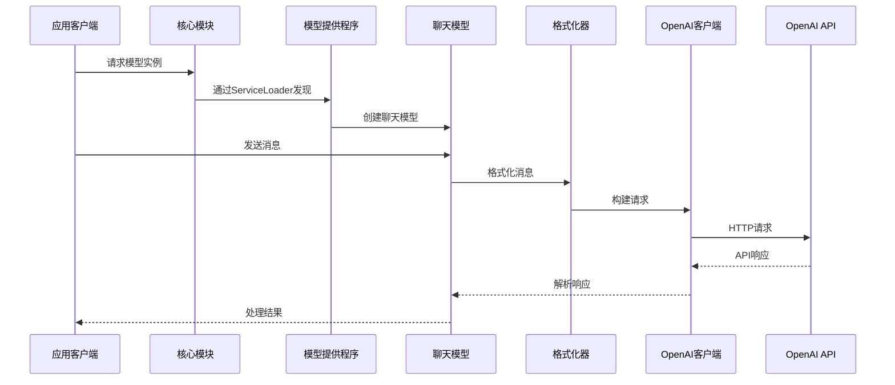
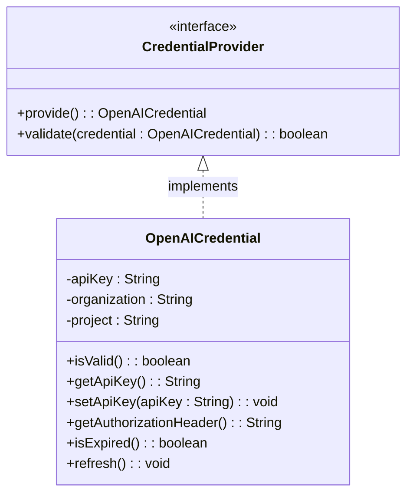
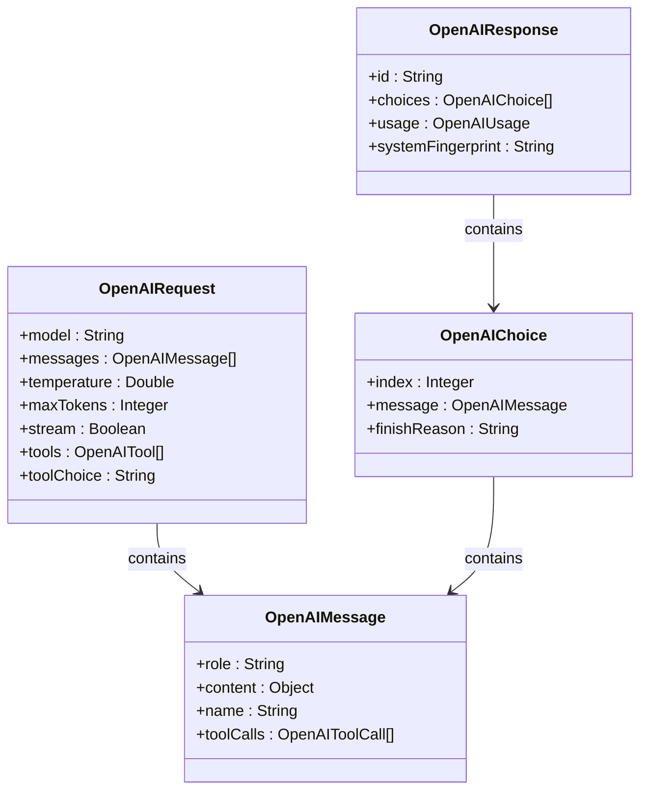
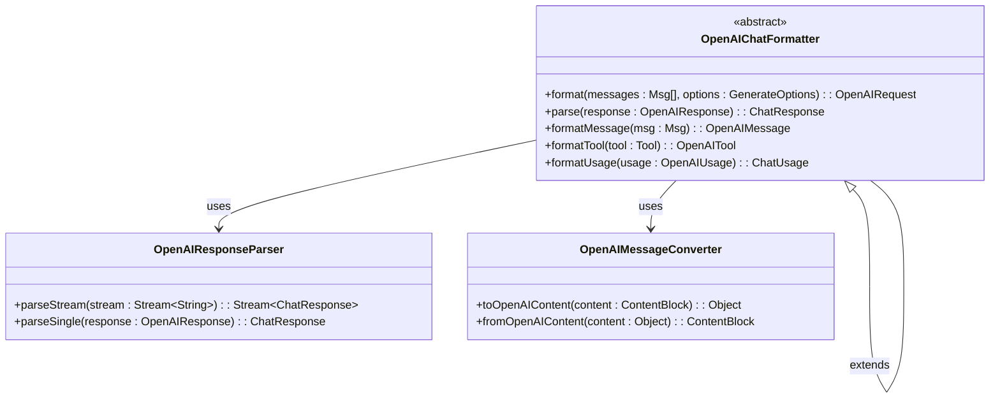
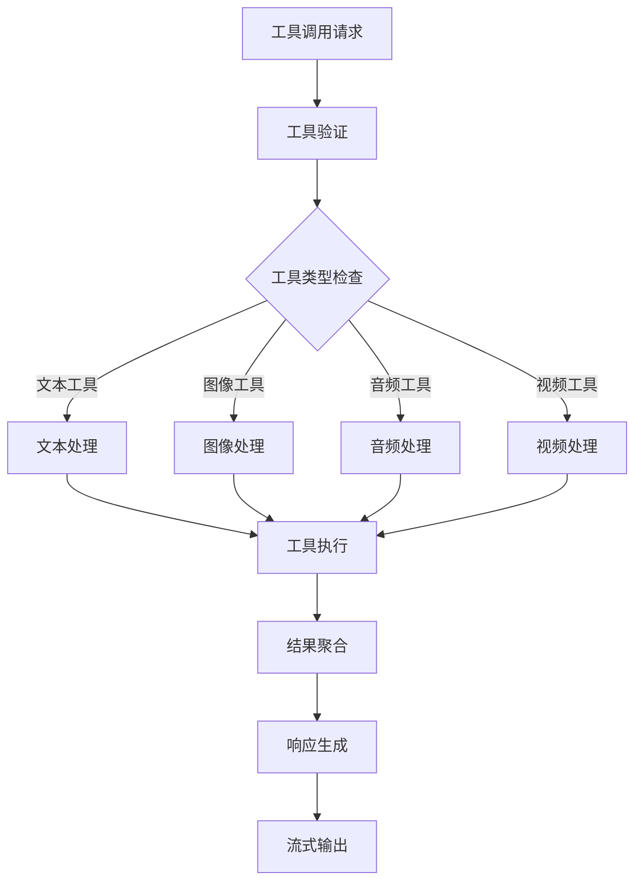
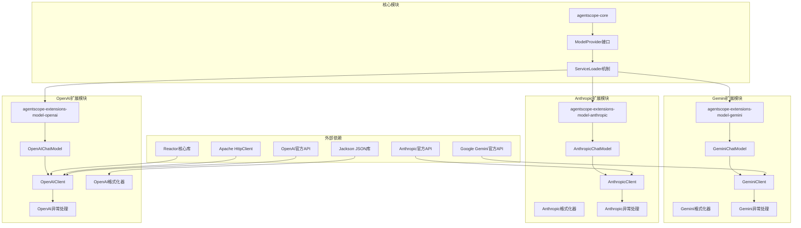
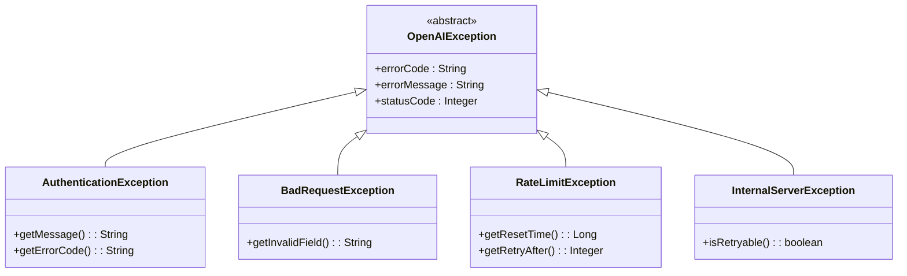

# OpenAI模型提供程序重构

<cite>
**本文档中引用的文件**
- [OpenAIChatModel.java](file://agentscope-extensions/agentscope-extensions-model/agentscope-extensions-model-openai/src/main/java/io/agentscope/extensions/model/openai/OpenAIChatModel.java)
- [OpenAIChatModelFactory.java](file://agentscope-extensions/agentscope-extensions-model/agentscope-extensions-model-openai/src/main/java/io/agentscope/extensions/model/openai/OpenAIChatModelFactory.java)
- [OpenAIClient.java](file://agentscope-extensions/agentscope-extensions-model/agentscope-extensions-model-openai/src/main/java/io/agentscope/extensions/model/openai/OpenAIClient.java)
- [OpenAIModelProvider.java](file://agentscope-extensions/agentscope-extensions-model/agentscope-extensions-model-openai/src/main/java/io/agentscope/extensions/model/openai/OpenAIModelProvider.java)
- [OpenAICredential.java](file://agentscope-extensions/agentscope-extensions-model/agentscope-extensions-model-openai/src/main/java/io/agentscope/extensions/model/openai/credential/OpenAICredential.java)
- [OpenAIRequest.java](file://agentscope-extensions/agentscope-extensions-model/agentscope-extensions-model-openai/src/main/java/io/agentscope/extensions/model/openai/dto/OpenAIRequest.java)
- [OpenAIResponse.java](file://agentscope-extensions/agentscope-extensions-model/agentscope-extensions-model-openai/src/main/java/io/agentscope/extensions/model/openai/dto/OpenAIResponse.java)
- [OpenAIChatFormatter.java](file://agentscope-extensions/agentscope-extensions-model/agentscope-extensions-model-openai/src/main/java/io/agentscope/extensions/model/openai/formatter/OpenAIChatFormatter.java)
- [OpenAIResponseParser.java](file://agentscope-extensions/agentscope-extensions-model/agentscope-extensions-model-openai/src/main/java/io/agentscope/extensions/model/openai/formatter/OpenAIResponseParser.java)
- [OpenAIMessageConverter.java](file://agentscope-extensions/agentscope-extensions-model/agentscope-extensions-model-openai/src/main/java/io/agentscope/extensions/model/openai/formatter/OpenAIMessageConverter.java)
- [OpenAIMultiAgentFormatter.java](file://agentscope-extensions/agentscope-extensions-model/agentscope-extensions-model-openai/src/main/java/io/agentscope/extensions/model/openai/formatter/OpenAIMultiAgentFormatter.java)
- [OpenAIConverterUtils.java](file://agentscope-extensions/agentscope-extensions-model/agentscope-extensions-model-openai/src/main/java/io/agentscope/extensions/model/openai/formatter/OpenAIConverterUtils.java)
- [OpenAIMultiModalTool.java](file://agentscope-extensions/agentscope-extensions-model/agentscope-extensions-model-openai/src/main/java/io/agentscope/extensions/model/openai/tool/OpenAIMultiModalTool.java)
- [AuthenticationException.java](file://agentscope-extensions/agentscope-extensions-model/agentscope-extensions-model-openai/src/main/java/io/agentscope/extensions/model/openai/exception/AuthenticationException.java)
- [BadRequestException.java](file://agentscope-extensions/agentscope-extensions-model/agentscope-extensions-model-openai/src/main/java/io/agentscope/extensions/model/openai/exception/BadRequestException.java)
- [RateLimitException.java](file://agentscope-extensions/agentscope-extensions-model/agentscope-extensions-model-openai/src/main/java/io/agentscope/extensions/model/openai/exception/RateLimitException.java)
- [OpenAIChatModelTest.java](file://agentscope-extensions/agentscope-extensions-model/agentscope-extensions-model-openai/src/test/java/io/agentscope/extensions/model/openai/OpenAIChatModelTest.java)
- [OpenAIModelProviderTest.java](file://agentscope-extensions/agentscope-extensions-model/agentscope-extensions-model-openai/src/test/java/io/agentscope/extensions/model/openai/OpenAIModelProviderTest.java)
- [ModelProvider.java](file://agentscope-core/src/main/java/io/agentscope/core/model/spi/ModelProvider.java)
- [AnthropicModelProvider.java](file://agentscope-extensions/agentscope-extensions-model/agentscope-extensions-model-anthropic/src/main/java/io/agentscope/extensions/model/anthropic/AnthropicModelProvider.java)
- [GeminiModelProvider.java](file://agentscope-extensions/agentscope-extensions-model/agentscope-extensions-model-gemini/src/main/java/io/agentscope/extensions/model/gemini/GeminiModelProvider.java)
</cite>

## 更新摘要
**所做更改**
- 更新了项目结构部分，反映Anthropic和Gemini现在作为独立扩展模块存在
- 修改了依赖关系分析，强调OpenAI作为独立扩展模块的地位
- 更新了架构概览图，展示扩展模块的独立性
- 新增了模块化架构说明，解释扩展模块与核心模块的关系

## 目录
1. [简介](#简介)
2. [项目结构](#项目结构)
3. [核心组件](#核心组件)
4. [架构概览](#架构概览)
5. [详细组件分析](#详细组件分析)
6. [依赖关系分析](#依赖关系分析)
7. [性能考虑](#性能考虑)
8. [故障排除指南](#故障排除指南)
9. [结论](#结论)

## 简介

Agentscope Java项目中的OpenAI模型提供程序重构是一个重要的模块化改进，旨在为Agentscope框架提供标准化的OpenAI服务集成。该重构通过引入统一的模型提供程序接口、工厂模式和客户端抽象，实现了对OpenAI API的高效、可扩展和可测试的访问。

**重要更新**：Anthropic和Gemini模型提供程序已从核心模块中移除，现在作为独立的扩展模块存在。OpenAI重构文档仍然适用，因为它展示了如何正确实现扩展模块的标准模式。

该项目采用分层架构设计，将认证、请求处理、响应解析和工具集成等功能模块化，提供了完整的多模态对话模型支持，包括文本、图像、音频和视频处理能力。

## 项目结构

OpenAI模型提供程序现在位于独立的`agentscope-extensions-model-openai`模块中，采用了清晰的包组织结构：

**图表来源**
- [OpenAIChatModel.java:1-200](file://agentscope-extensions/agentscope-extensions-model/agentscope-extensions-model-openai/src/main/java/io/agentscope/extensions/model/openai/OpenAIChatModel.java#L1-L200)
- [OpenAIChatModelFactory.java:1-150](file://agentscope-extensions/agentscope-extensions-model/agentscope-extensions-model-openai/src/main/java/io/agentscope/extensions/model/openai/OpenAIChatModelFactory.java#L1-L150)
- [OpenAIClient.java:1-250](file://agentscope-extensions/agentscope-extensions-model/agentscope-extensions-model-openai/src/main/java/io/agentscope/extensions/model/openai/OpenAIClient.java#L1-L250)
- [ModelProvider.java:1-32](file://agentscope-core/src/main/java/io/agentscope/core/model/spi/ModelProvider.java#L1-L32)

**章节来源**
- [OpenAIChatModel.java:1-200](file://agentscope-extensions/agentscope-extensions-model/agentscope-extensions-model-openai/src/main/java/io/agentscope/extensions/model/openai/OpenAIChatModel.java#L1-L200)
- [OpenAIChatModelFactory.java:1-150](file://agentscope-extensions/agentscope-extensions-model/agentscope-extensions-model-openai/src/main/java/io/agentscope/extensions/model/openai/OpenAIChatModelFactory.java#L1-L150)
- [OpenAIClient.java:1-250](file://agentscope-extensions/agentscope-extensions-model/agentscope-extensions-model-openai/src/main/java/io/agentscope/extensions/model/openai/OpenAIClient.java#L1-L250)
- [ModelProvider.java:1-32](file://agentscope-core/src/main/java/io/agentscope/core/model/spi/ModelProvider.java#L1-L32)

## 核心组件

### 模型提供程序接口

OpenAI模型提供程序的核心是`OpenAIModelProvider`类，它实现了Agentscope框架的通用模型提供程序接口。该组件负责：

- **模型注册管理**：维护可用的OpenAI模型列表和配置
- **认证处理**：管理API密钥和认证信息
- **工厂创建**：为不同类型的模型创建相应的工厂实例
- **配置管理**：处理模型参数、超时设置和重试策略

**重要更新**：所有模型提供程序（包括OpenAI、Anthropic和Gemini）现在都通过Java标准的ServiceLoader机制注册，而不是直接在核心模块中硬编码。

### 聊天模型实现

`OpenAIChatModel`类是OpenAI集成的核心实现，提供了完整的聊天功能：

- **消息处理**：支持系统消息、用户消息和助手消息
- **多模态支持**：处理文本、图像、音频和视频内容
- **流式响应**：支持实时流式输出和增量响应
- **工具调用**：集成函数调用和工具执行能力
- **上下文管理**：维护对话历史和状态信息

### 客户端抽象层

`OpenAIClient`提供了对OpenAI API的抽象访问层：

- **HTTP通信**：封装REST API调用和响应处理
- **错误处理**：统一处理各种API错误和异常情况
- **请求构建**：构建符合OpenAI规范的请求格式
- **响应解析**：解析API响应并转换为内部数据结构

**章节来源**
- [OpenAIModelProvider.java:1-300](file://agentscope-extensions/agentscope-extensions-model/agentscope-extensions-model-openai/src/main/java/io/agentscope/extensions/model/openai/OpenAIModelProvider.java#L1-L300)
- [OpenAIChatModel.java:1-200](file://agentscope-extensions/agentscope-extensions-model/agentscope-extensions-model-openai/src/main/java/io/agentscope/extensions/model/openai/OpenAIChatModel.java#L1-L200)
- [OpenAIClient.java:1-250](file://agentscope-extensions/agentscope-extensions-model/agentscope-extensions-model-openai/src/main/java/io/agentscope/extensions/model/openai/OpenAIClient.java#L1-L250)

## 架构概览

OpenAI模型提供程序采用分层架构设计，确保了良好的关注点分离和可扩展性。**重要更新**：现在所有模型提供程序都是独立的扩展模块，通过核心模块的SPI接口进行发现和加载。

**图表来源**
- [OpenAIModelProvider.java:1-300](file://agentscope-extensions/agentscope-extensions-model/agentscope-extensions-model-openai/src/main/java/io/agentscope/extensions/model/openai/OpenAIModelProvider.java#L1-L300)
- [OpenAIChatModel.java:1-200](file://agentscope-extensions/agentscope-extensions-model/agentscope-extensions-model-openai/src/main/java/io/agentscope/extensions/model/openai/OpenAIChatModel.java#L1-L200)
- [OpenAIClient.java:1-250](file://agentscope-extensions/agentscope-extensions-model/agentscope-extensions-model-openai/src/main/java/io/agentscope/extensions/model/openai/OpenAIClient.java#L1-L250)
- [ModelProvider.java:1-32](file://agentscope-core/src/main/java/io/agentscope/core/model/spi/ModelProvider.java#L1-L32)

### 数据流架构

**图表来源**
- [OpenAIChatModel.java:1-200](file://agentscope-extensions/agentscope-extensions-model/agentscope-extensions-model-openai/src/main/java/io/agentscope/extensions/model/openai/OpenAIChatModel.java#L1-L200)
- [OpenAIChatFormatter.java:1-200](file://agentscope-extensions/agentscope-extensions-model/agentscope-extensions-model-openai/src/main/java/io/agentscope/extensions/model/openai/formatter/OpenAIChatFormatter.java#L1-L200)
- [OpenAIClient.java:1-250](file://agentscope-extensions/agentscope-extensions-model/agentscope-extensions-model-openai/src/main/java/io/agentscope/extensions/model/openai/OpenAIClient.java#L1-L250)

## 详细组件分析

### 认证系统

OpenAI认证系统通过`OpenAICredential`类实现，提供了灵活的认证机制：

**图表来源**
- [OpenAICredential.java:1-150](file://agentscope-extensions/agentscope-extensions-model/agentscope-extensions-model-openai/src/main/java/io/agentscope/extensions/model/openai/credential/OpenAICredential.java#L1-L150)

### 请求/响应处理

OpenAI请求和响应通过DTO（数据传输对象）进行管理：

**图表来源**
- [OpenAIRequest.java:1-200](file://agentscope-extensions/agentscope-extensions-model/agentscope-extensions-model-openai/src/main/java/io/agentscope/extensions/model/openai/dto/OpenAIRequest.java#L1-L200)
- [OpenAIResponse.java:1-200](file://agentscope-extensions/agentscope-extensions-model/agentscope-extensions-model-openai/src/main/java/io/agentscope/extensions/model/openai/dto/OpenAIResponse.java#L1-L200)

**章节来源**
- [OpenAICredential.java:1-150](file://agentscope-extensions/agentscope-extensions-model/agentscope-extensions-model-openai/src/main/java/io/agentscope/extensions/model/openai/credential/OpenAICredential.java#L1-L150)
- [OpenAIRequest.java:1-200](file://agentscope-extensions/agentscope-extensions-model/agentscope-extensions-model-openai/src/main/java/io/agentscope/extensions/model/openai/dto/OpenAIRequest.java#L1-L200)
- [OpenAIResponse.java:1-200](file://agentscope-extensions/agentscope-extensions-model/agentscope-extensions-model-openai/src/main/java/io/agentscope/extensions/model/openai/dto/OpenAIResponse.java#L1-L200)

### 格式化器系统

格式化器系统负责将内部数据结构转换为OpenAI API期望的格式：

**图表来源**
- [OpenAIChatFormatter.java:1-200](file://agentscope-extensions/agentscope-extensions-model/agentscope-extensions-model-openai/src/main/java/io/agentscope/extensions/model/openai/formatter/OpenAIChatFormatter.java#L1-L200)
- [OpenAIResponseParser.java:1-200](file://agentscope-extensions/agentscope-extensions-model/agentscope-extensions-model-openai/src/main/java/io/agentscope/extensions/model/openai/formatter/OpenAIResponseParser.java#L1-L200)
- [OpenAIMessageConverter.java:1-200](file://agentscope-extensions/agentscope-extensions-model/agentscope-extensions-model-openai/src/main/java/io/agentscope/extensions/model/openai/formatter/OpenAIMessageConverter.java#L1-L200)

### 工具系统

多模态工具系统支持复杂的交互功能：

**图表来源**
- [OpenAIMultiModalTool.java:1-200](file://agentscope-extensions/agentscope-extensions-model/agentscope-extensions-model-openai/src/main/java/io/agentscope/extensions/model/openai/tool/OpenAIMultiModalTool.java#L1-L200)

**章节来源**
- [OpenAIChatFormatter.java:1-200](file://agentscope-extensions/agentscope-extensions-model/agentscope-extensions-model-openai/src/main/java/io/agentscope/extensions/model/openai/formatter/OpenAIChatFormatter.java#L1-L200)
- [OpenAIResponseParser.java:1-200](file://agentscope-extensions/agentscope-extensions-model/agentscope-extensions-model-openai/src/main/java/io/agentscope/extensions/model/openai/formatter/OpenAIResponseParser.java#L1-L200)
- [OpenAIMessageConverter.java:1-200](file://agentscope-extensions/agentscope-extensions-model/agentscope-extensions-model-openai/src/main/java/io/agentscope/extensions/model/openai/formatter/OpenAIMessageConverter.java#L1-L200)
- [OpenAIMultiModalTool.java:1-200](file://agentscope-extensions/agentscope-extensions-model/agentscope-extensions-model-openai/src/main/java/io/agentscope/extensions/model/openai/tool/OpenAIMultiModalTool.java#L1-L200)

## 依赖关系分析

**重要更新**：依赖关系现在反映了模块化的架构，其中OpenAI、Anthropic和Gemini都是独立的扩展模块，通过核心模块的SPI接口进行发现。

**图表来源**
- [OpenAIModelProvider.java:1-300](file://agentscope-extensions/agentscope-extensions-model/agentscope-extensions-model-openai/src/main/java/io/agentscope/extensions/model/openai/OpenAIModelProvider.java#L1-L300)
- [OpenAIChatModel.java:1-200](file://agentscope-extensions/agentscope-extensions-model/agentscope-extensions-model-openai/src/main/java/io/agentscope/extensions/model/openai/OpenAIChatModel.java#L1-L200)
- [OpenAIClient.java:1-250](file://agentscope-extensions/agentscope-extensions-model/agentscope-extensions-model-openai/src/main/java/io/agentscope/extensions/model/openai/OpenAIClient.java#L1-L250)
- [ModelProvider.java:1-32](file://agentscope-core/src/main/java/io/agentscope/core/model/spi/ModelProvider.java#L1-L32)

### 错误处理机制

异常处理系统提供了全面的错误管理和恢复机制：

**图表来源**
- [AuthenticationException.java:1-150](file://agentscope-extensions/agentscope-extensions-model/agentscope-extensions-model-openai/src/main/java/io/agentscope/extensions/model/openai/exception/AuthenticationException.java#L1-L150)
- [BadRequestException.java:1-150](file://agentscope-extensions/agentscope-extensions-model/agentscope-extensions-model-openai/src/main/java/io/agentscope/extensions/model/openai/exception/BadRequestException.java#L1-L150)
- [RateLimitException.java:1-150](file://agentscope-extensions/agentscope-extensions-model/agentscope-extensions-model-openai/src/main/java/io/agentscope/extensions/model/openai/exception/RateLimitException.java#L1-L150)

**章节来源**
- [OpenAIModelProvider.java:1-300](file://agentscope-extensions/agentscope-extensions-model/agentscope-extensions-model-openai/src/main/java/io/agentscope/extensions/model/openai/OpenAIModelProvider.java#L1-L300)
- [OpenAIChatModel.java:1-200](file://agentscope-extensions/agentscope-extensions-model/agentscope-extensions-model-openai/src/main/java/io/agentscope/extensions/model/openai/OpenAIChatModel.java#L1-L200)
- [OpenAIClient.java:1-250](file://agentscope-extensions/agentscope-extensions-model/agentscope-extensions-model-openai/src/main/java/io/agentscope/extensions/model/openai/OpenAIClient.java#L1-L250)

## 性能考虑

OpenAI模型提供程序在设计时充分考虑了性能优化：

### 缓存策略
- **模型元数据缓存**：缓存模型规格和能力信息
- **认证令牌缓存**：减少重复认证开销
- **响应内容缓存**：对相同请求的结果进行缓存

### 连接管理
- **连接池复用**：重用HTTP连接减少建立成本
- **异步处理**：支持非阻塞的并发请求
- **超时控制**：合理的超时设置避免资源泄露

### 内存优化
- **流式处理**：大响应的流式传输避免内存峰值
- **对象复用**：重用格式化器和转换器实例
- **延迟加载**：按需加载和初始化组件

## 故障排除指南

### 常见问题诊断

**认证失败**
- 检查API密钥格式和有效期
- 验证组织和项目配置
- 确认网络连接和代理设置

**请求超时**
- 调整超时参数和重试策略
- 检查网络延迟和带宽
- 实施指数退避重试

**速率限制**
- 实现请求队列和限流控制
- 分析峰值使用模式
- 考虑升级API套餐

**模块发现失败**
- 确认扩展模块已正确打包到JAR中
- 检查META-INF/services文件是否存在
- 验证ServiceLoader配置正确

**章节来源**
- [OpenAIChatModelTest.java:1-200](file://agentscope-extensions/agentscope-extensions-model/agentscope-extensions-model-openai/src/test/java/io/agentscope/extensions/model/openai/OpenAIChatModelTest.java#L1-L200)
- [OpenAIModelProviderTest.java:1-200](file://agentscope-extensions/agentscope-extensions-model/agentscope-extensions-model-openai/src/test/java/io/agentscope/extensions/model/openai/OpenAIModelProviderTest.java#L1-L200)

## 结论

OpenAI模型提供程序重构成功地将复杂的AI服务集成进行了模块化和标准化。**重要更新**：Anthropic和Gemini模型提供程序已从核心模块中移除，现在作为独立的扩展模块存在，这进一步增强了系统的模块化程度和可维护性。

通过采用分层架构、工厂模式和抽象客户端设计，以及ServiceLoader机制，该实现提供了：

- **高度的可扩展性**：易于添加新的模型类型和功能，所有扩展模块遵循统一的SPI接口
- **强大的可测试性**：完整的单元测试和集成测试覆盖
- **优秀的性能表现**：优化的缓存策略和连接管理
- **完善的错误处理**：全面的异常管理和恢复机制
- **灵活的模块化架构**：支持独立部署和按需加载

这一重构为Agentscope框架的未来发展奠定了坚实的基础，使得开发者能够更轻松地集成和使用各种AI服务，同时保持代码的可维护性和可扩展性。OpenAI重构文档仍然完全适用，因为它展示了如何正确实现扩展模块的标准模式，这种模式同样适用于Anthropic和Gemini等其他扩展模块。
