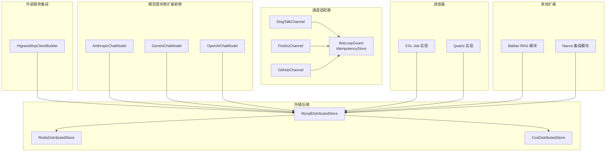
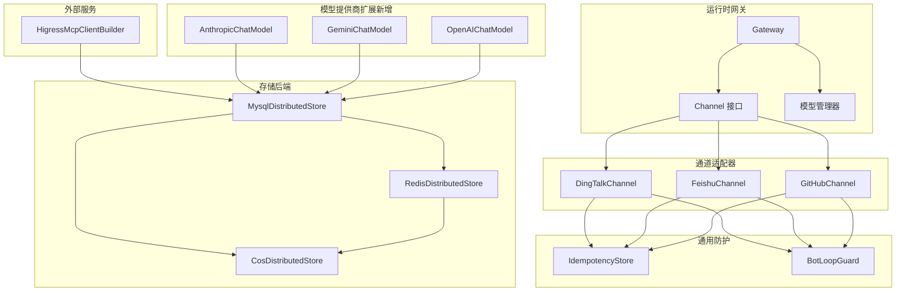
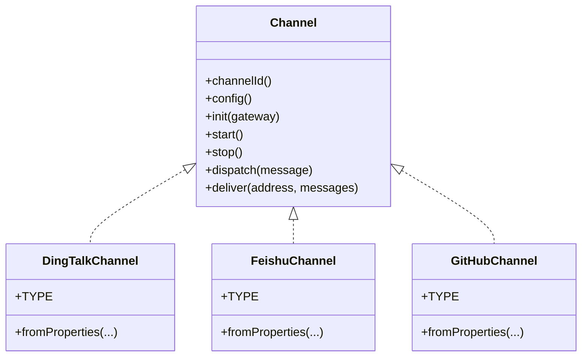
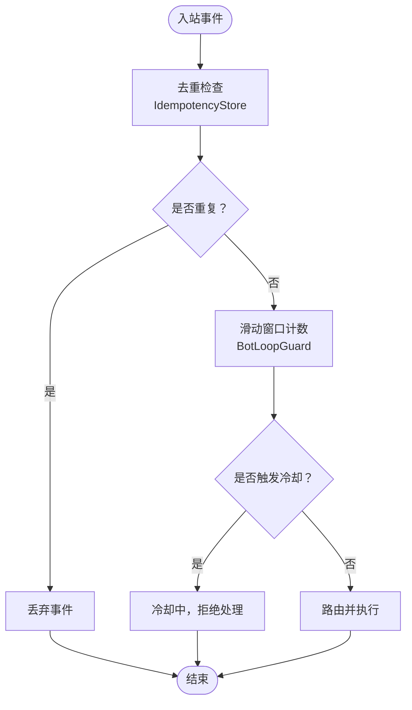
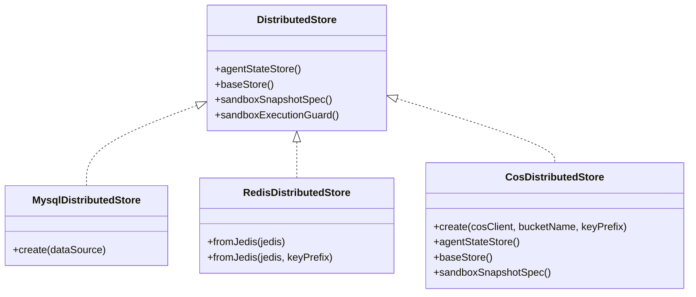
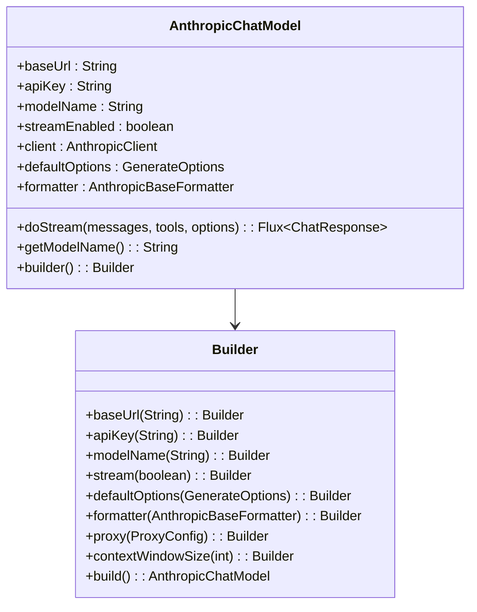
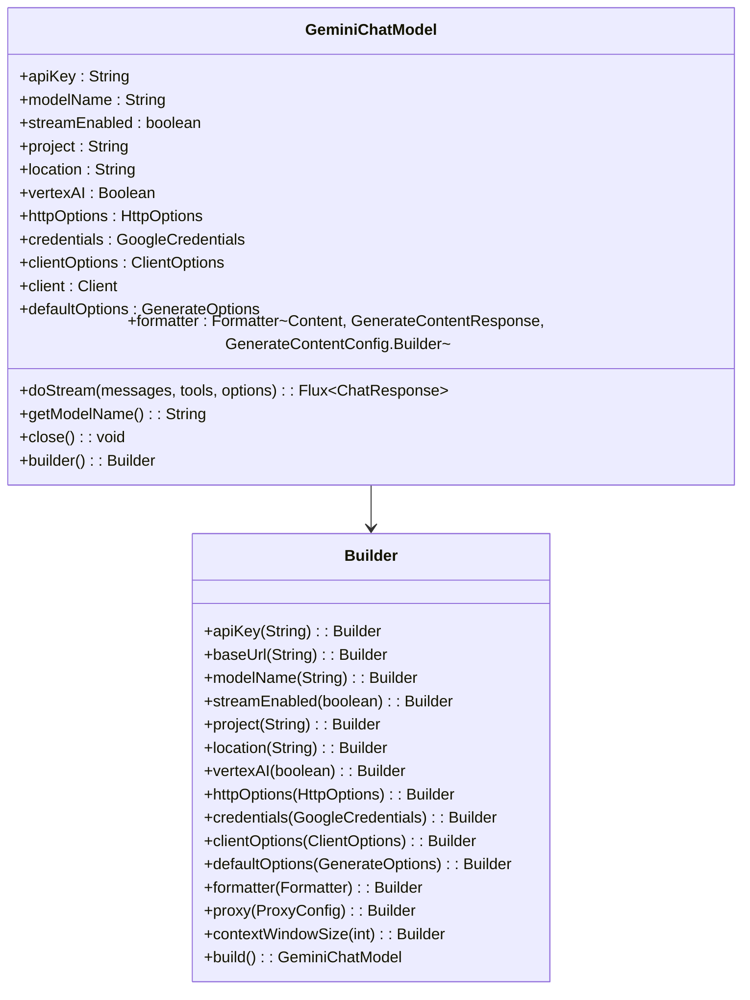
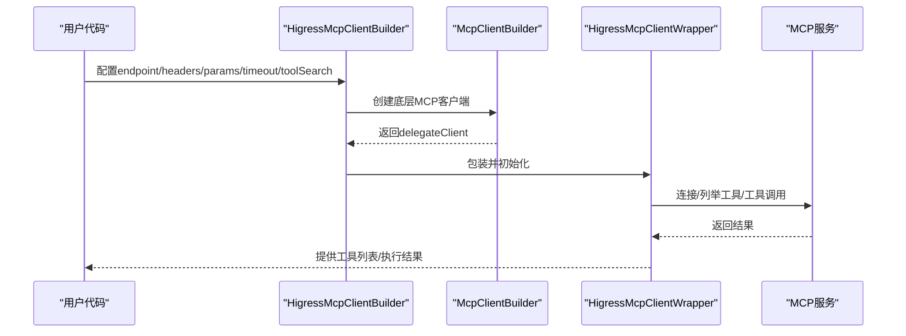
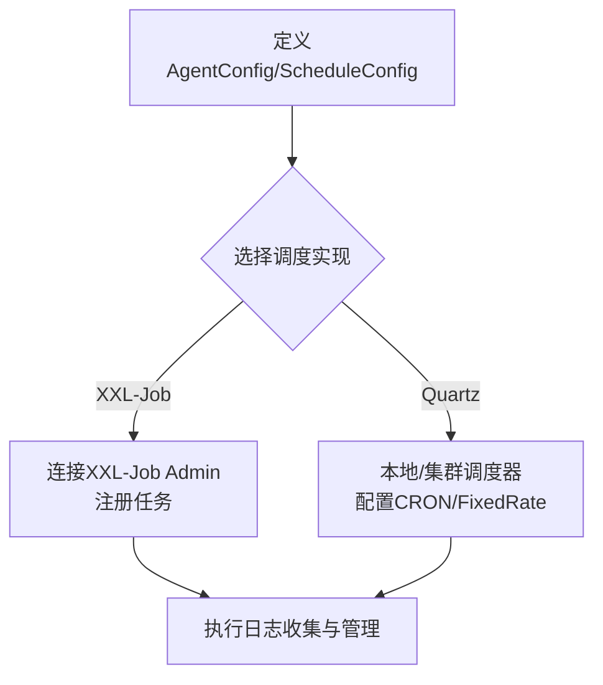
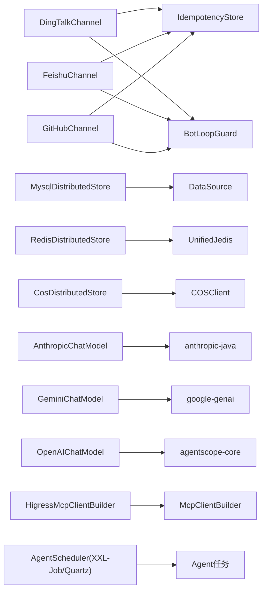

# 扩展模块

<cite>
**本文引用的文件**
- [BotLoopGuard.java](file://agentscope-extensions/agentscope-extensions-channel/agentscope-extensions-channel-common/src/main/java/io/agentscope/extensions/channel/common/BotLoopGuard.java)
- [IdempotencyStore.java](file://agentscope-extensions/agentscope-extensions-channel/agentscope-extensions-channel-common/src/main/java/io/agentscope/extensions/channel/common/IdempotencyStore.java)
- [DingTalkChannel.java](file://agentscope-extensions/agentscope-extensions-channel/agentscope-extensions-channel-dingtalk/src/main/java/io/agentscope/extensions/channel/dingtalk/DingTalkChannel.java)
- [FeishuChannel.java](file://agentscope-extensions/agentscope-extensions-channel/agentscope-extensions-channel-feishu/src/main/java/io/agentscope/extensions/channel/feishu/FeishuChannel.java)
- [GitHubChannel.java](file://agentscope-extensions/agentscope-extensions-channel/agentscope-extensions-channel-github/src/main/java/io/agentscope/extensions/channel/github/GitHubChannel.java)
- [HigressMcpClientBuilder.java](file://agentscope-extensions/agentscope-extensions-higress/src/main/java/io/agentscope/extensions/higress/HigressMcpClientBuilder.java)
- [MysqlDistributedStore.java](file://agentscope-extensions/agentscope-extensions-mysql/src/main/java/io/agentscope/extensions/mysql/MysqlDistributedStore.java)
- [RedisDistributedStore.java](file://agentscope-extensions/agentscope-extensions-redis/src/main/java/io/agentscope/extensions/redis/RedisDistributedStore.java)
- [CosAgentStateStore.java](file://agentscope-extensions/agentscope-extensions-cos/src/main/java/io/agentscope/extensions/cos/CosAgentStateStore.java)
- [CosBaseStore.java](file://agentscope-extensions/agentscope-extensions-cos/src/main/java/io/agentscope/extensions/cos/CosBaseStore.java)
- [CosDistributedStore.java](file://agentscope-extensions/agentscope-extensions-cos/src/main/java/io/agentscope/extensions/cos/CosDistributedStore.java)
- [CosRemoteSnapshotClient.java](file://agentscope-extensions/agentscope-extensions-cos/src/main/java/io/agentscope/extensions/cos/CosRemoteSnapshotClient.java)
- [CosSnapshotSpec.java](file://agentscope-extensions/agentscope-extensions-cos/src/main/java/io/agentscope/extensions/cos/CosSnapshotSpec.java)
- [AnthropicChatModel.java](file://agentscope-extensions/agentscope-extensions-model/agentscope-extensions-model-anthropic/src/main/java/io/agentscope/extensions/model/anthropic/AnthropicChatModel.java)
- [GeminiChatModel.java](file://agentscope-extensions/agentscope-extensions-model/agentscope-extensions-model-gemini/src/main/java/io/agentscope/extensions/model/gemini/GeminiChatModel.java)
- [README.md（调度器）](file://agentscope-extensions/agentscope-extensions-scheduler/README.md)
- [pom.xml（Bailian RAG）](file://agentscope-extensions/agentscope-extensions-rag/agentscope-extensions-rag-bailian/pom.xml)
- [pom.xml（Nacos）](file://agentscope-extensions/agentscope-extensions-nacos/pom.xml)
- [pom.xml（COS）](file://agentscope-extensions/agentscope-extensions-cos/pom.xml)
- [pom.xml（模型扩展）](file://agentscope-extensions/agentscope-extensions-model/pom.xml)
- [pom.xml（Anthropic）](file://agentscope-extensions/agentscope-extensions-model/agentscope-extensions-model-anthropic/pom.xml)
- [pom.xml（Gemini）](file://agentscope-extensions/agentscope-extensions-model/agentscope-extensions-model-gemini/pom.xml)
- [pom.xml（OpenAI）](file://agentscope-extensions/agentscope-extensions-model/agentscope-extensions-model-openai/pom.xml)
- [agentscope-dependencies-bom/pom.xml](file://agentscope-dependencies-bom/pom.xml)
- [agentscope-bom/pom.xml](file://agentscope-distribution/agentscope-bom/pom.xml)
</cite>

## 更新摘要
**变更内容**
- 新增 Anthropic 和 Gemini 扩展模块，提供对 Claude 和 Gemini 模型的官方 SDK 集成
- 更新模型扩展模块的依赖关系管理，包含 Anthropic 和 Gemini 的 SDK 版本
- 扩展模型提供商生态系统，支持更多主流大模型服务
- 更新依赖管理，确保新模块与现有生态系统的兼容性

## 目录
1. [简介](#简介)
2. [项目结构](#项目结构)
3. [核心组件](#核心组件)
4. [架构总览](#架构总览)
5. [详细组件分析](#详细组件分析)
6. [依赖关系分析](#依赖关系分析)
7. [性能考量](#性能考量)
8. [故障排除指南](#故障排除指南)
9. [结论](#结论)
10. [附录](#附录)

## 简介
本文件面向AgentScope扩展模块的技术文档，系统化介绍各类扩展能力：通道适配器（钉钉、飞书、GitHub等）、存储后端（MySQL、Redis分布式存储、腾讯云COS）、外部服务集成（Higress MCP客户端）、调度器（XXL-Job、Quartz）、RAG与Nacos集成，以及新增的模型提供商扩展（Anthropic、Gemini）。文档覆盖扩展机制、配置项、性能与兼容性、最佳实践、部署与监控、故障排除以及完整集成示例与企业级部署建议。

## 项目结构
扩展模块采用按功能域分层的多模块组织方式，核心扩展包括：
- 通道适配器：统一抽象Channel接口，对接不同IM平台或Webhook来源
- 存储后端：基于JDBC/Redis/COS的分布式状态、文件系统KV与沙箱快照
- 外部服务集成：通过MCP协议对接Higress网关工具集
- 调度器：支持XXL-Job与Quartz的可插拔调度实现
- **模型提供商扩展（新增）**：支持Anthropic Claude和Google Gemini的官方SDK集成
- 其他：RAG（Bailian等）、Nacos配置中心集成等

**图表来源**
- [DingTalkChannel.java:47-108](file://agentscope-extensions/agentscope-extensions-channel/agentscope-extensions-channel-dingtalk/src/main/java/io/agentscope/extensions/channel/dingtalk/DingTalkChannel.java#L47-L108)
- [FeishuChannel.java:46-113](file://agentscope-extensions/agentscope-extensions-channel/agentscope-extensions-channel-feishu/src/main/java/io/agentscope/extensions/channel/feishu/FeishuChannel.java#L46-L113)
- [GitHubChannel.java:40-108](file://agentscope-extensions/agentscope-extensions-channel/agentscope-extensions-channel-github/src/main/java/io/agentscope/extensions/channel/github/GitHubChannel.java#L40-L108)
- [BotLoopGuard.java:29-95](file://agentscope-extensions/agentscope-extensions-channel/agentscope-extensions-channel-common/src/main/java/io/agentscope/extensions/channel/common/BotLoopGuard.java#L29-L95)
- [IdempotencyStore.java:30-96](file://agentscope-extensions/agentscope-extensions-channel/agentscope-extensions-channel-common/src/main/java/io/agentscope/extensions/channel/common/IdempotencyStore.java#L30-L96)
- [MysqlDistributedStore.java:54-92](file://agentscope-extensions/agentscope-extensions-mysql/src/main/java/io/agentscope/extensions/mysql/MysqlDistributedStore.java#L54-L92)
- [RedisDistributedStore.java:56-110](file://agentscope-extensions/agentscope-extensions-redis/src/main/java/io/agentscope/extensions/redis/RedisDistributedStore.java#L56-L110)
- [CosDistributedStore.java:40-88](file://agentscope-extensions/agentscope-extensions-cos/src/main/java/io/agentscope/extensions/cos/CosDistributedStore.java#L40-L88)
- [AnthropicChatModel.java:62-122](file://agentscope-extensions/agentscope-extensions-model/agentscope-extensions-model-anthropic/src/main/java/io/agentscope/extensions/model/anthropic/AnthropicChatModel.java#L62-L122)
- [GeminiChatModel.java:63-157](file://agentscope-extensions/agentscope-extensions-model/agentscope-extensions-model-gemini/src/main/java/io/agentscope/extensions/model/gemini/GeminiChatModel.java#L63-L157)
- [HigressMcpClientBuilder.java:69-450](file://agentscope-extensions/agentscope-extensions-higress/src/main/java/io/agentscope/extensions/higress/HigressMcpClientBuilder.java#L69-L450)
- [README.md（调度器）:1-202](file://agentscope-extensions/agentscope-extensions-scheduler/README.md#L1-L202)
- [pom.xml（Bailian RAG）:18-48](file://agentscope-extensions/agentscope-extensions-rag/agentscope-extensions-rag-bailian/pom.xml#L18-L48)
- [pom.xml（Nacos）:18-41](file://agentscope-extensions/agentscope-extensions-nacos/pom.xml#L18-L41)

**章节来源**
- [DingTalkChannel.java:1-250](file://agentscope-extensions/agentscope-extensions-channel/agentscope-extensions-channel-dingtalk/src/main/java/io/agentscope/extensions/channel/dingtalk/DingTalkChannel.java#L1-L250)
- [FeishuChannel.java:1-220](file://agentscope-extensions/agentscope-extensions-channel/agentscope-extensions-channel-feishu/src/main/java/io/agentscope/extensions/channel/feishu/FeishuChannel.java#L1-L220)
- [GitHubChannel.java:1-221](file://agentscope-extensions/agentscope-extensions-channel/agentscope-extensions-channel-github/src/main/java/io/agentscope/extensions/channel/github/GitHubChannel.java#L1-L221)
- [BotLoopGuard.java:1-95](file://agentscope-extensions/agentscope-extensions-channel/agentscope-extensions-channel-common/src/main/java/io/agentscope/extensions/channel/common/BotLoopGuard.java#L1-L95)
- [IdempotencyStore.java:1-96](file://agentscope-extensions/agentscope-extensions-channel/agentscope-extensions-channel-common/src/main/java/io/agentscope/extensions/channel/common/IdempotencyStore.java#L1-L96)
- [MysqlDistributedStore.java:1-92](file://agentscope-extensions/agentscope-extensions-mysql/src/main/java/io/agentscope/extensions/mysql/MysqlDistributedStore.java#L1-L92)
- [RedisDistributedStore.java:1-110](file://agentscope-extensions/agentscope-extensions-redis/src/main/java/io/agentscope/extensions/redis/RedisDistributedStore.java#L1-L110)
- [CosAgentStateStore.java:1-377](file://agentscope-extensions/agentscope-extensions-cos/src/main/java/io/agentscope/extensions/cos/CosAgentStateStore.java#L1-L377)
- [CosBaseStore.java:1-356](file://agentscope-extensions/agentscope-extensions-cos/src/main/java/io/agentscope/extensions/cos/CosBaseStore.java#L1-L356)
- [CosDistributedStore.java:1-88](file://agentscope-extensions/agentscope-extensions-cos/src/main/java/io/agentscope/extensions/cos/CosDistributedStore.java#L1-L88)
- [CosRemoteSnapshotClient.java:1-117](file://agentscope-extensions/agentscope-extensions-cos/src/main/java/io/agentscope/extensions/cos/CosRemoteSnapshotClient.java#L1-L117)
- [CosSnapshotSpec.java:1-38](file://agentscope-extensions/agentscope-extensions-cos/src/main/java/io/agentscope/extensions/cos/CosSnapshotSpec.java#L1-L38)
- [AnthropicChatModel.java:1-369](file://agentscope-extensions/agentscope-extensions-model/agentscope-extensions-model-anthropic/src/main/java/io/agentscope/extensions/model/anthropic/AnthropicChatModel.java#L1-L369)
- [GeminiChatModel.java:1-641](file://agentscope-extensions/agentscope-extensions-model/agentscope-extensions-model-gemini/src/main/java/io/agentscope/extensions/model/gemini/GeminiChatModel.java#L1-L641)
- [HigressMcpClientBuilder.java:1-450](file://agentscope-extensions/agentscope-extensions-higress/src/main/java/io/agentscope/extensions/higress/HigressMcpClientBuilder.java#L1-L450)
- [README.md（调度器）:1-202](file://agentscope-extensions/agentscope-extensions-scheduler/README.md#L1-L202)
- [pom.xml（Bailian RAG）:1-48](file://agentscope-extensions/agentscope-extensions-rag/agentscope-extensions-rag-bailian/pom.xml#L1-L48)
- [pom.xml（Nacos）:1-41](file://agentscope-extensions/agentscope-extensions-nacos/pom.xml#L1-L41)
- [pom.xml（COS）:1-55](file://agentscope-extensions/agentscope-extensions-cos/pom.xml#L1-L55)
- [pom.xml（模型扩展）:1-41](file://agentscope-extensions/agentscope-extensions-model/pom.xml#L1-L41)
- [pom.xml（Anthropic）:1-69](file://agentscope-extensions/agentscope-extensions-model/agentscope-extensions-model-anthropic/pom.xml#L1-L69)
- [pom.xml（Gemini）:1-69](file://agentscope-extensions/agentscope-extensions-model/agentscope-extensions-model-gemini/pom.xml#L1-L69)
- [pom.xml（OpenAI）:1-56](file://agentscope-extensions/agentscope-extensions-model/agentscope-extensions-model-openai/pom.xml#L1-L56)

## 核心组件
- 通道适配器（Channel）
  - 统一抽象：接收入站消息、路由到Agent、发送出站消息
  - 平台适配：钉钉（WebSocket流）、飞书（回调+加密）、GitHub（Webhook签名验证）
  - 通用防护：去重（IdempotencyStore）、防环（BotLoopGuard）
- 存储后端（DistributedStore）
  - MySQL：JDBC状态、文件系统KV、沙箱快照、分布式锁
  - Redis：键空间隔离、会话/存储/快照/锁
  - **COS（新增）**：基于腾讯云对象存储的状态、文件系统KV、快照存储，提供生产级云端存储解决方案
- **模型提供商扩展（新增）**
  - **AnthropicChatModel**：基于Anthropic官方Java SDK的Claude模型集成，支持流式和非流式响应、工具调用、代理配置
  - **GeminiChatModel**：基于Google GenAI官方Java SDK的Gemini模型集成，支持流式/非流式、工具调用、多模态、Vertex AI集成
  - **OpenAIChatModel**：基于HTTP API的OpenAI兼容模型支持，提供多提供商格式化器
- 外部服务集成（MCP/Higress）
  - HigressMcpClientBuilder：SSE/StreamableHTTP传输、认证头、超时、工具检索
- 调度器（AgentScheduler）
  - 支持XXL-Job（分布式）与Quartz（本地/集群），统一任务生命周期管理
- 其他扩展
  - Bailian RAG：接入阿里百炼知识库SDK
  - Nacos：A2A、Prompt、Skill配置中心集成

**章节来源**
- [DingTalkChannel.java:47-108](file://agentscope-extensions/agentscope-extensions-channel/agentscope-extensions-channel-dingtalk/src/main/java/io/agentscope/extensions/channel/dingtalk/DingTalkChannel.java#L47-L108)
- [FeishuChannel.java:46-113](file://agentscope-extensions/agentscope-extensions-channel/agentscope-extensions-channel-feishu/src/main/java/io/agentscope/extensions/channel/feishu/FeishuChannel.java#L46-L113)
- [GitHubChannel.java:40-108](file://agentscope-extensions/agentscope-extensions-channel/agentscope-extensions-channel-github/src/main/java/io/agentscope/extensions/channel/github/GitHubChannel.java#L40-L108)
- [BotLoopGuard.java:29-95](file://agentscope-extensions/agentscope-extensions-channel/agentscope-extensions-channel-common/src/main/java/io/agentscope/extensions/channel/common/BotLoopGuard.java#L29-L95)
- [IdempotencyStore.java:30-96](file://agentscope-extensions/agentscope-extensions-channel/agentscope-extensions-channel-common/src/main/java/io/agentscope/extensions/channel/common/IdempotencyStore.java#L30-L96)
- [MysqlDistributedStore.java:54-92](file://agentscope-extensions/agentscope-extensions-mysql/src/main/java/io/agentscope/extensions/mysql/MysqlDistributedStore.java#L54-L92)
- [RedisDistributedStore.java:56-110](file://agentscope-extensions/agentscope-extensions-redis/src/main/java/io/agentscope/extensions/redis/RedisDistributedStore.java#L56-L110)
- [CosAgentStateStore.java:44-70](file://agentscope-extensions/agentscope-extensions-cos/src/main/java/io/agentscope/extensions/cos/CosAgentStateStore.java#L44-L70)
- [CosBaseStore.java:42-67](file://agentscope-extensions/agentscope-extensions-cos/src/main/java/io/agentscope/extensions/cos/CosBaseStore.java#L42-L67)
- [CosDistributedStore.java:25-39](file://agentscope-extensions/agentscope-extensions-cos/src/main/java/io/agentscope/extensions/cos/CosDistributedStore.java#L25-L39)
- [AnthropicChatModel.java:62-122](file://agentscope-extensions/agentscope-extensions-model/agentscope-extensions-model-anthropic/src/main/java/io/agentscope/extensions/model/anthropic/AnthropicChatModel.java#L62-L122)
- [GeminiChatModel.java:63-157](file://agentscope-extensions/agentscope-extensions-model/agentscope-extensions-model-gemini/src/main/java/io/agentscope/extensions/model/gemini/GeminiChatModel.java#L63-L157)
- [HigressMcpClientBuilder.java:69-450](file://agentscope-extensions/agentscope-extensions-higress/src/main/java/io/agentscope/extensions/higress/HigressMcpClientBuilder.java#L69-L450)
- [README.md（调度器）:1-202](file://agentscope-extensions/agentscope-extensions-scheduler/README.md#L1-L202)
- [pom.xml（Bailian RAG）:18-48](file://agentscope-extensions/agentscope-extensions-rag/agentscope-extensions-rag-bailian/pom.xml#L18-L48)
- [pom.xml（Nacos）:18-41](file://agentscope-extensions/agentscope-extensions-nacos/pom.xml#L18-L41)

## 架构总览
下图展示扩展模块在Agent运行时中的位置与交互关系：通道适配器负责入站/出站消息编排；存储后端提供分布式状态与文件系统；外部服务通过MCP对接Higress工具；**新增的模型提供商扩展**提供对Anthropic和Gemini等大模型的直接集成；调度器驱动Agent周期性执行；其他扩展模块提供特定能力。

**图表来源**
- [DingTalkChannel.java:47-108](file://agentscope-extensions/agentscope-extensions-channel/agentscope-extensions-channel-dingtalk/src/main/java/io/agentscope/extensions/channel/dingtalk/DingTalkChannel.java#L47-L108)
- [FeishuChannel.java:46-113](file://agentscope-extensions/agentscope-extensions-channel/agentscope-extensions-channel-feishu/src/main/java/io/agentscope/extensions/channel/feishu/FeishuChannel.java#L46-L113)
- [GitHubChannel.java:40-108](file://agentscope-extensions/agentscope-extensions-channel/agentscope-extensions-channel-github/src/main/java/io/agentscope/extensions/channel/github/GitHubChannel.java#L40-L108)
- [BotLoopGuard.java:29-95](file://agentscope-extensions/agentscope-extensions-channel/agentscope-extensions-channel-common/src/main/java/io/agentscope/extensions/channel/common/BotLoopGuard.java#L29-L95)
- [IdempotencyStore.java:30-96](file://agentscope-extensions/agentscope-extensions-channel/agentscope-extensions-channel-common/src/main/java/io/agentscope/extensions/channel/common/IdempotencyStore.java#L30-L96)
- [MysqlDistributedStore.java:54-92](file://agentscope-extensions/agentscope-extensions-mysql/src/main/java/io/agentscope/extensions/mysql/MysqlDistributedStore.java#L54-L92)
- [RedisDistributedStore.java:56-110](file://agentscope-extensions/agentscope-extensions-redis/src/main/java/io/agentscope/extensions/redis/RedisDistributedStore.java#L56-L110)
- [CosDistributedStore.java:40-88](file://agentscope-extensions/agentscope-extensions-cos/src/main/java/io/agentscope/extensions/cos/CosDistributedStore.java#L40-L88)
- [AnthropicChatModel.java:62-122](file://agentscope-extensions/agentscope-extensions-model/agentscope-extensions-model-anthropic/src/main/java/io/agentscope/extensions/model/anthropic/AnthropicChatModel.java#L62-L122)
- [GeminiChatModel.java:63-157](file://agentscope-extensions/agentscope-extensions-model/agentscope-extensions-model-gemini/src/main/java/io/agentscope/extensions/model/gemini/GeminiChatModel.java#L63-L157)
- [HigressMcpClientBuilder.java:69-450](file://agentscope-extensions/agentscope-extensions-higress/src/main/java/io/agentscope/extensions/higress/HigressMcpClientBuilder.java#L69-L450)

## 详细组件分析

### 通道适配器：钉钉、飞书、GitHub
- 设计要点
  - 统一Channel接口：生命周期（init/start/stop）、消息分发dispatch、出站投递deliver
  - 工厂构建：fromProperties注入属性，构造TokenProvider、OutboundClient、Mapper、IdempotencyStore、BotLoopGuard、ChannelRouter
  - 安全与可靠性：入站消息去重（按消息ID）、防机器人循环（滑动窗口+冷却）
- 钉钉（DingTalk）
  - 流式连接：WebSocket持久连接，回调解析payload，映射为入站消息，路由后交由Gateway执行
  - 出站：批量OpenAPI发送
- 飞书（Feishu）
  - 回调+解密：Spring控制器处理URL校验与事件订阅，可选加密解密，去重与防环，注册到通道注册表
  - 出站：tenant_access_token鉴权，调用IM消息接口
- GitHub
  - Webhook签名验证：对请求体进行签名校验，避免伪造
  - 出站：以评论形式回复PR/Closed Issues

**图表来源**
- [DingTalkChannel.java:47-108](file://agentscope-extensions/agentscope-extensions-channel/agentscope-extensions-channel-dingtalk/src/main/java/io/agentscope/extensions/channel/dingtalk/DingTalkChannel.java#L47-L108)
- [FeishuChannel.java:46-113](file://agentscope-extensions/agentscope-extensions-channel/agentscope-extensions-channel-feishu/src/main/java/io/agentscope/extensions/channel/feishu/FeishuChannel.java#L46-L113)
- [GitHubChannel.java:40-108](file://agentscope-extensions/agentscope-extensions-channel/agentscope-extensions-channel-github/src/main/java/io/agentscope/extensions/channel/github/GitHubChannel.java#L40-L108)

**章节来源**
- [DingTalkChannel.java:1-250](file://agentscope-extensions/agentscope-extensions-channel/agentscope-extensions-channel-dingtalk/src/main/java/io/agentscope/extensions/channel/dingtalk/DingTalkChannel.java#L1-L250)
- [FeishuChannel.java:1-220](file://agentscope-extensions/agentscope-extensions-channel/agentscope-extensions-channel-feishu/src/main/java/io/agentscope/extensions/channel/feishu/FeishuChannel.java#L1-L220)
- [GitHubChannel.java:1-221](file://agentscope-extensions/agentscope-extensions-channel/agentscope-extensions-channel-github/src/main/java/io/agentscope/extensions/channel/github/GitHubChannel.java#L1-L221)

### 通用防护：去重与防环
- 去重（IdempotencyStore）
  - 以消息键为维度记录首次可见时间，TTL过期与容量上限淘汰，保证Webhook重复事件不被二次处理
- 防环（BotLoopGuard）
  - 按对端键维护滑动窗口计数，超过阈值进入冷却，防止机器人互相触发无限回路

**图表来源**
- [IdempotencyStore.java:30-96](file://agentscope-extensions/agentscope-extensions-channel/agentscope-extensions-channel-common/src/main/java/io/agentscope/extensions/channel/common/IdempotencyStore.java#L30-L96)
- [BotLoopGuard.java:29-95](file://agentscope-extensions/agentscope-extensions-channel/agentscope-extensions-channel-common/src/main/java/io/agentscope/extensions/channel/common/BotLoopGuard.java#L29-L95)

**章节来源**
- [IdempotencyStore.java:1-96](file://agentscope-extensions/agentscope-extensions-channel/agentscope-extensions-channel-common/src/main/java/io/agentscope/extensions/channel/common/IdempotencyStore.java#L1-L96)
- [BotLoopGuard.java:1-95](file://agentscope-extensions/agentscope-extensions-channel/agentscope-extensions-channel-common/src/main/java/io/agentscope/extensions/channel/common/BotLoopGuard.java#L1-L95)

### 存储后端：MySQL、Redis与COS
- MySQL（JDBC）
  - 分布式状态：MysqlAgentStateStore
  - 文件系统KV：JdbcStore（自动建表）
  - 沙箱快照：JdbcSnapshotSpec（BLOB）
  - 分布式锁：JdbcSandboxExecutionGuard（GET_LOCK）
- Redis
  - 键前缀隔离，会话/存储/快照/锁分别配置
  - 适合高并发、低延迟场景
- **COS（新增）**
  - **CosAgentStateStore**：基于COS的对象存储状态管理，支持单个状态与列表状态的增量写入优化
  - **CosBaseStore**：远程文件系统存储，支持命名空间隔离、版本控制和条件更新
  - **CosDistributedStore**：统一的分布式存储工厂，提供状态存储、基础存储和快照存储的一致性配置
  - **CosRemoteSnapshotClient**：快照上传下载客户端，支持流式传输和存在性检查
  - **CosSnapshotSpec**：快照存储规范，封装远程快照客户端

**图表来源**
- [MysqlDistributedStore.java:54-92](file://agentscope-extensions/agentscope-extensions-mysql/src/main/java/io/agentscope/extensions/mysql/MysqlDistributedStore.java#L54-L92)
- [RedisDistributedStore.java:56-110](file://agentscope-extensions/agentscope-extensions-redis/src/main/java/io/agentscope/extensions/redis/RedisDistributedStore.java#L56-L110)
- [CosDistributedStore.java:40-88](file://agentscope-extensions/agentscope-extensions-cos/src/main/java/io/agentscope/extensions/cos/CosDistributedStore.java#L40-L88)

**章节来源**
- [MysqlDistributedStore.java:1-92](file://agentscope-extensions/agentscope-extensions-mysql/src/main/java/io/agentscope/extensions/mysql/MysqlDistributedStore.java#L1-L92)
- [RedisDistributedStore.java:1-110](file://agentscope-extensions/agentscope-extensions-redis/src/main/java/io/agentscope/extensions/redis/RedisDistributedStore.java#L1-L110)
- [CosAgentStateStore.java:1-377](file://agentscope-extensions/agentscope-extensions-cos/src/main/java/io/agentscope/extensions/cos/CosAgentStateStore.java#L1-L377)
- [CosBaseStore.java:1-356](file://agentscope-extensions/agentscope-extensions-cos/src/main/java/io/agentscope/extensions/cos/CosBaseStore.java#L1-L356)
- [CosDistributedStore.java:1-88](file://agentscope-extensions/agentscope-extensions-cos/src/main/java/io/agentscope/extensions/cos/CosDistributedStore.java#L1-L88)
- [CosRemoteSnapshotClient.java:1-117](file://agentscope-extensions/agentscope-extensions-cos/src/main/java/io/agentscope/extensions/cos/CosRemoteSnapshotClient.java#L1-L117)
- [CosSnapshotSpec.java:1-38](file://agentscope-extensions/agentscope-extensions-cos/src/main/java/io/agentscope/extensions/cos/CosSnapshotSpec.java#L1-L38)

### 模型提供商扩展：Anthropic与Gemini（新增）

#### AnthropicChatModel
- **架构设计**
  - 基于Anthropic官方Java SDK的完整集成
  - 支持Claude系列模型（如claude-3-*, claude-sonnet-*等）
  - 完整的流式和非流式响应支持
  - 工具调用和思维模式（extended reasoning）支持
- **核心特性**
  - 流式API调用：通过Reactor响应式编程模型
  - 非流式API调用：基于异步CompletableFuture
  - 代理配置支持：通过ProxyConfig进行网络代理设置
  - 上下文窗口管理：自动识别和应用模型上下文限制
  - 错误处理：统一的ModelException异常体系
- **配置选项**
  - 基础配置：baseUrl、apiKey、modelName、streamEnabled
  - 默认选项：defaultOptions（超时、重试、温度等）
  - 自定义格式化器：formatter（消息格式转换）
  - 代理设置：proxyConfig（HTTP/SOCKS代理支持）

**图表来源**
- [AnthropicChatModel.java:62-122](file://agentscope-extensions/agentscope-extensions-model/agentscope-extensions-model-anthropic/src/main/java/io/agentscope/extensions/model/anthropic/AnthropicChatModel.java#L62-L122)
- [AnthropicChatModel.java:249-367](file://agentscope-extensions/agentscope-extensions-model/agentscope-extensions-model-anthropic/src/main/java/io/agentscope/extensions/model/anthropic/AnthropicChatModel.java#L249-L367)

#### GeminiChatModel
- **架构设计**
  - 基于Google GenAI官方Java SDK的完整集成
  - 支持Gemini 1.5、2.0、2.5等多个版本模型
  - 流式和非流式响应支持
  - 多模态输入（文本、图像、音频、视频）
  - 多代理对话支持和历史合并
- **核心特性**
  - Gemini API和Vertex AI双重支持
  - 完整的工具调用和函数调用支持
  - 多代理对话的历史合并和上下文管理
  - 代理配置：智能代理设置合并逻辑
  - 错误处理：详细的异常信息和日志记录
- **配置选项**
  - 基础配置：apiKey、modelName、streamEnabled
  - Vertex AI配置：project、location、vertexAI
  - HTTP选项：httpOptions（自定义端点、超时等）
  - 认证配置：GoogleCredentials（服务账号认证）
  - 客户端选项：ClientOptions（连接池、代理等）
  - 默认选项：defaultOptions（生成参数）

**图表来源**
- [GeminiChatModel.java:63-157](file://agentscope-extensions/agentscope-extensions-model/agentscope-extensions-model-gemini/src/main/java/io/agentscope/extensions/model/gemini/GeminiChatModel.java#L63-L157)
- [GeminiChatModel.java:351-640](file://agentscope-extensions/agentscope-extensions-model/agentscope-extensions-model-gemini/src/main/java/io/agentscope/extensions/model/gemini/GeminiChatModel.java#L351-L640)

**章节来源**
- [AnthropicChatModel.java:1-369](file://agentscope-extensions/agentscope-extensions-model/agentscope-extensions-model-anthropic/src/main/java/io/agentscope/extensions/model/anthropic/AnthropicChatModel.java#L1-L369)
- [GeminiChatModel.java:1-641](file://agentscope-extensions/agentscope-extensions-model/agentscope-extensions-model-gemini/src/main/java/io/agentscope/extensions/model/gemini/GeminiChatModel.java#L1-L641)

### 外部服务集成：Higress MCP客户端
- 功能
  - SSE/StreamableHTTP两种传输
  - 请求头与查询参数透传
  - 超时控制与初始化超时
  - 可选工具检索（语义搜索）
- 使用模式
  - 同步/异步构建，内部委托agentscope-core的McpClientBuilder

**图表来源**
- [HigressMcpClientBuilder.java:69-450](file://agentscope-extensions/agentscope-extensions-higress/src/main/java/io/agentscope/extensions/higress/HigressMcpClientBuilder.java#L69-L450)

**章节来源**
- [HigressMcpClientBuilder.java:1-450](file://agentscope-extensions/agentscope-extensions-higress/src/main/java/io/agentscope/extensions/higress/HigressMcpClientBuilder.java#L1-L450)

### 调度器：XXL-Job与Quartz
- 设计
  - 统一AgentScheduler接口，管理ScheduleAgentTask生命周期
  - 支持分布式（XXL-Job）与本地/集群（Quartz）
- 快速开始
  - XXL-Job：部署Admin，启动Executor，创建AgentScheduler并注册任务
  - Quartz：本地构建调度器，设置固定速率或CRON表达式

**图表来源**
- [README.md（调度器）:18-202](file://agentscope-extensions/agentscope-extensions-scheduler/README.md#L18-L202)

**章节来源**
- [README.md（调度器）:1-202](file://agentscope-extensions/agentscope-extensions-scheduler/README.md#L1-L202)

### 其他扩展：Bailian RAG与Nacos
- Bailian RAG
  - 引入阿里百炼SDK，作为RAG后端能力
- Nacos
  - A2A、Prompt、Skill三类子模块，用于配置中心集成

**章节来源**
- [pom.xml（Bailian RAG）:18-48](file://agentscope-extensions/agentscope-extensions-rag/agentscope-extensions-rag-bailian/pom.xml#L18-L48)
- [pom.xml（Nacos）:18-41](file://agentscope-extensions/agentscope-extensions-nacos/pom.xml#L18-L41)

## 依赖关系分析
- 通道适配器依赖
  - 通用防护：IdempotencyStore、BotLoopGuard
  - 网关：Gateway、ChannelRouter
  - 平台SDK：各平台访问令牌、Webhook/回调控制器
- 存储后端
  - MySQL：JDBC数据源、表结构初始化
  - Redis：Jedis客户端、键空间前缀
  - **COS（新增）**：腾讯云COS SDK、COSClient实例、桶名与键前缀配置
- **模型提供商扩展（新增）**
  - **AnthropicChatModel**：依赖com.anthropic:anthropic-java SDK、Reactor核心、Jackson Databind
  - **GeminiChatModel**：依赖com.google.genai:google-genai SDK、Reactor核心、Jackson Databind
  - **OpenAIChatModel**：依赖agentscope-core、Jackson Databind、Reactor核心
- 外部服务
  - Higress：MCP客户端包装器，依赖agentscope-core的McpClientBuilder
- 调度器
  - XXL-Job/Quartz：各自框架依赖，统一由AgentScheduler管理

**图表来源**
- [DingTalkChannel.java:47-108](file://agentscope-extensions/agentscope-extensions-channel/agentscope-extensions-channel-dingtalk/src/main/java/io/agentscope/extensions/channel/dingtalk/DingTalkChannel.java#L47-L108)
- [FeishuChannel.java:46-113](file://agentscope-extensions/agentscope-extensions-channel/agentscope-extensions-channel-feishu/src/main/java/io/agentscope/extensions/channel/feishu/FeishuChannel.java#L46-L113)
- [GitHubChannel.java:40-108](file://agentscope-extensions/agentscope-extensions-channel/agentscope-extensions-channel-github/src/main/java/io/agentscope/extensions/channel/github/GitHubChannel.java#L40-L108)
- [IdempotencyStore.java:30-96](file://agentscope-extensions/agentscope-extensions-channel/agentscope-extensions-channel-common/src/main/java/io/agentscope/extensions/channel/common/IdempotencyStore.java#L30-L96)
- [BotLoopGuard.java:29-95](file://agentscope-extensions/agentscope-extensions-channel/agentscope-extensions-channel-common/src/main/java/io/agentscope/extensions/channel/common/BotLoopGuard.java#L29-L95)
- [MysqlDistributedStore.java:54-92](file://agentscope-extensions/agentscope-extensions-mysql/src/main/java/io/agentscope/extensions/mysql/MysqlDistributedStore.java#L54-L92)
- [RedisDistributedStore.java:56-110](file://agentscope-extensions/agentscope-extensions-redis/src/main/java/io/agentscope/extensions/redis/RedisDistributedStore.java#L56-L110)
- [CosDistributedStore.java:46-50](file://agentscope-extensions/agentscope-extensions-cos/src/main/java/io/agentscope/extensions/cos/CosDistributedStore.java#L46-L50)
- [AnthropicChatModel.java:18-47](file://agentscope-extensions/agentscope-extensions-model/agentscope-extensions-model-anthropic/src/main/java/io/agentscope/extensions/model/anthropic/AnthropicChatModel.java#L18-L47)
- [GeminiChatModel.java:18-43](file://agentscope-extensions/agentscope-extensions-model/agentscope-extensions-model-gemini/src/main/java/io/agentscope/extensions/model/gemini/GeminiChatModel.java#L18-L43)
- [HigressMcpClientBuilder.java:69-450](file://agentscope-extensions/agentscope-extensions-higress/src/main/java/io/agentscope/extensions/higress/HigressMcpClientBuilder.java#L69-L450)
- [README.md（调度器）:18-202](file://agentscope-extensions/agentscope-extensions-scheduler/README.md#L18-L202)

## 性能考量
- 通道适配器
  - 去重与防环降低无效负载，减少下游Agent重复计算
  - 钉钉使用WebSocket长连接，飞书/GitHub依赖回调，注意限流与幂等
- 存储后端
  - MySQL：合理设置索引与连接池，启用自动建表与快照压缩
  - Redis：键前缀隔离，避免热键；合理设置TTL与内存淘汰策略
  - **COS（新增）**：使用分页列表和批量删除优化大对象操作，合理设置键前缀避免桶内键过多
- **模型提供商扩展（新增）**
  - **Anthropic**：流式API支持背压处理，合理设置超时和重试策略
  - **Gemini**：Vertex AI与Gemini API的智能切换，代理配置的优先级处理
  - **通用**：Reactor响应式编程模型的线程池配置，避免阻塞操作
- 外部服务
  - Higress MCP：SSE适合实时推送，StreamableHTTP适合无状态请求；设置合理超时与重试
- 调度器
  - XXL-Job：分布式一致性与网络抖动下的任务重试策略
  - Quartz：固定速率与CRON表达式结合，避免任务堆积

## 故障排除指南
- 通道适配器
  - 钉钉/飞书/GitHub回调失败：检查回调地址、签名/令牌配置、SSL证书
  - 重复消息：确认IdempotencyStore容量与TTL设置
  - 机器人循环：调整BotLoopGuard窗口与阈值
- 存储后端
  - MySQL连接异常：核对DataSource配置、连接池参数、表权限
  - Redis键冲突：检查keyPrefix是否唯一
  - **COS（新增）**：检查COSClient配置、桶权限、网络连通性；验证键前缀格式正确
- **模型提供商扩展（新增）**
  - **Anthropic**：检查API密钥有效性、模型名称正确性、网络代理配置
  - **Gemini**：验证Google认证凭据、Vertex AI项目配置、HTTP选项设置
  - **通用**：Reactor线程池耗尽、超时配置不当、格式化器转换错误
- 外部服务
  - MCP连接失败：确认endpoint、headers、超时；SSE需服务端支持
- 调度器
  - XXL-Job无法注册：核对admin地址、appname、token与端口
  - Quartz任务未执行：检查调度表达式与时区

**章节来源**
- [DingTalkChannel.java:148-210](file://agentscope-extensions/agentscope-extensions-channel/agentscope-extensions-channel-dingtalk/src/main/java/io/agentscope/extensions/channel/dingtalk/DingTalkChannel.java#L148-L210)
- [FeishuChannel.java:154-181](file://agentscope-extensions/agentscope-extensions-channel/agentscope-extensions-channel-feishu/src/main/java/io/agentscope/extensions/channel/feishu/FeishuChannel.java#L154-L181)
- [GitHubChannel.java:151-178](file://agentscope-extensions/agentscope-extensions-channel/agentscope-extensions-channel-github/src/main/java/io/agentscope/extensions/channel/github/GitHubChannel.java#L151-L178)
- [IdempotencyStore.java:56-96](file://agentscope-extensions/agentscope-extensions-channel/agentscope-extensions-channel-common/src/main/java/io/agentscope/extensions/channel/common/IdempotencyStore.java#L56-L96)
- [BotLoopGuard.java:55-95](file://agentscope-extensions/agentscope-extensions-channel/agentscope-extensions-channel-common/src/main/java/io/agentscope/extensions/channel/common/BotLoopGuard.java#L55-L95)
- [MysqlDistributedStore.java:72-92](file://agentscope-extensions/agentscope-extensions-mysql/src/main/java/io/agentscope/extensions/mysql/MysqlDistributedStore.java#L72-L92)
- [RedisDistributedStore.java:87-110](file://agentscope-extensions/agentscope-extensions-redis/src/main/java/io/agentscope/extensions/redis/RedisDistributedStore.java#L87-L110)
- [CosAgentStateStore.java:284-294](file://agentscope-extensions/agentscope-extensions-cos/src/main/java/io/agentscope/extensions/cos/CosAgentStateStore.java#L284-L294)
- [CosBaseStore.java:269-279](file://agentscope-extensions/agentscope-extensions-cos/src/main/java/io/agentscope/extensions/cos/CosBaseStore.java#L269-279)
- [CosRemoteSnapshotClient.java:84-94](file://agentscope-extensions/agentscope-extensions-cos/src/main/java/io/agentscope/extensions/cos/CosRemoteSnapshotClient.java#L84-L94)
- [AnthropicChatModel.java:215-222](file://agentscope-extensions/agentscope-extensions-model/agentscope-extensions-model-anthropic/src/main/java/io/agentscope/extensions/model/anthropic/AnthropicChatModel.java#L215-L222)
- [GeminiChatModel.java:311-316](file://agentscope-extensions/agentscope-extensions-model/agentscope-extensions-model-gemini/src/main/java/io/agentscope/extensions/model/gemini/GeminiChatModel.java#L311-L316)
- [HigressMcpClientBuilder.java:311-380](file://agentscope-extensions/agentscope-extensions-higress/src/main/java/io/agentscope/extensions/higress/HigressMcpClientBuilder.java#L311-L380)
- [README.md（调度器）:70-191](file://agentscope-extensions/agentscope-extensions-scheduler/README.md#L70-L191)

## 结论
AgentScope扩展模块通过统一的Channel接口与分布式存储抽象，提供了对多平台通道、多种存储后端、外部服务与调度能力的灵活集成。**新增的Anthropic和Gemini模型提供商扩展模块**进一步丰富了大模型集成生态，为用户提供对Claude和Gemini等主流大模型的官方SDK支持。这些扩展模块采用响应式编程模型，支持流式和非流式响应，具备完善的错误处理和配置管理能力。借助通用防护机制与可插拔架构，可在企业环境中实现高可用、可观测与可扩展的智能体系统。

## 附录
- 集成示例（概述）
  - 通道适配器：在agentscope.json中声明type=d多个通道，配置对应属性；启动后由工厂创建实例并注册到网关
  - 存储后端：在HarnessAgent.Builder中注入MysqlDistributedStore、RedisDistributedStore或CosDistributedStore
  - **模型提供商扩展（新增）**：使用AnthropicChatModel.builder()或GeminiChatModel.builder()配置API密钥、模型名称、流式设置等参数
  - 外部服务：使用HigressMcpClientBuilder配置endpoint/headers/timeout/toolSearch，构建同步或异步客户端
  - 调度器：选择XXL-Job或Quartz实现，注册Agent与ScheduleConfig，通过调度控制台配置CRON
- 企业级部署建议
  - 通道：为每个平台准备独立回调路径与签名/令牌；开启TLS与访问控制
  - 存储：MySQL主从、Redis哨兵/集群；**COS：配置合适的桶策略与访问控制，设置生命周期管理规则**
  - **模型提供商扩展（新增）**：为Anthropic和Gemini配置专用的API密钥管理、网络代理、超时重试策略
  - 外部服务：MCP服务高可用与熔断降级；监控请求延迟与错误率
  - 调度：XXL-Job集群部署与任务分片；Quartz集群共享存储
