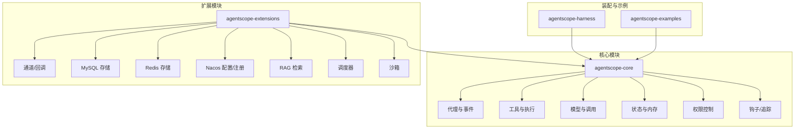
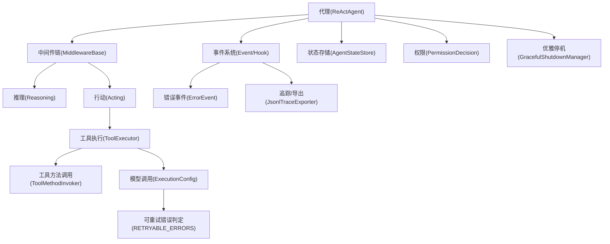
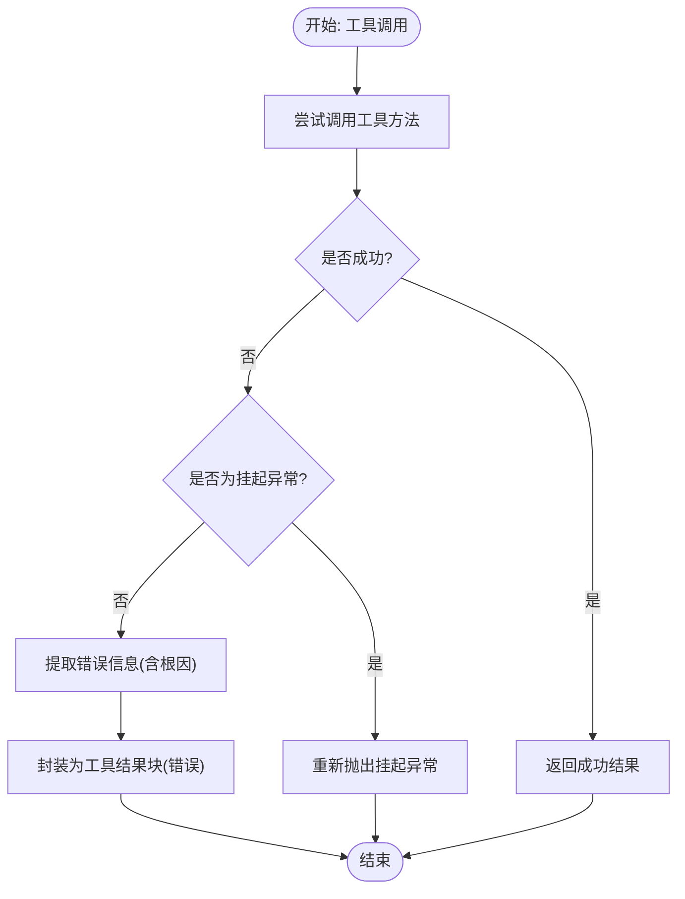
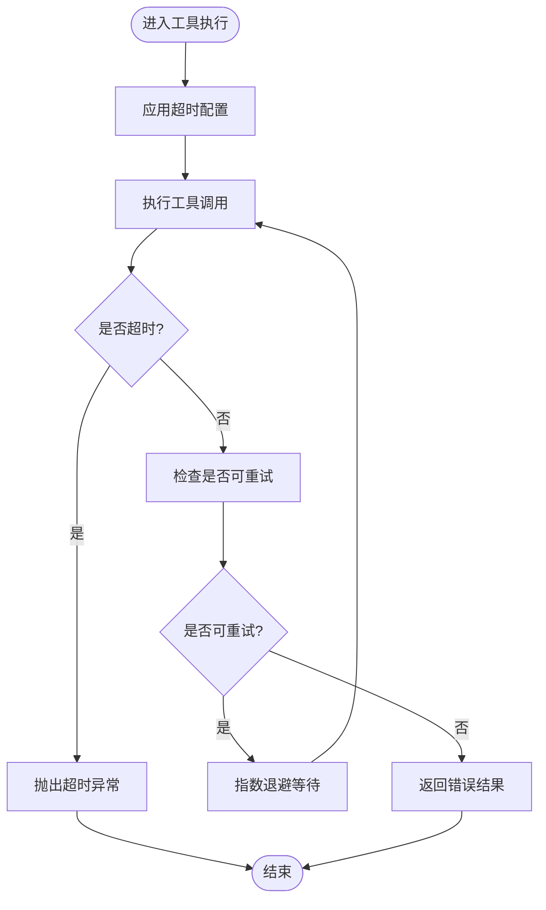
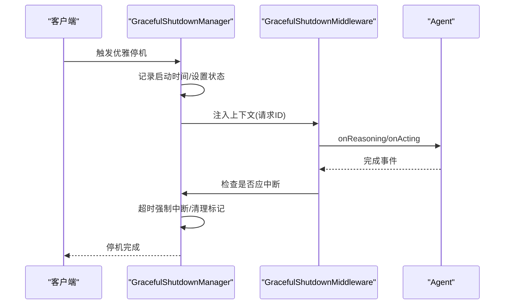
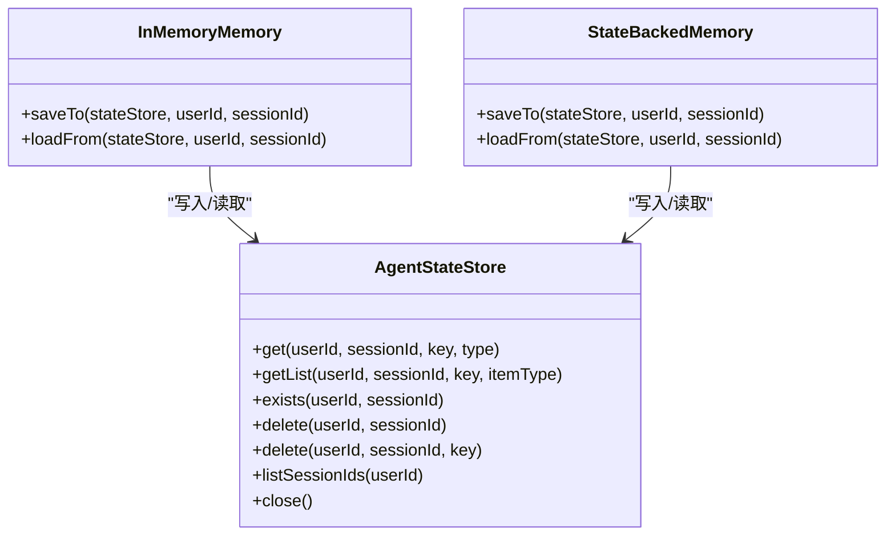
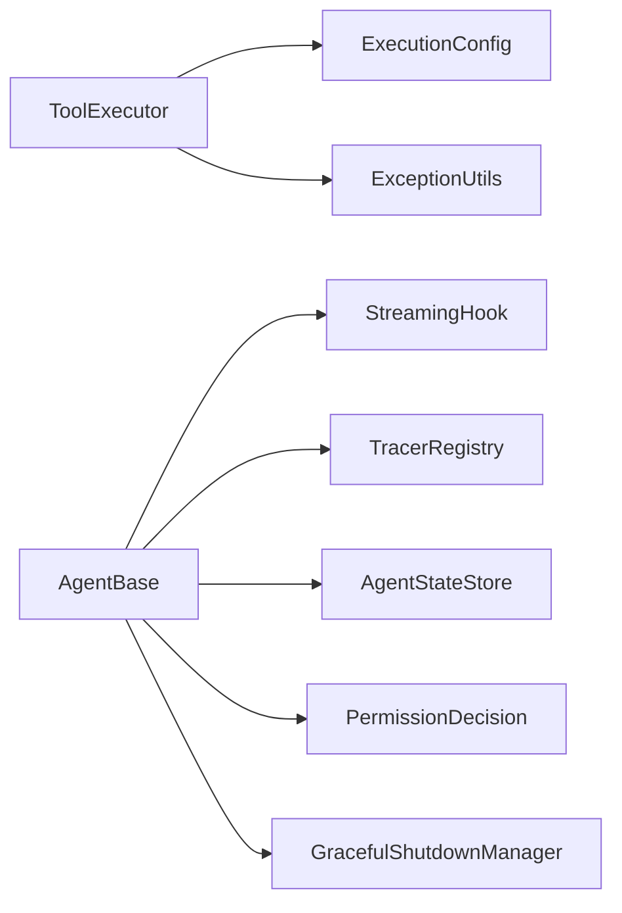

# 故障排除与FAQ

<cite>
**本文引用的文件**
- [ToolMethodInvoker.java](file://agentscope-core/src/main/java/io/agentscope/core/tool/ToolMethodInvoker.java)
- [ExceptionUtils.java](file://agentscope-core/src/main/java/io/agentscope/core/util/ExceptionUtils.java)
- [CompositeAgentException.java](file://agentscope-core/src/main/java/io/agentscope/core/exception/CompositeAgentException.java)
- [ErrorEvent.java](file://agentscope-core/src/main/java/io/agentscope/core/hook/ErrorEvent.java)
- [GracefulShutdownManager.java](file://agentscope-core/src/main/java/io/agentscope/core/shutdown/GracefulShutdownManager.java)
- [GracefulShutdownConfig.java](file://agentscope-core/src/main/java/io/agentscope/core/shutdown/GracefulShutdownConfig.java)
- [GracefulShutdownMiddleware.java](file://agentscope-core/src/main/java/io/agentscope/core/shutdown/GracefulShutdownMiddleware.java)
- [ExecutionConfig.java](file://agentscope-core/src/main/java/io/agentscope/core/model/ExecutionConfig.java)
- [ToolExecutor.java](file://agentscope-core/src/main/java/io/agentscope/core/tool/ToolExecutor.java)
- [HarnessAgentBuilderSupport.java](file://agentscope-harness/src/main/java/io/agentscope/harness/agent/HarnessAgentBuilderSupport.java)
- [SubAgentConfig.java](file://agentscope-core/src/main/java/io/agentscope/core/tool/subagent/SubAgentConfig.java)
- [HarnessAgent.java](file://agentscope-harness/src/main/java/io/agentscope/harness/agent/HarnessAgent.java)
- [JsonlTraceExporter.java](file://agentscope-core/src/main/java/io/agentscope/core/hook/recorder/JsonlTraceExporter.java)
- [TracerRegistry.java](file://agentscope-core/src/main/java/io/agentscope/core/tracing/TracerRegistry.java)
- [FormatterException.java](file://agentscope-core/src/main/java/io/agentscope/core/formatter/FormatterException.java)
- [AgentStateStore.java](file://agentscope-core/src/main/java/io/agentscope/core/state/AgentStateStore.java)
- [InMemoryMemory.java](file://agentscope-core/src/main/java/io/agentscope/core/memory/InMemoryMemory.java)
- [StateBackedMemory.java](file://agentscope-core/src/main/java/io/agentscope/core/memory/StateBackedMemory.java)
- [AgentBase.java](file://agentscope-core/src/main/java/io/agentscope/core/agent/AgentBase.java)
- [StreamingHook.java](file://agentscope-core/src/main/java/io/agentscope/core/agent/StreamingHook.java)
- [PermissionDecision.java](file://agentscope-core/src/main/java/io/agentscope/core/permission/PermissionDecision.java)
</cite>

## 目录
1. 引言
2. 项目结构
3. 核心组件
4. 架构总览
5. 详细组件分析
6. 依赖关系分析
7. 性能考量
8. 故障排除指南
9. 结论
10. 附录

## 引言
本指南面向使用 AgentScope 的开发者与运维人员，聚焦于运行时错误、配置问题与性能瓶颈的快速定位与修复。内容涵盖异常处理机制、错误恢复策略、优雅停机流程、重试与超时控制、调试与日志分析方法，以及社区支持与版本更新信息。目标是帮助你在最短时间内定位问题、验证修复并稳定交付。

## 项目结构
AgentScope 采用多模块分层设计：核心能力在 agentscope-core 中实现，示例与装配在 agentscope-examples 与 agentscope-harness 中演示；扩展能力分布在 agentscope-extensions 下。围绕“代理-工具-模型-状态-权限-事件钩子/中间件”的架构，形成可插拔、可观测、可恢复的执行闭环。

## 核心组件
- 代理与事件：代理生命周期事件、流式事件、外部执行请求与确认事件等。
- 工具与执行：工具调用、结果转换、超时与重试、挂起异常处理。
- 模型与调用：统一执行配置（超时/重试）、可重试错误判定。
- 状态与内存：会话状态存取、增量持久化、内存消息管理。
- 权限控制：规则决策、行为与建议输出。
- 钩子/追踪：事件记录导出、追踪注册与禁用。
- 优雅停机：全局停机状态、中断检测、超时强制与恢复。

章节来源
- [ToolMethodInvoker.java:353-380](file://agentscope-core/src/main/java/io/agentscope/core/tool/ToolMethodInvoker.java#L353-L380)
- [ExceptionUtils.java:1-60](file://agentscope-core/src/main/java/io/agentscope/core/util/ExceptionUtils.java#L1-L60)
- [CompositeAgentException.java:1-84](file://agentscope-core/src/main/java/io/agentscope/core/exception/CompositeAgentException.java#L1-L84)
- [ErrorEvent.java:46-68](file://agentscope-core/src/main/java/io/agentscope/core/hook/ErrorEvent.java#L46-L68)
- [GracefulShutdownManager.java:118-252](file://agentscope-core/src/main/java/io/agentscope/core/shutdown/GracefulShutdownManager.java#L118-L252)
- [GracefulShutdownConfig.java:51-69](file://agentscope-core/src/main/java/io/agentscope/core/shutdown/GracefulShutdownConfig.java#L51-L69)
- [GracefulShutdownMiddleware.java:55-96](file://agentscope-core/src/main/java/io/agentscope/core/shutdown/GracefulShutdownMiddleware.java#L55-L96)
- [ExecutionConfig.java:27-317](file://agentscope-core/src/main/java/io/agentscope/core/model/ExecutionConfig.java#L27-L317)
- [ToolExecutor.java:418-446](file://agentscope-core/src/main/java/io/agentscope/core/tool/ToolExecutor.java#L418-L446)
- [HarnessAgentBuilderSupport.java:329-624](file://agentscope-harness/src/main/java/io/agentscope/harness/agent/HarnessAgentBuilderSupport.java#L329-L624)
- [SubAgentConfig.java:202-242](file://agentscope-core/src/main/java/io/agentscope/core/tool/subagent/SubAgentConfig.java#L202-L242)
- [HarnessAgent.java:1803-1834](file://agentscope-harness/src/main/java/io/agentscope/harness/agent/HarnessAgent.java#L1803-L1834)
- [JsonlTraceExporter.java:67-478](file://agentscope-core/src/main/java/io/agentscope/core/hook/recorder/JsonlTraceExporter.java#L67-L478)
- [TracerRegistry.java:143-164](file://agentscope-core/src/main/java/io/agentscope/core/tracing/TracerRegistry.java#L143-L164)
- [FormatterException.java:1-44](file://agentscope-core/src/main/java/io/agentscope/core/formatter/FormatterException.java#L1-L44)
- [AgentStateStore.java:94-166](file://agentscope-core/src/main/java/io/agentscope/core/state/AgentStateStore.java#L94-L166)
- [InMemoryMemory.java:39-66](file://agentscope-core/src/main/java/io/agentscope/core/memory/InMemoryMemory.java#L39-L66)
- [StateBackedMemory.java:38-79](file://agentscope-core/src/main/java/io/agentscope/core/memory/StateBackedMemory.java#L38-L79)
- [AgentBase.java:997-1013](file://agentscope-core/src/main/java/io/agentscope/core/agent/AgentBase.java#L997-L1013)
- [StreamingHook.java:37-66](file://agentscope-core/src/main/java/io/agentscope/core/agent/StreamingHook.java#L37-L66)
- [PermissionDecision.java:38-175](file://agentscope-core/src/main/java/io/agentscope/core/permission/PermissionDecision.java#L38-L175)

## 架构总览
AgentScope 的执行路径以“代理”为中心，贯穿“推理-行动-工具调用-模型请求-事件/钩子/中间件-状态存储”。异常与错误通过统一的异常工具提取信息，并在特定场景下触发重试或抛出专用异常；优雅停机通过中间件与管理器协作，保障服务关闭过程中的可控性与一致性。

图表来源
- [AgentBase.java:997-1013](file://agentscope-core/src/main/java/io/agentscope/core/agent/AgentBase.java#L997-L1013)
- [ToolExecutor.java:418-446](file://agentscope-core/src/main/java/io/agentscope/core/tool/ToolExecutor.java#L418-L446)
- [ExecutionConfig.java:27-317](file://agentscope-core/src/main/java/io/agentscope/core/model/ExecutionConfig.java#L27-L317)
- [ErrorEvent.java:46-68](file://agentscope-core/src/main/java/io/agentscope/core/hook/ErrorEvent.java#L46-L68)
- [JsonlTraceExporter.java:67-478](file://agentscope-core/src/main/java/io/agentscope/core/hook/recorder/JsonlTraceExporter.java#L67-L478)
- [AgentStateStore.java:94-166](file://agentscope-core/src/main/java/io/agentscope/core/state/AgentStateStore.java#L94-L166)
- [PermissionDecision.java:38-175](file://agentscope-core/src/main/java/io/agentscope/core/permission/PermissionDecision.java#L38-L175)
- [GracefulShutdownManager.java:118-252](file://agentscope-core/src/main/java/io/agentscope/core/shutdown/GracefulShutdownManager.java#L118-L252)

## 详细组件分析

### 组件一：异常与错误处理
- 统一错误提取：当工具调用失败时，通过工具方法调用器提取链路中最合适的错误信息，包装为工具结果块返回，避免丢失根因。
- 复合异常聚合：复合代理异常用于汇总多个子代理的异常信息，便于集中展示与定位。
- 错误事件：错误事件承载具体 Throwable，便于钩子系统捕获与上报。
- 格式化器异常：格式化器异常用于统一包装消息格式化与解析阶段的错误。

图表来源
- [ToolMethodInvoker.java:353-380](file://agentscope-core/src/main/java/io/agentscope/core/tool/ToolMethodInvoker.java#L353-L380)
- [ExceptionUtils.java:1-60](file://agentscope-core/src/main/java/io/agentscope/core/util/ExceptionUtils.java#L1-L60)
- [CompositeAgentException.java:1-84](file://agentscope-core/src/main/java/io/agentscope/core/exception/CompositeAgentException.java#L1-L84)
- [ErrorEvent.java:46-68](file://agentscope-core/src/main/java/io/agentscope/core/hook/ErrorEvent.java#L46-L68)
- [FormatterException.java:1-44](file://agentscope-core/src/main/java/io/agentscope/core/formatter/FormatterException.java#L1-L44)

章节来源
- [ToolMethodInvoker.java:353-380](file://agentscope-core/src/main/java/io/agentscope/core/tool/ToolMethodInvoker.java#L353-L380)
- [ExceptionUtils.java:1-60](file://agentscope-core/src/main/java/io/agentscope/core/util/ExceptionUtils.java#L1-L60)
- [CompositeAgentException.java:1-84](file://agentscope-core/src/main/java/io/agentscope/core/exception/CompositeAgentException.java#L1-L84)
- [ErrorEvent.java:46-68](file://agentscope-core/src/main/java/io/agentscope/core/hook/ErrorEvent.java#L46-L68)
- [FormatterException.java:1-44](file://agentscope-core/src/main/java/io/agentscope/core/formatter/FormatterException.java#L1-L44)

### 组件二：重试与超时控制
- 执行配置：统一的超时与重试参数，支持指数退避、最大退避、重试条件谓词。
- 可重试错误：对网络/IO/速率限制/超时等错误进行自动重试，避免将永久性错误（如 400）误判为可重试。
- 工具执行：在工具执行中应用超时与重试策略，必要时抛出超时异常。

图表来源
- [ExecutionConfig.java:27-317](file://agentscope-core/src/main/java/io/agentscope/core/model/ExecutionConfig.java#L27-L317)
- [ToolExecutor.java:418-446](file://agentscope-core/src/main/java/io/agentscope/core/tool/ToolExecutor.java#L418-L446)

章节来源
- [ExecutionConfig.java:27-317](file://agentscope-core/src/main/java/io/agentscope/core/model/ExecutionConfig.java#L27-L317)
- [ToolExecutor.java:418-446](file://agentscope-core/src/main/java/io/agentscope/core/tool/ToolExecutor.java#L418-L446)

### 组件三：优雅停机与中断
- 全局停机管理：启动停机流程、监控活跃请求数、超时强制中断、状态转换与日志记录。
- 中间件集成：在推理/行动阶段完成后检测停机状态并触发中断，避免重复提示。
- 配置校验：停机超时必须为正数或空（无限），部分推理策略不能为空。

图表来源
- [GracefulShutdownManager.java:118-252](file://agentscope-core/src/main/java/io/agentscope/core/shutdown/GracefulShutdownManager.java#L118-L252)
- [GracefulShutdownMiddleware.java:55-96](file://agentscope-core/src/main/java/io/agentscope/core/shutdown/GracefulShutdownMiddleware.java#L55-L96)
- [GracefulShutdownConfig.java:51-69](file://agentscope-core/src/main/java/io/agentscope/core/shutdown/GracefulShutdownConfig.java#L51-L69)

章节来源
- [GracefulShutdownManager.java:118-252](file://agentscope-core/src/main/java/io/agentscope/core/shutdown/GracefulShutdownManager.java#L118-L252)
- [GracefulShutdownMiddleware.java:55-96](file://agentscope-core/src/main/java/io/agentscope/core/shutdown/GracefulShutdownMiddleware.java#L55-L96)
- [GracefulShutdownConfig.java:51-69](file://agentscope-core/src/main/java/io/agentscope/core/shutdown/GracefulShutdownConfig.java#L51-L69)

### 组件四：状态与内存持久化
- 状态存储接口：提供按用户/会话键值存取、列表读取、存在性检查、删除与会话枚举等能力。
- 内存实现：内存消息列表保存到状态存储，支持全量保存与增量持久化。
- 状态驱动内存：基于 AgentState 的内存实现，加载时清空并替换为持久化数据。

图表来源
- [AgentStateStore.java:94-166](file://agentscope-core/src/main/java/io/agentscope/core/state/AgentStateStore.java#L94-L166)
- [InMemoryMemory.java:39-66](file://agentscope-core/src/main/java/io/agentscope/core/memory/InMemoryMemory.java#L39-L66)
- [StateBackedMemory.java:38-79](file://agentscope-core/src/main/java/io/agentscope/core/memory/StateBackedMemory.java#L38-L79)

章节来源
- [AgentStateStore.java:94-166](file://agentscope-core/src/main/java/io/agentscope/core/state/AgentStateStore.java#L94-L166)
- [InMemoryMemory.java:39-66](file://agentscope-core/src/main/java/io/agentscope/core/memory/InMemoryMemory.java#L39-L66)
- [StateBackedMemory.java:38-79](file://agentscope-core/src/main/java/io/agentscope/core/memory/StateBackedMemory.java#L38-L79)

### 组件五：权限决策
- 决策结构：包含行为、消息、原因、输入更新与建议规则，支持构建与比较。
- 规则优先级：工具拒绝优先于旁路模式，确保安全边界不被绕过。

章节来源
- [PermissionDecision.java:38-175](file://agentscope-core/src/main/java/io/agentscope/core/permission/PermissionDecision.java#L38-L175)

### 组件六：事件与追踪
- 流式事件钩子：拦截事件并按选项过滤与增量处理，已标注废弃，推荐使用中间件体系。
- 追踪注册：注册追踪器或重置为空操作实现，按需启用/禁用追踪钩子。
- 事件导出：JSONL 导出器将 Hook 事件序列化为行式日志，支持追加、逐行刷新与失败快速模式。

章节来源
- [StreamingHook.java:37-66](file://agentscope-core/src/main/java/io/agentscope/core/agent/StreamingHook.java#L37-L66)
- [TracerRegistry.java:143-164](file://agentscope-core/src/main/java/io/agentscope/core/tracing/TracerRegistry.java#L143-L164)
- [JsonlTraceExporter.java:67-478](file://agentscope-core/src/main/java/io/agentscope/core/hook/recorder/JsonlTraceExporter.java#L67-L478)

## 依赖关系分析
- 组件耦合：工具执行依赖执行配置与异常工具；代理通过中间件与钩子系统串联推理/行动；状态存储为内存与会话提供统一抽象。
- 外部依赖：模型调用依赖统一的可重试错误判定；权限引擎依赖规则与输入上下文；优雅停机依赖中间件与管理器协作。
- 循环依赖：未见直接循环依赖；钩子/追踪与中间件体系分离，避免强耦合。

图表来源
- [ToolExecutor.java:418-446](file://agentscope-core/src/main/java/io/agentscope/core/tool/ToolExecutor.java#L418-L446)
- [ExecutionConfig.java:27-317](file://agentscope-core/src/main/java/io/agentscope/core/model/ExecutionConfig.java#L27-L317)
- [ExceptionUtils.java:1-60](file://agentscope-core/src/main/java/io/agentscope/core/util/ExceptionUtils.java#L1-L60)
- [AgentBase.java:997-1013](file://agentscope-core/src/main/java/io/agentscope/core/agent/AgentBase.java#L997-L1013)
- [StreamingHook.java:37-66](file://agentscope-core/src/main/java/io/agentscope/core/agent/StreamingHook.java#L37-L66)
- [TracerRegistry.java:143-164](file://agentscope-core/src/main/java/io/agentscope/core/tracing/TracerRegistry.java#L143-L164)
- [AgentStateStore.java:94-166](file://agentscope-core/src/main/java/io/agentscope/core/state/AgentStateStore.java#L94-L166)
- [PermissionDecision.java:38-175](file://agentscope-core/src/main/java/io/agentscope/core/permission/PermissionDecision.java#L38-L175)
- [GracefulShutdownManager.java:118-252](file://agentscope-core/src/main/java/io/agentscope/core/shutdown/GracefulShutdownManager.java#L118-L252)

## 性能考量
- 超时与重试：合理设置工具与模型调用的超时与重试次数，避免长时间阻塞；对可重试错误采用指数退避，降低抖动。
- 事件导出：JSONL 导出器默认最佳-effort，生产环境可开启失败快速模式以减少对主流程影响。
- 状态持久化：增量保存策略减少 IO 压力；大消息场景注意内存占用与序列化成本。
- 追踪开销：仅在需要时启用追踪，避免不必要的上下文传播与序列化。

## 故障排除指南

### 一、运行时错误与异常
- 工具调用失败
  - 现象：工具执行返回错误结果，或抛出挂起异常导致流程中断。
  - 排查：查看工具方法调用器的错误提取逻辑，确认根因是否为挂起异常；检查工具参数与可用性。
  - 解决：若为挂起异常，交由工具执行器正确处理；否则根据异常信息修正工具定义或参数。
  
  章节来源
  - [ToolMethodInvoker.java:353-380](file://agentscope-core/src/main/java/io/agentscope/core/tool/ToolMethodInvoker.java#L353-L380)

- 复合异常聚合
  - 现象：多个子代理同时报错，异常信息聚合展示。
  - 排查：查看复合异常中的各子项（代理 ID/名称与异常类型/消息）。
  - 解决：逐项定位子代理问题，修复后重试。

  章节来源
  - [CompositeAgentException.java:1-84](file://agentscope-core/src/main/java/io/agentscope/core/exception/CompositeAgentException.java#L1-L84)

- 格式化器异常
  - 现象：消息格式化或响应解析失败。
  - 排查：检查格式化器异常的包装信息与根因。
  - 解决：修正消息结构或格式化器实现。

  章节来源
  - [FormatterException.java:1-44](file://agentscope-core/src/main/java/io/agentscope/core/formatter/FormatterException.java#L1-L44)

### 二、配置问题
- 执行配置无效或冲突
  - 现象：超时/重试未生效或与预期不符。
  - 排查：确认统一执行配置的合并顺序与参数优先级；检查每层配置（请求级/代理级/组件默认/系统默认）。
  - 解决：调整配置层级与参数，确保最终生效配置符合预期。

  章节来源
  - [ExecutionConfig.java:27-317](file://agentscope-core/src/main/java/io/agentscope/core/model/ExecutionConfig.java#L27-L317)

- 子代理模型解析失败
  - 现象：子代理模型覆盖解析失败，回退到父代理模型。
  - 排查：检查模型覆盖字符串与解析器是否可用。
  - 解决：修正模型标识或提供自定义解析器。

  章节来源
  - [HarnessAgentBuilderSupport.java:593-624](file://agentscope-harness/src/main/java/io/agentscope/harness/agent/HarnessAgentBuilderSupport.java#L593-L624)

- 子代理状态存储未设置
  - 现象：会话状态未持久化或丢失。
  - 排查：确认是否显式设置了状态存储；若未设置，默认使用内存存储。
  - 解决：为子代理配置持久化状态存储（如 JSON 文件存储）。

  章节来源
  - [SubAgentConfig.java:202-242](file://agentscope-core/src/main/java/io/agentscope/core/tool/subagent/SubAgentConfig.java#L202-L242)

### 三、性能瓶颈
- 工具执行超时
  - 现象：工具调用超过设定时限。
  - 排查：检查工具执行器的超时配置与实际耗时；评估重试策略是否过度。
  - 解决：提升超时阈值或优化工具实现；必要时拆分任务。

  章节来源
  - [ToolExecutor.java:418-446](file://agentscope-core/src/main/java/io/agentscope/core/tool/ToolExecutor.java#L418-L446)

- 事件导出阻塞
  - 现象：JSONL 导出器导致主线程阻塞。
  - 排查：确认是否启用逐行刷新与失败快速模式。
  - 解决：在生产环境启用失败快速模式，或降低导出频率。

  章节来源
  - [JsonlTraceExporter.java:67-478](file://agentscope-core/src/main/java/io/agentscope/core/hook/recorder/JsonlTraceExporter.java#L67-L478)

- 状态持久化开销
  - 现象：频繁保存导致延迟。
  - 排查：检查保存频率与增量策略。
  - 解决：采用增量保存与批量提交，减少 IO 次数。

  章节来源
  - [InMemoryMemory.java:39-66](file://agentscope-core/src/main/java/io/agentscope/core/memory/InMemoryMemory.java#L39-L66)
  - [StateBackedMemory.java:38-79](file://agentscope-core/src/main/java/io/agentscope/core/memory/StateBackedMemory.java#L38-L79)

### 四、优雅停机与中断
- 停机超时或中断异常
  - 现象：停机过程中请求未及时中断或超时未生效。
  - 排查：检查停机配置的超时参数与部分推理策略；确认中间件是否注入了请求 ID。
  - 解决：调整停机超时为正值；确保中间件在推理/行动完成后触发中断。

  章节来源
  - [GracefulShutdownConfig.java:51-69](file://agentscope-core/src/main/java/io/agentscope/core/shutdown/GracefulShutdownConfig.java#L51-L69)
  - [GracefulShutdownMiddleware.java:55-96](file://agentscope-core/src/main/java/io/agentscope/core/shutdown/GracefulShutdownMiddleware.java#L55-L96)
  - [GracefulShutdownManager.java:118-252](file://agentscope-core/src/main/java/io/agentscope/core/shutdown/GracefulShutdownManager.java#L118-L252)

- 代理状态清理
  - 现象：停机后代理仍处于“中断”标记状态。
  - 排查：确认管理器是否清理了“停机中断”标记。
  - 解决：在业务侧调用清理方法，确保后续请求不受影响。

  章节来源
  - [GracefulShutdownManager.java:118-137](file://agentscope-core/src/main/java/io/agentscope/core/shutdown/GracefulShutdownManager.java#L118-L137)

### 五、调试与日志分析
- 使用 JSONL 导出器
  - 步骤：启用导出器并选择关注的事件类型；在失败时附带导出文件进行分析。
  - 注意：生产环境建议开启失败快速模式，避免阻塞主流程。

  章节来源
  - [JsonlTraceExporter.java:67-478](file://agentscope-core/src/main/java/io/agentscope/core/hook/recorder/JsonlTraceExporter.java#L67-L478)

- 追踪开关
  - 步骤：注册追踪器以启用追踪；在不需要时重置为空操作实现以禁用追踪。

  章节来源
  - [TracerRegistry.java:143-164](file://agentscope-core/src/main/java/io/agentscope/core/tracing/TracerRegistry.java#L143-L164)

- 事件流式钩子
  - 说明：流式钩子已废弃，建议改用中间件体系进行事件流式处理。

  章节来源
  - [StreamingHook.java:37-66](file://agentscope-core/src/main/java/io/agentscope/core/agent/StreamingHook.java#L37-L66)

- 代理事件上下文
  - 说明：代理在订阅流时动态注入临时钩子并在 finally 中移除，确保上下文一致。

  章节来源
  - [AgentBase.java:997-1013](file://agentscope-core/src/main/java/io/agentscope/core/agent/AgentBase.java#L997-L1013)

### 六、权限与安全
- 工具拒绝优先
  - 现象：即使处于旁路模式，工具明确拒绝也会覆盖旁路。
  - 排查：检查工具的权限决策与消息。
  - 解决：调整工具权限或补充规则。

  章节来源
  - [PermissionDecision.java:38-175](file://agentscope-core/src/main/java/io/agentscope/core/permission/PermissionDecision.java#L38-L175)

### 七、装配与会话
- 分布式存储注入
  - 现象：分布式存储组件自动注入到状态存储与文件系统/沙箱配置中。
  - 排查：确认分布式存储组件是否正确初始化。
  - 解决：按需显式覆盖或启用本地默认。

  章节来源
  - [HarnessAgent.java:1803-1834](file://agentscope-harness/src/main/java/io/agentscope/harness/agent/HarnessAgent.java#L1803-L1834)

## 结论
通过统一的异常处理、可配置的重试与超时、完善的事件与追踪、以及优雅停机机制，AgentScope 在复杂场景下提供了稳健的执行与恢复能力。建议在生产环境中：
- 明确配置优先级与合并策略；
- 合理设置超时与重试，避免过度退避；
- 使用 JSONL 导出器与追踪系统进行问题定位；
- 在停机前确保中间件正确注入请求 ID 并清理中断标记；
- 对权限与状态持久化进行最小化配置与充分测试。

## 附录
- 社区支持与问题反馈
  - 提问与讨论：通过仓库 Issues 区域提交问题，附带导出的日志与最小复现。
  - 版本更新：关注仓库发布说明与变更日志，及时升级至最新稳定版本。
- 版本信息
  - 当前版本：参见核心模块版本类，用于识别运行时版本与兼容性。
