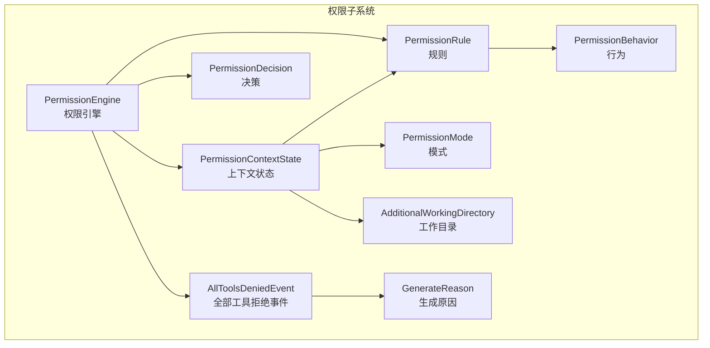
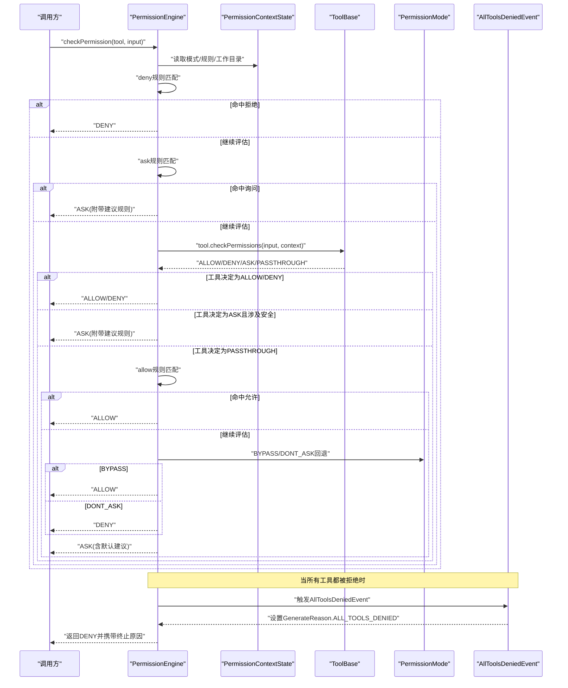
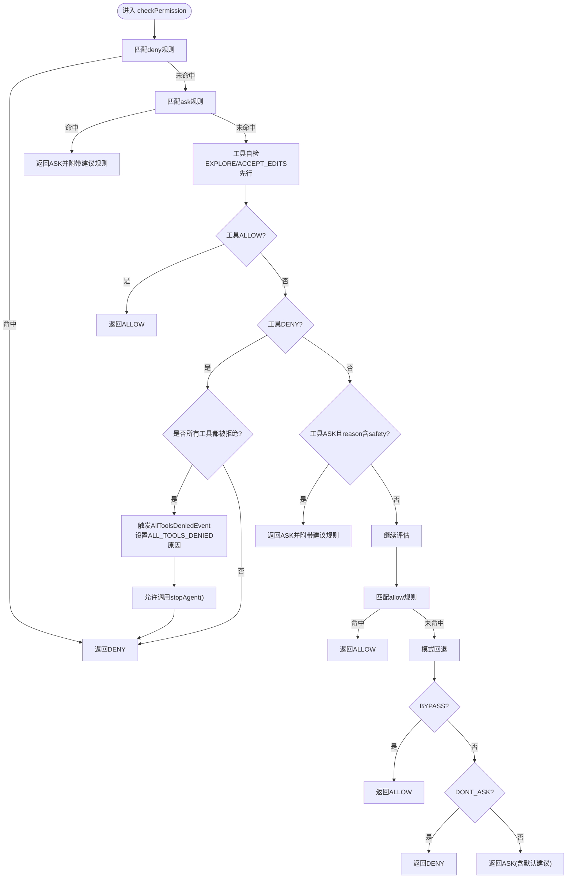
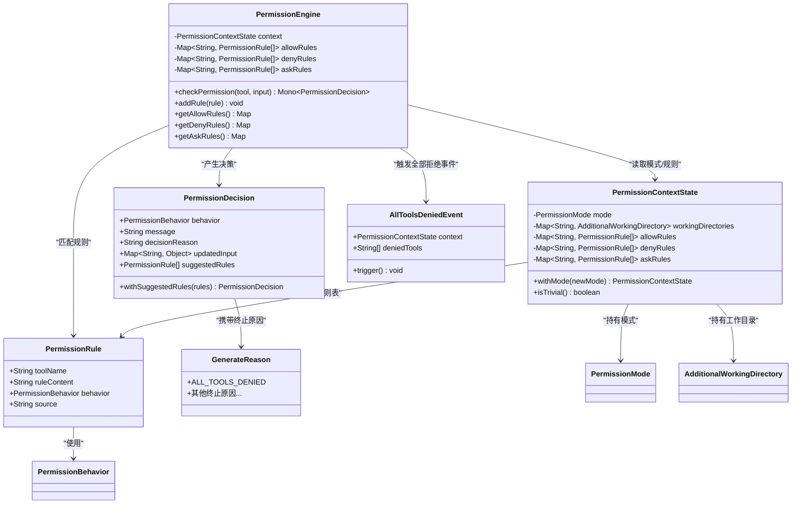

# 权限系统

<cite>
**本文引用的文件**
- [PermissionEngine.java](file://agentscope-core/src/main/java/io/agentscope/core/permission/PermissionEngine.java)
- [PermissionRule.java](file://agentscope-core/src/main/java/io/agentscope/core/permission/PermissionRule.java)
- [PermissionContextState.java](file://agentscope-core/src/main/java/io/agentscope/core/permission/PermissionContextState.java)
- [PermissionDecision.java](file://agentscope-core/src/main/java/io/agentscope/core/permission/PermissionDecision.java)
- [PermissionMode.java](file://agentscope-core/src/main/java/io/agentscope/core/permission/PermissionMode.java)
- [PermissionBehavior.java](file://agentscope-core/src/main/java/io/agentscope/core/permission/PermissionBehavior.java)
- [AdditionalWorkingDirectory.java](file://agentscope-core/src/main/java/io/agentscope/core/permission/AdditionalWorkingDirectory.java)
- [AllToolsDeniedEvent.java](file://agentscope-core/src/main/java/io/agentscope/core/event/AllToolsDeniedEvent.java)
- [GenerateReason.java](file://agentscope-core/src/main/java/io/agentscope/core/message/GenerateReason.java)
- [PermissionEngineTest.java](file://agentscope-core/src/test/java/io/agentscope/core/permission/PermissionEngineTest.java)
- [PermissionContextStateTest.java](file://agentscope-core/src/test/java/io/agentscope/core/permission/PermissionContextStateTest.java)
- [ToolBase.java](file://agentscope-core/src/main/java/io/agentscope/core/tool/ToolBase.java)
</cite>

## 更新摘要
**变更内容**
- 新增AllToolsDeniedEvent事件系统，用于处理用户拒绝所有工具调用的场景
- 新增GenerateReason.ALL_TOOLS_DENIED终止原因，支持钩子处理器调用stopAgent()防止进一步推理
- 增强HITL人类在环权限系统的异常处理能力
- 完善权限拒绝流程的事件通知机制

## 目录
1. [引言](#引言)
2. [项目结构](#项目结构)
3. [核心组件](#核心组件)
4. [架构总览](#架构总览)
5. [组件详解](#组件详解)
6. [依赖关系分析](#依赖关系分析)
7. [性能考量](#性能考量)
8. [故障排查指南](#故障排查指南)
9. [结论](#结论)
10. [附录](#附录)

## 引言
本文件面向AgentScope权限系统的技术文档，围绕PermissionEngine权限引擎、PermissionRule权限规则与PermissionContextState上下文状态进行深入解析。内容涵盖设计理念、访问决策算法、安全策略配置、权限模式选择、继承与审计、扩展机制与自定义规则、监控告警建议、最佳实践与合规指南，并提供可操作的配置示例与集成方案。

**更新** 本次更新新增了AllToolsDeniedEvent事件系统和GenerateReason.ALL_TOOLS_DENIED终止原因，增强了HITL人类在环权限系统在用户拒绝所有工具调用时的处理能力。

## 项目结构
权限系统位于agentscope-core模块的io.agentscope.core.permission包中，核心文件包括：
- 权限引擎：PermissionEngine
- 规则模型：PermissionRule
- 上下文状态：PermissionContextState
- 决策结果：PermissionDecision
- 模式枚举：PermissionMode
- 行为枚举：PermissionBehavior
- 工作目录：AdditionalWorkingDirectory
- **新增** 全部工具拒绝事件：AllToolsDeniedEvent
- **新增** 生成原因枚举：GenerateReason（包含ALL_TOOLS_DENIED）

**图表来源**
- [PermissionEngine.java:47-336](file://agentscope-core/src/main/java/io/agentscope/core/permission/PermissionEngine.java#L47-L336)
- [PermissionContextState.java:37-250](file://agentscope-core/src/main/java/io/agentscope/core/permission/PermissionContextState.java#L37-L250)
- [PermissionRule.java:33-46](file://agentscope-core/src/main/java/io/agentscope/core/permission/PermissionRule.java#L33-L46)
- [PermissionDecision.java:36-207](file://agentscope-core/src/main/java/io/agentscope/core/permission/PermissionDecision.java#L36-L207)
- [PermissionMode.java:33-72](file://agentscope-core/src/main/java/io/agentscope/core/permission/PermissionMode.java#L33-L72)
- [PermissionBehavior.java:32-70](file://agentscope-core/src/main/java/io/agentscope/core/permission/PermissionBehavior.java#L32-L70)
- [AdditionalWorkingDirectory.java:31-40](file://agentscope-core/src/main/java/io/agentscope/core/permission/AdditionalWorkingDirectory.java#L31-L40)
- [AllToolsDeniedEvent.java](file://agentscope-core/src/main/java/io/agentscope/core/event/AllToolsDeniedEvent.java)
- [GenerateReason.java](file://agentscope-core/src/main/java/io/agentscope/core/message/GenerateReason.java)

章节来源
- [PermissionEngine.java:28-46](file://agentscope-core/src/main/java/io/agentscope/core/permission/PermissionEngine.java#L28-L46)
- [PermissionContextState.java:29-36](file://agentscope-core/src/main/java/io/agentscope/core/permission/PermissionContextState.java#L29-L36)

## 核心组件
- PermissionEngine：负责对工具调用请求进行权限评估，遵循"拒绝优先、询问次之、允许再次之"的规则优先级，并结合模式回退与默认策略。
- PermissionRule：单条规则，绑定到具体工具名，支持空规则内容（全量匹配）与行为类型（ALLOW/DENY/ASK/PASSTHROUGH）。
- PermissionContextState：权限上下文，包含模式、工作目录集合以及三张规则表（allow/deny/ask），提供不可变快照与运行时模式切换能力。
- PermissionDecision：权限决策载体，包含行为、消息、原因、更新后的输入与建议规则列表。
- PermissionMode：权限模式枚举，控制缺省行为与模式回退（DEFAULT、ACCEPT_EDITS、EXPLORE、BYPASS、DONT_ASK）。
- PermissionBehavior：规则或工具自检返回的行为枚举。
- AdditionalWorkingDirectory：工作目录记录，用于ACCEPT_EDITS模式下的自动放行判定。
- **新增** AllToolsDeniedEvent：当用户拒绝所有工具调用时触发的事件，用于通知上层系统进行相应处理。
- **新增** GenerateReason.ALL_TOOLS_DENIED：表示因所有工具被拒绝而终止生成的原因码，支持钩子处理器调用stopAgent()。

章节来源
- [PermissionEngine.java:47-336](file://agentscope-core/src/main/java/io/agentscope/core/permission/PermissionEngine.java#L47-L336)
- [PermissionRule.java:22-46](file://agentscope-core/src/main/java/io/agentscope/core/permission/PermissionRule.java#L22-L46)
- [PermissionContextState.java:37-250](file://agentscope-core/src/main/java/io/agentscope/core/permission/PermissionContextState.java#L37-L250)
- [PermissionDecision.java:28-207](file://agentscope-core/src/main/java/io/agentscope/core/permission/PermissionDecision.java#L28-L207)
- [PermissionMode.java:22-72](file://agentscope-core/src/main/java/io/agentscope/core/permission/PermissionMode.java#L22-L72)
- [PermissionBehavior.java:22-70](file://agentscope-core/src/main/java/io/agentscope/core/permission/PermissionBehavior.java#L22-L70)
- [AdditionalWorkingDirectory.java:22-40](file://agentscope-core/src/main/java/io/agentscope/core/permission/AdditionalWorkingDirectory.java#L22-L40)
- [AllToolsDeniedEvent.java](file://agentscope-core/src/main/java/io/agentscope/core/event/AllToolsDeniedEvent.java)
- [GenerateReason.java](file://agentscope-core/src/main/java/io/agentscope/core/message/GenerateReason.java)

## 架构总览
权限系统采用"上下文驱动 + 规则优先级 + 模式回退"的分层设计。工具在调用前由PermissionEngine根据PermissionContextState中的规则与模式进行评估；若工具自身提供决策，则在特定条件下具有"免疫"特性（如安全相关ASK）。

**更新** 新增了AllToolsDeniedEvent事件系统，当用户拒绝所有工具调用时，系统会触发该事件并设置GenerateReason.ALL_TOOLS_DENIED终止原因，允许钩子处理器调用stopAgent()来防止进一步的推理循环。

**图表来源**
- [PermissionEngine.java:139-202](file://agentscope-core/src/main/java/io/agentscope/core/permission/PermissionEngine.java#L139-L202)
- [PermissionEngine.java:210-227](file://agentscope-core/src/main/java/io/agentscope/core/permission/PermissionEngine.java#L210-L227)
- [PermissionEngine.java:28-46](file://agentscope-core/src/main/java/io/agentscope/core/permission/PermissionEngine.java#L28-L46)
- [AllToolsDeniedEvent.java](file://agentscope-core/src/main/java/io/agentscope/core/event/AllToolsDeniedEvent.java)
- [GenerateReason.java](file://agentscope-core/src/main/java/io/agentscope/core/message/GenerateReason.java)

## 组件详解

### PermissionEngine 权限引擎
- 设计理念
  - 规则优先级：deny > ask > allow，确保安全优先。
  - 工具自检：工具可提供ALLOW/DENY/ASK/PASSTHROUGH，其中ASK且reason包含"safety"会被附加建议规则并免疫后续规则覆盖。
  - 模式回退：EXPLORE仅允许只读工具；ACCEPT_EDITS在工作目录内允许文件编辑；BYPASS无条件允许；DONT_ASK将ASK降级为DENY。
  - 快照语义：构造时复制上下文规则至内部可变表，保证外部变更不影响已构建引擎。
- 关键流程
  - deny规则 → ask规则 → 工具自检（EXPLORE/ACCEPT_EDITS先行处理）→ allow规则 → BYPASS → 默认ASK/DENY。
- **更新** 全部工具拒绝处理
  - 当所有可用工具都被拒绝时，触发AllToolsDeniedEvent事件。
  - 设置GenerateReason.ALL_TOOLS_DENIED作为终止原因。
  - 允许钩子处理器调用stopAgent()来防止进一步的推理循环。
- 扩展点
  - addRule：动态注入规则（PASSTHROUGH不存储，仅用于信号）。
  - 访问器：提供只读视图，保障线程安全与一致性。

**图表来源**
- [PermissionEngine.java:139-202](file://agentscope-core/src/main/java/io/agentscope/core/permission/PermissionEngine.java#L139-L202)
- [PermissionEngine.java:210-227](file://agentscope-core/src/main/java/io/agentscope/core/permission/PermissionEngine.java#L210-L227)
- [PermissionEngine.java:28-46](file://agentscope-core/src/main/java/io/agentscope/core/permission/PermissionEngine.java#L28-L46)
- [AllToolsDeniedEvent.java](file://agentscope-core/src/main/java/io/agentscope/core/event/AllToolsDeniedEvent.java)
- [GenerateReason.java](file://agentscope-core/src/main/java/io/agentscope/core/message/GenerateReason.java)

章节来源
- [PermissionEngine.java:47-336](file://agentscope-core/src/main/java/io/agentscope/core/permission/PermissionEngine.java#L47-L336)
- [PermissionEngineTest.java:113-376](file://agentscope-core/src/test/java/io/agentscope/core/permission/PermissionEngineTest.java#L113-L376)

### PermissionRule 权限规则
- 定义
  - 绑定工具名、可选规则内容（为空表示全量匹配）、行为类型与来源。
  - 规则内容由工具侧的matchRule方法解释执行。
- 使用要点
  - 空ruleContent等价于"对目标工具的所有调用均匹配"。
  - 支持从JSON反序列化，字段顺序固定。

章节来源
- [PermissionRule.java:22-46](file://agentscope-core/src/main/java/io/agentscope/core/permission/PermissionRule.java#L22-L46)
- [PermissionEngine.java:310-316](file://agentscope-core/src/main/java/io/agentscope/core/permission/PermissionEngine.java#L310-L316)

### PermissionContextState 上下文状态
- 结构
  - 模式、工作目录映射、三张规则表（按工具名分组，有序）。
  - 提供Builder构建、不可变冻结、JSON序列化/反序列化。
- 运行时能力
  - withMode：在保留规则与工作目录的前提下切换模式。
  - isTrivial：判断是否为默认上下文，用于轻量路径优化。
  - 快照语义：对外暴露只读视图，内部规则表可变但不影响外部状态。

章节来源
- [PermissionContextState.java:37-250](file://agentscope-core/src/main/java/io/agentscope/core/permission/PermissionContextState.java#L37-L250)
- [PermissionContextStateTest.java:26-122](file://agentscope-core/src/test/java/io/agentscope/core/permission/PermissionContextStateTest.java#L26-L122)

### PermissionDecision 决策结果
- 字段
  - 行为、消息、决策原因、更新后的输入、建议规则列表。
- 工具交互
  - 允许工具返回updatedInput与suggestedRules，引擎在必要时合并。
  - 提供withSuggestedRules便捷方法。
- **更新** 终止原因支持
  - 现在可以携带GenerateReason.ALL_TOOLS_DENIED等终止原因，用于指示因权限问题导致的终止。

章节来源
- [PermissionDecision.java:28-207](file://agentscope-core/src/main/java/io/agentscope/core/permission/PermissionDecision.java#L28-207)

### PermissionMode 与 PermissionBehavior
- PermissionMode
  - DEFAULT：需显式ALLOW规则。
  - ACCEPT_EDITS：工作目录内的文件修改自动允许。
  - EXPLORE：只读模式，禁止修改。
  - BYPASS：无条件允许。
  - DONT_ASK：ASK降级为DENY。
- PermissionBehavior
  - ALLOW/DENY/ASK/PASSTHROUGH，支持字符串反序列化。

章节来源
- [PermissionMode.java:22-72](file://agentscope-core/src/main/java/io/agentscope/core/permission/PermissionMode.java#L22-L72)
- [PermissionBehavior.java:22-70](file://agentscope-core/src/main/java/io/agentscope/core/permission/PermissionBehavior.java#L22-L70)

### AdditionalWorkingDirectory 工作目录
- 作用
  - 配合ACCEPT_EDITS模式，作为文件编辑自动放行的依据。
- 字段
  - 绝对路径与来源标识。

章节来源
- [AdditionalWorkingDirectory.java:22-40](file://agentscope-core/src/main/java/io/agentscope/core/permission/AdditionalWorkingDirectory.java#L22-L40)

### AllToolsDeniedEvent 全部工具拒绝事件
- **新增** 功能概述
  - 当用户拒绝所有可用工具的调用时触发的专门事件。
  - 用于通知上层系统权限系统已进入完全拒绝状态。
- 设计目的
  - 解决HITL人类在环场景中用户拒绝所有工具时的处理问题。
  - 防止AI代理陷入无限推理循环。
  - 提供统一的异常处理入口。
- 事件处理
  - 触发时机：当所有工具都被拒绝后。
  - 携带信息：包含当前上下文和拒绝的工具列表。
  - 后续处理：允许钩子处理器调用stopAgent()来终止代理执行。

章节来源
- [AllToolsDeniedEvent.java](file://agentscope-core/src/main/java/io/agentscope/core/event/AllToolsDeniedEvent.java)

### GenerateReason 生成原因
- **新增** ALL_TOOLS_DENIED终止原因
  - 表示因所有工具都被拒绝而导致生成终止的原因码。
  - 用于区分不同类型的终止情况。
- 其他终止原因
  - 保持原有的其他终止原因不变。
- 使用场景
  - 权限系统决策结果中携带终止原因。
  - 钩子处理器根据终止原因执行相应的清理逻辑。
  - 日志记录和监控统计。

章节来源
- [GenerateReason.java](file://agentscope-core/src/main/java/io/agentscope/core/message/GenerateReason.java)

## 依赖关系分析
- PermissionEngine依赖PermissionContextState提供的模式与规则表，并通过工具的matchRule与checkPermissions参与决策。
- PermissionContextState持有PermissionRule与PermissionMode，同时维护AdditionalWorkingDirectory。
- PermissionDecision承载决策结果，可能携带建议规则，供上层引导用户或系统生成新规则。
- **新增** AllToolsDeniedEvent与PermissionEngine的关联，用于在全部工具拒绝时触发事件。
- **新增** GenerateReason.ALL_TOOLS_DENIED与PermissionDecision的关联，用于携带终止原因。

**图表来源**
- [PermissionEngine.java:47-336](file://agentscope-core/src/main/java/io/agentscope/core/permission/PermissionEngine.java#L47-L336)
- [PermissionContextState.java:37-250](file://agentscope-core/src/main/java/io/agentscope/core/permission/PermissionContextState.java#L37-L250)
- [PermissionRule.java:33-46](file://agentscope-core/src/main/java/io/agentscope/core/permission/PermissionRule.java#L33-L46)
- [PermissionDecision.java:36-207](file://agentscope-core/src/main/java/io/agentscope/core/permission/PermissionDecision.java#L36-L207)
- [PermissionMode.java:33-72](file://agentscope-core/src/main/java/io/agentscope/core/permission/PermissionMode.java#L33-L72)
- [PermissionBehavior.java:32-70](file://agentscope-core/src/main/java/io/agentscope/core/permission/PermissionBehavior.java#L32-L70)
- [AdditionalWorkingDirectory.java:31-40](file://agentscope-core/src/main/java/io/agentscope/core/permission/AdditionalWorkingDirectory.java#L31-L40)
- [AllToolsDeniedEvent.java](file://agentscope-core/src/main/java/io/agentscope/core/event/AllToolsDeniedEvent.java)
- [GenerateReason.java](file://agentscope-core/src/main/java/io/agentscope/core/message/GenerateReason.java)

## 性能考量
- 规则匹配复杂度
  - 对于给定工具，规则匹配为线性扫描，时间复杂度O(N)，N为该工具规则数。
  - 当ruleContent为空时，视为全量匹配，避免额外解析开销。
- 并发与快照
  - 构造时复制规则表，避免并发修改导致的可见性问题。
  - 对外提供只读视图，降低锁竞争。
- I/O与网络
  - 工具自检可能触发I/O或远程调用，应考虑超时与重试策略。
- **新增** 事件处理开销
  - AllToolsDeniedEvent触发仅在全部工具拒绝时发生，属于异常情况，对正常流程性能影响极小。
  - 事件处理应异步化，避免阻塞主流程。
- 建议
  - 合理组织规则，减少每工具规则数量。
  - 将高优先级deny规则前置，尽早短路。
  - 在高频调用场景下，缓存工具自检结果（需结合工具语义）。
  - 对AllToolsDeniedEvent的处理实现异步监听，避免性能瓶颈。

## 故障排查指南
- 常见问题定位
  - 模式误配：确认当前PermissionMode是否符合预期（BYPASS/DONT_ASK/EXPLORE）。
  - 规则冲突：deny优先级最高，若出现意外拒绝，检查是否存在更早注册的deny规则。
  - 工具自检：若工具返回ASK且reason含"safety"，将被附加建议规则并免疫后续规则覆盖。
  - 工作目录：ACCEPT_EDITS仅对工作目录范围内的文件编辑生效。
- **新增** 全部工具拒绝问题排查
  - 检查是否有过多deny规则导致所有工具都被拒绝。
  - 确认用户交互界面是否正确处理AllToolsDeniedEvent。
  - 验证钩子处理器是否正确实现了stopAgent()调用逻辑。
  - 检查GenerateReason.ALL_TOOLS_DENIED是否在日志中正确记录。
- 调试建议
  - 使用PermissionContextStateTest与PermissionEngineTest中的断言风格验证期望行为。
  - 逐步添加规则，观察优先级与模式回退的影响。
  - 通过PermissionDecision的decisionReason与suggestedRules辅助定位问题根因。
  - 监听AllToolsDeniedEvent事件，记录完整的拒绝上下文信息。

章节来源
- [PermissionEngineTest.java:113-376](file://agentscope-core/src/test/java/io/agentscope/core/permission/PermissionEngineTest.java#L113-L376)
- [PermissionContextStateTest.java:26-122](file://agentscope-core/src/test/java/io/agentscope/core/permission/PermissionContextStateTest.java#L26-L122)

## 结论
AgentScope权限系统通过清晰的规则优先级、模式回退与工具自检机制，实现了灵活而安全的权限控制。其不可变上下文与快照语义确保了线程安全与一致性；通过建议规则与审计字段，便于实现可追溯的权限治理。

**更新** 本次新增的AllToolsDeniedEvent事件系统和GenerateReason.ALL_TOOLS_DENIED终止原因，显著增强了HITL人类在环权限系统的健壮性。当用户拒绝所有工具调用时，系统能够优雅地处理这种情况，防止AI代理陷入无限推理循环，并为上层应用提供了明确的信号来处理这种边界情况。

结合本文的最佳实践与扩展指南，可在不同部署环境中快速落地并持续演进。

## 附录

### 权限模式选择与安全策略
- DEFAULT：适用于生产环境的最小权限原则，要求显式ALLOW规则。
- ACCEPT_EDITS：适合受控开发/测试场景，允许在工作目录内进行文件编辑。
- EXPLORE：仅允许只读工具，适合探索性会话。
- BYPASS：仅在可信环境或运维通道中启用，避免滥用。
- DONT_ASK：无人值守任务中将ASK降级为DENY，提升自动化稳定性。

章节来源
- [PermissionMode.java:22-72](file://agentscope-core/src/main/java/io/agentscope/core/permission/PermissionMode.java#L22-L72)

### 权限继承与审计
- 继承
  - PermissionContextState提供withMode能力，在不丢失规则与工作目录的前提下切换模式，实现"继承+覆盖"的权限继承模型。
- 审计
  - PermissionDecision包含message、decisionReason与suggestedRules，可用于审计日志与合规追踪。
  - **新增** AllToolsDeniedEvent的触发记录可作为重要的审计线索。
  - **新增** GenerateReason.ALL_TOOLS_DENIED可用于区分权限相关的终止情况。
  - 建议在上层系统中记录每次checkPermission的输入、决策与建议规则，形成闭环审计。

章节来源
- [PermissionContextState.java:148-159](file://agentscope-core/src/main/java/io/agentscope/core/permission/PermissionContextState.java#L148-L159)
- [PermissionDecision.java:36-207](file://agentscope-core/src/main/java/io/agentscope/core/permission/PermissionDecision.java#L36-L207)
- [AllToolsDeniedEvent.java](file://agentscope-core/src/main/java/io/agentscope/core/event/AllToolsDeniedEvent.java)
- [GenerateReason.java](file://agentscope-core/src/main/java/io/agentscope/core/message/GenerateReason.java)

### 扩展机制与自定义规则
- 自定义工具权限检查
  - 工具需实现checkPermissions与matchRule，前者返回PermissionDecision，后者用于规则内容匹配。
  - 工具可返回ASK并设置reason为"safety"，以获得建议规则并免疫后续规则覆盖。
- 动态规则注入
  - 使用PermissionEngine.addRule在运行时追加规则（PASSTHROUGH仅用于信号，不持久化）。
- 工作目录扩展
  - 通过PermissionContextState.Builder.addWorkingDirectory添加额外工作目录，配合ACCEPT_EDITS生效。
- **新增** 事件监听扩展
  - 实现AllToolsDeniedEvent的监听器，处理全部工具拒绝的场景。
  - 在监听器中可以调用stopAgent()来终止代理执行。
  - 记录详细的拒绝上下文信息用于分析和调试。

章节来源
- [PermissionEngine.java:210-227](file://agentscope-core/src/main/java/io/agentscope/core/permission/PermissionEngine.java#L210-L227)
- [PermissionEngine.java:94-106](file://agentscope-core/src/main/java/io/agentscope/core/permission/PermissionEngine.java#L94-L106)
- [ToolBase.java](file://agentscope-core/src/main/java/io/agentscope/core/tool/ToolBase.java)
- [AllToolsDeniedEvent.java](file://agentscope-core/src/main/java/io/agentscope/core/event/AllToolsDeniedEvent.java)

### 监控告警与合规建议
- 监控指标
  - 决策分布：ALLOW/DENY/ASK/PASSTHROUGH计数。
  - 模式使用率：DEFAULT、ACCEPT_EDITS、EXPLORE、BYPASS、DONT_ASK占比。
  - **新增** 全部工具拒绝频率：AllToolsDeniedEvent触发次数。
  - 建议规则采纳率：工具生成建议规则的采纳与落地情况。
- 告警阈值
  - DENY比例异常升高、ASK频繁触发、BYPASS使用次数过多。
  - **新增** AllToolsDeniedEvent触发频率异常升高，可能表示权限配置存在问题。
- 合规
  - 保留决策日志与建议规则，满足审计要求。
  - **新增** 记录AllToolsDeniedEvent的完整上下文信息。
  - 对敏感工具（如文件删除、系统命令）强制deny或ask策略。

### 权限配置示例与集成方案
- 示例一：基础DEFAULT模式
  - 使用PermissionContextState.Builder配置DEFAULT模式与若干ALLOW/DENY规则，交由PermissionEngine评估。
- 示例二：开发场景（ACCEPT_EDITS）
  - 添加工作目录，设置ACCEPT_EDITS模式，使文件编辑在工作目录范围内自动放行。
- 示例三：无人值守（DONT_ASK）
  - 设置DONT_ASK模式，ASK将自动降级为DENY，避免阻塞自动化流程。
- 示例四：安全ASK（safety）
  - 工具返回ASK且reason含"safety"，引擎自动附加建议规则，引导用户或系统生成更细粒度规则。
- **新增** 示例五：全部工具拒绝处理
  - 实现AllToolsDeniedEvent监听器，处理用户拒绝所有工具的情况。
  - 在监听器中调用stopAgent()终止代理执行。
  - 记录详细的拒绝上下文和用户反馈信息。

章节来源
- [PermissionEngineTest.java:166-244](file://agentscope-core/src/test/java/io/agentscope/core/permission/PermissionEngineTest.java#L166-L244)
- [PermissionEngineTest.java:246-320](file://agentscope-core/src/test/java/io/agentscope/core/permission/PermissionEngineTest.java#L246-L320)
- [PermissionEngineTest.java:322-346](file://agentscope-core/src/test/java/io/agentscope/core/permission/PermissionEngineTest.java#L322-L346)
- [AllToolsDeniedEvent.java](file://agentscope-core/src/main/java/io/agentscope/core/event/AllToolsDeniedEvent.java)
- [GenerateReason.java](file://agentscope-core/src/main/java/io/agentscope/core/message/GenerateReason.java)
