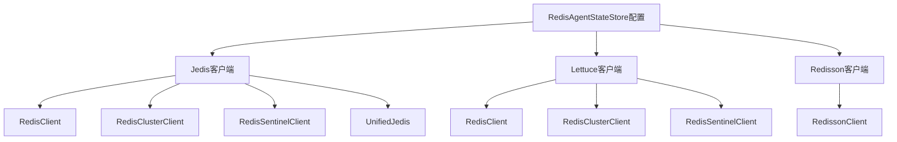
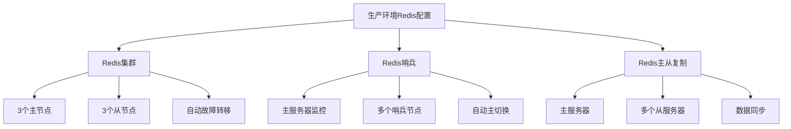

# 上下文管理

<cite>
**本文档引用的文件**
- [RedisAgentStateStore.java](file://agentscope-extensions/agentscope-extensions-redis/src/main/java/io/agentscope/extensions/redis/state/RedisAgentStateStore.java)
- [JedisClientAdapter.java](file://agentscope-extensions/agentscope-extensions-redis/src/main/java/io/agentscope/extensions/redis/state/jedis/JedisClientAdapter.java)
- [LettuceClientAdapter.java](file://agentscope-extensions/agentscope-extensions-redis/src/main/java/io/agentscope/extensions/redis/state/lettuce/LettuceClientAdapter.java)
- [RedisDistributedStore.java](file://agentscope-extensions/agentscope-extensions-redis/src/main/java/io/agentscope/extensions/redis/RedisDistributedStore.java)
- [WorkspaceSharedStoreExample.java](file://agentscope-examples/documentation/src/main/java/io/agentscope/examples/documentation2/harness/workspace/WorkspaceSharedStoreExample.java)
</cite>

## 更新摘要
**所做更改**
- 更新了Redis客户端初始化示例，从RedisClient改为JedisPooled
- 添加了状态存储配置的详细说明
- 提供了更准确的多副本生产环境示例
- 完善了Jedis客户端适配器的使用说明

## 目录
- [概述](#概述)
- [Redis状态存储配置](#redis状态存储配置)
- [Jedis客户端配置](#jedis客户端配置)
- [Lettuce客户端配置](#lettuce客户端配置)
- [多副本生产环境示例](#多副本生产环境示例)
- [状态存储最佳实践](#状态存储最佳实践)
- [故障排除指南](#故障排除指南)

## 概述

Agentscope的上下文管理系统通过Redis提供分布式状态存储能力，支持多种Redis客户端实现和部署模式。本文档详细介绍了如何正确配置和使用Redis状态存储，包括Jedis和Lettuce客户端的选择、多副本环境的配置以及生产环境的最佳实践。

## Redis状态存储配置

RedisAgentStateStore是Agentscope的核心状态存储组件，提供了灵活的Redis集成能力。该组件支持多种Redis部署模式，包括单机、集群和哨兵模式。

### 基本配置选项



**图表来源**
- [RedisAgentStateStore.java:68-177](file://agentscope-extensions/agentscope-extensions-redis/src/main/java/io/agentscope/extensions/redis/state/RedisAgentStateStore.java#L68-L177)

### 关键配置参数

| 参数 | 类型 | 描述 | 默认值 |
|------|------|------|--------|
| jedisClient | JedisClient | Jedis客户端实例 | 必需 |
| lettuceClient | RedisClient | Lettuce客户端实例 | 可选 |
| redissonClient | RedissonClient | Redisson客户端实例 | 可选 |
| keyPrefix | String | 键前缀，用于命名空间隔离 | "agentscope:" |
| databaseIndex | Integer | Redis数据库索引 | 0 |

**章节来源**
- [RedisAgentStateStore.java:68-177](file://agentscope-extensions/agentscope-extensions-redis/src/main/java/io/agentscope/extensions/redis/state/RedisAgentStateStore.java#L68-L177)

## Jedis客户端配置

Jedis是Redis官方推荐的Java客户端，提供了高性能的Redis连接管理能力。在Agentscope中，Jedis客户端通过JedisClientAdapter进行统一适配。

### 单机模式配置

```java
// 使用JedisPooled进行连接池管理
JedisPoolConfig poolConfig = new JedisPoolConfig();
poolConfig.setMaxTotal(20);
poolConfig.setMaxIdle(10);
poolConfig.setMinIdle(5);

JedisPooled jedis = new JedisPooled(poolConfig, "localhost", 6379);
JedisClientAdapter adapter = JedisClientAdapter.of(jedis);

AgentStateStore stateStore = RedisAgentStateStore.builder()
    .jedisClient(adapter)
    .keyPrefix("agentscope:v1:")
    .build();
```

### 集群模式配置

```java
// Redis集群配置
Set<HostAndPort> nodes = new HashSet<>();
nodes.add(new HostAndPort("redis-node1", 7000));
nodes.add(new HostAndPort("redis-node2", 7001));
nodes.add(new HostAndPort("redis-node3", 7002));

RedisClusterClient clusterClient = RedisClusterClient.create(nodes);
JedisClientAdapter adapter = JedisClientAdapter.of(clusterClient);

AgentStateStore stateStore = RedisAgentStateStore.builder()
    .jedisClient(adapter)
    .keyPrefix("agentscope:cluster:")
    .build();
```

### 哨兵模式配置

```java
// Redis哨兵配置
Set<String> sentinels = new HashSet<>();
sentinels.add("localhost:26379");
sentinels.add("localhost:26380");
sentinels.add("localhost:26381");

RedisSentinelClient sentinelClient = RedisSentinelClient.create("mymaster", sentinels);
JedisClientAdapter adapter = JedisClientAdapter.of(sentinelClient);

AgentStateStore stateStore = RedisAgentStateStore.builder()
    .jedisClient(adapter)
    .keyPrefix("agentscope:sentinel:")
    .build();
```

**章节来源**
- [JedisClientAdapter.java:18-86](file://agentscope-extensions/agentscope-extensions-redis/src/main/java/io/agentscope/extensions/redis/state/jedis/JedisClientAdapter.java#L18-L86)
- [WorkspaceSharedStoreExample.java:78](file://agentscope-examples/documentation/src/main/java/io/agentscope/examples/documentation2/harness/workspace/WorkspaceSharedStoreExample.java#L78)

## Lettuce客户端配置

Lettuce是另一个优秀的Redis Java客户端，特别适合异步操作和高级功能需求。

### 基本配置

```java
// 创建Lettuce RedisClient
RedisClient redisClient = RedisClient.create("redis://localhost:6379");

// 构建RedisAgentStateStore
AgentStateStore stateStore = RedisAgentStateStore.builder()
    .lettuceClient(redisClient)
    .build();
```

### 集群模式配置

```java
// Redis集群配置
RedisURI clusterUri = RedisURI.builder()
    .withSentinelMasterId("mymaster")
    .withSentinel("localhost", 26379)
    .withSentinel("localhost", 26380)
    .withSentinel("localhost", 26381)
    .withDatabase(0)
    .build();

RedisClient redisClient = RedisClient.create(clusterUri);

AgentStateStore stateStore = RedisAgentStateStore.builder()
    .lettuceClient(redisClient)
    .build();
```

**章节来源**
- [LettuceClientAdapter.java:72-92](file://agentscope-extensions/agentscope-extensions-redis/src/main/java/io/agentscope/extensions/redis/state/lettuce/LettuceClientAdapter.java#L72-L92)

## 多副本生产环境示例

在生产环境中，建议使用Redis集群或哨兵模式来确保高可用性和数据持久性。

### 生产级配置示例



**图表来源**
- [RedisDistributedStore.java:49](file://agentscope-extensions/agentscope-extensions-redis/src/main/java/io/agentscope/extensions/redis/RedisDistributedStore.java#L49)

### 高可用配置要点

1. **连接池配置**：合理设置最大连接数和超时时间
2. **重试机制**：配置适当的重试策略和退避算法
3. **健康检查**：定期检查Redis连接状态
4. **监控告警**：建立连接池和Redis实例的监控体系

### 环境变量配置

```bash
# Redis连接配置
REDIS_HOST=redis-cluster.example.com
REDIS_PORT=6379
REDIS_PASSWORD=your_password
REDIS_DATABASE=0

# 连接池配置
REDIS_MAX_TOTAL=50
REDIS_MAX_IDLE=20
REDIS_MIN_IDLE=5
REDIS_CONNECTION_TIMEOUT=2000
REDIS_SO_TIMEOUT=2000
```

**章节来源**
- [RedisDistributedStore.java:20](file://agentscope-extensions/agentscope-extensions-redis/src/main/java/io/agentscope/extensions/redis/RedisDistributedStore.java#L20)

## 状态存储最佳实践

### 键命名规范

```java
// 推荐的键命名格式
String key = String.format("%s:%s:%s", 
    keyPrefix, 
    entityType, 
    entityId);

// 示例：用户会话状态
String userSessionKey = "agentscope:v1:session:user_123";
```

### 数据序列化策略

```java
// JSON序列化配置
ObjectMapper objectMapper = new ObjectMapper();
objectMapper.registerModule(new JavaTimeModule());

// 自定义序列化器
RedisSerializer<StateData> serializer = new JsonSerializer<>(objectMapper);
```

### 缓存策略

```java
// TTL设置（秒）
int ttl = 3600; // 1小时

// 批量操作优化
Pipeline pipeline = jedis.pipelined();
pipeline.multi();
// 执行多个命令
pipeline.exec();
```

## 故障排除指南

### 常见问题及解决方案

| 问题类型 | 症状 | 解决方案 |
|----------|------|----------|
| 连接超时 | `JedisConnectionException` | 检查网络连通性和防火墙设置 |
| 认证失败 | `JedisAccessControlException` | 验证密码和权限配置 |
| 内存不足 | `JedisDataException` | 调整Redis内存限制和淘汰策略 |
| 连接池耗尽 | `NoSuchElementException` | 增加连接池大小或优化使用模式 |

### 性能监控指标

```java
// 连接池监控
JedisPoolConfig config = jedisPool.getPoolConfig();
logger.info("活跃连接数: {}", config.getNumActive());
logger.info("空闲连接数: {}", config.getNumIdle());
logger.info("等待连接数: {}", config.getNumWaiters());
```

### 日志配置

```xml
<!-- logback配置示例 -->
<configuration>
    <logger name="io.agentscope.extensions.redis" level="DEBUG"/>
    <logger name="redis.clients.jedis" level="WARN"/>
</configuration>
```

**章节来源**
- [RedisAgentStateStore.java:68-177](file://agentscope-extensions/agentscope-extensions-redis/src/main/java/io/agentscope/extensions/redis/state/RedisAgentStateStore.java#L68-L177)
- [JedisClientAdapter.java:18-86](file://agentscope-extensions/agentscope-extensions-redis/src/main/java/io/agentscope/extensions/redis/state/jedis/JedisClientAdapter.java#L18-L86)
