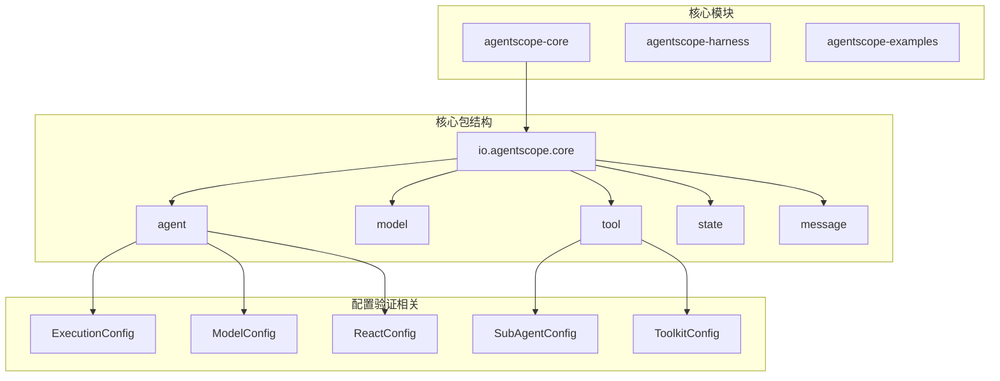
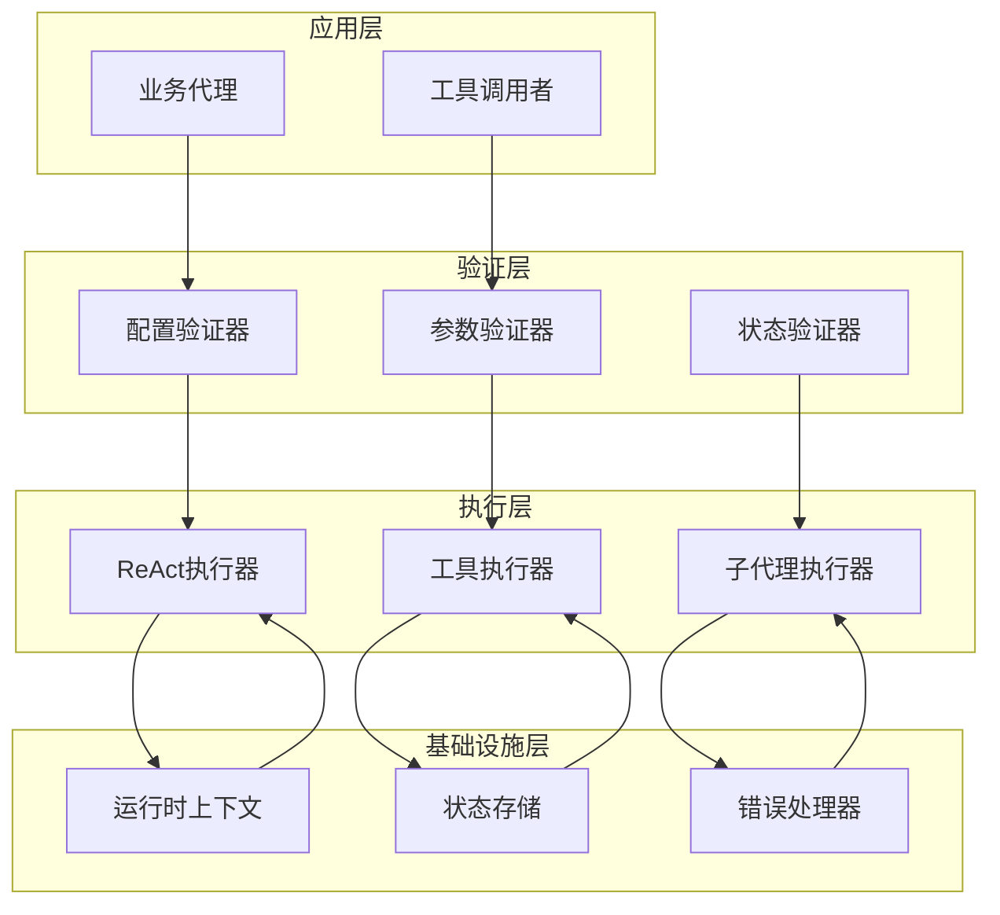
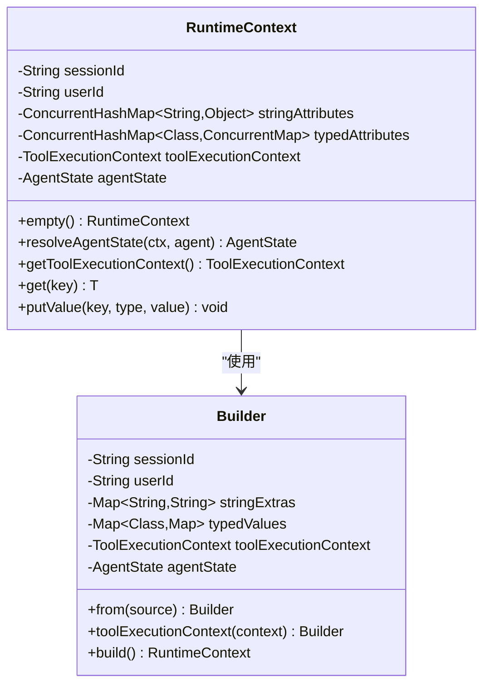
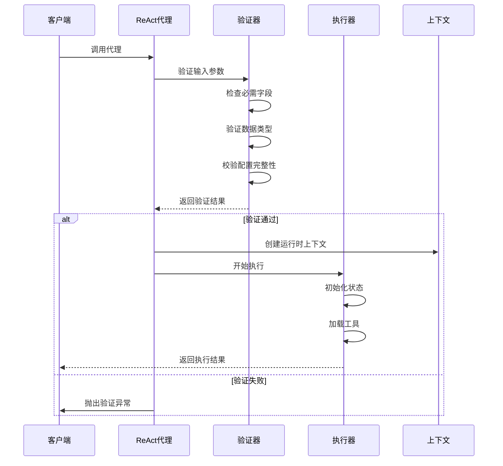
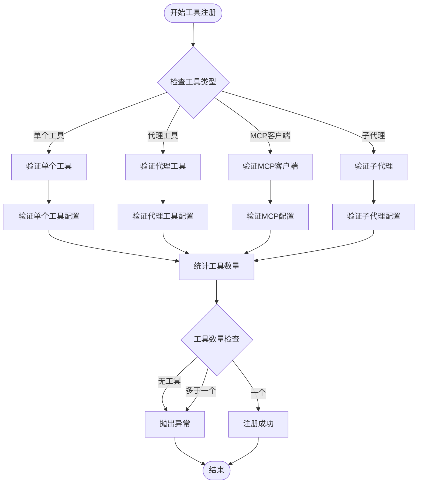
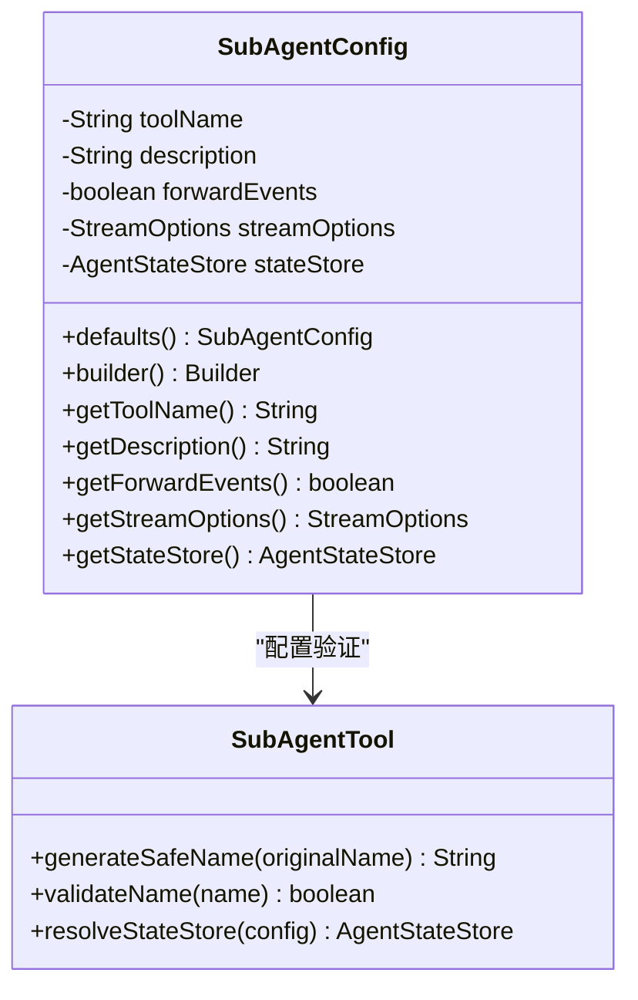
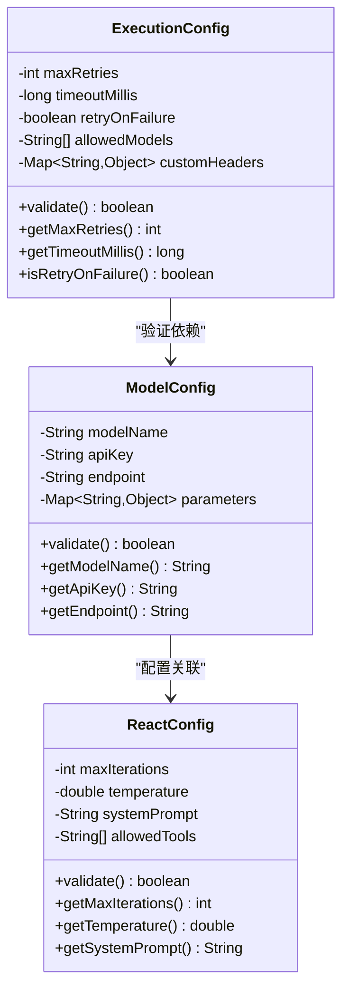
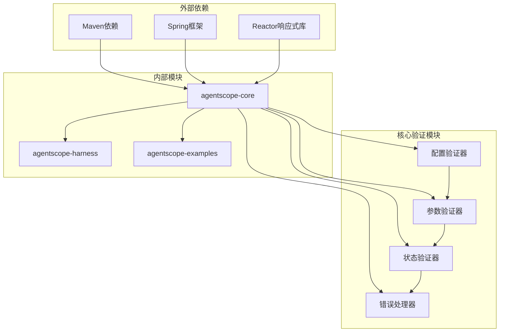

# 执行配置验证

<cite>
**本文档引用的文件**
- [ReActAgent.java](file://agentscope-core/src/main/java/io/agentscope/core/ReActAgent.java)
- [AgentBase.java](file://agentscope-core/src/main/java/io/agentscope/core/agent/AgentBase.java)
- [RuntimeContext.java](file://agentscope-core/src/main/java/io/agentscope/core/agent/RuntimeContext.java)
- [Toolkit.java](file://agentscope-core/src/main/java/io/agentscope/core/tool/Toolkit.java)
- [SubAgentConfig.java](file://agentscope-core/src/main/java/io/agentscope/core/tool/subagent/SubAgentConfig.java)
- [SubAgentTool.java](file://agentscope-core/src/main/java/io/agentscope/core/tool/subagent/SubAgentTool.java)
- [McpTool.java](file://agentscope-core/src/main/java/io/agentscope/core/tool/mcp/McpTool.java)
- [ExecutionConfig.java](file://agentscope-core/src/main/java/io/agentscope/core/model/ExecutionConfig.java)
- [ModelConfig.java](file://agentscope-core/src/main/java/io/agentscope/core/agent/config/ModelConfig.java)
- [ReactConfig.java](file://agentscope-core/src/main/java/io/agentscope/core/agent/config/ReactConfig.java)
- [ToolContextState.java](file://agentscope-core/src/main/java/io/agentscope/core/state/ToolContextState.java)
</cite>

## 目录
1. [简介](#简介)
2. [项目结构](#项目结构)
3. [核心组件](#核心组件)
4. [架构概览](#架构概览)
5. [详细组件分析](#详细组件分析)
6. [依赖关系分析](#依赖关系分析)
7. [性能考虑](#性能考虑)
8. [故障排除指南](#故障排除指南)
9. [结论](#结论)

## 简介

执行配置验证是Agentscope Java框架中的一个关键功能模块，负责确保代理执行过程中的配置正确性和一致性。该系统通过多层次的验证机制，包括运行时上下文验证、工具注册验证、子代理配置验证等，为整个代理执行生命周期提供安全保障。

本文档深入分析了Agentscope中执行配置验证的实现机制，涵盖了从基础架构到具体实现的技术细节，旨在帮助开发者理解和优化代理执行配置验证系统。

## 项目结构

Agentscope Java项目采用模块化架构设计，执行配置验证功能主要分布在以下核心模块中：

**图表来源**
- [ReActAgent.java:510-969](file://agentscope-core/src/main/java/io/agentscope/core/ReActAgent.java#L510-L969)
- [AgentBase.java:47-533](file://agentscope-core/src/main/java/io/agentscope/core/agent/AgentBase.java#L47-L533)

**章节来源**
- [ReActAgent.java:510-969](file://agentscope-core/src/main/java/io/agentscope/core/ReActAgent.java#L510-L969)
- [AgentBase.java:47-533](file://agentscope-core/src/main/java/io/agentscope/core/agent/AgentBase.java#L47-L533)

## 核心组件

执行配置验证系统由多个相互协作的核心组件构成，每个组件都有其特定的职责和验证功能：

### 运行时上下文管理器
运行时上下文管理器负责维护代理执行过程中的状态信息，包括用户标识、会话信息和工具执行上下文。

### ReAct代理执行器
ReAct代理执行器是执行配置验证的核心协调者，负责在代理生命周期的各个阶段进行配置验证和状态管理。

### 工具注册验证器
工具注册验证器确保所有注册的工具都符合配置要求，防止重复注册和不兼容的工具组合。

### 子代理配置验证器
子代理配置验证器专门处理子代理的配置验证，包括名称生成、事件转发和状态存储等验证逻辑。

**章节来源**
- [RuntimeContext.java:57-412](file://agentscope-core/src/main/java/io/agentscope/core/agent/RuntimeContext.java#L57-L412)
- [ReActAgent.java:510-3424](file://agentscope-core/src/main/java/io/agentscope/core/ReActAgent.java#L510-L3424)
- [Toolkit.java:895-1005](file://agentscope-core/src/main/java/io/agentscope/core/tool/Toolkit.java#L895-L1005)

## 架构概览

执行配置验证系统的整体架构采用了分层设计模式，确保各层之间的职责清晰分离：

**图表来源**
- [AgentBase.java:299-631](file://agentscope-core/src/main/java/io/agentscope/core/agent/AgentBase.java#L299-L631)
- [ReActAgent.java:510-969](file://agentscope-core/src/main/java/io/agentscope/core/ReActAgent.java#L510-L969)

## 详细组件分析

### 运行时上下文验证器

运行时上下文验证器是执行配置验证的基础组件，负责确保每次代理调用的上下文信息都是有效的。

**图表来源**
- [RuntimeContext.java:57-412](file://agentscope-core/src/main/java/io/agentscope/core/agent/RuntimeContext.java#L57-L412)

运行时上下文验证的关键特性包括：
- **线程安全**：使用并发数据结构确保多线程环境下的安全性
- **类型安全**：支持泛型类型的属性存储和检索
- **可扩展性**：允许动态添加自定义属性
- **默认值处理**：提供空上下文的创建和默认值填充

**章节来源**
- [RuntimeContext.java:57-412](file://agentscope-core/src/main/java/io/agentscope/core/agent/RuntimeContext.java#L57-L412)

### ReAct代理执行验证流程

ReAct代理执行器实现了复杂的执行配置验证流程，确保代理在执行过程中的每个阶段都符合配置要求。

**图表来源**
- [ReActAgent.java:510-969](file://agentscope-core/src/main/java/io/agentscope/core/ReActAgent.java#L510-L969)
- [AgentBase.java:299-631](file://agentscope-core/src/main/java/io/agentscope/core/agent/AgentBase.java#L299-L631)

**章节来源**
- [ReActAgent.java:510-969](file://agentscope-core/src/main/java/io/agentscope/core/ReActAgent.java#L510-L969)
- [AgentBase.java:299-631](file://agentscope-core/src/main/java/io/agentscope/core/agent/AgentBase.java#L299-L631)

### 工具注册验证器

工具注册验证器确保所有注册的工具都符合配置要求，防止重复注册和不兼容的工具组合。

**图表来源**
- [Toolkit.java:983-1005](file://agentscope-core/src/main/java/io/agentscope/core/tool/Toolkit.java#L983-L1005)

**章节来源**
- [Toolkit.java:983-1005](file://agentscope-core/src/main/java/io/agentscope/core/tool/Toolkit.java#L983-L1005)

### 子代理配置验证器

子代理配置验证器专门处理子代理的配置验证，包括名称生成、事件转发和状态存储等验证逻辑。

**图表来源**
- [SubAgentConfig.java:63-114](file://agentscope-core/src/main/java/io/agentscope/core/tool/subagent/SubAgentConfig.java#L63-L114)
- [SubAgentTool.java:525-541](file://agentscope-core/src/main/java/io/agentscope/core/tool/subagent/SubAgentTool.java#L525-L541)

**章节来源**
- [SubAgentConfig.java:63-114](file://agentscope-core/src/main/java/io/agentscope/core/tool/subagent/SubAgentConfig.java#L63-L114)
- [SubAgentTool.java:525-541](file://agentscope-core/src/main/java/io/agentscope/core/tool/subagent/SubAgentTool.java#L525-L541)

### 执行配置验证器

执行配置验证器负责验证模型调用和执行过程中的各种配置参数。

**图表来源**
- [ExecutionConfig.java](file://agentscope-core/src/main/java/io/agentscope/core/model/ExecutionConfig.java)
- [ModelConfig.java](file://agentscope-core/src/main/java/io/agentscope/core/agent/config/ModelConfig.java)
- [ReactConfig.java](file://agentscope-core/src/main/java/io/agentscope/core/agent/config/ReactConfig.java)

**章节来源**
- [ExecutionConfig.java](file://agentscope-core/src/main/java/io/agentscope/core/model/ExecutionConfig.java)
- [ModelConfig.java](file://agentscope-core/src/main/java/io/agentscope/core/agent/config/ModelConfig.java)
- [ReactConfig.java](file://agentscope-core/src/main/java/io/agentscope/core/agent/config/ReactConfig.java)

## 依赖关系分析

执行配置验证系统的依赖关系呈现典型的分层架构特征，各层之间通过明确定义的接口进行交互。

**图表来源**
- [Toolkit.java:895-1005](file://agentscope-core/src/main/java/io/agentscope/core/tool/Toolkit.java#L895-L1005)
- [ReActAgent.java:510-969](file://agentscope-core/src/main/java/io/agentscope/core/ReActAgent.java#L510-L969)

**章节来源**
- [Toolkit.java:895-1005](file://agentscope-core/src/main/java/io/agentscope/core/tool/Toolkit.java#L895-L1005)
- [ReActAgent.java:510-969](file://agentscope-core/src/main/java/io/agentscope/core/ReActAgent.java#L510-L969)

## 性能考虑

执行配置验证系统在设计时充分考虑了性能优化，采用了多种策略来确保验证过程的高效性：

### 缓存策略
- **状态缓存**：使用`ConcurrentHashMap`缓存代理状态，避免重复计算
- **配置缓存**：缓存验证过的配置以减少重复验证开销
- **工具注册缓存**：缓存已验证的工具注册信息

### 异步处理
- **非阻塞验证**：使用Reactor响应式编程模型进行异步验证
- **并行验证**：支持多个验证任务的并行执行
- **流式处理**：对大量数据进行流式验证处理

### 内存优化
- **对象池**：重用验证器实例减少内存分配
- **延迟加载**：按需加载验证资源
- **弱引用**：使用弱引用避免内存泄漏

## 故障排除指南

### 常见验证错误及解决方案

#### 工具注册验证错误
当工具注册过程中出现验证错误时，通常会出现以下情况：

**错误类型**：`IllegalStateException`
**触发条件**：未设置任何工具或同时设置了多个工具类型
**解决方案**：
1. 确保只选择一种工具注册方式
2. 检查工具配置的完整性
3. 验证工具依赖项的可用性

#### 子代理配置验证错误
子代理配置验证失败时的常见问题：

**错误类型**：配置参数无效
**触发条件**：子代理名称不符合规范或状态存储配置错误
**解决方案**：
1. 使用`SubAgentConfig.defaults()`获取默认配置
2. 确保子代理名称只包含允许的字符
3. 验证状态存储的可用性

#### 运行时上下文验证错误
运行时上下文验证失败时的处理方法：

**错误类型**：`IllegalStateException`
**触发条件**：在错误的时间点访问运行时上下文
**解决方案**：
1. 确保在代理执行生命周期内访问上下文
2. 检查上下文的初始化状态
3. 验证上下文的线程安全性

**章节来源**
- [Toolkit.java:983-1005](file://agentscope-core/src/main/java/io/agentscope/core/tool/Toolkit.java#L983-L1005)
- [SubAgentTool.java:525-541](file://agentscope-core/src/main/java/io/agentscope/core/tool/subagent/SubAgentTool.java#L525-L541)
- [ReActAgent.java:961-969](file://agentscope-core/src/main/java/io/agentscope/core/ReActAgent.java#L961-L969)

## 结论

执行配置验证系统是Agentscope Java框架的重要组成部分，通过多层次、多维度的验证机制确保代理执行过程的可靠性和安全性。该系统的设计体现了现代软件架构的最佳实践，包括：

### 主要成就
- **全面的验证覆盖**：从基础配置到复杂执行场景的全方位验证
- **高性能设计**：采用缓存、异步和内存优化技术提升性能
- **灵活的扩展性**：支持自定义验证规则和扩展验证器
- **完善的错误处理**：提供详细的错误信息和恢复机制

### 技术特色
- **响应式编程**：利用Reactor库实现非阻塞的验证流程
- **类型安全**：通过泛型和编译时检查确保类型安全
- **并发安全**：使用线程安全的数据结构和同步机制
- **配置驱动**：支持动态配置和运行时调整

### 未来发展方向
- **AI辅助验证**：集成机器学习算法进行智能配置验证
- **分布式验证**：支持跨节点的分布式配置验证
- **实时监控**：提供验证过程的实时监控和告警
- **自动化修复**：实现配置错误的自动修复功能

执行配置验证系统为Agentscope框架提供了坚实的基础，确保了代理执行过程的稳定性和可靠性，为构建复杂的AI代理系统奠定了重要基础。
