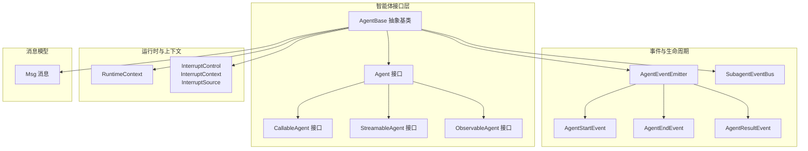
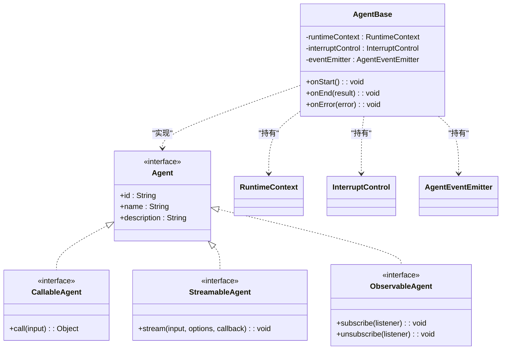
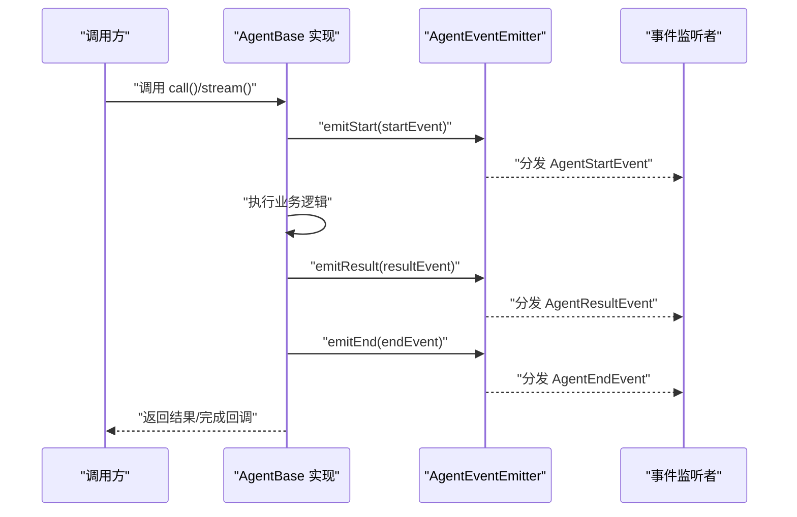
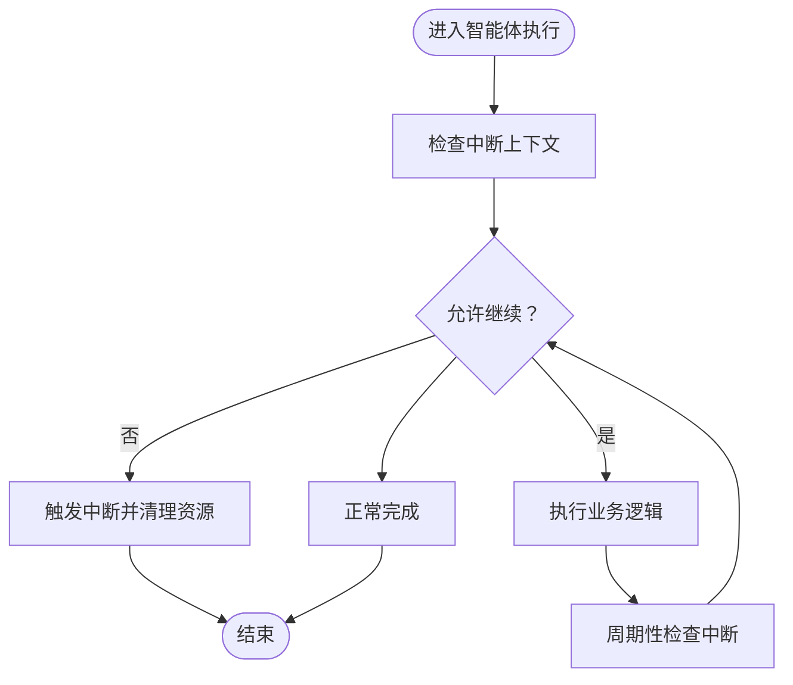
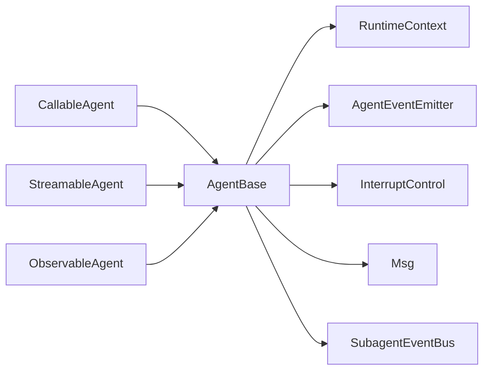

# 智能体基础概念

<cite>
**本文引用的文件**
- [Agent.java](file://agentscope-core/src/main/java/io/agentscope/core/agent/Agent.java)
- [CallableAgent.java](file://agentscope-core/src/main/java/io/agentscope/core/agent/CallableAgent.java)
- [StreamableAgent.java](file://agentscope-core/src/main/java/io/agentscope/core/agent/StreamableAgent.java)
- [ObservableAgent.java](file://agentscope-core/src/main/java/io/agentscope/core/agent/ObservableAgent.java)
- [AgentBase.java](file://agentscope-core/src/main/java/io/agentscope/core/agent/AgentBase.java)
- [RuntimeContext.java](file://agentscope-core/src/main/java/io/agentscope/core/RuntimeContext.java)
- [InterruptControl.java](file://agentscope-core/src/main/java/io/agentscope/core/interruption/InterruptControl.java)
- [InterruptContext.java](file://agentscope-core/src/main/java/io/agentscope/core/interruption/InterruptContext.java)
- [InterruptSource.java](file://agentscope-core/src/main/java/io/agentscope/core/interruption/InterruptSource.java)
- [Msg.java](file://agentscope-core/src/main/java/io/agentscope/core/message/Msg.java)
- [SubagentEventBus.java](file://agentscope-core/src/main/java/io/agentscope/core/SubagentEventBus.java)
- [AgentEventEmitter.java](file://agentscope-core/src/main/java/io/agentscope/core/event/AgentEventEmitter.java)
- [AgentStartEvent.java](file://agentscope-core/src/main/java/io/agentscope/core/event/AgentStartEvent.java)
- [AgentEndEvent.java](file://agentscope-core/src/main/java/io/agentscope/core/event/AgentEndEvent.java)
- [AgentResultEvent.java](file://agentscope-core/src/main/java/io/agentscope/core/event/AgentResultEvent.java)
- [ReActAgent.java](file://agentscope-core/src/main/java/io/agentscope/core/ReActAgent.java)
</cite>

## 目录
1. [引言](#引言)
2. [项目结构](#项目结构)
3. [核心组件](#核心组件)
4. [架构总览](#架构总览)
5. [详细组件分析](#详细组件分析)
6. [依赖关系分析](#依赖关系分析)
7. [性能考虑](#性能考虑)
8. [故障排查指南](#故障排查指南)
9. [结论](#结论)

## 引言
本文件面向希望深入理解智能体（Agent）基础概念与设计哲学的开发者，系统阐述 Agent 接口体系、三大核心能力（可调用、可流式、可观测）、生命周期与状态管理、上下文传递机制、标识与命名策略、以及中断机制的实现与使用场景。通过类图、时序图与流程图，帮助读者从代码层面把握智能体的运行机理与扩展点。

## 项目结构
围绕智能体的基础能力与运行时支撑，核心代码位于 agentscope-core 模块的 agent、event、message、interruption 等包中。下图给出与本文主题直接相关的模块与文件映射：

图表来源
- [Agent.java:1-200](file://agentscope-core/src/main/java/io/agentscope/core/agent/Agent.java#L1-L200)
- [CallableAgent.java:1-120](file://agentscope-core/src/main/java/io/agentscope/core/agent/CallableAgent.java#L1-L120)
- [StreamableAgent.java:1-120](file://agentscope-core/src/main/java/io/agentscope/core/agent/StreamableAgent.java#L1-L120)
- [ObservableAgent.java:1-120](file://agentscope-core/src/main/java/io/agentscope/core/agent/ObservableAgent.java#L1-L120)
- [AgentBase.java:1-300](file://agentscope-core/src/main/java/io/agentscope/core/agent/AgentBase.java#L1-L300)
- [AgentEventEmitter.java:1-120](file://agentscope-core/src/main/java/io/agentscope/core/event/AgentEventEmitter.java#L1-L120)
- [AgentStartEvent.java:1-80](file://agentscope-core/src/main/java/io/agentscope/core/event/AgentStartEvent.java#L1-L80)
- [AgentEndEvent.java:1-80](file://agentscope-core/src/main/java/io/agentscope/core/event/AgentEndEvent.java#L1-L80)
- [AgentResultEvent.java:1-80](file://agentscope-core/src/main/java/io/agentscope/core/event/AgentResultEvent.java#L1-L80)
- [RuntimeContext.java:1-200](file://agentscope-core/src/main/java/io/agentscope/core/RuntimeContext.java#L1-L200)
- [InterruptControl.java:1-120](file://agentscope-core/src/main/java/io/agentscope/core/interruption/InterruptControl.java#L1-L120)
- [InterruptContext.java:1-120](file://agentscope-core/src/main/java/io/agentscope/core/interruption/InterruptContext.java#L1-L120)
- [InterruptSource.java:1-120](file://agentscope-core/src/main/java/io/agentscope/core/interruption/InterruptSource.java#L1-L120)
- [Msg.java:1-200](file://agentscope-core/src/main/java/io/agentscope/core/message/Msg.java#L1-L200)
- [SubagentEventBus.java:1-120](file://agentscope-core/src/main/java/io/agentscope/core/SubagentEventBus.java#L1-L120)

章节来源
- [Agent.java:1-200](file://agentscope-core/src/main/java/io/agentscope/core/agent/Agent.java#L1-L200)
- [AgentBase.java:1-300](file://agentscope-core/src/main/java/io/agentscope/core/agent/AgentBase.java#L1-L300)

## 核心组件
本节聚焦三大核心能力接口及其职责边界，以及抽象基类如何统一接入事件、上下文与中断等横切关注点。

- 可调用能力（CallableAgent）
  - 职责：提供同步执行入口，返回标准结果对象；强调“一次性调用、确定性输出”的语义。
  - 关键点：输入参数封装、执行前校验、异常传播、结果归一化。
  - 典型使用：对话、推理、工具调用等需要即时响应的场景。

- 可流式能力（StreamableAgent）
  - 职责：支持增量输出与流式回调，便于实时渲染与交互体验优化。
  - 关键点：流式选项配置、增量事件分发、背压控制、流结束信号。
  - 典型使用：长文本生成、多模态输出、逐步思考展示。

- 可观测能力（ObservableAgent）
  - 职责：暴露生命周期事件与内部状态变化，便于外部观察与调试。
  - 关键点：事件发射器、事件类型枚举、订阅/取消订阅、事件聚合。
  - 典型使用：日志追踪、指标采集、可视化面板、审计留痕。

- 抽象基类（AgentBase）
  - 职责：统一实现三大能力的组合、事件生命周期管理、运行时上下文注入、中断控制集成、消息模型适配。
  - 关键点：模板方法模式、钩子扩展点、状态持久化接口、子智能体事件总线。

章节来源
- [CallableAgent.java:1-120](file://agentscope-core/src/main/java/io/agentscope/core/agent/CallableAgent.java#L1-L120)
- [StreamableAgent.java:1-120](file://agentscope-core/src/main/java/io/agentscope/core/agent/StreamableAgent.java#L1-L120)
- [ObservableAgent.java:1-120](file://agentscope-core/src/main/java/io/agentscope/core/agent/ObservableAgent.java#L1-L120)
- [AgentBase.java:1-300](file://agentscope-core/src/main/java/io/agentscope/core/agent/AgentBase.java#L1-L300)

## 架构总览
下图展示智能体接口体系、事件发射与订阅、运行时上下文与中断控制之间的交互关系，体现“接口解耦、基类聚合、事件驱动”的设计思想。

图表来源
- [Agent.java:1-200](file://agentscope-core/src/main/java/io/agentscope/core/agent/Agent.java#L1-L200)
- [CallableAgent.java:1-120](file://agentscope-core/src/main/java/io/agentscope/core/agent/CallableAgent.java#L1-L120)
- [StreamableAgent.java:1-120](file://agentscope-core/src/main/java/io/agentscope/core/agent/StreamableAgent.java#L1-L120)
- [ObservableAgent.java:1-120](file://agentscope-core/src/main/java/io/agentscope/core/agent/ObservableAgent.java#L1-L120)
- [AgentBase.java:1-300](file://agentscope-core/src/main/java/io/agentscope/core/agent/AgentBase.java#L1-L300)

## 详细组件分析

### 接口继承关系与方法签名
- Agent 接口
  - 定义智能体的唯一标识、名称与描述信息，作为跨模块识别与展示的基础元数据。
  - 方法签名参考：[Agent.java:1-200](file://agentscope-core/src/main/java/io/agentscope/core/agent/Agent.java#L1-L200)

- CallableAgent 接口
  - 提供 call(input) 同步调用方法，返回统一结果对象，便于上层编排与错误处理。
  - 方法签名参考：[CallableAgent.java:1-120](file://agentscope-core/src/main/java/io/agentscope/core/agent/CallableAgent.java#L1-L120)

- StreamableAgent 接口
  - 提供 stream(input, options, callback) 流式输出方法，支持增量回调与流结束通知。
  - 方法签名参考：[StreamableAgent.java:1-120](file://agentscope-core/src/main/java/io/agentscope/core/agent/StreamableAgent.java#L1-L120)

- ObservableAgent 接口
  - 提供 subscribe/unsubscribe 订阅能力，用于接收生命周期与中间事件。
  - 方法签名参考：[ObservableAgent.java:1-120](file://agentscope-core/src/main/java/io/agentscope/core/agent/ObservableAgent.java#L1-L120)

- AgentBase 抽象类
  - 组合三大能力，统一注入 RuntimeContext、InterruptControl、AgentEventEmitter。
  - 生命周期钩子：onStart/onEnd/onError，事件发射：emitStart/emitEnd/emitResult。
  - 方法签名参考：[AgentBase.java:1-300](file://agentscope-core/src/main/java/io/agentscope/core/agent/AgentBase.java#L1-L300)

章节来源
- [Agent.java:1-200](file://agentscope-core/src/main/java/io/agentscope/core/agent/Agent.java#L1-L200)
- [CallableAgent.java:1-120](file://agentscope-core/src/main/java/io/agentscope/core/agent/CallableAgent.java#L1-L120)
- [StreamableAgent.java:1-120](file://agentscope-core/src/main/java/io/agentscope/core/agent/StreamableAgent.java#L1-L120)
- [ObservableAgent.java:1-120](file://agentscope-core/src/main/java/io/agentscope/core/agent/ObservableAgent.java#L1-L120)
- [AgentBase.java:1-300](file://agentscope-core/src/main/java/io/agentscope/core/agent/AgentBase.java#L1-L300)

### 生命周期管理与事件发射
智能体的生命周期由开始、执行、结束三个阶段构成，配合事件发射器对外广播。下图展示典型调用序列：

图表来源
- [AgentBase.java:1-300](file://agentscope-core/src/main/java/io/agentscope/core/agent/AgentBase.java#L1-L300)
- [AgentEventEmitter.java:1-120](file://agentscope-core/src/main/java/io/agentscope/core/event/AgentEventEmitter.java#L1-L120)
- [AgentStartEvent.java:1-80](file://agentscope-core/src/main/java/io/agentscope/core/event/AgentStartEvent.java#L1-L80)
- [AgentEndEvent.java:1-80](file://agentscope-core/src/main/java/io/agentscope/core/event/AgentEndEvent.java#L1-L80)
- [AgentResultEvent.java:1-80](file://agentscope-core/src/main/java/io/agentscope/core/event/AgentResultEvent.java#L1-L80)

章节来源
- [AgentBase.java:1-300](file://agentscope-core/src/main/java/io/agentscope/core/agent/AgentBase.java#L1-L300)
- [AgentEventEmitter.java:1-120](file://agentscope-core/src/main/java/io/agentscope/core/event/AgentEventEmitter.java#L1-L120)

### 上下文传递机制
- 运行时上下文（RuntimeContext）
  - 作用：在一次智能体会话中贯穿所有阶段与子组件，承载会话级状态、配置与共享资源。
  - 特性：线程安全、可扩展、可序列化（视实现而定），避免全局变量污染。
  - 使用建议：仅存放必要字段，避免过重上下文导致内存压力。

- 消息模型（Msg）
  - 作用：统一消息载体，支持文本、图像、工具调用/结果等多模态内容。
  - 设计：消息头元数据、内容块集合、角色与来源标记，便于下游格式化与路由。

- 子智能体事件总线（SubagentEventBus）
  - 作用：在父-子智能体协作时，桥接事件流，实现跨层级可观测与调试。
  - 行为：订阅、转发、去重、限流（可选）。

章节来源
- [RuntimeContext.java:1-200](file://agentscope-core/src/main/java/io/agentscope/core/RuntimeContext.java#L1-L200)
- [Msg.java:1-200](file://agentscope-core/src/main/java/io/agentscope/core/message/Msg.java#L1-L200)
- [SubagentEventBus.java:1-120](file://agentscope-core/src/main/java/io/agentscope/core/SubagentEventBus.java#L1-L120)

### 中断机制实现原理与使用场景
- 中断控制（InterruptControl）
  - 作用：在异步或长时间运行的任务中，提供受控中断能力，避免资源泄漏与不可终止的阻塞。
  - 机制：基于中断令牌与上下文传播，结合超时、外部请求与策略触发。

- 中断上下文（InterruptContext）
  - 作用：封装当前中断状态与触发源，便于在任意调用栈中查询与传播。

- 中断来源（InterruptSource）
  - 作用：声明中断来源类型（如用户请求、系统策略、外部信号），用于策略匹配与权限判断。

- 使用场景
  - 用户主动停止：在流式输出过程中响应停止信号。
  - 超时保护：超过阈值自动中断，防止长时间占用。
  - 外部干预：运维或管理员远程触发中断，保障系统稳定性。

图表来源
- [InterruptControl.java:1-120](file://agentscope-core/src/main/java/io/agentscope/core/interruption/InterruptControl.java#L1-L120)
- [InterruptContext.java:1-120](file://agentscope-core/src/main/java/io/agentscope/core/interruption/InterruptContext.java#L1-L120)
- [InterruptSource.java:1-120](file://agentscope-core/src/main/java/io/agentscope/core/interruption/InterruptSource.java#L1-L120)

章节来源
- [InterruptControl.java:1-120](file://agentscope-core/src/main/java/io/agentscope/core/interruption/InterruptControl.java#L1-L120)
- [InterruptContext.java:1-120](file://agentscope-core/src/main/java/io/agentscope/core/interruption/InterruptContext.java#L1-L120)
- [InterruptSource.java:1-120](file://agentscope-core/src/main/java/io/agentscope/core/interruption/InterruptSource.java#L1-L120)

### 实际代码示例（路径指引）
以下为常见实现与用法的代码路径指引，便于快速定位与参考：
- 同步调用示例（CallableAgent）
  - 路径参考：[CallableAgent.java:1-120](file://agentscope-core/src/main/java/io/agentscope/core/agent/CallableAgent.java#L1-L120)
- 流式输出示例（StreamableAgent）
  - 路径参考：[StreamableAgent.java:1-120](file://agentscope-core/src/main/java/io/agentscope/core/agent/StreamableAgent.java#L1-L120)
- 观察与订阅示例（ObservableAgent）
  - 路径参考：[ObservableAgent.java:1-120](file://agentscope-core/src/main/java/io/agentscope/core/agent/ObservableAgent.java#L1-L120)
- 生命周期事件发射示例（AgentBase）
  - 路径参考：[AgentBase.java:1-300](file://agentscope-core/src/main/java/io/agentscope/core/agent/AgentBase.java#L1-L300)
- 中断控制使用示例
  - 路径参考：[InterruptControl.java:1-120](file://agentscope-core/src/main/java/io/agentscope/core/interruption/InterruptControl.java#L1-L120)

## 依赖关系分析
- 松耦合接口设计：三大能力以独立接口存在，便于按需组合与替换。
- 基类聚合：AgentBase 统一实现与装配，降低重复代码与提升一致性。
- 事件驱动：通过 AgentEventEmitter 与事件类型，实现跨组件解耦通信。
- 上下文与消息：RuntimeContext 与 Msg 作为横切基础设施，贯穿执行链路。
- 中断控制：以 InterruptControl/Context/Source 形成闭环，保证可控退出。

图表来源
- [AgentBase.java:1-300](file://agentscope-core/src/main/java/io/agentscope/core/agent/AgentBase.java#L1-L300)
- [RuntimeContext.java:1-200](file://agentscope-core/src/main/java/io/agentscope/core/RuntimeContext.java#L1-L200)
- [AgentEventEmitter.java:1-120](file://agentscope-core/src/main/java/io/agentscope/core/event/AgentEventEmitter.java#L1-L120)
- [InterruptControl.java:1-120](file://agentscope-core/src/main/java/io/agentscope/core/interruption/InterruptControl.java#L1-L120)
- [Msg.java:1-200](file://agentscope-core/src/main/java/io/agentscope/core/message/Msg.java#L1-L200)
- [SubagentEventBus.java:1-120](file://agentscope-core/src/main/java/io/agentscope/core/SubagentEventBus.java#L1-L120)

## 性能考虑
- 事件风暴防护：在高频流式输出场景中，合理设置事件采样与批处理，避免事件风暴影响主线程。
- 上下文瘦身：RuntimeContext 中仅保留必要字段，避免大对象频繁拷贝。
- 中断早返回：在循环或等待中定期检查中断状态，缩短停机时间。
- 缓存与复用：对昂贵资源（连接、模型实例）进行池化与复用，减少初始化开销。
- 异步与并发：利用流式回调与事件发射的异步特性，避免阻塞调用链。

## 故障排查指南
- 无法收到事件回调
  - 检查是否正确订阅与未被取消订阅。
  - 确认事件发射器未被提前关闭或销毁。
  - 参考：[AgentEventEmitter.java:1-120](file://agentscope-core/src/main/java/io/agentscope/core/event/AgentEventEmitter.java#L1-L120)

- 流式输出卡顿或中断无效
  - 确认中断上下文已正确传播到执行线程。
  - 检查中断策略与来源是否匹配。
  - 参考：[InterruptControl.java:1-120](file://agentscope-core/src/main/java/io/agentscope/core/interruption/InterruptControl.java#L1-L120)，[InterruptContext.java:1-120](file://agentscope-core/src/main/java/io/agentscope/core/interruption/InterruptContext.java#L1-L120)，[InterruptSource.java:1-120](file://agentscope-core/src/main/java/io/agentscope/core/interruption/InterruptSource.java#L1-L120)

- 结果不一致或上下文丢失
  - 核对 RuntimeContext 的注入与传递路径。
  - 避免在多线程环境中共享可变状态。
  - 参考：[RuntimeContext.java:1-200](file://agentscope-core/src/main/java/io/agentscope/core/RuntimeContext.java#L1-L200)

- 子智能体事件未透传
  - 检查 SubagentEventBus 是否启用与配置正确。
  - 参考：[SubagentEventBus.java:1-120](file://agentscope-core/src/main/java/io/agentscope/core/SubagentEventBus.java#L1-L120)

章节来源
- [AgentEventEmitter.java:1-120](file://agentscope-core/src/main/java/io/agentscope/core/event/AgentEventEmitter.java#L1-L120)
- [InterruptControl.java:1-120](file://agentscope-core/src/main/java/io/agentscope/core/interruption/InterruptControl.java#L1-L120)
- [InterruptContext.java:1-120](file://agentscope-core/src/main/java/io/agentscope/core/interruption/InterruptContext.java#L1-L120)
- [InterruptSource.java:1-120](file://agentscope-core/src/main/java/io/agentscope/core/interruption/InterruptSource.java#L1-L120)
- [RuntimeContext.java:1-200](file://agentscope-core/src/main/java/io/agentscope/core/RuntimeContext.java#L1-L200)
- [SubagentEventBus.java:1-120](file://agentscope-core/src/main/java/io/agentscope/core/SubagentEventBus.java#L1-L120)

## 结论
智能体基础概念围绕“可调用、可流式、可观测”三大能力展开，通过抽象基类统一生命周期、事件与上下文管理，并以中断控制保障可控退出。该设计既满足通用场景需求，又为复杂应用提供扩展空间。建议在实现自定义智能体时遵循接口分离、事件驱动与上下文最小化原则，结合本文提供的路径指引快速落地。
