# 核心概念

<cite>
**本文引用的文件**
- [Agent.java](file://agentscope-core/src/main/java/io/agentscope/core/Agent.java)
- [AgentBase.java](file://agentscope-core/src/main/java/io/agentscope/core/AgentBase.java)
- [CallableAgent.java](file://agentscope-core/src/main/java/io/agentscope/core/CallableAgent.java)
- [ObservableAgent.java](file://agentscope-core/src/main/java/io/agentscope/core/ObservableAgent.java)
- [RuntimeContext.java](file://agentscope-core/src/main/java/io/agentscope/core/RuntimeContext.java)
- [ReActAgent.java](file://agentscope-core/src/main/java/io/agentscope/core/ReActAgent.java)
- [Msg.java](file://agentscope-core/src/main/java/io/agentscope/core/message/Msg.java)
- [AssistantMessage.java](file://agentscope-core/src/main/java/io/agentscope/core/message/AssistantMessage.java)
- [SystemMessage.java](file://agentscope-core/src/main/java/io/agentscope/core/message/SystemMessage.java)
- [UserMessage.java](file://agentscope-core/src/main/java/io/agentscope/core/message/UserMessage.java)
- [ContentBlock.java](file://agentscope-core/src/main/java/io/agentscope/core/message/ContentBlock.java)
- [TextBlock.java](file://agentscope-core/src/main/java/io/agentscope/core/message/TextBlock.java)
- [ThinkingBlock.java](file://agentscope-core/src/main/java/io/agentscope/core/message/ThinkingBlock.java)
- [ToolUseBlock.java](file://agentscope-core/src/main/java/io/agentscope/core/message/ToolUseBlock.java)
- [ToolResultBlock.java](file://agentscope-core/src/main/java/io/agentscope/core/message/ToolResultBlock.java)
- [MessageMetadataKeys.java](file://agentscope-core/src/main/java/io/agentscope/core/message/MessageMetadataKeys.java)
- [MsgRole.java](file://agentscope-core/src/main/java/io/agentscope/core/message/MsgRole.java)
- [Event.java](file://agentscope-core/src/main/java/io/agentscope/core/Event.java)
- [AgentEvent.java](file://agentscope-core/src/main/java/io/agentscope/core/event/AgentEvent.java)
- [AgentStartEvent.java](file://agentscope-core/src/main/java/io/agentscope/core/event/AgentStartEvent.java)
- [AgentEndEvent.java](file://agentscope-core/src/main/java/io/agentscope/core/event/AgentEndEvent.java)
- [AgentResultEvent.java](file://agentscope-core/src/main/java/io/agentscope/core/event/AgentResultEvent.java)
- [RequireUserConfirmEvent.java](file://agentscope-core/src/main/java/io/agentscope/core/event/RequireUserConfirmEvent.java)
- [RequireExternalExecutionEvent.java](file://agentscope-core/src/main/java/io/agentscope/core/event/RequireExternalExecutionEvent.java)
- [ToolCallStartEvent.java](file://agentscope-core/src/main/java/io/agentscope/core/event/ToolCallStartEvent.java)
- [ToolCallEndEvent.java](file://agentscope-core/src/main/java/io/agentscope/core/event/ToolCallEndEvent.java)
- [ToolResultStartEvent.java](file://agentscope-core/src/main/java/io/agentscope/core/event/ToolResultStartEvent.java)
- [ToolResultEndEvent.java](file://agentscope-core/src/main/java/io/agentscope/core/event/ToolResultEndEvent.java)
- [ModelCallStartEvent.java](file://agentscope-core/src/main/java/io/agentscope/core/event/ModelCallStartEvent.java)
- [ModelCallEndEvent.java](file://agentscope-core/src/main/java/io/agentscope/core/event/ModelCallEndEvent.java)
- [SubagentExposedEvent.java](file://agentscope-core/src/main/java/io/agentscope/core/event/SubagentExposedEvent.java)
- [SubagentEventBus.java](file://agentscope-core/src/main/java/io/agentscope/core/SubagentEventBus.java)
- [Tool.java](file://agentscope-core/src/main/java/io/agentscope/core/tool/Tool.java)
- [AgentTool.java](file://agentscope-core/src/main/java/io/agentscope/core/tool/AgentTool.java)
- [ToolExecutor.java](file://agentscope-core/src/main/java/io/agentscope/core/tool/ToolExecutor.java)
- [ToolExecutionContext.java](file://agentscope-core/src/main/java/io/agentscope/core/tool/ToolExecutionContext.java)
- [ToolResultMessageBuilder.java](file://agentscope-core/src/main/java/io/agentscope/core/tool/ToolResultMessageBuilder.java)
- [ToolRegistry.java](file://agentscope-core/src/main/java/io/agentscope/core/tool/ToolRegistry.java)
- [Toolkit.java](file://agentscope-core/src/main/java/io/agentscope/core/tool/Toolkit.java)
- [SkillBox.java](file://agentscope-core/src/main/java/io/agentscope/core/skill/SkillBox.java)
- [SkillRegistry.java](file://agentscope-core/src/main/java/io/agentscope/core/skill/SkillRegistry.java)
- [SkillToolFactory.java](file://agentscope-core/src/main/java/io/agentscope/core/skill/SkillToolFactory.java)
- [MiddlewareChain.java](file://agentscope-core/src/main/java/io/agentscope/core/middleware/MiddlewareChain.java)
- [ReasoningInput.java](file://agentscope-core/src/main/java/io/agentscope/core/middleware/ReasoningInput.java)
- [ActingInput.java](file://agentscope-core/src/main/java/io/agentscope/core/middleware/ActingInput.java)
- [ModelCallInput.java](file://agentscope-core/src/main/java/io/agentscope/core/middleware/ModelCallInput.java)
- [TaskReminderMiddleware.java](file://agentscope-core/src/main/java/io/agentscope/core/middleware/TaskReminderMiddleware.java)
- [CompositeAgentException.java](file://agentscope-core/src/main/java/io/agentscope/core/exception/CompositeAgentException.java)
- [InterruptContext.java](file://agentscope-core/src/main/java/io/agentscope/core/interruption/InterruptContext.java)
- [InterruptControl.java](file://agentscope-core/src/main/java/io/agentscope/core/interruption/InterruptControl.java)
- [InterruptSource.java](file://agentscope-core/src/main/java/io/agentscope/core/interruption/InterruptSource.java)
- [GracefulShutdownManager.java](file://agentscope-core/src/main/java/io/agentscope/core/shutdown/GracefulShutdownManager.java)
- [GracefulShutdownConfig.java](file://agentscope-core/src/main/java/io/agentscope/core/shutdown/GracefulShutdownConfig.java)
- [ShutdownState.java](file://agentscope-core/src/main/java/io/agentscope/core/shutdown/ShutdownState.java)
- [ActiveRequestContext.java](file://agentscope-core/src/main/java/io/agentscope/core/shutdown/ActiveRequestContext.java)
- [AgentShuttingDownException.java](file://agentscope-core/src/main/java/io/agentscope/core/shutdown/AgentShuttingDownException.java)
- [AgentState.java](file://agentscope-core/src/main/java/io/agentscope/core/state/AgentState.java)
- [State.java](file://agentscope-core/src/main/java/io/agentscope/core/state/State.java)
- [Task.java](file://agentscope-core/src/main/java/io/agentscope/core/state/Task.java)
- [TaskContextState.java](file://agentscope-core/src/main/java/io/agentscope/core/state/TaskContextState.java)
- [PlanModeContextState.java](file://agentscope-core/src/main/java/io/agentscope/core/state/PlanModeContextState.java)
- [ToolContextState.java](file://agentscope-core/src/main/java/io/agentscope/core/state/ToolContextState.java)
- [AgentStateStore.java](file://agentscope-core/src/main/java/io/agentscope/core/state/AgentStateStore.java)
- [InMemoryAgentStateStore.java](file://agentscope-core/src/main/java/io/agentscope/core/state/InMemoryAgentStateStore.java)
- [JsonFileAgentStateStore.java](file://agentscope-core/src/main/java/io/agentscope/core/state/JsonFileAgentStateStore.java)
- [Memory.java](file://agentscope-core/src/main/java/io/agentscope/core/memory/Memory.java)
- [InMemoryMemory.java](file://agentscope-core/src/main/java/io/agentscope/core/memory/InMemoryMemory.java)
- [LongTermMemory.java](file://agentscope-core/src/main/java/io/agentscope/core/memory/LongTermMemory.java)
- [LongTermMemoryTools.java](file://agentscope-core/src/main/java/io/agentscope/core/memory/LongTermMemoryTools.java)
- [AgentStateMemoryView.java](file://agentscope-core/src/main/java/io/agentscope/core/memory/AgentStateMemoryView.java)
- [Hook.java](file://agentscope-core/src/main/java/io/agentscope/core/hook/Hook.java)
- [ReasoningEvent.java](file://agentscope-core/src/main/java/io/agentscope/core/hook/ReasoningEvent.java)
- [ActingEvent.java](file://agentscope-core/src/main/java/io/agentscope/core/hook/ActingEvent.java)
- [PostReasoningEvent.java](file://agentscope-core/src/main/java/io/agentscope/core/hook/PostReasoningEvent.java)
- [PostActingEvent.java](file://agentscope-core/src/main/java/io/agentscope/core/hook/PostActingEvent.java)
- [RuntimeContextAware.java](file://agentscope-core/src/main/java/io/agentscope/core/hook/RuntimeContextAware.java)
- [LegacyHookDispatcher.java](file://agentscope-core/src/main/java/io/agentscope/core/hook/LegacyHookDispatcher.java)
- [StreamingHook.java](file://agentscope-core/src/main/java/io/agentscope/core/StreamingHook.java)
- [StreamableAgent.java](file://agentscope-core/src/main/java/io/agentscope/core/StreamableAgent.java)
- [StreamOptions.java](file://agentscope-core/src/main/java/io/agentscope/core/StreamOptions.java)
- [PermissionEngine.java](file://agentscope-core/src/main/java/io/agentscope/core/permission/PermissionEngine.java)
- [PermissionContextState.java](file://agentscope-core/src/main/java/io/agentscope/core/permission/PermissionContextState.java)
- [PermissionDecision.java](file://agentscope-core/src/main/java/io/agentscope/core/permission/PermissionDecision.java)
- [PermissionRule.java](file://agentscope-core/src/main/java/io/agentscope/core/permission/PermissionRule.java)
- [PermissionMode.java](file://agentscope-core/src/main/java/io/agentscope/core/permission/PermissionMode.java)
- [PermissionBehavior.java](file://agentscope-core/src/main/java/io/agentscope/core/permission/PermissionBehavior.java)
- [AdditionalWorkingDirectory.java](file://agentscope-core/src/main/java/io/agentscope/core/permission/AdditionalWorkingDirectory.java)
- [AgentScopeJvmShutdownHook.java](file://agentscope-core/src/main/java/io/agentscope/core/shutdown/AgentScopeJvmShutdownHook.java)
- [Tracer.java](file://agentscope-core/src/main/java/io/agentscope/core/tracing/Tracer.java)
- [OtelTracingMiddleware.java](file://agentscope-core/src/main/java/io/agentscope/core/tracing/OtelTracingMiddleware.java)
- [TracerRegistry.java](file://agentscope-core/src/main/java/io/agentscope/core/tracing/TracerRegistry.java)
- [NoopTracer.java](file://agentscope-core/src/main/java/io/agentscope/core/tracing/NoopTracer.java)
- [Formatter.java](file://agentscope-core/src/main/java/io/agentscope/core/formatter/Formatter.java)
- [AbstractBaseFormatter.java](file://agentscope-core/src/main/java/io/agentscope/core/formatter/AbstractBaseFormatter.java)
- [MediaUtils.java](file://agentscope-core/src/main/java/io/agentscope/core/formatter/MediaUtils.java)
- [ResponseFormat.java](file://agentscope-core/src/main/java/io/agentscope/core/formatter/ResponseFormat.java)
- [ChatModelBase.java](file://agentscope-core/src/main/java/io/agentscope/core/model/ChatModelBase.java)
- [OpenAIChatModel.java](file://agentscope-core/src/main/java/io/agentscope/core/model/OpenAIChatModel.java)
- [DashScopeChatModel.java](file://agentscope-core/src/main/java/io/agentscope/core/model/DashScopeChatModel.java)
- [GeminiChatModel.java](file://agentscope-core/src/main/java/io/agentscope/core/model/GeminiChatModel.java)
- [AnthropicChatModel.java](file://agentscope-core/src/main/java/io/agentscope/core/model/AnthropicChatModel.java)
- [OllamaChatModel.java](file://agentscope-core/src/main/java/io/agentscope/core/model/OllamaChatModel.java)
- [Model.java](file://agentscope-core/src/main/java/io/agentscope/core/model/Model.java)
- [ModelRegistry.java](file://agentscope-core/src/main/java/io/agentscope/core/model/ModelRegistry.java)
- [ModelUtils.java](file://agentscope-core/src/main/java/io/agentscope/core/model/ModelUtils.java)
- [GenerateOptions.java](file://agentscope-core/src/main/java/io/agentscope/core/model/GenerateOptions.java)
- [StructuredOutputReminder.java](file://agentscope-core/src/main/java/io/agentscope/core/model/StructuredOutputReminder.java)
- [ToolChoice.java](file://agentscope-core/src/main/java/io/agentscope/core/model/ToolChoice.java)
- [EndpointType.java](file://agentscope-core/src/main/java/io/agentscope/core/model/EndpointType.java)
- [ExecutionConfig.java](file://agentscope-core/src/main/java/io/agentscope/core/model/ExecutionConfig.java)
- [ChatResponse.java](file://agentscope-core/src/main/java/io/agentscope/core/model/ChatResponse.java)
- [ChatUsage.java](file://agentscope-core/src/main/java/io/agentscope/core/model/ChatUsage.java)
- [ModelException.java](file://agentscope-core/src/main/java/io/agentscope/core/model/ModelException.java)
- [ModelCard.java](file://agentscope-core/src/main/java/io/agentscope/core/credential/ModelCard.java)
- [CredentialBase.java](file://agentscope-core/src/main/java/io/agentscope/core/credential/CredentialBase.java)
- [DeepSeekCredential.java](file://agentscope-core/src/main/java/io/agentscope/core/credential/DeepSeekCredential.java)
- [KimiCredential.java](file://agentscope-core/src/main/java/io/agentscope/core/credential/KimiCredential.java)
- [XAICredential.java](file://agentscope-core/src/main/java/io/agentscope/core/credential/XAICredential.java)
- [CachePolicy.java](file://agentscope-core/src/main/java/io/agentscope/core/model/CachePolicy.java)
- [ModelCreationContext.java](file://agentscope-core/src/main/java/io/agentscope/core/model/ModelCreationContext.java)
</cite>

## 更新摘要
**变更内容**   
- 新增模型创建上下文（ModelCreationContext）支持更灵活的模型配置方式
- 增强模型注册系统SPI支持，提供更强大的扩展能力
- 引入缓存策略类（CachePolicy），优化模型实例缓存管理
- 更新模型注册表（ModelRegistry）以支持新的缓存策略和创建上下文

## 目录
1. 引言
2. 项目结构
3. 核心组件
4. 架构总览
5. 详细组件分析
6. 依赖关系分析
7. 性能考虑
8. 故障排查指南
9. 结论
10. 附录

## 引言
本文件面向希望系统掌握AgentScope框架核心概念与运行机制的开发者，围绕"智能体（Agent）""消息（Message）""事件（Event）""工具（Tool）"等基础概念展开，并深入解析ReAct推理-行动循环的工作原理与实现机制；同时阐述代理生命周期、状态管理与上下文传递，以及事件驱动架构的设计理念与落地方式。文档以图示与代码路径指引为主，辅以场景化说明，帮助读者建立从概念到实践的完整认知。

## 项目结构
AgentScope采用分层与按功能域划分的组织方式：核心能力集中在agentscope-core模块，涵盖Agent抽象、消息模型、事件体系、工具与技能、中间件、内存与状态、模型接入、权限与安全、优雅停机、追踪与格式化器等子系统。examples与extensions提供示例与扩展能力，harness用于集成测试与端到端验证。

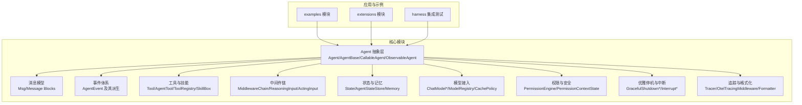

## 核心组件
本节聚焦AgentScope中最基础且关键的概念与实体，解释它们的职责、关系与典型用法。

- 智能体（Agent）
  - 职责：封装推理、决策、调用工具与对外交互的能力；统一生命周期管理与事件发布。
  - 关键类型：基础抽象类与可调用/可观测变体，支持中间件链与流式输出钩子。
  - 典型路径：[Agent.java](file://agentscope-core/src/main/java/io/agentscope/core/Agent.java)，[AgentBase.java](file://agentscope-core/src/main/java/io/agentscope/core/AgentBase.java)，[CallableAgent.java](file://agentscope-core/src/main/java/io/agentscope/core/CallableAgent.java)，[ObservableAgent.java](file://agentscope-core/src/main/java/io/agentscope/core/ObservableAgent.java)。

- 消息（Message）
  - 职责：承载对话或推理过程中的内容单元，支持文本、思考、工具调用与结果等多模态内容块。
  - 关键类型：消息主体、角色枚举、元数据键、内容块基类与具体实现。
  - 典型路径：[Msg.java](file://agentscope-core/src/main/java/io/agentscope/core/message/Msg.java)，[MsgRole.java](file://agentscope-core/src/main/java/io/agentscope/core/message/MsgRole.java)，[MessageMetadataKeys.java](file://agentscope-core/src/main/java/io/agentscope/core/message/MessageMetadataKeys.java)，[ContentBlock.java](file://agentscope-core/src/main/java/io/agentscope/core/message/ContentBlock.java)，[TextBlock.java](file://agentscope-core/src/main/java/io/agentscope/core/message/TextBlock.java)，[ThinkingBlock.java](file://agentscope-core/src/main/java/io/agentscope/core/message/ThinkingBlock.java)，[ToolUseBlock.java](file://agentscope-core/src/main/java/io/agentscope/core/message/ToolUseBlock.java)，[ToolResultBlock.java](file://agentscope-core/src/main/java/io/agentscope/core/message/ToolResultBlock.java)。

- 事件（Event）
  - 职责：在Agent生命周期与推理-行动过程中产生与传播语义化事件，支撑可观测性与可观测性中间件。
  - 关键类型：通用AgentEvent及其开始/结束/结果/用户确认/外部执行/工具调用/模型调用等派生事件。
  - 典型路径：[Event.java](file://agentscope-core/src/main/java/io/agentscope/core/Event.java)，[AgentEvent.java](file://agentscope-core/src/main/java/io/agentscope/core/event/AgentEvent.java)，[AgentStartEvent.java](file://agentscope-core/src/main/java/io/agentscope/core/event/AgentStartEvent.java)，[AgentEndEvent.java](file://agentscope-core/src/main/java/io/agentscope/core/event/AgentEndEvent.java)，[AgentResultEvent.java](file://agentscope-core/src/main/java/io/agentscope/core/event/AgentResultEvent.java)，[RequireUserConfirmEvent.java](file://agentscope-core/src/main/java/io/agentscope/core/event/RequireUserConfirmEvent.java)，[RequireExternalExecutionEvent.java](file://agentscope-core/src/main/java/io/agentscope/core/event/RequireExternalExecutionEvent.java)，[ToolCallStartEvent.java](file://agentscope-core/src/main/java/io/agentscope/core/event/ToolCallStartEvent.java)，[ToolCallEndEvent.java](file://agentscope-core/src/main/java/io/agentscope/core/event/ToolCallEndEvent.java)，[ToolResultStartEvent.java](file://agentscope-core/src/main/java/io/agentscope/core/event/ToolResultStartEvent.java)，[ToolResultEndEvent.java](file://agentscope-core/src/main/java/io/agentscope/core/event/ToolResultEndEvent.java)，[ModelCallStartEvent.java](file://agentscope-core/src/main/java/io/agentscope/core/event/ModelCallStartEvent.java)，[ModelCallEndEvent.java](file://agentscope-core/src/main/java/io/agentscope/core/event/ModelCallEndEvent.java)。

- 工具（Tool）
  - 职责：封装可被Agent调用的原子能力，支持注册、执行、参数校验与结果转换。
  - 关键类型：工具接口、代理工具、执行上下文、执行器、结果消息构建器、注册表与工具箱。
  - 典型路径：[Tool.java](file://agentscope-core/src/main/java/io/agentscope/core/tool/Tool.java)，[AgentTool.java](file://agentscope-core/src/main/java/io/agentscope/core/tool/AgentTool.java)，[ToolExecutor.java](file://agentscope-core/src/main/java/io/agentscope/core/tool/ToolExecutor.java)，[ToolExecutionContext.java](file://agentscope-core/src/main/java/io/agentscope/core/tool/ToolExecutionContext.java)，[ToolResultMessageBuilder.java](file://agentscope-core/src/main/java/io/agentscope/core/tool/ToolResultMessageBuilder.java)，[ToolRegistry.java](file://agentscope-core/src/main/java/io/agentscope/core/tool/ToolRegistry.java)，[Toolkit.java](file://agentscope-core/src/main/java/io/agentscope/core/tool/Toolkit.java)。

- 技能（Skill）
  - 职责：对工具进行更高层的编排与提示词封装，形成可复用的"技能"能力。
  - 关键类型：技能盒、注册表、工厂与工具组。
  - 典型路径：[SkillBox.java](file://agentscope-core/src/main/java/io/agentscope/core/skill/SkillBox.java)，[SkillRegistry.java](file://agentscope-core/src/main/java/io/agentscope/core/skill/SkillRegistry.java)，[SkillToolFactory.java](file://agentscope-core/src/main/java/io/agentscope/core/skill/SkillToolFactory.java)。

- 中间件（Middleware）
  - 职责：在推理、模型调用、行动阶段插入横切逻辑（如提醒、日志、限流、鉴权）。
  - 关键类型：中间件链与输入包装，以及任务提醒中间件。
  - 典型路径：[MiddlewareChain.java](file://agentscope-core/src/main/java/io/agentscope/core/middleware/MiddlewareChain.java)，[ReasoningInput.java](file://agentscope-core/src/main/java/io/agentscope/core/middleware/ReasoningInput.java)，[ActingInput.java](file://agentscope-core/src/main/java/io/agentscope/core/middleware/ActingInput.java)，[ModelCallInput.java](file://agentscope-core/src/main/java/io/agentscope/core/middleware/ModelCallInput.java)，[TaskReminderMiddleware.java](file://agentscope-core/src/main/java/io/agentscope/core/middleware/TaskReminderMiddleware.java)。

- 状态与记忆（State & Memory）
  - 职责：持久化与查询Agent状态，支持任务、规划模式、工具上下文与长期记忆。
  - 关键类型：状态接口与实现、状态存储、内存接口与实现。
  - 典型路径：[State.java](file://agentscope-core/src/main/java/io/agentscope/core/state/State.java)，[AgentState.java](file://agentscope-core/src/main/java/io/agentscope/core/state/AgentState.java)，[Task.java](file://agentscope-core/src/main/java/io/agentscope/core/state/Task.java)，[TaskContextState.java](file://agentscope-core/src/main/java/io/agentscope/core/state/TaskContextState.java)，[PlanModeContextState.java](file://agentscope-core/src/main/java/io/agentscope/core/state/PlanModeContextState.java)，[ToolContextState.java](file://agentscope-core/src/main/java/io/agentscope/core/state/ToolContextState.java)，[AgentStateStore.java](file://agentscope-core/src/main/java/io/agentscope/core/state/AgentStateStore.java)，[InMemoryAgentStateStore.java](file://agentscope-core/src/main/java/io/agentscope/core/state/InMemoryAgentStateStore.java)，[JsonFileAgentStateStore.java](file://agentscope-core/src/main/java/io/agentscope/core/state/JsonFileAgentStateStore.java)，[Memory.java](file://agentscope-core/src/main/java/io/agentscope/core/memory/Memory.java)，[InMemoryMemory.java](file://agentscope-core/src/main/java/io/agentscope/core/memory/InMemoryMemory.java)，[LongTermMemory.java](file://agentscope-core/src/main/java/io/agentscope/core/memory/LongTermMemory.java)，[LongTermMemoryTools.java](file://agentscope-core/src/main/java/io/agentscope/core/memory/LongTermMemoryTools.java)，[AgentStateMemoryView.java](file://agentscope-core/src/main/java/io/agentscope/core/memory/AgentStateMemoryView.java)。

- 权限与安全（Permission）
  - 职责：基于规则与模式控制工具/操作的访问范围与行为。
  - 关键类型：权限引擎、上下文状态、决策、规则、模式与行为。
  - 典型路径：[PermissionEngine.java](file://agentscope-core/src/main/java/io/agentscope/core/permission/PermissionEngine.java)，[PermissionContextState.java](file://agentscope-core/src/main/java/io/agentscope/core/permission/PermissionContextState.java)，[PermissionDecision.java](file://agentscope-core/src/main/java/io/agentscope/core/permission/PermissionDecision.java)，[PermissionRule.java](file://agentscope-core/src/main/java/io/agentscope/core/permission/PermissionRule.java)，[PermissionMode.java](file://agentscope-core/src/main/java/io/agentscope/core/permission/PermissionMode.java)，[PermissionBehavior.java](file://agentscope-core/src/main/java/io/agentscope/core/permission/PermissionBehavior.java)，[AdditionalWorkingDirectory.java](file://agentscope-core/src/main/java/io/agentscope/core/permission/AdditionalWorkingDirectory.java)。

- 优雅停机与中断（Shutdown & Interruption）
  - 职责：在请求级与JVM级优雅关闭，支持中断源与上下文。
  - 关键类型：管理器、配置、状态、活动请求上下文与异常。
  - 典型路径：[GracefulShutdownManager.java](file://agentscope-core/src/main/java/io/agentscope/core/shutdown/GracefulShutdownManager.java)，[GracefulShutdownConfig.java](file://agentscope-core/src/main/java/io/agentscope/core/shutdown/GracefulShutdownConfig.java)，[ShutdownState.java](file://agentscope-core/src/main/java/io/agentscope/core/shutdown/ShutdownState.java)，[ActiveRequestContext.java](file://agentscope-core/src/main/java/io/agentscope/core/shutdown/ActiveRequestContext.java)，[AgentShuttingDownException.java](file://agentscope-core/src/main/java/io/agentscope/core/shutdown/AgentShuttingDownException.java)，[InterruptContext.java](file://agentscope-core/src/main/java/io/agentscope/core/interruption/InterruptContext.java)，[InterruptControl.java](file://agentscope-core/src/main/java/io/agentscope/core/interruption/InterruptControl.java)，[InterruptSource.java](file://agentscope-core/src/main/java/io/agentscope/core/interruption/InterruptSource.java)，[AgentScopeJvmShutdownHook.java](file://agentscope-core/src/main/java/io/agentscope/core/shutdown/AgentScopeJvmShutdownHook.java)。

- 追踪与格式化（Tracing & Formatter）
  - 职责：提供链路追踪与响应格式化能力。
  - 关键类型：追踪器、中间件与注册表、格式化器基类与工具。
  - 典型路径：[Tracer.java](file://agentscope-core/src/main/java/io/agentscope/core/tracing/Tracer.java)，[OtelTracingMiddleware.java](file://agentscope-core/src/main/java/io/agentscope/core/tracing/OtelTracingMiddleware.java)，[TracerRegistry.java](file://agentscope-core/src/main/java/io/agentscope/core/tracing/TracerRegistry.java)，[NoopTracer.java](file://agentscope-core/src/main/java/io/agentscope/core/tracing/NoopTracer.java)，[Formatter.java](file://agentscope-core/src/main/java/io/agentscope/core/formatter/Formatter.java)，[AbstractBaseFormatter.java](file://agentscope-core/src/main/java/io/agentscope/core/formatter/AbstractBaseFormatter.java)，[MediaUtils.java](file://agentscope-core/src/main/java/io/agentscope/core/formatter/MediaUtils.java)，[ResponseFormat.java](file://agentscope-core/src/main/java/io/agentscope/core/formatter/ResponseFormat.java)。

- 模型接入（Model）
  - 职责：统一对接多家大模型服务，提供生成选项、用量统计与异常处理。
  - 关键类型：模型基类、各厂商实现、注册表、工具选择与端点类型。
  - 典型路径：[ChatModelBase.java](file://agentscope-core/src/main/java/io/agentscope/core/model/ChatModelBase.java)，[OpenAIChatModel.java](file://agentscope-core/src/main/java/io/agentscope/core/model/OpenAIChatModel.java)，[DashScopeChatModel.java](file://agentscope-core/src/main/java/io/agentscope/core/model/DashScopeChatModel.java)，[GeminiChatModel.java](file://agentscope-core/src/main/java/io/agentscope/core/model/GeminiChatModel.java)，[AnthropicChatModel.java](file://agentscope-core/src/main/java/io/agentscope/core/model/AnthropicChatModel.java)，[OllamaChatModel.java](file://agentscope-core/src/main/java/io/agentscope/core/model/OllamaChatModel.java)，[Model.java](file://agentscope-core/src/main/java/io/agentscope/core/model/Model.java)，[ModelRegistry.java](file://agentscope-core/src/main/java/io/agentscope/core/model/ModelRegistry.java)，[ModelUtils.java](file://agentscope-core/src/main/java/io/agentscope/core/model/ModelUtils.java)，[GenerateOptions.java](file://agentscope-core/src/main/java/io/agentscope/core/model/GenerateOptions.java)，[StructuredOutputReminder.java](file://agentscope-core/src/main/java/io/agentscope/core/model/StructuredOutputReminder.java)，[ToolChoice.java](file://agentscope-core/src/main/java/io/agentscope/core/model/ToolChoice.java)，[EndpointType.java](file://agentscope-core/src/main/java/io/agentscope/core/model/EndpointType.java)，[ExecutionConfig.java](file://agentscope-core/src/main/java/io/agentscope/core/model/ExecutionConfig.java)，[ChatResponse.java](file://agentscope-core/src/main/java/io/agentscope/core/model/ChatResponse.java)，[ChatUsage.java](file://agentscope-core/src/main/java/io/agentscope/core/model/ChatUsage.java)，[ModelException.java](file://agentscope-core/src/main/java/io/agentscope/core/model/ModelException.java)。

- 凭证与模型卡（Credential）
  - 职责：封装模型服务密钥与卡片信息。
  - 关键类型：凭证基类与各厂商实现、模型卡。
  - 典型路径：[CredentialBase.java](file://agentscope-core/src/main/java/io/agentscope/core/credential/CredentialBase.java)，[DeepSeekCredential.java](file://agentscope-core/src/main/java/io/agentscope/core/credential/DeepSeekCredential.java)，[KimiCredential.java](file://agentscope-core/src/main/java/io/agentscope/core/credential/KimiCredential.java)，[XAICredential.java](file://agentscope-core/src/main/java/io/agentscope/core/credential/XAICredential.java)，[ModelCard.java](file://agentscope-core/src/main/java/io/agentscope/core/credential/ModelCard.java)。

**章节来源**
- [Agent.java](file://agentscope-core/src/main/java/io/agentscope/core/Agent.java)
- [AgentBase.java](file://agentscope-core/src/main/java/io/agentscope/core/AgentBase.java)
- [CallableAgent.java](file://agentscope-core/src/main/java/io/agentscope/core/CallableAgent.java)
- [ObservableAgent.java](file://agentscope-core/src/main/java/io/agentscope/core/ObservableAgent.java)
- [Msg.java](file://agentscope-core/src/main/java/io/agentscope/core/message/Msg.java)
- [ContentBlock.java](file://agentscope-core/src/main/java/io/agentscope/core/message/ContentBlock.java)
- [TextBlock.java](file://agentscope-core/src/main/java/io/agentscope/core/message/TextBlock.java)
- [ThinkingBlock.java](file://agentscope-core/src/main/java/io/agentscope/core/message/ThinkingBlock.java)
- [ToolUseBlock.java](file://agentscope-core/src/main/java/io/agentscope/core/message/ToolUseBlock.java)
- [ToolResultBlock.java](file://agentscope-core/src/main/java/io/agentscope/core/message/ToolResultBlock.java)
- [Event.java](file://agentscope-core/src/main/java/io/agentscope/core/Event.java)
- [AgentEvent.java](file://agentscope-core/src/main/java/io/agentscope/core/event/AgentEvent.java)
- [Tool.java](file://agentscope-core/src/main/java/io/agentscope/core/tool/Tool.java)
- [AgentTool.java](file://agentscope-core/src/main/java/io/agentscope/core/tool/AgentTool.java)
- [ToolExecutor.java](file://agentscope-core/src/main/java/io/agentscope/core/tool/ToolExecutor.java)
- [ToolExecutionContext.java](file://agentscope-core/src/main/java/io/agentscope/core/tool/ToolExecutionContext.java)
- [ToolResultMessageBuilder.java](file://agentscope-core/src/main/java/io/agentscope/core/tool/ToolResultMessageBuilder.java)
- [ToolRegistry.java](file://agentscope-core/src/main/java/io/agentscope/core/tool/ToolRegistry.java)
- [Toolkit.java](file://agentscope-core/src/main/java/io/agentscope/core/tool/Toolkit.java)
- [SkillBox.java](file://agentscope-core/src/main/java/io/agentscope/core/skill/SkillBox.java)
- [SkillRegistry.java](file://agentscope-core/src/main/java/io/agentscope/core/skill/SkillRegistry.java)
- [SkillToolFactory.java](file://agentscope-core/src/main/java/io/agentscope/core/skill/SkillToolFactory.java)
- [MiddlewareChain.java](file://agentscope-core/src/main/java/io/agentscope/core/middleware/MiddlewareChain.java)
- [ReasoningInput.java](file://agentscope-core/src/main/java/io/agentscope/core/middleware/ReasoningInput.java)
- [ActingInput.java](file://agentscope-core/src/main/java/io/agentscope/core/middleware/ActingInput.java)
- [ModelCallInput.java](file://agentscope-core/src/main/java/io/agentscope/core/middleware/ModelCallInput.java)
- [TaskReminderMiddleware.java](file://agentscope-core/src/main/java/io/agentscope/core/middleware/TaskReminderMiddleware.java)
- [State.java](file://agentscope-core/src/main/java/io/agentscope/core/state/State.java)
- [AgentState.java](file://agentscope-core/src/main/java/io/agentscope/core/state/AgentState.java)
- [Task.java](file://agentscope-core/src/main/java/io/agentscope/core/state/Task.java)
- [TaskContextState.java](file://agentscope-core/src/main/java/io/agentscope/core/state/TaskContextState.java)
- [PlanModeContextState.java](file://agentscope-core/src/main/java/io/agentscope/core/state/PlanModeContextState.java)
- [ToolContextState.java](file://agentscope-core/src/main/java/io/agentscope/core/state/ToolContextState.java)
- [AgentStateStore.java](file://agentscope-core/src/main/java/io/agentscope/core/state/AgentStateStore.java)
- [InMemoryAgentStateStore.java](file://agentscope-core/src/main/java/io/agentscope/core/state/InMemoryAgentStateStore.java)
- [JsonFileAgentStateStore.java](file://agentscope-core/src/main/java/io/agentscope/core/state/JsonFileAgentStateStore.java)
- [Memory.java](file://agentscope-core/src/main/java/io/agentscope/core/memory/Memory.java)
- [InMemoryMemory.java](file://agentscope-core/src/main/java/io/agentscope/core/memory/InMemoryMemory.java)
- [LongTermMemory.java](file://agentscope-core/src/main/java/io/agentscope/core/memory/LongTermMemory.java)
- [LongTermMemoryTools.java](file://agentscope-core/src/main/java/io/agentscope/core/memory/LongTermMemoryTools.java)
- [AgentStateMemoryView.java](file://agentscope-core/src/main/java/io/agentscope/core/memory/AgentStateMemoryView.java)
- [PermissionEngine.java](file://agentscope-core/src/main/java/io/agentscope/core/permission/PermissionEngine.java)
- [PermissionContextState.java](file://agentscope-core/src/main/java/io/agentscope/core/permission/PermissionContextState.java)
- [PermissionDecision.java](file://agentscope-core/src/main/java/io/agentscope/core/permission/PermissionDecision.java)
- [PermissionRule.java](file://agentscope-core/src/main/java/io/agentscope/core/permission/PermissionRule.java)
- [PermissionMode.java](file://agentscope-core/src/main/java/io/agentscope/core/permission/PermissionMode.java)
- [PermissionBehavior.java](file://agentscope-core/src/main/java/io/agentscope/core/permission/PermissionBehavior.java)
- [AdditionalWorkingDirectory.java](file://agentscope-core/src/main/java/io/agentscope/core/permission/AdditionalWorkingDirectory.java)
- [GracefulShutdownManager.java](file://agentscope-core/src/main/java/io/agentscope/core/shutdown/GracefulShutdownManager.java)
- [GracefulShutdownConfig.java](file://agentscope-core/src/main/java/io/agentscope/core/shutdown/GracefulShutdownConfig.java)
- [ShutdownState.java](file://agentscope-core/src/main/java/io/agentscope/core/shutdown/ShutdownState.java)
- [ActiveRequestContext.java](file://agentscope-core/src/main/java/io/agentscope/core/shutdown/ActiveRequestContext.java)
- [AgentShuttingDownException.java](file://agentscope-core/src/main/java/io/agentscope/core/shutdown/AgentShuttingDownException.java)
- [InterruptContext.java](file://agentscope-core/src/main/java/io/agentscope/core/interruption/InterruptContext.java)
- [InterruptControl.java](file://agentscope-core/src/main/java/io/agentscope/core/interruption/InterruptControl.java)
- [InterruptSource.java](file://agentscope-core/src/main/java/io/agentscope/core/interruption/InterruptSource.java)
- [AgentScopeJvmShutdownHook.java](file://agentscope-core/src/main/java/io/agentscope/core/shutdown/AgentScopeJvmShutdownHook.java)
- [Tracer.java](file://agentscope-core/src/main/java/io/agentscope/core/tracing/Tracer.java)
- [OtelTracingMiddleware.java](file://agentscope-core/src/main/java/io/agentscope/core/tracing/OtelTracingMiddleware.java)
- [TracerRegistry.java](file://agentscope-core/src/main/java/io/agentscope/core/tracing/TracerRegistry.java)
- [NoopTracer.java](file://agentscope-core/src/main/java/io/agentscope/core/tracing/NoopTracer.java)
- [Formatter.java](file://agentscope-core/src/main/java/io/agentscope/core/formatter/Formatter.java)
- [AbstractBaseFormatter.java](file://agentscope-core/src/main/java/io/agentscope/core/formatter/AbstractBaseFormatter.java)
- [MediaUtils.java](file://agentscope-core/src/main/java/io/agentscope/core/formatter/MediaUtils.java)
- [ResponseFormat.java](file://agentscope-core/src/main/java/io/agentscope/core/formatter/ResponseFormat.java)
- [ChatModelBase.java](file://agentscope-core/src/main/java/io/agentscope/core/model/ChatModelBase.java)
- [OpenAIChatModel.java](file://agentscope-core/src/main/java/io/agentscope/core/model/OpenAIChatModel.java)
- [DashScopeChatModel.java](file://agentscope-core/src/main/java/io/agentscope/core/model/DashScopeChatModel.java)
- [GeminiChatModel.java](file://agentscope-core/src/main/java/io/agentscope/core/model/GeminiChatModel.java)
- [AnthropicChatModel.java](file://agentscope-core/src/main/java/io/agentscope/core/model/AnthropicChatModel.java)
- [OllamaChatModel.java](file://agentscope-core/src/main/java/io/agentscope/core/model/OllamaChatModel.java)
- [Model.java](file://agentscope-core/src/main/java/io/agentscope/core/model/Model.java)
- [ModelRegistry.java](file://agentscope-core/src/main/java/io/agentscope/core/model/ModelRegistry.java)
- [ModelUtils.java](file://agentscope-core/src/main/java/io/agentscope/core/model/ModelUtils.java)
- [GenerateOptions.java](file://agentscope-core/src/main/java/io/agentscope/core/model/GenerateOptions.java)
- [StructuredOutputReminder.java](file://agentscope-core/src/main/java/io/agentscope/core/model/StructuredOutputReminder.java)
- [ToolChoice.java](file://agentscope-core/src/main/java/io/agentscope/core/model/ToolChoice.java)
- [EndpointType.java](file://agentscope-core/src/main/java/io/agentscope/core/model/EndpointType.java)
- [ExecutionConfig.java](file://agentscope-core/src/main/java/io/agentscope/core/model/ExecutionConfig.java)
- [ChatResponse.java](file://agentscope-core/src/main/java/io/agentscope/core/model/ChatResponse.java)
- [ChatUsage.java](file://agentscope-core/src/main/java/io/agentscope/core/model/ChatUsage.java)
- [ModelException.java](file://agentscope-core/src/main/java/io/agentscope/core/model/ModelException.java)
- [CredentialBase.java](file://agentscope-core/src/main/java/io/agentscope/core/credential/CredentialBase.java)
- [DeepSeekCredential.java](file://agentscope-core/src/main/java/io/agentscope/core/credential/DeepSeekCredential.java)
- [KimiCredential.java](file://agentscope-core/src/main/java/io/agentscope/core/credential/KimiCredential.java)
- [XAICredential.java](file://agentscope-core/src/main/java/io/agentscope/core/credential/XAICredential.java)
- [ModelCard.java](file://agentscope-core/src/main/java/io/agentscope/core/credential/ModelCard.java)

## 架构总览
下图展示了AgentScope的核心架构：Agent作为中枢，通过消息与事件连接工具、技能、中间件、状态与记忆、模型接入、权限与安全、优雅停机与中断、追踪与格式化等子系统。

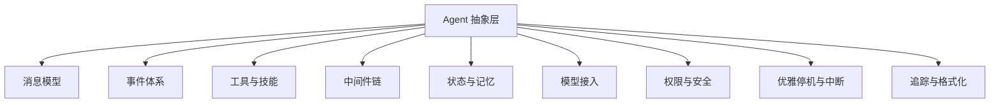

**图示来源**
- [AgentBase.java](file://agentscope-core/src/main/java/io/agentscope/core/AgentBase.java)
- [Msg.java](file://agentscope-core/src/main/java/io/agentscope/core/message/Msg.java)
- [Event.java](file://agentscope-core/src/main/java/io/agentscope/core/Event.java)
- [Tool.java](file://agentscope-core/src/main/java/io/agentscope/core/tool/Tool.java)
- [SkillBox.java](file://agentscope-core/src/main/java/io/agentscope/core/skill/SkillBox.java)
- [MiddlewareChain.java](file://agentscope-core/src/main/java/io/agentscope/core/middleware/MiddlewareChain.java)
- [State.java](file://agentscope-core/src/main/java/io/agentscope/core/state/State.java)
- [Memory.java](file://agentscope-core/src/main/java/io/agentscope/core/memory/Memory.java)
- [Model.java](file://agentscope-core/src/main/java/io/agentscope/core/model/Model.java)
- [PermissionEngine.java](file://agentscope-core/src/main/java/io/agentscope/core/permission/PermissionEngine.java)
- [GracefulShutdownManager.java](file://agentscope-core/src/main/java/io/agentscope/core/shutdown/GracefulShutdownManager.java)
- [InterruptContext.java](file://agentscope-core/src/main/java/io/agentscope/core/interruption/InterruptContext.java)
- [Tracer.java](file://agentscope-core/src/main/java/io/agentscope/core/tracing/Tracer.java)
- [Formatter.java](file://agentscope-core/src/main/java/io/agentscope/core/formatter/Formatter.java)

## 详细组件分析

### 智能体（Agent）类层次结构
Agent家族通过继承与组合实现不同能力维度：基础抽象、可调用、可观测、可流式等。

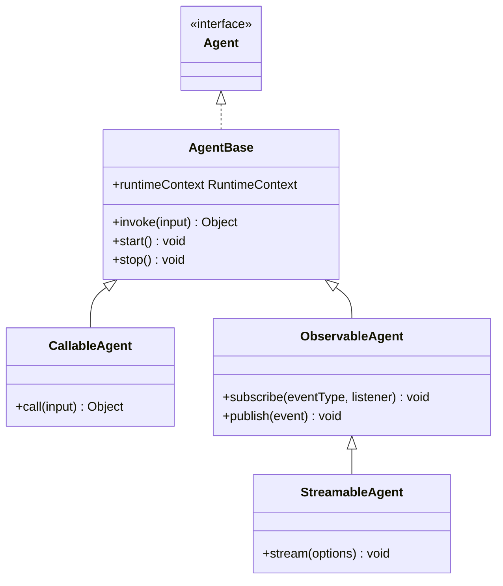

**图示来源**
- [Agent.java](file://agentscope-core/src/main/java/io/agentscope/core/Agent.java)
- [AgentBase.java](file://agentscope-core/src/main/java/io/agentscope/core/AgentBase.java)
- [CallableAgent.java](file://agentscope-core/src/main/java/io/agentscope/core/CallableAgent.java)
- [ObservableAgent.java](file://agentscope-core/src/main/java/io/agentscope/core/ObservableAgent.java)
- [StreamableAgent.java](file://agentscope-core/src/main/java/io/agentscope/core/StreamableAgent.java)

**章节来源**
- [Agent.java](file://agentscope-core/src/main/java/io/agentscope/core/Agent.java)
- [AgentBase.java](file://agentscope-core/src/main/java/io/agentscope/core/AgentBase.java)
- [CallableAgent.java](file://agentscope-core/src/main/java/io/agentscope/core/CallableAgent.java)
- [ObservableAgent.java](file://agentscope-core/src/main/java/io/agentscope/core/ObservableAgent.java)
- [StreamableAgent.java](file://agentscope-core/src/main/java/io/agentscope/core/StreamableAgent.java)

### 消息（Message）与内容块
消息由角色、元数据与内容块组成；内容块支持文本、思考、工具调用与工具结果等。

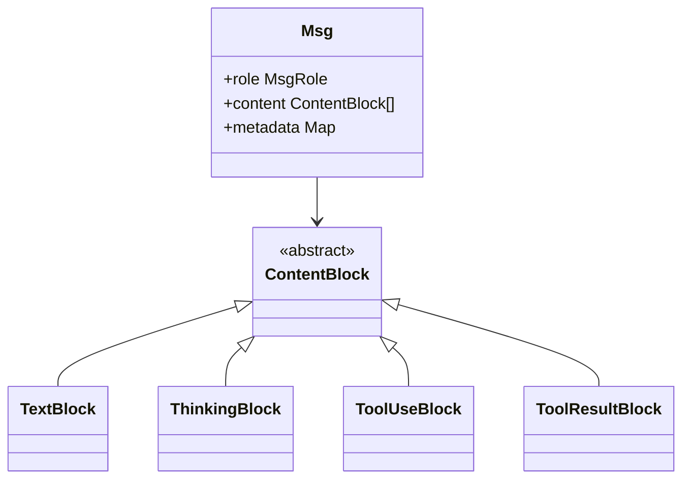

**图示来源**
- [Msg.java](file://agentscope-core/src/main/java/io/agentscope/core/message/Msg.java)
- [ContentBlock.java](file://agentscope-core/src/main/java/io/agentscope/core/message/ContentBlock.java)
- [TextBlock.java](file://agentscope-core/src/main/java/io/agentscope/core/message/TextBlock.java)
- [ThinkingBlock.java](file://agentscope-core/src/main/java/io/agentscope/core/message/ThinkingBlock.java)
- [ToolUseBlock.java](file://agentscope-core/src/main/java/io/agentscope/core/message/ToolUseBlock.java)
- [ToolResultBlock.java](file://agentscope-core/src/main/java/io/agentscope/core/message/ToolResultBlock.java)

**章节来源**
- [Msg.java](file://agentscope-core/src/main/java/io/agentscope/core/message/Msg.java)
- [ContentBlock.java](file://agentscope-core/src/main/java/io/agentscope/core/message/ContentBlock.java)
- [TextBlock.java](file://agentscope-core/src/main/java/io/agentscope/core/message/TextBlock.java)
- [ThinkingBlock.java](file://agentscope-core/src/main/java/io/agentscope/core/message/ThinkingBlock.java)
- [ToolUseBlock.java](file://agentscope-core/src/main/java/io/agentscope/core/message/ToolUseBlock.java)
- [ToolResultBlock.java](file://agentscope-core/src/main/java/io/agentscope/core/message/ToolResultBlock.java)

### 事件（Event）体系
Agent在生命周期与推理-行动过程中发出多种事件，便于观测与扩展。

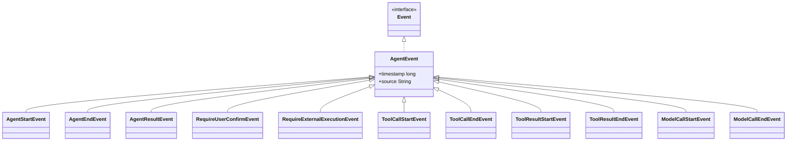

**图示来源**
- [Event.java](file://agentscope-core/src/main/java/io/agentscope/core/Event.java)
- [AgentEvent.java](file://agentscope-core/src/main/java/io/agentscope/core/event/AgentEvent.java)
- [AgentStartEvent.java](file://agentscope-core/src/main/java/io/agentscope/core/event/AgentStartEvent.java)
- [AgentEndEvent.java](file://agentscope-core/src/main/java/io/agentscope/core/event/AgentEndEvent.java)
- [AgentResultEvent.java](file://agentscope-core/src/main/java/io/agentscope/core/event/AgentResultEvent.java)
- [RequireUserConfirmEvent.java](file://agentscope-core/src/main/java/io/agentscope/core/event/RequireUserConfirmEvent.java)
- [RequireExternalExecutionEvent.java](file://agentscope-core/src/main/java/io/agentscope/core/event/RequireExternalExecutionEvent.java)
- [ToolCallStartEvent.java](file://agentscope-core/src/main/java/io/agentscope/core/event/ToolCallStartEvent.java)
- [ToolCallEndEvent.java](file://agentscope-core/src/main/java/io/agentscope/core/event/ToolCallEndEvent.java)
- [ToolResultStartEvent.java](file://agentscope-core/src/main/java/io/agentscope/core/event/ToolResultStartEvent.java)
- [ToolResultEndEvent.java](file://agentscope-core/src/main/java/io/agentscope/core/event/ToolResultEndEvent.java)
- [ModelCallStartEvent.java](file://agentscope-core/src/main/java/io/agentscope/core/event/ModelCallStartEvent.java)
- [ModelCallEndEvent.java](file://agentscope-core/src/main/java/io/agentscope/core/event/ModelCallEndEvent.java)

**章节来源**
- [Event.java](file://agentscope-core/src/main/java/io/agentscope/core/Event.java)
- [AgentEvent.java](file://agentscope-core/src/main/java/io/agentscope/core/event/AgentEvent.java)
- [AgentStartEvent.java](file://agentscope-core/src/main/java/io/agentscope/core/event/AgentStartEvent.java)
- [AgentEndEvent.java](file://agentscope-core/src/main/java/io/agentscope/core/event/AgentEndEvent.java)
- [AgentResultEvent.java](file://agentscope-core/src/main/java/io/agentscope/core/event/AgentResultEvent.java)
- [RequireUserConfirmEvent.java](file://agentscope-core/src/main/java/io/agentscope/core/event/RequireUserConfirmEvent.java)
- [RequireExternalExecutionEvent.java](file://agentscope-core/src/main/java/io/agentscope/core/event/RequireExternalExecutionEvent.java)
- [ToolCallStartEvent.java](file://agentscope-core/src/main/java/io/agentscope/core/event/ToolCallStartEvent.java)
- [ToolCallEndEvent.java](file://agentscope-core/src/main/java/io/agentscope/core/event/ToolCallEndEvent.java)
- [ToolResultStartEvent.java](file://agentscope-core/src/main/java/io/agentscope/core/event/ToolResultStartEvent.java)
- [ToolResultEndEvent.java](file://agentscope-core/src/main/java/io/agentscope/core/event/ToolResultEndEvent.java)
- [ModelCallStartEvent.java](file://agentscope-core/src/main/java/io/agentscope/core/event/ModelCallStartEvent.java)
- [ModelCallEndEvent.java](file://agentscope-core/src/main/java/io/agentscope/core/event/ModelCallEndEvent.java)

### 工具（Tool）与工具链
工具负责封装原子能力，支持注册、执行、参数校验与结果转换；工具链通过注册表与工具箱进行编排。

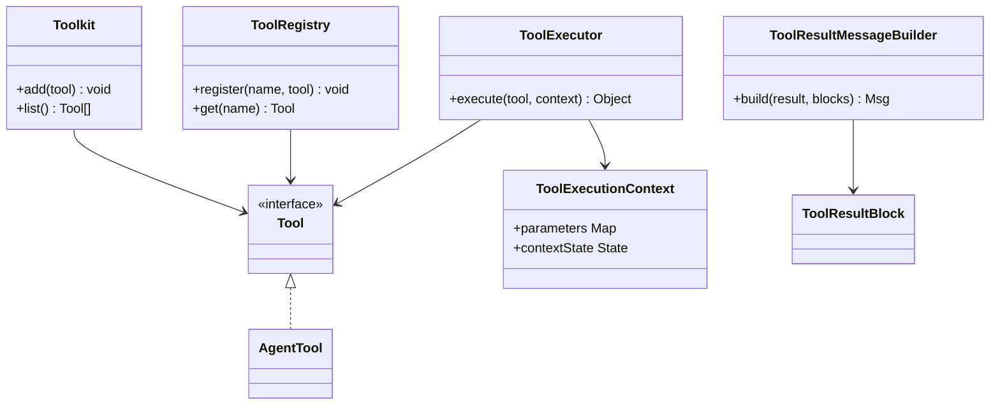

**图示来源**
- [Tool.java](file://agentscope-core/src/main/java/io/agentscope/core/tool/Tool.java)
- [AgentTool.java](file://agentscope-core/src/main/java/io/agentscope/core/tool/AgentTool.java)
- [ToolExecutor.java](file://agentscope-core/src/main/java/io/agentscope/core/tool/ToolExecutor.java)
- [ToolExecutionContext.java](file://agentscope-core/src/main/java/io/agentscope/core/tool/ToolExecutionContext.java)
- [ToolResultMessageBuilder.java](file://agentscope-core/src/main/java/io/agentscope/core/tool/ToolResultMessageBuilder.java)
- [ToolRegistry.java](file://agentscope-core/src/main/java/io/agentscope/core/tool/ToolRegistry.java)
- [Toolkit.java](file://agentscope-core/src/main/java/io/agentscope/core/tool/Toolkit.java)

**章节来源**
- [Tool.java](file://agentscope-core/src/main/java/io/agentscope/core/tool/Tool.java)
- [AgentTool.java](file://agentscope-core/src/main/java/io/agentscope/core/tool/AgentTool.java)
- [ToolExecutor.java](file://agentscope-core/src/main/java/io/agentscope/core/tool/ToolExecutor.java)
- [ToolExecutionContext.java](file://agentscope-core/src/main/java/io/agentscope/core/tool/ToolExecutionContext.java)
- [ToolResultMessageBuilder.java](file://agentscope-core/src/main/java/io/agentscope/core/tool/ToolResultMessageBuilder.java)
- [ToolRegistry.java](file://agentscope-core/src/main/java/io/agentscope/core/tool/ToolRegistry.java)
- [Toolkit.java](file://agentscope-core/src/main/java/io/agentscope/core/tool/Toolkit.java)

### 技能（Skill）与工具组
技能是对工具的高层编排，结合提示词与上下文形成可复用的"技能"。

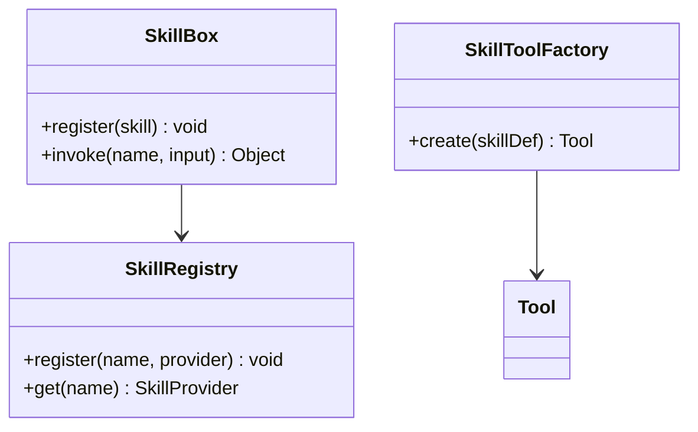

**图示来源**
- [SkillBox.java](file://agentscope-core/src/main/java/io/agentscope/core/skill/SkillBox.java)
- [SkillRegistry.java](file://agentscope-core/src/main/java/io/agentscope/core/skill/SkillRegistry.java)
- [SkillToolFactory.java](file://agentscope-core/src/main/java/io/agentscope/core/skill/SkillToolFactory.java)

**章节来源**
- [SkillBox.java](file://agentscope-core/src/main/java/io/agentscope/core/skill/SkillBox.java)
- [SkillRegistry.java](file://agentscope-core/src/main/java/io/agentscope/core/skill/SkillRegistry.java)
- [SkillToolFactory.java](file://agentscope-core/src/main/java/io/agentscope/core/skill/SkillToolFactory.java)

### 中间件（Middleware）与推理-行动流程
中间件在推理、模型调用、行动阶段插入横切逻辑；ReAct循环通过中间件链与事件驱动实现。

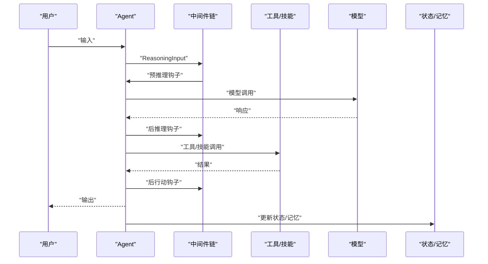

**图示来源**
- [MiddlewareChain.java](file://agentscope-core/src/main/java/io/agentscope/core/middleware/MiddlewareChain.java)
- [ReasoningInput.java](file://agentscope-core/src/main/java/io/agentscope/core/middleware/ReasoningInput.java)
- [ActingInput.java](file://agentscope-core/src/main/java/io/agentscope/core/middleware/ActingInput.java)
- [ModelCallInput.java](file://agentscope-core/src/main/java/io/agentscope/core/middleware/ModelCallInput.java)
- [TaskReminderMiddleware.java](file://agentscope-core/src/main/java/io/agentscope/core/middleware/TaskReminderMiddleware.java)

**章节来源**
- [MiddlewareChain.java](file://agentscope-core/src/main/java/io/agentscope/core/middleware/MiddlewareChain.java)
- [ReasoningInput.java](file://agentscope-core/src/main/java/io/agentscope/core/middleware/ReasoningInput.java)
- [ActingInput.java](file://agentscope-core/src/main/java/io/agentscope/core/middleware/ActingInput.java)
- [ModelCallInput.java](file://agentscope-core/src/main/java/io/agentscope/core/middleware/ModelCallInput.java)
- [TaskReminderMiddleware.java](file://agentscope-core/src/main/java/io/agentscope/core/middleware/TaskReminderMiddleware.java)

### ReAct 推理-行动循环
ReAct循环以"思考-行动-观察-再思考"的迭代方式推进，借助事件与中间件实现可观测与可扩展。

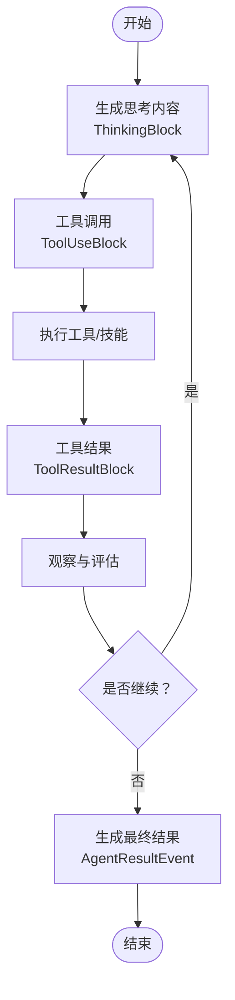

**图示来源**
- [ThinkingBlock.java](file://agentscope-core/src/main/java/io/agentscope/core/message/ThinkingBlock.java)
- [ToolUseBlock.java](file://agentscope-core/src/main/java/io/agentscope/core/message/ToolUseBlock.java)
- [ToolResultBlock.java](file://agentscope-core/src/main/java/io/agentscope/core/message/ToolResultBlock.java)
- [ToolCallStartEvent.java](file://agentscope-core/src/main/java/io/agentscope/core/event/ToolCallStartEvent.java)
- [ToolCallEndEvent.java](file://agentscope-core/src/main/java/io/agentscope/core/event/ToolCallEndEvent.java)
- [ToolResultStartEvent.java](file://agentscope-core/src/main/java/io/agentscope/core/event/ToolResultStartEvent.java)
- [ToolResultEndEvent.java](file://agentscope-core/src/main/java/io/agentscope/core/event/ToolResultEndEvent.java)
- [AgentResultEvent.java](file://agentscope-core/src/main/java/io/agentscope/core/event/AgentResultEvent.java)

**章节来源**
- [ThinkingBlock.java](file://agentscope-core/src/main/java/io/agentscope/core/message/ThinkingBlock.java)
- [ToolUseBlock.java](file://agentscope-core/src/main/java/io/agentscope/core/message/ToolUseBlock.java)
- [ToolResultBlock.java](file://agentscope-core/src/main/java/io/agentscope/core/message/ToolResultBlock.java)
- [ToolCallStartEvent.java](file://agentscope-core/src/main/java/io/agentscope/core/event/ToolCallStartEvent.java)
- [ToolCallEndEvent.java](file://agentscope-core/src/main/java/io/agentscope/core/event/ToolCallEndEvent.java)
- [ToolResultStartEvent.java](file://agentscope-core/src/main/java/io/agentscope/core/event/ToolResultStartEvent.java)
- [ToolResultEndEvent.java](file://agentscope-core/src/main/java/io/agentscope/core/event/ToolResultEndEvent.java)
- [AgentResultEvent.java](file://agentscope-core/src/main/java/io/agentscope/core/event/AgentResultEvent.java)

### 生命周期、状态管理与上下文传递
Agent通过RuntimeContext贯穿生命周期，状态与记忆在每次推理-行动后更新，支持任务、规划模式与工具上下文。

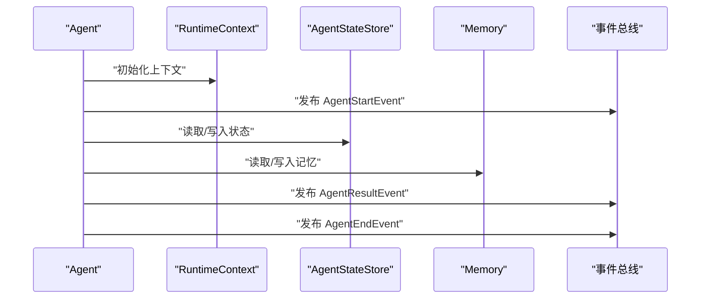

**图示来源**
- [RuntimeContext.java](file://agentscope-core/src/main/java/io/agentscope/core/RuntimeContext.java)
- [AgentStateStore.java](file://agentscope-core/src/main/java/io/agentscope/core/state/AgentStateStore.java)
- [InMemoryAgentStateStore.java](file://agentscope-core/src/main/java/io/agentscope/core/state/InMemoryAgentStateStore.java)
- [JsonFileAgentStateStore.java](file://agentscope-core/src/main/java/io/agentscope/core/state/JsonFileAgentStateStore.java)
- [Memory.java](file://agentscope-core/src/main/java/io/agentscope/core/memory/Memory.java)
- [InMemoryMemory.java](file://agentscope-core/src/main/java/io/agentscope/core/memory/InMemoryMemory.java)
- [LongTermMemory.java](file://agentscope-core/src/main/java/io/agentscope/core/memory/LongTermMemory.java)
- [AgentStateMemoryView.java](file://agentscope-core/src/main/java/io/agentscope/core/memory/AgentStateMemoryView.java)
- [AgentStartEvent.java](file://agentscope-core/src/main/java/io/agentscope/core/event/AgentStartEvent.java)
- [AgentResultEvent.java](file://agentscope-core/src/main/java/io/agentscope/core/event/AgentResultEvent.java)
- [AgentEndEvent.java](file://agentscope-core/src/main/java/io/agentscope/core/event/AgentEndEvent.java)

**章节来源**
- [RuntimeContext.java](file://agentscope-core/src/main/java/io/agentscope/core/RuntimeContext.java)
- [AgentStateStore.java](file://agentscope-core/src/main/java/io/agentscope/core/state/AgentStateStore.java)
- [InMemoryAgentStateStore.java](file://agentscope-core/src/main/java/io/agentscope/core/state/InMemoryAgentStateStore.java)
- [JsonFileAgentStateStore.java](file://agentscope-core/src/main/java/io/agentscope/core/state/JsonFileAgentStateStore.java)
- [Memory.java](file://agentscope-core/src/main/java/io/agentscope/core/memory/Memory.java)
- [InMemoryMemory.java](file://agentscope-core/src/main/java/io/agentscope/core/memory/InMemoryMemory.java)
- [LongTermMemory.java](file://agentscope-core/src/main/java/io/agentscope/core/memory/LongTermMemory.java)
- [AgentStateMemoryView.java](file://agentscope-core/src/main/java/io/agentscope/core/memory/AgentStateMemoryView.java)
- [AgentStartEvent.java](file://agentscope-core/src/main/java/io/agentscope/core/event/AgentStartEvent.java)
- [AgentResultEvent.java](file://agentscope-core/src/main/java/io/agentscope/core/event/AgentResultEvent.java)
- [AgentEndEvent.java](file://agentscope-core/src/main/java/io/agentscope/core/event/AgentEndEvent.java)

### 事件驱动架构设计
事件驱动通过事件总线与订阅者模式实现解耦：Agent发布事件，中间件与外部监听者按需消费。

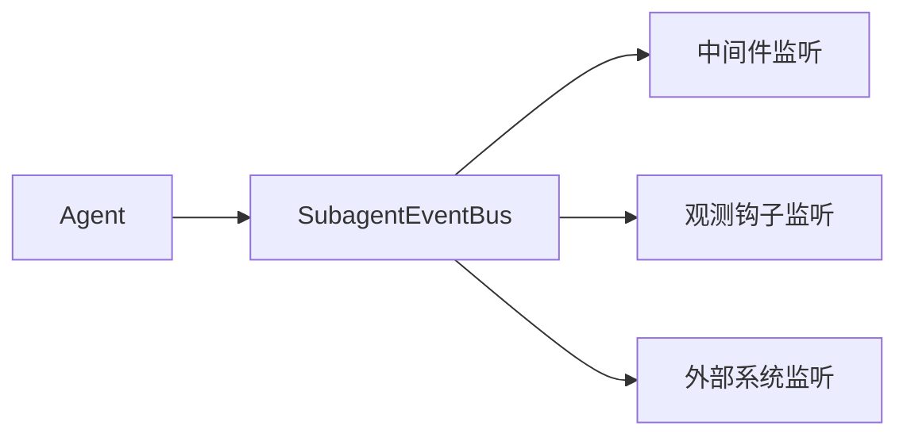

**图示来源**
- [SubagentEventBus.java](file://agentscope-core/src/main/java/io/agentscope/core/SubagentEventBus.java)
- [AgentEvent.java](file://agentscope-core/src/main/java/io/agentscope/core/event/AgentEvent.java)

**章节来源**
- [SubagentEventBus.java](file://agentscope-core/src/main/java/io/agentscope/core/SubagentEventBus.java)
- [AgentEvent.java](file://agentscope-core/src/main/java/io/agentscope/core/event/AgentEvent.java)

### 模型注册系统与SPI增强

**新增** 模型注册系统现已支持增强的SPI（Service Provider Interface）能力，提供更灵活的模型创建和配置方式。

#### 模型创建上下文（ModelCreationContext）
ModelCreationContext提供了更灵活的模型创建和配置方式，允许在运行时动态配置模型参数和行为。

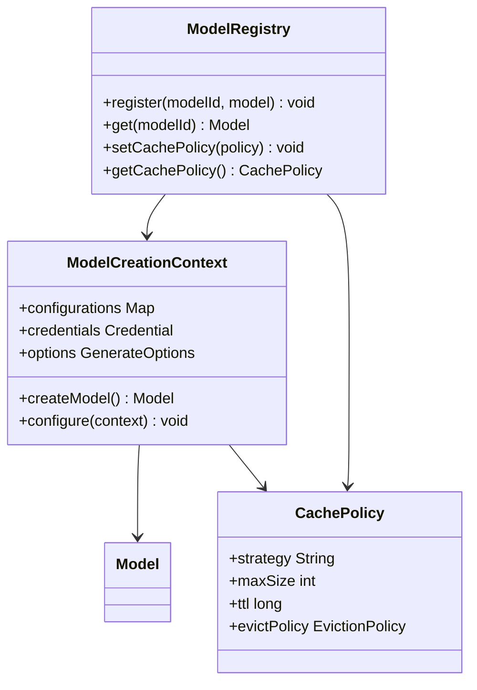

**图示来源**
- [ModelCreationContext.java](file://agentscope-core/src/main/java/io/agentscope/core/model/ModelCreationContext.java)
- [CachePolicy.java](file://agentscope-core/src/main/java/io/agentscope/core/model/CachePolicy.java)
- [ModelRegistry.java](file://agentscope-core/src/main/java/io/agentscope/core/model/ModelRegistry.java)

#### 缓存策略（CachePolicy）
CachePolicy类引入了灵活的模型实例缓存策略，支持不同的缓存大小、生存时间和驱逐策略，显著提升模型复用性能和资源利用率。

**章节来源**
- [ModelCreationContext.java](file://agentscope-core/src/main/java/io/agentscope/core/model/ModelCreationContext.java)
- [CachePolicy.java](file://agentscope-core/src/main/java/io/agentscope/core/model/CachePolicy.java)
- [ModelRegistry.java](file://agentscope-core/src/main/java/io/agentscope/core/model/ModelRegistry.java)

## 依赖关系分析
下图展示核心组件之间的依赖关系：Agent依赖消息、事件、工具、中间件、状态/记忆、模型、权限、优雅停机与追踪；工具与技能通过注册表与工厂协同；中间件链贯穿推理与行动阶段。

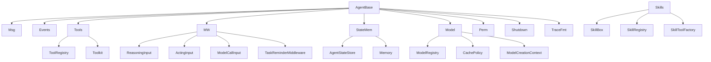

**图示来源**
- [AgentBase.java](file://agentscope-core/src/main/java/io/agentscope/core/AgentBase.java)
- [Msg.java](file://agentscope-core/src/main/java/io/agentscope/core/message/Msg.java)
- [Event.java](file://agentscope-core/src/main/java/io/agentscope/core/Event.java)
- [Tool.java](file://agentscope-core/src/main/java/io/agentscope/core/tool/Tool.java)
- [ToolRegistry.java](file://agentscope-core/src/main/java/io/agentscope/core/tool/ToolRegistry.java)
- [Toolkit.java](file://agentscope-core/src/main/java/io/agentscope/core/tool/Toolkit.java)
- [SkillBox.java](file://agentscope-core/src/main/java/io/agentscope/core/skill/SkillBox.java)
- [SkillRegistry.java](file://agentscope-core/src/main/java/io/agentscope/core/skill/SkillRegistry.java)
- [SkillToolFactory.java](file://agentscope-core/src/main/java/io/agentscope/core/skill/SkillToolFactory.java)
- [MiddlewareChain.java](file://agentscope-core/src/main/java/io/agentscope/core/middleware/MiddlewareChain.java)
- [ReasoningInput.java](file://agentscope-core/src/main/java/io/agentscope/core/middleware/ReasoningInput.java)
- [ActingInput.java](file://agentscope-core/src/main/java/io/agentscope/core/middleware/ActingInput.java)
- [ModelCallInput.java](file://agentscope-core/src/main/java/io/agentscope/core/middleware/ModelCallInput.java)
- [TaskReminderMiddleware.java](file://agentscope-core/src/main/java/io/agentscope/core/middleware/TaskReminderMiddleware.java)
- [AgentStateStore.java](file://agentscope-core/src/main/java/io/agentscope/core/state/AgentStateStore.java)
- [Memory.java](file://agentscope-core/src/main/java/io/agentscope/core/memory/Memory.java)
- [ModelRegistry.java](file://agentscope-core/src/main/java/io/agentscope/core/model/ModelRegistry.java)
- [CachePolicy.java](file://agentscope-core/src/main/java/io/agentscope/core/model/CachePolicy.java)
- [ModelCreationContext.java](file://agentscope-core/src/main/java/io/agentscope/core/model/ModelCreationContext.java)

**章节来源**
- [AgentBase.java](file://agentscope-core/src/main/java/io/agentscope/core/AgentBase.java)
- [ToolRegistry.java](file://agentscope-core/src/main/java/io/agentscope/core/tool/ToolRegistry.java)
- [Toolkit.java](file://agentscope-core/src/main/java/io/agentscope/core/tool/Toolkit.java)
- [SkillBox.java](file://agentscope-core/src/main/java/io/agentscope/core/skill/SkillBox.java)
- [SkillRegistry.java](file://agentscope-core/src/main/java/io/agentscope/core/skill/SkillRegistry.java)
- [SkillToolFactory.java](file://agentscope-core/src/main/java/io/agentscope/core/skill/SkillToolFactory.java)
- [MiddlewareChain.java](file://agentscope-core/src/main/java/io/agentscope/core/middleware/MiddlewareChain.java)
- [ReasoningInput.java](file://agentscope-core/src/main/java/io/agentscope/core/middleware/ReasoningInput.java)
- [ActingInput.java](file://agentscope-core/src/main/java/io/agentscope/core/middleware/ActingInput.java)
- [ModelCallInput.java](file://agentscope-core/src/main/java/io/agentscope/core/middleware/ModelCallInput.java)
- [TaskReminderMiddleware.java](file://agentscope-core/src/main/java/io/agentscope/core/middleware/TaskReminderMiddleware.java)
- [AgentStateStore.java](file://agentscope-core/src/main/java/io/agentscope/core/state/AgentStateStore.java)
- [Memory.java](file://agentscope-core/src/main/java/io/agentscope/core/memory/Memory.java)
- [ModelRegistry.java](file://agentscope-core/src/main/java/io/agentscope/core/model/ModelRegistry.java)
- [CachePolicy.java](file://agentscope-core/src/main/java/io/agentscope/core/model/CachePolicy.java)
- [ModelCreationContext.java](file://agentscope-core/src/main/java/io/agentscope/core/model/ModelCreationContext.java)

## 性能考虑
- 中间件链开销：中间件数量与顺序直接影响推理与行动延迟，建议按需启用与合并相似逻辑。
- 工具执行成本：工具调用可能涉及网络或本地进程，应避免不必要的重复调用并缓存结果。
- 流式输出：在长文本或视频等大媒体场景中，合理设置流式钩子与分片大小，平衡实时性与资源占用。
- 记忆与状态：长期记忆与状态存储应采用增量更新策略，减少I/O压力。
- 模型调用：批量请求、并发限制与重试策略有助于提升吞吐量与稳定性。
- **模型缓存策略**：利用新的CachePolicy类配置合适的缓存大小和生存时间，显著提升模型实例复用效率。
- **SPI扩展性能**：增强的SPI支持允许自定义模型创建逻辑，可根据业务需求优化模型初始化过程。
- 优雅停机：在高负载下触发优雅停机时，应优先保证未完成推理的完整性与可观测性。

## 故障排查指南
- 复合异常：当多个环节失败时，使用复合异常聚合错误信息，便于定位根因。
  - 参考路径：[CompositeAgentException.java](file://agentscope-core/src/main/java/io/agentscope/core/exception/CompositeAgentException.java)
- 任务中断：检查中断上下文与控制源，确认是否在合理时机中断。
  - 参考路径：[InterruptContext.java](file://agentscope-core/src/main/java/io/agentscope/core/interruption/InterruptContext.java)，[InterruptControl.java](file://agentscope-core/src/main/java/io/agentscope/core/interruption/InterruptControl.java)，[InterruptSource.java](file://agentscope-core/src/main/java/io/agentscope/core/interruption/InterruptSource.java)
- 优雅停机：在JVM关闭或请求级停机时，确认状态保存与活动请求清理。
  - 参考路径：[GracefulShutdownManager.java](file://agentscope-core/src/main/java/io/agentscope/core/shutdown/GracefulShutdownManager.java)，[GracefulShutdownConfig.java](file://agentscope-core/src/main/java/io/agentscope/core/shutdown/GracefulShutdownConfig.java)，[ShutdownState.java](file://agentscope-core/src/main/java/io/agentscope/core/shutdown/ShutdownState.java)，[ActiveRequestContext.java](file://agentscope-core/src/main/java/io/agentscope/core/shutdown/ActiveRequestContext.java)，[AgentShuttingDownException.java](file://agentscope-core/src/main/java/io/agentscope/core/shutdown/AgentShuttingDownException.java)
- 模型异常：捕获模型异常并区分网络、配额、参数等不同错误类型，配合重试与降级策略。
  - 参考路径：[ModelException.java](file://agentscope-core/src/main/java/io/agentscope/core/model/ModelException.java)
- **模型注册问题**：检查ModelCreationContext配置是否正确，验证CachePolicy设置是否合理。
  - 参考路径：[ModelCreationContext.java](file://agentscope-core/src/main/java/io/agentscope/core/model/ModelCreationContext.java)，[CachePolicy.java](file://agentscope-core/src/main/java/io/agentscope/core/model/CachePolicy.java)，[ModelRegistry.java](file://agentscope-core/src/main/java/io/agentscope/core/model/ModelRegistry.java)
- 权限问题：核对权限规则与上下文状态，确保工具调用符合白名单与工作目录限制。
  - 参考路径：[PermissionEngine.java](file://agentscope-core/src/main/java/io/agentscope/core/permission/PermissionEngine.java)，[PermissionContextState.java](file://agentscope-core/src/main/java/io/agentscope/core/permission/PermissionContextState.java)，[PermissionDecision.java](file://agentscope-core/src/main/java/io/agentscope/core/permission/PermissionDecision.java)，[PermissionRule.java](file://agentscope-core/src/main/java/io/agentscope/core/permission/PermissionRule.java)，[PermissionMode.java](file://agentscope-core/src/main/java/io/agentscope/core/permission/PermissionMode.java)，[PermissionBehavior.java](file://agentscope-core/src/main/java/io/agentscope/core/permission/PermissionBehavior.java)，[AdditionalWorkingDirectory.java](file://agentscope-core/src/main/java/io/agentscope/core/permission/AdditionalWorkingDirectory.java)

**章节来源**
- [CompositeAgentException.java](file://agentscope-core/src/main/java/io/agentscope/core/exception/CompositeAgentException.java)
- [InterruptContext.java](file://agentscope-core/src/main/java/io/agentscope/core/interruption/InterruptContext.java)
- [InterruptControl.java](file://agentscope-core/src/main/java/io/agentscope/core/interruption/InterruptControl.java)
- [InterruptSource.java](file://agentscope-core/src/main/java/io/agentscope/core/interruption/InterruptSource.java)
- [GracefulShutdownManager.java](file://agentscope-core/src/main/java/io/agentscope/core/shutdown/GracefulShutdownManager.java)
- [GracefulShutdownConfig.java](file://agentscope-core/src/main/java/io/agentscope/core/shutdown/GracefulShutdownConfig.java)
- [ShutdownState.java](file://agentscope-core/src/main/java/io/agentscope/core/shutdown/ShutdownState.java)
- [ActiveRequestContext.java](file://agentscope-core/src/main/java/io/agentscope/core/shutdown/ActiveRequestContext.java)
- [AgentShuttingDownException.java](file://agentscope-core/src/main/java/io/agentscope/core/shutdown/AgentShuttingDownException.java)
- [ModelException.java](file://agentscope-core/src/main/java/io/agentscope/core/model/ModelException.java)
- [ModelCreationContext.java](file://agentscope-core/src/main/java/io/agentscope/core/model/ModelCreationContext.java)
- [CachePolicy.java](file://agentscope-core/src/main/java/io/agentscope/core/model/CachePolicy.java)
- [ModelRegistry.java](file://agentscope-core/src/main/java/io/agentscope/core/model/ModelRegistry.java)
- [PermissionEngine.java](file://agentscope-core/src/main/java/io/agentscope/core/permission/PermissionEngine.java)
- [PermissionContextState.java](file://agentscope-core/src/main/java/io/agentscope/core/permission/PermissionContextState.java)
- [PermissionDecision.java](file://agentscope-core/src/main/java/io/agentscope/core/permission/PermissionDecision.java)
- [PermissionRule.java](file://agentscope-core/src/main/java/io/agentscope/core/permission/PermissionRule.java)
- [PermissionMode.java](file://agentscope-core/src/main/java/io/agentscope/core/permission/PermissionMode.java)
- [PermissionBehavior.java](file://agentscope-core/src/main/java/io/agentscope/core/permission/PermissionBehavior.java)
- [AdditionalWorkingDirectory.java](file://agentscope-core/src/main/java/io/agentscope/core/permission/AdditionalWorkingDirectory.java)

## 结论
AgentScope通过清晰的概念分层与事件驱动架构，将智能体、消息、事件、工具与技能有机整合，形成可扩展、可观测、可维护的智能代理平台。ReAct循环与中间件链共同实现了"推理-行动"的闭环，结合状态与记忆、权限与安全、优雅停机与追踪等机制，满足复杂场景下的工程化需求。**最新的模型注册系统增强**通过ModelCreationContext和CachePolicy提供了更灵活的模型创建和缓存管理能力，进一步提升了系统的可扩展性和性能表现。建议在实践中遵循最小必要原则启用中间件与工具，关注性能与可观测性，逐步完善状态与记忆策略，并利用新的SPI增强特性优化模型管理，以获得稳定可靠的智能体系统。

## 附录
- 实际应用场景建议
  - 问答与摘要：使用消息与工具结果构建结构化输出，结合中间件进行内容提醒与格式化。
  - 编排与自动化：通过技能盒与工具组实现跨工具的编排，利用事件总线进行可观测性与告警。
  - 多模态交互：结合媒体工具与格式化器，处理文本、图像与视频等多模态输入输出。
  - 安全与合规：启用权限引擎与工作目录限制，确保工具调用在受控范围内执行。
  - 生产运维：在高并发场景下启用优雅停机与中断控制，保障系统稳定与数据一致性。
  - **模型管理优化**：利用ModelCreationContext进行动态模型配置，通过CachePolicy优化模型实例缓存，提升系统性能。
  - **SPI扩展开发**：基于增强的SPI支持实现自定义模型提供者，满足特定业务场景的模型管理需求。
