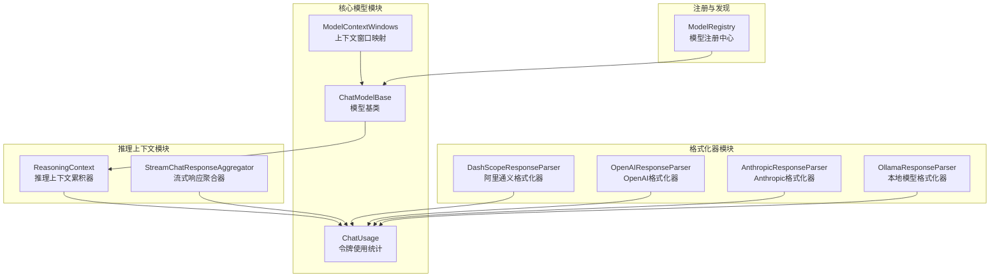
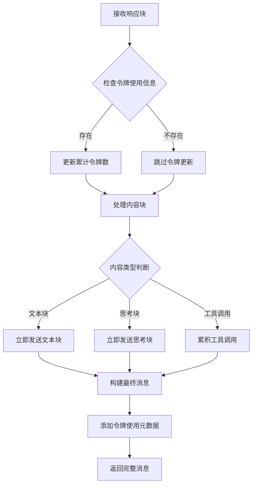
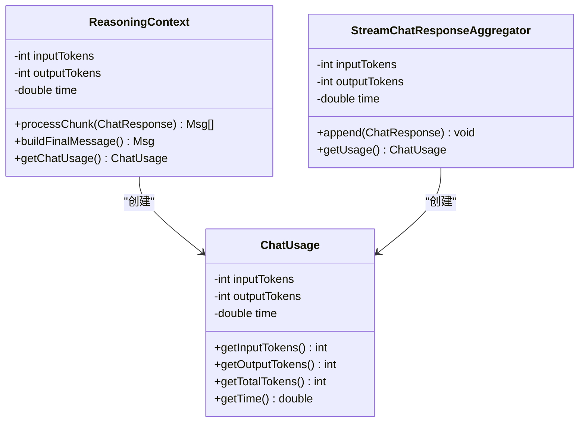
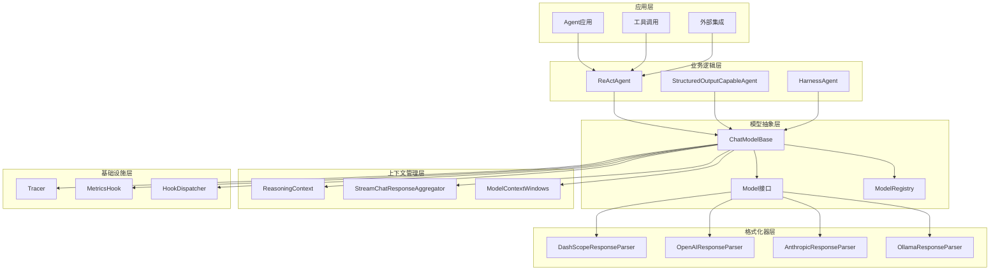
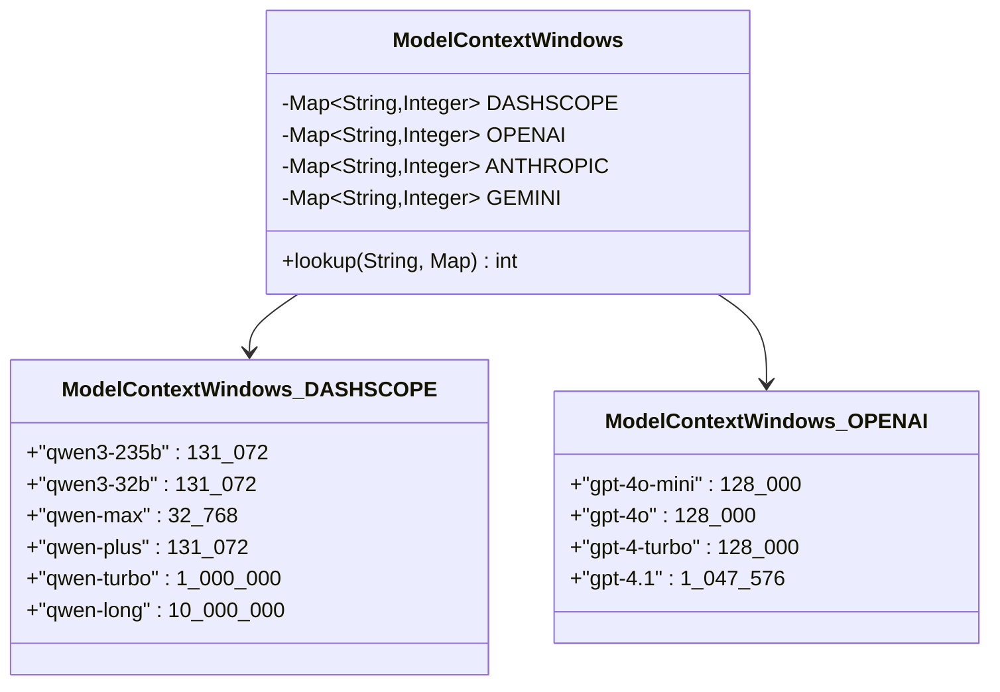
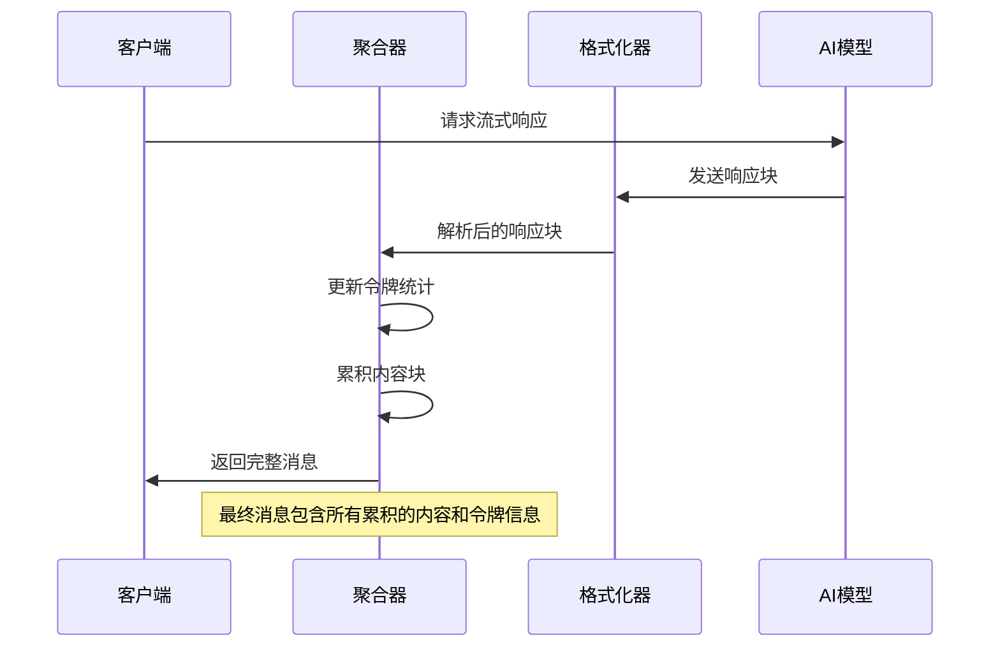
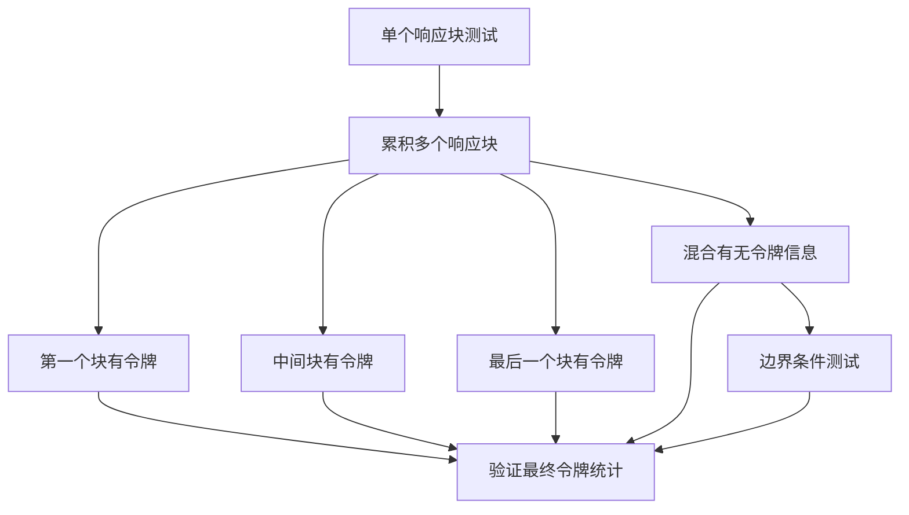
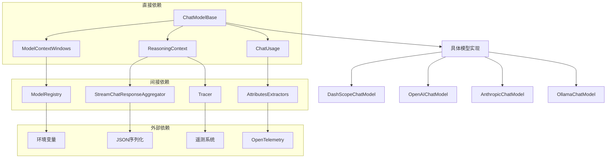

# 模型上下文窗口管理

<cite>
**本文档引用的文件**
- [ModelContextWindows.java](file://agentscope-core/src/main/java/io/agentscope/core/model/ModelContextWindows.java)
- [ChatModelBase.java](file://agentscope-core/src/main/java/io/agentscope/core/model/ChatModelBase.java)
- [ReasoningContext.java](file://agentscope-core/src/main/java/io/agentscope/core/agent/accumulator/ReasoningContext.java)
- [ChatUsage.java](file://agentscope-core/src/main/java/io/agentscope/core/model/ChatUsage.java)
- [ModelRegistry.java](file://agentscope-core/src/main/java/io/agentscope/core/model/ModelRegistry.java)
- [StreamChatResponseAggregator.java](file://agentscope-extensions/agentscope-extensions-studio/src/main/java/io/agentscope/core/tracing/telemetry/StreamChatResponseAggregator.java)
- [AttributesExtractors.java](file://agentscope-extensions/agentscope-extensions-studio/src/main/java/io/agentscope/core/tracing/telemetry/AttributesExtractors.java)
- [ReasoningContextTest.java](file://agentscope-core/src/test/java/io/agentscope/core/agent/accumulator/ReasoningContextTest.java)
- [DashScopeResponseParser.java](file://agentscope-core/src/main/java/io/agentscope/core/formatter/dashscope/DashScopeResponseParser.java)
- [OpenAIResponseParser.java](file://agentscope-core/src/main/java/io/agentscope/core/formatter/openai/OpenAIResponseParser.java)
- [AnthropicResponseParser.java](file://agentscope-core/src/main/java/io/agentscope/core/formatter/anthropic/AnthropicResponseParser.java)
- [OllamaResponseParser.java](file://agentscope-core/src/main/java/io/agentscope/core/formatter/ollama/OllamaResponseParser.java)
- [ModelTimeoutRetryTest.java](file://agentscope-core/src/test/java/io/agentscope/core/model/ModelTimeoutRetryTest.java)
- [DemoApp.java](file://agentscope-examples/agents/agentscope-demo/src/main/java/io/agentscope/demo/DemoApp.java)
</cite>

## 目录
1. [简介](#简介)
2. [项目结构](#项目结构)
3. [核心组件](#核心组件)
4. [架构概览](#架构概览)
5. [详细组件分析](#详细组件分析)
6. [依赖关系分析](#依赖关系分析)
7. [性能考虑](#性能考虑)
8. [故障排除指南](#故障排除指南)
9. [结论](#结论)

## 简介

模型上下文窗口管理是AgentScope Java框架中的关键功能模块，负责管理和优化大语言模型的上下文使用。该系统通过智能的令牌统计、流式响应聚合和上下文窗口监控，确保AI代理能够在有限的上下文空间内高效运行。

本系统主要包含三个核心方面：
- **上下文窗口大小管理**：基于模型类型动态分配和查询上下文限制
- **令牌使用统计**：实时跟踪输入输出令牌消耗，提供精确的成本控制
- **流式响应聚合**：处理分块响应，合并部分结果并维护上下文状态

## 项目结构

AgentScope Java框架采用模块化设计，模型上下文窗口管理功能分布在多个核心模块中：

**图表来源**
- [ModelContextWindows.java:29-112](file://agentscope-core/src/main/java/io/agentscope/core/model/ModelContextWindows.java#L29-L112)
- [ChatModelBase.java:29-72](file://agentscope-core/src/main/java/io/agentscope/core/model/ChatModelBase.java#L29-L72)
- [ReasoningContext.java:44-286](file://agentscope-core/src/main/java/io/agentscope/core/agent/accumulator/ReasoningContext.java#L44-L286)

**章节来源**
- [ModelContextWindows.java:29-112](file://agentscope-core/src/main/java/io/agentscope/core/model/ModelContextWindows.java#L29-L112)
- [ChatModelBase.java:29-72](file://agentscope-core/src/main/java/io/agentscope/core/model/ChatModelBase.java#L29-L72)
- [ReasoningContext.java:44-286](file://agentscope-core/src/main/java/io/agentscope/core/agent/accumulator/ReasoningContext.java#L44-L286)

## 核心组件

### 上下文窗口管理系统

上下文窗口管理系统是整个框架的核心基础设施，负责为不同类型的AI模型提供准确的上下文限制信息。

#### 主要特性
- **多供应商支持**：支持OpenAI、DashScope、Anthropic、Gemini等主流AI服务提供商
- **动态模型识别**：通过前缀匹配算法自动识别模型类型
- **精确的令牌限制**：为每个模型提供精确的上下文窗口大小

#### 支持的模型系列
系统当前支持以下模型系列的上下文窗口配置：

| 供应商 | 模型系列 | 上下文窗口大小 |
|--------|----------|----------------|
| DashScope | Qwen3系列 | 32,768 - 131,072 tokens |
| DashScope | Qwen3.7系列 | 131,072 tokens |
| DashScope | Qwen-Max/Plus/Turbo/Long | 32,768 - 10,000,000 tokens |
| OpenAI | GPT-4系列 | 128,000 - 1,047,576 tokens |
| OpenAI | GPT-4o系列 | 128,000 - 200,000 tokens |
| Anthropic | Claude系列 | 200,000 tokens |
| Gemini | Gemini系列 | 1,048,576 - 2,097,152 tokens |

**章节来源**
- [ModelContextWindows.java:35-88](file://agentscope-core/src/main/java/io/agentscope/core/model/ModelContextWindows.java#L35-L88)

### 推理上下文累积器

推理上下文累积器是处理流式AI响应的核心组件，负责实时聚合和管理对话历史。

#### 核心功能
- **流式响应处理**：实时处理AI模型的分块响应
- **多类型内容聚合**：支持文本、思考过程、工具调用等多种内容类型
- **令牌使用统计**：精确跟踪每次交互的令牌消耗
- **上下文状态管理**：维护完整的对话历史和状态信息

#### 处理流程

**图表来源**
- [ReasoningContext.java:78-125](file://agentscope-core/src/main/java/io/agentscope/core/agent/accumulator/ReasoningContext.java#L78-L125)

**章节来源**
- [ReasoningContext.java:44-286](file://agentscope-core/src/main/java/io/agentscope/core/agent/accumulator/ReasoningContext.java#L44-L286)

### 令牌使用统计系统

令牌使用统计系统提供了精确的资源使用跟踪能力，支持成本控制和性能优化。

#### 统计维度
- **输入令牌数**：用户输入和系统提示使用的令牌数量
- **输出令牌数**：模型生成响应使用的令牌数量
- **总令牌数**：输入和输出令牌的总和
- **执行时间**：单次请求的处理时间（秒）

#### 数据结构设计

**图表来源**
- [ChatUsage.java:27-84](file://agentscope-core/src/main/java/io/agentscope/core/model/ChatUsage.java#L27-L84)
- [ReasoningContext.java:276-285](file://agentscope-core/src/main/java/io/agentscope/core/agent/accumulator/ReasoningContext.java#L276-L285)

**章节来源**
- [ChatUsage.java:27-84](file://agentscope-core/src/main/java/io/agentscope/core/model/ChatUsage.java#L27-L84)

## 架构概览

AgentScope的模型上下文窗口管理采用分层架构设计，确保了系统的可扩展性和维护性。

**图表来源**
- [ChatModelBase.java:29-72](file://agentscope-core/src/main/java/io/agentscope/core/model/ChatModelBase.java#L29-L72)
- [ModelRegistry.java:35-260](file://agentscope-core/src/main/java/io/agentscope/core/model/ModelRegistry.java#L35-L260)
- [ReasoningContext.java:44-286](file://agentscope-core/src/main/java/io/agentscope/core/agent/accumulator/ReasoningContext.java#L44-L286)

## 详细组件分析

### 模型上下文窗口映射系统

模型上下文窗口映射系统是整个框架的基础设施，为不同AI模型提供准确的上下文限制信息。

#### 实现原理
系统采用静态映射表的方式存储各供应商模型的上下文窗口信息，并通过前缀匹配算法进行快速查找。

**图表来源**
- [ModelContextWindows.java:35-88](file://agentscope-core/src/main/java/io/agentscope/core/model/ModelContextWindows.java#L35-L88)

#### 查找算法
系统使用最长前缀匹配算法来确定最佳的上下文窗口大小：

1. **输入验证**：检查模型名称的有效性
2. **前缀匹配**：遍历所有已知模型前缀，选择最长匹配项
3. **值提取**：返回匹配前缀对应的上下文窗口大小

**章节来源**
- [ModelContextWindows.java:96-112](file://agentscope-core/src/main/java/io/agentscope/core/model/ModelContextWindows.java#L96-L112)

### 流式响应聚合器

流式响应聚合器负责处理来自AI模型的分块响应，将其合并为完整的消息。

#### 聚合策略

**图表来源**
- [StreamChatResponseAggregator.java:50-83](file://agentscope-extensions/agentscope-extensions-studio/src/main/java/io/agentscope/core/tracing/telemetry/StreamChatResponseAggregator.java#L50-L83)

#### 内容块处理
聚合器支持三种主要的内容块类型：

| 内容类型 | 处理方式 | 用途 |
|----------|----------|------|
| 文本块(TextBlock) | 立即累积并发送 | 用户可见的回复内容 |
| 思考块(ThinkingBlock) | 立即累积并发送 | 模型内部推理过程 |
| 工具调用块(ToolUseBlock) | 累积但延迟发送 | 外部工具调用指令 |

**章节来源**
- [StreamChatResponseAggregator.java:50-83](file://agentscope-extensions/agentscope-extensions-studio/src/main/java/io/agentscope/core/tracing/telemetry/StreamChatResponseAggregator.java#L50-L83)

### 令牌使用统计测试

系统提供了完善的测试套件来验证令牌使用统计的准确性。

#### 测试场景
系统针对不同的令牌使用场景进行了全面测试：

**图表来源**
- [ReasoningContextTest.java:47-181](file://agentscope-core/src/test/java/io/agentscope/core/agent/accumulator/ReasoningContextTest.java#L47-L181)

**章节来源**
- [ReasoningContextTest.java:47-181](file://agentscope-core/src/test/java/io/agentscope/core/agent/accumulator/ReasoningContextTest.java#L47-L181)

### 格式化器集成

不同AI服务提供商的格式化器都实现了统一的令牌使用统计接口。

#### 各提供商的实现特点

| 提供商 | 令牌字段 | 时间统计 | 特殊处理 |
|--------|----------|----------|----------|
| DashScope | input_tokens, output_tokens | 响应时间 | 支持推理内容 |
| OpenAI | prompt_tokens, completion_tokens | 处理耗时 | 支持思维内容 |
| Anthropic | input_tokens, output_tokens | 消息增量 | 流式增量统计 |
| Ollama | prompt_eval_count, eval_count | 总耗时 | 纳秒级转换 |

**章节来源**
- [DashScopeResponseParser.java:97-108](file://agentscope-core/src/main/java/io/agentscope/core/formatter/dashscope/DashScopeResponseParser.java#L97-L108)
- [OpenAIResponseParser.java:107-117](file://agentscope-core/src/main/java/io/agentscope/core/formatter/openai/OpenAIResponseParser.java#L107-L117)
- [AnthropicResponseParser.java:180-187](file://agentscope-core/src/main/java/io/agentscope/core/formatter/anthropic/AnthropicResponseParser.java#L180-L187)
- [OllamaResponseParser.java:85-96](file://agentscope-core/src/main/java/io/agentscope/core/formatter/ollama/OllamaResponseParser.java#L85-L96)

## 依赖关系分析

模型上下文窗口管理系统在AgentScope框架中扮演着关键的基础设施角色，与其他组件存在密切的依赖关系。

**图表来源**
- [ChatModelBase.java:29-72](file://agentscope-core/src/main/java/io/agentscope/core/model/ChatModelBase.java#L29-L72)
- [ModelRegistry.java:35-260](file://agentscope-core/src/main/java/io/agentscope/core/model/ModelRegistry.java#L35-L260)

### 关键依赖关系

#### 1. 模型注册与发现
- **ModelRegistry**：负责模型实例的创建和缓存
- **ChatModelBase**：提供统一的模型接口和上下文窗口查询能力

#### 2. 上下文管理
- **ReasoningContext**：管理对话历史和令牌统计
- **StreamChatResponseAggregator**：处理流式响应的聚合

#### 3. 数据传输
- **ChatUsage**：标准化的令牌使用数据结构
- **AttributesExtractors**：将令牌信息转换为遥测属性

**章节来源**
- [ModelRegistry.java:142-173](file://agentscope-core/src/main/java/io/agentscope/core/model/ModelRegistry.java#L142-L173)
- [ReasoningContext.java:167-187](file://agentscope-core/src/main/java/io/agentscope/core/agent/accumulator/ReasoningContext.java#L167-L187)

## 性能考虑

模型上下文窗口管理系统在设计时充分考虑了性能优化，采用了多种策略来确保高效的运行表现。

### 性能优化策略

#### 1. 内存管理
- **流式处理**：避免将整个对话历史加载到内存中
- **增量累积**：只保存必要的上下文信息
- **对象重用**：复用消息对象减少垃圾回收压力

#### 2. 计算优化
- **前缀匹配算法**：使用哈希表加速模型识别
- **懒加载机制**：按需创建和初始化组件
- **缓存策略**：缓存常用的模型配置和令牌统计

#### 3. 网络优化
- **连接池管理**：复用AI服务连接
- **超时控制**：防止长时间阻塞操作
- **重试机制**：智能处理临时性网络错误

### 性能监控指标

系统提供了全面的性能监控能力，包括：

| 监控指标 | 描述 | 采集位置 |
|----------|------|----------|
| 令牌使用率 | 输入输出令牌比例 | ChatUsage |
| 响应延迟 | 单次请求处理时间 | AttributesExtractors |
| 上下文利用率 | 已用上下文占总容量比例 | ModelContextWindows |
| 错误率 | API调用失败比例 | Tracer |
| 吞吐量 | 每秒处理的消息数量 | MetricsHook |

## 故障排除指南

### 常见问题及解决方案

#### 1. 上下文窗口不足
**症状**：模型返回上下文过长错误
**原因**：对话历史超出模型的上下文限制
**解决方案**：
- 实施消息摘要策略
- 删除早期的历史记录
- 优化提示词长度

#### 2. 令牌统计不准确
**症状**：令牌使用量与预期不符
**原因**：不同格式化器的令牌计算差异
**解决方案**：
- 统一使用ChatUsage进行统计
- 验证格式化器的令牌映射
- 实施双重检查机制

#### 3. 流式响应丢失
**症状**：部分响应块没有正确聚合
**原因**：流式处理异常或中断
**解决方案**：
- 检查网络连接稳定性
- 实施重连机制
- 添加错误恢复逻辑

### 调试工具和方法

#### 1. 日志分析
系统提供了详细的日志记录，包括：
- 模型调用的完整生命周期
- 令牌使用统计的详细信息
- 错误和异常的完整堆栈跟踪

#### 2. 性能分析
- 使用JVM分析工具监控内存使用
- 分析线程池的使用情况
- 监控网络I/O性能

#### 3. 集成测试
- 单元测试覆盖核心功能
- 集成测试验证端到端流程
- 回归测试确保功能稳定性

**章节来源**
- [ModelTimeoutRetryTest.java:39-62](file://agentscope-core/src/test/java/io/agentscope/core/model/ModelTimeoutRetryTest.java#L39-L62)
- [DemoApp.java:138-205](file://agentscope-examples/agents/agentscope-demo/src/main/java/io/agentscope/demo/DemoApp.java#L138-L205)

## 结论

AgentScope Java框架的模型上下文窗口管理系统是一个高度模块化、可扩展且性能优化的解决方案。通过精心设计的架构和完善的测试体系，该系统能够有效管理不同AI模型的上下文限制，提供精确的令牌使用统计，并支持复杂的流式响应处理。

### 主要优势

1. **多供应商支持**：统一接口支持多家AI服务提供商
2. **精确统计**：提供准确的令牌使用和成本控制
3. **流式处理**：高效的分块响应处理和聚合
4. **性能优化**：经过优化的设计确保高吞吐量和低延迟
5. **可扩展性**：模块化架构便于功能扩展和定制

### 应用场景

该系统适用于各种需要AI模型集成的应用场景，包括：
- 智能客服系统
- 自动化内容生成
- 数据分析和洞察
- 代码辅助开发
- 多轮对话应用

通过合理配置和使用，开发者可以充分利用AgentScope的上下文窗口管理能力，构建高性能、可扩展的AI应用。
