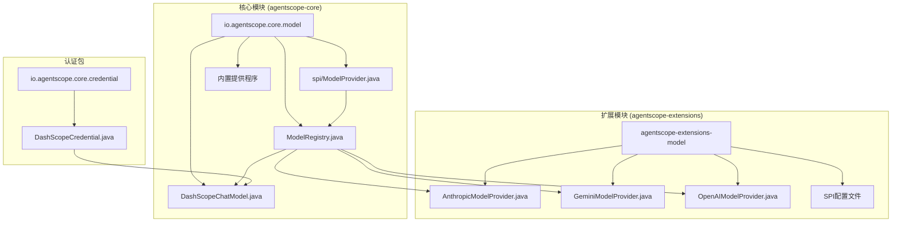
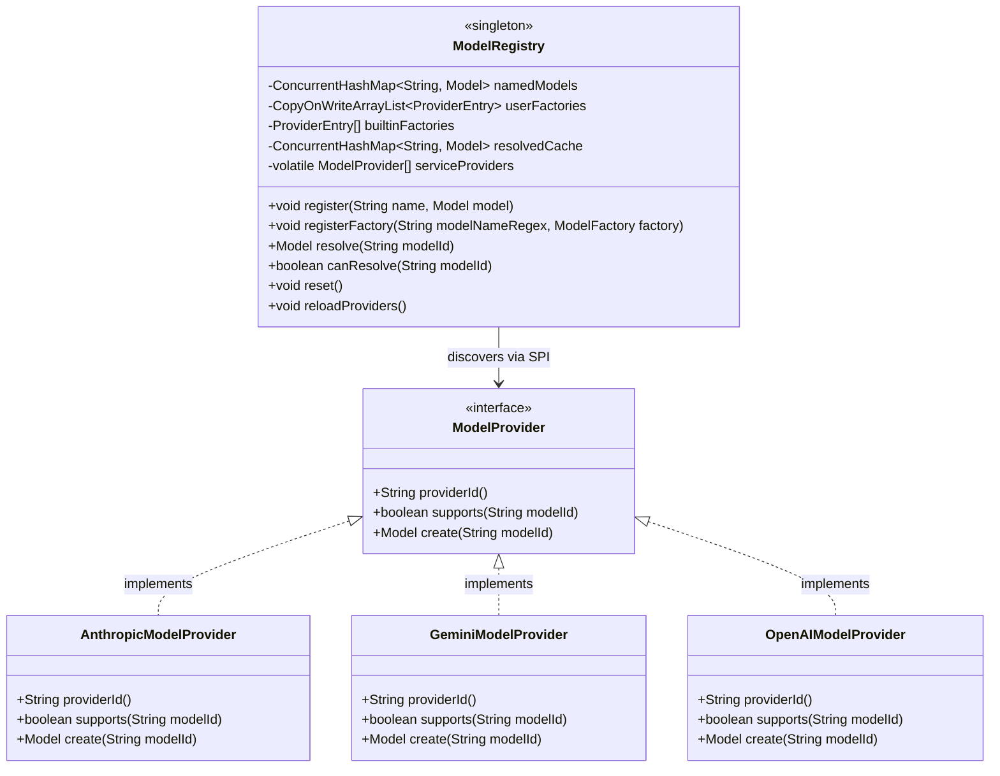
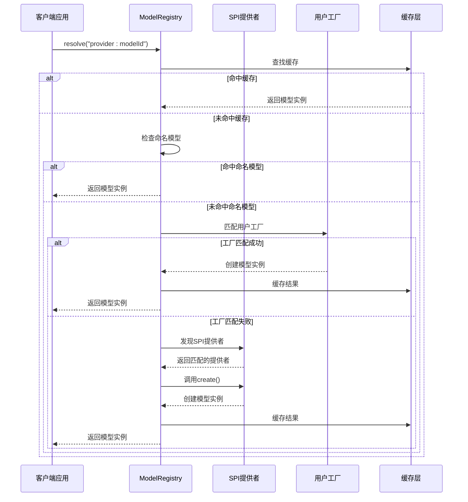
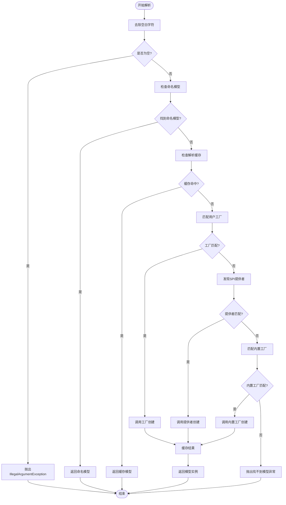
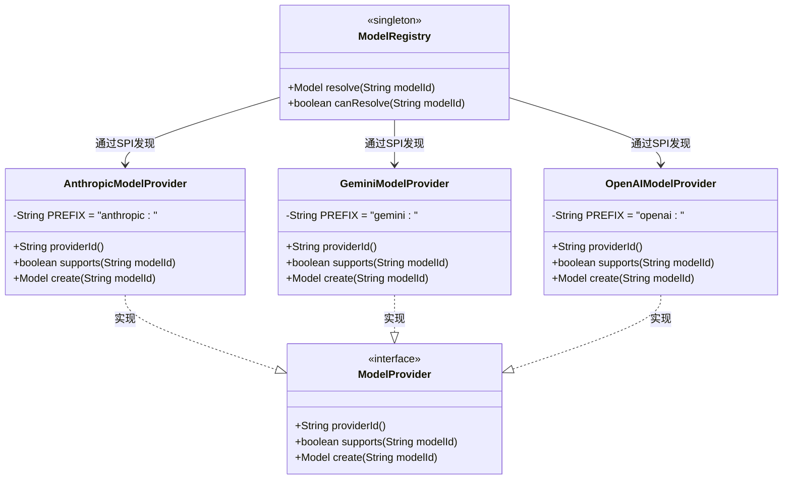
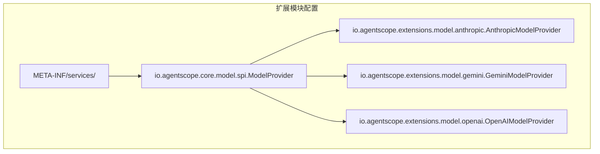
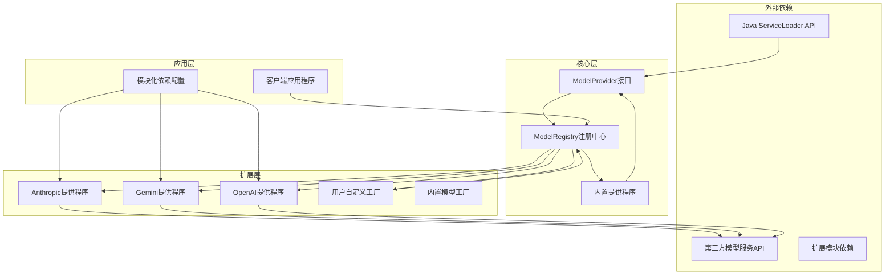

# 模型注册系统SPI支持

<cite>
**本文档引用的文件**
- [ModelProvider.java](file://agentscope-core/src/main/java/io/agentscope/core/model/spi/ModelProvider.java)
- [ModelRegistry.java](file://agentscope-core/src/main/java/io/agentscope/core/model/ModelRegistry.java)
- [DashScopeChatModel.java](file://agentscope-core/src/main/java/io/agentscope/core/model/DashScopeChatModel.java)
- [DashScopeCredential.java](file://agentscope-core/src/main/java/io/agentscope/core/credential/DashScopeCredential.java)
- [AnthropicModelProvider.java](file://agentscope-extensions/agentscope-extensions-model/agentscope-extensions-model-anthropic/src/main/java/io/agentscope/extensions/model/anthropic/AnthropicModelProvider.java)
- [GeminiModelProvider.java](file://agentscope-extensions/agentscope-extensions-model/agentscope-extensions-model-gemini/src/main/java/io/agentscope/extensions/model/gemini/GeminiModelProvider.java)
- [OpenAIModelProvider.java](file://agentscope-extensions/agentscope-extensions-model/agentscope-extensions-model-openai/src/main/java/io/agentscope/extensions/model/openai/OpenAIModelProvider.java)
</cite>

## 更新摘要
**变更内容**
- 更新了模型提供程序的模块化架构说明，反映Anthropic和Gemini从核心模块迁移到扩展模块
- 新增了扩展模块SPI提供程序的详细说明
- 更新了内置提供程序列表，移除了DashScope并新增了OpenAI支持
- 增强了模块化部署和依赖管理的指导

## 目录
1. [简介](#简介)
2. [项目结构](#项目结构)
3. [核心组件](#核心组件)
4. [架构概览](#架构概览)
5. [详细组件分析](#详细组件分析)
6. [模块化架构](#模块化架构)
7. [依赖关系分析](#依赖关系分析)
8. [性能考虑](#性能考虑)
9. [故障排除指南](#故障排除指南)
10. [结论](#结论)

## 简介

Agentscope Java项目的模型注册系统SPI（Service Provider Interface）支持是一个高度模块化的架构设计，旨在提供灵活的模型适配器扩展机制。该系统通过Java标准的ServiceLoader机制实现了可插拔的模型提供者支持，允许开发者轻松集成各种AI模型服务提供商。

**更新** 该系统现已完全模块化，Anthropic和Gemini模型提供程序已从核心模块重构到独立的扩展模块，但仍通过SPI架构保持向后兼容性。用户现在可以选择性地包含所需的模型提供程序，从而减少应用的启动时间和内存占用。

该系统的核心价值在于其分层架构设计：从底层的SPI接口定义到高层的注册中心管理，形成了一个完整的模型生命周期管理体系。通过这种设计，用户可以无缝地在不同模型服务之间切换，同时保持应用代码的一致性。

## 项目结构

模型注册系统的SPI支持现在采用模块化架构，分布在核心模块和扩展模块中：

**图表来源**
- [ModelProvider.java:20-31](file://agentscope-core/src/main/java/io/agentscope/core/model/spi/ModelProvider.java#L20-L31)
- [ModelRegistry.java:32-40](file://agentscope-core/src/main/java/io/agentscope/core/model/ModelRegistry.java#L32-L40)

**章节来源**
- [ModelProvider.java:20-31](file://agentscope-core/src/main/java/io/agentscope/core/model/spi/ModelProvider.java#L20-L31)
- [ModelRegistry.java:32-40](file://agentscope-core/src/main/java/io/agentscope/core/model/ModelRegistry.java#L32-L40)

## 核心组件

### SPI接口定义

模型注册系统的基石是`ModelProvider`接口，它定义了服务提供者的标准规范：

**图表来源**
- [ModelProvider.java:21-31](file://agentscope-core/src/main/java/io/agentscope/core/model/spi/ModelProvider.java#L21-L31)
- [ModelRegistry.java:103-130](file://agentscope-core/src/main/java/io/agentscope/core/model/ModelRegistry.java#L103-L130)
- [AnthropicModelProvider.java:22-43](file://agentscope-extensions/agentscope-extensions-model/agentscope-extensions-model-anthropic/src/main/java/io/agentscope/extensions/model/anthropic/AnthropicModelProvider.java#L22-L43)
- [GeminiModelProvider.java:22-51](file://agentscope-extensions/agentscope-extensions-model/agentscope-extensions-model-gemini/src/main/java/io/agentscope/extensions/model/gemini/GeminiModelProvider.java#L22-L51)
- [OpenAIModelProvider.java:22-47](file://agentscope-extensions/agentscope-extensions-model/agentscope-extensions-model-openai/src/main/java/io/agentscope/extensions/model/openai/OpenAIModelProvider.java#L22-L47)

### 注册中心架构

`ModelRegistry`作为整个系统的中央协调器，采用了多级查找策略：

1. **命名模型优先**：直接匹配精确的模型名称
2. **缓存查找**：避免重复创建昂贵的模型实例
3. **用户工厂**：支持正则表达式模式匹配
4. **SPI提供者**：动态发现和加载外部提供者
5. **内置工厂**：默认的模型创建逻辑

**更新** 内置提供程序现在包括：
- DashScope（核心模块）
- Ollama（核心模块）
- OpenAI（扩展模块）

**章节来源**
- [ModelRegistry.java:105-130](file://agentscope-core/src/main/java/io/agentscope/core/model/ModelRegistry.java#L105-L130)
- [ModelRegistry.java:138-185](file://agentscope-core/src/main/java/io/agentscope/core/model/ModelRegistry.java#L138-L185)

## 架构概览

模型注册系统的整体架构采用分层设计，确保了高内聚、低耦合的特性：

**图表来源**
- [ModelRegistry.java:138-185](file://agentscope-core/src/main/java/io/agentscope/core/model/ModelRegistry.java#L138-L185)
- [ModelRegistry.java:256-284](file://agentscope-core/src/main/java/io/agentscope/core/model/ModelRegistry.java#L256-L284)

## 详细组件分析

### ModelProvider接口详解

`ModelProvider`接口定义了服务提供者必须实现的核心方法：

| 方法 | 参数 | 返回值 | 描述 |
|------|------|--------|------|
| `providerId()` | 无 | `String` | 返回提供者的唯一标识符（如"openai"、"anthropic"、"gemini"） |
| `supports(String modelId)` | `modelId` | `boolean` | 判断是否支持指定的模型ID格式 |
| `create(String modelId)` | `modelId` | `Model` | 创建对应的模型实例 |

### ModelRegistry解析流程

解析过程遵循严格的优先级顺序，确保灵活性和性能的平衡：

**图表来源**
- [ModelRegistry.java:138-185](file://agentscope-core/src/main/java/io/agentscope/core/model/ModelRegistry.java#L138-L185)

### 具体实现示例

以Anthropic为例，展示如何实现一个完整的SPI提供者：

**图表来源**
- [AnthropicModelProvider.java:22-43](file://agentscope-extensions/agentscope-extensions-model/agentscope-extensions-model-anthropic/src/main/java/io/agentscope/extensions/model/anthropic/AnthropicModelProvider.java#L22-L43)
- [GeminiModelProvider.java:22-51](file://agentscope-extensions/agentscope-extensions-model/agentscope-extensions-model-gemini/src/main/java/io/agentscope/extensions/model/gemini/GeminiModelProvider.java#L22-L51)
- [OpenAIModelProvider.java:22-47](file://agentscope-extensions/agentscope-extensions-model/agentscope-extensions-model-openai/src/main/java/io/agentscope/extensions/model/openai/OpenAIModelProvider.java#L22-L47)

**章节来源**
- [ModelProvider.java:21-31](file://agentscope-core/src/main/java/io/agentscope/core/model/spi/ModelProvider.java#L21-L31)
- [ModelRegistry.java:138-185](file://agentscope-core/src/main/java/io/agentscope/core/model/ModelRegistry.java#L138-L185)
- [AnthropicModelProvider.java:22-43](file://agentscope-extensions/agentscope-extensions-model/agentscope-extensions-model-anthropic/src/main/java/io/agentscope/extensions/model/anthropic/AnthropicModelProvider.java#L22-L43)
- [GeminiModelProvider.java:22-51](file://agentscope-extensions/agentscope-extensions-model/agentscope-extensions-model-gemini/src/main/java/io/agentscope/extensions/model/gemini/GeminiModelProvider.java#L22-L51)
- [OpenAIModelProvider.java:22-47](file://agentscope-extensions/agentscope-extensions-model/agentscope-extensions-model-openai/src/main/java/io/agentscope/extensions/model/openai/OpenAIModelProvider.java#L22-L47)

## 模块化架构

**更新** Agentscope现在采用完全模块化的架构，模型提供程序按需加载：

### 核心模块 (agentscope-core)
- `ModelProvider`接口定义
- `ModelRegistry`注册中心
- 内置提供程序：DashScope、Ollama
- 基础模型类和工具

### 扩展模块 (agentscope-extensions)
- `agentscope-extensions-model-anthropic`：Anthropic模型提供程序
- `agentscope-extensions-model-gemini`：Google Gemini模型提供程序  
- `agentscope-extensions-model-openai`：OpenAI模型提供程序

### SPI配置机制

每个扩展模块通过`META-INF/services/io.agentscope.core.model.spi.ModelProvider`文件声明SPI提供程序：

**图表来源**
- [AnthropicModelProvider.java:22-43](file://agentscope-extensions/agentscope-extensions-model/agentscope-extensions-model-anthropic/src/main/java/io/agentscope/extensions/model/anthropic/AnthropicModelProvider.java#L22-L43)
- [GeminiModelProvider.java:22-51](file://agentscope-extensions/agentscope-extensions-model/agentscope-extensions-model-gemini/src/main/java/io/agentscope/extensions/model/gemini/GeminiModelProvider.java#L22-L51)
- [OpenAIModelProvider.java:22-47](file://agentscope-extensions/agentscope-extensions-model/agentscope-extensions-model-openai/src/main/java/io/agentscope/extensions/model/openai/OpenAIModelProvider.java#L22-L47)

**章节来源**
- [AnthropicModelProvider.java:22-43](file://agentscope-extensions/agentscope-extensions-model/agentscope-extensions-model-anthropic/src/main/java/io/agentscope/extensions/model/anthropic/AnthropicModelProvider.java#L22-L43)
- [GeminiModelProvider.java:22-51](file://agentscope-extensions/agentscope-extensions-model/agentscope-extensions-model-gemini/src/main/java/io/agentscope/extensions/model/gemini/GeminiModelProvider.java#L22-L51)
- [OpenAIModelProvider.java:22-47](file://agentscope-extensions/agentscope-extensions-model/agentscope-extensions-model-openai/src/main/java/io/agentscope/extensions/model/openai/OpenAIModelProvider.java#L22-L47)

## 依赖关系分析

模型注册系统的依赖关系体现了清晰的层次结构：

**图表来源**
- [ModelRegistry.java:287-337](file://agentscope-core/src/main/java/io/agentscope/core/model/ModelRegistry.java#L287-L337)

系统的关键特性包括：

1. **松耦合设计**：通过SPI接口实现运行时绑定
2. **延迟初始化**：SPI提供者仅在需要时才被发现和加载
3. **线程安全**：使用并发数据结构保证多线程环境下的安全性
4. **可扩展性**：支持用户自定义提供者和工厂
5. **模块化部署**：按需加载扩展模块，减少应用体积

**章节来源**
- [ModelRegistry.java:46-51](file://agentscope-core/src/main/java/io/agentscope/core/model/ModelRegistry.java#L46-L51)
- [ModelRegistry.java:287-337](file://agentscope-core/src/main/java/io/agentscope/core/model/ModelRegistry.java#L287-L337)

## 性能考虑

模型注册系统在设计时充分考虑了性能优化：

### 缓存策略
- **命名模型缓存**：避免重复的命名模型查找
- **解析结果缓存**：防止重复创建相同的模型实例
- **SPI提供者缓存**：减少ServiceLoader的重复扫描开销

### 内存管理
- 使用`ConcurrentHashMap`确保高并发场景下的性能
- 采用`CopyOnWriteArrayList`保证用户工厂注册的安全性
- 提供`reset()`方法清理内存占用

### 错误处理
- 对SPI提供者的异常进行隔离处理
- 支持提供者的降级和回退机制
- 提供详细的错误信息便于调试

**更新** 模块化架构带来的性能优势：
- 减少不必要的类加载
- 降低启动时间
- 减少内存占用
- 支持热插拔扩展

## 故障排除指南

### 常见问题及解决方案

| 问题类型 | 症状 | 可能原因 | 解决方案 |
|----------|------|----------|----------|
| SPI提供者未发现 | `IllegalArgumentException: Cannot resolve model` | SPI配置文件缺失或类路径问题 | 检查META-INF/services文件配置 |
| 模块依赖缺失 | 类加载器找不到扩展类 | 未包含相应的扩展模块 | 添加对应模块的Maven/Gradle依赖 |
| API密钥配置错误 | 模型创建失败 | 环境变量未设置或为空 | 设置正确的API密钥环境变量 |
| 提供者冲突 | 多个提供者支持同一模型ID | 多个SPI实现存在 | 检查提供者优先级和配置 |
| 内存泄漏 | 持续增长的内存使用 | 缓存未清理 | 调用`ModelRegistry.reset()` |
| 性能问题 | 模型创建缓慢 | SPI扫描开销过大 | 检查类加载器配置 |

### 调试技巧

1. **启用日志记录**：观察SPI提供者的发现和加载过程
2. **使用`canResolve()`方法**：在实际创建前验证模型ID的有效性
3. **监控缓存状态**：定期检查解析缓存的命中率
4. **检查模块依赖**：确认所需扩展模块已正确添加到项目中

**章节来源**
- [ModelRegistry.java:192-206](file://agentscope-core/src/main/java/io/agentscope/core/model/ModelRegistry.java#L192-L206)
- [ModelRegistry.java:212-225](file://agentscope-core/src/main/java/io/agentscope/core/model/ModelRegistry.java#L212-L225)

## 结论

Agentscope Java项目的模型注册系统SPI支持展现了现代Java框架的最佳实践。通过精心设计的分层架构和严格的接口定义，该系统为AI模型的集成提供了强大而灵活的解决方案。

**更新** 系统现已完全模块化，主要优势包括：

1. **高度可扩展性**：通过SPI机制轻松集成新的模型服务提供商
2. **模块化部署**：按需加载扩展模块，减少应用体积和启动时间
3. **性能优化**：智能缓存策略和延迟初始化机制
4. **开发友好**：简洁的API设计和完善的错误处理
5. **生产就绪**：经过充分测试和优化，适合企业级应用

对于开发者而言，理解这个系统的架构原理和使用模式，将有助于构建更加灵活和可维护的AI应用。无论是简单的单模型应用还是复杂的多模型集成场景，该系统都能提供稳定可靠的支持。

**推荐的模块化部署策略**：
- 核心模块：始终包含（ModelProvider、ModelRegistry、内置提供程序）
- 扩展模块：按需包含（Anthropic、Gemini、OpenAI等）
- 自定义模块：通过SPI接口实现自己的模型提供程序
