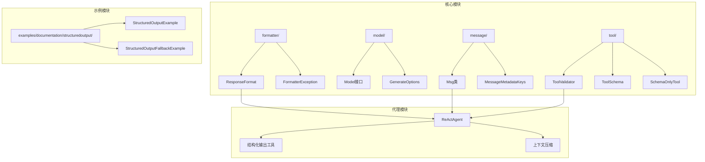
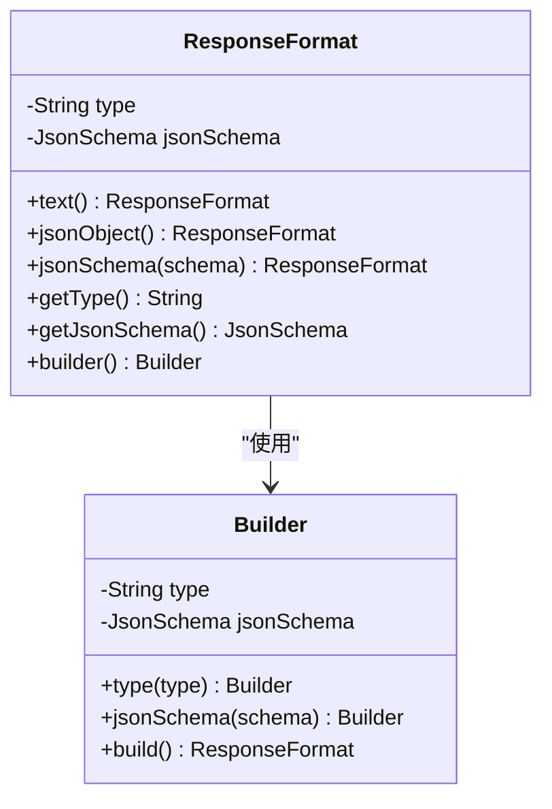
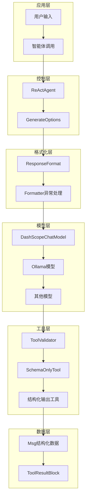
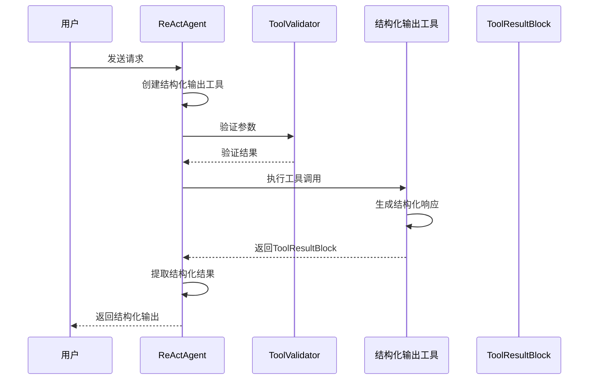
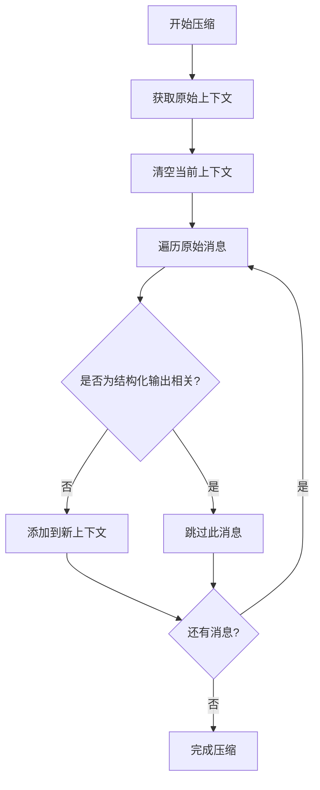
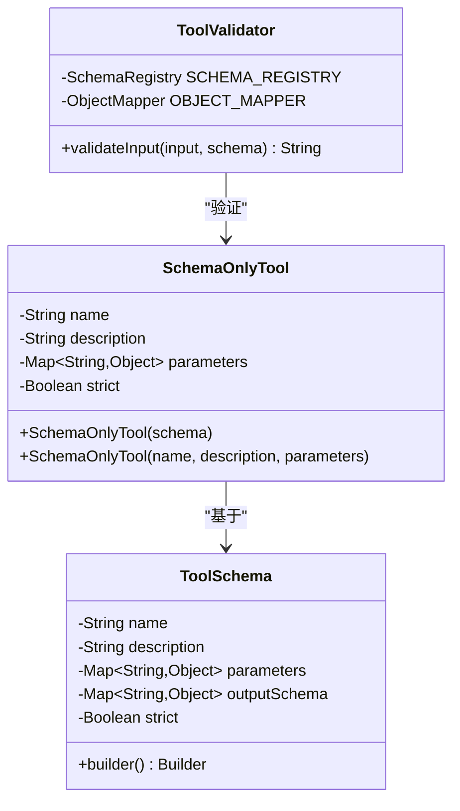
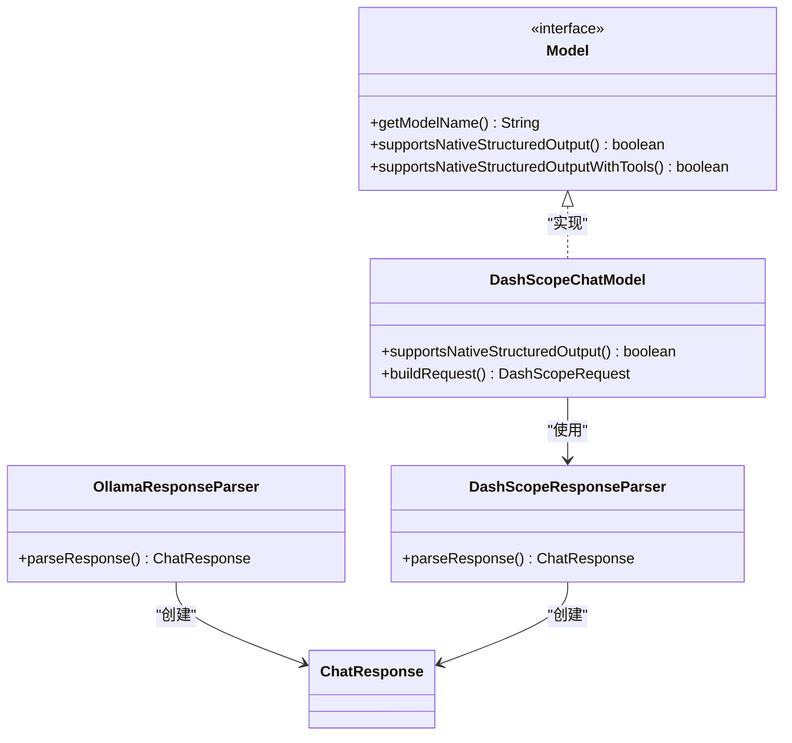
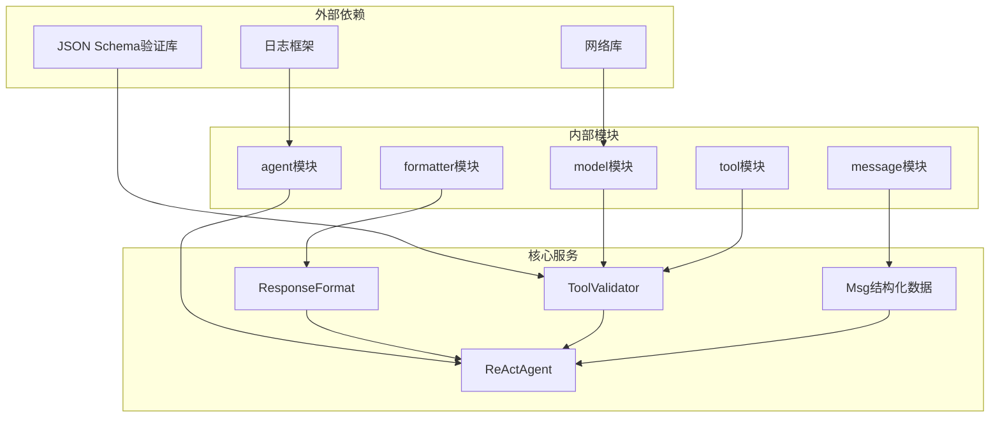

# 结构化输出支持

<cite>
**本文档引用的文件**
- [ResponseFormat.java](file://agentscope-core/src/main/java/io/agentscope/core/formatter/ResponseFormat.java)
- [FormatterException.java](file://agentscope-core/src/main/java/io/agentscope/core/formatter/FormatterException.java)
- [ReActAgent.java](file://agentscope-core/src/main/java/io/agentscope/core/ReActAgent.java)
- [Msg.java](file://agentscope-core/src/main/java/io/agentscope/core/message/Msg.java)
- [MessageMetadataKeys.java](file://agentscope-core/src/main/java/io/agentscope/core/message/MessageMetadataKeys.java)
- [ToolValidator.java](file://agentscope-core/src/main/java/io/agentscope/core/tool/ToolValidator.java)
- [ToolSchema.java](file://agentscope-core/src/main/java/io/agentscope/core/tool/ToolSchema.java)
- [SchemaOnlyTool.java](file://agentscope-core/src/main/java/io/agentscope/core/tool/SchemaOnlyTool.java)
- [DashScopeChatModel.java](file://agentscope-core/src/main/java/io/agentscope/core/model/DashScopeChatModel.java)
- [OllamaResponseParser.java](file://agentscope-core/src/main/java/io/agentscope/core/formatter/ollama/OllamaResponseParser.java)
- [DashScopeResponseParser.java](file://agentscope-core/src/main/java/io/agentscope/core/formatter/dashscope/DashScopeResponseParser.java)
- [StructuredOutputExample.java](file://agentscope-examples/documentation/src/main/java/io/agentscope/examples/documentation2/structuredoutput/StructuredOutputExample.java)
- [StructuredOutputFallbackExample.java](file://agentscope-examples/documentation/src/main/java/io/agentscope/examples/documentation2/structuredoutput/StructuredOutputFallbackExample.java)
</cite>

## 目录
1. [简介](#简介)
2. [项目结构](#项目结构)
3. [核心组件](#核心组件)
4. [架构概览](#架构概览)
5. [详细组件分析](#详细组件分析)
6. [依赖关系分析](#依赖关系分析)
7. [性能考虑](#性能考虑)
8. [故障排除指南](#故障排除指南)
9. [结论](#结论)

## 简介

Agentscope Java 项目提供了完整的结构化输出支持，允许智能体生成符合特定 JSON Schema 的结构化数据。该功能通过多种机制实现：原生结构化输出支持、工具驱动的结构化输出捕获，以及消息元数据管理。

结构化输出支持的核心价值在于：
- 确保模型响应的数据格式一致性
- 提供强类型的数据验证和转换
- 支持复杂的嵌套数据结构定义
- 实现端到端的数据流控制

## 项目结构

项目采用模块化架构设计，结构化输出功能分布在多个核心模块中：

**图表来源**
- [ResponseFormat.java:61-140](file://agentscope-core/src/main/java/io/agentscope/core/formatter/ResponseFormat.java#L61-L140)
- [ReActAgent.java:1160-1328](file://agentscope-core/src/main/java/io/agentscope/core/ReActAgent.java#L1160-L1328)

**章节来源**
- [ResponseFormat.java:61-140](file://agentscope-core/src/main/java/io/agentscope/core/formatter/ResponseFormat.java#L61-L140)
- [ReActAgent.java:1160-1328](file://agentscope-core/src/main/java/io/agentscope/core/ReActAgent.java#L1160-L1328)

## 核心组件

### 响应格式管理器

ResponseFormat 类是结构化输出的核心配置组件，提供三种输出格式：

1. **纯文本格式** (`text()`) - 返回原始文本内容
2. **JSON 对象格式** (`jsonObject()`) - 返回结构化 JSON 对象
3. **JSON Schema 格式** (`jsonSchema()`) - 基于指定模式验证的结构化输出

**图表来源**
- [ResponseFormat.java:61-140](file://agentscope-core/src/main/java/io/agentscope/core/formatter/ResponseFormat.java#L61-L140)

### 消息结构化数据处理

Msg 类提供了强大的结构化数据提取能力，支持：
- 安全的结构化数据访问
- 类型安全的数据转换
- 元数据驱动的消息处理

**章节来源**
- [Msg.java:491-517](file://agentscope-core/src/main/java/io/agentscope/core/message/Msg.java#L491-L517)
- [MessageMetadataKeys.java:50-59](file://agentscope-core/src/main/java/io/agentscope/core/message/MessageMetadataKeys.java#L50-L59)

## 架构概览

结构化输出系统采用分层架构设计，确保灵活性和可扩展性：

**图表来源**
- [ReActAgent.java:1238-1328](file://agentscope-core/src/main/java/io/agentscope/core/ReActAgent.java#L1238-L1328)
- [ToolValidator.java:77-87](file://agentscope-core/src/main/java/io/agentscope/core/tool/ToolValidator.java#L77-L87)
- [DashScopeChatModel.java:386-388](file://agentscope-core/src/main/java/io/agentscope/core/model/DashScopeChatModel.java#L386-L388)

## 详细组件分析

### ReActAgent 结构化输出实现

ReActAgent 是结构化输出功能的核心实现者，负责整个输出流程的协调：

**图表来源**
- [ReActAgent.java:2904-2924](file://agentscope-core/src/main/java/io/agentscope/core/ReActAgent.java#L2904-L2924)
- [ReActAgent.java:1272-1307](file://agentscope-core/src/main/java/io/agentscope/core/ReActAgent.java#L1272-L1307)

#### 上下文压缩机制

ReActAgent 实现了智能的上下文压缩功能，自动移除与结构化输出相关的临时消息：

**图表来源**
- [ReActAgent.java:1164-1173](file://agentscope-core/src/main/java/io/agentscope/core/ReActAgent.java#L1164-L1173)

**章节来源**
- [ReActAgent.java:1160-1328](file://agentscope-core/src/main/java/io/agentscope/core/ReActAgent.java#L1160-L1328)
- [ReActAgent.java:2900-2924](file://agentscope-core/src/main/java/io/agentscope/core/ReActAgent.java#L2900-L2924)

### 工具验证系统

ToolValidator 提供了全面的工具输入验证功能：

**图表来源**
- [ToolValidator.java:77-87](file://agentscope-core/src/main/java/io/agentscope/core/tool/ToolValidator.java#L77-L87)
- [SchemaOnlyTool.java:67-87](file://agentscope-core/src/main/java/io/agentscope/core/tool/SchemaOnlyTool.java#L67-L87)
- [ToolSchema.java:178-182](file://agentscope-core/src/main/java/io/agentscope/core/tool/ToolSchema.java#L178-L182)

**章节来源**
- [ToolValidator.java:38-87](file://agentscope-core/src/main/java/io/agentscope/core/tool/ToolValidator.java#L38-L87)
- [SchemaOnlyTool.java:59-87](file://agentscope-core/src/main/java/io/agentscope/core/tool/SchemaOnlyTool.java#L59-L87)
- [ToolSchema.java:81-182](file://agentscope-core/src/main/java/io/agentscope/core/tool/ToolSchema.java#L81-L182)

### 模型集成支持

不同模型提供商对结构化输出的支持程度不同：

**图表来源**
- [Model.java:51-53](file://agentscope-core/src/main/java/io/agentscope/core/model/Model.java#L51-L53)
- [DashScopeChatModel.java:386-388](file://agentscope-core/src/main/java/io/agentscope/core/model/DashScopeChatModel.java#L386-L388)
- [OllamaResponseParser.java:116-126](file://agentscope-core/src/main/java/io/agentscope/core/formatter/ollama/OllamaResponseParser.java#L116-L126)

**章节来源**
- [DashScopeChatModel.java:386-388](file://agentscope-core/src/main/java/io/agentscope/core/model/DashScopeChatModel.java#L386-L388)
- [OllamaResponseParser.java:98-127](file://agentscope-core/src/main/java/io/agentscope/core/formatter/ollama/OllamaResponseParser.java#L98-L127)
- [DashScopeResponseParser.java:18-50](file://agentscope-core/src/main/java/io/agentscope/core/formatter/dashscope/DashScopeResponseParser.java#L18-L50)

## 依赖关系分析

结构化输出系统的依赖关系呈现清晰的层次结构：

**图表来源**
- [ToolValidator.java:49-51](file://agentscope-core/src/main/java/io/agentscope/core/tool/ToolValidator.java#L49-L51)
- [ReActAgent.java:1238-1328](file://agentscope-core/src/main/java/io/agentscope/core/ReActAgent.java#L1238-L1328)

**章节来源**
- [ToolValidator.java:49-51](file://agentscope-core/src/main/java/io/agentscope/core/tool/ToolValidator.java#L49-L51)
- [ResponseFormat.java:61-140](file://agentscope-core/src/main/java/io/agentscope/core/formatter/ResponseFormat.java#L61-L140)

## 性能考虑

结构化输出功能在设计时充分考虑了性能优化：

### 内存管理
- 使用不可变数据结构减少内存分配
- 智能缓存机制避免重复验证
- 流式处理支持大体量数据

### 并发处理
- 异步工具调用支持非阻塞执行
- 原子操作确保数据一致性
- 连接池优化网络请求

### 缓存策略
- Schema 验证结果缓存
- 模型响应缓存
- 中间结果缓存

## 故障排除指南

### 常见问题及解决方案

**问题1：结构化输出验证失败**
- 检查 JSON Schema 定义的完整性
- 验证输入数据类型匹配
- 查看详细的验证错误信息

**问题2：消息元数据丢失**
- 确认 MessageMetadataKeys 的正确使用
- 检查消息构建过程中的元数据设置
- 验证序列化/反序列化过程

**问题3：模型不支持原生结构化输出**
- 使用工具驱动的替代方案
- 检查模型配置选项
- 验证 API 版本兼容性

**章节来源**
- [FormatterException.java:24-44](file://agentscope-core/src/main/java/io/agentscope/core/formatter/FormatterException.java#L24-L44)
- [ToolValidator.java:77-87](file://agentscope-core/src/main/java/io/agentscope/core/tool/ToolValidator.java#L77-L87)

## 结论

Agentscope Java 项目的结构化输出支持展现了现代 AI 应用开发的最佳实践。通过模块化设计、完善的错误处理机制和灵活的配置选项，该系统能够满足各种复杂的应用场景需求。

主要优势包括：
- **高度可配置**：支持多种输出格式和验证模式
- **强类型安全**：编译时类型检查和运行时验证
- **性能优化**：异步处理和智能缓存机制
- **扩展性强**：插件化的架构设计支持新模型接入

未来发展方向：
- 更多模型提供商的原生支持
- 增强的调试和监控功能
- 自动化的 Schema 生成工具
- 更丰富的数据转换和映射功能
