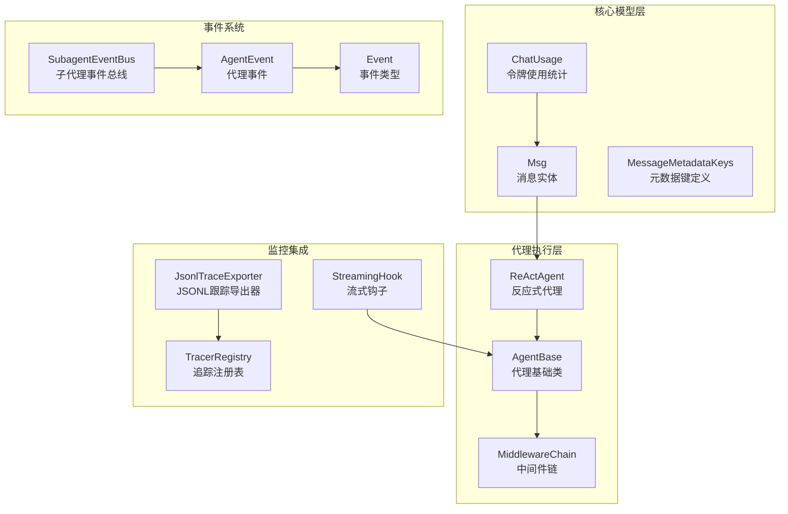
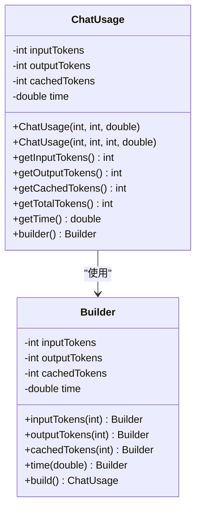
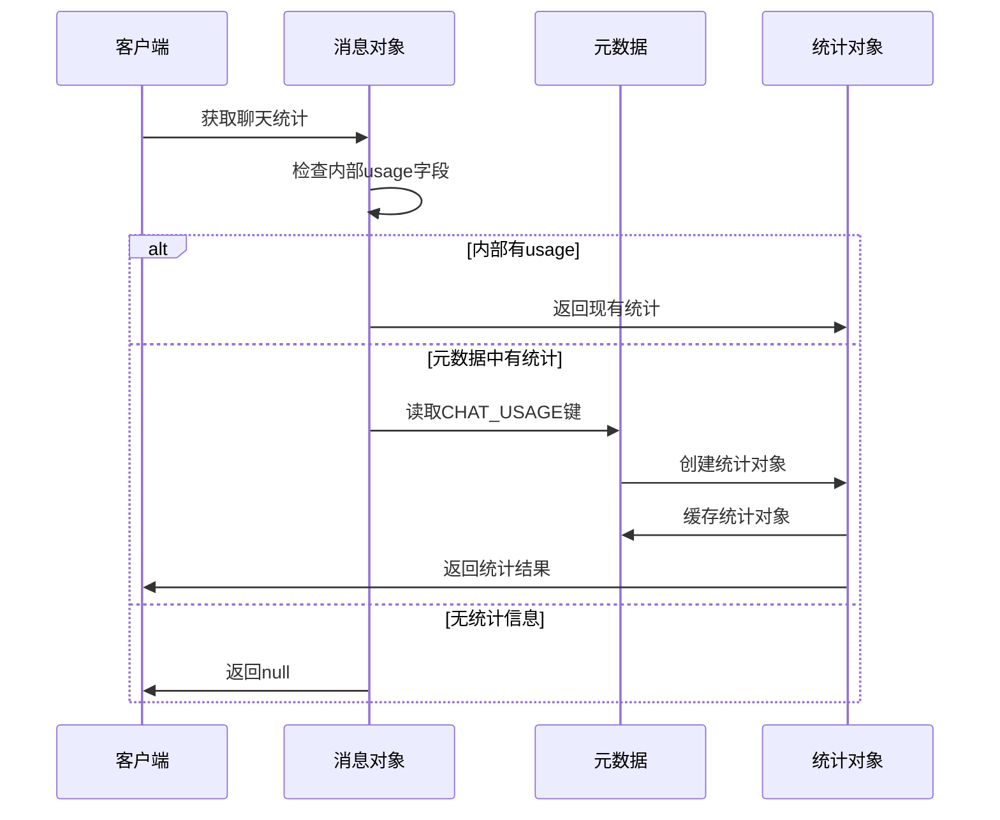
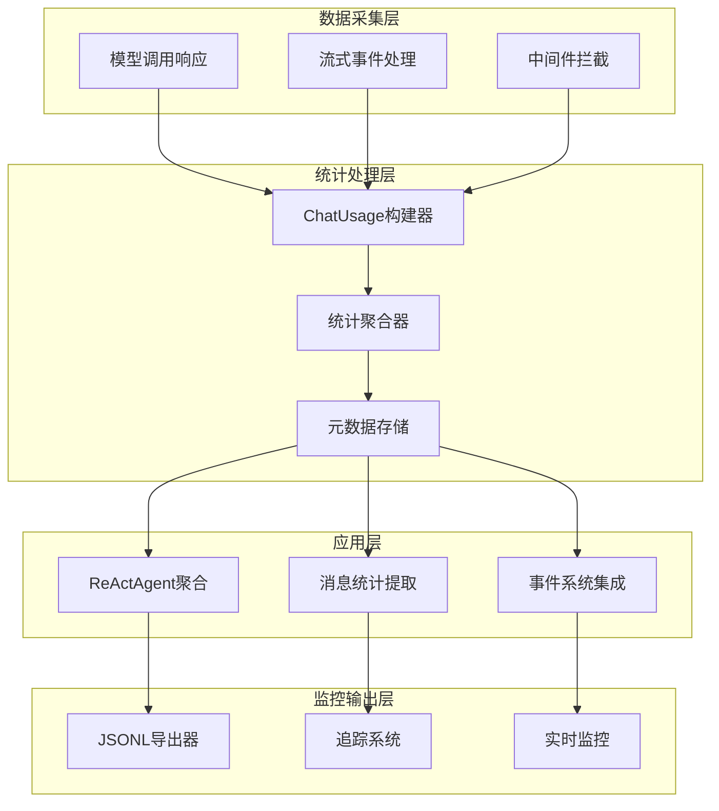
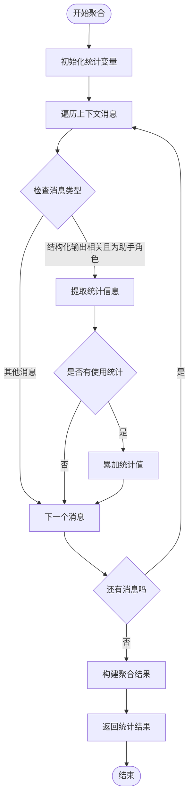
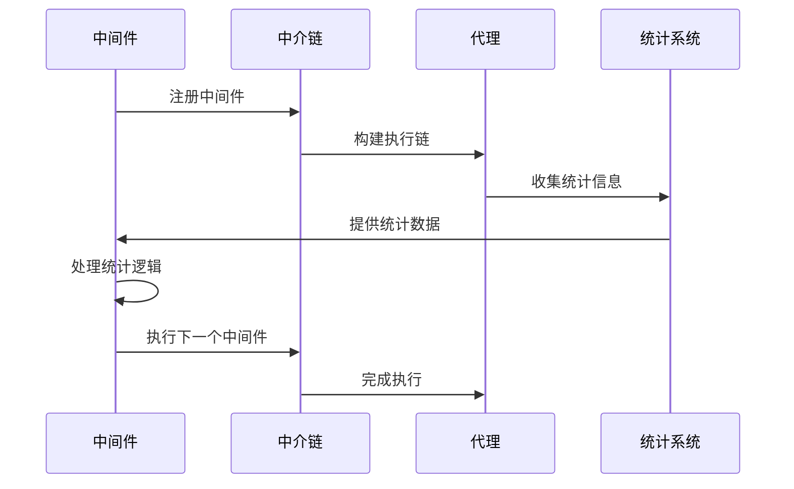
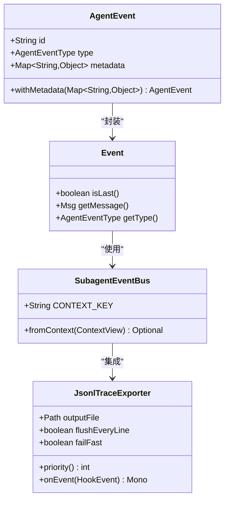
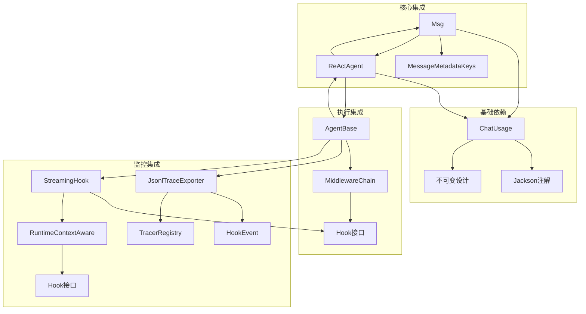

# 聊天使用统计增强

<cite>
**本文档引用的文件**
- [ChatUsage.java](file://agentscope-core/src/main/java/io/agentscope/core/model/ChatUsage.java)
- [Msg.java](file://agentscope-core/src/main/java/io/agentscope/core/message/Msg.java)
- [ReActAgent.java](file://agentscope-core/src/main/java/io/agentscope/core/ReActAgent.java)
- [AgentBase.java](file://agentscope-core/src/main/java/io/agentscope/core/agent/AgentBase.java)
- [MiddlewareChain.java](file://agentscope-core/src/main/java/io/agentscope/core/middleware/MiddlewareChain.java)
- [JsonlTraceExporter.java](file://agentscope-core/src/main/java/io/agentscope/core/hook/recorder/JsonlTraceExporter.java)
- [RuntimeContextAware.java](file://agentscope-core/src/main/java/io/agentscope/core/hook/RuntimeContextAware.java)
- [StreamingHook.java](file://agentscope-core/src/main/java/io/agentscope/core/agent/StreamingHook.java)
- [TracerRegistry.java](file://agentscope-core/src/main/java/io/agentscope/core/tracing/TracerRegistry.java)
- [AgentEvent.java](file://agentscope-core/src/main/java/io/agentscope/core/event/AgentEvent.java)
- [MessageMetadataKeys.java](file://agentscope-core/src/main/java/io/agentscope/core/message/MessageMetadataKeys.java)
</cite>

## 目录
1. [简介](#简介)
2. [项目结构](#项目结构)
3. [核心组件](#核心组件)
4. [架构概览](#架构概览)
5. [详细组件分析](#详细组件分析)
6. [依赖关系分析](#依赖关系分析)
7. [性能考虑](#性能考虑)
8. [故障排除指南](#故障排除指南)
9. [结论](#结论)

## 简介

Agentscope Java 项目中的聊天使用统计增强功能是一个重要的监控和分析系统，旨在提供对AI代理聊天交互的全面统计信息。该功能通过追踪和记录聊天过程中的令牌使用量、执行时间和响应统计，为开发者和用户提供深入的洞察。

该系统的核心是 `ChatUsage` 类，它提供了统一的数据结构来表示和处理聊天使用的统计数据。通过与消息系统、代理执行流程和中间件系统的深度集成，实现了从底层令牌计数到高层统计聚合的完整监控链路。

## 项目结构

项目采用模块化架构设计，聊天使用统计功能主要分布在以下核心模块中：

**图表来源**
- [ChatUsage.java:1-191](file://agentscope-core/src/main/java/io/agentscope/core/model/ChatUsage.java#L1-L191)
- [Msg.java:537-598](file://agentscope-core/src/main/java/io/agentscope/core/message/Msg.java#L537-L598)
- [ReActAgent.java:1192-1218](file://agentscope-core/src/main/java/io/agentscope/core/ReActAgent.java#L1192-L1218)

## 核心组件

### ChatUsage 数据模型

`ChatUsage` 类是整个统计系统的核心数据结构，提供了完整的令牌使用信息追踪能力：

**图表来源**
- [ChatUsage.java:28-191](file://agentscope-core/src/main/java/io/agentscope/core/model/ChatUsage.java#L28-L191)

该类支持四种不同的令牌类型：
- **输入令牌 (inputTokens)**：用于提示词或输入内容的令牌数量
- **输出令牌 (outputTokens)**：生成响应所使用的令牌数量  
- **缓存令牌 (cachedTokens)**：从提示词缓存中提供的令牌数量
- **执行时间 (time)**：以秒为单位的执行时长

### 消息统计集成

`Msg` 类集成了统计信息的自动提取和转换功能：

**图表来源**
- [Msg.java:558-584](file://agentscope-core/src/main/java/io/agentscope/core/message/Msg.java#L558-L584)

**章节来源**
- [ChatUsage.java:1-191](file://agentscope-core/src/main/java/io/agentscope/core/model/ChatUsage.java#L1-L191)
- [Msg.java:537-598](file://agentscope-core/src/main/java/io/agentscope/core/message/Msg.java#L537-L598)

## 架构概览

聊天使用统计增强系统采用分层架构设计，确保了统计信息的准确收集和高效处理：

**图表来源**
- [ReActAgent.java:1192-1218](file://agentscope-core/src/main/java/io/agentscope/core/ReActAgent.java#L1192-L1218)
- [MiddlewareChain.java:46-62](file://agentscope-core/src/main/java/io/agentscope/core/middleware/MiddlewareChain.java#L46-L62)

## 详细组件分析

### ReActAgent 统计聚合

`ReActAgent` 实现了高级别的统计聚合功能，能够汇总整个对话过程中的所有统计信息：

**图表来源**
- [ReActAgent.java:1192-1218](file://agentscope-core/src/main/java/io/agentscope/core/ReActAgent.java#L1192-L1218)

该聚合器专门处理结构化输出相关的消息，并只统计助手角色的响应，确保统计的准确性。

### 中间件链统计集成

中间件链系统提供了统计信息在代理执行过程中的无缝集成：

**图表来源**
- [MiddlewareChain.java:46-62](file://agentscope-core/src/main/java/io/agentscope/core/middleware/MiddlewareChain.java#L46-L62)

**章节来源**
- [ReActAgent.java:1192-1218](file://agentscope-core/src/main/java/io/agentscope/core/ReActAgent.java#L1192-L1218)
- [MiddlewareChain.java:1-78](file://agentscope-core/src/main/java/io/agentscope/core/middleware/MiddlewareChain.java#L1-L78)

### 事件系统统计追踪

事件系统为统计信息提供了实时追踪和持久化能力：

**图表来源**
- [AgentEvent.java:126-138](file://agentscope-core/src/main/java/io/agentscope/core/event/AgentEvent.java#L126-L138)
- [SubagentEventBus.java:37-43](file://agentscope-core/src/main/java/io/agentscope/core/agent/SubagentEventBus.java#L37-L43)
- [JsonlTraceExporter.java:87-153](file://agentscope-core/src/main/java/io/agentscope/core/hook/recorder/JsonlTraceExporter.java#L87-L153)

**章节来源**
- [AgentEvent.java:126-138](file://agentscope-core/src/main/java/io/agentscope/core/event/AgentEvent.java#L126-L138)
- [SubagentEventBus.java:18-43](file://agentscope-core/src/main/java/io/agentscope/core/agent/SubagentEventBus.java#L18-L43)
- [JsonlTraceExporter.java:67-548](file://agentscope-core/src/main/java/io/agentscope/core/hook/recorder/JsonlTraceExporter.java#L67-L548)

## 依赖关系分析

聊天使用统计增强系统展现了清晰的依赖层次结构：

**图表来源**
- [ChatUsage.java:18-20](file://agentscope-core/src/main/java/io/agentscope/core/model/ChatUsage.java#L18-L20)
- [Msg.java:567](file://agentscope-core/src/main/java/io/agentscope/core/message/Msg.java#L567)
- [ReActAgent.java:1192-1218](file://agentscope-core/src/main/java/io/agentscope/core/ReActAgent.java#L1192-L1218)

**章节来源**
- [ChatUsage.java:1-191](file://agentscope-core/src/main/java/io/agentscope/core/model/ChatUsage.java#L1-L191)
- [Msg.java:537-598](file://agentscope-core/src/main/java/io/agentscope/core/message/Msg.java#L537-L598)
- [AgentBase.java:597-1013](file://agentscope-core/src/main/java/io/agentscope/core/agent/AgentBase.java#L597-L1013)

## 性能考虑

聊天使用统计增强系统在设计时充分考虑了性能影响：

### 内存管理优化
- 使用不可变数据结构避免并发修改问题
- 采用延迟加载机制，仅在需要时解析统计信息
- 缓存已解析的统计对象，避免重复计算

### 并发安全
- 所有统计操作都是线程安全的
- 使用原子操作和并发集合确保数据一致性
- 避免在热路径上进行昂贵的序列化操作

### 资源管理
- 及时清理临时统计数据
- 合理的内存使用策略，避免内存泄漏
- 支持大流量场景下的稳定运行

## 故障排除指南

### 常见问题诊断

**统计信息缺失**
- 检查消息是否正确设置了 `CHAT_USAGE` 元数据
- 验证模型响应是否包含令牌使用信息
- 确认中间件链是否正确传递统计数据

**性能问题**
- 监控统计聚合的执行时间
- 检查是否存在过多的消息需要处理
- 评估内存使用情况和垃圾回收频率

**集成问题**
- 验证中间件的注册顺序
- 检查事件过滤器的配置
- 确认追踪系统的正确初始化

**章节来源**
- [JsonlTraceExporter.java:142-152](file://agentscope-core/src/main/java/io/agentscope/core/hook/recorder/JsonlTraceExporter.java#L142-L152)
- [TracerRegistry.java:145-164](file://agentscope-core/src/main/java/io/agentscope/core/tracing/TracerRegistry.java#L145-L164)

## 结论

Agentscope Java 项目的聊天使用统计增强功能展现了现代AI代理系统的最佳实践。通过精心设计的数据模型、高效的执行流程和完善的监控集成，该系统为用户提供了全面的聊天使用洞察。

关键优势包括：
- **精确的统计追踪**：支持多种令牌类型的精确计量
- **高效的性能表现**：最小化的性能开销和内存占用
- **灵活的集成方式**：与现有代理架构无缝集成
- **强大的扩展性**：支持自定义统计需求和监控方案

该系统不仅满足了当前的统计需求，还为未来的功能扩展奠定了坚实的基础。通过持续的优化和改进，聊天使用统计增强功能将继续为Agentscope生态系统提供强有力的支持。
