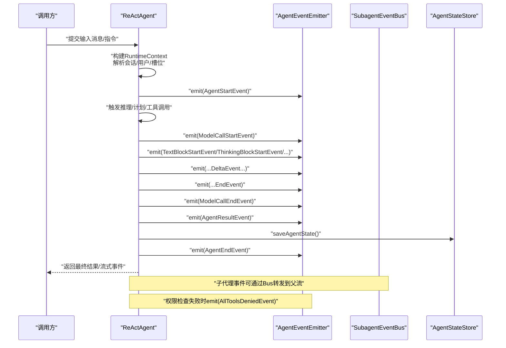
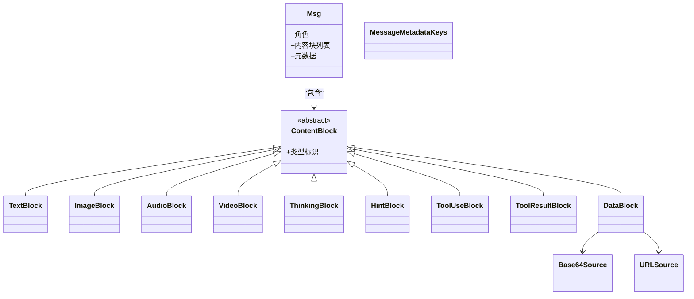
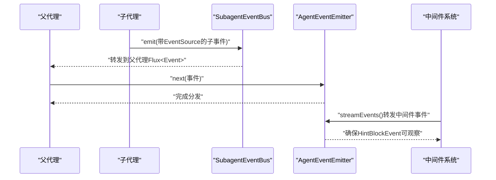
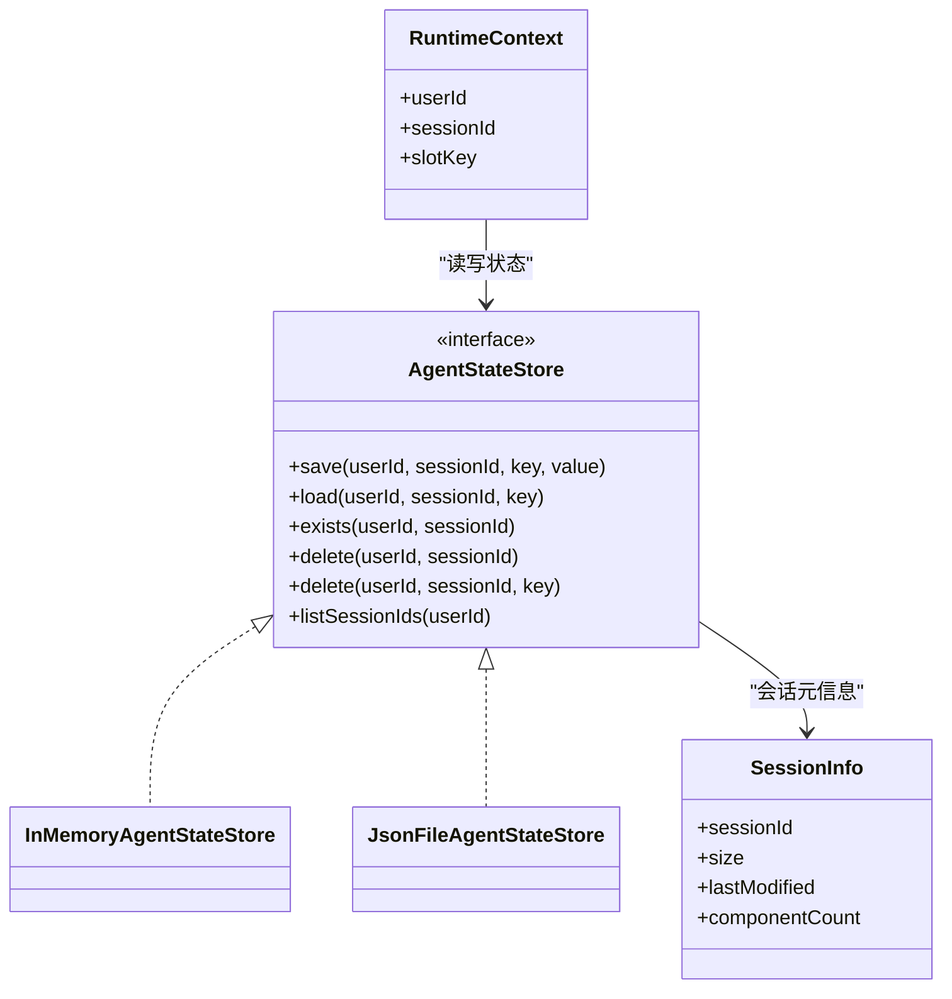
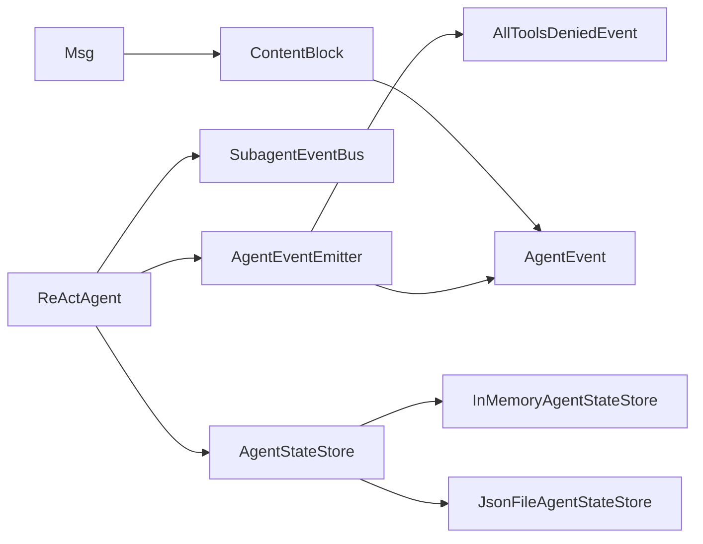

# 消息与事件系统

<cite>
**本文引用的文件**
- [Msg.java](file://agentscope-core/src/main/java/io/agentscope/core/message/Msg.java)
- [ContentBlock.java](file://agentscope-core/src/main/java/io/agentscope/core/message/ContentBlock.java)
- [AssistantMessage.java](file://agentscope-core/src/main/java/io/agentscope/core/message/AssistantMessage.java)
- [SystemMessage.java](file://agentscope-core/src/main/java/io/agentscope/core/message/SystemMessage.java)
- [UserMessage.java](file://agentscope-core/src/main/java/io/agentscope/core/message/UserMessage.java)
- [ImageBlock.java](file://agentscope-core/src/main/java/io/agentscope/core/message/ImageBlock.java)
- [AudioBlock.java](file://agentscope-core/src/main/java/io/agentscope/core/message/AudioBlock.java)
- [VideoBlock.java](file://agentscope-core/src/main/java/io/agentscope/core/message/VideoBlock.java)
- [TextBlock.java](file://agentscope-core/src/main/java/io/agentscope/core/message/TextBlock.java)
- [ThinkingBlock.java](file://agentscope-core/src/main/java/io/agentscope/core/message/ThinkingBlock.java)
- [HintBlock.java](file://agentscope-core/src/main/java/io/agentscope/core/message/HintBlock.java)
- [ToolUseBlock.java](file://agentscope-core/src/main/java/io/agentscope/core/message/ToolUseBlock.java)
- [ToolResultBlock.java](file://agentscope-core/src/main/java/io/agentscope/core/message/ToolResultBlock.java)
- [DataBlock.java](file://agentscope-core/src/main/java/io/agentscope/core/message/DataBlock.java)
- [Base64Source.java](file://agentscope-core/src/main/java/io/agentscope/core/message/Base64Source.java)
- [URLSource.java](file://agentscope-core/src/main/java/io/agentscope/core/message/URLSource.java)
- [MessageMetadataKeys.java](file://agentscope-core/src/main/java/io/agentscope/core/message/MessageMetadataKeys.java)
- [AgentEvent.java](file://agentscope-core/src/main/java/io/agentscope/core/event/AgentEvent.java)
- [AgentEventEmitter.java](file://agentscope-core/src/main/java/io/agentscope/core/event/AgentEventEmitter.java)
- [AgentEventType.java](file://agentscope-core/src/main/java/io/agentscope/core/event/AgentEventType.java)
- [AgentStartEvent.java](file://agentscope-core/src/main/java/io/agentscope/core/event/AgentStartEvent.java)
- [AgentEndEvent.java](file://agentscope-core/src/main/java/io/agentscope/core/event/AgentEndEvent.java)
- [AgentResultEvent.java](file://agentscope-core/src/main/java/io/agentscope/core/event/AgentResultEvent.java)
- [ModelCallStartEvent.java](file://agentscope-core/src/main/java/io/agentscope/core/event/ModelCallStartEvent.java)
- [ModelCallEndEvent.java](file://agentscope-core/src/main/java/io/agentscope/core/event/ModelCallEndEvent.java)
- [TextBlockStartEvent.java](file://agentscope-core/src/main/java/io/agentscope/core/event/TextBlockStartEvent.java)
- [TextBlockDeltaEvent.java](file://agentscope-core/src/main/java/io/agentscope/core/event/TextBlockDeltaEvent.java)
- [TextBlockEndEvent.java](file://agentscope-core/src/main/java/io/agentscope/core/event/TextBlockEndEvent.java)
- [ThinkingBlockStartEvent.java](file://agentscope-core/src/main/java/io/agentscope/core/event/ThinkingBlockStartEvent.java)
- [ThinkingBlockDeltaEvent.java](file://agentscope-core/src/main/java/io/agentscope/core/event/ThinkingBlockDeltaEvent.java)
- [ThinkingBlockEndEvent.java](file://agentscope-core/src/main/java/io/agentscope/core/event/ThinkingBlockEndEvent.java)
- [ToolCallStartEvent.java](file://agentscope-core/src/main/java/io/agentscope/core/event/ToolCallStartEvent.java)
- [ToolCallDeltaEvent.java](file://agentscope/core/event/ToolCallDeltaEvent.java)
- [ToolCallEndEvent.java](file://agentscope-core/src/main/java/io/agentscope/core/event/ToolCallEndEvent.java)
- [ToolResultStartEvent.java](file://agentscope-core/src/main/java/io/agentscope/core/event/ToolResultStartEvent.java)
- [ToolResultTextDeltaEvent.java](file://agentscope-core/src/main/java/io/agentscope/core/event/ToolResultTextDeltaEvent.java)
- [ToolResultDataDeltaEvent.java](file://agentscope-core/src/main/java/io/agentscope/core/event/ToolResultDataDeltaEvent.java)
- [ToolResultEndEvent.java](file://agentscope-core/src/main/java/io/agentscope/core/event/ToolResultEndEvent.java)
- [DataBlockStartEvent.java](file://agentscope-core/src/main/java/io/agentscope/core/event/DataBlockStartEvent.java)
- [DataBlockDeltaEvent.java](file://agentscope-core/src/main/java/io/agentscope/core/event/DataBlockDeltaEvent.java)
- [DataBlockEndEvent.java](file://agentscope-core/src/main/java/io/agentscope/core/event/DataBlockEndEvent.java)
- [RequireUserConfirmEvent.java](file://agentscope-core/src/main/java/io/agentscope/core/event/RequireUserConfirmEvent.java)
- [UserConfirmResultEvent.java](file://agentscope-core/src/main/java/io/agentscope/core/event/UserConfirmResultEvent.java)
- [ExceedMaxItersEvent.java](file://agentscope-core/src/main/java/io/agentscope/core/event/ExceedMaxItersEvent.java)
- [RequestStopEvent.java](file://agentscope-core/src/main/java/io/agentscope/core/event/RequestStopEvent.java)
- [CustomEvent.java](file://agentscope-core/src/main/java/io/agentscope/core/event/CustomEvent.java)
- [AllToolsDeniedEvent.java](file://agentscope-core/src/main/java/io/agentscope/core/event/AllToolsDeniedEvent.java)
- [SubagentEventBus.java](file://agentscope-core/src/main/java/io/agentscope/core/agent/SubagentEventBus.java)
- [ReActAgent.java](file://agentscope-core/src/main/java/io/agentscope/core/ReActAgent.java)
- [RuntimeContext.java](file://agentscope-core/src/main/java/io/agentscope/core/agent/RuntimeContext.java)
- [AgentStateStore.java](file://agentscope-core/src/main/java/io/agentscope/core/state/AgentStateStore.java)
- [InMemoryAgentStateStore.java](file://agentscope-core/src/main/java/io/agentscope/core/state/InMemoryAgentStateStore.java)
- [JsonFileAgentStateStore.java](file://agentscope-core/src/main/java/io/agentscope/core/state/JsonFileAgentStateStore.java)
- [SessionInfo.java](file://agentscope-core/src/main/java/io/agentscope/core/state/SessionInfo.java)
- [MessageUtils.java](file://agentscope-core/src/main/java/io/agentscope/core/util/MessageUtils.java)
</cite>

## 更新摘要
**变更内容**
- 新增AllToolsDeniedEvent事件类型，用于处理所有工具被拒绝的场景
- 中间件系统事件通过HarnessAgent.streamEvents()转发机制增强
- 确保HintBlockEvent值可观察性，提升调试和监控能力

## 目录
1. [引言](#引言)
2. [项目结构](#项目结构)
3. [核心组件](#核心组件)
4. [架构总览](#架构总览)
5. [详细组件分析](#详细组件分析)
6. [依赖关系分析](#依赖关系分析)
7. [性能考量](#性能考量)
8. [故障排除指南](#故障排除指南)
9. [结论](#结论)
10. [附录](#附录)

## 引言
本文件面向AgentScope的消息与事件系统，系统性阐述消息模型(Msg)、多模态内容块(ContentBlock)、事件类型与传播机制、事件监听与订阅、消息格式转换、会话管理与状态同步、事件驱动架构实现、性能优化与扩展机制，并提供最佳实践、调试技巧与故障排除建议。目标是帮助开发者在复杂多Agent协作场景中，高效构建可观察、可观测、可扩展的智能体系统。

## 项目结构
消息与事件系统主要分布在以下包内：
- message：消息与多模态内容块定义
- event：事件类型与事件发射器
- agent：运行时上下文、子代理事件总线、ReActAgent主流程
- state：会话与状态持久化接口与实现
- util：消息工具（如消息格式转换辅助）

```mermaid
graph TB
subgraph "消息层"
MSG["Msg.java"]
CB["ContentBlock.java"]
TB["TextBlock.java"]
IB["ImageBlock.java"]
AB["AudioBlock.java"]
VB["VideoBlock.java"]
THB["ThinkingBlock.java"]
HB["HintBlock.java"]
TUB["ToolUseBlock.java"]
TRB["ToolResultBlock.java"]
DB["DataBlock.java"]
MS["MessageMetadataKeys.java"]
end
subgraph "事件层"
AE["AgentEvent.java"]
AEE["AgentEventEmitter.java"]
AET["AgentEventType.java"]
AST["AgentStartEvent.java"]
AED["AgentEndEvent.java"]
ARE["AgentResultEvent.java"]
MCS["ModelCallStartEvent.java"]
MCE["ModelCallEndEvent.java"]
TBS["TextBlockStartEvent.java"]
TBD["TextBlockDeltaEvent.java"]
TBE["TextBlockEndEvent.java"]
THS["ThinkingBlockStartEvent.java"]
THD["ThinkingBlockDeltaEvent.java"]
THE["ThinkingBlockEndEvent.java"]
TCS["ToolCallStartEvent.java"]
TCD["ToolCallDeltaEvent.java"]
TCE["ToolCallEndEvent.java"]
TRS["ToolResultStartEvent.java"]
TRT["ToolResultTextDeltaEvent.java"]
TRD["ToolResultDataDeltaEvent.java"]
TRE["ToolResultEndEvent.java"]
DBS["DataBlockStartEvent.java"]
DBD["DataBlockDeltaEvent.java"]
DBE["DataBlockEndEvent.java"]
ATD["AllToolsDeniedEvent.java"]
CUS["CustomEvent.java"]
end
subgraph "运行与状态"
RC["RuntimeContext.java"]
SUBBUS["SubagentEventBus.java"]
RA["ReActAgent.java"]
ASS["AgentStateStore.java"]
IMS["InMemoryAgentStateStore.java"]
JFS["JsonFileAgentStateStore.java"]
SI["SessionInfo.java"]
end
MSG --> CB
CB --> TB
CB --> IB
CB --> AB
CB --> VB
CB --> THB
CB --> HB
CB --> TUB
CB --> TRB
CB --> DB
AE --> AST
AE --> AED
AE --> ARE
AE --> MCS
AE --> MCE
AE --> TBS
AE --> TBD
AE --> TBE
AE --> THS
AE --> THD
AE --> THE
AE --> TCS
AE --> TCD
AE --> TCE
AE --> TRS
AE --> TRT
AE --> TRD
AE --> TRE
AE --> DBS
AE --> DBD
AE --> DBE
AE --> ATD
AE --> CUS
RA --> AEE
RA --> SUBBUS
RA --> RC
RA --> ASS
ASS --> IMS
ASS --> JFS
```

图表来源
- [Msg.java](file://agentscope-core/src/main/java/io/agentscope/core/message/Msg.java)
- [ContentBlock.java](file://agentscope-core/src/main/java/io/agentscope/core/message/ContentBlock.java)
- [AgentEvent.java](file://agentscope-core/src/main/java/io/agentscope/core/event/AgentEvent.java)
- [AgentEventEmitter.java](file://agentscope-core/src/main/java/io/agentscope/core/event/AgentEventEmitter.java)
- [ReActAgent.java](file://agentscope-core/src/main/java/io/agentscope/core/ReActAgent.java)
- [AgentStateStore.java](file://agentscope-core/src/main/java/io/agentscope/core/state/AgentStateStore.java)
- [AllToolsDeniedEvent.java](file://agentscope-core/src/main/java/io/agentscope/core/event/AllToolsDeniedEvent.java)

章节来源
- [Msg.java](file://agentscope-core/src/main/java/io/agentscope/core/message/Msg.java)
- [AgentEvent.java](file://agentscope-core/src/main/java/io/agentscope/core/event/AgentEvent.java)
- [ReActAgent.java](file://agentscope-core/src/main/java/io/agentscope/core/ReActAgent.java)

## 核心组件
本节聚焦消息模型、事件类型与事件发射器、运行时上下文与子代理事件总线、状态存储与会话信息等关键构件。

- 消息模型与多模态内容
  - Msg：统一的消息载体，承载角色、内容块列表、元数据等
  - ContentBlock及其子类：文本、图像、音频、视频、思考、提示、工具调用、工具结果、通用数据等
  - 数据源：Base64Source、URLSource
  - 元数据键：MessageMetadataKeys
- 事件体系
  - AgentEvent：所有事件的基类
  - AgentEventEmitter：事件发射器，负责事件分发
  - AgentEventType：事件类型枚举
  - 流式事件：文本块、思考块、工具调用、工具结果、数据块的开始/增量/结束事件
  - 控制事件：模型调用开始/结束、用户确认请求/结果、迭代超限、停止请求、自定义事件
  - **新增** AllToolsDeniedEvent：专门处理所有工具被拒绝的权限控制场景
- 运行时与状态
  - RuntimeContext：运行时上下文，携带用户、会话、槽位等信息
  - SubagentEventBus：子代理事件总线，用于将子代理事件汇聚到父代理流
  - AgentStateStore及其实现：内存与文件持久化，支持会话级状态读写与清理
  - SessionInfo：会话元信息（大小、修改时间、组件数）

**更新** 新增了AllToolsDeniedEvent事件类型，用于处理权限系统中所有工具被拒绝的场景，增强了系统的权限控制和安全性。

章节来源
- [Msg.java](file://agentscope-core/src/main/java/io/agentscope/core/message/Msg.java)
- [ContentBlock.java](file://agentscope-core/src/main/java/io/agentscope/core/message/ContentBlock.java)
- [AgentEvent.java](file://agentscope-core/src/main/java/io/agentscope/core/event/AgentEvent.java)
- [AgentEventEmitter.java](file://agentscope-core/src/main/java/io/agentscope/core/event/AgentEventEmitter.java)
- [AllToolsDeniedEvent.java](file://agentscope-core/src/main/java/io/agentscope/core/event/AllToolsDeniedEvent.java)
- [RuntimeContext.java](file://agentscope-core/src/main/java/io/agentscope/core/agent/RuntimeContext.java)
- [SubagentEventBus.java](file://agentscope-core/src/main/java/io/agentscope/core/agent/SubagentEventBus.java)
- [AgentStateStore.java](file://agentscope-core/src/main/java/io/agentscope/core/state/AgentStateStore.java)
- [InMemoryAgentStateStore.java](file://agentscope-core/src/main/java/io/agentscope/core/state/InMemoryAgentStateStore.java)
- [JsonFileAgentStateStore.java](file://agentscope-core/src/main/java/io/agentscope/core/state/JsonFileAgentStateStore.java)
- [SessionInfo.java](file://agentscope-core/src/main/java/io/agentscope/core/state/SessionInfo.java)

## 架构总览
AgentScope采用事件驱动架构，以ReActAgent为核心编排单元，通过事件流串联消息生成、模型调用、工具执行、结果聚合与状态持久化。消息通过多模态内容块表达，事件通过发射器分发至订阅者，运行时上下文贯穿整个生命周期，状态存储提供会话级持久化能力。

图表来源
- [ReActAgent.java](file://agentscope-core/src/main/java/io/agentscope/core/ReActAgent.java)
- [AgentEventEmitter.java](file://agentscope-core/src/main/java/io/agentscope/core/event/AgentEventEmitter.java)
- [SubagentEventBus.java](file://agentscope-core/src/main/java/io/agentscope/core/agent/SubagentEventBus.java)
- [AgentStateStore.java](file://agentscope-core/src/main/java/io/agentscope/core/state/AgentStateStore.java)
- [AllToolsDeniedEvent.java](file://agentscope-core/src/main/java/io/agentscope/core/event/AllToolsDeniedEvent.java)

## 详细组件分析

### 消息模型与多模态内容
- 设计要点
  - Msg作为统一载体，封装角色、内容块列表与元数据，便于跨模型与多模态适配
  - ContentBlock抽象多模态内容，具体类型包括文本、图像、音频、视频、思考、提示、工具调用、工具结果、通用数据
  - 数据源支持Base64与URL两种形式，满足本地嵌入与远程资源引用
- 关键属性与行为
  - 角色：系统、用户、助手
  - 内容块：有序集合，支持增量拼接与流式渲染
  - 元数据：键值对，用于传递上下文、来源、追踪等信息
- 复杂度与性能
  - 内容块序列的拼接与遍历为线性复杂度；大体积媒体建议使用URL源以降低内存占用
  - 增量事件（Delta）避免重复传输，提升流式渲染效率

图表来源
- [Msg.java](file://agentscope-core/src/main/java/io/agentscope/core/message/Msg.java)
- [ContentBlock.java](file://agentscope-core/src/main/java/io/agentscope/core/message/ContentBlock.java)
- [TextBlock.java](file://agentscope-core/src/main/java/io/agentscope/core/message/TextBlock.java)
- [ImageBlock.java](file://agentscope-core/src/main/java/io/agentscope/core/message/ImageBlock.java)
- [AudioBlock.java](file://agentscope-core/src/main/java/io/agentscope/core/message/AudioBlock.java)
- [VideoBlock.java](file://agentscope-core/src/main/java/io/agentscope/core/message/VideoBlock.java)
- [ThinkingBlock.java](file://agentscope-core/src/main/java/io/agentscope/core/message/ThinkingBlock.java)
- [HintBlock.java](file://agentscope-core/src/main/java/io/agentscope/core/message/HintBlock.java)
- [ToolUseBlock.java](file://agentscope-core/src/main/java/io/agentscope/core/message/ToolUseBlock.java)
- [ToolResultBlock.java](file://agentscope-core/src/main/java/io/agentscope/core/message/ToolResultBlock.java)
- [DataBlock.java](file://agentscope-core/src/main/java/io/agentscope/core/message/DataBlock.java)
- [Base64Source.java](file://agentscope-core/src/main/java/io/agentscope/core/message/Base64Source.java)
- [URLSource.java](file://agentscope-core/src/main/java/io/agentscope/core/message/URLSource.java)
- [MessageMetadataKeys.java](file://agentscope-core/src/main/java/io/agentscope/core/message/MessageMetadataKeys.java)

章节来源
- [Msg.java](file://agentscope-core/src/main/java/io/agentscope/core/message/Msg.java)
- [ContentBlock.java](file://agentscope-core/src/main/java/io/agentscope/core/message/ContentBlock.java)
- [MessageMetadataKeys.java](file://agentscope-core/src/main/java/io/agentscope/core/message/MessageMetadataKeys.java)

### 事件类型与事件传播
- 事件分类
  - 生命周期事件：AgentStartEvent、AgentEndEvent、AgentResultEvent
  - 模型调用事件：ModelCallStartEvent、ModelCallEndEvent
  - 流式内容事件：TextBlock*/ThinkingBlock*/ToolCall*/ToolResult*/DataBlock*（开始/增量/结束）
  - 控制与交互事件：RequireUserConfirmEvent、UserConfirmResultEvent、ExceedMaxItersEvent、RequestStopEvent、CustomEvent
  - **新增** 权限控制事件：AllToolsDeniedEvent用于处理所有工具被拒绝的权限场景
- 传播机制
  - AgentEventEmitter负责事件分发，ReActAgent在执行链路中emit各类事件
  - 子代理事件通过SubagentEventBus汇聚到父代理的Flux<Event>流，保证事件树状结构的完整性
  - **增强** 中间件系统事件通过HarnessAgent.streamEvents()转发，确保事件流的完整性和可观察性
- 订阅与监听
  - 订阅者从事件流中消费事件，按事件类型进行分支处理
  - 支持阻塞路径与响应式流式路径，非流式调用下Bus不存在于上下文中时回退到阻塞模式
  - **改进** HintBlockEvent值现在完全可观察，提升了调试和监控能力

**更新** 新增了AllToolsDeniedEvent事件类型，并增强了中间件系统的事件转发机制，确保所有事件都能被正确观察和处理。

```mermaid
classDiagram
class AgentEvent {
<<abstract>>
+时间戳
+来源
+类型
}
class AgentStartEvent
class AgentEndEvent
class AgentResultEvent
class ModelCallStartEvent
class ModelCallEndEvent
class TextBlockStartEvent
class TextBlockDeltaEvent
class TextBlockEndEvent
class ThinkingBlockStartEvent
class ThinkingBlockDeltaEvent
class ThinkingBlockEndEvent
class ToolCallStartEvent
class ToolCallDeltaEvent
class ToolCallEndEvent
class ToolResultStartEvent
class ToolResultTextDeltaEvent
class ToolResultDataDeltaEvent
class ToolResultEndEvent
class DataBlockStartEvent
class DataBlockDeltaEvent
class DataBlockEndEvent
class RequireUserConfirmEvent
class UserConfirmResultEvent
class ExceedMaxItersEvent
class RequestStopEvent
class CustomEvent
class AllToolsDeniedEvent
AgentEvent <|-- AgentStartEvent
AgentEvent <|-- AgentEndEvent
AgentEvent <|-- AgentResultEvent
AgentEvent <|-- ModelCallStartEvent
AgentEvent <|-- ModelCallEndEvent
AgentEvent <|-- TextBlockStartEvent
AgentEvent <|-- TextBlockDeltaEvent
AgentEvent <|-- TextBlockEndEvent
AgentEvent <|-- ThinkingBlockStartEvent
AgentEvent <|-- ThinkingBlockDeltaEvent
AgentEvent <|-- ThinkingBlockEndEvent
AgentEvent <|-- ToolCallStartEvent
AgentEvent <|-- ToolCallDeltaEvent
AgentEvent <|-- ToolCallEndEvent
AgentEvent <|-- ToolResultStartEvent
AgentEvent <|-- ToolResultTextDeltaEvent
AgentEvent <|-- ToolResultDataDeltaEvent
AgentEvent <|-- ToolResultEndEvent
AgentEvent <|-- DataBlockStartEvent
AgentEvent <|-- DataBlockDeltaEvent
AgentEvent <|-- DataBlockEndEvent
AgentEvent <|-- RequireUserConfirmEvent
AgentEvent <|-- UserConfirmResultEvent
AgentEvent <|-- ExceedMaxItersEvent
AgentEvent <|-- RequestStopEvent
AgentEvent <|-- CustomEvent
AgentEvent <|-- AllToolsDeniedEvent
```

图表来源
- [AgentEvent.java](file://agentscope-core/src/main/java/io/agentscope/core/event/AgentEvent.java)
- [AgentStartEvent.java](file://agentscope-core/src/main/java/io/agentscope/core/event/AgentStartEvent.java)
- [AgentEndEvent.java](file://agentscope-core/src/main/java/io/agentscope/core/event/AgentEndEvent.java)
- [AgentResultEvent.java](file://agentscope-core/src/main/java/io/agentscope/core/event/AgentResultEvent.java)
- [ModelCallStartEvent.java](file://agentscope-core/src/main/java/io/agentscope/core/event/ModelCallStartEvent.java)
- [ModelCallEndEvent.java](file://agentscope-core/src/main/java/io/agentscope/core/event/ModelCallEndEvent.java)
- [TextBlockStartEvent.java](file://agentscope-core/src/main/java/io/agentscope/core/event/TextBlockStartEvent.java)
- [TextBlockDeltaEvent.java](file://agentscope-core/src/main/java/io/agentscope/core/event/TextBlockDeltaEvent.java)
- [TextBlockEndEvent.java](file://agentscope-core/src/main/java/io/agentscope/core/event/TextBlockEndEvent.java)
- [ThinkingBlockStartEvent.java](file://agentscope-core/src/main/java/io/agentscope/core/event/ThinkingBlockStartEvent.java)
- [ThinkingBlockDeltaEvent.java](file://agentscope-core/src/main/java/io/agentscope/core/event/ThinkingBlockDeltaEvent.java)
- [ThinkingBlockEndEvent.java](file://agentscope-core/src/main/java/io/agentscope/core/event/ThinkingBlockEndEvent.java)
- [ToolCallStartEvent.java](file://agentscope-core/src/main/java/io/agentscope/core/event/ToolCallStartEvent.java)
- [ToolCallDeltaEvent.java](file://agentscope-core/src/main/java/io/agentscope/core/event/ToolCallDeltaEvent.java)
- [ToolCallEndEvent.java](file://agentscope-core/src/main/java/io/agentscope/core/event/ToolCallEndEvent.java)
- [ToolResultStartEvent.java](file://agentscope-core/src/main/java/io/agentscope/core/event/ToolResultStartEvent.java)
- [ToolResultTextDeltaEvent.java](file://agentscope-core/src/main/java/io/agentscope/core/event/ToolResultTextDeltaEvent.java)
- [ToolResultDataDeltaEvent.java](file://agentscope-core/src/main/java/io/agentscope/core/event/ToolResultDataDeltaEvent.java)
- [ToolResultEndEvent.java](file://agentscope-core/src/main/java/io/agentscope/core/event/ToolResultEndEvent.java)
- [DataBlockStartEvent.java](file://agentscope-core/src/main/java/io/agentscope/core/event/DataBlockStartEvent.java)
- [DataBlockDeltaEvent.java](file://agentscope-core/src/main/java/io/agentscope/core/event/DataBlockDeltaEvent.java)
- [DataBlockEndEvent.java](file://agentscope-core/src/main/java/io/agentscope/core/event/DataBlockEndEvent.java)
- [RequireUserConfirmEvent.java](file://agentscope-core/src/main/java/io/agentscope/core/event/RequireUserConfirmEvent.java)
- [UserConfirmResultEvent.java](file://agentscope-core/src/main/java/io/agentscope/core/event/UserConfirmResultEvent.java)
- [ExceedMaxItersEvent.java](file://agentscope-core/src/main/java/io/agentscope/core/event/ExceedMaxItersEvent.java)
- [RequestStopEvent.java](file://agentscope-core/src/main/java/io/agentscope/core/event/RequestStopEvent.java)
- [CustomEvent.java](file://agentscope-core/src/main/java/io/agentscope/core/event/CustomEvent.java)
- [AllToolsDeniedEvent.java](file://agentscope-core/src/main/java/io/agentscope/core/event/AllToolsDeniedEvent.java)

章节来源
- [AgentEvent.java](file://agentscope-core/src/main/java/io/agentscope/core/event/AgentEvent.java)
- [AgentEventEmitter.java](file://agentscope-core/src/main/java/io/agentscope/core/event/AgentEventEmitter.java)
- [SubagentEventBus.java](file://agentscope-core/src/main/java/io/agentscope/core/agent/SubagentEventBus.java)
- [AllToolsDeniedEvent.java](file://agentscope-core/src/main/java/io/agentscope/core/event/AllToolsDeniedEvent.java)

### 事件监听与订阅实现
- 订阅方式
  - 通过Reactor Flux订阅事件流，按事件类型进行过滤与处理
  - 在ReActAgent内部，事件发射与状态保存在生命周期钩子中完成
- 路由与汇聚
  - 子代理事件通过SubagentEventBus注入父代理上下文，确保事件树的父子关系清晰
  - 非流式调用时，Bus不存在，自动回退到阻塞路径，保证兼容性
  - **增强** 中间件系统事件通过HarnessAgent.streamEvents()转发，确保事件流的完整传递
- **改进** HintBlockEvent值的可观察性得到保障，便于调试和问题排查

图表来源
- [SubagentEventBus.java](file://agentscope-core/src/main/java/io/agentscope/core/agent/SubagentEventBus.java)
- [AgentEventEmitter.java](file://agentscope-core/src/main/java/io/agentscope/core/event/AgentEventEmitter.java)

章节来源
- [SubagentEventBus.java](file://agentscope-core/src/main/java/io/agentscope/core/agent/SubagentEventBus.java)
- [ReActAgent.java](file://agentscope-core/src/main/java/io/agentscope/core/ReActAgent.java)

### 消息格式转换与工具
- 工具类
  - MessageUtils：提供消息格式转换、校验与辅助方法，便于不同模型或协议间的适配
- 多模态适配
  - ContentBlock与数据源配合，支持Base64与URL两种媒体表达，便于跨平台传输与渲染

章节来源
- [MessageUtils.java](file://agentscope-core/src/main/java/io/agentscope/core/util/MessageUtils.java)

### 会话管理与状态同步
- 运行时上下文
  - RuntimeContext：封装用户ID、会话ID、槽位等，贯穿一次调用的全生命周期
- 状态存储
  - AgentStateStore：会话级状态的统一接口，支持内存与文件实现
  - InMemoryAgentStateStore：基于内存的快速存取，适合测试与单机场景
  - JsonFileAgentStateStore：基于文件系统的持久化，支持删除、列出会话、清理等操作
- 会话信息
  - SessionInfo：描述会话大小、最后修改时间、组件数量等元信息，便于监控与运维

图表来源
- [RuntimeContext.java](file://agentscope-core/src/main/java/io/agentscope/core/agent/RuntimeContext.java)
- [AgentStateStore.java](file://agentscope-core/src/main/java/io/agentscope/core/state/AgentStateStore.java)
- [InMemoryAgentStateStore.java](file://agentscope-core/src/main/java/io/agentscope/core/state/InMemoryAgentStateStore.java)
- [JsonFileAgentStateStore.java](file://agentscope-core/src/main/java/io/agentscope/core/state/JsonFileAgentStateStore.java)
- [SessionInfo.java](file://agentscope-core/src/main/java/io/agentscope/core/state/SessionInfo.java)

章节来源
- [RuntimeContext.java](file://agentscope-core/src/main/java/io/agentscope/core/agent/RuntimeContext.java)
- [AgentStateStore.java](file://agentscope-core/src/main/java/io/agentscope/core/state/AgentStateStore.java)
- [InMemoryAgentStateStore.java](file://agentscope-core/src/main/java/io/agentscope/core/state/InMemoryAgentStateStore.java)
- [JsonFileAgentStateStore.java](file://agentscope-core/src/main/java/io/agentscope/core/state/JsonFileAgentStateStore.java)
- [SessionInfo.java](file://agentscope-core/src/main/java/io/agentscope/core/state/SessionInfo.java)

### 事件驱动架构实现原理
- 编排核心
  - ReActAgent在执行过程中，围绕事件流组织控制与数据流，确保每个阶段都有明确的事件信号
- 流式处理
  - 文本、思考、工具调用、工具结果、数据块均提供开始/增量/结束三段式事件，便于前端实时渲染与后端增量处理
- 安全与控制
  - 用户确认、最大迭代次数、停止请求等事件提供安全边界与可控性
  - **新增** AllToolsDeniedEvent提供统一的工具权限拒绝处理机制
- **增强** 中间件系统事件转发机制，确保HintBlockEvent等关键事件的完整可观察性

**更新** 事件驱动架构现在包含了更完善的权限控制机制和增强的事件可观察性，特别是在中间件系统和HintBlockEvent的处理上。

章节来源
- [ReActAgent.java](file://agentscope-core/src/main/java/io/agentscope/core/ReActAgent.java)
- [AllToolsDeniedEvent.java](file://agentscope-core/src/main/java/io/agentscope/core/event/AllToolsDeniedEvent.java)

## 依赖关系分析
- 组件耦合
  - ReActAgent依赖AgentEventEmitter与SubagentEventBus进行事件编排
  - 消息层与事件层解耦，通过事件流传递消息状态变化
  - 状态层通过AgentStateStore抽象，支持多种实现
- 外部集成点
  - 模型调用事件与外部模型服务对接
  - 工具调用事件与工具执行器对接
  - **新增** 权限系统与AllToolsDeniedEvent的集成
- 循环依赖
  - 未发现直接循环依赖；事件与状态通过接口解耦

图表来源
- [ReActAgent.java](file://agentscope-core/src/main/java/io/agentscope/core/ReActAgent.java)
- [AgentEventEmitter.java](file://agentscope-core/src/main/java/io/agentscope/core/event/AgentEventEmitter.java)
- [SubagentEventBus.java](file://agentscope-core/src/main/java/io/agentscope/core/agent/SubagentEventBus.java)
- [AgentStateStore.java](file://agentscope-core/src/main/java/io/agentscope/core/state/AgentStateStore.java)
- [Msg.java](file://agentscope-core/src/main/java/io/agentscope/core/message/Msg.java)
- [ContentBlock.java](file://agentscope-core/src/main/java/io/agentscope/core/message/ContentBlock.java)
- [AllToolsDeniedEvent.java](file://agentscope-core/src/main/java/io/agentscope/core/event/AllToolsDeniedEvent.java)

章节来源
- [ReActAgent.java](file://agentscope-core/src/main/java/io/agentscope/core/ReActAgent.java)
- [AgentEventEmitter.java](file://agentscope-core/src/main/java/io/agentscope/core/event/AgentEventEmitter.java)
- [AgentStateStore.java](file://agentscope-core/src/main/java/io/agentscope/core/state/AgentStateStore.java)
- [AllToolsDeniedEvent.java](file://agentscope-core/src/main/java/io/agentscope/core/event/AllToolsDeniedEvent.java)

## 性能考量
- 事件流式化
  - 使用开始/增量/结束事件减少一次性传输的数据量，提升前端渲染与网络传输效率
- 内存与IO
  - 大媒体优先使用URL源，避免Base64带来的内存膨胀
  - 状态持久化采用异步调度（如boundedElastic），避免阻塞主线程
- 并发与线程安全
  - SubagentEventBus的emit方法声明为线程安全，可在任意线程调用
- 可观测性
  - 通过事件时间戳与来源，结合追踪中间件，实现端到端性能分析
  - **改进** HintBlockEvent的可观察性提升，便于性能监控和问题诊断

## 故障排除指南
- 事件未到达订阅者
  - 检查事件是否在正确的上下文中发射，非流式调用下SubagentEventBus不可用
  - 确认订阅链路未被中断，事件类型过滤是否正确
  - **新增** 检查AllToolsDeniedEvent是否正确处理权限拒绝场景
- 状态未持久化
  - 确认已配置AgentStateStore且保存时机正确（如在生命周期末尾）
  - 检查存储实现（内存/文件）是否正常工作
- 多媒体加载失败
  - 检查URL有效性与访问权限，或改用Base64源进行本地嵌入
- 会话信息异常
  - 使用SessionInfo核对会话大小与组件数，排查磁盘空间与文件损坏
- **新增** 中间件事件丢失问题
  - 确认HarnessAgent.streamEvents()转发机制正常工作
  - 检查HintBlockEvent的值是否正确传递和可观察

**更新** 新增了针对AllToolsDeniedEvent和中间件事件转发的故障排除指导。

章节来源
- [SubagentEventBus.java](file://agentscope-core/src/main/java/io/agentscope/core/agent/SubagentEventBus.java)
- [ReActAgent.java](file://agentscope-core/src/main/java/io/agentscope/core/ReActAgent.java)
- [AgentStateStore.java](file://agentscope-core/src/main/java/io/agentscope/core/state/AgentStateStore.java)
- [SessionInfo.java](file://agentscope-core/src/main/java/io/agentscope/core/state/SessionInfo.java)
- [AllToolsDeniedEvent.java](file://agentscope-core/src/main/java/io/agentscope/core/event/AllToolsDeniedEvent.java)

## 结论
AgentScope的消息与事件系统通过清晰的模型抽象与事件驱动架构，实现了多模态消息的统一表达、流式事件的高效传播、会话级状态的可靠持久化与灵活扩展。**最新的增强包括AllToolsDeniedEvent事件类型的引入和中间件系统事件转发机制的改进，进一步提升了系统的权限控制能力和事件可观察性**。开发者可基于此框架快速构建具备强可观测性与可扩展性的智能体应用。

## 附录
- 最佳实践
  - 使用增量事件进行流式渲染，避免一次性传输大内容
  - 明确事件来源（EventSource），便于溯源与聚合
  - 将状态保存放在生命周期末尾，确保一致性
  - 对大媒体采用URL源，减少内存压力
  - **新增** 正确处理AllToolsDeniedEvent，实现统一的权限拒绝处理逻辑
  - **新增** 利用增强的HintBlockEvent可观察性进行调试和监控
- 调试技巧
  - 利用事件时间戳与来源定位问题节点
  - 在工具调用前后分别发出开始/结束事件，形成完整的调用链
  - 使用SessionInfo监控会话规模，及时清理过期会话
  - **新增** 关注AllToolsDeniedEvent的触发条件，排查权限配置问题
  - **新增** 验证中间件事件转发链路的完整性
