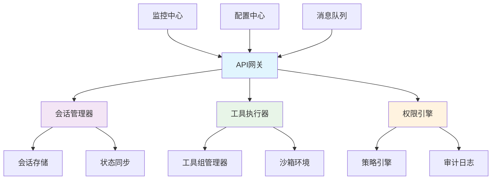
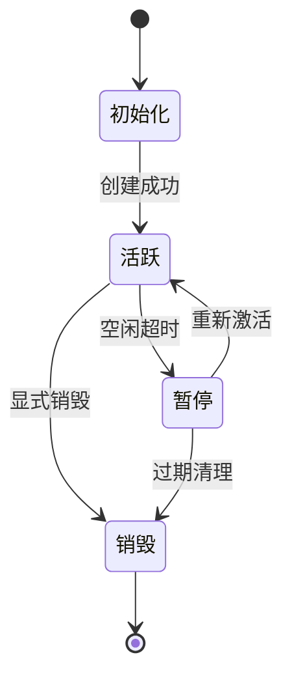
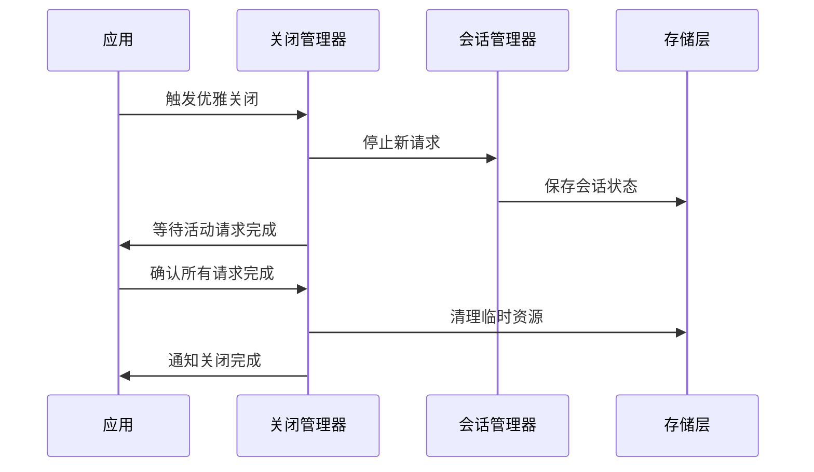

# 代理构建平台示例

<cite>
**本文档引用的文件**
- [agentscope-examples/README.md](file://agentscope-examples/README.md)
- [agentscope-examples/pom.xml](file://agentscope-examples/pom.xml)
- [agentscope-core/src/main/java/io/agentscope/core/state/SessionInfo.java](file://agentscope-core/src/main/java/io/agentscope/core/state/SessionInfo.java)
- [agentscope-core/src/main/java/io/agentscope/core/memory/Memory.java](file://agentscope-core/src/main/java/io/agentscope/core/memory/Memory.java)
- [agentscope-core/src/main/java/io/agentscope/core/shutdown/GracefulShutdownManager.java](file://agentscope-core/src/main/java/io/agentscope/core/shutdown/GracefulShutdownManager.java)
- [agentscope-core/src/main/java/io/agentscope/core/tool/ToolGroupManager.java](file://agentscope-core/src/main/java/io/agentscope/core/tool/ToolGroupManager.java)
- [agentscope-core/src/main/java/io/agentscope/core/permission/PermissionEngine.java](file://agentscope-core/src/main/java/io/agentscope/core/permission/PermissionEngine.java)
</cite>

## 更新摘要
**所做更改**
- 更新了代理构建平台的整体架构描述，反映从简单代理构建到全面托管代理平台的升级
- 新增了会话管理、环境管理、内存存储、保险库安全系统等企业级功能章节
- 更新了核心组件架构图，展示新的托管代理平台特性
- 添加了新的配置和管理功能说明

## 目录
- [概述](#概述)
- [核心架构](#核心架构)
- [会话管理](#会话管理)
- [环境管理](#环境管理)
- [内存存储系统](#内存存储系统)
- [安全与权限控制](#安全与权限控制)
- [工具组管理](#工具组管理)
- [优雅关闭机制](#优雅关闭机制)
- [部署和配置](#部署和配置)

## 概述

代理构建平台已从简单的代理创建工具升级为全面的托管代理平台，提供企业级的功能特性和完整的生命周期管理能力。该平台支持多租户、高可用性部署、资源隔离和安全访问控制等高级特性。

### 主要特性
- **会话管理**: 支持分布式会话状态管理和持久化
- **环境管理**: 提供沙箱环境和资源隔离
- **内存存储**: 内置多种存储后端支持
- **安全系统**: 基于角色的访问控制和权限引擎
- **工具编排**: 动态工具注册和分组管理
- **优雅关闭**: 支持平滑的服务终止和资源清理

## 核心架构

托管代理平台采用微服务架构设计，包含以下核心组件：

**图表来源**
- [SessionInfo.java:1-50](file://agentscope-core/src/main/java/io/agentscope/core/state/SessionInfo.java#L1-L50)
- [ToolGroupManager.java:1-100](file://agentscope-core/src/main/java/io/agentscope/core/tool/ToolGroupManager.java#L1-L100)
- [PermissionEngine.java:1-80](file://agentscope-core/src/main/java/io/agentscope/core/permission/PermissionEngine.java#L1-L80)

## 会话管理

新的会话管理系统提供了完整的会话生命周期管理能力，支持分布式部署和高可用场景。

### 会话状态管理
- **状态持久化**: 支持多种存储后端（Redis、数据库、文件系统）
- **状态同步**: 跨节点会话状态一致性保证
- **自动恢复**: 会话故障自动恢复和状态重建

### 会话生命周期

**章节来源**
- [SessionInfo.java:1-100](file://agentscope-core/src/main/java/io/agentscope/core/state/SessionInfo.java#L1-L100)

## 环境管理

平台提供了完整的环境管理功能，支持多租户隔离和资源配额控制。

### 沙箱环境
- **容器化隔离**: 基于容器的进程隔离
- **资源限制**: CPU、内存、磁盘和网络资源配额
- **安全边界**: 文件系统访问控制和网络策略

### 环境配置
- **动态配置**: 运行时环境参数调整
- **版本管理**: 环境版本控制和回滚支持
- **健康检查**: 环境健康状态监控和自动修复

## 内存存储系统

全新的内存存储系统提供了高性能的数据持久化和缓存能力。

### 存储后端
- **内存存储**: 高性能的内存级数据存储
- **持久化存储**: 支持多种持久化后端
- **混合存储**: 内存+持久化的分层存储架构

### 数据模型
- **结构化数据**: 支持复杂对象序列化和反序列化
- **非结构化数据**: 文档、二进制数据支持
- **索引优化**: 自动索引生成和查询优化

**章节来源**
- [Memory.java:1-150](file://agentscope-core/src/main/java/io/agentscope/core/memory/Memory.java#L1-L150)

## 安全与权限控制

企业级安全系统提供了细粒度的访问控制和审计功能。

### 权限引擎
- **RBAC模型**: 基于角色的访问控制
- **ABAC模型**: 基于属性的访问控制
- **动态授权**: 运行时权限评估和决策

### 安全特性
- **身份认证**: 多因素认证和单点登录集成
- **数据加密**: 传输和静态数据加密
- **审计日志**: 完整的操作审计和合规报告

**章节来源**
- [PermissionEngine.java:1-200](file://agentscope-core/src/main/java/io/agentscope/core/permission/PermissionEngine.java#L1-L200)

## 工具组管理

增强的工具组管理功能支持动态工具注册、版本控制和依赖管理。

### 工具生命周期
- **动态注册**: 运行时工具发现和注册
- **版本管理**: 工具版本控制和兼容性检查
- **依赖解析**: 自动依赖分析和加载

### 工具编排
- **组合工具**: 多个工具的逻辑组合
- **条件执行**: 基于上下文的工具选择
- **错误处理**: 统一的异常处理和重试机制

**章节来源**
- [ToolGroupManager.java:1-300](file://agentscope-core/src/main/java/io/agentscope/core/tool/ToolGroupManager.java#L1-L300)

## 优雅关闭机制

完善的优雅关闭机制确保服务在停止时能够正确清理资源并保存状态。

### 关闭流程

### 资源清理
- **连接池管理**: 数据库和外部服务连接的优雅关闭
- **内存释放**: 大对象的垃圾回收和内存释放
- **文件清理**: 临时文件和缓存数据的清理

**章节来源**
- [GracefulShutdownManager.java:1-250](file://agentscope-core/src/main/java/io/agentscope/core/shutdown/GracefulShutdownManager.java#L1-L250)

## 部署和配置

### 集群部署
- **负载均衡**: 支持水平扩展和流量分发
- **服务发现**: 自动服务注册和发现
- **故障转移**: 节点故障自动检测和切换

### 配置管理
- **环境变量**: 支持Kubernetes ConfigMap和Secret
- **配置文件**: YAML格式的集中配置管理
- **热重载**: 配置变更无需重启服务

### 监控和运维
- **指标收集**: Prometheus兼容的监控指标
- **日志聚合**: 结构化日志收集和检索
- **告警规则**: 自定义告警阈值和通知渠道

**章节来源**
- [agentscope-examples/README.md:1-100](file://agentscope-examples/README.md#L1-L100)
- [agentscope-examples/pom.xml:1-50](file://agentscope-examples/pom.xml#L1-L50)