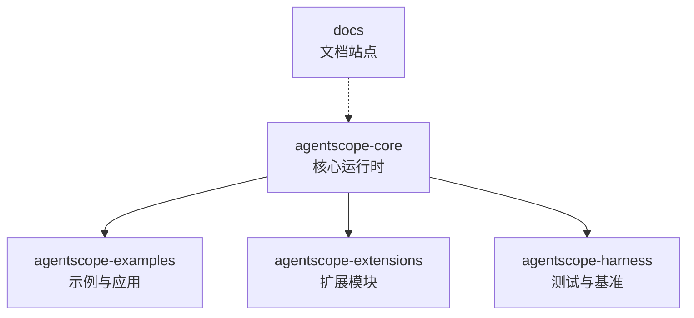
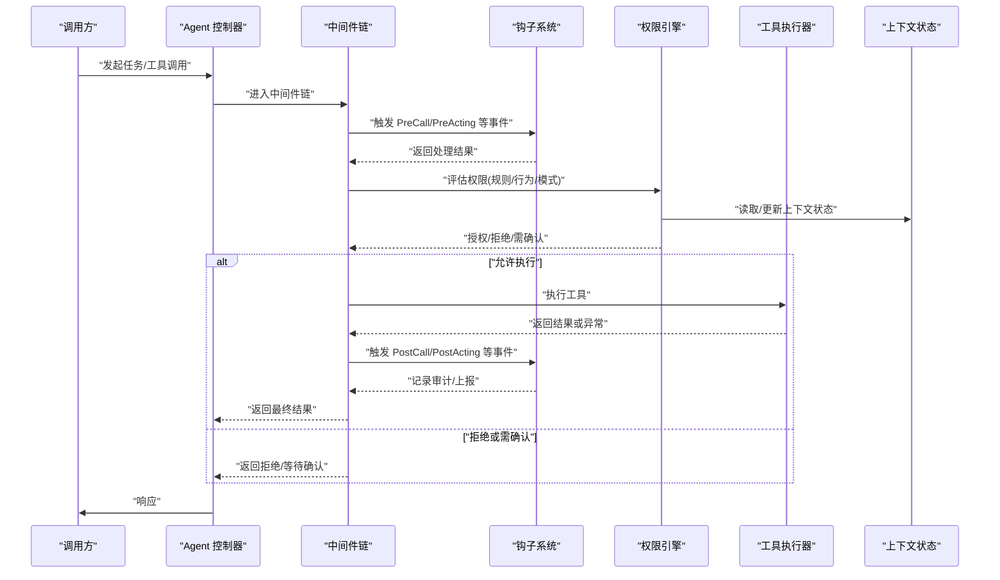
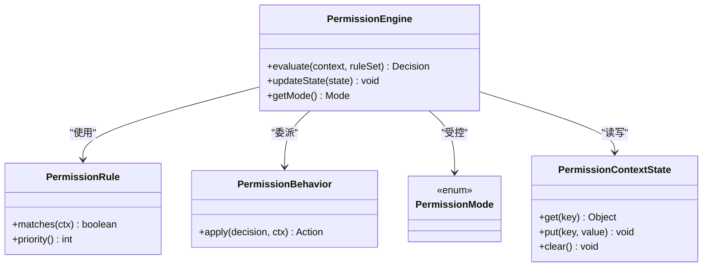
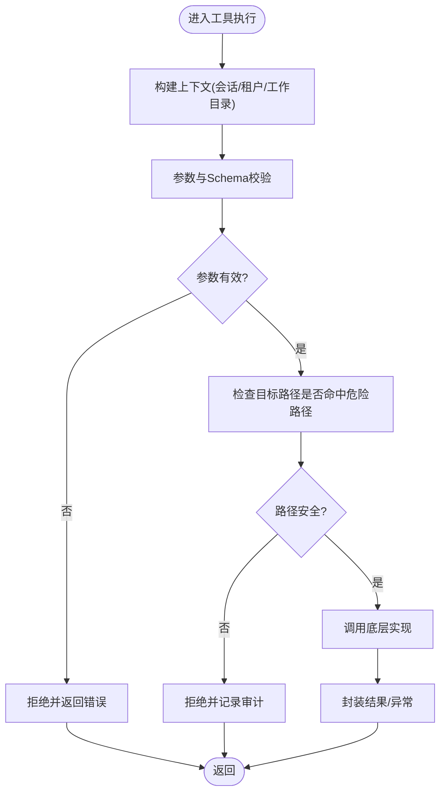
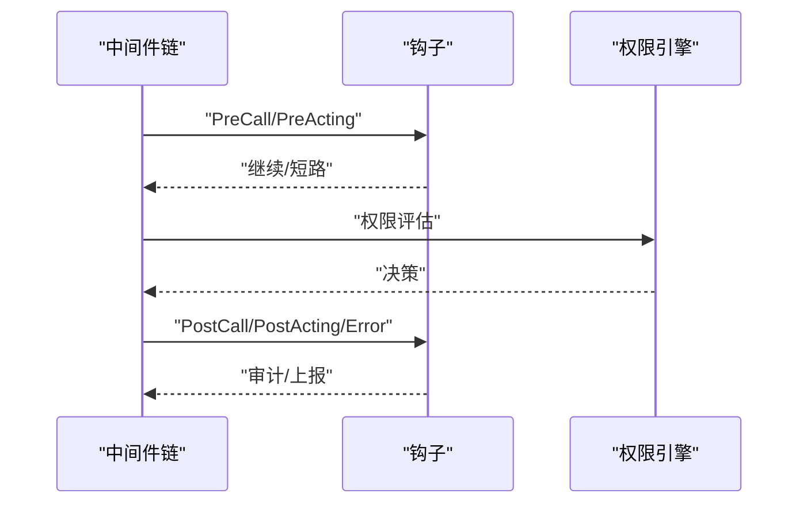
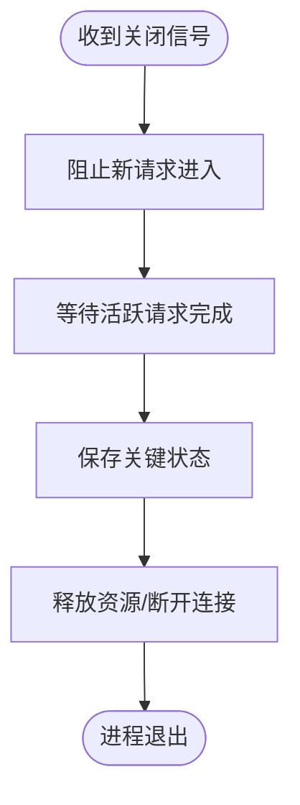
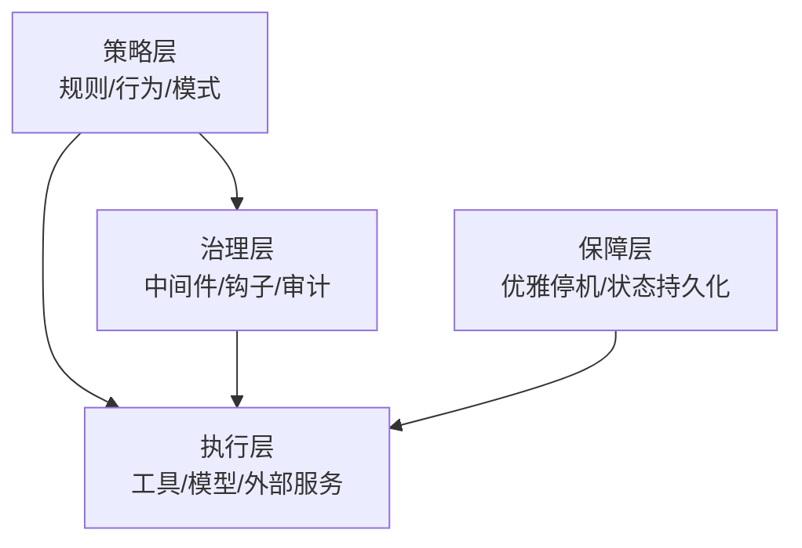
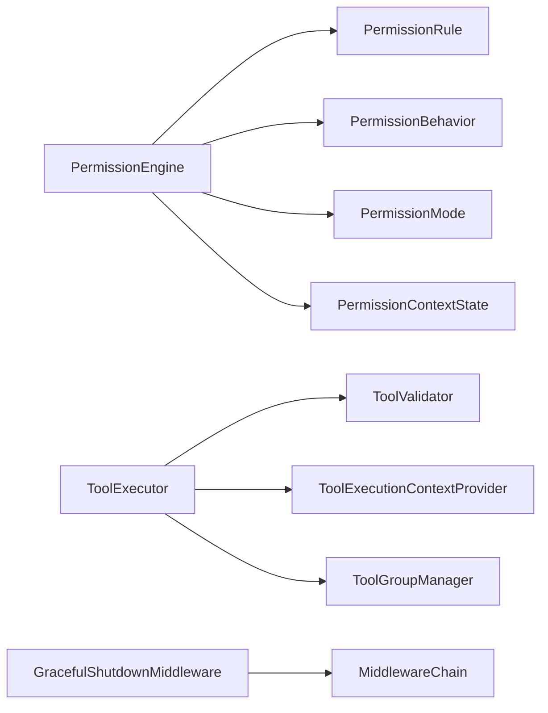

# 安全保险库系统

<cite>
**本文引用的文件**   
- [README.md](file://README.md)
- [agentscope-core/src/main/java/io/agentscope/core/permission/PermissionEngine.java](file://agentscope-core/src/main/java/io/agentscope/core/permission/PermissionEngine.java)
- [agentscope-core/src/main/java/io/agentscope/core/permission/PermissionRule.java](file://agentscope-core/src/main/java/io/agentscope/core/permission/PermissionRule.java)
- [agentscope-core/src/main/java/io/agentscope/core/permission/PermissionBehavior.java](file://agentscope-core/src/main/java/io/agentscope/core/permission/PermissionBehavior.java)
- [agentscope-core/src/main/java/io/agentscope/core/permission/PermissionMode.java](file://agentscope-core/src/main/java/io/agentscope/core/permission/PermissionMode.java)
- [agentscope-core/src/main/java/io/agentscope/core/permission/PermissionContextState.java](file://agentscope-core/src/main/java/io/agentscope/core/permission/PermissionContextState.java)
- [agentscope-core/src/main/java/io/agentscope/core/permission/AdditionalWorkingDirectory.java](file://agentscope-core/src/main/java/io/agentscope/core/permission/AdditionalWorkingDirectory.java)
- [agentscope-core/src/main/java/io/agentscope/core/tool/ToolExecutor.java](file://agentscope-core/src/main/java/io/agentscope/core/tool/ToolExecutor.java)
- [agentscope-core/src/main/java/io/agentscope/core/tool/ToolExecutionContextProvider.java](file://agentscope-core/src/main/java/io/agentscope/core/tool/ToolExecutionContextProvider.java)
- [agentscope-core/src/main/java/io/agentscope/core/tool/ToolGroupManager.java](file://agentscope-core/src/main/java/io/agentscope/core/tool/ToolGroupManager.java)
- [agentscope-core/src/main/java/io/agentscope/core/tool/ToolGroupScope.java](file://agentscope-core/src/main/java/io/agentscope/core/tool/ToolGroupScope.java)
- [agentscope-core/src/main/java/io/agentscope/core/tool/ToolValidator.java](file://agentscope-core/src/main/java/io/agentscope/core/tool/ToolValidator.java)
- [agentscope-core/src/main/java/io/agentscope/core/tool/ToolDangerousPathConstants.java](file://agentscope-core/src/main/java/io/agentscope/core/tool/ToolDangerousPath常量.java)
- [agentscope-core/src/main/java/io/agentscope/core/shutdown/GracefulShutdownMiddleware.java](file://agentscope-core/src/main/java/io/agentscope/core/shutdown/GracefulShutdownMiddleware.java)
- [agentscope-core/src/main/java/io/agentscope/core/hook/Hook.java](file://agentscope-core/src/main/java/io/agentscope/core/hook/Hook.java)
- [agentscope-core/src/main/java/io/agentscope/core/middleware/MiddlewareChain.java](file://agentscope-core/src/main/java/io/agentscope/core/middleware/MiddlewareChain.java)
</cite>

## 目录
1. [简介](#简介)
2. [项目结构](#项目结构)
3. [核心组件](#核心组件)
4. [架构总览](#架构总览)
5. [详细组件分析](#详细组件分析)
6. [依赖关系分析](#依赖关系分析)
7. [性能与安全特性](#性能与安全特性)
8. [故障排查指南](#故障排查指南)
9. [结论](#结论)
10. [附录](#附录)

## 简介
本仓库为 AgentScope Java 工程，提供可扩展的 AI Agent 框架与工具生态。围绕“安全保险库”主题，本文聚焦于权限控制、沙箱化执行、上下文隔离与可观测性拦截等能力，帮助读者理解如何在 Agent 调用链中实施细粒度访问控制与风险收敛。文档以代码级事实为依据，结合可视化图示说明关键流程与数据流，便于不同技术背景的读者快速上手与深入定制。

## 项目结构
AgentScope 采用多模块 Maven 工程组织：
- agentscope-core：核心运行时，包含 Agent、消息、模型、工具、权限、状态、钩子、中间件、优雅停机、RAG、技能等基础能力。
- agentscope-examples：示例应用与前端集成样例。
- agentscope-extensions：扩展模块（模型、存储、通道、RAG、调度、云厂商等）。
- agentscope-harness：测试与基准套件。
- docs：文档站点资源。

[本节未直接分析具体源文件，故不附“章节来源”]

## 核心组件
围绕“安全保险库”，以下为核心能力点：
- 权限引擎与规则：集中式权限决策、策略模式行为、运行期上下文状态管理。
- 工具执行与校验：在工具执行前进行参数与路径校验，限制危险操作。
- 中间件与钩子：在关键生命周期注入审计、限流、熔断、审批等横切逻辑。
- 优雅停机：保障请求完成与资源释放，避免中断导致的数据不一致。

**章节来源**
- [PermissionEngine.java](file://agentscope-core/src/main/java/io/agentscope/core/permission/PermissionEngine.java)
- [PermissionRule.java](file://agentscope-core/src/main/java/io/agentscope/core/permission/PermissionRule.java)
- [PermissionBehavior.java](file://agentscope-core/src/main/java/io/agentscope/core/permission/PermissionBehavior.java)
- [PermissionMode.java](file://agentscope-core/src/main/java/io/agentscope/core/permission/PermissionMode.java)
- [PermissionContextState.java](file://agentscope-core/src/main/java/io/agentscope/core/permission/PermissionContextState.java)
- [ToolExecutor.java](file://agentscope-core/src/main/java/io/agentscope/core/tool/ToolExecutor.java)
- [ToolValidator.java](file://agentscope-core/src/main/java/io/agentscope/core/tool/ToolValidator.java)
- [Hook.java](file://agentscope-core/src/main/java/io/agentscope/core/hook/Hook.java)
- [MiddlewareChain.java](file://agentscope-core/src/main/java/io/agentscope/core/middleware/MiddlewareChain.java)
- [GracefulShutdownMiddleware.java](file://agentscope-core/src/main/java/io/agentscope/core/shutdown/GracefulShutdownMiddleware.java)

## 架构总览
下图展示“安全保险库”在 Agent 调用链中的位置与交互：权限引擎贯穿工具执行前后；中间件与钩子在推理、调用、行动等阶段提供审计与拦截；优雅停机确保退出时的一致性。

**图表来源**
- [PermissionEngine.java](file://agentscope-core/src/main/java/io/agentscope/core/permission/PermissionEngine.java)
- [PermissionRule.java](file://agentscope-core/src/main/java/io/agentscope/core/permission/PermissionRule.java)
- [PermissionBehavior.java](file://agentscope-core/src/main/java/io/agentscope/core/permission/PermissionBehavior.java)
- [PermissionMode.java](file://agentscope-core/src/main/java/io/agentscope/core/permission/PermissionMode.java)
- [PermissionContextState.java](file://agentscope-core/src/main/java/io/agentscope/core/permission/PermissionContextState.java)
- [ToolExecutor.java](file://agentscope-core/src/main/java/io/agentscope/core/tool/ToolExecutor.java)
- [Hook.java](file://agentscope-core/src/main/java/io/agentscope/core/hook/Hook.java)
- [MiddlewareChain.java](file://agentscope-core/src/main/java/io/agentscope/core/middleware/MiddlewareChain.java)

## 详细组件分析

### 权限引擎与规则
- 职责
  - 统一入口：对外暴露权限判定接口，内部组合规则、行为与模式。
  - 策略化：通过行为抽象支持“允许/拒绝/需确认/动态策略”等策略。
  - 上下文感知：基于运行期上下文状态（如会话、租户、工作目录）做决策。
- 关键类型
  - 权限规则：描述“谁在什么条件下可以做什么”。
  - 权限行为：定义“如何响应决策结果”的策略实现。
  - 权限模式：控制整体策略风格（如严格、宽松、仅审计）。
  - 上下文状态：保存与权限相关的运行时信息。
- 典型流程
  - 收集上下文 → 匹配规则 → 选择行为 → 更新状态 → 返回决策。

**图表来源**
- [PermissionEngine.java](file://agentscope-core/src/main/java/io/agentscope/core/permission/PermissionEngine.java)
- [PermissionRule.java](file://agentscope-core/src/main/java/io/agentscope/core/permission/PermissionRule.java)
- [PermissionBehavior.java](file://agentscope-core/src/main/java/io/agentscope/core/permission/PermissionBehavior.java)
- [PermissionMode.java](file://agentscope-core/src/main/java/io/agentscope/core/permission/PermissionMode.java)
- [PermissionContextState.java](file://agentscope-core/src/main/java/io/agentscope/core/permission/PermissionContextState.java)

**章节来源**
- [PermissionEngine.java](file://agentscope-core/src/main/java/io/agentscope/core/permission/PermissionEngine.java)
- [PermissionRule.java](file://agentscope-core/src/main/java/io/agentscope/core/permission/PermissionRule.java)
- [PermissionBehavior.java](file://agentscope-core/src/main/java/io/agentscope/core/permission/PermissionBehavior.java)
- [PermissionMode.java](file://agentscope-core/src/main/java/io/agentscope/core/permission/PermissionMode.java)
- [PermissionContextState.java](file://agentscope-core/src/main/java/io/agentscope/core/permission/PermissionContextState.java)

### 工具执行与路径安全
- 职责
  - 在执行前对工具参数、目标路径等进行校验，阻断高危操作。
  - 将上下文提供者与工具组管理器接入执行链路，保证作用域隔离。
- 关键类型
  - 工具执行器：编排校验、执行、结果转换与异常处理。
  - 工具上下文提供者：注入当前会话、租户、工作目录等上下文。
  - 工具组管理器/作用域：按组与作用域隔离工具集与权限边界。
  - 工具校验器：参数合法性、白名单/黑名单、路径安全等。
  - 危险路径常量：预置不可访问的系统路径集合。
- 流程图（路径校验）

**图表来源**
- [ToolExecutor.java](file://agentscope-core/src/main/java/io/agentscope/core/tool/ToolExecutor.java)
- [ToolValidator.java](file://agentscope-core/src/main/java/io/agentscope/core/tool/ToolValidator.java)
- [ToolDangerousPath常量.java](file://agentscope-core/src/main/java/io/agentscope/core/tool/ToolDangerousPath常量.java)
- [ToolExecutionContextProvider.java](file://agentscope-core/src/main/java/io/agentscope/core/tool/ToolExecutionContextProvider.java)
- [ToolGroupManager.java](file://agentscope-core/src/main/java/io/agentscope/core/tool/ToolGroupManager.java)
- [ToolGroupScope.java](file://agentscope-core/src/main/java/io/agentscope/core/tool/ToolGroupScope.java)

**章节来源**
- [ToolExecutor.java](file://agentscope-core/src/main/java/io/agentscope/core/tool/ToolExecutor.java)
- [ToolValidator.java](file://agentscope-core/src/main/java/io/agentscope/core/tool/ToolValidator.java)
- [ToolDangerousPath常量.java](file://agentscope-core/src/main/java/io/agentscope/core/tool/ToolDangerousPath常量.java)
- [ToolExecutionContextProvider.java](file://agentscope-core/src/main/java/io/agentscope/core/tool/ToolExecutionContextProvider.java)
- [ToolGroupManager.java](file://agentscope-core/src/main/java/io/agentscope/core/tool/ToolGroupManager.java)
- [ToolGroupScope.java](file://agentscope-core/src/main/java/io/agentscope/core/tool/ToolGroupScope.java)

### 中间件与钩子（审计与拦截）
- 职责
  - 中间件链：在推理、调用、行动等阶段形成可插拔的拦截管线。
  - 钩子系统：在关键事件（开始/结束/错误/摘要/思考块等）上触发回调，用于审计、遥测、告警。
- 典型用法
  - 在 PreCall/PreActing 阶段进行鉴权、限流、脱敏。
  - 在 PostCall/PostActing 阶段记录日志、上报指标、持久化审计。
  - 在 ErrorEvent 阶段统一捕获异常并降级。

**图表来源**
- [MiddlewareChain.java](file://agentscope-core/src/main/java/io/agentscope/core/middleware/MiddlewareChain.java)
- [Hook.java](file://agentscope-core/src/main/java/io/agentscope/core/hook/Hook.java)
- [PermissionEngine.java](file://agentscope-core/src/main/java/io/agentscope/core/permission/PermissionEngine.java)

**章节来源**
- [MiddlewareChain.java](file://agentscope-core/src/main/java/io/agentscope/core/middleware/MiddlewareChain.java)
- [Hook.java](file://agentscope-core/src/main/java/io/agentscope/core/hook/Hook.java)

### 优雅停机与一致性保障
- 职责
  - 在进程关闭期间阻止新请求进入，等待活跃请求完成，确保资源释放与状态一致。
- 关键点
  - 优雅停机中间件：在中间件链中注册，拦截进入与退出。
  - 状态保存：在退出前持久化必要上下文，以便恢复。

**图表来源**
- [GracefulShutdownMiddleware.java](file://agentscope-core/src/main/java/io/agentscope/core/shutdown/GracefulShutdownMiddleware.java)

**章节来源**
- [GracefulShutdownMiddleware.java](file://agentscope-core/src/main/java/io/agentscope/core/shutdown/GracefulShutdownMiddleware.java)

### 概念总览（非代码映射）
下图给出“安全保险库”在业务系统中的概念分层：策略层（规则/行为/模式）、执行层（工具/模型/外部服务）、治理层（中间件/钩子/审计）、保障层（优雅停机/状态持久化）。

[此图为概念示意，不直接对应具体源码文件，故不附“图表来源”]

## 依赖关系分析
- 松耦合设计
  - 权限引擎通过规则与行为接口解耦策略实现，便于替换与扩展。
  - 中间件与钩子以事件驱动方式串联，降低侵入性。
- 关键依赖
  - 工具执行器依赖上下文提供者与校验器，确保执行前置条件满足。
  - 优雅停机中间件依赖全局状态与资源管理器，协调关闭时序。

**图表来源**
- [PermissionEngine.java](file://agentscope-core/src/main/java/io/agentscope/core/permission/PermissionEngine.java)
- [PermissionRule.java](file://agentscope-core/src/main/java/io/agentscope/core/permission/PermissionRule.java)
- [PermissionBehavior.java](file://agentscope-core/src/main/java/io/agentscope/core/permission/PermissionBehavior.java)
- [PermissionMode.java](file://agentscope-core/src/main/java/io/agentscope/core/permission/PermissionMode.java)
- [PermissionContextState.java](file://agentscope-core/src/main/java/io/agentscope/core/permission/PermissionContextState.java)
- [ToolExecutor.java](file://agentscope-core/src/main/java/io/agentscope/core/tool/ToolExecutor.java)
- [ToolValidator.java](file://agentscope-core/src/main/java/io/agentscope/core/tool/ToolValidator.java)
- [ToolExecutionContextProvider.java](file://agentscope-core/src/main/java/io/agentscope/core/tool/ToolExecutionContextProvider.java)
- [ToolGroupManager.java](file://agentscope-core/src/main/java/io/agentscope/core/tool/ToolGroupManager.java)
- [GracefulShutdownMiddleware.java](file://agentscope-core/src/main/java/io/agentscope/core/shutdown/GracefulShutdownMiddleware.java)
- [MiddlewareChain.java](file://agentscope-core/src/main/java/io/agentscope/core/middleware/MiddlewareChain.java)

**章节来源**
- [PermissionEngine.java](file://agentscope-core/src/main/java/io/agentscope/core/permission/PermissionEngine.java)
- [ToolExecutor.java](file://agentscope-core/src/main/java/io/agentscope/core/tool/ToolExecutor.java)
- [GracefulShutdownMiddleware.java](file://agentscope-core/src/main/java/io/agentscope/core/shutdown/GracefulShutdownMiddleware.java)

## 性能与安全特性
- 性能
  - 中间件与钩子建议保持轻量，避免阻塞主链路；耗时操作异步化。
  - 权限规则应优先使用索引与缓存，减少重复计算。
- 安全
  - 默认遵循最小权限原则，仅在必要时授予访问。
  - 对文件系统、网络、命令执行等高风险能力进行白名单与路径校验。
  - 全链路审计与可观测性，便于事后追溯与合规审查。

[本节为通用指导，不直接分析具体文件，故不附“章节来源”]

## 故障排查指南
- 常见问题
  - 权限误拒：检查规则优先级与上下文字段是否完整。
  - 路径被拒：核对危险路径常量与附加工作目录配置。
  - 钩子阻塞：确认钩子实现未长时间阻塞，必要时增加超时与降级。
  - 优雅停机卡住：定位活跃请求与资源占用，完善清理逻辑。
- 建议步骤
  - 开启审计日志，定位到具体中间件/钩子/权限决策点。
  - 逐步禁用中间件与钩子，缩小问题范围。
  - 使用最小复现用例验证修复效果。

**章节来源**
- [PermissionEngine.java](file://agentscope-core/src/main/java/io/agentscope/core/permission/PermissionEngine.java)
- [ToolValidator.java](file://agentscope-core/src/main/java/io/agentscope/core/tool/ToolValidator.java)
- [Hook.java](file://agentscope-core/src/main/java/io/agentscope/core/hook/Hook.java)
- [GracefulShutdownMiddleware.java](file://agentscope-core/src/main/java/io/agentscope/core/shutdown/GracefulShutdownMiddleware.java)

## 结论
AgentScope 的“安全保险库”以权限引擎为核心，结合工具执行校验、中间件与钩子的可插拔治理机制，以及优雅停机的一致性保障，形成了覆盖“策略—执行—治理—保障”的闭环体系。通过规则与行为的策略化、上下文的精细化、审计的可观测化，可在复杂业务场景中实现可控、可管、可溯的安全执行环境。

[本节为总结性内容，不直接分析具体文件，故不附“章节来源”]

## 附录
- 术语
  - 权限规则：描述访问条件的声明式约束。
  - 权限行为：对决策结果的响应策略。
  - 中间件：在调用链中横向切入的处理单元。
  - 钩子：在关键事件上的回调机制。
- 参考
  - 项目概览与使用说明参见根目录说明文档。

**章节来源**
- [README.md](file://README.md)