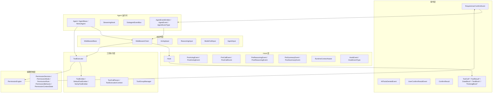
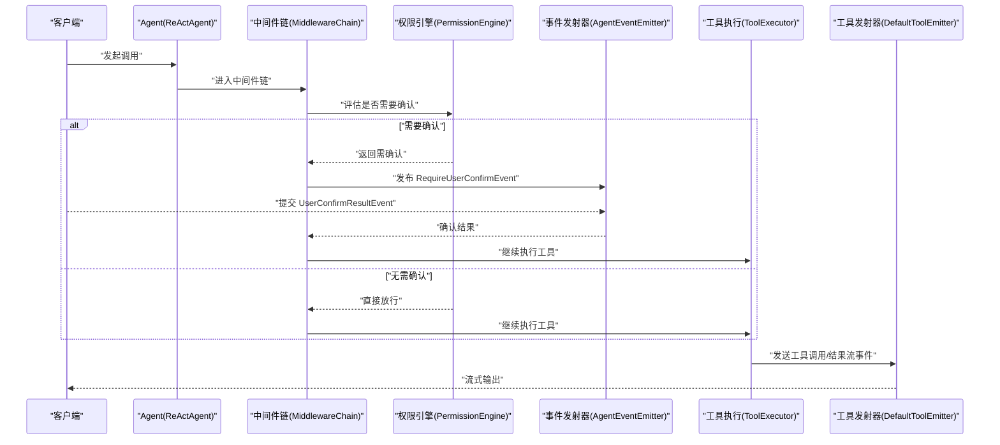
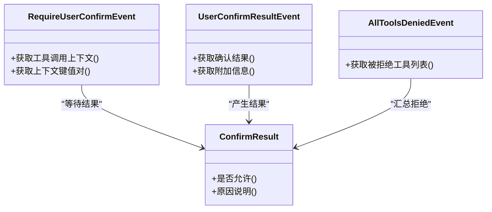
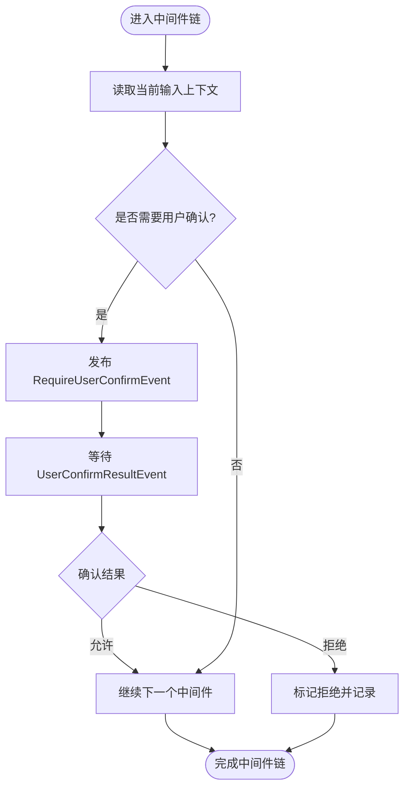
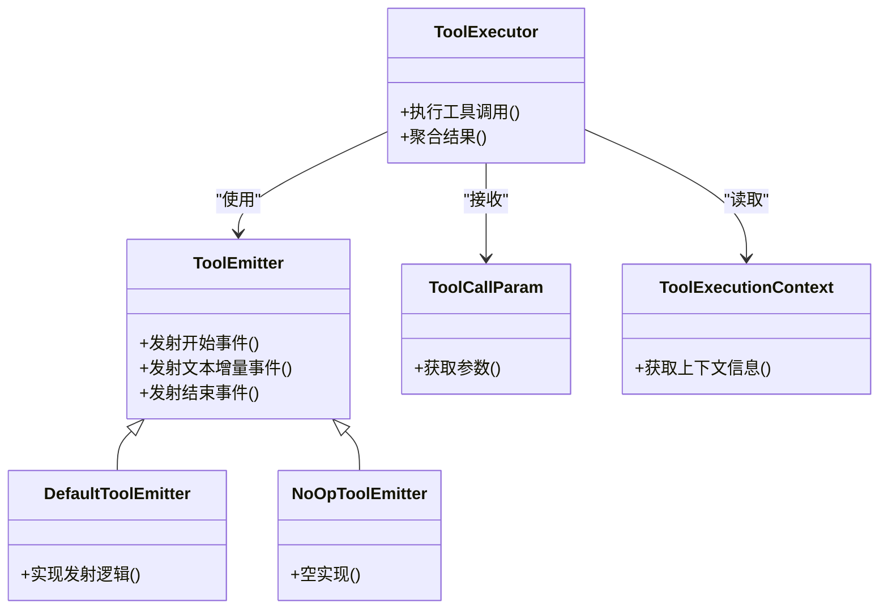
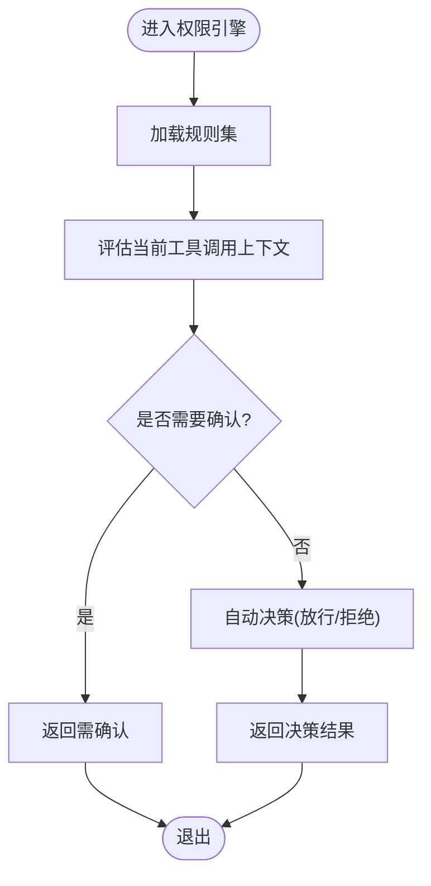
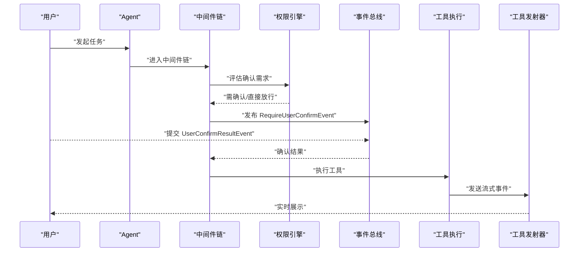
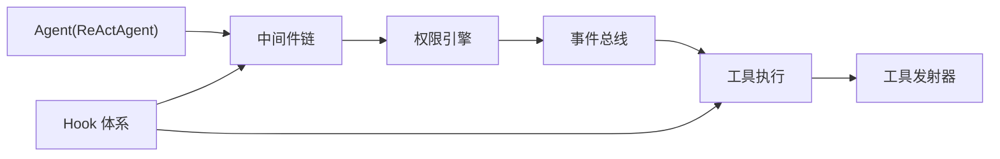

# 工具确认中间件

<cite>
**本文引用的文件**   
- [RequireUserConfirmEvent.java](file://agentscope-core/src/main/java/io/agentscope/core/event/RequireUserConfirmEvent.java)
- [AllToolsDeniedEvent.java](file://agentscope-core/src/main/java/io/agentscope/core/event/AllToolsDeniedEvent.java)
- [UserConfirmResultEvent.java](file://agentscope-core/src/main/java/io/agentscope/core/event/UserConfirmResultEvent.java)
- [ConfirmResult.java](file://agentscope-core/src/main/java/io/agentscope/core/event/ConfirmResult.java)
- [MiddlewareBase.java](file://agentscope-core/src/main/java/io/agentscope/core/middleware/MiddlewareBase.java)
- [MiddlewareChain.java](file://agentscope-core/src/main/java/io/agentscope/core/middleware/MiddlewareChain.java)
- [ActingInput.java](file://agentscope-core/src/main/java/io/agentscope/core/middleware/ActingInput.java)
- [ReasoningInput.java](file://agentscope-core/src/main/java/io/agentscope/core/middleware/ReasoningInput.java)
- [ModelCallInput.java](file://agentscope-core/src/main/java/io/agentscope/core/middleware/ModelCallInput.java)
- [AgentInput.java](file://agentscope-core/src/main/java/io/agentscope/core/middleware/AgentInput.java)
- [ToolCallStartEvent.java](file://agentscope-core/src/main/java/io/agentscope/core/event/ToolCallStartEvent.java)
- [ToolCallEndEvent.java](file://agentscope-core/src/main/java/io/agentscope/core/event/ToolCallEndEvent.java)
- [ToolCallDeltaEvent.java](file://agentscope-core/src/main/java/io/agentscope/core/event/ToolCallDeltaEvent.java)
- [ToolResultStartEvent.java](file://agentscope-core/src/main/java/io/agentscope/core/event/ToolResultStartEvent.java)
- [ToolResultTextDeltaEvent.java](file://agentscope-core/src/main/java/io/agentscope/core/event/ToolResultTextDeltaEvent.java)
- [ToolResultEndEvent.java](file://agentscope-core/src/main/java/io/agentscope/core/event/ToolResultEndEvent.java)
- [DataBlockStartEvent.java](file://agentscope-core/src/main/java/io/agentscope/core/event/DataBlockStartEvent.java)
- [DataBlockDeltaEvent.java](file://agentscope-core/src/main/java/io/agentscope/core/event/DataBlockDeltaEvent.java)
- [DataBlockEndEvent.java](file://agentscope-core/src/main/java/io/agentscope/core/event/DataBlockEndEvent.java)
- [TextBlockStartEvent.java](file://agentscope-core/src/main/java/io/agentscope/core/event/TextBlockStartEvent.java)
- [TextBlockDeltaEvent.java](file://agentscope-core/src/main/java/io/agentscope/core/event/TextBlockDeltaEvent.java)
- [TextBlockEndEvent.java](file://agentscope-core/src/main/java/io/agentscope/core/event/TextBlockEndEvent.java)
- [ThinkingBlockStartEvent.java](file://agentscope-core/src/main/java/io/agentscope/core/event/ThinkingBlockStartEvent.java)
- [ThinkingBlockDeltaEvent.java](file://agentscope-core/src/main/java/io/agentscope/core/event/ThinkingBlockDeltaEvent.java)
- [ThinkingBlockEndEvent.java](file://agentscope-core/src/main/java/io/agentscope/core/event/ThinkingBlockEndEvent.java)
- [Hook.java](file://agentscope-core/src/main/java/io/agentscope/core/hook/Hook.java)
- [PreActingEvent.java](file://agentscope-core/src/main/java/io/agentscope/core/hook/PreActingEvent.java)
- [PostActingEvent.java](file://agentscope-core/src/main/java/io/agentscope/core/hook/PostActingEvent.java)
- [PreCallEvent.java](file://agentscope-core/src/main/java/io/agentscope/core/hook/PreCallEvent.java)
- [PostCallEvent.java](file://agentscope-core/src/main/java/io/agentscope/core/hook/PostCallEvent.java)
- [PreReasoningEvent.java](file://agentscope-core/src/main/java/io/agentscope/core/hook/PreReasoningEvent.java)
- [PostReasoningEvent.java](file://agentscope-core/src/main/java/io/agentscope/core/hook/PostReasoningEvent.java)
- [PreSummaryEvent.java](file://agentscope-core/src/main/java/io/agentscope/core/hook/PreSummaryEvent.java)
- [PostSummaryEvent.java](file://agentscope-core/src/main/java/io/agentscope/core/hook/PostSummaryEvent.java)
- [RuntimeContextAware.java](file://agentscope-core/src/main/java/io/agentscope/core/hook/RuntimeContextAware.java)
- [HookEvent.java](file://agentscope-core/src/main/java/io/agentscope/core/hook/HookEvent.java)
- [HookEventType.java](file://agentscope-core/src/main/java/io/agentscope/core/hook/HookEventType.java)
- [AgentEventEmitter.java](file://agentscope-core/src/main/java/io/agentscope/core/event/AgentEventEmitter.java)
- [AgentEvent.java](file://agentscope-core/src/main/java/io/agentscope/core/event/AgentEvent.java)
- [AgentEventType.java](file://agentscope-core/src/main/java/io/agentscope/core/event/AgentEventType.java)
- [ReActAgent.java](file://agentscope-core/src/main/java/io/agentscope/core/ReActAgent.java)
- [Agent.java](file://agentscope-core/src/main/java/io/agentscope/core/agent/Agent.java)
- [AgentBase.java](file://agentscope-core/src/main/java/io/agentscope/core/agent/AgentBase.java)
- [StreamingHook.java](file://agentscope-core/src/main/java/io/agentscope/core/agent/StreamingHook.java)
- [SubagentEventBus.java](file://agentscope-core/src/main/java/io/agentscope/core/agent/SubagentEventBus.java)
- [DefaultToolEmitter.java](file://agentscope-core/src/main/java/io/agentscope/core/tool/DefaultToolEmitter.java)
- [ToolEmitter.java](file://agentscope-core/src/main/java/io/agentscope/core/tool/ToolEmitter.java)
- [NoOpToolEmitter.java](file://agentscope-core/src/main/java/io/agentscope/core/tool/NoOpToolEmitter.java)
- [ToolCallParam.java](file://agentscope-core/src/main/java/io/agentscope/core/tool/ToolCallParam.java)
- [ToolExecutionContext.java](file://agentscope-core/src/main/java/io/agentscope/core/tool/ToolExecutionContext.java)
- [ToolExecutor.java](file://agentscope-core/src/main/java/io/agentscope/core/tool/ToolExecutor.java)
- [ToolGroupManager.java](file://agentscope-core/src/main/java/io/agentscope/core/tool/ToolGroupManager.java)
- [PermissionEngine.java](file://agentscope-core/src/main/java/io/agentscope/core/permission/PermissionEngine.java)
- [PermissionDecision.java](file://agentscope-core/src/main/java/io/agentscope/core/permission/PermissionDecision.java)
- [PermissionMode.java](file://agentscope-core/src/main/java/io/agentscope/core/permission/PermissionMode.java)
- [PermissionRule.java](file://agentscope-core/src/main/java/io/agentscope/core/permission/PermissionRule.java)
- [PermissionBehavior.java](file://agentscope-core/src/main/java/io/agentscope/core/permission/PermissionBehavior.java)
- [PermissionContextState.java](file://agentscope-core/src/main/java/io/agentscope/core/permission/PermissionContextState.java)
</cite>

## 目录
1. [简介](#简介)
2. [项目结构](#项目结构)
3. [核心组件](#核心组件)
4. [架构总览](#架构总览)
5. [详细组件分析](#详细组件分析)
6. [依赖关系分析](#依赖关系分析)
7. [性能考虑](#性能考虑)
8. [故障排查指南](#故障排查指南)
9. [结论](#结论)
10. [附录](#附录)

## 简介
本文件聚焦于“工具确认中间件”的设计与实现，围绕 Agent 在执行工具调用前的用户确认流程展开。该机制通过事件驱动与中间件链式处理，在模型推理、工具执行等关键阶段插入确认拦截点，支持：
- 基于规则的自动放行或拒绝
- 交互式用户确认（允许/拒绝）
- 全量工具被拒绝时的统一事件通知
- 与流式输出、权限引擎、工具发射器、Hook 体系协同工作

## 项目结构
与工具确认相关的代码主要分布在以下包中：
- 事件层：io.agentscope.core.event
- 中间件层：io.agentscope.core.middleware
- Hook 层：io.agentscope.core.hook
- 工具执行层：io.agentscope.core.tool
- 权限控制层：io.agentscope.core.permission
- Agent 运行时：io.agentscope.core.agent 与 io.agentscope.core

图表来源
- [RequireUserConfirmEvent.java](file://agentscope-core/src/main/java/io/agentscope/core/event/RequireUserConfirmEvent.java)
- [AllToolsDeniedEvent.java](file://agentscope-core/src/main/java/io/agentscope/core/event/AllToolsDeniedEvent.java)
- [UserConfirmResultEvent.java](file://agentscope-core/src/main/java/io/agentscope/core/event/UserConfirmResultEvent.java)
- [ConfirmResult.java](file://agentscope-core/src/main/java/io/agentscope/core/event/ConfirmResult.java)
- [MiddlewareBase.java](file://agentscope-core/src/main/java/io/agentscope/core/middleware/MiddlewareBase.java)
- [MiddlewareChain.java](file://agentscope-core/src/main/java/io/agentscope/core/middleware/MiddlewareChain.java)
- [ActingInput.java](file://agentscope-core/src/main/java/io/agentscope/core/middleware/ActingInput.java)
- [ReasoningInput.java](file://agentscope-core/src/main/java/io/agentscope/core/middleware/ReasoningInput.java)
- [ModelCallInput.java](file://agentscope-core/src/main/java/io/agentscope/core/middleware/ModelCallInput.java)
- [AgentInput.java](file://agentscope-core/src/main/java/io/agentscope/core/middleware/AgentInput.java)
- [ToolCallStartEvent.java](file://agentscope-core/src/main/java/io/agentscope/core/event/ToolCallStartEvent.java)
- [ToolCallEndEvent.java](file://agentscope-core/src/main/java/io/agentscope/core/event/ToolCallEndEvent.java)
- [ToolCallDeltaEvent.java](file://agentscope-core/src/main/java/io/agentscope/core/event/ToolCallDeltaEvent.java)
- [ToolResultStartEvent.java](file://agentscope-core/src/main/java/io/agentscope/core/event/ToolResultStartEvent.java)
- [ToolResultTextDeltaEvent.java](file://agentscope-core/src/main/java/io/agentscope/core/event/ToolResultTextDeltaEvent.java)
- [ToolResultEndEvent.java](file://agentscope-core/src/main/java/io/agentscope/core/event/ToolResultEndEvent.java)
- [DataBlockStartEvent.java](file://agentscope-core/src/main/java/io/agentscope/core/event/DataBlockStartEvent.java)
- [DataBlockDeltaEvent.java](file://agentscope-core/src/main/java/io/agentscope/core/event/DataBlockDeltaEvent.java)
- [DataBlockEndEvent.java](file://agentscope-core/src/main/java/io/agentscope/core/event/DataBlockEndEvent.java)
- [TextBlockStartEvent.java](file://agentscope-core/src/main/java/io/agentscope/core/event/TextBlockStartEvent.java)
- [TextBlockDeltaEvent.java](file://agentscope-core/src/main/java/io/agentscope/core/event/TextBlockDeltaEvent.java)
- [TextBlockEndEvent.java](file://agentscope-core/src/main/java/io/agentscope/core/event/TextBlockEndEvent.java)
- [ThinkingBlockStartEvent.java](file://agentscope-core/src/main/java/io/agentscope/core/event/ThinkingBlockStartEvent.java)
- [ThinkingBlockDeltaEvent.java](file://agentscope-core/src/main/java/io/agentscope/core/event/ThinkingBlockDeltaEvent.java)
- [ThinkingBlockEndEvent.java](file://agentscope-core/src/main/java/io/agentscope/core/event/ThinkingBlockEndEvent.java)
- [Hook.java](file://agentscope-core/src/main/java/io/agentscope/core/hook/Hook.java)
- [PreActingEvent.java](file://agentscope-core/src/main/java/io/agentscope/core/hook/PreActingEvent.java)
- [PostActingEvent.java](file://agentscope-core/src/main/java/io/agentscope/core/hook/PostActingEvent.java)
- [PreCallEvent.java](file://agentscope-core/src/main/java/io/agentscope/core/hook/PreCallEvent.java)
- [PostCallEvent.java](file://agentscope-core/src/main/java/io/agentscope/core/hook/PostCallEvent.java)
- [PreReasoningEvent.java](file://agentscope-core/src/main/java/io/agentscope/core/hook/PreReasoningEvent.java)
- [PostReasoningEvent.java](file://agentscope-core/src/main/java/io/agentscope/core/hook/PostReasoningEvent.java)
- [PreSummaryEvent.java](file://agentscope-core/src/main/java/io/agentscope/core/hook/PreSummaryEvent.java)
- [PostSummaryEvent.java](file://agentscope-core/src/main/java/io/agentscope/core/hook/PostSummaryEvent.java)
- [RuntimeContextAware.java](file://agentscope-core/src/main/java/io/agentscope/core/hook/RuntimeContextAware.java)
- [HookEvent.java](file://agentscope-core/src/main/java/io/agentscope/core/hook/HookEvent.java)
- [HookEventType.java](file://agentscope-core/src/main/java/io/agentscope/core/hook/HookEventType.java)
- [AgentEventEmitter.java](file://agentscope-core/src/main/java/io/agentscope/core/event/AgentEventEmitter.java)
- [AgentEvent.java](file://agentscope-core/src/main/java/io/agentscope/core/event/AgentEvent.java)
- [AgentEventType.java](file://agentscope-core/src/main/java/io/agentscope/core/event/AgentEventType.java)
- [ReActAgent.java](file://agentscope-core/src/main/java/io/agentscope/core/ReActAgent.java)
- [Agent.java](file://agentscope-core/src/main/java/io/agentscope/core/agent/Agent.java)
- [AgentBase.java](file://agentscope-core/src/main/java/io/agentscope/core/agent/AgentBase.java)
- [StreamingHook.java](file://agentscope-core/src/main/java/io/agentscope/core/agent/StreamingHook.java)
- [SubagentEventBus.java](file://agentscope-core/src/main/java/io/agentscope/core/agent/SubagentEventBus.java)
- [DefaultToolEmitter.java](file://agentscope-core/src/main/java/io/agentscope/core/tool/DefaultToolEmitter.java)
- [ToolEmitter.java](file://agentscope-core/src/main/java/io/agentscope/core/tool/ToolEmitter.java)
- [NoOpToolEmitter.java](file://agentscope-core/src/main/java/io/agentscope/core/tool/NoOpToolEmitter.java)
- [ToolCallParam.java](file://agentscope-core/src/main/java/io/agentscope/core/tool/ToolCallParam.java)
- [ToolExecutionContext.java](file://agentscope-core/src/main/java/io/agentscope/core/tool/ToolExecutionContext.java)
- [ToolExecutor.java](file://agentscope-core/src/main/java/io/agentscope/core/tool/ToolExecutor.java)
- [ToolGroupManager.java](file://agentscope-core/src/main/java/io/agentscope/core/tool/ToolGroupManager.java)
- [PermissionEngine.java](file://agentscope-core/src/main/java/io/agentscope/core/permission/PermissionEngine.java)
- [PermissionDecision.java](file://agentscope-core/src/main/java/io/agentscope/core/permission/PermissionDecision.java)
- [PermissionMode.java](file://agentscope-core/src/main/java/io/agentscope/core/permission/PermissionMode.java)
- [PermissionRule.java](file://agentscope-core/src/main/java/io/agentscope/core/permission/PermissionRule.java)
- [PermissionBehavior.java](file://agentscope-core/src/main/java/io/agentscope/core/permission/PermissionBehavior.java)
- [PermissionContextState.java](file://agentscope-core/src/main/java/io/agentscope/core/permission/PermissionContextState.java)

章节来源
- [ReActAgent.java](file://agentscope-core/src/main/java/io/agentscope/core/ReActAgent.java)
- [Agent.java](file://agentscope-core/src/main/java/io/agentscope/core/agent/Agent.java)
- [AgentBase.java](file://agentscope-core/src/main/java/io/agentscope/core/agent/AgentBase.java)
- [MiddlewareChain.java](file://agentscope-core/src/main/java/io/agentscope/core/middleware/MiddlewareChain.java)
- [MiddlewareBase.java](file://agentscope-core/src/main/java/io/agentscope/core/middleware/MiddlewareBase.java)
- [ActingInput.java](file://agentscope-core/src/main/java/io/agentscope/core/middleware/ActingInput.java)
- [ReasoningInput.java](file://agentscope-core/src/main/java/io/agentscope/core/middleware/ReasoningInput.java)
- [ModelCallInput.java](file://agentscope-core/src/main/java/io/agentscope/core/middleware/ModelCallInput.java)
- [AgentInput.java](file://agentscope-core/src/main/java/io/agentscope/core/middleware/AgentInput.java)
- [Hook.java](file://agentscope-core/src/main/java/io/agentscope/core/hook/Hook.java)
- [HookEvent.java](file://agentscope-core/src/main/java/io/agentscope/core/hook/HookEvent.java)
- [HookEventType.java](file://agentscope-core/src/main/java/io/agentscope/core/hook/HookEventType.java)
- [AgentEventEmitter.java](file://agentscope-core/src/main/java/io/agentscope/core/event/AgentEventEmitter.java)
- [AgentEvent.java](file://agentscope-core/src/main/java/io/agentscope/core/event/AgentEvent.java)
- [AgentEventType.java](file://agentscope-core/src/main/java/io/agentscope/core/event/AgentEventType.java)
- [ToolExecutor.java](file://agentscope-core/src/main/java/io/agentscope/core/tool/ToolExecutor.java)
- [ToolEmitter.java](file://agentscope-core/src/main/java/io/agentscope/core/tool/ToolEmitter.java)
- [DefaultToolEmitter.java](file://agentscope-core/src/main/java/io/agentscope/core/tool/DefaultToolEmitter.java)
- [NoOpToolEmitter.java](file://agentscope-core/src/main/java/io/agentscope/core/tool/NoOpToolEmitter.java)
- [PermissionEngine.java](file://agentscope-core/src/main/java/io/agentscope/core/permission/PermissionEngine.java)
- [PermissionDecision.java](file://agentscope-core/src/main/java/io/agentscope/core/permission/PermissionDecision.java)
- [PermissionMode.java](file://agentscope-core/src/main/java/io/agentscope/core/permission/PermissionMode.java)
- [PermissionRule.java](file://agentscope-core/src/main/java/io/agentscope/core/permission/PermissionRule.java)
- [PermissionBehavior.java](file://agentscope-core/src/main/java/io/agentscope/core/permission/PermissionBehavior.java)
- [PermissionContextState.java](file://agentscope-core/src/main/java/io/agentscope/core/permission/PermissionContextState.java)

## 核心组件
- 事件模型
  - RequireUserConfirmEvent：触发用户确认请求，携带待确认的工具调用上下文
  - AllToolsDeniedEvent：当所有工具均被拒绝时广播的统一事件
  - UserConfirmResultEvent：用户确认结果回传事件
  - ConfirmResult：确认结果的抽象封装
- 中间件与输入对象
  - MiddlewareBase / MiddlewareChain：中间件基类与链式调度器
  - ActingInput / ReasoningInput / ModelCallInput / AgentInput：各阶段输入上下文
- Hook 体系
  - Hook 接口及 Pre/Post 系列事件：用于在推理、调用、总结等阶段注入逻辑
  - RuntimeContextAware：提供运行期上下文访问能力
- 工具执行与发射
  - ToolExecutor：工具执行编排
  - ToolEmitter / DefaultToolEmitter / NoOpToolEmitter：工具事件发射器
  - ToolCallParam / ToolExecutionContext：工具调用参数与上下文
- 权限引擎
  - PermissionEngine：规则判定与决策入口
  - PermissionDecision / PermissionMode / PermissionRule / PermissionBehavior / PermissionContextState：策略与状态载体

章节来源
- [RequireUserConfirmEvent.java](file://agentscope-core/src/main/java/io/agentscope/core/event/RequireUserConfirmEvent.java)
- [AllToolsDeniedEvent.java](file://agentscope-core/src/main/java/io/agentscope/core/event/AllToolsDeniedEvent.java)
- [UserConfirmResultEvent.java](file://agentscope-core/src/main/java/io/agentscope/core/event/UserConfirmResultEvent.java)
- [ConfirmResult.java](file://agentscope-core/src/main/java/io/agentscope/core/event/ConfirmResult.java)
- [MiddlewareBase.java](file://agentscope-core/src/main/java/io/agentscope/core/middleware/MiddlewareBase.java)
- [MiddlewareChain.java](file://agentscope-core/src/main/java/io/agentscope/core/middleware/MiddlewareChain.java)
- [ActingInput.java](file://agentscope-core/src/main/java/io/agentscope/core/middleware/ActingInput.java)
- [ReasoningInput.java](file://agentscope-core/src/main/java/io/agentscope/core/middleware/ReasoningInput.java)
- [ModelCallInput.java](file://agentscope-core/src/main/java/io/agentscope/core/middleware/ModelCallInput.java)
- [AgentInput.java](file://agentscope-core/src/main/java/io/agentscope/core/middleware/AgentInput.java)
- [Hook.java](file://agentscope-core/src/main/java/io/agentscope/core/hook/Hook.java)
- [RuntimeContextAware.java](file://agentscope-core/src/main/java/io/agentscope/core/hook/RuntimeContextAware.java)
- [ToolExecutor.java](file://agentscope-core/src/main/java/io/agentscope/core/tool/ToolExecutor.java)
- [ToolEmitter.java](file://agentscope-core/src/main/java/io/agentscope/core/tool/ToolEmitter.java)
- [DefaultToolEmitter.java](file://agentscope-core/src/main/java/io/agentscope/core/tool/DefaultToolEmitter.java)
- [NoOpToolEmitter.java](file://agentscope-core/src/main/java/io/agentscope/core/tool/NoOpToolEmitter.java)
- [ToolCallParam.java](file://agentscope-core/src/main/java/io/agentscope/core/tool/ToolCallParam.java)
- [ToolExecutionContext.java](file://agentscope-core/src/main/java/io/agentscope/core/tool/ToolExecutionContext.java)
- [PermissionEngine.java](file://agentscope-core/src/main/java/io/agentscope/core/permission/PermissionEngine.java)
- [PermissionDecision.java](file://agentscope-core/src/main/java/io/agentscope/core/permission/PermissionDecision.java)
- [PermissionMode.java](file://agentscope-core/src/main/java/io/agentscope/core/permission/PermissionMode.java)
- [PermissionRule.java](file://agentscope-core/src/main/java/io/agentscope/core/permission/PermissionRule.java)
- [PermissionBehavior.java](file://agentscope-core/src/main/java/io/agentscope/core/permission/PermissionBehavior.java)
- [PermissionContextState.java](file://agentscope-core/src/main/java/io/agentscope/core/permission/PermissionContextState.java)

## 架构总览
工具确认中间件以“事件 + 中间件 + Hook + 权限引擎”的组合方式嵌入到 Agent 的执行路径中，形成如下主流程：
- 进入推理/行动阶段前，由中间件链进行前置检查
- 若命中需要确认的策略，则发出 RequireUserConfirmEvent
- 外部系统（UI/控制台/审批流）响应 UserConfirmResultEvent
- 中间件根据确认结果决定是否继续执行工具
- 若全部工具被拒绝，则广播 AllToolsDeniedEvent
- 工具执行期间通过 ToolEmitter 发送流式事件，供前端实时展示

图表来源
- [ReActAgent.java](file://agentscope-core/src/main/java/io/agentscope/core/ReActAgent.java)
- [MiddlewareChain.java](file://agentscope-core/src/main/java/io/agentscope/core/middleware/MiddlewareChain.java)
- [PermissionEngine.java](file://agentscope-core/src/main/java/io/agentscope/core/permission/PermissionEngine.java)
- [AgentEventEmitter.java](file://agentscope-core/src/main/java/io/agentscope/core/event/AgentEventEmitter.java)
- [ToolExecutor.java](file://agentscope-core/src/main/java/io/agentscope/core/tool/ToolExecutor.java)
- [DefaultToolEmitter.java](file://agentscope-core/src/main/java/io/agentscope/core/tool/DefaultToolEmitter.java)
- [RequireUserConfirmEvent.java](file://agentscope-core/src/main/java/io/agentscope/core/event/RequireUserConfirmEvent.java)
- [UserConfirmResultEvent.java](file://agentscope-core/src/main/java/io/agentscope/core/event/UserConfirmResultEvent.java)
- [AllToolsDeniedEvent.java](file://agentscope-core/src/main/java/io/agentscope/core/event/AllToolsDeniedEvent.java)

## 详细组件分析

### 事件模型与确认流程
- RequireUserConfirmEvent：作为确认触发信号，包含工具调用上下文与元数据，便于 UI 渲染与人工审批
- UserConfirmResultEvent：承载用户选择（允许/拒绝），可附带备注或条件
- AllToolsDeniedEvent：当一轮工具调用全部被拒绝时广播，用于上层业务降级或提示
- ConfirmResult：统一的确认结果抽象，供中间件与权限引擎消费

图表来源
- [RequireUserConfirmEvent.java](file://agentscope-core/src/main/java/io/agentscope/core/event/RequireUserConfirmEvent.java)
- [UserConfirmResultEvent.java](file://agentscope-core/src/main/java/io/agentscope/core/event/UserConfirmResultEvent.java)
- [AllToolsDeniedEvent.java](file://agentscope-core/src/main/java/io/agentscope/core/event/AllToolsDeniedEvent.java)
- [ConfirmResult.java](file://agentscope-core/src/main/java/io/agentscope/core/event/ConfirmResult.java)

章节来源
- [RequireUserConfirmEvent.java](file://agentscope-core/src/main/java/io/agentscope/core/event/RequireUserConfirmEvent.java)
- [UserConfirmResultEvent.java](file://agentscope-core/src/main/java/io/agentscope/core/event/UserConfirmResultEvent.java)
- [AllToolsDeniedEvent.java](file://agentscope-core/src/main/java/io/agentscope/core/event/AllToolsDeniedEvent.java)
- [ConfirmResult.java](file://agentscope-core/src/main/java/io/agentscope/core/event/ConfirmResult.java)

### 中间件链与输入上下文
- MiddlewareBase：定义中间件通用行为与生命周期钩子
- MiddlewareChain：负责按序执行中间件，并支持短路、异常传播与上下文传递
- ActingInput / ReasoningInput / ModelCallInput / AgentInput：分别代表不同阶段的输入上下文，中间件可读取/修改上下文以影响后续处理

图表来源
- [MiddlewareBase.java](file://agentscope-core/src/main/java/io/agentscope/core/middleware/MiddlewareBase.java)
- [MiddlewareChain.java](file://agentscope-core/src/main/java/io/agentscope/core/middleware/MiddlewareChain.java)
- [ActingInput.java](file://agentscope-core/src/main/java/io/agentscope/core/middleware/ActingInput.java)
- [ReasoningInput.java](file://agentscope-core/src/main/java/io/agentscope/core/middleware/ReasoningInput.java)
- [ModelCallInput.java](file://agentscope-core/src/main/java/io/agentscope/core/middleware/ModelCallInput.java)
- [AgentInput.java](file://agentscope-core/src/main/java/io/agentscope/core/middleware/AgentInput.java)
- [RequireUserConfirmEvent.java](file://agentscope-core/src/main/java/io/agentscope/core/event/RequireUserConfirmEvent.java)
- [UserConfirmResultEvent.java](file://agentscope-core/src/main/java/io/agentscope/core/event/UserConfirmResultEvent.java)

章节来源
- [MiddlewareBase.java](file://agentscope-core/src/main/java/io/agentscope/core/middleware/MiddlewareBase.java)
- [MiddlewareChain.java](file://agentscope-core/src/main/java/io/agentscope/core/middleware/MiddlewareChain.java)
- [ActingInput.java](file://agentscope-core/src/main/java/io/agentscope/core/middleware/ActingInput.java)
- [ReasoningInput.java](file://agentscope-core/src/main/java/io/agentscope/core/middleware/ReasoningInput.java)
- [ModelCallInput.java](file://agentscope-core/src/main/java/io/agentscope/core/middleware/ModelCallInput.java)
- [AgentInput.java](file://agentscope-core/src/main/java/io/agentscope/core/middleware/AgentInput.java)

### Hook 体系与流式事件
- Hook 接口及其 Pre/Post 事件覆盖推理、调用、总结等阶段，便于在关键节点插入确认逻辑或审计
- RuntimeContextAware 提供运行时上下文访问，使 Hook 能感知会话、任务、工具组等信息
- 流式事件包括 ToolCall*、ToolResult*、DataBlock*、TextBlock*、ThinkingBlock*，用于向客户端增量推送生成内容

```mermaid
classDiagram
class Hook {
+onEvent(event) void
}
class PreActingEvent
class PostActingEvent
class PreCallEvent
class PostCallEvent
class PreReasoningEvent
class PostReasoningEvent
class PreSummaryEvent
class PostSummaryEvent
class RuntimeContextAware {
+获取上下文()
}
class ToolCallStartEvent
class ToolCallEndEvent
class ToolCallDeltaEvent
class ToolResultStartEvent
class ToolResultTextDeltaEvent
class ToolResultEndEvent
class DataBlockStartEvent
class DataBlockDeltaEvent
class DataBlockEndEvent
class TextBlockStartEvent
class TextBlockDeltaEvent
class TextBlockEndEvent
class ThinkingBlockStartEvent
class ThinkingBlockDeltaEvent
class ThinkingBlockEndEvent
Hook <|-- PreActingEvent
Hook <|-- PostActingEvent
Hook <|-- PreCallEvent
Hook <|-- PostCallEvent
Hook <|-- PreReasoningEvent
Hook <|-- PostReasoningEvent
Hook <|-- PreSummaryEvent
Hook <|-- PostSummaryEvent
Hook ..> RuntimeContextAware : "可选实现"
Hook --> ToolCallStartEvent
Hook --> ToolCallEndEvent
Hook --> ToolCallDeltaEvent
Hook --> ToolResultStartEvent
Hook --> ToolResultTextDeltaEvent
Hook --> ToolResultEndEvent
Hook --> DataBlockStartEvent
Hook --> DataBlockDeltaEvent
Hook --> DataBlockEndEvent
Hook --> TextBlockStartEvent
Hook --> TextBlockDeltaEvent
Hook --> TextBlockEndEvent
Hook --> ThinkingBlockStartEvent
Hook --> ThinkingBlockDeltaEvent
Hook --> ThinkingBlockEndEvent
```

图表来源
- [Hook.java](file://agentscope-core/src/main/java/io/agentscope/core/hook/Hook.java)
- [PreActingEvent.java](file://agentscope-core/src/main/java/io/agentscope/core/hook/PreActingEvent.java)
- [PostActingEvent.java](file://agentscope-core/src/main/java/io/agentscope/core/hook/PostActingEvent.java)
- [PreCallEvent.java](file://agentscope-core/src/main/java/io/agentscope/core/hook/PreCallEvent.java)
- [PostCallEvent.java](file://agentscope-core/src/main/java/io/agentscope/core/hook/PostCallEvent.java)
- [PreReasoningEvent.java](file://agentscope-core/src/main/java/io/agentscope/core/hook/PreReasoningEvent.java)
- [PostReasoningEvent.java](file://agentscope-core/src/main/java/io/agentscope/core/hook/PostReasoningEvent.java)
- [PreSummaryEvent.java](file://agentscope-core/src/main/java/io/agentscope/core/hook/PreSummaryEvent.java)
- [PostSummaryEvent.java](file://agentscope-core/src/main/java/io/agentscope/core/hook/PostSummaryEvent.java)
- [RuntimeContextAware.java](file://agentscope-core/src/main/java/io/agentscope/core/hook/RuntimeContextAware.java)
- [ToolCallStartEvent.java](file://agentscope-core/src/main/java/io/agentscope/core/event/ToolCallStartEvent.java)
- [ToolCallEndEvent.java](file://agentscope-core/src/main/java/io/agentscope/core/event/ToolCallEndEvent.java)
- [ToolCallDeltaEvent.java](file://agentscope-core/src/main/java/io/agentscope/core/event/ToolCallDeltaEvent.java)
- [ToolResultStartEvent.java](file://agentscope-core/src/main/java/io/agentscope/core/event/ToolResultStartEvent.java)
- [ToolResultTextDeltaEvent.java](file://agentscope-core/src/main/java/io/agentscope/core/event/ToolResultTextDeltaEvent.java)
- [ToolResultEndEvent.java](file://agentscope-core/src/main/java/io/agentscope/core/event/ToolResultEndEvent.java)
- [DataBlockStartEvent.java](file://agentscope-core/src/main/java/io/agentscope/core/event/DataBlockStartEvent.java)
- [DataBlockDeltaEvent.java](file://agentscope-core/src/main/java/io/agentscope/core/event/DataBlockDeltaEvent.java)
- [DataBlockEndEvent.java](file://agentscope-core/src/main/java/io/agentscope/core/event/DataBlockEndEvent.java)
- [TextBlockStartEvent.java](file://agentscope-core/src/main/java/io/agentscope/core/event/TextBlockStartEvent.java)
- [TextBlockDeltaEvent.java](file://agentscope-core/src/main/java/io/agentscope/core/event/TextBlockDeltaEvent.java)
- [TextBlockEndEvent.java](file://agentscope-core/src/main/java/io/agentscope/core/event/TextBlockEndEvent.java)
- [ThinkingBlockStartEvent.java](file://agentscope-core/src/main/java/io/agentscope/core/event/ThinkingBlockStartEvent.java)
- [ThinkingBlockDeltaEvent.java](file://agentscope-core/src/main/java/io/agentscope/core/event/ThinkingBlockDeltaEvent.java)
- [ThinkingBlockEndEvent.java](file://agentscope-core/src/main/java/io/agentscope/core/event/ThinkingBlockEndEvent.java)

章节来源
- [Hook.java](file://agentscope-core/src/main/java/io/agentscope/core/hook/Hook.java)
- [RuntimeContextAware.java](file://agentscope-core/src/main/java/io/agentscope/core/hook/RuntimeContextAware.java)
- [PreActingEvent.java](file://agentscope-core/src/main/java/io/agentscope/core/hook/PreActingEvent.java)
- [PostActingEvent.java](file://agentscope-core/src/main/java/io/agentscope/core/hook/PostActingEvent.java)
- [PreCallEvent.java](file://agentscope-core/src/main/java/io/agentscope/core/hook/PreCallEvent.java)
- [PostCallEvent.java](file://agentscope-core/src/main/java/io/agentscope/core/hook/PostCallEvent.java)
- [PreReasoningEvent.java](file://agentscope-core/src/main/java/io/agentscope/core/hook/PreReasoningEvent.java)
- [PostReasoningEvent.java](file://agentscope-core/src/main/java/io/agentscope/core/hook/PostReasoningEvent.java)
- [PreSummaryEvent.java](file://agentscope-core/src/main/java/io/agentscope/core/hook/PreSummaryEvent.java)
- [PostSummaryEvent.java](file://agentscope-core/src/main/java/io/agentscope/core/hook/PostSummaryEvent.java)
- [ToolCallStartEvent.java](file://agentscope-core/src/main/java/io/agentscope/core/event/ToolCallStartEvent.java)
- [ToolCallEndEvent.java](file://agentscope-core/src/main/java/io/agentscope/core/event/ToolCallEndEvent.java)
- [ToolCallDeltaEvent.java](file://agentscope-core/src/main/java/io/agentscope/core/event/ToolCallDeltaEvent.java)
- [ToolResultStartEvent.java](file://agentscope-core/src/main/java/io/agentscope/core/event/ToolResultStartEvent.java)
- [ToolResultTextDeltaEvent.java](file://agentscope-core/src/main/java/io/agentscope/core/event/ToolResultTextDeltaEvent.java)
- [ToolResultEndEvent.java](file://agentscope-core/src/main/java/io/agentscope/core/event/ToolResultEndEvent.java)
- [DataBlockStartEvent.java](file://agentscope-core/src/main/java/io/agentscope/core/event/DataBlockStartEvent.java)
- [DataBlockDeltaEvent.java](file://agentscope-core/src/main/java/io/agentscope/core/event/DataBlockDeltaEvent.java)
- [DataBlockEndEvent.java](file://agentscope-core/src/main/java/io/agentscope/core/event/DataBlockEndEvent.java)
- [TextBlockStartEvent.java](file://agentscope-core/src/main/java/io/agentscope/core/event/TextBlockStartEvent.java)
- [TextBlockDeltaEvent.java](file://agentscope-core/src/main/java/io/agentscope/core/event/TextBlockDeltaEvent.java)
- [TextBlockEndEvent.java](file://agentscope-core/src/main/java/io/agentscope/core/event/TextBlockEndEvent.java)
- [ThinkingBlockStartEvent.java](file://agentscope-core/src/main/java/io/agentscope/core/event/ThinkingBlockStartEvent.java)
- [ThinkingBlockDeltaEvent.java](file://agentscope-core/src/main/java/io/agentscope/core/event/ThinkingBlockDeltaEvent.java)
- [ThinkingBlockEndEvent.java](file://agentscope-core/src/main/java/io/agentscope/core/event/ThinkingBlockEndEvent.java)

### 工具执行与发射器
- ToolExecutor：协调工具分组、参数解析、执行与结果聚合
- ToolEmitter / DefaultToolEmitter / NoOpToolEmitter：负责将工具调用与结果以事件形式发射；NoOp 用于禁用事件的场景
- ToolCallParam / ToolExecutionContext：封装工具调用参数与执行上下文（如会话、权限、工作目录等）

图表来源
- [ToolExecutor.java](file://agentscope-core/src/main/java/io/agentscope/core/tool/ToolExecutor.java)
- [ToolEmitter.java](file://agentscope-core/src/main/java/io/agentscope/core/tool/ToolEmitter.java)
- [DefaultToolEmitter.java](file://agentscope-core/src/main/java/io/agentscope/core/tool/DefaultToolEmitter.java)
- [NoOpToolEmitter.java](file://agentscope-core/src/main/java/io/agentscope/core/tool/NoOpToolEmitter.java)
- [ToolCallParam.java](file://agentscope-core/src/main/java/io/agentscope/core/tool/ToolCallParam.java)
- [ToolExecutionContext.java](file://agentscope-core/src/main/java/io/agentscope/core/tool/ToolExecutionContext.java)

章节来源
- [ToolExecutor.java](file://agentscope-core/src/main/java/io/agentscope/core/tool/ToolExecutor.java)
- [ToolEmitter.java](file://agentscope-core/src/main/java/io/agentscope/core/tool/ToolEmitter.java)
- [DefaultToolEmitter.java](file://agentscope-core/src/main/java/io/agentscope/core/tool/DefaultToolEmitter.java)
- [NoOpToolEmitter.java](file://agentscope-core/src/main/java/io/agentscope/core/tool/NoOpToolEmitter.java)
- [ToolCallParam.java](file://agentscope-core/src/main/java/io/agentscope/core/tool/ToolCallParam.java)
- [ToolExecutionContext.java](file://agentscope-core/src/main/java/io/agentscope/core/tool/ToolExecutionContext.java)

### 权限引擎与确认策略
- PermissionEngine：集中管理权限策略，依据规则决定是否需要用户确认或直接放行/拒绝
- PermissionDecision / PermissionMode / PermissionRule / PermissionBehavior / PermissionContextState：描述策略模式与上下文状态，支撑灵活配置

图表来源
- [PermissionEngine.java](file://agentscope-core/src/main/java/io/agentscope/core/permission/PermissionEngine.java)
- [PermissionDecision.java](file://agentscope-core/src/main/java/io/agentscope/core/permission/PermissionDecision.java)
- [PermissionMode.java](file://agentscope-core/src/main/java/io/agentscope/core/permission/PermissionMode.java)
- [PermissionRule.java](file://agentscope-core/src/main/java/io/agentscope/core/permission/PermissionRule.java)
- [PermissionBehavior.java](file://agentscope-core/src/main/java/io/agentscope/core/permission/PermissionBehavior.java)
- [PermissionContextState.java](file://agentscope-core/src/main/java/io/agentscope/core/permission/PermissionContextState.java)

章节来源
- [PermissionEngine.java](file://agentscope-core/src/main/java/io/agentscope/core/permission/PermissionEngine.java)
- [PermissionDecision.java](file://agentscope-core/src/main/java/io/agentscope/core/permission/PermissionDecision.java)
- [PermissionMode.java](file://agentscope-core/src/main/java/io/agentscope/core/permission/PermissionMode.java)
- [PermissionRule.java](file://agentscope-core/src/main/java/io/agentscope/core/permission/PermissionRule.java)
- [PermissionBehavior.java](file://agentscope-core/src/main/java/io/agentscope/core/permission/PermissionBehavior.java)
- [PermissionContextState.java](file://agentscope-core/src/main/java/io/agentscope/core/permission/PermissionContextState.java)

### 概念性概览
下图展示了从 Agent 发起调用到工具执行结束的端到端流程，强调确认中间件在各阶段的介入点。

[此图为概念流程图，不直接映射具体源码文件]

## 依赖关系分析
- 松耦合设计：中间件、Hook、事件、权限引擎之间通过接口与事件解耦，便于扩展与替换
- 关键依赖链：
  - Agent -> 中间件链 -> 权限引擎 -> 事件总线 -> 工具执行 -> 工具发射器
  - Hook 贯穿推理、调用、总结阶段，可与中间件协作实现更细粒度的确认与审计
- 潜在循环依赖规避：通过事件与接口隔离，避免模块间直接强引用

图表来源
- [ReActAgent.java](file://agentscope-core/src/main/java/io/agentscope/core/ReActAgent.java)
- [MiddlewareChain.java](file://agentscope-core/src/main/java/io/agentscope/core/middleware/MiddlewareChain.java)
- [PermissionEngine.java](file://agentscope-core/src/main/java/io/agentscope/core/permission/PermissionEngine.java)
- [AgentEventEmitter.java](file://agentscope-core/src/main/java/io/agentscope/core/event/AgentEventEmitter.java)
- [ToolExecutor.java](file://agentscope-core/src/main/java/io/agentscope/core/tool/ToolExecutor.java)
- [DefaultToolEmitter.java](file://agentscope-core/src/main/java/io/agentscope/core/tool/DefaultToolEmitter.java)
- [Hook.java](file://agentscope-core/src/main/java/io/agentscope/core/hook/Hook.java)

章节来源
- [ReActAgent.java](file://agentscope-core/src/main/java/io/agentscope/core/ReActAgent.java)
- [MiddlewareChain.java](file://agentscope-core/src/main/java/io/agentscope/core/middleware/MiddlewareChain.java)
- [PermissionEngine.java](file://agentscope-core/src/main/java/io/agentscope/core/permission/PermissionEngine.java)
- [AgentEventEmitter.java](file://agentscope-core/src/main/java/io/agentscope/core/event/AgentEventEmitter.java)
- [ToolExecutor.java](file://agentscope-core/src/main/java/io/agentscope/core/tool/ToolExecutor.java)
- [DefaultToolEmitter.java](file://agentscope-core/src/main/java/io/agentscope/core/tool/DefaultToolEmitter.java)
- [Hook.java](file://agentscope-core/src/main/java/io/agentscope/core/hook/Hook.java)

## 性能考虑
- 事件批量与节流：在高并发场景下，建议对流式事件进行批处理与节流，降低 I/O 压力
- 规则缓存：权限规则可按上下文维度缓存，减少重复计算
- 异步确认：用户确认应异步处理，避免阻塞主线程；超时未响应时应具备默认策略（如拒绝）
- 最小化上下文拷贝：在中间件与 Hook 中尽量复用上下文对象，避免不必要的深拷贝

## 故障排查指南
- 确认未触发
  - 检查权限规则是否正确配置，确保命中需要确认的条件
  - 验证事件订阅是否注册成功，确认回调是否被调用
- 确认结果未生效
  - 核对 UserConfirmResultEvent 的确认结果是否与中间件期望一致
  - 检查中间件链顺序，确认确认逻辑位于工具执行之前
- 全部工具被拒绝
  - 关注 AllToolsDeniedEvent 的触发时机，确认上层是否有降级或提示逻辑
- 流式事件缺失
  - 检查工具发射器是否为 NoOp 实现，必要时切换为 DefaultToolEmitter
  - 确认 Hook 是否过滤了相关事件类型

章节来源
- [AllToolsDeniedEvent.java](file://agentscope-core/src/main/java/io/agentscope/core/event/AllToolsDeniedEvent.java)
- [RequireUserConfirmEvent.java](file://agentscope-core/src/main/java/io/agentscope/core/event/RequireUserConfirmEvent.java)
- [UserConfirmResultEvent.java](file://agentscope-core/src/main/java/io/agentscope/core/event/UserConfirmResultEvent.java)
- [DefaultToolEmitter.java](file://agentscope-core/src/main/java/io/agentscope/core/tool/DefaultToolEmitter.java)
- [NoOpToolEmitter.java](file://agentscope-core/src/main/java/io/agentscope/core/tool/NoOpToolEmitter.java)
- [Hook.java](file://agentscope-core/src/main/java/io/agentscope/core/hook/Hook.java)

## 结论
工具确认中间件通过事件驱动与中间件链式处理，结合权限引擎与 Hook 体系，实现了安全可控的工具调用流程。其优势在于：
- 可扩展：新增确认策略与 Hook 无需改动核心执行路径
- 可观测：丰富的流式事件便于监控与调试
- 可集成：与现有 Agent、工具执行、权限系统无缝衔接

## 附录
- 最佳实践
  - 明确确认阈值与白名单，减少不必要的交互
  - 为长时间运行的工具设置超时与取消机制
  - 在 UI 层提供清晰的拒绝原因与重试入口
- 参考实现位置
  - 中间件基类与链：[MiddlewareBase.java](file://agentscope-core/src/main/java/io/agentscope/core/middleware/MiddlewareBase.java)、[MiddlewareChain.java](file://agentscope-core/src/main/java/io/agentscope/core/middleware/MiddlewareChain.java)
  - 事件模型：[RequireUserConfirmEvent.java](file://agentscope-core/src/main/java/io/agentscope/core/event/RequireUserConfirmEvent.java)、[UserConfirmResultEvent.java](file://agentscope-core/src/main/java/io/agentscope/core/event/UserConfirmResultEvent.java)、[AllToolsDeniedEvent.java](file://agentscope-core/src/main/java/io/agentscope/core/event/AllToolsDeniedEvent.java)
  - 权限引擎：[PermissionEngine.java](file://agentscope-core/src/main/java/io/agentscope/core/permission/PermissionEngine.java)
  - 工具执行与发射：[ToolExecutor.java](file://agentscope-core/src/main/java/io/agentscope/core/tool/ToolExecutor.java)、[DefaultToolEmitter.java](file://agentscope-core/src/main/java/io/agentscope/core/tool/DefaultToolEmitter.java)
  - Hook 体系：[Hook.java](file://agentscope-core/src/main/java/io/agentscope/core/hook/Hook.java)