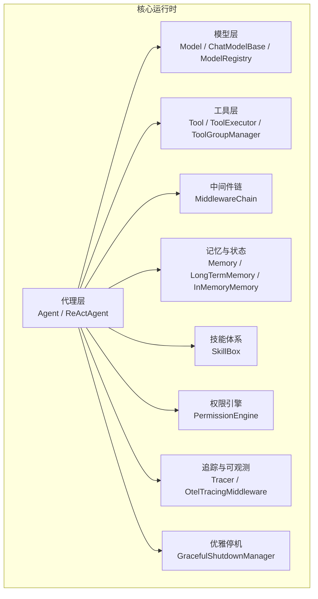
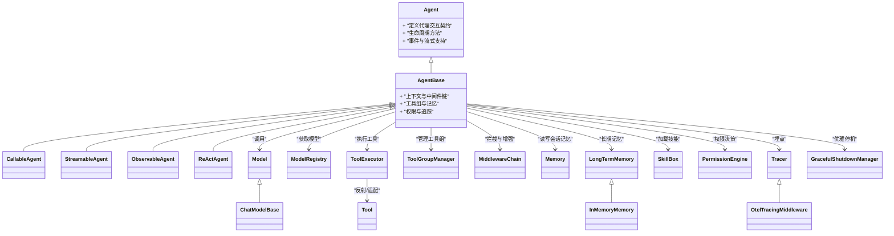
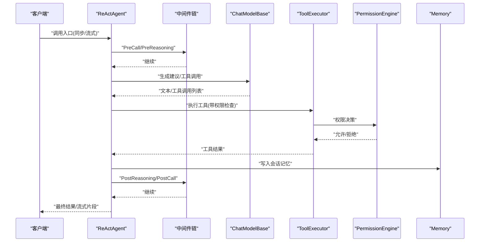
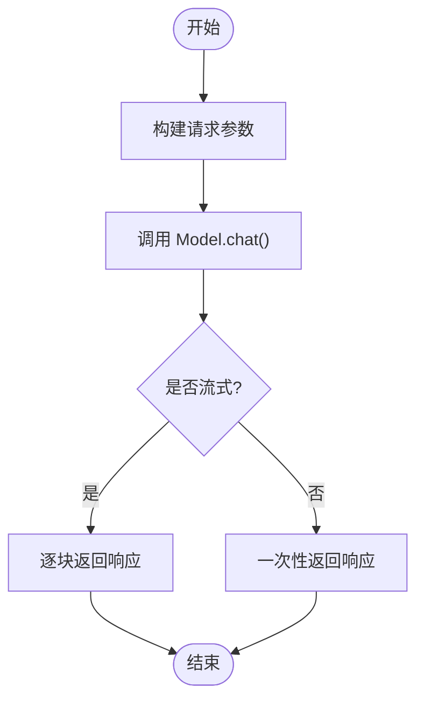
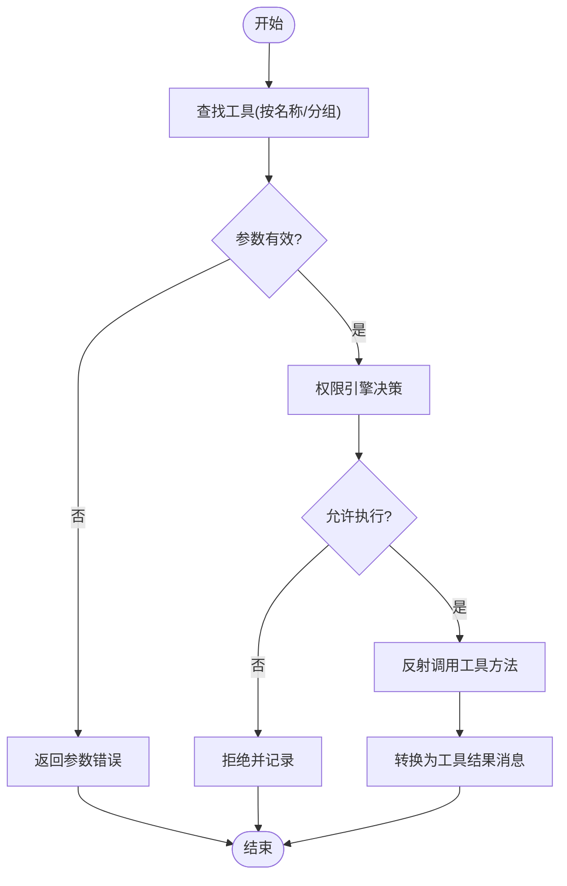
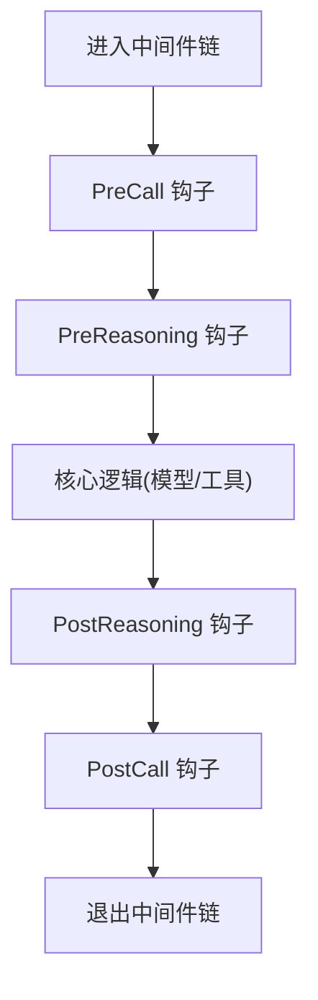
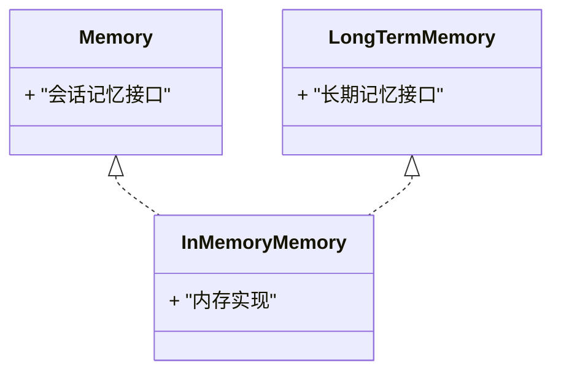
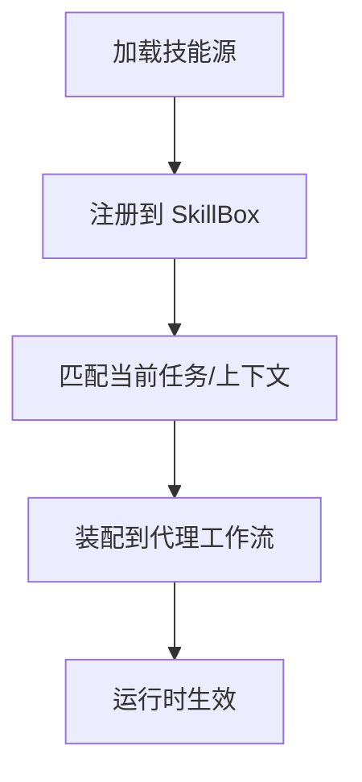
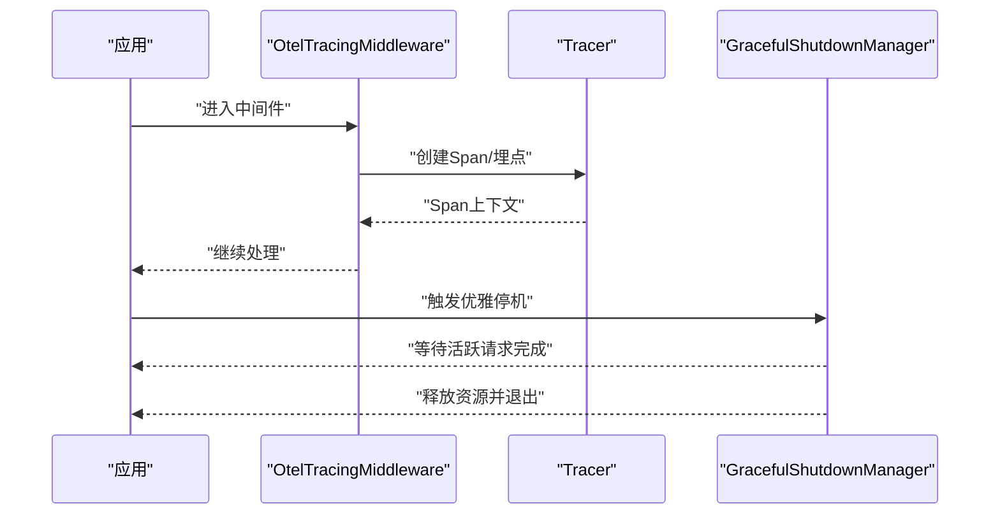
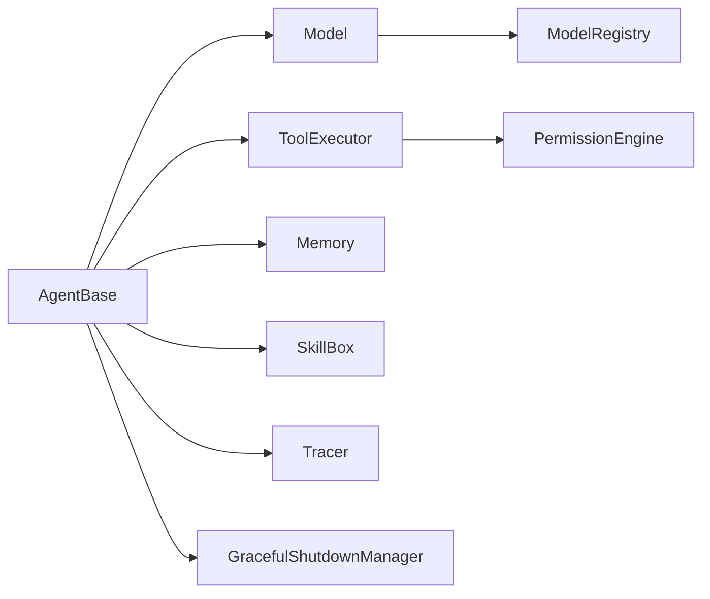

# 托管代理系统架构

<cite>
**本文引用的文件**   
- [Agent.java](file://agentscope-core/src/main/java/io/agentscope/core/agent/Agent.java)
- [AgentBase.java](file://agentscope-core/src/main/java/io/agentscope/core/agent/AgentBase.java)
- [CallableAgent.java](file://agentscope-core/src/main/java/io/agentscope/core/agent/CallableAgent.java)
- [ObservableAgent.java](file://agentscope-core/src/main/java/io/agentscope/core/agent/ObservableAgent.java)
- [StreamableAgent.java](file://agentscope-core/src/main/java/io/agentscope/core/agent/StreamableAgent.java)
- [ReActAgent.java](file://agentscope-core/src/main/java/io/agentscope/core/ReActAgent.java)
- [RuntimeContext.java](file://agentscope-core/src/main/java/io/agentscope/core/agent/RuntimeContext.java)
- [SubagentEventBus.java](file://agentscope-core/src/main/java/io/agentscope/core/agent/SubagentEventBus.java)
- [Model.java](file://agentscope-core/src/main/java/io/agentscope/core/model/Model.java)
- [ChatModelBase.java](file://agentscope-core/src/main/java/io/agentscope/core/model/ChatModelBase.java)
- [ModelRegistry.java](file://agentscope-core/src/main/java/io/agentscope/core/model/ModelRegistry.java)
- [Tool.java](file://agentscope-core/src/main/java/io/agentscope/core/tool/Tool.java)
- [ToolExecutor.java](file://agentscope-core/src/main/java/io/agentscope/core/tool/ToolExecutor.java)
- [ToolGroupManager.java](file://agentscope-core/src/main/java/io/agentscope/core/tool/ToolGroupManager.java)
- [MiddlewareChain.java](file://agentscope-core/src/main/java/io/agentscope/core/middleware/MiddlewareChain.java)
- [GracefulShutdownManager.java](file://agentscope-core/src/main/java/io/agentscope/core/shutdown/GracefulShutdownManager.java)
- [PermissionEngine.java](file://agentscope-core/src/main/java/io/agentscope/core/permission/PermissionEngine.java)
- [Memory.java](file://agentscope-core/src/main/java/io/agentscope/core/memory/Memory.java)
- [LongTermMemory.java](file://agentscope-core/src/main/java/io/agentscope/core/memory/LongTermMemory.java)
- [InMemoryMemory.java](file://agentscope-core/src/main/java/io/agentscope/core/memory/InMemoryMemory.java)
- [SkillBox.java](file://agentscope-core/src/main/java/io/agentscope/core/skill/SkillBox.java)
- [Tracer.java](file://agentscope-core/src/main/java/io/agentscope/core/tracing/Tracer.java)
- [OtelTracingMiddleware.java](file://agentscope-core/src/main/java/io/agentscope/core/tracing/OtelTracingMiddleware.java)
</cite>

## 目录
1. [简介](#简介)
2. [项目结构](#项目结构)
3. [核心组件](#核心组件)
4. [架构总览](#架构总览)
5. [详细组件分析](#详细组件分析)
6. [依赖关系分析](#依赖关系分析)
7. [性能考量](#性能考量)
8. [故障排查指南](#故障排查指南)
9. [结论](#结论)
10. [附录](#附录)

## 简介
本文件面向“托管代理系统”的架构设计与实现，围绕 AgentScope Java 的核心能力进行系统化梳理。重点覆盖：
- 代理生命周期与可观测性（事件、流式输出）
- 模型调用抽象与注册机制
- 工具执行与权限控制
- 中间件链与可插拔扩展点
- 记忆与技能体系
- 优雅停机与分布式协作基础

## 项目结构
仓库采用多模块 Maven 工程组织，核心运行时位于 agentscope-core，扩展能力通过 agentscope-extensions 提供，示例与应用位于 agentscope-examples。托管代理系统的核心代码集中在 core 包中，按职责划分为 agent、model、tool、middleware、memory、skill、permission、tracing、shutdown 等子域。

图表来源
- [Agent.java:1-200](file://agentscope-core/src/main/java/io/agentscope/core/agent/Agent.java#L1-L200)
- [ReActAgent.java:1-200](file://agentscope-core/src/main/java/io/agentscope/core/ReActAgent.java#L1-L200)
- [Model.java:1-200](file://agentscope-core/src/main/java/io/agentscope/core/model/Model.java#L1-L200)
- [ChatModelBase.java:1-200](file://agentscope-core/src/main/java/io/agentscope/core/model/ChatModelBase.java#L1-L200)
- [Tool.java:1-200](file://agentscope-core/src/main/java/io/agentscope/core/tool/Tool.java#L1-L200)
- [ToolExecutor.java:1-200](file://agentscope-core/src/main/java/io/agentscope/core/tool/ToolExecutor.java#L1-L200)
- [MiddlewareChain.java:1-200](file://agentscope-core/src/main/java/io/agentscope/core/middleware/MiddlewareChain.java#L1-L200)
- [Memory.java:1-200](file://agentscope-core/src/main/java/io/agentscope/core/memory/Memory.java#L1-L200)
- [SkillBox.java:1-200](file://agentscope-core/src/main/java/io/agentscope/core/skill/SkillBox.java#L1-L200)
- [PermissionEngine.java:1-200](file://agentscope-core/src/main/java/io/agentscope/core/permission/PermissionEngine.java#L1-L200)
- [Tracer.java:1-200](file://agentscope-core/src/main/java/io/agentscope/core/tracing/Tracer.java#L1-L200)
- [GracefulShutdownManager.java:1-200](file://agentscope-core/src/main/java/io/agentscope/core/shutdown/GracefulShutdownManager.java#L1-L200)

章节来源
- [Agent.java:1-200](file://agentscope-core/src/main/java/io/agentscope/core/agent/Agent.java#L1-L200)
- [ReActAgent.java:1-200](file://agentscope-core/src/main/java/io/agentscope/core/ReActAgent.java#L1-L200)
- [Model.java:1-200](file://agentscope-core/src/main/java/io/agentscope/core/model/Model.java#L1-L200)
- [Tool.java:1-200](file://agentscope-core/src/main/java/io/agentscope/core/tool/Tool.java#L1-L200)
- [MiddlewareChain.java:1-200](file://agentscope-core/src/main/java/io/agentscope/core/middleware/MiddlewareChain.java#L1-L200)
- [Memory.java:1-200](file://agentscope-core/src/main/java/io/agentscope/core/memory/Memory.java#L1-L200)
- [SkillBox.java:1-200](file://agentscope-core/src/main/java/io/agentscope/core/skill/SkillBox.java#L1-L200)
- [PermissionEngine.java:1-200](file://agentscope-core/src/main/java/io/agentscope/core/permission/PermissionEngine.java#L1-L200)
- [Tracer.java:1-200](file://agentscope-core/src/main/java/io/agentscope/core/tracing/Tracer.java#L1-L200)
- [GracefulShutdownManager.java:1-200](file://agentscope-core/src/main/java/io/agentscope/core/shutdown/GracefulShutdownManager.java#L1-L200)

## 核心组件
- 代理接口与基类
  - Agent：定义统一的生命周期与交互契约，包括输入处理、推理、行动、结果聚合与流式支持。
  - AgentBase：通用实现，封装上下文、事件总线、中间件链、工具组、记忆、权限、追踪等横切关注点。
  - CallableAgent / StreamableAgent：分别提供同步与流式调用能力。
  - ObservableAgent：基于事件的可观测代理，用于对外暴露运行期事件。
  - ReActAgent：典型的“思考-行动-观察”循环实现，驱动模型调用与工具使用。

- 模型抽象与注册
  - Model：统一的模型调用接口，屏蔽不同后端差异。
  - ChatModelBase：聊天模型的通用实现，包含参数构建、响应解析、用量统计等。
  - ModelRegistry：模型实例的创建与注册中心，支持按需构造与复用。

- 工具系统与执行器
  - Tool：工具的统一抽象，描述元数据、参数模式与执行语义。
  - ToolExecutor：负责工具发现、校验、调度与结果转换。
  - ToolGroupManager：管理工具分组与作用域，便于权限与可见性控制。

- 中间件链
  - MiddlewareChain：以责任链模式串联 Pre/Post 钩子，贯穿模型调用、推理、总结、工具执行等阶段。

- 记忆与长期记忆
  - Memory：会话级短期记忆接口。
  - LongTermMemory：长期记忆抽象，支持检索与持久化策略。
  - InMemoryMemory：内存态短期记忆实现。

- 技能体系
  - SkillBox：技能的加载、注册与动态装配，为代理提供可插拔能力。

- 权限引擎
  - PermissionEngine：在工具执行前进行权限决策，支持白名单、黑名单与自定义策略。

- 追踪与可观测性
  - Tracer：追踪接口，支持 OpenTelemetry 集成。
  - OtelTracingMiddleware：将关键阶段埋点上报。

- 优雅停机
  - GracefulShutdownManager：协调活跃请求完成与资源释放，保障服务平滑下线。

章节来源
- [Agent.java:1-200](file://agentscope-core/src/main/java/io/agentscope/core/agent/Agent.java#L1-L200)
- [AgentBase.java:1-200](file://agentscope-core/src/main/java/io/agentscope/core/agent/AgentBase.java#L1-L200)
- [CallableAgent.java:1-200](file://agentscope-core/src/main/java/io/agentscope/core/agent/CallableAgent.java#L1-L200)
- [StreamableAgent.java:1-200](file://agentscope-core/src/main/java/io/agentscope/core/agent/StreamableAgent.java#L1-L200)
- [ObservableAgent.java:1-200](file://agentscope-core/src/main/java/io/agentscope/core/agent/ObservableAgent.java#L1-L200)
- [ReActAgent.java:1-200](file://agentscope-core/src/main/java/io/agentscope/core/ReActAgent.java#L1-L200)
- [Model.java:1-200](file://agentscope-core/src/main/java/io/agentscope/core/model/Model.java#L1-L200)
- [ChatModelBase.java:1-200](file://agentscope-core/src/main/java/io/agentscope/core/model/ChatModelBase.java#L1-L200)
- [ModelRegistry.java:1-200](file://agentscope-core/src/main/java/io/agentscope/core/model/ModelRegistry.java#L1-L200)
- [Tool.java:1-200](file://agentscope-core/src/main/java/io/agentscope/core/tool/Tool.java#L1-L200)
- [ToolExecutor.java:1-200](file://agentscope-core/src/main/java/io/agentsscope/core/tool/ToolExecutor.java#L1-L200)
- [ToolGroupManager.java:1-200](file://agentscope-core/src/main/java/io/agentscope/core/tool/ToolGroupManager.java#L1-L200)
- [MiddlewareChain.java:1-200](file://agentscope-core/src/main/java/io/agentscope/core/middleware/MiddlewareChain.java#L1-L200)
- [Memory.java:1-200](file://agentscope-core/src/main/java/io/agentscope/core/memory/Memory.java#L1-L200)
- [LongTermMemory.java:1-200](file://agentscope-core/src/main/java/io/agentscope/core/memory/LongTermMemory.java#L1-L200)
- [InMemoryMemory.java:1-200](file://agentscope-core/src/main/java/io/agentscope/core/memory/InMemoryMemory.java#L1-L200)
- [SkillBox.java:1-200](file://agentscope-core/src/main/java/io/agentscope/core/skill/SkillBox.java#L1-L200)
- [PermissionEngine.java:1-200](file://agentscope-core/src/main/java/io/agentscope/core/permission/PermissionEngine.java#L1-L200)
- [Tracer.java:1-200](file://agentscope-core/src/main/java/io/agentscope/core/tracing/Tracer.java#L1-L200)
- [OtelTracingMiddleware.java:1-200](file://agentscope-core/src/main/java/io/agentscope/core/tracing/OtelTracingMiddleware.java#L1-L200)
- [GracefulShutdownManager.java:1-200](file://agentscope-core/src/main/java/io/agentscope/core/shutdown/GracefulShutdownManager.java#L1-L200)

## 架构总览
托管代理系统以“代理为中心”，通过中间件链对模型调用、推理、总结、工具执行等阶段进行横切增强；工具执行受权限引擎保护；记忆与技能提供领域能力；追踪与优雅停机保障可观测性与稳定性。

图表来源
- [Agent.java:1-200](file://agentscope-core/src/main/java/io/agentscope/core/agent/Agent.java#L1-L200)
- [AgentBase.java:1-200](file://agentscope-core/src/main/java/io/agentscope/core/agent/AgentBase.java#L1-L200)
- [CallableAgent.java:1-200](file://agentscope-core/src/main/java/io/agentscope/core/agent/CallableAgent.java#L1-L200)
- [StreamableAgent.java:1-200](file://agentscope-core/src/main/java/io/agentscope/core/agent/StreamableAgent.java#L1-L200)
- [ObservableAgent.java:1-200](file://agentscope-core/src/main/java/io/agentscope/core/agent/ObservableAgent.java#L1-L200)
- [ReActAgent.java:1-200](file://agentscope-core/src/main/java/io/agentscope/core/ReActAgent.java#L1-L200)
- [Model.java:1-200](file://agentscope-core/src/main/java/io/agentscope/core/model/Model.java#L1-L200)
- [ChatModelBase.java:1-200](file://agentscope-core/src/main/java/io/agentscope/core/model/ChatModelBase.java#L1-L200)
- [ModelRegistry.java:1-200](file://agentscope-core/src/main/java/io/agentscope/core/model/ModelRegistry.java#L1-L200)
- [Tool.java:1-200](file://agentscope-core/src/main/java/io/agentscope/core/tool/Tool.java#L1-L200)
- [ToolExecutor.java:1-200](file://agentscope-core/src/main/java/io/agentscope/core/tool/ToolExecutor.java#L1-L200)
- [ToolGroupManager.java:1-200](file://agentscope-core/src/main/java/io/agentscope/core/tool/ToolGroupManager.java#L1-L200)
- [MiddlewareChain.java:1-200](file://agentscope-core/src/main/java/io/agentscope/core/middleware/MiddlewareChain.java#L1-L200)
- [Memory.java:1-200](file://agentscope-core/src/main/java/io/agentscope/core/memory/Memory.java#L1-L200)
- [LongTermMemory.java:1-200](file://agentscope-core/src/main/java/io/agentscope/core/memory/LongTermMemory.java#L1-L200)
- [InMemoryMemory.java:1-200](file://agentscope-core/src/main/java/io/agentscope/core/memory/InMemoryMemory.java#L1-L200)
- [SkillBox.java:1-200](file://agentscope-core/src/main/java/io/agentscope/core/skill/SkillBox.java#L1-L200)
- [PermissionEngine.java:1-200](file://agentscope-core/src/main/java/io/agentscope/core/permission/PermissionEngine.java#L1-L200)
- [Tracer.java:1-200](file://agentscope-core/src/main/java/io/agentscope/core/tracing/Tracer.java#L1-L200)
- [OtelTracingMiddleware.java:1-200](file://agentscope-core/src/main/java/io/agentscope/core/tracing/OtelTracingMiddleware.java#L1-L200)
- [GracefulShutdownManager.java:1-200](file://agentscope-core/src/main/java/io/agentscope/core/shutdown/GracefulShutdownManager.java#L1-L200)

## 详细组件分析

### 代理层：Agent 家族与 ReAct 循环
- 设计要点
  - Agent 作为顶层抽象，统一了同步与流式两种交互范式。
  - AgentBase 集中管理中间件链、工具组、记忆、权限、追踪等横切能力，降低具体代理实现的复杂度。
  - ReActAgent 实现“思考-行动-观察”的主循环，驱动模型生成与工具调用的交替推进。
- 关键流程
  - 接收用户输入 → 中间件预处理 → 模型推理 → 工具选择与执行 → 结果汇总 → 中间件后处理 → 返回或流式推送。
- 可观测性
  - 通过 ObservableAgent 与 SubagentEventBus 暴露事件，便于外部监听与调试。

图表来源
- [ReActAgent.java:1-200](file://agentscope-core/src/main/java/io/agentscope/core/ReActAgent.java#L1-L200)
- [MiddlewareChain.java:1-200](file://agentscope-core/src/main/java/io/agentscope/core/middleware/MiddlewareChain.java#L1-L200)
- [ChatModelBase.java:1-200](file://agentscope-core/src/main/java/io/agentscope/core/model/ChatModelBase.java#L1-L200)
- [ToolExecutor.java:1-200](file://agentscope-core/src/main/java/io/agentscope/core/tool/ToolExecutor.java#L1-L200)
- [PermissionEngine.java:1-200](file://agentscope-core/src/main/java/io/agentscope/core/permission/PermissionEngine.java#L1-L200)
- [Memory.java:1-200](file://agentscope-core/src/main/java/io/agentscope/core/memory/Memory.java#L1-L200)

章节来源
- [Agent.java:1-200](file://agentscope-core/src/main/java/io/agentscope/core/agent/Agent.java#L1-L200)
- [AgentBase.java:1-200](file://agentscope-core/src/main/java/io/agentscope/core/agent/AgentBase.java#L1-L200)
- [ReActAgent.java:1-200](file://agentscope-core/src/main/java/io/agentscope/core/ReActAgent.java#L1-L200)
- [SubagentEventBus.java:1-200](file://agentscope-core/src/main/java/io/agentscope/core/agent/SubagentEventBus.java#L1-L200)

### 模型层：抽象、注册与传输
- 设计要点
  - Model 抽象屏蔽底层差异，ChatModelBase 提供通用聊天逻辑。
  - ModelRegistry 负责模型实例的创建、缓存与生命周期管理。
- 关键点
  - 统一的生成选项与用法统计。
  - 可扩展的传输层（transport）适配不同后端。

图表来源
- [Model.java:1-200](file://agentscope-core/src/main/java/io/agentscope/core/model/Model.java#L1-L200)
- [ChatModelBase.java:1-200](file://agentscope-core/src/main/java/io/agentscope/core/model/ChatModelBase.java#L1-L200)
- [ModelRegistry.java:1-200](file://agentscope-core/src/main/java/io/agentscope/core/model/ModelRegistry.java#L1-L200)

章节来源
- [Model.java:1-200](file://agentscope-core/src/main/java/io/agentscope/core/model/Model.java#L1-L200)
- [ChatModelBase.java:1-200](file://agentscope-core/src/main/java/io/agentscope/core/model/ChatModelBase.java#L1-L200)
- [ModelRegistry.java:1-200](file://agentscope-core/src/main/java/io/agentscope/core/model/ModelRegistry.java#L1-L200)

### 工具层：注册、执行与权限
- 设计要点
  - Tool 描述工具元数据与参数模式，ToolExecutor 负责反射调用与结果转换。
  - ToolGroupManager 管理工具分组与作用域，结合 PermissionEngine 进行访问控制。
- 关键点
  - 工具发现与自动注册。
  - 参数校验与安全路径限制。
  - 结果消息构建与错误传播。

图表来源
- [Tool.java:1-200](file://agentscope-core/src/main/java/io/agentscope/core/tool/Tool.java#L1-L200)
- [ToolExecutor.java:1-200](file://agentscope-core/src/main/java/io/agentscope/core/tool/ToolExecutor.java#L1-L200)
- [ToolGroupManager.java:1-200](file://agentscope-core/src/main/java/io/agentscope/core/tool/ToolGroupManager.java#L1-L200)
- [PermissionEngine.java:1-200](file://agentscope-core/src/main/java/io/agentscope/core/permission/PermissionEngine.java#L1-L200)

章节来源
- [Tool.java:1-200](file://agentscope-core/src/main/java/io/agentscope/core/tool/Tool.java#L1-L200)
- [ToolExecutor.java:1-200](file://agentscope-core/src/main/java/io/agentscope/core/tool/ToolExecutor.java#L1-L200)
- [ToolGroupManager.java:1-200](file://agentscope-core/src/main/java/io/agentscope/core/tool/ToolGroupManager.java#L1-L200)
- [PermissionEngine.java:1-200](file://agentscope-core/src/main/java/io/agentscope/core/permission/PermissionEngine.java#L1-L200)

### 中间件链：横切增强与可观测
- 设计要点
  - MiddlewareChain 以责任链模式串联多个 Hook，覆盖 Pre/Post 各阶段。
  - 典型场景：日志、限流、审计、结构化输出提醒、任务提醒等。
- 关键点
  - 顺序敏感，需合理编排。
  - 异常透传与短路机制。

图表来源
- [MiddlewareChain.java:1-200](file://agentscope-core/src/main/java/io/agentscope/core/middleware/MiddlewareChain.java#L1-L200)

章节来源
- [MiddlewareChain.java:1-200](file://agentscope-core/src/main/java/io/agentscope/core/middleware/MiddlewareChain.java#L1-L200)

### 记忆与长期记忆：会话与知识
- 设计要点
  - Memory 提供会话内短期记忆存取。
  - LongTermMemory 抽象长期记忆，支持检索与持久化策略。
  - InMemoryMemory 提供轻量内存实现，适合快速验证与演示。
- 关键点
  - 记忆写入时机与容量控制。
  - 长期记忆的索引与召回策略。

图表来源
- [Memory.java:1-200](file://agentscope-core/src/main/java/io/agentscope/core/memory/Memory.java#L1-L200)
- [LongTermMemory.java:1-200](file://agentscope-core/src/main/java/io/agentscope/core/memory/LongTermMemory.java#L1-L200)
- [InMemoryMemory.java:1-200](file://agentscope-core/src/main/java/io/agentscope/core/memory/InMemoryMemory.java#L1-L200)

章节来源
- [Memory.java:1-200](file://agentscope-core/src/main/java/io/agentscope/core/memory/Memory.java#L1-L200)
- [LongTermMemory.java:1-200](file://agentscope-core/src/main/java/io/agentscope/core/memory/LongTermMemory.java#L1-L200)
- [InMemoryMemory.java:1-200](file://agentscope-core/src/main/java/io/agentscope/core/memory/InMemoryMemory.java#L1-L200)

### 技能体系：动态装配与扩展
- 设计要点
  - SkillBox 负责技能的加载、注册与动态装配，使代理具备可插拔的领域能力。
- 关键点
  - 技能与工具的映射关系。
  - 条件启用与版本兼容。

图表来源
- [SkillBox.java:1-200](file://agentscope-core/src/main/java/io/agentscope/core/skill/SkillBox.java#L1-L200)

章节来源
- [SkillBox.java:1-200](file://agentscope-core/src/main/java/io/agentscope/core/skill/SkillBox.java#L1-L200)

### 追踪与优雅停机：可观测与稳定
- 追踪
  - Tracer 抽象追踪接口，OtelTracingMiddleware 对接 OpenTelemetry，对关键阶段进行埋点。
- 优雅停机
  - GracefulShutdownManager 协调活跃请求完成与资源释放，避免中断导致的数据不一致。

图表来源
- [Tracer.java:1-200](file://agentscope-core/src/main/java/io/agentscope/core/tracing/Tracer.java#L1-L200)
- [OtelTracingMiddleware.java:1-200](file://agentscope-core/src/main/java/io/agentscope/core/tracing/OtelTracingMiddleware.java#L1-L200)
- [GracefulShutdownManager.java:1-200](file://agentscope-core/src/main/java/io/agentscope/core/shutdown/GracefulShutdownManager.java#L1-L200)

章节来源
- [Tracer.java:1-200](file://agentscope-core/src/main/java/io/agentscope/core/tracing/Tracer.java#L1-L200)
- [OtelTracingMiddleware.java:1-200](file://agentscope-core/src/main/java/io/agentscope/core/tracing/OtelTracingMiddleware.java#L1-L200)
- [GracefulShutdownManager.java:1-200](file://agentscope-core/src/main/java/io/agentscope/core/shutdown/GracefulShutdownManager.java#L1-L200)

## 依赖关系分析
- 耦合与内聚
  - AgentBase 作为中枢，聚合模型、工具、记忆、权限、追踪等子系统，内聚度高但依赖面广。
  - 中间件链解耦横切逻辑，提升整体可维护性。
- 直接/间接依赖
  - 代理层依赖模型层与工具层；工具层依赖权限引擎；追踪与停机为横向支撑。
- 外部依赖
  - 模型传输层与第三方 SDK 的适配通过扩展模块引入，保持核心最小依赖。

图表来源
- [AgentBase.java:1-200](file://agentscope-core/src/main/java/io/agentscope/core/agent/AgentBase.java#L1-L200)
- [Model.java:1-200](file://agentscope-core/src/main/java/io/agentscope/core/model/Model.java#L1-L200)
- [ToolExecutor.java:1-200](file://agentscope-core/src/main/java/io/agentscope/core/tool/ToolExecutor.java#L1-L200)
- [PermissionEngine.java:1-200](file://agentscope-core/src/main/java/io/agentscope/core/permission/PermissionEngine.java#L1-L200)
- [Memory.java:1-200](file://agentscope-core/src/main/java/io/agentscope/core/memory/Memory.java#L1-L200)
- [SkillBox.java:1-200](file://agentscope-core/src/main/java/io/agentscope/core/skill/SkillBox.java#L1-L200)
- [Tracer.java:1-200](file://agentscope-core/src/main/java/io/agentscope/core/tracing/Tracer.java#L1-L200)
- [GracefulShutdownManager.java:1-200](file://agentscope-core/src/main/java/io/agentscope/core/shutdown/GracefulShutdownManager.java#L1-L200)
- [ModelRegistry.java:1-200](file://agentscope-core/src/main/java/io/agentscope/core/model/ModelRegistry.java#L1-L200)

章节来源
- [AgentBase.java:1-200](file://agentscope-core/src/main/java/io/agentscope/core/agent/AgentBase.java#L1-L200)
- [Model.java:1-200](file://agentscope-core/src/main/java/io/agentscope/core/model/Model.java#L1-L200)
- [ToolExecutor.java:1-200](file://agentscope-core/src/main/java/io/agentscope/core/tool/ToolExecutor.java#L1-L200)
- [PermissionEngine.java:1-200](file://agentscope-core/src/main/java/io/agentscope/core/permission/PermissionEngine.java#L1-L200)
- [Memory.java:1-200](file://agentscope-core/src/main/java/io/agentscope/core/memory/Memory.java#L1-L200)
- [SkillBox.java:1-200](file://agentscope-core/src/main/java/io/agentscope/core/skill/SkillBox.java#L1-L200)
- [Tracer.java:1-200](file://agentscope-core/src/main/java/io/agentscope/core/tracing/Tracer.java#L1-L200)
- [GracefulShutdownManager.java:1-200](file://agentscope-core/src/main/java/io/agentscope/core/shutdown/GracefulShutdownManager.java#L1-L200)
- [ModelRegistry.java:1-200](file://agentscope-core/src/main/java/io/agentscope/core/model/ModelRegistry.java#L1-L200)

## 性能考量
- 模型调用
  - 合理使用缓存策略与批量请求，减少网络往返。
  - 流式输出可降低首字节延迟，提升用户体验。
- 工具执行
  - 工具方法应幂等且短耗时，避免阻塞主线程。
  - 对高并发场景，考虑异步执行与超时控制。
- 中间件链
  - 避免在中间件中执行重计算或 IO，必要时异步化。
- 记忆与长期记忆
  - 控制会话记忆大小，定期清理或压缩。
  - 长期记忆检索需建立合适索引，避免全量扫描。
- 追踪与停机
  - 追踪采样率需权衡开销与可观测性。
  - 优雅停机需设置合理的等待阈值，防止长时间挂起。

[本节为通用指导，不直接分析具体文件]

## 故障排查指南
- 常见问题定位
  - 模型调用失败：检查 ModelRegistry 配置与网络连通性，查看追踪 Span 定位阶段。
  - 工具执行异常：确认工具参数校验与权限策略，检查工具返回值是否符合预期。
  - 中间件阻塞：审查中间件顺序与耗时操作，必要时拆分或异步化。
  - 记忆溢出：调整会话记忆上限与清理策略。
  - 优雅停机卡住：检查活跃请求计数与资源释放逻辑。
- 诊断手段
  - 开启 OtelTracingMiddleware 并导出链路数据。
  - 利用 ObservableAgent 的事件订阅，捕获关键节点状态。
  - 在中间件中添加审计日志，记录输入输出摘要。

章节来源
- [OtelTracingMiddleware.java:1-200](file://agentscope-core/src/main/java/io/agentscope/core/tracing/OtelTracingMiddleware.java#L1-L200)
- [ObservableAgent.java:1-200](file://agentscope-core/src/main/java/io/agentscope/core/agent/ObservableAgent.java#L1-L200)
- [MiddlewareChain.java:1-200](file://agentscope-core/src/main/java/io/agentscope/core/middleware/MiddlewareChain.java#L1-L200)
- [Memory.java:1-200](file://agentscope-core/src/main/java/io/agentscope/core/memory/Memory.java#L1-L200)
- [GracefulShutdownManager.java:1-200](file://agentscope-core/src/main/java/io/agentscope/core/shutdown/GracefulShutdownManager.java#L1-L200)

## 结论
托管代理系统以 AgentBase 为核心，通过中间件链、模型抽象、工具执行、权限控制、记忆与技能体系形成高度可组合的运行时。配合追踪与优雅停机，系统在可观测性与稳定性方面具备良好基础。建议在业务侧优先明确工具边界与权限策略，合理编排中间件，并结合长期记忆与技能体系逐步扩展领域能力。

[本节为总结性内容，不直接分析具体文件]

## 附录
- 术语
  - 代理：具备感知、推理、行动能力的软件实体。
  - 中间件：对核心流程进行横切增强的可插拔组件。
  - 工具：被代理调用的外部能力封装。
  - 记忆：会话与长期知识的存储与检索。
  - 技能：可动态装配的领域能力集合。
  - 追踪：对系统运行过程进行数据采集与分析。
  - 优雅停机：在服务下线时保证请求完成与资源释放。

[本节为概念说明，不直接分析具体文件]