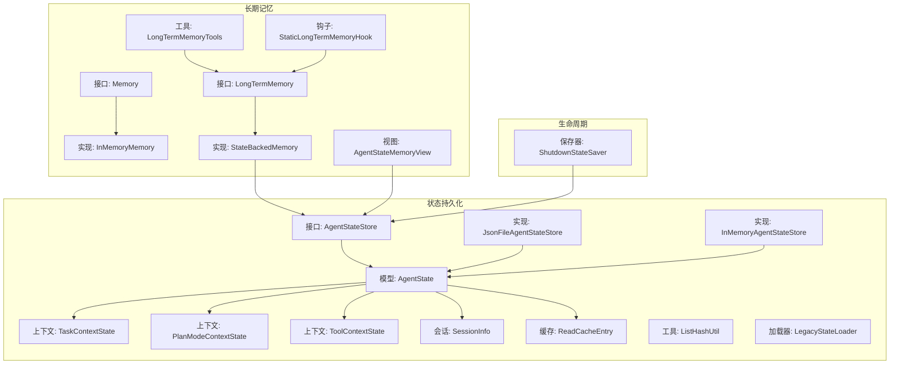
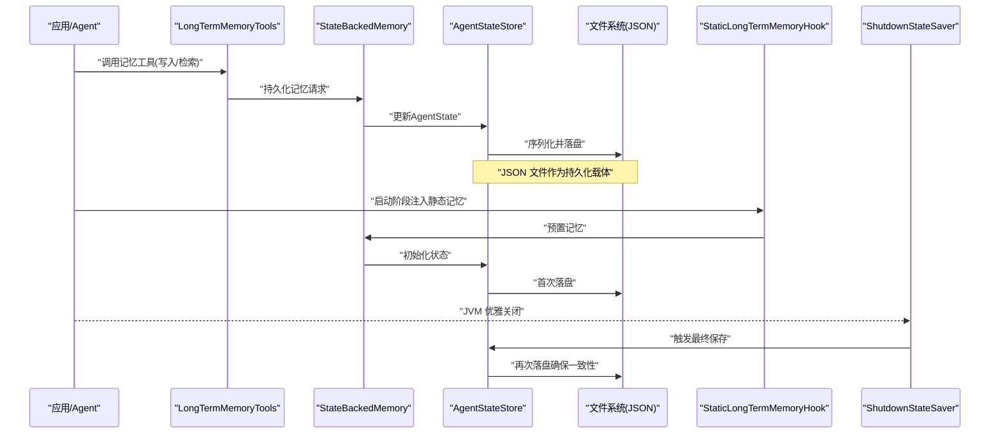
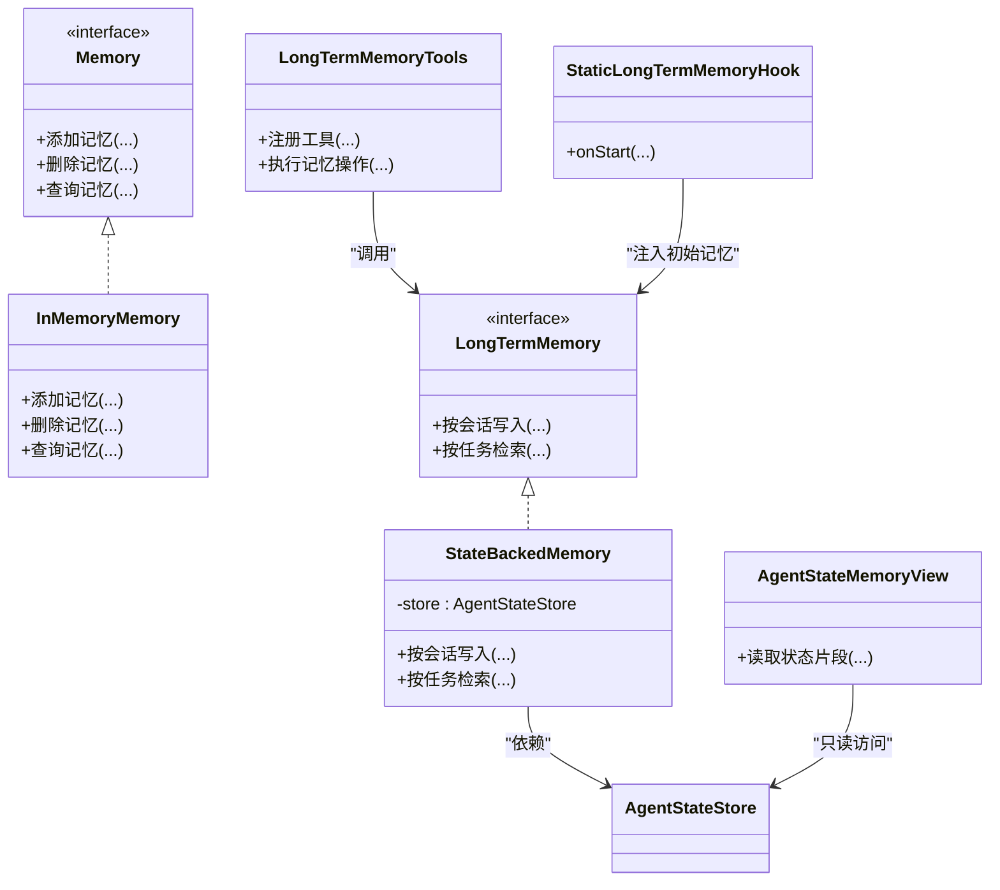
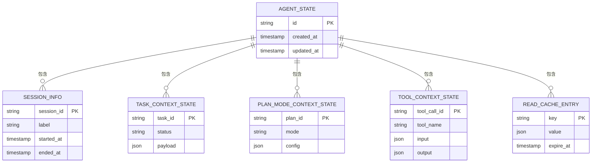
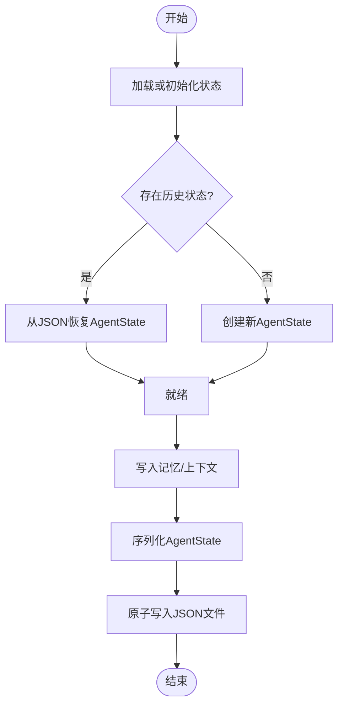
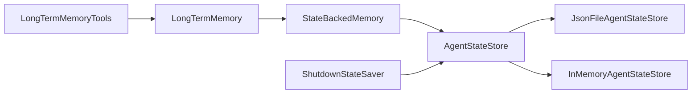

# 持久化内存存储

<cite>
**本文引用的文件**   
- [agentscope-core/src/main/java/io/agentscope/core/memory/Memory.java](file://agentscope-core/src/main/java/io/agentscope/core/memory/Memory.java)
- [agentscope-core/src/main/java/io/agentscope/core/memory/InMemoryMemory.java](file://agentscope-core/src/main/java/io/agentscope/core/memory/InMemoryMemory.java)
- [agentscope-core/src/main/java/io/agentscope/core/memory/LongTermMemory.java](file://agentscope-core/src/main/java/io/agentscope/core/memory/LongTermMemory.java)
- [agentscope-core/src/main/java/io/agentscope/core/memory/StateBackedMemory.java](file://agentscope-core/src/main/java/io/agentscope/core/memory/StateBackedMemory.java)
- [agentscope-core/src/main/java/io/agentscope/core/state/AgentStateStore.java](file://agentscope-core/src/main/java/io/agentscope/core/state/AgentStateStore.java)
- [agentscope-core/src/main/java/io/agentscope/core/state/JsonFileAgentStateStore.java](file://agentscope-core/src/main/java/io/agentscope/core/state/JsonFileAgentStateStore.java)
- [agentscope-core/src/main/java/io/agentscope/core/state/InMemoryAgentStateStore.java](file://agentscope-core/src/main/java/io/agentscope/core/state/InMemoryAgentStateStore.java)
- [agentscope-core/src/main/java/io/agentscope/core/state/AgentState.java](file://agentscope-core/src/main/java/io/agentscope/core/state/AgentState.java)
- [agentscope-core/src/main/java/io/agentscope/core/state/TaskContextState.java](file://agentscope-core/src/main/java/io/agentscope/core/state/TaskContextState.java)
- [agentscope-core/src/main/java/io/agentscope/core/state/PlanModeContextState.java](file://agentscope-core/src/main/java/io/agentscope/core/state/PlanModeContextState.java)
- [agentscope-core/src/main/java/io/agentscope/core/state/ToolContextState.java](file://agentscope-core/src/main/java/io/agentscope/core/state/ToolContextState.java)
- [agentscope-core/src/main/java/io/agentscope/core/state/SessionInfo.java](file://agentscope-core/src/main/java/io/agentscope/core/state/SessionInfo.java)
- [agentscope-core/src/main/java/io/agentscope/core/state/ReadCacheEntry.java](file://agentscope-core/src/main/java/io/agentscope/core/state/ReadCacheEntry.java)
- [agentscope-core/src/main/java/io/agentscope/core/state/ListHashUtil.java](file://agentscope-core/src/main/java/io/agentscope/core/state/ListHashUtil.java)
- [agentscope-core/src/main/java/io/agentscope/core/state/LegacyStateLoader.java](file://agentscope-core/src/main/java/io/agentscope/core/state/LegacyStateLoader.java)
- [agentscope-core/src/main/java/io/agentscope/core/shutdown/ShutdownStateSaver.java](file://agentscope-core/src/main/java/io/agentscope/core/shutdown/ShutdownStateSaver.java)
- [agentscope-core/src/main/java/io/agentscope/core/hook/StaticLongTermMemoryHook.java](file://agentscope-core/src/main/java/io/agentscope/core/hook/StaticLongTermMemoryHook.java)
- [agentscope-core/src/main/java/io/agentscope/core/memory/LongTermMemoryTools.java](file://agentscope-core/src/main/java/io/agentscope/core/memory/LongTermMemoryTools.java)
- [agentscope-core/src/main/java/io/agentscope/core/memory/AgentStateMemoryView.java](file://agentscope-core/src/main/java/io/agentscope/core/memory/AgentStateMemoryView.java)
</cite>

## 目录
1. [简介](#简介)
2. [项目结构](#项目结构)
3. [核心组件](#核心组件)
4. [架构总览](#架构总览)
5. [详细组件分析](#详细组件分析)
6. [依赖关系分析](#依赖关系分析)
7. [性能与一致性](#性能与一致性)
8. [故障排查指南](#故障排查指南)
9. [结论](#结论)
10. [附录](#附录)

## 简介
本文件围绕 AgentScope Java 的“持久化内存存储”能力进行系统化说明，聚焦于长期记忆（Long-term Memory）与状态持久化（Agent State Persistence）两条主线：
- 长期记忆：提供面向会话/任务的可扩展记忆接口与工具，支持在进程内或外部后端中读写结构化记忆。
- 状态持久化：通过 AgentStateStore 抽象将 Agent 运行期状态（会话、任务、计划、工具上下文等）持久化到文件系统或其他后端，并在优雅关闭时自动保存。

目标读者包括希望集成持久化能力的开发者、运维人员以及需要理解系统数据流与一致性的工程师。

## 项目结构
与持久化内存相关的代码主要分布在以下包：
- memory：长期记忆的接口与实现、视图与工具
- state：Agent 状态的抽象、默认实现与 JSON 文件持久化
- shutdown：优雅关闭时的状态保存
- hook：静态长期记忆钩子（用于注入初始记忆）

图表来源
- [agentscope-core/src/main/java/io/agentscope/core/memory/Memory.java](file://agentscope-core/src/main/java/io/agentscope/core/memory/Memory.java)
- [agentscope-core/src/main/java/io/agentscope/core/memory/InMemoryMemory.java](file://agentscope-core/src/main/java/io/agentscope/core/memory/InMemoryMemory.java)
- [agentscope-core/src/main/java/io/agentscope/core/memory/LongTermMemory.java](file://agentscope-core/src/main/java/io/agentscope/core/memory/LongTermMemory.java)
- [agentscope-core/src/main/java/io/agentscope/core/memory/StateBackedMemory.java](file://agentscope-core/src/main/java/io/agentscope/core/memory/StateBackedMemory.java)
- [agentscope-core/src/main/java/io/agentscope/core/memory/AgentStateMemoryView.java](file://agentscope-core/src/main/java/io/agentscope/core/memory/AgentStateMemoryView.java)
- [agentscope-core/src/main/java/io/agentscope/core/memory/LongTermMemoryTools.java](file://agentscope-core/src/main/java/io/agentscope/core/memory/LongTermMemoryTools.java)
- [agentscope-core/src/main/java/io/agentscope/core/hook/StaticLongTermMemoryHook.java](file://agentscope-core/src/main/java/io/agentscope/core/hook/StaticLongTermMemoryHook.java)
- [agentscope-core/src/main/java/io/agentscope/core/state/AgentStateStore.java](file://agentscope-core/src/main/java/io/agentscope/core/state/AgentStateStore.java)
- [agentscope-core/src/main/java/io/agentscope/core/state/InMemoryAgentStateStore.java](file://agentscope-core/src/main/java/io/agentscope/core/state/InMemoryAgentStateStore.java)
- [agentscope-core/src/main/java/io/agentscope/core/state/JsonFileAgentStateStore.java](file://agentscope-core/src/main/java/io/agentscope/core/state/JsonFileAgentStateStore.java)
- [agentscope-core/src/main/java/io/agentscope/core/state/AgentState.java](file://agentscope-core/src/main/java/io/agentscope/core/state/AgentState.java)
- [agentscope-core/src/main/java/io/agentscope/core/state/TaskContextState.java](file://agentscope-core/src/main/java/io/agentscope/core/state/TaskContextState.java)
- [agentscope-core/src/main/java/io/agentscope/core/state/PlanModeContextState.java](file://agentscope-core/src/main/java/io/agentscope/core/state/PlanModeContextState.java)
- [agentscope-core/src/main/java/io/agentscope/core/state/ToolContextState.java](file://agentscope-core/src/main/java/io/agentscope/core/state/ToolContextState.java)
- [agentscope-core/src/main/java/io/agentscope/core/state/SessionInfo.java](file://agentscope-core/src/main/java/io/agentscope/core/state/SessionInfo.java)
- [agentscope-core/src/main/java/io/agentscope/core/state/ReadCacheEntry.java](file://agentscope-core/src/main/java/io/agentscope/core/state/ReadCacheEntry.java)
- [agentscope-core/src/main/java/io/agentscope/core/state/ListHashUtil.java](file://agentscope-core/src/main/java/io/agentscope/core/state/ListHashUtil.java)
- [agentscope-core/src/main/java/io/agentscope/core/state/LegacyStateLoader.java](file://agentscope-core/src/main/java/io/agentscope/core/state/LegacyStateLoader.java)
- [agentscope-core/src/main/java/io/agentscope/core/shutdown/ShutdownStateSaver.java](file://agentscope-core/src/main/java/io/agentscope/core/shutdown/ShutdownStateSaver.java)

章节来源
- [agentscope-core/src/main/java/io/agentscope/core/memory/Memory.java](file://agentscope-core/src/main/java/io/agentscope/core/memory/Memory.java)
- [agentscope-core/src/main/java/io/agentscope/core/memory/LongTermMemory.java](file://agentscope-core/src/main/java/io/agentscope/core/memory/LongTermMemory.java)
- [agentscope-core/src/main/java/io/agentscope/core/state/AgentStateStore.java](file://agentscope-core/src/main/java/io/agentscope/core/state/AgentStateStore.java)
- [agentscope-core/src/main/java/io/agentscope/core/state/JsonFileAgentStateStore.java](file://agentscope-core/src/main/java/io/agentscope/core/state/JsonFileAgentStateStore.java)
- [agentscope-core/src/main/java/io/agentscope/core/shutdown/ShutdownStateSaver.java](file://agentscope-core/src/main/java/io/agentscope/core/shutdown/ShutdownStateSaver.java)

## 核心组件
- 长期记忆接口与实现
  - Memory：通用记忆接口，定义增删改查与查询能力。
  - InMemoryMemory：基于进程内集合的轻量实现，适合开发调试与无状态场景。
  - LongTermMemory：面向长期记忆的领域接口，提供按会话/任务维度的记忆存取。
  - StateBackedMemory：以 AgentStateStore 为后端的长期记忆实现，使记忆具备持久化能力。
  - AgentStateMemoryView：对 AgentState 的只读视图，便于上层以统一方式访问状态中的记忆片段。
  - LongTermMemoryTools：暴露给 Agent 的工具集，用于在对话过程中动态写入/检索记忆。
  - StaticLongTermMemoryHook：启动阶段注入静态初始记忆的钩子。

- 状态持久化接口与实现
  - AgentStateStore：状态存储抽象，定义序列化/反序列化、原子更新与事务式操作。
  - InMemoryAgentStateStore：进程内 Map 实现，零 IO，适合测试与单进程快速迭代。
  - JsonFileAgentStateStore：基于 JSON 文件的持久化实现，提供跨进程/重启的状态恢复。
  - AgentState：状态根对象，包含会话信息、任务上下文、计划模式上下文、工具上下文与读取缓存等。
  - 上下文与辅助类型：TaskContextState、PlanModeContextState、ToolContextState、SessionInfo、ReadCacheEntry、ListHashUtil、LegacyStateLoader。

- 生命周期集成
  - ShutdownStateSaver：在 JVM 优雅关闭时触发状态保存，确保退出前落盘。

章节来源
- [agentscope-core/src/main/java/io/agentscope/core/memory/Memory.java](file://agentscope-core/src/main/java/io/agentscope/core/memory/Memory.java)
- [agentscope-core/src/main/java/io/agentscope/core/memory/InMemoryMemory.java](file://agentscope-core/src/main/java/io/agentscope/core/memory/InMemoryMemory.java)
- [agentscope-core/src/main/java/io/agentscope/core/memory/LongTermMemory.java](file://agentscope-core/src/main/java/io/agentscope/core/memory/LongTermMemory.java)
- [agentscope-core/src/main/java/io/agentscope/core/memory/StateBackedMemory.java](file://agentscope-core/src/main/java/io/agentscope/core/memory/StateBackedMemory.java)
- [agentscope-core/src/main/java/io/agentscope/core/memory/AgentStateMemoryView.java](file://agentscope-core/src/main/java/io/agentscope/core/memory/AgentStateMemoryView.java)
- [agentscope-core/src/main/java/io/agentscope/core/memory/LongTermMemoryTools.java](file://agentscope-core/src/main/java/io/agentscope/core/memory/LongTermMemoryTools.java)
- [agentscope-core/src/main/java/io/agentscope/core/hook/StaticLongTermMemoryHook.java](file://agentscope-core/src/main/java/io/agentscope/core/hook/StaticLongTermMemoryHook.java)
- [agentscope-core/src/main/java/io/agentscope/core/state/AgentStateStore.java](file://agentscope-core/src/main/java/io/agentscope/core/state/AgentStateStore.java)
- [agentscope-core/src/main/java/io/agentscope/core/state/InMemoryAgentStateStore.java](file://agentscope-core/src/main/java/io/agentscope/core/state/InMemoryAgentStateStore.java)
- [agentscope-core/src/main/java/io/agentscope/core/state/JsonFileAgentStateStore.java](file://agentscope-core/src/main/java/io/agentscope/core/state/JsonFileAgentStateStore.java)
- [agentscope-core/src/main/java/io/agentscope/core/state/AgentState.java](file://agentscope-core/src/main/java/io/agentscope/core/state/AgentState.java)
- [agentscope-core/src/main/java/io/agentscope/core/state/TaskContextState.java](file://agentscope-core/src/main/java/io/agentscope/core/state/TaskContextState.java)
- [agentscope-core/src/main/java/io/agentscope/core/state/PlanModeContextState.java](file://agentscope-core/src/main/java/io/agentscope/core/state/PlanModeContextState.java)
- [agentscope-core/src/main/java/io/agentscope/core/state/ToolContextState.java](file://agentscope-core/src/main/java/io/agentscope/core/state/ToolContextState.java)
- [agentscope-core/src/main/java/io/agentscope/core/state/SessionInfo.java](file://agentscope-core/src/main/java/io/agentscope/core/state/SessionInfo.java)
- [agentscope-core/src/main/java/io/agentscope/core/state/ReadCacheEntry.java](file://agentscope-core/src/main/java/io/agentscope/core/state/ReadCacheEntry.java)
- [agentscope-core/src/main/java/io/agentscope/core/state/ListHashUtil.java](file://agentscope-core/src/main/java/io/agentscope/core/state/ListHashUtil.java)
- [agentscope-core/src/main/java/io/agentscope/core/state/LegacyStateLoader.java](file://agentscope-core/src/main/java/io/agentscope/core/state/LegacyStateLoader.java)
- [agentscope-core/src/main/java/io/agentscope/core/shutdown/ShutdownStateSaver.java](file://agentscope-core/src/main/java/io/agentscope/core/shutdown/ShutdownStateSaver.java)

## 架构总览
下图展示了从应用层到持久化后端的完整调用链：Agent 通过长期记忆工具写入/读取记忆；StateBackedMemory 将记忆写入 AgentState；AgentStateStore 负责将状态序列化为 JSON 并落盘；JVM 关闭时由 ShutdownStateSaver 触发最终保存。

图表来源
- [agentscope-core/src/main/java/io/agentscope/core/memory/LongTermMemoryTools.java](file://agentscope-core/src/main/java/io/agentscope/core/memory/LongTermMemoryTools.java)
- [agentscope-core/src/main/java/io/agentscope/core/memory/StateBackedMemory.java](file://agentscope-core/src/main/java/io/agentscope/core/memory/StateBackedMemory.java)
- [agentscope-core/src/main/java/io/agentscope/core/state/AgentStateStore.java](file://agentscope-core/src/main/java/io/agentscope/core/state/AgentStateStore.java)
- [agentscope-core/src/main/java/io/agentscope/core/state/JsonFileAgentStateStore.java](file://agentscope-core/src/main/java/io/agentscope/core/state/JsonFileAgentStateStore.java)
- [agentscope-core/src/main/java/io/agentscope/core/hook/StaticLongTermMemoryHook.java](file://agentscope-core/src/main/java/io/agentscope/core/hook/StaticLongTermMemoryHook.java)
- [agentscope-core/src/main/java/io/agentscope/core/shutdown/ShutdownStateSaver.java](file://agentscope-core/src/main/java/io/agentscope/core/shutdown/ShutdownStateSaver.java)

## 详细组件分析

### 长期记忆子系统
- 设计要点
  - 分层清晰：Memory 抽象出通用能力；LongTermMemory 聚焦会话/任务维度；StateBackedMemory 将记忆与状态持久化打通。
  - 可扩展：可通过自定义 AgentStateStore 接入不同后端（如数据库、对象存储）。
  - 可观测：通过 Hook 与工具暴露记忆写入点，便于审计与回放。

- 关键类与方法职责
  - Memory：定义基础增删改查与过滤查询方法。
  - InMemoryMemory：使用线程安全的集合维护记忆条目，适合单机快速验证。
  - LongTermMemory：提供按会话/任务键空间的操作语义。
  - StateBackedMemory：封装对 AgentState 的读写，保证记忆与状态的一致性。
  - AgentStateMemoryView：提供只读视角，避免直接修改状态。
  - LongTermMemoryTools：对外暴露工具函数，供 Agent 在推理/执行流程中调用。
  - StaticLongTermMemoryHook：在 Agent 启动时注入静态记忆，常用于系统提示或先验知识。

图表来源
- [agentscope-core/src/main/java/io/agentscope/core/memory/Memory.java](file://agentscope-core/src/main/java/io/agentscope/core/memory/Memory.java)
- [agentscope-core/src/main/java/io/agentscope/core/memory/InMemoryMemory.java](file://agentscope-core/src/main/java/io/agentscope/core/memory/InMemoryMemory.java)
- [agentscope-core/src/main/java/io/agentscope/core/memory/LongTermMemory.java](file://agentscope-core/src/main/java/io/agentscope/core/memory/LongTermMemory.java)
- [agentscope-core/src/main/java/io/agentscope/core/memory/StateBackedMemory.java](file://agentscope-core/src/main/java/io/agentscope/core/memory/StateBackedMemory.java)
- [agentscope-core/src/main/java/io/agentscope/core/memory/AgentStateMemoryView.java](file://agentscope-core/src/main/java/io/agentscope/core/memory/AgentStateMemoryView.java)
- [agentscope-core/src/main/java/io/agentscope/core/memory/LongTermMemoryTools.java](file://agentscope-core/src/main/java/io/agentscope/core/memory/LongTermMemoryTools.java)
- [agentscope-core/src/main/java/io/agentscope/core/hook/StaticLongTermMemoryHook.java](file://agentscope-core/src/main/java/io/agentscope/core/hook/StaticLongTermMemoryHook.java)

章节来源
- [agentscope-core/src/main/java/io/agentscope/core/memory/Memory.java](file://agentscope-core/src/main/java/io/agentscope/core/memory/Memory.java)
- [agentscope-core/src/main/java/io/agentscope/core/memory/InMemoryMemory.java](file://agentscope-core/src/main/java/io/agentscope/core/memory/InMemoryMemory.java)
- [agentscope-core/src/main/java/io/agentscope/core/memory/LongTermMemory.java](file://agentscope-core/src/main/java/io/agentscope/core/memory/LongTermMemory.java)
- [agentscope-core/src/main/java/io/agentscope/core/memory/StateBackedMemory.java](file://agentscope-core/src/main/java/io/agentscope/core/memory/StateBackedMemory.java)
- [agentscope-core/src/main/java/io/agentscope/core/memory/AgentStateMemoryView.java](file://agentscope-core/src/main/java/io/agentscope/core/memory/AgentStateMemoryView.java)
- [agentscope-core/src/main/java/io/agentscope/core/memory/LongTermMemoryTools.java](file://agentscope-core/src/main/java/io/agentscope/core/memory/LongTermMemoryTools.java)
- [agentscope-core/src/main/java/io/agentscope/core/hook/StaticLongTermMemoryHook.java](file://agentscope-core/src/main/java/io/agentscope/core/hook/StaticLongTermMemoryHook.java)

### 状态持久化子系统
- 设计要点
  - 抽象解耦：AgentStateStore 屏蔽具体存储介质差异，上层仅依赖接口。
  - 幂等与一致性：通过版本/哈希与原子写策略降低并发冲突风险。
  - 兼容迁移：LegacyStateLoader 支持旧版状态格式迁移。

- 关键数据结构
  - AgentState：状态根对象，聚合会话、任务、计划、工具上下文与读取缓存。
  - TaskContextState / PlanModeContextState / ToolContextState：细粒度上下文容器。
  - SessionInfo：会话元数据（标识、时间戳、标签等）。
  - ReadCacheEntry：读取缓存项，减少重复计算与 IO。
  - ListHashUtil：列表哈希工具，用于变更检测与增量持久化。
  - LegacyStateLoader：旧格式状态加载器，保障向后兼容。

图表来源
- [agentscope-core/src/main/java/io/agentscope/core/state/AgentState.java](file://agentscope-core/src/main/java/io/agentscope/core/state/AgentState.java)
- [agentscope-core/src/main/java/io/agentscope/core/state/SessionInfo.java](file://agentscope-core/src/main/java/io/agentscope/core/state/SessionInfo.java)
- [agentscope-core/src/main/java/io/agentscope/core/state/TaskContextState.java](file://agentscope-core/src/main/java/io/agentscope/core/state/TaskContextState.java)
- [agentscope-core/src/main/java/io/agentscope/core/state/PlanModeContextState.java](file://agentscope-core/src/main/java/io/agentscope/core/state/PlanModeContextState.java)
- [agentscope-core/src/main/java/io/agentscope/core/state/ToolContextState.java](file://agentscope-core/src/main/java/io/agentscope/core/state/ToolContextState.java)
- [agentscope-core/src/main/java/io/agentscope/core/state/ReadCacheEntry.java](file://agentscope-core/src/main/java/io/agentscope/core/state/ReadCacheEntry.java)

章节来源
- [agentscope-core/src/main/java/io/agentscope/core/state/AgentStateStore.java](file://agentscope-core/src/main/java/io/agentscope/core/state/AgentStateStore.java)
- [agentscope-core/src/main/java/io/agentscope/core/state/InMemoryAgentStateStore.java](file://agentscope-core/src/main/java/io/agentscope/core/state/InMemoryAgentStateStore.java)
- [agentscope-core/src/main/java/io/agentscope/core/state/JsonFileAgentStateStore.java](file://agentscope-core/src/main/java/io/agentscope/core/state/JsonFileAgentStateStore.java)
- [agentscope-core/src/main/java/io/agentscope/core/state/AgentState.java](file://agentscope-core/src/main/java/io/agentscope/core/state/AgentState.java)
- [agentscope-core/src/main/java/io/agentscope/core/state/TaskContextState.java](file://agentscope-core/src/main/java/io/agentscope/core/state/TaskContextState.java)
- [agentscope-core/src/main/java/io/agentscope/core/state/PlanModeContextState.java](file://agentscope-core/src/main/java/io/agentscope/core/state/PlanModeContextState.java)
- [agentscope-core/src/main/java/io/agentscope/core/state/ToolContextState.java](file://agentscope-core/src/main/java/io/agentscope/core/state/ToolContextState.java)
- [agentscope-core/src/main/java/io/agentscope/core/state/SessionInfo.java](file://agentscope-core/src/main/java/io/agentscope/core/state/SessionInfo.java)
- [agentscope-core/src/main/java/io/agentscope/core/state/ReadCacheEntry.java](file://agentscope-core/src/main/java/io/agentscope/core/state/ReadCacheEntry.java)
- [agentscope-core/src/main/java/io/agentscope/core/state/ListHashUtil.java](file://agentscope-core/src/main/java/io/agentscope/core/state/ListHashUtil.java)
- [agentscope-core/src/main/java/io/agentscope/core/state/LegacyStateLoader.java](file://agentscope-core/src/main/java/io/agentscope/core/state/LegacyStateLoader.java)

### 持久化流程时序

图表来源
- [agentscope-core/src/main/java/io/agentscope/core/state/JsonFileAgentStateStore.java](file://agentscope-core/src/main/java/io/agentscope/core/state/JsonFileAgentStateStore.java)
- [agentscope-core/src/main/java/io/agentscope/core/state/AgentState.java](file://agentscope-core/src/main/java/io/agentscope/core/state/AgentState.java)

章节来源
- [agentscope-core/src/main/java/io/agentscope/core/state/JsonFileAgentStateStore.java](file://agentscope-core/src/main/java/io/agentscope/core/state/JsonFileAgentStateStore.java)
- [agentscope-core/src/main/java/io/agentscope/core/state/AgentState.java](file://agentscope-core/src/main/java/io/agentscope/core/state/AgentState.java)

## 依赖关系分析
- 模块耦合
  - StateBackedMemory 强依赖 AgentStateStore，但通过接口隔离，易于替换后端。
  - LongTermMemoryTools 仅依赖 LongTermMemory 接口，保持与具体实现的松耦合。
  - ShutdownStateSaver 依赖 AgentStateStore，在关闭阶段触发保存。

- 外部依赖
  - JsonFileAgentStateStore 依赖文件系统与 JSON 编解码库（内部工具类）。
  - LegacyStateLoader 可能依赖历史版本的序列化格式。

图表来源
- [agentscope-core/src/main/java/io/agentscope/core/memory/StateBackedMemory.java](file://agentscope-core/src/main/java/io/agentscope/core/memory/StateBackedMemory.java)
- [agentscope-core/src/main/java/io/agentscope/core/memory/LongTermMemory.java](file://agentscope-core/src/main/java/io/agentscope/core/memory/LongTermMemory.java)
- [agentscope-core/src/main/java/io/agentscope/core/state/AgentStateStore.java](file://agentscope-core/src/main/java/io/agentscope/core/state/AgentStateStore.java)
- [agentscope-core/src/main/java/io/agentscope/core/state/JsonFileAgentStateStore.java](file://agentscope-core/src/main/java/io/agentscope/core/state/JsonFileAgentStateStore.java)
- [agentscope-core/src/main/java/io/agentscope/core/state/InMemoryAgentStateStore.java](file://agentscope-core/src/main/java/io/agentscope/core/state/InMemoryAgentStateStore.java)
- [agentscope-core/src/main/java/io/agentscope/core/shutdown/ShutdownStateSaver.java](file://agentscope-core/src/main/java/io/agentscope/core/shutdown/ShutdownStateSaver.java)

章节来源
- [agentscope-core/src/main/java/io/agentscope/core/memory/StateBackedMemory.java](file://agentscope-core/src/main/java/io/agentscope/core/memory/StateBackedMemory.java)
- [agentscope-core/src/main/java/io/agentscope/core/state/AgentStateStore.java](file://agentscope-core/src/main/java/io/agentscope/core/state/AgentStateStore.java)
- [agentscope-core/src/main/java/io/agentscope/core/state/JsonFileAgentStateStore.java](file://agentscope-core/src/main/java/io/agentscope/core/state/JsonFileAgentStateStore.java)
- [agentscope-core/src/main/java/io/agentscope/core/state/InMemoryAgentStateStore.java](file://agentscope-core/src/main/java/io/agentscope/core/state/InMemoryAgentStateStore.java)
- [agentscope-core/src/main/java/io/agentscope/core/shutdown/ShutdownStateSaver.java](file://agentscope-core/src/main/java/io/agentscope/core/shutdown/ShutdownStateSaver.java)

## 性能与一致性
- 性能建议
  - 批量写入：合并多次小更新，减少序列化与 IO 次数。
  - 合理缓存：利用 ReadCacheEntry 减少重复检索与计算。
  - 异步落盘：在高吞吐场景下考虑异步持久化，注意失败重试与幂等。
  - 分片存储：按会话/任务拆分状态文件，降低单文件体积与锁竞争。

- 一致性与并发
  - 原子写：采用临时文件+重命名策略，避免部分写入导致损坏。
  - 版本控制：在状态中引入版本号或哈希，检测冲突与回滚。
  - 幂等性：写入操作需支持重复执行不改变结果。

[本节为通用指导，无需特定文件引用]

## 故障排查指南
- 常见问题
  - 状态文件损坏：检查 JSON 合法性与编码；必要时使用 LegacyStateLoader 尝试恢复。
  - 并发冲突：观察是否出现覆盖写入；引入版本字段与冲突解决策略。
  - 优雅关闭未落盘：确认 ShutdownStateSaver 已正确注册并执行。
  - 初始记忆未生效：检查 StaticLongTermMemoryHook 是否在启动阶段被调用。

- 定位步骤
  - 启用更详细的日志输出，关注序列化/反序列化异常栈。
  - 校验文件路径权限与磁盘空间。
  - 对比前后两次状态快照，定位变更范围。

章节来源
- [agentscope-core/src/main/java/io/agentscope/core/state/LegacyStateLoader.java](file://agentscope-core/src/main/java/io/agentscope/core/state/LegacyStateLoader.java)
- [agentscope-core/src/main/java/io/agentscope/core/shutdown/ShutdownStateSaver.java](file://agentscope-core/src/main/java/io/agentscope/core/shutdown/ShutdownStateSaver.java)
- [agentscope-core/src/main/java/io/agentscope/core/hook/StaticLongTermMemoryHook.java](file://agentscope-core/src/main/java/io/agentscope/core/hook/StaticLongTermMemoryHook.java)

## 结论
AgentScope Java 的持久化内存存储通过清晰的接口分层与可插拔的后端实现，提供了从进程内到文件系统的平滑演进路径。结合长期记忆工具与优雅关闭保存机制，能够在复杂 Agent 工作流中可靠地维持会话与任务上下文，满足生产环境的可用性与可观测性要求。

[本节为总结性内容，无需特定文件引用]

## 附录
- 最佳实践清单
  - 明确会话/任务边界，合理划分状态文件。
  - 为关键状态引入版本与哈希，便于诊断与回滚。
  - 在启动阶段注入必要的静态记忆，提升首响质量。
  - 定期归档历史状态，控制存储成本。

[本节为补充说明，无需特定文件引用]