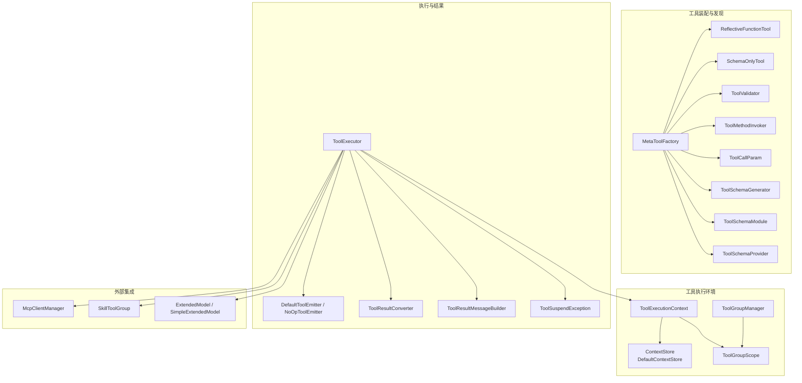
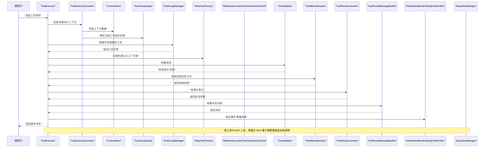
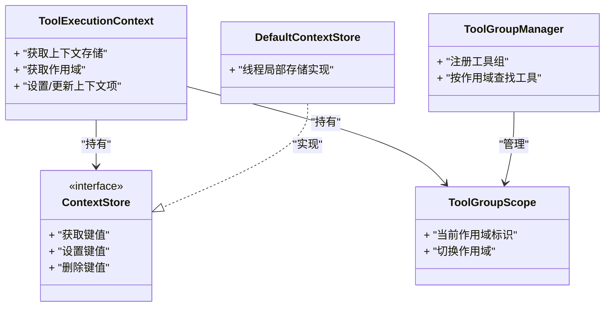
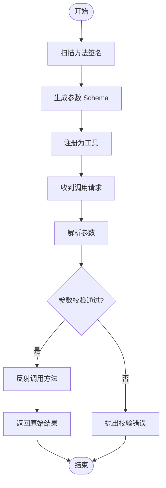
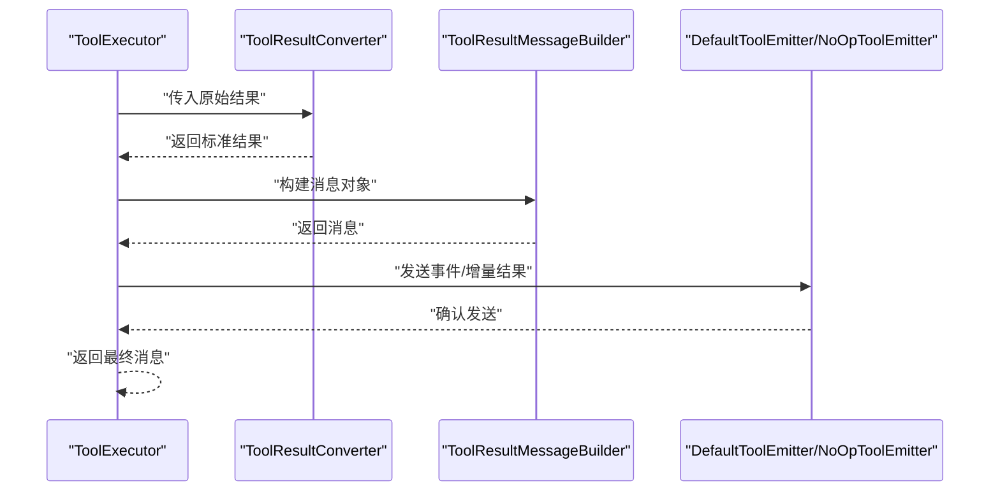
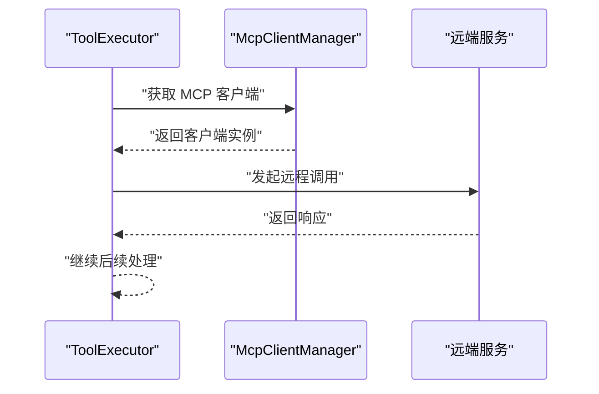
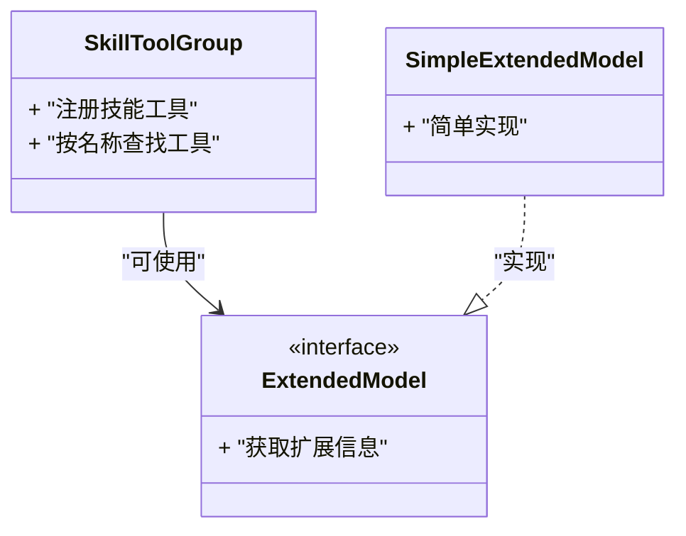
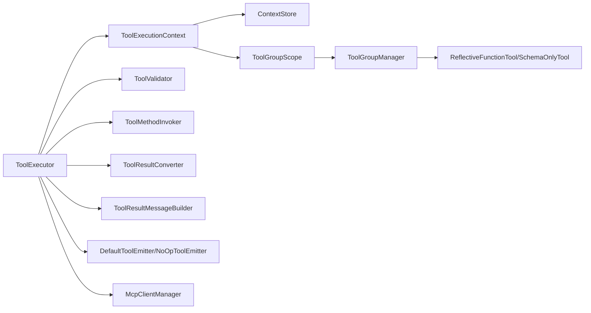

# 环境管理系统

<cite>
**本文引用的文件**   
- [agentscope-core/src/main/java/io/agentscope/core/tool/ToolExecutionContext.java](file://agentscope-core/src/main/java/io/agentscope/core/tool/ToolExecutionContext.java)
- [agentscope-core/src/main/java/io/agentscope/core/tool/ToolExecutor.java](file://agentscope-core/src/main/java/io/agentscope/core/tool/ToolExecutor.java)
- [agentscope-core/src/main/java/io/agentscope/core/tool/DefaultToolEmitter.java](file://agentscope-core/src/main/java/io/agentscope/core/tool/DefaultToolEmitter.java)
- [agentscope-core/src/main/java/io/agentscope/core/tool/NoOpToolEmitter.java](file://agentscope-core/src/main/java/io/agentscope/core/tool/NoOpToolEmitter.java)
- [agentscope-core/src/main/java/io/agentscope/core/tool/ToolResultConverter.java](file://agentscope-core/src/main/java/io/agentscope/core/tool/ToolResultConverter.java)
- [agentscope-core/src/main/java/io/agentscope/core/tool/DefaultContextStore.java](file://agentscope-core/src/main/java/io/agentscope/core/tool/DefaultContextStore.java)
- [agentscope-core/src/main/java/io/agentscope/core/tool/ContextStore.java](file://agentscope-core/src/main/java/io/agentscope/core/tool/ContextStore.java)
- [agentscope-core/src/main/java/io/agentscope/core/tool/MetaToolFactory.java](file://agentscope-core/src/main/java/io/agentscope/core/tool/MetaToolFactory.java)
- [agentscope-core/src/main/java/io/agentscope/core/tool/ReflectiveFunctionTool.java](file://agentscope-core/src/main/java/io/agentscope/core/tool/ReflectiveFunctionTool.java)
- [agentscope-core/src/main/java/io/agentscope/core/tool/SchemaOnlyTool.java](file://agentscope-core/src/main/java/io/agentscope/core/tool/SchemaOnlyTool.java)
- [agentscope-core/src/main/java/io/agentscope/core/tool/ToolGroupManager.java](file://agentscope-core/src/main/java/io/agentscope/core/tool/ToolGroupManager.java)
- [agentscope-core/src/main/java/io/agentscope/core/tool/ToolGroupScope.java](file://agentscope-core/src/main/java/io/agentscope/core/tool/ToolGroupScope.java)
- [agentscope-core/src/main/java/io/agentscope/core/tool/ToolkitConfig.java](file://agentscope-core/src/main/java/io/agentscope/core/tool/ToolkitConfig.java)
- [agentscope-core/src/main/java/io/agentscope/core/tool/ToolValidator.java](file://agentscope-core/src/main/java/io/agentscope/core/tool/ToolValidator.java)
- [agentscope-core/src/main/java/io/agentscope/core/tool/ToolMethodInvoker.java](file://agentscope-core/src/main/java/io/agentscope/core/tool/ToolMethodInvoker.java)
- [agentscope-core/src/main/java/io/agentscope/core/tool/ToolCallParam.java](file://agentscope-core/src/main/java/io/agentscope/core/tool/ToolCallParam.java)
- [agentscope-core/src/main/java/io/agentscope/core/tool/ToolResultMessageBuilder.java](file://agentscope-core/src/main/java/io/agentscope/core/tool/ToolResultMessageBuilder.java)
- [agentscope-core/src/main/java/io/agentscope/core/tool/ToolSchemaGenerator.java](file://agentscope-core/src/main/java/io/agentscope/core/tool/ToolSchemaGenerator.java)
- [agentscope-core/src/main/java/io/agentscope/core/tool/ToolSchemaModule.java](file://agentscope-core/src/main/java/io/agentscope/core/tool/ToolSchemaModule.java)
- [agentscope-core/src/main/java/io/agentscope/core/tool/ToolSchemaProvider.java](file://agentscope-core/src/main/java/io/agentscope/core/tool/ToolSchemaProvider.java)
- [agentscope-core/src/main/java/io/agentscope/core/tool/ToolSuspendException.java](file://agentscope-core/src/main/java/io/agentscope/core/tool/ToolSuspendException.java)
- [agentscope-core/src/main/java/io/agentscope/core/tool/ExtendedModel.java](file://agentscope-core/src/main/java/io/agentscope/core/tool/ExtendedModel.java)
- [agentscope-core/src/main/java/io/agentscope/core/tool/SimpleExtendedModel.java](file://agentscope-core/src/main/java/io/agentscope/core/tool/SimpleExtendedModel.java)
- [agentscope-core/src/main/java/io/agentscope/core/tool/SkillToolGroup.java](file://agentscope-core/src/main/java/io/agentscope/core/tool/SkillToolGroup.java)
- [agentscope-core/src/main/java/io/agentscope/core/tool/McpClientManager.java](file://agentscope-core/src/main/java/io/agentscope/core/tool/McpClientManager.java)
- [agentscope-core/src/main/java/io/agentscope/core/tool/ToolBase.java](file://agentscope-core/src/main/java/io/agentscope/core/tool/ToolBase.java)
- [agentscope-core/src/main/java/io/agentscope/core/tool/AgentTool.java](file://agentscope-core/src/main/java/io/agentscope/core/tool/AgentTool.java)
- [agentscope-core/src/main/java/io/agentscope/core/tool/Tool.java](file://agentscope-core/src/main/java/io/agentscope/core/tool/Tool.java)
- [agentscope-core/src/main/java/io/agentscope/core/tool/ToolGroup.java](file://agentscope-core/src/main/java/io/agentscope/core/tool/ToolGroup.java)
- [agentscope-core/src/main/java/io/agentscope/core/tool/Toolkit.java](file://agentscope-core/src/main/java/io/agentscope/core/tool/Toolkit.java)
- [agentscope-core/src/main/java/io/agentscope/core/tool/RegisteredToolFunction.java](file://agentscope-core/src/main/java/io/agentscope/core/tool/RegisteredToolFunction.java)
- [agentscope-core/src/main/java/io/agentscope/core/tool/ToolGroupManager.java](file://agentscope-core/src/main/java/io/agentscope/core/tool/ToolGroupManager.java)
- [agentscope-core/src/main/java/io/agentscope/core/tool/ToolGroupScope.java](file://agentscope-core/src/main/java/io/agentscope/core/tool/ToolGroupScope.java)
- [agentscope-core/src/main/java/io/agentscope/core/tool/ToolkitConfig.java](file://agentscope-core/src/main/java/io/agentscope/core/tool/ToolkitConfig.java)
- [agentscope-core/src/main/java/io/agentscope/core/tool/ToolValidator.java](file://agentscope-core/src/main/java/io/agentscope/core/tool/ToolValidator.java)
- [agentscope-core/src/main/java/io/agentscope/core/tool/ToolMethodInvoker.java](file://agentscope-core/src/main/java/io/agentscope/core/tool/ToolMethodInvoker.java)
- [agentscope-core/src/main/java/io/agentscope/core/tool/ToolCallParam.java](file://agentscope-core/src/main/java/io/agentscope/core/tool/ToolCallParam.java)
- [agentscope-core/src/main/java/io/agentscope/core/tool/ToolResultMessageBuilder.java](file://agentscope-core/src/main/java/io/agentscope/core/tool/ToolResultMessageBuilder.java)
- [agentscope-core/src/main/java/io/agentscope/core/tool/ToolSchemaGenerator.java](file://agentscope-core/src/main/java/io/agentscope/core/tool/ToolSchemaGenerator.java)
- [agentscope-core/src/main/java/io/agentscope/core/tool/ToolSchemaModule.java](file://agentscope-core/src/main/java/io/agentscope/core/tool/ToolSchemaModule.java)
- [agentscope-core/src/main/java/io/agentscope/core/tool/ToolSchemaProvider.java](file://agentscope-core/src/main/java/io/agentscope/core/tool/ToolSchemaProvider.java)
- [agentscope-core/src/main/java/io/agentscope/core/tool/ToolSuspendException.java](file://agentscope-core/src/main/java/io/agentscope/core/tool/ToolSuspendException.java)
- [agentscope-core/src/main/java/io/agentscope/core/tool/ExtendedModel.java](file://agentscope-core/src/main/java/io/agentscope/core/tool/ExtendedModel.java)
- [agentscope-core/src/main/java/io/agentscope/core/tool/SimpleExtendedModel.java](file://agentscope-core/src/main/java/io/agentscope/core/tool/SimpleExtendedModel.java)
- [agentscope-core/src/main/java/io/agentscope/core/tool/SkillToolGroup.java](file://agentscope-core/src/main/java/io/agentscope/core/tool/SkillToolGroup.java)
- [agentscope-core/src/main/java/io/agentscope/core/tool/McpClientManager.java](file://agentscope-core/src/main/java/io/agentscope/core/tool/McpClientManager.java)
</cite>

## 目录
1. [简介](#简介)
2. [项目结构](#项目结构)
3. [核心组件](#核心组件)
4. [架构总览](#架构总览)
5. [详细组件分析](#详细组件分析)
6. [依赖关系分析](#依赖关系分析)
7. [性能考量](#性能考量)
8. [故障排查指南](#故障排查指南)
9. [结论](#结论)
10. [附录](#附录)

## 简介
本文件聚焦于 AgentScope Java 中的“环境管理”能力，围绕工具执行上下文、工具组与范围、元工具工厂、反射式工具封装、结果转换与消息构建、以及 MCP 客户端管理等关键模块展开。目标是帮助读者理解：
- 工具调用时的运行期环境如何被创建、传递与隔离
- 工具组如何在不同作用域内组织与切换
- 元工具如何统一生成 Schema、参数校验与执行
- 结果如何转换为标准消息并回传给上层
- 外部服务（如 MCP）如何通过管理器接入与复用

## 项目结构
本项目采用多模块 Maven 工程，核心能力位于 agentscope-core 的 tool 包中。与环境管理相关的代码主要分布在以下路径：
- io.agentscope.core.tool.ToolExecutionContext：工具执行上下文载体
- io.agentscope.core.tool.ToolExecutor：工具执行编排器
- io.agentscope.core.tool.MetaToolFactory：元工具工厂，负责将函数/方法包装为可注册工具
- io.agentscope.core.tool.ReflectiveFunctionTool / SchemaOnlyTool：反射式与仅 Schema 的工具实现
- io.agentscope.core.tool.DefaultContextStore / ContextStore：上下文存储接口与默认实现
- io.agentscope.core.tool.ToolGroupManager / ToolGroupScope：工具组管理与作用域控制
- io.agentscope.core.tool.ToolResultConverter / ToolResultMessageBuilder：结果转换与消息构建
- io.agentscope.core.tool.McpClientManager：MCP 客户端生命周期与连接管理
- io.agentscope.core.tool.ToolValidator / ToolMethodInvoker / ToolCallParam：参数校验与方法调用桥接
- io.agentscope.core.tool.ToolSchemaGenerator / ToolSchemaModule / ToolSchemaProvider：Schema 生成与注入
- io.agentscope.core.tool.ToolSuspendException：工具挂起异常类型
- io.agentscope.core.tool.ExtendedModel / SimpleExtendedModel：扩展模型适配
- io.agentscope.core.tool.SkillToolGroup：技能工具组
- io.agentscope.core.tool.ToolBase / AgentTool / Tool / ToolGroup / Toolkit：基础抽象与组合

图表来源
- [agentscope-core/src/main/java/io/agentscope/core/tool/ToolExecutionContext.java](file://agentscope-core/src/main/java/io/agentscope/core/tool/ToolExecutionContext.java)
- [agentscope-core/src/main/java/io/agentscope/core/tool/ToolExecutor.java](file://agentscope-core/src/main/java/io/agentscope/core/tool/ToolExecutor.java)
- [agentscope-core/src/main/java/io/agentscope/core/tool/MetaToolFactory.java](file://agentscope-core/src/main/java/io/agentscope/core/tool/MetaToolFactory.java)
- [agentscope-core/src/main/java/io/agentscope/core/tool/ReflectiveFunctionTool.java](file://agentscope-core/src/main/java/io/agentscope/core/tool/ReflectiveFunctionTool.java)
- [agentscope-core/src/main/java/io/agentscope/core/tool/SchemaOnlyTool.java](file://agentscope-core/src/main/java/io/agentscope/core/tool/SchemaOnlyTool.java)
- [agentscope-core/src/main/java/io/agentscope/core/tool/DefaultContextStore.java](file://agentscope-core/src/main/java/io/agentscope/core/tool/DefaultContextStore.java)
- [agentscope-core/src/main/java/io/agentscope/core/tool/ContextStore.java](file://agentscope-core/src/main/java/io/agentscope/core/tool/ContextStore.java)
- [agentscope-core/src/main/java/io/agentscope/core/tool/ToolGroupManager.java](file://agentscope-core/src/main/java/io/agentscope/core/tool/ToolGroupManager.java)
- [agentscope-core/src/main/java/io/agentscope/core/tool/ToolGroupScope.java](file://agentscope-core/src/main/java/io/agentscope/core/tool/ToolGroupScope.java)
- [agentscope-core/src/main/java/io/agentscope/core/tool/ToolResultConverter.java](file://agentscope-core/src/main/java/io/agentscope/core/tool/ToolResultConverter.java)
- [agentscope-core/src/main/java/io/agentscope/core/tool/ToolResultMessageBuilder.java](file://agentscope-core/src/main/java/io/agentscope/core/tool/ToolResultMessageBuilder.java)
- [agentscope-core/src/main/java/io/agentscope/core/tool/McpClientManager.java](file://agentscope-core/src/main/java/io/agentscope/core/tool/McpClientManager.java)
- [agentscope-core/src/main/java/io/agentscope/core/tool/ToolValidator.java](file://agentscope-core/src/main/java/io/agentscope/core/tool/ToolValidator.java)
- [agentscope-core/src/main/java/io/agentscope/core/tool/ToolMethodInvoker.java](file://agentscope-core/src/main/java/io/agentscope/core/tool/ToolMethodInvoker.java)
- [agentscope-core/src/main/java/io/agentscope/core/tool/ToolCallParam.java](file://agentscope-core/src/main/java/io/agentscope/core/tool/ToolCallParam.java)
- [agentscope-core/src/main/java/io/agentscope/core/tool/ToolSchemaGenerator.java](file://agentscope-core/src/main/java/io/agentscope/core/tool/ToolSchemaGenerator.java)
- [agentscope-core/src/main/java/io/agentscope/core/tool/ToolSchemaModule.java](file://agentscope-core/src/main/java/io/agentscope/core/tool/ToolSchemaModule.java)
- [agentscope-core/src/main/java/io/agentscope/core/tool/ToolSchemaProvider.java](file://agentscope-core/src/main/java/io/agentsscope/core/tool/ToolSchemaProvider.java)
- [agentscope-core/src/main/java/io/agentscope/core/tool/ToolSuspendException.java](file://agentscope-core/src/main/java/io/agentscope/core/tool/ToolSuspendException.java)
- [agentscope-core/src/main/java/io/agentscope/core/tool/ExtendedModel.java](file://agentscope-core/src/main/java/io/agentscope/core/tool/ExtendedModel.java)
- [agentscope-core/src/main/java/io/agentscope/core/tool/SimpleExtendedModel.java](file://agentscope-core/src/main/java/io/agentscope/core/tool/SimpleExtendedModel.java)
- [agentscope-core/src/main/java/io/agentscope/core/tool/SkillToolGroup.java](file://agentscope-core/src/main/java/io/agentscope/core/tool/SkillToolGroup.java)
- [agentscope-core/src/main/java/io/agentscope/core/tool/DefaultToolEmitter.java](file://agentscope-core/src/main/java/io/agentscope/core/tool/DefaultToolEmitter.java)
- [agentscope-core/src/main/java/io/agentscope/core/tool/NoOpToolEmitter.java](file://agentscope-core/src/main/java/io/agentscope/core/tool/NoOpToolEmitter.java)

章节来源
- [agentscope-core/src/main/java/io/agentscope/core/tool/ToolExecutionContext.java](file://agentscope-core/src/main/java/io/agentscope/core/tool/ToolExecutionContext.java)
- [agentscope-core/src/main/java/io/agentscope/core/tool/ToolExecutor.java](file://agentscope-core/src/main/java/io/agentscope/core/tool/ToolExecutor.java)
- [agentscope-core/src/main/java/io/agentscope/core/tool/MetaToolFactory.java](file://agentscope-core/src/main/java/io/agentscope/core/tool/MetaToolFactory.java)
- [agentscope-core/src/main/java/io/agentscope/core/tool/DefaultContextStore.java](file://agentscope-core/src/main/java/io/agentscope/core/tool/DefaultContextStore.java)
- [agentscope-core/src/main/java/io/agentscope/core/tool/ContextStore.java](file://agentscope-core/src/main/java/io/agentscope/core/tool/ContextStore.java)
- [agentscope-core/src/main/java/io/agentscope/core/tool/ToolGroupManager.java](file://agentscope-core/src/main/java/io/agentscope/core/tool/ToolGroupManager.java)
- [agentscope-core/src/main/java/io/agentscope/core/tool/ToolGroupScope.java](file://agentscope-core/src/main/java/io/agentscope/core/tool/ToolGroupScope.java)
- [agentscope-core/src/main/java/io/agentscope/core/tool/ToolResultConverter.java](file://agentscope-core/src/main/java/io/agentscope/core/tool/ToolResultConverter.java)
- [agentscope-core/src/main/java/io/agentscope/core/tool/ToolResultMessageBuilder.java](file://agentscope-core/src/main/java/io/agentscope/core/tool/ToolResultMessageBuilder.java)
- [agentscope-core/src/main/java/io/agentscope/core/tool/McpClientManager.java](file://agentscope-core/src/main/java/io/agentscope/core/tool/McpClientManager.java)
- [agentscope-core/src/main/java/io/agentscope/core/tool/ToolValidator.java](file://agentscope-core/src/main/java/io/agentscope/core/tool/ToolValidator.java)
- [agentscope-core/src/main/java/io/agentscope/core/tool/ToolMethodInvoker.java](file://agentscope-core/src/main/java/io/agentscope/core/tool/ToolMethodInvoker.java)
- [agentscope-core/src/main/java/io/agentscope/core/tool/ToolCallParam.java](file://agentscope-core/src/main/java/io/agentscope/core/tool/ToolCallParam.java)
- [agentscope-core/src/main/java/io/agentscope/core/tool/ToolSchemaGenerator.java](file://agentscope-core/src/main/java/io/agentscope/core/tool/ToolSchemaGenerator.java)
- [agentscope-core/src/main/java/io/agentscope/core/tool/ToolSchemaModule.java](file://agentscope-core/src/main/java/io/agentscope/core/tool/ToolSchemaModule.java)
- [agentscope-core/src/main/java/io/agentscope/core/tool/ToolSchemaProvider.java](file://agentscope-core/src/main/java/io/agentscope/core/tool/ToolSchemaProvider.java)
- [agentscope-core/src/main/java/io/agentscope/core/tool/ToolSuspendException.java](file://agentscope-core/src/main/java/io/agentscope/core/tool/ToolSuspendException.java)
- [agentscope-core/src/main/java/io/agentscope/core/tool/ExtendedModel.java](file://agentscope-core/src/main/java/io/agentscope/core/tool/ExtendedModel.java)
- [agentscope-core/src/main/java/io/agentscope/core/tool/SimpleExtendedModel.java](file://agentscope-core/src/main/java/io/agentscope/core/tool/SimpleExtendedModel.java)
- [agentscope-core/src/main/java/io/agentscope/core/tool/SkillToolGroup.java](file://agentscope-core/src/main/java/io/agentscope/core/tool/SkillToolGroup.java)
- [agentscope-core/src/main/java/io/agentscope/core/tool/DefaultToolEmitter.java](file://agentscope-core/src/main/java/io/agentscope/core/tool/DefaultToolEmitter.java)
- [agentscope-core/src/main/java/io/agentscope/core/tool/NoOpToolEmitter.java](file://agentscope-core/src/main/java/io/agentscope/core/tool/NoOpToolEmitter.java)

## 核心组件
- 工具执行上下文（ToolExecutionContext）
  - 职责：承载一次工具调用的运行时环境，包括当前作用域、上下文存储、事件发射器、结果转换器、消息构建器等。
  - 关键点：提供对上下文存储与作用域的访问；在工具链中贯穿传递。
- 工具执行器（ToolExecutor）
  - 职责：协调工具发现、参数解析、校验、方法调用、结果转换与消息构建；处理工具挂起异常。
  - 关键点：与事件发射器协作，支持流式或批量输出；与 MCP 客户端管理器交互以调用外部工具。
- 元工具工厂（MetaToolFactory）
  - 职责：基于反射将普通函数/方法包装为可注册工具；生成 JSON Schema；注入参数校验与方法调用器。
  - 关键点：结合 ToolSchemaGenerator/Module/Provider 完成 Schema 组装；使用 ToolValidator/ToolMethodInvoker/ToolCallParam 完成参数绑定与调用。
- 上下文存储（ContextStore / DefaultContextStore）
  - 职责：提供键值型上下文存取能力，供工具间共享状态。
  - 关键点：默认实现通常为线程局部或请求级作用域，配合 ToolGroupScope 进行隔离。
- 工具组与作用域（ToolGroupManager / ToolGroupScope）
  - 职责：按作用域组织工具集合，支持动态切换与隔离；管理工具组的注册、查找与生命周期。
  - 关键点：用于在不同业务场景下加载不同的工具集。
- 结果转换与消息构建（ToolResultConverter / ToolResultMessageBuilder）
  - 职责：将工具返回值标准化为内部消息对象，便于后续流程消费。
  - 关键点：支持多种返回类型映射；与事件发射器协同产出中间结果。
- MCP 客户端管理（McpClientManager）
  - 职责：管理 MCP 客户端实例的生命周期、连接池与路由。
  - 关键点：在工具执行时按需获取客户端并发起远程调用。
- 其他支撑组件
  - 反射式工具（ReflectiveFunctionTool）、仅 Schema 工具（SchemaOnlyTool）
  - 工具挂起异常（ToolSuspendException）
  - 扩展模型（ExtendedModel / SimpleExtendedModel）
  - 技能工具组（SkillToolGroup）
  - 事件发射器（DefaultToolEmitter / NoOpToolEmitter）

章节来源
- [agentscope-core/src/main/java/io/agentscope/core/tool/ToolExecutionContext.java](file://agentscope-core/src/main/java/io/agentscope/core/tool/ToolExecutionContext.java)
- [agentscope-core/src/main/java/io/agentscope/core/tool/ToolExecutor.java](file://agentscope-core/src/main/java/io/agentscope/core/tool/ToolExecutor.java)
- [agentscope-core/src/main/java/io/agentscope/core/tool/MetaToolFactory.java](file://agentscope-core/src/main/java/io/agentscope/core/tool/MetaToolFactory.java)
- [agentscope-core/src/main/java/io/agentscope/core/tool/DefaultContextStore.java](file://agentscope-core/src/main/java/io/agentscope/core/tool/DefaultContextStore.java)
- [agentscope-core/src/main/java/io/agentscope/core/tool/ContextStore.java](file://agentscope-core/src/main/java/io/agentscope/core/tool/ContextStore.java)
- [agentscope-core/src/main/java/io/agentscope/core/tool/ToolGroupManager.java](file://agentscope-core/src/main/java/io/agentscope/core/tool/ToolGroupManager.java)
- [agentscope-core/src/main/java/io/agentscope/core/tool/ToolGroupScope.java](file://agentscope-core/src/main/java/io/agentscope/core/tool/ToolGroupScope.java)
- [agentscope-core/src/main/java/io/agentscope/core/tool/ToolResultConverter.java](file://agentscope-core/src/main/java/io/agentscope/core/tool/ToolResultConverter.java)
- [agentscope-core/src/main/java/io/agentscope/core/tool/ToolResultMessageBuilder.java](file://agentscope-core/src/main/java/io/agentscope/core/tool/ToolResultMessageBuilder.java)
- [agentscope-core/src/main/java/io/agentscope/core/tool/McpClientManager.java](file://agentscope-core/src/main/java/io/agentscope/core/tool/McpClientManager.java)
- [agentscope-core/src/main/java/io/agentscope/core/tool/ReflectiveFunctionTool.java](file://agentscope-core/src/main/java/io/agentscope/core/tool/ReflectiveFunctionTool.java)
- [agentscope-core/src/main/java/io/agentscope/core/tool/SchemaOnlyTool.java](file://agentscope-core/src/main/java/io/agentscope/core/tool/SchemaOnlyTool.java)
- [agentscope-core/src/main/java/io/agentscope/core/tool/ToolSuspendException.java](file://agentscope-core/src/main/java/io/agentscope/core/tool/ToolSuspendException.java)
- [agentscope-core/src/main/java/io/agentscope/core/tool/ExtendedModel.java](file://agentscope-core/src/main/java/io/agentscope/core/tool/ExtendedModel.java)
- [agentscope-core/src/main/java/io/agentscope/core/tool/SimpleExtendedModel.java](file://agentscope-core/src/main/java/io/agentscope/core/tool/SimpleExtendedModel.java)
- [agentscope-core/src/main/java/io/agentscope/core/tool/SkillToolGroup.java](file://agentscope-core/src/main/java/io/agentscope/core/tool/SkillToolGroup.java)
- [agentscope-core/src/main/java/io/agentscope/core/tool/DefaultToolEmitter.java](file://agentscope-core/src/main/java/io/agentscope/core/tool/DefaultToolEmitter.java)
- [agentscope-core/src/main/java/io/agentscope/core/tool/NoOpToolEmitter.java](file://agentscope-core/src/main/java/io/agentscope/core/tool/NoOpToolEmitter.java)

## 架构总览
下图展示了工具执行的环境管理主流程：从上下文初始化到工具选择、参数校验、方法调用、结果转换与消息构建，再到事件发射与外部 MCP 调用。

图表来源
- [agentscope-core/src/main/java/io/agentscope/core/tool/ToolExecutor.java](file://agentscope-core/src/main/java/io/agentscope/core/tool/ToolExecutor.java)
- [agentscope-core/src/main/java/io/agentscope/core/tool/ToolExecutionContext.java](file://agentscope-core/src/main/java/io/agentscope/core/tool/ToolExecutionContext.java)
- [agentscope-core/src/main/java/io/agentscope/core/tool/DefaultContextStore.java](file://agentscope-core/src/main/java/io/agentscope/core/tool/DefaultContextStore.java)
- [agentscope-core/src/main/java/io/agentscope/core/tool/ContextStore.java](file://agentscope-core/src/main/java/io/agentscope/core/tool/ContextStore.java)
- [agentscope-core/src/main/java/io/agentscope/core/tool/ToolGroupManager.java](file://agentscope-core/src/main/java/io/agentscope/core/tool/ToolGroupManager.java)
- [agentscope-core/src/main/java/io/agentscope/core/tool/ToolGroupScope.java](file://agentscope-core/src/main/java/io/agentscope/core/tool/ToolGroupScope.java)
- [agentscope-core/src/main/java/io/agentscope/core/tool/MetaToolFactory.java](file://agentscope-core/src/main/java/io/agentscope/core/tool/MetaToolFactory.java)
- [agentscope-core/src/main/java/io/agentscope/core/tool/ReflectiveFunctionTool.java](file://agentscope-core/src/main/java/io/agentscope/core/tool/ReflectiveFunctionTool.java)
- [agentscope-core/src/main/java/io/agentscope/core/tool/SchemaOnlyTool.java](file://agentscope-core/src/main/java/io/agentscope/core/tool/SchemaOnlyTool.java)
- [agentscope-core/src/main/java/io/agentscope/core/tool/ToolValidator.java](file://agentscope-core/src/main/java/io/agentscope/core/tool/ToolValidator.java)
- [agentscope-core/src/main/java/io/agentscope/core/tool/ToolMethodInvoker.java](file://agentscope-core/src/main/java/io/agentscope/core/tool/ToolMethodInvoker.java)
- [agentscope-core/src/main/java/io/agentscope/core/tool/ToolResultConverter.java](file://agentscope-core/src/main/java/io/agentscope/core/tool/ToolResultConverter.java)
- [agentscope-core/src/main/java/io/agentscope/core/tool/ToolResultMessageBuilder.java](file://agentscope-core/src/main/java/io/agentscope/core/tool/ToolResultMessageBuilder.java)
- [agentscope-core/src/main/java/io/agentscope/core/tool/DefaultToolEmitter.java](file://agentscope-core/src/main/java/io/agentscope/core/tool/DefaultToolEmitter.java)
- [agentscope-core/src/main/java/io/agentscope/core/tool/NoOpToolEmitter.java](file://agentscope-core/src/main/java/io/agentscope/core/tool/NoOpToolEmitter.java)
- [agentscope-core/src/main/java/io/agentscope/core/tool/McpClientManager.java](file://agentscope-core/src/main/java/io/agentscope/core/tool/McpClientManager.java)

## 详细组件分析

### 工具执行上下文与作用域
- 设计要点
  - 上下文作为单一事实源，贯穿整个工具调用链路，避免隐式全局状态。
  - 作用域由 ToolGroupScope 定义，结合 ToolGroupManager 实现工具集的动态切换与隔离。
  - 上下文存储 ContextStore 提供键值存取，默认实现适合线程/请求级隔离。
- 典型用法
  - 在入口处创建上下文并设置作用域
  - 在工具中通过上下文读取共享状态
  - 在退出时清理上下文资源

图表来源
- [agentscope-core/src/main/java/io/agentscope/core/tool/ToolExecutionContext.java](file://agentscope-core/src/main/java/io/agentscope/core/tool/ToolExecutionContext.java)
- [agentscope-core/src/main/java/io/agentscope/core/tool/ContextStore.java](file://agentscope-core/src/main/java/io/agentscope/core/tool/ContextStore.java)
- [agentscope-core/src/main/java/io/agentscope/core/tool/DefaultContextStore.java](file://agentscope-core/src/main/java/io/agentscope/core/tool/DefaultContextStore.java)
- [agentscope-core/src/main/java/io/agentscope/core/tool/ToolGroupScope.java](file://agentscope-core/src/main/java/io/agentscope/core/tool/ToolGroupScope.java)
- [agentscope-core/src/main/java/io/agentscope/core/tool/ToolGroupManager.java](file://agentscope-core/src/main/java/io/agentscope/core/tool/ToolGroupManager.java)

章节来源
- [agentscope-core/src/main/java/io/agentscope/core/tool/ToolExecutionContext.java](file://agentscope-core/src/main/java/io/agentscope/core/tool/ToolExecutionContext.java)
- [agentscope-core/src/main/java/io/agentscope/core/tool/ContextStore.java](file://agentscope-core/src/main/java/io/agentscope/core/tool/ContextStore.java)
- [agentscope-core/src/main/java/io/agentscope/core/tool/DefaultContextStore.java](file://agentscope-core/src/main/java/io/agentscope/core/tool/DefaultContextStore.java)
- [agentscope-core/src/main/java/io/agentscope/core/tool/ToolGroupScope.java](file://agentscope-core/src/main/java/io/agentscope/core/tool/ToolGroupScope.java)
- [agentscope-core/src/main/java/io/agentscope/core/tool/ToolGroupManager.java](file://agentscope-core/src/main/java/io/agentscope/core/tool/ToolGroupManager.java)

### 元工具工厂与反射式工具
- 设计要点
  - MetaToolFactory 将任意函数/方法包装为工具，自动推导参数类型与 Schema。
  - ReflectiveFunctionTool 基于反射执行目标方法；SchemaOnlyTool 仅提供 Schema 描述，不执行逻辑。
  - ToolSchemaGenerator/Module/Provider 共同完成 Schema 的生成与注入。
- 关键流程
  - 扫描方法签名 -> 生成参数 Schema -> 注册为工具 -> 调用时解析参数并校验 -> 反射执行 -> 返回结果

图表来源
- [agentscope-core/src/main/java/io/agentscope/core/tool/MetaToolFactory.java](file://agentscope-core/src/main/java/io/agentscope/core/tool/MetaToolFactory.java)
- [agentscope-core/src/main/java/io/agentscope/core/tool/ReflectiveFunctionTool.java](file://agentscope-core/src/main/java/io/agentscope/core/tool/ReflectiveFunctionTool.java)
- [agentscope-core/src/main/java/io/agentscope/core/tool/SchemaOnlyTool.java](file://agentscope-core/src/main/java/io/agentscope/core/tool/SchemaOnlyTool.java)
- [agentscope-core/src/main/java/io/agentscope/core/tool/ToolSchemaGenerator.java](file://agentscope-core/src/main/java/io/agentscope/core/tool/ToolSchemaGenerator.java)
- [agentscope-core/src/main/java/io/agentscope/core/tool/ToolSchemaModule.java](file://agentscope-core/src/main/java/io/agentscope/core/tool/ToolSchemaModule.java)
- [agentscope-core/src/main/java/io/agentscope/core/tool/ToolSchemaProvider.java](file://agentscope-core/src/main/java/io/agentscope/core/tool/ToolSchemaProvider.java)
- [agentscope-core/src/main/java/io/agentscope/core/tool/ToolValidator.java](file://agentscope-core/src/main/java/io/agentscope/core/tool/ToolValidator.java)
- [agentscope-core/src/main/java/io/agentscope/core/tool/ToolMethodInvoker.java](file://agentscope-core/src/main/java/io/agentscope/core/tool/ToolMethodInvoker.java)
- [agentscope-core/src/main/java/io/agentscope/core/tool/ToolCallParam.java](file://agentscope-core/src/main/java/io/agentscope/core/tool/ToolCallParam.java)

章节来源
- [agentscope-core/src/main/java/io/agentscope/core/tool/MetaToolFactory.java](file://agentscope-core/src/main/java/io/agentscope/core/tool/MetaToolFactory.java)
- [agentscope-core/src/main/java/io/agentscope/core/tool/ReflectiveFunctionTool.java](file://agentscope-core/src/main/java/io/agentscope/core/tool/ReflectiveFunctionTool.java)
- [agentscope-core/src/main/java/io/agentscope/core/tool/SchemaOnlyTool.java](file://agentscope-core/src/main/java/io/agentscope/core/tool/SchemaOnlyTool.java)
- [agentscope-core/src/main/java/io/agentscope/core/tool/ToolSchemaGenerator.java](file://agentscope-core/src/main/java/io/agentscope/core/tool/ToolSchemaGenerator.java)
- [agentscope-core/src/main/java/io/agentscope/core/tool/ToolSchemaModule.java](file://agentscope-core/src/main/java/io/agentscope/core/tool/ToolSchemaModule.java)
- [agentscope-core/src/main/java/io/agentscope/core/tool/ToolSchemaProvider.java](file://agentscope-core/src/main/java/io/agentscope/core/tool/ToolSchemaProvider.java)
- [agentscope-core/src/main/java/io/agentscope/core/tool/ToolValidator.java](file://agentscope-core/src/main/java/io/agentscope/core/tool/ToolValidator.java)
- [agentscope-core/src/main/java/io/agentscope/core/tool/ToolMethodInvoker.java](file://agentscope-core/src/main/java/io/agentscope/core/tool/ToolMethodInvoker.java)
- [agentscope-core/src/main/java/io/agentscope/core/tool/ToolCallParam.java](file://agentscope-core/src/main/java/io/agentscope/core/tool/ToolCallParam.java)

### 结果转换与消息构建
- 设计要点
  - ToolResultConverter 将工具返回的原始结果标准化为内部数据结构。
  - ToolResultMessageBuilder 将标准结果构建为消息对象，便于上层消费与展示。
  - 事件发射器（DefaultToolEmitter/NoOpToolEmitter）支持流式增量输出或静默模式。
- 典型流程
  - 接收原始结果 -> 类型推断与转换 -> 构建消息 -> 可选地发送事件 -> 返回消息

图表来源
- [agentscope-core/src/main/java/io/agentscope/core/tool/ToolResultConverter.java](file://agentscope-core/src/main/java/io/agentscope/core/tool/ToolResultConverter.java)
- [agentscope-core/src/main/java/io/agentscope/core/tool/ToolResultMessageBuilder.java](file://agentscope-core/src/main/java/io/agentscope/core/tool/ToolResultMessageBuilder.java)
- [agentscope-core/src/main/java/io/agentscope/core/tool/DefaultToolEmitter.java](file://agentscope-core/src/main/java/io/agentscope/core/tool/DefaultToolEmitter.java)
- [agentscope-core/src/main/java/io/agentscope/core/tool/NoOpToolEmitter.java](file://agentscope-core/src/main/java/io/agentscope/core/tool/NoOpToolEmitter.java)

章节来源
- [agentscope-core/src/main/java/io/agentscope/core/tool/ToolResultConverter.java](file://agentscope-core/src/main/java/io/agentscope/core/tool/ToolResultConverter.java)
- [agentscope-core/src/main/java/io/agentscope/core/tool/ToolResultMessageBuilder.java](file://agentscope-core/src/main/java/io/agentscope/core/tool/ToolResultMessageBuilder.java)
- [agentscope-core/src/main/java/io/agentscope/core/tool/DefaultToolEmitter.java](file://agentscope-core/src/main/java/io/agentscope/core/tool/DefaultToolEmitter.java)
- [agentscope-core/src/main/java/io/agentscope/core/tool/NoOpToolEmitter.java](file://agentscope-core/src/main/java/io/agentscope/core/tool/NoOpToolEmitter.java)

### MCP 客户端管理
- 设计要点
  - McpClientManager 负责 MCP 客户端的创建、复用与销毁。
  - 工具执行时根据工具类型选择是否通过 MCP 客户端发起远程调用。
- 典型流程
  - 初始化客户端 -> 缓存连接 -> 工具调用时获取客户端 -> 发起远程调用 -> 返回结果

图表来源
- [agentscope-core/src/main/java/io/agentscope/core/tool/McpClientManager.java](file://agentscope-core/src/main/java/io/agentscope/core/tool/McpClientManager.java)
- [agentscope-core/src/main/java/io/agentscope/core/tool/ToolExecutor.java](file://agentscope-core/src/main/java/io/agentscope/core/tool/ToolExecutor.java)

章节来源
- [agentscope-core/src/main/java/io/agentscope/core/tool/McpClientManager.java](file://agentscope-core/src/main/java/io/agentscope/core/tool/McpClientManager.java)
- [agentscope-core/src/main/java/io/agentscope/core/tool/ToolExecutor.java](file://agentscope-core/src/main/java/io/agentscope/core/tool/ToolExecutor.java)

### 技能工具组与扩展模型
- 设计要点
  - SkillToolGroup 将一组技能相关工具聚合为独立单元，便于按场景启用。
  - ExtendedModel/SimpleExtendedModel 提供扩展模型能力，使工具能访问更丰富的上下文或配置。
- 典型用法
  - 在特定业务场景中启用技能工具组
  - 通过扩展模型注入额外能力（如权限、审计、追踪等）

图表来源
- [agentscope-core/src/main/java/io/agentscope/core/tool/SkillToolGroup.java](file://agentscope-core/src/main/java/io/agentscope/core/tool/SkillToolGroup.java)
- [agentscope-core/src/main/java/io/agentscope/core/tool/ExtendedModel.java](file://agentscope-core/src/main/java/io/agentscope/core/tool/ExtendedModel.java)
- [agentscope-core/src/main/java/io/agentscope/core/tool/SimpleExtendedModel.java](file://agentscope-core/src/main/java/io/agentscope/core/tool/SimpleExtendedModel.java)

章节来源
- [agentscope-core/src/main/java/io/agentscope/core/tool/SkillToolGroup.java](file://agentscope-core/src/main/java/io/agentscope/core/tool/SkillToolGroup.java)
- [agentscope-core/src/main/java/io/agentscope/core/tool/ExtendedModel.java](file://agentscope-core/src/main/java/io/agentscope/core/tool/ExtendedModel.java)
- [agentscope-core/src/main/java/io/agentscope/core/tool/SimpleExtendedModel.java](file://agentscope-core/src/main/java/io/agentscope/core/tool/SimpleExtendedModel.java)

## 依赖关系分析
- 耦合与内聚
  - ToolExecutor 与多个子组件存在强耦合（上下文、校验、调用、转换、消息构建、事件发射、MCP），但通过清晰的接口边界保持高内聚。
  - MetaToolFactory 与 Schema 相关组件形成稳定的装配层，降低工具定义与执行的耦合。
- 直接/间接依赖
  - 工具执行链路：Executor -> Context -> Store/Scope -> GroupManager -> Tool -> Validator/Invoker -> Converter -> Builder -> Emitter
  - MCP 集成：Executor -> McpClientManager -> 远端服务
- 潜在循环依赖
  - 当前分层清晰，未见明显循环依赖；建议继续保持单向依赖原则。
- 外部依赖与集成点
  - MCP 客户端管理作为外部服务集成点，需关注连接池与超时策略。
  - 事件发射器支持替换实现，便于与观测系统对接。

图表来源
- [agentscope-core/src/main/java/io/agentscope/core/tool/ToolExecutor.java](file://agentscope-core/src/main/java/io/agentscope/core/tool/ToolExecutor.java)
- [agentscope-core/src/main/java/io/agentscope/core/tool/ToolExecutionContext.java](file://agentscope-core/src/main/java/io/agentscope/core/tool/ToolExecutionContext.java)
- [agentscope-core/src/main/java/io/agentscope/core/tool/ContextStore.java](file://agentscope-core/src/main/java/io/agentscope/core/tool/ContextStore.java)
- [agentscope-core/src/main/java/io/agentscope/core/tool/ToolGroupScope.java](file://agentscope-core/src/main/java/io/agentscope/core/tool/ToolGroupScope.java)
- [agentscope-core/src/main/java/io/agentscope/core/tool/ToolGroupManager.java](file://agentscope-core/src/main/java/io/agentscope/core/tool/ToolGroupManager.java)
- [agentscope-core/src/main/java/io/agentscope/core/tool/ReflectiveFunctionTool.java](file://agentscope-core/src/main/java/io/agentscope/core/tool/ReflectiveFunctionTool.java)
- [agentscope-core/src/main/java/io/agentscope/core/tool/SchemaOnlyTool.java](file://agentscope-core/src/main/java/io/agentscope/core/tool/SchemaOnlyTool.java)
- [agentscope-core/src/main/java/io/agentscope/core/tool/ToolValidator.java](file://agentscope-core/src/main/java/io/agentscope/core/tool/ToolValidator.java)
- [agentscope-core/src/main/java/io/agentscope/core/tool/ToolMethodInvoker.java](file://agentscope-core/src/main/java/io/agentscope/core/tool/ToolMethodInvoker.java)
- [agentscope-core/src/main/java/io/agentscope/core/tool/ToolResultConverter.java](file://agentscope-core/src/main/java/io/agentscope/core/tool/ToolResultConverter.java)
- [agentscope-core/src/main/java/io/agentscope/core/tool/ToolResultMessageBuilder.java](file://agentscope-core/src/main/java/io/agentscope/core/tool/ToolResultMessageBuilder.java)
- [agentscope-core/src/main/java/io/agentscope/core/tool/DefaultToolEmitter.java](file://agentscope-core/src/main/java/io/agentscope/core/tool/DefaultToolEmitter.java)
- [agentscope-core/src/main/java/io/agentscope/core/tool/NoOpToolEmitter.java](file://agentscope-core/src/main/java/io/agentscope/core/tool/NoOpToolEmitter.java)
- [agentscope-core/src/main/java/io/agentscope/core/tool/McpClientManager.java](file://agentscope-core/src/main/java/io/agentscope/core/tool/McpClientManager.java)

章节来源
- [agentscope-core/src/main/java/io/agentscope/core/tool/ToolExecutor.java](file://agentscope-core/src/main/java/io/agentscope/core/tool/ToolExecutor.java)
- [agentscope-core/src/main/java/io/agentscope/core/tool/ToolExecutionContext.java](file://agentscope-core/src/main/java/io/agentscope/core/tool/ToolExecutionContext.java)
- [agentscope-core/src/main/java/io/agentscope/core/tool/ContextStore.java](file://agentscope-core/src/main/java/io/agentscope/core/tool/ContextStore.java)
- [agentscope-core/src/main/java/io/agentscope/core/tool/ToolGroupScope.java](file://agentscope-core/src/main/java/io/agentscope/core/tool/ToolGroupScope.java)
- [agentscope-core/src/main/java/io/agentscope/core/tool/ToolGroupManager.java](file://agentscope-core/src/main/java/io/agentscope/core/tool/ToolGroupManager.java)
- [agentscope-core/src/main/java/io/agentscope/core/tool/ReflectiveFunctionTool.java](file://agentscope-core/src/main/java/io/agentscope/core/tool/ReflectiveFunctionTool.java)
- [agentscope-core/src/main/java/io/agentscope/core/tool/SchemaOnlyTool.java](file://agentscope-core/src/main/java/io/agentscope/core/tool/SchemaOnlyTool.java)
- [agentscope-core/src/main/java/io/agentscope/core/tool/ToolValidator.java](file://agentscope-core/src/main/java/io/agentscope/core/tool/ToolValidator.java)
- [agentscope-core/src/main/java/io/agentscope/core/tool/ToolMethodInvoker.java](file://agentscope-core/src/main/java/io/agentscope/core/tool/ToolMethodInvoker.java)
- [agentscope-core/src/main/java/io/agentscope/core/tool/ToolResultConverter.java](file://agentscope-core/src/main/java/io/agentscope/core/tool/ToolResultConverter.java)
- [agentscope-core/src/main/java/io/agentscope/core/tool/ToolResultMessageBuilder.java](file://agentscope-core/src/main/java/io/agentscope/core/tool/ToolResultMessageBuilder.java)
- [agentscope-core/src/main/java/io/agentscope/core/tool/DefaultToolEmitter.java](file://agentscope-core/src/main/java/io/agentscope/core/tool/DefaultToolEmitter.java)
- [agentscope-core/src/main/java/io/agentscope/core/tool/NoOpToolEmitter.java](file://agentscope-core/src/main/java/io/agentscope/core/tool/NoOpToolEmitter.java)
- [agentscope-core/src/main/java/io/agentscope/core/tool/McpClientManager.java](file://agentscope-core/src/main/java/io/agentscope/core/tool/McpClientManager.java)

## 性能考量
- 减少不必要的反射开销
  - 对高频工具可采用缓存的方法句柄或预编译调用器。
- 上下文存储优化
  - 默认实现应保证 O(1) 读写；避免在热点路径中进行复杂序列化。
- 事件发射器选择
  - 生产环境建议使用异步事件队列，避免阻塞主流程。
- MCP 客户端复用
  - 合理配置连接池大小与超时，避免频繁建立/断开连接。
- 结果转换与消息构建
  - 对大对象进行分块传输与增量构建，降低内存峰值。

[本节为通用指导，无需列出具体文件来源]

## 故障排查指南
- 工具参数校验失败
  - 检查 ToolValidator 的规则与输入是否符合 Schema。
  - 参考：[ToolValidator](file://agentscope-core/src/main/java/io/agentscope/core/tool/ToolValidator.java)
- 方法调用异常
  - 检查 ToolMethodInvoker 的参数绑定是否正确，目标方法是否存在且可见。
  - 参考：[ToolMethodInvoker](file://agentscope-core/src/main/java/io/agentscope/core/tool/ToolMethodInvoker.java)
- 工具挂起
  - 捕获 ToolSuspendException 并进行重试或降级处理。
  - 参考：[ToolSuspendException](file://agentscope-core/src/main/java/io/agentscope/core/tool/ToolSuspendException.java)
- MCP 连接问题
  - 检查 McpClientManager 的连接状态与超时配置。
  - 参考：[McpClientManager](file://agentscope-core/src/main/java/io/agentscope/core/tool/McpClientManager.java)
- 上下文丢失
  - 确认 ToolExecutionContext 是否正确传递，ContextStore 的作用域是否一致。
  - 参考：[ToolExecutionContext](file://agentscope-core/src/main/java/io/agentscope/core/tool/ToolExecutionContext.java)、[DefaultContextStore](file://agentscope-core/src/main/java/io/agentscope/core/tool/DefaultContextStore.java)

章节来源
- [agentscope-core/src/main/java/io/agentscope/core/tool/ToolValidator.java](file://agentscope-core/src/main/java/io/agentscope/core/tool/ToolValidator.java)
- [agentscope-core/src/main/java/io/agentscope/core/tool/ToolMethodInvoker.java](file://agentscope-core/src/main/java/io/agentscope/core/tool/ToolMethodInvoker.java)
- [agentscope-core/src/main/java/io/agentscope/core/tool/ToolSuspendException.java](file://agentscope-core/src/main/java/io/agentscope/core/tool/ToolSuspendException.java)
- [agentscope-core/src/main/java/io/agentscope/core/tool/McpClientManager.java](file://agentscope-core/src/main/java/io/agentscope/core/tool/McpClientManager.java)
- [agentscope-core/src/main/java/io/agentscope/core/tool/ToolExecutionContext.java](file://agentscope-core/src/main/java/io/agentscope/core/tool/ToolExecutionContext.java)
- [agentscope-core/src/main/java/io/agentscope/core/tool/DefaultContextStore.java](file://agentscope-core/src/main/java/io/agentscope/core/tool/DefaultContextStore.java)

## 结论
AgentScope Java 的环境管理能力围绕工具执行上下文、工具组与作用域、元工具装配、结果转换与消息构建、以及 MCP 集成展开。通过清晰的层次与接口设计，系统在可扩展性与可维护性之间取得良好平衡。建议在高性能场景下关注反射与事件处理的优化，并在生产环境中完善 MCP 连接与容错策略。

[本节为总结性内容，无需列出具体文件来源]

## 附录
- 术语表
  - 工具：可被调用的功能单元，支持参数校验与结果标准化。
  - 上下文：工具执行期的运行环境，包含作用域、存储与事件通道。
  - 作用域：工具组的逻辑分组，支持动态切换与隔离。
  - MCP：外部服务通信协议，通过客户端管理器进行集成。

[本节为概念性内容，无需列出具体文件来源]