# 示例与教程

<cite>
**本文引用的文件**
- [README.md](file://README.md)
- [agentscope-examples/README.md](file://agentscope-examples/README.md)
- [agentscope-examples/documentation/pom.xml](file://agentscope-examples/documentation/pom.xml)
- [agentscope-examples/documentation/src/main/java/io/agentscope/examples/documentation2/quickstart/BasicChatExample.java](file://agentscope-examples/documentation/src/main/java/io/agentscope/examples/documentation2/quickstart/BasicChatExample.java)
- [agentscope-examples/documentation/src/main/java/io/agentscope/examples/documentation2/tool/ToolCallingExample.java](file://agentscope-examples/documentation/src/main/java/io/agentscope/examples/documentation2/tool/ToolCallingExample.java)
- [agentscope-examples/documentation/src/main/java/io/agentscope/examples/documentation2/multimodal/MultiModalToolExample.java](file://agentscope-examples/documentation/src/main/java/io/agentscope/examples/documentation2/multimodal/MultiModalToolExample.java)
- [agentscope-examples/documentation/src/main/java/io/agentscope/examples/documentation2/streaming/StreamingConsoleExample.java](file://agentscope-examples/documentation/src/main/java/io/agentscope/examples/documentation2/streaming/StreamingConsoleExample.java)
- [agentscope-examples/documentation/src/main/java/io/agentscope/examples/documentation2/skill/AgentSkillExample.java](file://agentscope-examples/documentation/src/main/java/io/agentscope/examples/documentation2/skill/AgentSkillExample.java)
- [agentscope-examples/documentation/src/main/java/io/agentscope/examples/documentation2/context/RuntimeContextExample.java](file://agentscope-examples/documentation/src/main/java/io/agentscope/examples/documentation2/context/RuntimeContextExample.java)
- [agentscope-examples/documentation/src/main/java/io/agentscope/examples/documentation2/state/StateExample.java](file://agentscope-examples/documentation/src/main/java/io/agentscope/examples/documentation2/state/StateExample.java)
- [agentscope-examples/documentation/src/main/java/io/agentscope/examples/documentation2/middleware/CustomizedMiddlewareExample.java](file://agentscope-examples/documentation/src/main/java/io/agentscope/examples/documentation2/middleware/CustomizedMiddlewareExample.java)
- [agentscope-examples/documentation/src/main/java/io/agentscope/examples/documentation2/hitl/PermissionHITLExample.java](file://agentscope-examples/documentation/src/main/java/io/agentscope/examples/documentation2/hitl/PermissionHITLExample.java)
- [agentscope-examples/documentation/src/main/java/io/agentscope/examples/documentation2/model/ModelRegistryExample.java](file://agentscope-examples/documentation/src/main/java/io/agentscope/examples/documentation2/model/ModelRegistryExample.java)
- [agentscope-examples/documentation/src/main/java/io/agentscope/examples/documentation2/mcp/McpStdioExample.java](file://agentscope-examples/documentation/src/main/java/io/agentscope/examples/documentation2/mcp/McpStdioExample.java)
- [agentscope-examples/documentation/src/main/java/io/agentscope/examples/documentation2/harness/channel/GatewayMultiAgentExample.java](file://agentscope-examples/documentation/src/main/java/io/agentscope/examples/documentation2/harness/channel/GatewayMultiAgentExample.java)
- [agentscope-examples/documentation/src/main/java/io/agentscope/examples/documentation2/harness/workspace/WorkspaceSandboxExample.java](file://agentscope-examples/documentation/src/main/java/io/agentscope/examples/documentation2/harness/workspace/WorkspaceSandboxExample.java)
- [agentscope-examples/documentation/src/main/java/io/agentscope/examples/documentation2/harness/subagent/SubagentStreamingExample.java](file://agentscope-examples/documentation/src/main/java/io/agentscope/examples/documentation2/harness/subagent/SubagentStreamingExample.java)
- [agentscope-examples/documentation/src/main/java/io/agentscope/examples/documentation2/harness/async/AsyncToolExample.java](file://agentscope-examples/documentation/src/main/java/io/agentscope/examples/documentation2/harness/async/AsyncToolExample.java)
- [agentscope-examples/documentation/src/main/java/io/agentscope/examples/documentation2/harness/async/AsyncSubagentExample.java](file://agentscope-examples/documentation/src/main/java/io/agentscope/examples/documentation2/harness/async/AsyncSubagentExample.java)
- [agentscope-examples/documentation/src/main/java/io/agentscope/examples/documentation2/harness/async/AsyncWaitModeExample.java](file://agentscope-examples/documentation/src/main/java/io/agentscope/examples/documentation2/harness/async/AsyncWaitModeExample.java)
- [agentscope-examples/documentation/src/main/java/io/agentscope/examples/documentation2/structuredoutput/StructuredOutputExample.java](file://agentscope-examples/documentation/src/main/java/io/agentscope/examples/documentation2/structuredoutput/StructuredOutputExample.java)
- [agentscope-examples/documentation/src/main/java/io/agentscope/examples/documentation2/structuredoutput/StructuredOutputFallbackExample.java](file://agentscope-examples/documentation/src/main/java/io/agentscope/examples/documentation2/structuredoutput/StructuredOutputFallbackExample.java)
- [agentscope-examples/agents/agentscope-codingagent/README.md](file://agentscope-examples/agents/agentscope-codingagent/README.md)
- [agentscope-examples/agents/agentscope-codingagent/ENV_VARS.md](file://agentscope-examples/agents/agentscope-codingagent/ENV_VARS.md)
- [agentscope-examples/agents/agentscope-dataagent/README.md](file://agentscope-examples/agents/agentscope-dataagent/README.md)
- [agentscope-examples/agents/agentscope-dataagent/docs/agent-definition.md](file://agentscope-examples/agents/agentscope-dataagent/docs/agent-definition.md)
- [agentscope-examples/agents/agentscope-dataagent/docs/cluster-deploy.md](file://agentscope-examples/agents/agentscope-dataagent/docs/cluster-deploy.md)
- [agentscope-examples/agents/agentscope-paw/README.md](file://agentscope-examples/agents/agentscope-paw/README.md)
- [agentscope-examples/agents/agentscope-builder/README.md](file://agentscope-examples/agents/agentscope-builder/README.md)
- [agentscope-examples/agents/agentscope-builder/builder.md](file://agentscope-examples/agents/agentscope-builder/builder.md)
- [agentscope-examples/agents/agentscope-builder/frontend/index.html](file://agentscope-examples/agents/agentscope-builder/frontend/index.html)
- [agentscope-examples/agents/agentscope-builder/src/main/resources/prompts/agent-draft.md](file://agentscope-examples/agents/agentscope-builder/src/main/resources/prompts/agent-draft.md)
- [agentscope-examples/agents/agentscope-builder/src/main/resources/scaffold/default/skills/example-skill/SKILL.md](file://agentscope-examples/agents/agentscope-builder/src/main/resources/scaffold/default/skills/example-skill/SKILL.md)
- [agentscope-examples/agents/agentscope-builder/src/main/resources/scaffold/default/subagents/README.md](file://agentscope-examples/agents/agentscope-builder/src/main/resources/scaffold/default/subagents/README.md)
- [agentscope-core/src/test/resources/test-skills/calculation-skill/SKILL.md](file://agentscope-core/src/test/resources/test-skills/calculation-skill/SKILL.md)
- [agentscope-core/src/test/resources/test-skills/writing-skill/SKILL.md](file://agentscope-core/src/test/resources/test-skills/writing-skill/SKILL.md)
- [agentscope-core/src/test/resources/test-skills/writing-skill/references/guide.md](file://agentscope-core/src/test/resources/test-skills/writing-skill/references/guide.md)
</cite>

## 更新摘要
**所做更改**
- 新增异步工具执行示例章节，涵盖异步工具调用、等待模式和子代理异步执行
- 新增结构化输出示例章节，演示结构化输出提醒和回退机制
- 更新子代理管理相关示例，增强子代理事件总线和运行注册表功能
- 扩展示例与教程的整体架构，反映新增的异步和结构化输出能力

## 目录
1. [简介](#简介)
2. [项目结构](#项目结构)
3. [核心组件](#核心组件)
4. [架构总览](#架构总览)
5. [详细组件分析](#详细组件分析)
6. [依赖关系分析](#依赖关系分析)
7. [性能考虑](#性能考虑)
8. [故障排除指南](#故障排除指南)
9. [结论](#结论)
10. [附录](#附录)

## 简介
本教程面向希望系统掌握 AgentScope 的开发者与工程师，提供从入门到进阶的完整学习路径与实践案例。内容覆盖：
- 基础示例：简单聊天、工具调用、多模态输入输出
- 进阶示例：流式输出、权限与人工干预、中间件与上下文管理、子代理与工作空间
- 高级应用：AI 编码助手、数据分析代理、个人助理（PAW）、智能体构建器
- 新增功能：异步工具执行、结构化输出、子代理管理
- 最佳实践：性能优化、安全与权限、可维护性与可观测性
- 生产部署：模型注册、通道集成、沙箱与工作空间、集群部署要点

## 项目结构
AgentScope 示例与教程主要集中在 agentscope-examples 模块中，按功能域拆分为多个子示例工程与文档化示例集。核心结构如下：
- agentscope-examples/documentation：官方示例集合，涵盖快速开始、工具、多模态、流式、技能、状态、中间件、上下文、模型、MCP、HARNESS 通道与工作空间等主题
- agentscope-examples/agents：高级应用示例，包括 AI 编码助手、数据分析代理、个人助理（PAW）、智能体构建器
- agentscope-examples/README.md：示例模块总体说明与运行指引

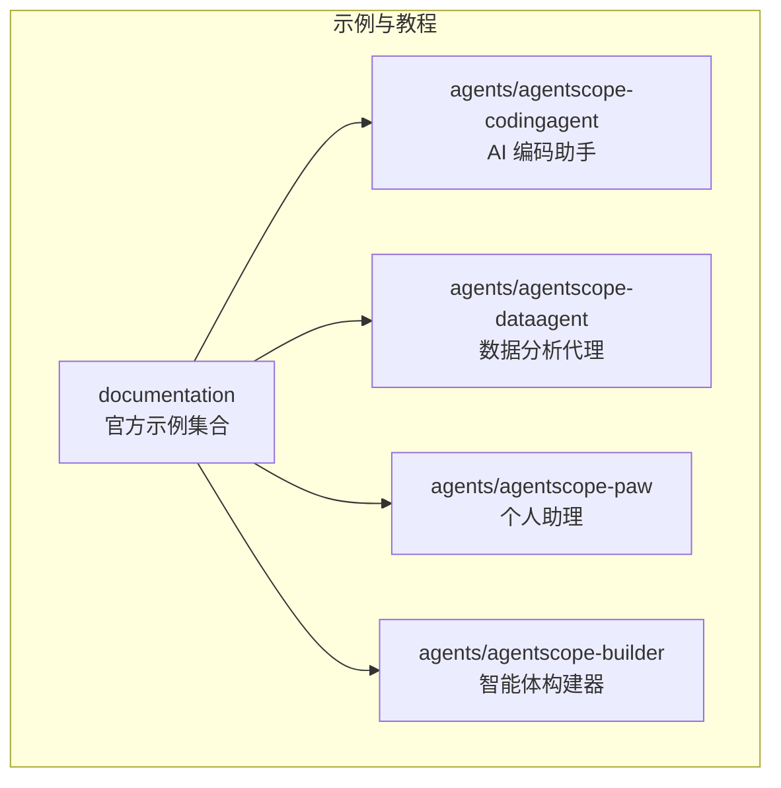

**章节来源**
- [agentscope-examples/README.md:1-200](file://agentscope-examples/README.md#L1-L200)
- [agentscope-examples/documentation/pom.xml:1-200](file://agentscope-examples/documentation/pom.xml#L1-L200)

## 核心组件
- 快速开始：基础聊天与多轮对话
- 工具与技能：函数式工具、工具组、反射式工具、技能注册与组合
- 多模态：图像/文本/音频/视频输入与处理
- 流式输出：事件流、控制台与 Web 展示
- 上下文与状态：运行时上下文、状态持久化、计划模式
- 中间件：自定义中间件、系统提示注入、模型调用中间件
- 权限与人工干预：权限引擎、用户确认、中断控制
- 模型与格式化器：模型注册、响应格式化、媒体工具
- MCP：标准输入/输出、HTTP SSE、可流式 HTTP
- HARNESS：通道网关、子代理、工作空间（本地 Shell、沙箱、共享存储）
- **新增**：异步工具执行：异步工具调用、等待模式、异步子代理
- **新增**：结构化输出：结构化输出提醒、回退机制、动态定义

**章节来源**
- [agentscope-examples/documentation/src/main/java/io/agentscope/examples/documentation2/quickstart/BasicChatExample.java:1-200](file://agentscope-examples/documentation/src/main/java/io/agentscope/examples/documentation2/quickstart/BasicChatExample.java#L1-L200)
- [agentscope-examples/documentation/src/main/java/io/agentscope/examples/documentation2/tool/ToolCallingExample.java:1-200](file://agentscope-examples/documentation/src/main/java/io/agentscope/examples/documentation2/tool/ToolCallingExample.java#L1-L200)
- [agentscope-examples/documentation/src/main/java/io/agentscope/examples/documentation2/multimodal/MultiModalToolExample.java:1-200](file://agentscope-examples/documentation/src/main/java/io/agentscope/examples/documentation2/multimodal/MultiModalToolExample.java#L1-L200)
- [agentscope-examples/documentation/src/main/java/io/agentscope/examples/documentation2/streaming/StreamingConsoleExample.java:1-200](file://agentscope-examples/documentation/src/main/java/io/agentscope/examples/documentation2/streaming/StreamingConsoleExample.java#L1-L200)
- [agentscope-examples/documentation/src/main/java/io/agentscope/examples/documentation2/skill/AgentSkillExample.java:1-200](file://agentscope-examples/documentation/src/main/java/io/agentscope/examples/documentation2/skill/AgentSkillExample.java#L1-L200)
- [agentscope-examples/documentation/src/main/java/io/agentscope/examples/documentation2/context/RuntimeContextExample.java:1-200](file://agentscope-examples/documentation/src/main/java/io/agentscope/examples/documentation2/context/RuntimeContextExample.java#L1-L200)
- [agentscope-examples/documentation/src/main/java/io/agentscope/examples/documentation2/state/StateExample.java:1-200](file://agentscope-examples/documentation/src/main/java/io/agentscope/examples/documentation2/state/StateExample.java#L1-L200)
- [agentscope-examples/documentation/src/main/java/io/agentscope/examples/documentation2/middleware/CustomizedMiddlewareExample.java:1-200](file://agentscope-examples/documentation/src/main/java/io/agentscope/examples/documentation2/middleware/CustomizedMiddlewareExample.java#L1-L200)
- [agentscope-examples/documentation/src/main/java/io/agentscope/examples/documentation2/hitl/PermissionHITLExample.java:1-200](file://agentscope-examples/documentation/src/main/java/io/agentscope/examples/documentation2/hitl/PermissionHITLExample.java#L1-L200)
- [agentscope-examples/documentation/src/main/java/io/agentscope/examples/documentation2/model/ModelRegistryExample.java:1-200](file://agentscope-examples/documentation/src/main/java/io/agentscope/examples/documentation2/model/ModelRegistryExample.java#L1-L200)
- [agentscope-examples/documentation/src/main/java/io/agentscope/examples/documentation2/mcp/McpStdioExample.java:1-200](file://agentscope-examples/documentation/src/main/java/io/agentscope/examples/documentation2/mcp/McpStdioExample.java#L1-L200)
- [agentscope-examples/documentation/src/main/java/io/agentscope/examples/documentation2/harness/channel/GatewayMultiAgentExample.java:1-200](file://agentscope-examples/documentation/src/main/java/io/agentscope/examples/documentation2/harness/channel/GatewayMultiAgentExample.java#L1-L200)
- [agentscope-examples/documentation/src/main/java/io/agentscope/examples/documentation2/harness/workspace/WorkspaceSandboxExample.java:1-200](file://agentscope-examples/documentation/src/main/java/io/agentscope/examples/documentation2/harness/workspace/WorkspaceSandboxExample.java#L1-L200)
- [agentscope-examples/documentation/src/main/java/io/agentscope/examples/documentation2/harness/subagent/SubagentStreamingExample.java:1-200](file://agentscope-examples/documentation/src/main/java/io/agentscope/examples/documentation2/harness/subagent/SubagentStreamingExample.java#L1-L200)

## 架构总览
AgentScope 的示例遵循统一的"示例驱动"架构：每个示例聚焦单一能力或流程，通过最小可运行单元演示核心概念，并在更高层示例中组合多种能力。

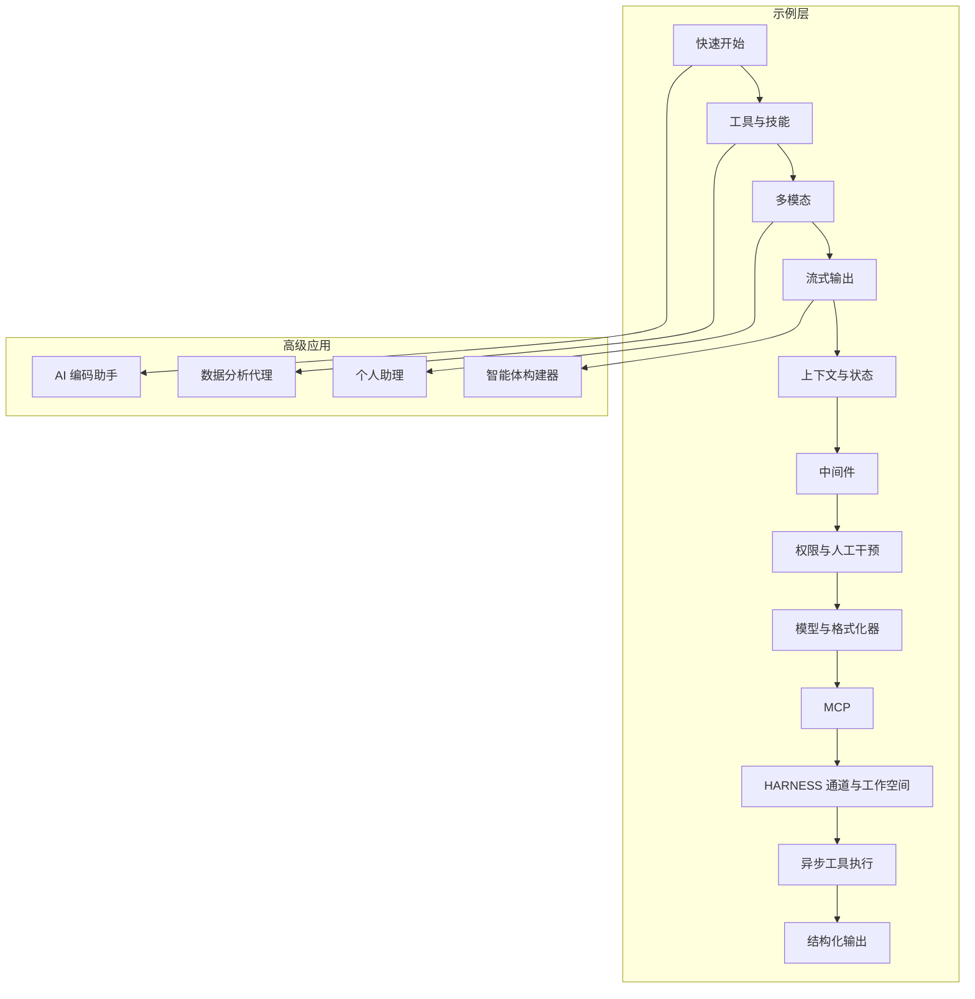

## 详细组件分析

### 快速开始：基础聊天与多轮对话
- 学习目标：理解消息结构、代理生命周期、多轮对话
- 关键点：消息发送、响应接收、会话保持
- 参考示例：BasicChatExample

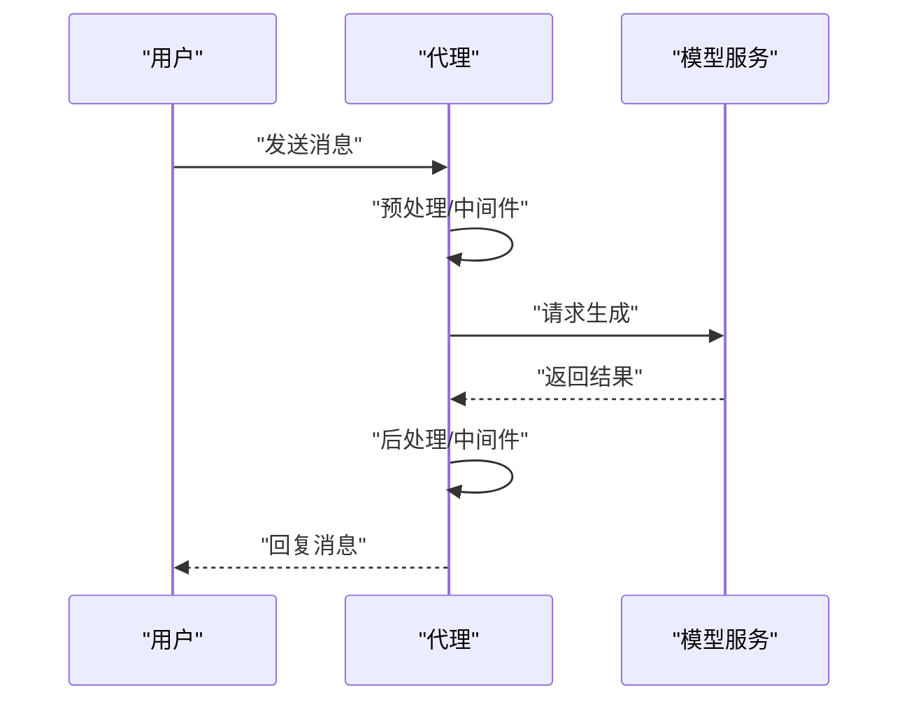

**章节来源**
- [agentscope-examples/documentation/src/main/java/io/agentscope/examples/documentation2/quickstart/BasicChatExample.java:1-200](file://agentscope-examples/documentation/src/main/java/io/agentscope/examples/documentation2/quickstart/BasicChatExample.java#L1-L200)

### 工具与技能：函数式工具与技能组合
- 学习目标：工具注册、参数校验、结果转换、技能组合
- 关键点：工具调用链、工具组、反射式工具、技能元数据
- 参考示例：ToolCallingExample、AgentSkillExample、SkillWithToolGroupExample

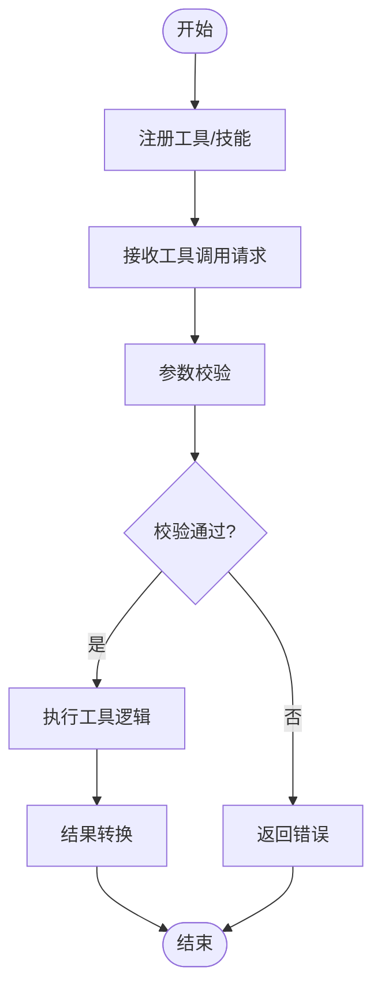

**章节来源**
- [agentscope-examples/documentation/src/main/java/io/agentscope/examples/documentation2/tool/ToolCallingExample.java:1-200](file://agentscope-examples/documentation/src/main/java/io/agentscope/examples/documentation2/tool/ToolCallingExample.java#L1-L200)
- [agentscope-examples/documentation/src/main/java/io/agentscope/examples/documentation2/skill/AgentSkillExample.java:1-200](file://agentscope-examples/documentation/src/main/java/io/agentscope/examples/documentation2/skill/AgentSkillExample.java#L1-L200)
- [agentscope-examples/documentation/src/main/java/io/agentscope/examples/documentation2/skill/SkillWithToolGroupExample.java:1-200](file://agentscope-examples/documentation/src/main/java/io/agentscope/examples/documentation2/skill/SkillWithToolGroupExample.java#L1-L200)

### 多模态：图像/文本/音视频输入
- 学习目标：多模态消息构造、媒体块处理、视觉问答
- 关键点：图像/视频/音频块、URL/Base64 源、媒体工具
- 参考示例：MultiModalToolExample、VisionExample

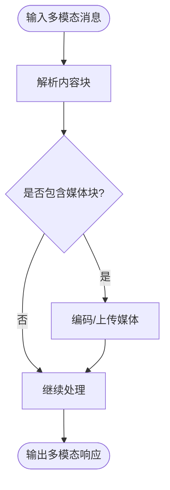

**章节来源**
- [agentscope-examples/documentation/src/main/java/io/agentscope/examples/documentation2/multimodal/MultiModalToolExample.java:1-200](file://agentscope-examples/documentation/src/main/java/io/agentscope/examples/documentation2/multimodal/MultiModalToolExample.java#L1-L200)
- [agentscope-examples/documentation/src/main/java/io/agentscope/examples/documentation2/multimodal/VisionExample.java:1-200](file://agentscope-examples/documentation/src/main/java/io/agentscope/examples/documentation2/multimodal/VisionExample.java#L1-L200)

### 流式输出：事件流与 Web 展示
- 学习目标：流式事件订阅、控制台与 Web 展示、工具流式结果
- 关键点：事件钩子、流式选项、前端渲染
- 参考示例：StreamingConsoleExample、StreamingWebExample、ToolStreamingExample

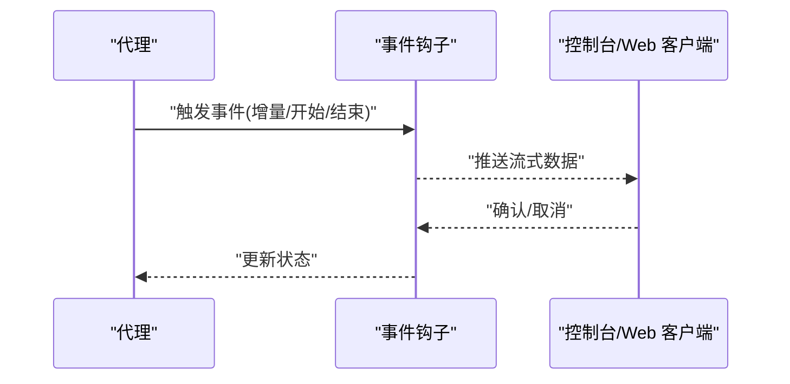

**章节来源**
- [agentscope-examples/documentation/src/main/java/io/agentscope/examples/documentation2/streaming/StreamingConsoleExample.java:1-200](file://agentscope-examples/documentation/src/main/java/io/agentscope/examples/documentation2/streaming/StreamingConsoleExample.java#L1-L200)
- [agentscope-examples/documentation/src/main/java/io/agentscope/examples/documentation2/streaming/StreamingWebExample.java:1-200](file://agentscope-examples/documentation/src/main/java/io/agentscope/examples/documentation2/streaming/StreamingWebExample.java#L1-L200)
- [agentscope-examples/documentation/src/main/java/io/agentscope/examples/documentation2/streaming/ToolStreamingExample.java:1-200](file://agentscope-examples/documentation/src/main/java/io/agentscope/examples/documentation2/streaming/ToolStreamingExample.java#L1-L200)

### 上下文与状态：运行时上下文与状态持久化
- 学习目标：上下文读写、状态自动保存、计划模式
- 关键点：RuntimeContext、状态存储、任务上下文
- 参考示例：RuntimeContextExample、StateExample、StateAutoSaveExample

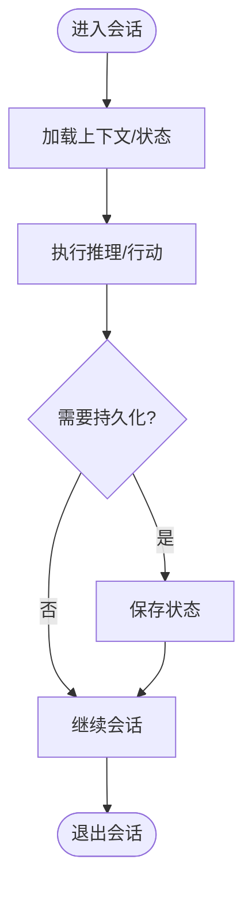

**章节来源**
- [agentscope-examples/documentation/src/main/java/io/agentscope/examples/documentation2/context/RuntimeContextExample.java:1-200](file://agentscope-examples/documentation/src/main/java/io/agentscope/examples/documentation2/context/RuntimeContextExample.java#L1-L200)
- [agentscope-examples/documentation/src/main/java/io/agentscope/examples/documentation2/state/StateExample.java:1-200](file://agentscope-examples/documentation/src/main/java/io/agentscope/examples/documentation2/state/StateExample.java#L1-L200)
- [agentscope-examples/documentation/src/main/java/io/agentscope/examples/documentation2/state/StateAutoSaveExample.java:1-200](file://agentscope-examples/documentation/src/main/java/io/agentscope/examples/documentation2/state/StateAutoSaveExample.java#L1-L200)

### 中间件：自定义中间件与系统提示
- 学习目标：中间件链、系统提示注入、模型调用前/后处理
- 关键点：Pre/Post 钩子、中间件顺序、提示模板
- 参考示例：CustomizedMiddlewareExample、SystemPromptMiddlewareExample、ModelCallMiddlewareExample

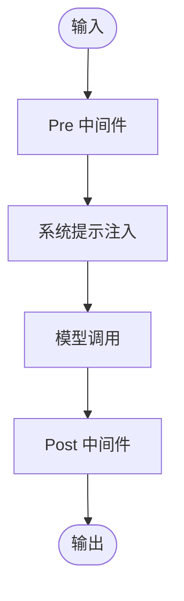

**章节来源**
- [agentscope-examples/documentation/src/main/java/io/agentscope/examples/documentation2/middleware/CustomizedMiddlewareExample.java:1-200](file://agentscope-examples/documentation/src/main/java/io/agentscope/examples/documentation2/middleware/CustomizedMiddlewareExample.java#L1-L200)
- [agentscope-examples/documentation/src/main/java/io/agentscope/examples/documentation2/middleware/SystemPromptMiddlewareExample.java:1-200](file://agentscope-examples/documentation/src/main/java/io/agentscope/examples/documentation2/middleware/SystemPromptMiddlewareExample.java#L1-L200)
- [agentscope-examples/documentation/src/main/java/io/agentscope/examples/documentation2/middleware/ModelCallMiddlewareExample.java:1-200](file://agentscope-examples/documentation/src/main/java/io/agentscope/examples/documentation2/middleware/ModelCallMiddlewareExample.java#L1-L200)

### 权限与人工干预：权限引擎与用户确认
- 学习目标：权限决策、人工干预、中断控制
- 关键点：权限规则、用户确认事件、中断上下文
- 参考示例：PermissionHITLExample、InterruptionExample、HookStopAgentExample

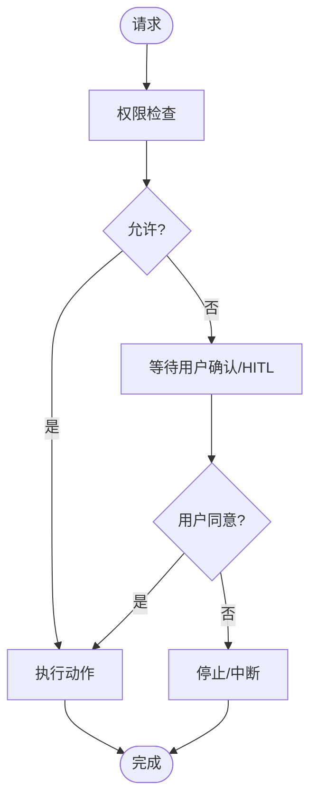

**章节来源**
- [agentscope-examples/documentation/src/main/java/io/agentscope/examples/documentation2/hitl/PermissionHITLExample.java:1-200](file://agentscope-examples/documentation/src/main/java/io/agentscope/examples/documentation2/hitl/PermissionHITLExample.java#L1-L200)
- [agentscope-examples/documentation/src/main/java/io/agentscope/examples/documentation2/hitl/InterruptionExample.java:1-200](file://agentscope-examples/documentation/src/main/java/io/agentscope/examples/documentation2/hitl/InterruptionExample.java#L1-L200)
- [agentscope-examples/documentation/src/main/java/io/agentscope/examples/documentation2/hitl/HookStopAgentExample.java:1-200](file://agentscope-examples/documentation/src/main/java/io/agentscope/examples/documentation2/hitl/HookStopAgentExample.java#L1-L200)

### 模型与格式化器：模型注册与响应格式
- 学习目标：模型注册、响应格式化、媒体工具
- 关键点：模型工厂、格式化器适配、媒体工具
- 参考示例：ModelRegistryExample

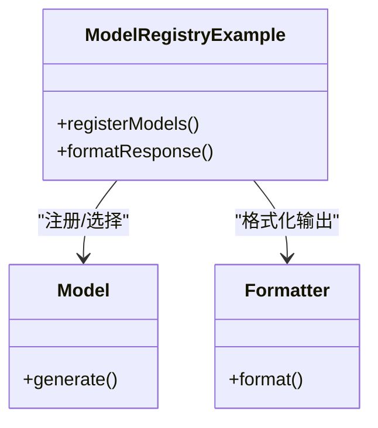

**章节来源**
- [agentscope-examples/documentation/src/main/java/io/agentscope/examples/documentation2/model/ModelRegistryExample.java:1-200](file://agentscope-examples/documentation/src/main/java/io/agentscope/examples/documentation2/model/ModelRegistryExample.java#L1-L200)

### MCP：标准输入/输出与 HTTP SSE
- 学习目标：MCP 客户端接入、标准 IO、HTTP SSE、可流式 HTTP
- 关键点：客户端构建、事件流、握手协议
- 参考示例：McpStdioExample、McpSseExample、McpStreamableHttpExample

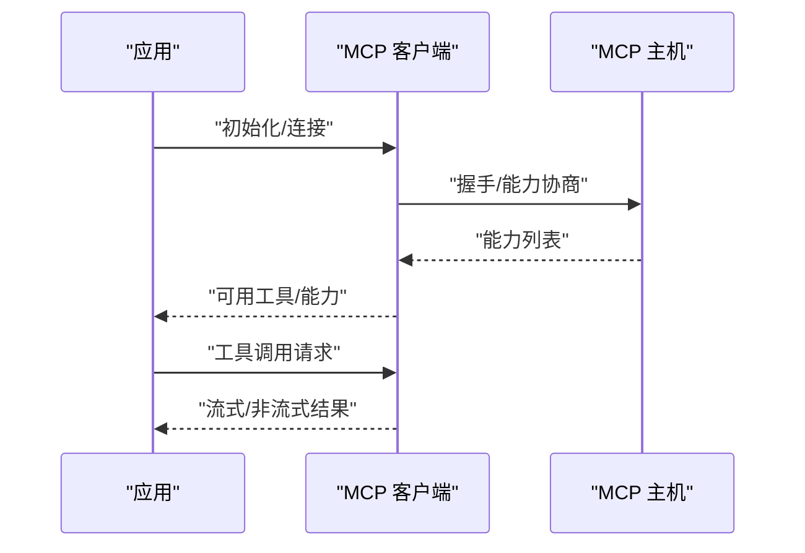

**章节来源**
- [agentscope-examples/documentation/src/main/java/io/agentscope/examples/documentation2/mcp/McpStdioExample.java:1-200](file://agentscope-examples/documentation/src/main/java/io/agentscope/examples/documentation2/mcp/McpStdioExample.java#L1-L200)
- [agentscope-examples/documentation/src/main/java/io/agentscope/examples/documentation2/mcp/McpSseExample.java:1-200](file://agentscope-examples/documentation/src/main/java/io/agentscope/examples/documentation2/mcp/McpSseExample.java#L1-L200)
- [agentscope-examples/documentation/src/main/java/io/agentscope/examples/documentation2/mcp/McpStreamableHttpExample.java:1-200](file://agentscope-examples/documentation/src/main/java/io/agentscope/examples/documentation2/mcp/McpStreamableHttpExample.java#L1-L200)

### HARNESS：通道网关、子代理与工作空间
- 学习目标：通道网关多代理、子代理直接发送与流式、工作空间（本地 Shell、沙箱、共享存储）
- 关键点：通道映射、子代理事件总线、工作空间接口
- 参考示例：GatewayMultiAgentExample、SubagentStreamingExample、WorkspaceSandboxExample

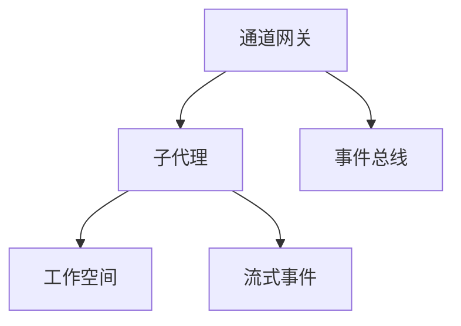

**章节来源**
- [agentscope-examples/documentation/src/main/java/io/agentscope/examples/documentation2/harness/channel/GatewayMultiAgentExample.java:1-200](file://agentscope-examples/documentation/src/main/java/io/agentscope/examples/documentation2/harness/channel/GatewayMultiAgentExample.java#L1-L200)
- [agentscope-examples/documentation/src/main/java/io/agentscope/examples/documentation2/harness/subagent/SubagentStreamingExample.java:1-200](file://agentscope-examples/documentation/src/main/java/io/agentscope/examples/documentation2/harness/subagent/SubagentStreamingExample.java#L1-L200)
- [agentscope-examples/documentation/src/main/java/io/agentscope/examples/documentation2/harness/workspace/WorkspaceSandboxExample.java:1-200](file://agentscope-examples/documentation/src/main/java/io/agentscope/examples/documentation2/harness/workspace/WorkspaceSandboxExample.java#L1-L200)

### 异步工具执行：异步工具调用与等待模式
- 学习目标：异步工具调用、等待模式配置、异步子代理执行
- 关键点：异步工具记录、等待模式、异步结果处理
- 参考示例：AsyncToolExample、AsyncSubagentExample、AsyncWaitModeExample
- 新增组件：AsyncToolRecord、AsyncToolRegistry、AsyncToolMiddleware、WaitAsyncResultsTool

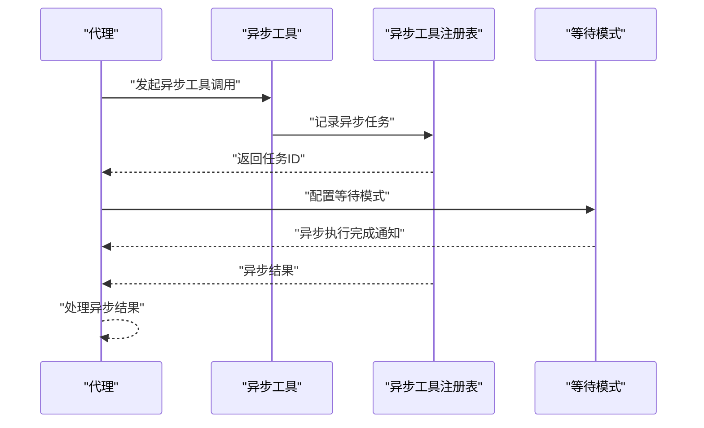

**章节来源**
- [agentscope-examples/documentation/src/main/java/io/agentscope/examples/documentation2/harness/async/AsyncToolExample.java:1-200](file://agentscope-examples/documentation/src/main/java/io/agentscope/examples/documentation2/harness/async/AsyncToolExample.java#L1-L200)
- [agentscope-examples/documentation/src/main/java/io/agentscope/examples/documentation2/harness/async/AsyncSubagentExample.java:1-200](file://agentscope-examples/documentation/src/main/java/io/agentscope/examples/documentation2/harness/async/AsyncSubagentExample.java#L1-L200)
- [agentscope-examples/documentation/src/main/java/io/agentscope/examples/documentation2/harness/async/AsyncWaitModeExample.java:1-200](file://agentscope-examples/documentation/src/main/java/io/agentscope/examples/documentation2/harness/async/AsyncWaitModeExample.java#L1-L200)

### 结构化输出：结构化提醒与回退机制
- 学习目标：结构化输出提醒、回退机制、动态定义
- 关键点：结构化输出提醒、回退处理、动态模式定义
- 参考示例：StructuredOutputExample、StructuredOutputFallbackExample
- 新增组件：StructuredOutputReminder、ReActAgentStructuredOutputTest、StructuredOutputDynamicDefineTest

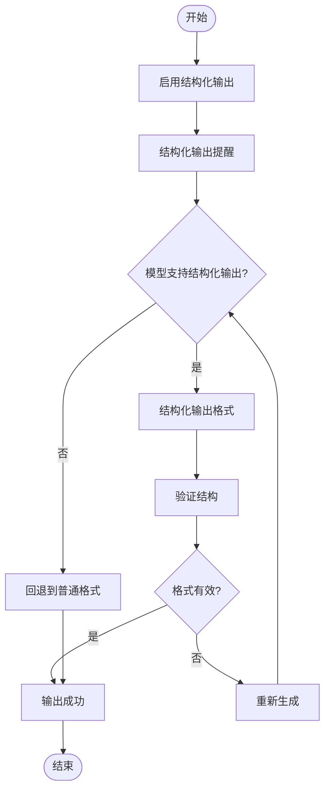

**章节来源**
- [agentscope-examples/documentation/src/main/java/io/agentscope/examples/documentation2/structuredoutput/StructuredOutputExample.java:1-200](file://agentscope-examples/documentation/src/main/java/io/agentscope/examples/documentation2/structuredoutput/StructuredOutputExample.java#L1-L200)
- [agentscope-examples/documentation/src/main/java/io/agentscope/examples/documentation2/structuredoutput/StructuredOutputFallbackExample.java:1-200](file://agentscope-examples/documentation/src/main/java/io/agentscope/examples/documentation2/structuredoutput/StructuredOutputFallbackExample.java#L1-L200)

### 高级应用：AI 编码助手
- 应用场景：代码生成、审查、CI 集成、沙箱执行
- 关键点：工具链（编译、测试、提交）、中间件（路由、权限）、环境变量配置
- 参考示例：agentscope-codingagent
- 环境变量参考：ENV_VARS.md

**章节来源**
- [agentscope-examples/agents/agentscope-codingagent/README.md:1-200](file://agentscope-examples/agents/agentscope-codingagent/README.md#L1-L200)
- [agentscope-examples/agents/agentscope-codingagent/ENV_VARS.md:1-200](file://agentscope-examples/agents/agentscope-codingagent/ENV_VARS.md#L1-L200)

### 高级应用：数据分析代理
- 应用场景：数据报告生成、可视化建议、集群部署
- 关键点：技能组合、多轮分析、前端展示、部署文档
- 参考示例：agentscope-dataagent
- 文档：agent-definition.md、cluster-deploy.md

**章节来源**
- [agentscope-examples/agents/agentscope-dataagent/README.md:1-200](file://agentscope-examples/agents/agentscope-dataagent/README.md#L1-L200)
- [agentscope-examples/agents/agentscope-dataagent/docs/agent-definition.md:1-200](file://agentscope-examples/agents/agentscope-dataagent/docs/agent-definition.md#L1-L200)
- [agentscope-examples/agents/agentscope-dataagent/docs/cluster-deploy.md:1-200](file://agentscope-examples/agents/agentscope-dataagent/docs/cluster-deploy.md#L1-L200)

### 高级应用：个人助理（PAW）
- 应用场景：日程、提醒、信息检索、前端交互
- 关键点：前端页面、交互流程、后端集成
- 参考示例：agentscope-paw

**章节来源**
- [agentscope-examples/agents/agentscope-paw/README.md:1-200](file://agentscope-examples/agents/agentscope-paw/README.md#L1-L200)

### 高级应用：智能体构建器
- 应用场景：可视化构建、模板生成、技能与子代理脚手架
- 关键点：前端界面、模板资源、引导文档
- 参考示例：agentscope-builder
- 前端入口：index.html
- 引导文档：builder.md
- 脚手架资源：prompts/agent-draft.md、skills/example-skill/SKILL.md、subagents/README.md

**章节来源**
- [agentscope-examples/agents/agentscope-builder/README.md:1-200](file://agentscope-examples/agents/agentscope-builder/README.md#L1-L200)
- [agentscope-examples/agents/agentscope-builder/builder.md:1-200](file://agentscope-examples/agents/agentscope-builder/builder.md#L1-L200)
- [agentscope-examples/agents/agentscope-builder/frontend/index.html:1-200](file://agentscope-examples/agents/agentscope-builder/frontend/index.html#L1-L200)
- [agentscope-examples/agents/agentscope-builder/src/main/resources/prompts/agent-draft.md:1-200](file://agentscope-examples/agents/agentscope-builder/src/main/resources/prompts/agent-draft.md#L1-L200)
- [agentscope-examples/agents/agentscope-builder/src/main/resources/scaffold/default/skills/example-skill/SKILL.md:1-200](file://agentscope-examples/agents/agentscope-builder/src/main/resources/scaffold/default/skills/example-skill/SKILL.md#L1-L200)
- [agentscope-examples/agents/agentscope-builder/src/main/resources/scaffold/default/subagents/README.md:1-200](file://agentscope-examples/agents/agentscope-builder/src/main/resources/scaffold/default/subagents/README.md#L1-L200)

## 依赖关系分析
示例模块与核心库之间的依赖关系清晰：示例模块以核心库为基础，通过 Maven 依赖引入 AgentScope 核心能力；同时，示例模块内部按功能域进一步拆分，便于独立运行与维护。

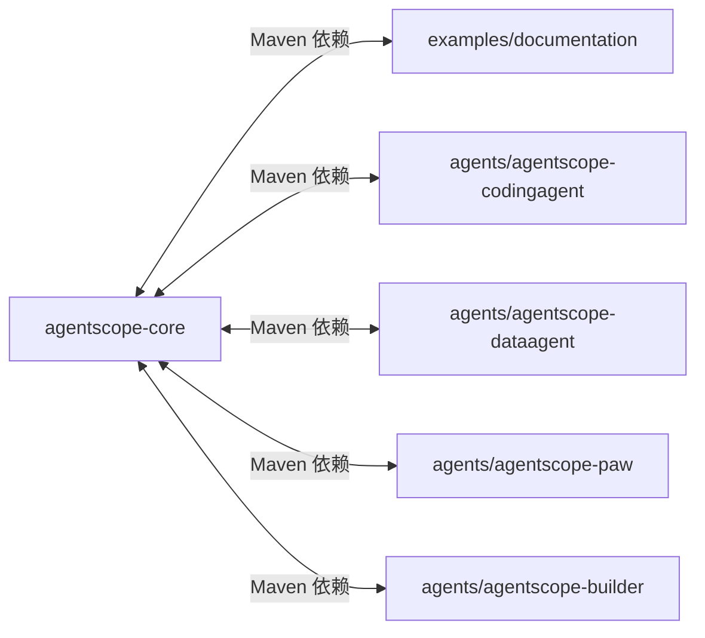

**章节来源**
- [agentscope-examples/documentation/pom.xml:1-200](file://agentscope-examples/documentation/pom.xml#L1-L200)

## 性能考虑
- 流式输出优先：在长耗时任务中采用流式事件，降低首屏延迟并提升用户体验
- 工具调用批量化：对多次小工具调用进行合并，减少往返开销
- 缓存与去重：对重复输入/工具结果进行缓存，避免重复计算
- 权限与中断：在高风险操作前加入人工确认与中断机制，防止无效消耗
- 沙箱与隔离：在沙箱环境中执行不受信任代码，确保系统稳定性
- 中间件顺序：合理安排中间件顺序，避免重复处理与额外开销
- **新增**：异步工具执行：使用异步工具减少阻塞等待，提高并发性能
- **新增**：结构化输出：通过结构化输出提醒确保模型输出格式正确，减少重试开销

## 故障排除指南
- 工具调用失败：检查参数校验、工具实现与结果转换
- 多模态媒体异常：确认媒体源类型（URL/Base64）、编码与大小限制
- 权限拒绝：核对权限规则与用户确认流程
- 流式事件丢失：检查事件钩子注册与前端订阅
- 模型调用超时：调整超时策略、重试机制与降级方案
- MCP 连接失败：验证握手协议、主机可达性与凭据配置
- HARNESS 通道异常：检查网关配置、子代理事件总线与工作空间接口
- **新增**：异步工具执行问题：检查异步工具注册表、等待模式配置和异步结果处理
- **新增**：结构化输出失败：验证结构化输出提醒配置、回退机制和动态定义

## 结论
通过本教程，您将掌握 AgentScope 的核心能力与最佳实践，并能够基于示例快速构建从基础到高级的各类智能体应用。新增的异步工具执行和结构化输出功能进一步增强了系统的性能和可靠性。建议在实际项目中结合中间件、权限与流式输出等能力，持续优化性能与用户体验。

## 附录
- 项目根目录与示例模块说明：README.md、agentscope-examples/README.md
- 技能与参考文档：test-skills 与 e2e-skills 下的 SKILL.md 与 guide.md

**章节来源**
- [README.md:1-200](file://README.md#L1-L200)
- [agentscope-examples/README.md:1-200](file://agentscope-examples/README.md#L1-L200)
- [agentscope-core/src/test/resources/test-skills/calculation-skill/SKILL.md:1-200](file://agentscope-core/src/test/resources/test-skills/calculation-skill/SKILL.md#L1-L200)
- [agentscope-core/src/test/resources/test-skills/writing-skill/SKILL.md:1-200](file://agentscope-core/src/test/resources/test-skills/writing-skill/SKILL.md#L1-L200)
- [agentscope-core/src/test/resources/test-skills/writing-skill/references/guide.md:1-200](file://agentscope-core/src/test/resources/test-skills/writing-skill/references/guide.md#L1-L200)
