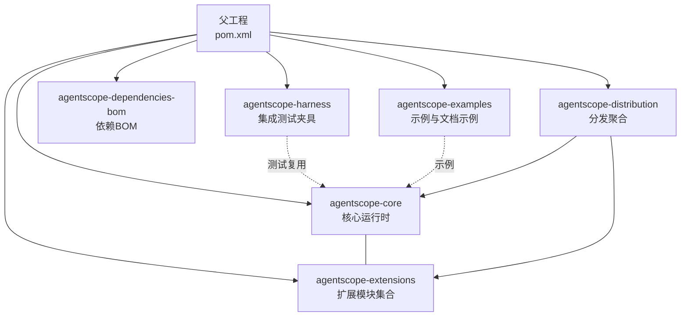
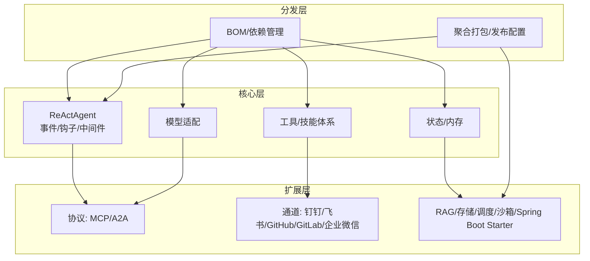
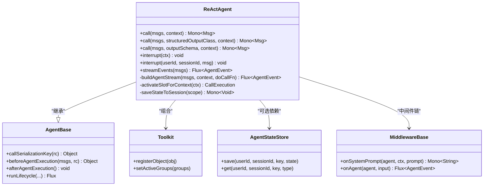
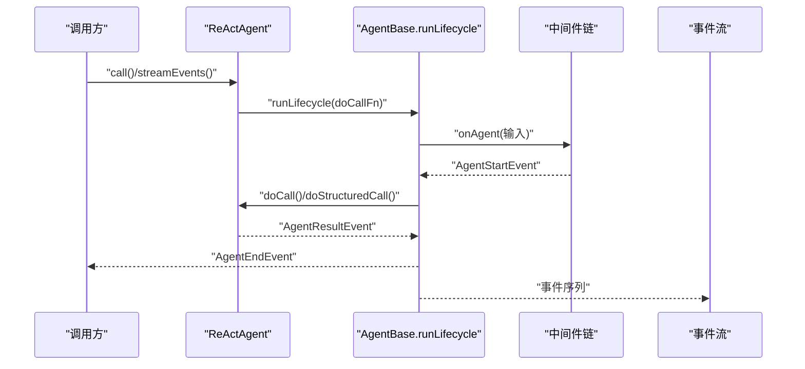
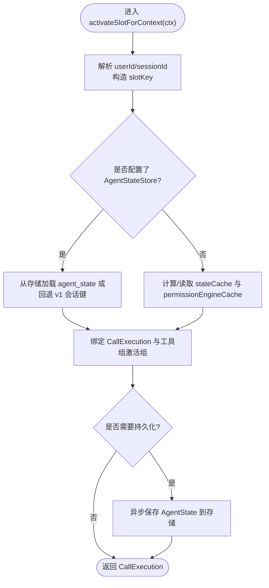

# 贡献与开发

<cite>
**本文引用的文件**
- [CONTRIBUTING.md](file://CONTRIBUTING.md)
- [CONTRIBUTING_zh.md](file://CONTRIBUTING_zh.md)
- [README.md](file://README.md)
- [pom.xml](file://pom.xml)
- [.github/workflows/maven-ci.yml](file://.github/workflows/maven-ci.yml)
- [.github/workflows/close-stale-prs.yml](file://.github/workflows/close-stale-prs.yml)
- [agentscope-core/pom.xml](file://agentscope-core/pom.xml)
- [ReActAgent.java](file://agentscope-core/src/main/java/io/agentscope/core/ReActAgent.java)
</cite>

## 目录
1. [简介](#简介)
2. [项目结构](#项目结构)
3. [核心组件](#核心组件)
4. [架构总览](#架构总览)
5. [详细组件分析](#详细组件分析)
6. [依赖分析](#依赖分析)
7. [性能考虑](#性能考虑)
8. [故障排查指南](#故障排查指南)
9. [结论](#结论)
10. [附录](#附录)

## 简介
本指南面向希望参与 AgentScope Java 项目的贡献者，覆盖开发环境搭建、代码规范、提交流程、架构设计原则、模块划分与依赖管理、测试策略、代码审查与发布流程、IDE 配置与调试技巧、性能分析工具、社区协作方式等内容。目标是帮助贡献者高效参与开发，推动框架持续演进。

## 项目结构
AgentScope 采用多模块 Maven 父子工程组织，核心模块包括：
- agentscope-core：核心运行时与 ReActAgent 实现、事件系统、中间件、工具与技能体系、内存与状态管理、模型适配器等
- agentscope-harness：集成测试与示例测试夹具
- agentscope-extensions：扩展能力（通道、协议、RAG、存储、调度、沙箱、Spring Boot Starter 等）
- agentscope-examples：示例与文档示例
- agentscope-dependencies-bom：统一依赖版本管理
- agentscope-distribution：聚合打包与 BOM

图表来源
- [pom.xml:56-63](file://pom.xml#L56-L63)

章节来源
- [pom.xml:56-63](file://pom.xml#L56-L63)

## 核心组件
- ReActAgent：基于 ReAct 思想的智能体实现，支持推理-行动迭代、钩子系统、流式事件、结构化输出、权限控制、长程记忆、RAG、优雅关停等
- 事件与钩子：细粒度 Agent 事件流（如文本块、思考块、工具调用、结果增量等），以及前置/后置钩子链路
- 中间件：统一的请求生命周期拦截与增强（如系统提示拼装、超时与关停、任务提醒等）
- 工具与技能：工具注册、参数校验、执行上下文、结果转换；动态技能中间件与技能仓库
- 内存与状态：会话级 AgentState 存储、内存视图、长程记忆模式与检索工具
- 模型适配：OpenAI、DashScope、Gemini、Anthropic、Ollama 等模型客户端与响应解析
- 安全与沙箱：受控执行环境与多种沙箱后端（Redis、OSS、Kubernetes 等）

章节来源
- [ReActAgent.java:148-200](file://agentscope-core/src/main/java/io/agentscope/core/ReActAgent.java#L148-L200)
- [agentscope-core/pom.xml:51-231](file://agentscope-core/pom.xml#L51-L231)

## 架构总览
AgentScope 采用“核心 + 扩展 + 分发”的分层架构：
- 核心层提供 ReAct 引擎、事件/钩子、中间件、工具/技能、状态/内存、模型适配
- 扩展层提供协议对接（MCP/A2A）、通道（钉钉/飞书/GitHub/GitLab/企业微信）、RAG、分布式存储、调度、沙箱、Spring Boot Starter
- 分发层提供 BOM、聚合打包与发布配置

图表来源
- [pom.xml:56-63](file://pom.xml#L56-L63)
- [agentscope-core/pom.xml:51-231](file://agentscope-core/pom.xml#L51-L231)

## 详细组件分析

### ReActAgent 组件分析
ReActAgent 是框架的核心执行引擎，负责：
- 推理-行动循环的编排与中断控制
- 会话级状态加载/持久化与权限引擎缓存
- 结构化输出工具注入与校验
- 事件流构建与中间件链路应用
- 优雅关停与部分推理策略

图表来源
- [ReActAgent.java:200-330](file://agentscope-core/src/main/java/io/agentscope/core/ReActAgent.java#L200-L330)
- [ReActAgent.java:795-805](file://agentscope-core/src/main/java/io/agentscope/core/ReActAgent.java#L795-L805)

章节来源
- [ReActAgent.java:148-200](file://agentscope-core/src/main/java/io/agentscope/core/ReActAgent.java#L148-L200)
- [ReActAgent.java:288-330](file://agentscope-core/src/main/java/io/agentscope/core/ReActAgent.java#L288-L330)
- [ReActAgent.java:437-478](file://agentscope-core/src/main/java/io/agentscope/core/ReActAgent.java#L437-L478)
- [ReActAgent.java:795-805](file://agentscope-core/src/main/java/io/agentscope/core/ReActAgent.java#L795-L805)

### API/服务组件：调用与事件流
ReActAgent 的调用路径统一走 buildAgentStream，确保中间件与钩子在所有调用路径上一致生效，并在 AgentStartEvent 与 AgentEndEvent 之间发出完整的 AgentResultEvent。

图表来源
- [ReActAgent.java:769-777](file://agentscope-core/src/main/java/io/agentscope/core/ReActAgent.java#L769-L777)
- [ReActAgent.java:795-805](file://agentscope-core/src/main/java/io/agentscope/core/ReActAgent.java#L795-L805)

章节来源
- [ReActAgent.java:769-777](file://agentscope-core/src/main/java/io/agentscope/core/ReActAgent.java#L769-L777)
- [ReActAgent.java:795-805](file://agentscope-core/src/main/java/io/agentscope/core/ReActAgent.java#L795-L805)

### 复杂逻辑组件：会话状态激活与持久化
会话级状态激活与持久化涉及 slotKey 计算、状态加载/回退、权限引擎缓存、工具组同步与异步落盘。

图表来源
- [ReActAgent.java:437-478](file://agentscope-core/src/main/java/io/agentscope/core/ReActAgent.java#L437-L478)
- [ReActAgent.java:412-422](file://agentscope-core/src/main/java/io/agentscope/core/ReActAgent.java#L412-L422)

章节来源
- [ReActAgent.java:437-478](file://agentscope-core/src/main/java/io/agentscope/core/ReActAgent.java#L437-L478)
- [ReActAgent.java:412-422](file://agentscope-core/src/main/java/io/agentscope/core/ReActAgent.java#L412-L422)

## 依赖分析
- 语言与工具链
  - JDK 17+，Maven 构建，Google Java Format + Spotless 代码格式化，JaCoCo 覆盖率统计，Javadoc 生成，GPG 签名与 Sonatype 发布
- 核心运行时依赖
  - Project Reactor（Flux/Mono）、Jackson（JSON）、Victools JSON Schema（结构化输出）、SLF4J、OkHttp、YAML 解析、Tree-sitter（安全分析）、OpenTelemetry（可观测性）
- 可选扩展依赖
  - DashScope、Gemini、Anthropic SDK；MCP SDK；Redis/Jedis、OSS、Kubernetes 客户端等

章节来源
- [pom.xml:37-53](file://pom.xml#L37-L53)
- [pom.xml:164-343](file://pom.xml#L164-L343)
- [agentscope-core/pom.xml:51-231](file://agentscope-core/pom.xml#L51-L231)

## 性能考虑
- 非阻塞执行：基于 Project Reactor 的响应式模型，减少线程阻塞
- 冷启动优化：支持 GraalVM 原生镜像，缩短冷启动时间
- 并发与序列化：按会话槽位串行化调用，避免并发写冲突；工具组与状态同步在持久化前完成
- 覆盖率与稳定性：CI 中启用 JaCoCo 报告，确保关键路径有测试覆盖

章节来源
- [README.md:66-70](file://README.md#L66-L70)
- [.github/workflows/maven-ci.yml:133-139](file://.github/workflows/maven-ci.yml#L133-L139)

## 故障排查指南
- 提交信息与规范
  - 遵循 Conventional Commits，类型包括 feat/fix/docs/style/refactor/perf/ci/chore
- 本地检查
  - Spotless 格式检查与自动修复
  - 单元测试与覆盖率验证
- CI 与发布
  - GitHub Actions 自动化检查许可证、模块同步、跨平台构建与覆盖率上传
  - 通过 release Profile 进行 GPG 签名与 Sonatype 发布
- 常见问题
  - 忽略 CI 失败、混杂变更、破坏 API 兼容性、添加无关依赖等都会导致审查不通过
  - 大改动需先开 Issue 讨论，避免一次性提交大型 PR

章节来源
- [CONTRIBUTING.md:28-56](file://CONTRIBUTING.md#L28-L56)
- [CONTRIBUTING_zh.md:27-54](file://CONTRIBUTING_zh.md#L27-L54)
- [.github/workflows/maven-ci.yml:1-141](file://.github/workflows/maven-ci.yml#L1-L141)
- [pom.xml:345-408](file://pom.xml#L345-L408)

## 结论
本指南提供了从开发环境到贡献流程、从架构理解到实践操作的完整路径。建议贡献者：
- 先阅读 Issue 与讨论，再动手实现
- 严格遵循代码规范与提交规范
- 编写充分的单元测试与必要的文档
- 关注 CI 与覆盖率，确保质量与可维护性
- 积极参与社区讨论，共同推进 AgentScope 的演进

## 附录

### 开发环境搭建
- JDK 17+，Maven
- 安装并配置 IDE（IntelliJ/Eclipse）以使用项目代码风格（Spotless）
- 本地安装 mvnd（可选，提升构建速度）

章节来源
- [README.md:74-78](file://README.md#L74-L78)
- [pom.xml:164-211](file://pom.xml#L164-L211)

### 代码规范与提交流程
- 代码格式：使用 Maven 插件进行检查与自动修复
- 提交信息：遵循 Conventional Commits
- 测试：新增功能配套单元测试，运行 mvn test 或 mvn verify
- 文档：更新相关文档与 README

章节来源
- [CONTRIBUTING.md:57-96](file://CONTRIBUTING.md#L57-L96)
- [CONTRIBUTING_zh.md:55-94](file://CONTRIBUTING_zh.md#L55-L94)

### 测试策略
- 单元测试：使用 JUnit Jupiter、Mockito、Reactor Test
- 集成测试：agentscope-harness 提供共享测试夹具
- 覆盖率：JaCoCo 统计，CI 中上传至 Codecov
- 平台：Linux/Windows 双平台 CI，缓存 Maven 与 mvnd

章节来源
- [pom.xml:97-130](file://pom.xml#L97-L130)
- [.github/workflows/maven-ci.yml:1-141](file://.github/workflows/maven-ci.yml#L1-L141)

### 代码审查与发布流程
- 代码审查：遵循 Do’s and Don’ts，保持 PR 聚焦、及时修复 CI 失败
- 发布：通过 release Profile 进行 GPG 签名与 Sonatype 发布，排除示例模块

章节来源
- [CONTRIBUTING.md:112-132](file://CONTRIBUTING.md#L112-L132)
- [CONTRIBUTING_zh.md:110-130](file://CONTRIBUTING_zh.md#L110-L130)
- [pom.xml:345-408](file://pom.xml#L345-L408)

### 新功能开发、Bug 修复与文档贡献
- 新功能：先开 Issue 讨论，编写单元测试与示例，更新文档
- Bug 修复：补充回归测试，必要时更新兼容性说明
- 文档贡献：更新 README、示例与文档示例

章节来源
- [CONTRIBUTING.md:97-110](file://CONTRIBUTING.md#L97-L110)
- [CONTRIBUTING_zh.md:95-108](file://CONTRIBUTING_zh.md#L95-L108)

### IDE 配置与调试技巧
- IDE：配置 Spotless 自动格式化；启用断点与日志（SLF4J）
- 调试：利用事件流（AgentEvent）定位推理/行动阶段问题；结合中间件链逐步缩小范围
- 性能分析：结合 OpenTelemetry 与 JaCoCo，定位热点路径

章节来源
- [CONTRIBUTING.md:73-73](file://CONTRIBUTING.md#L73-L73)
- [agentscope-core/pom.xml:162-176](file://agentscope-core/pom.xml#L162-L176)

### 社区参与方式
- 讨论渠道：GitHub Discussions、Discord、钉钉/微信群
- 问题反馈：通过 Issues 提交 Bug 与需求
- 合作机制：Issue 讨论 → PR → 代码审查 → 合并

章节来源
- [README.md:106-111](file://README.md#L106-L111)
- [CONTRIBUTING.md:133-140](file://CONTRIBUTING.md#L133-L140)
- [CONTRIBUTING_zh.md:131-138](file://CONTRIBUTING_zh.md#L131-L138)
