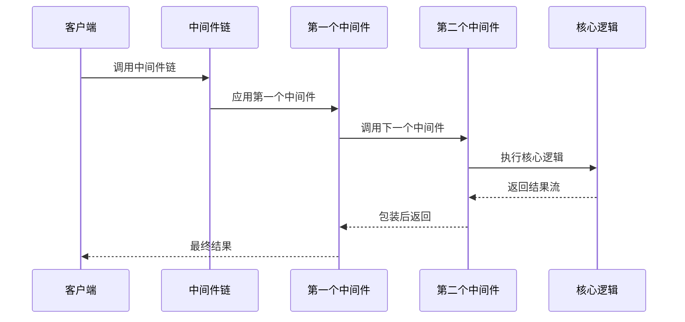
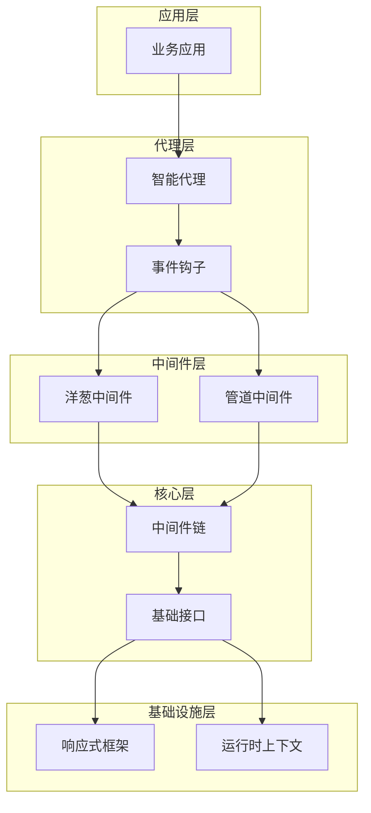
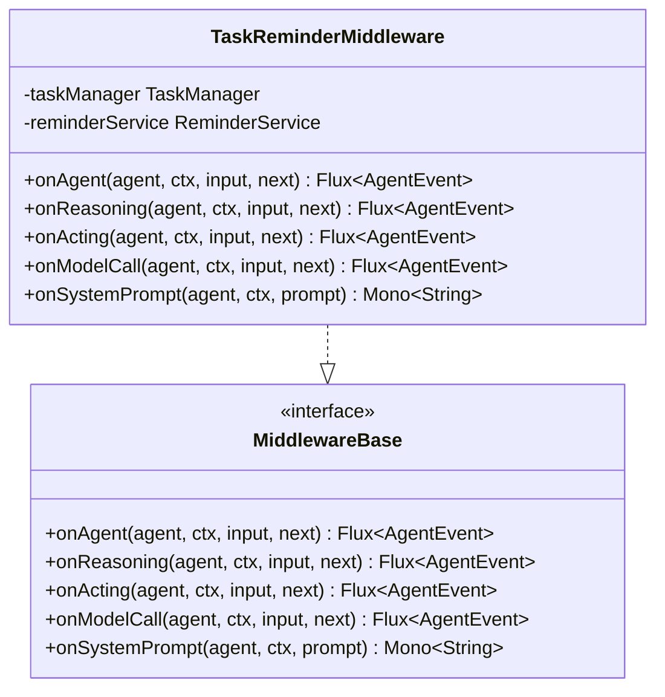
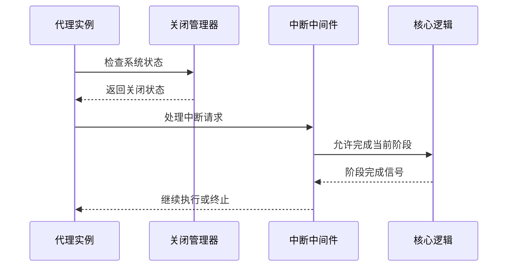
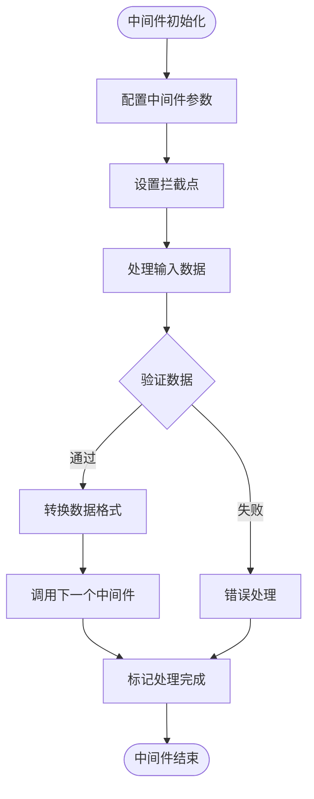
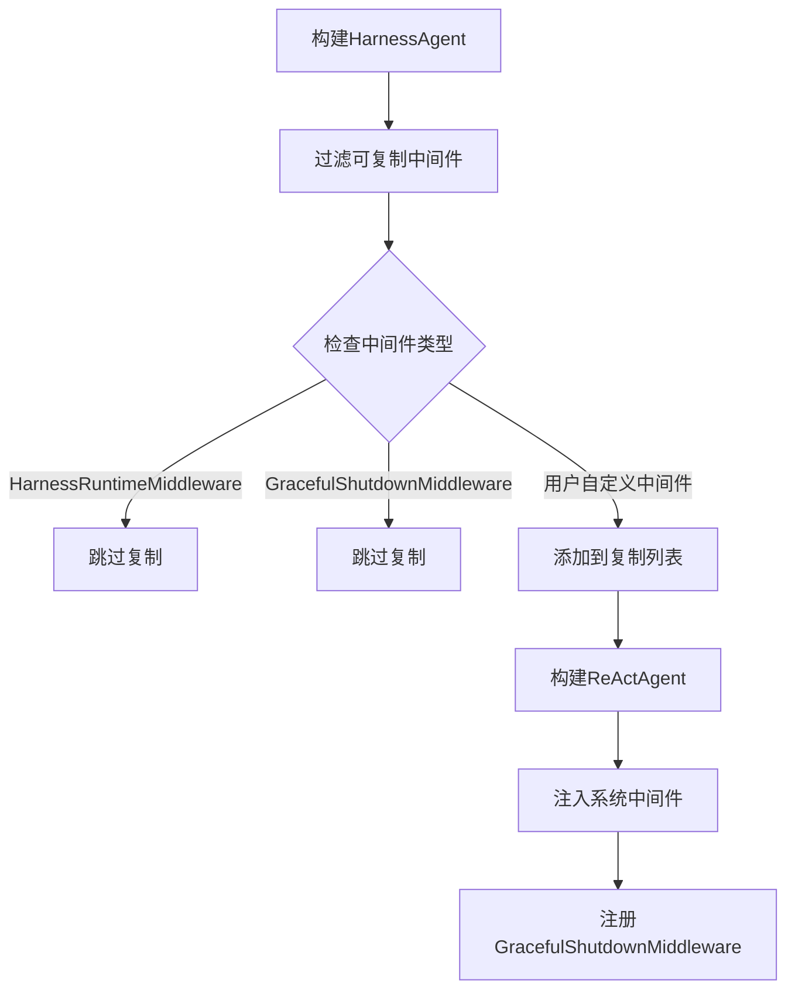
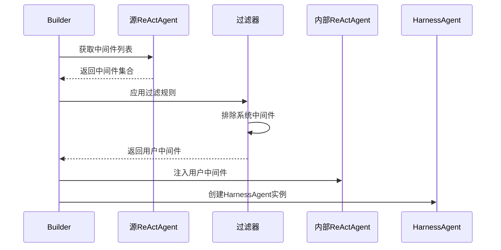
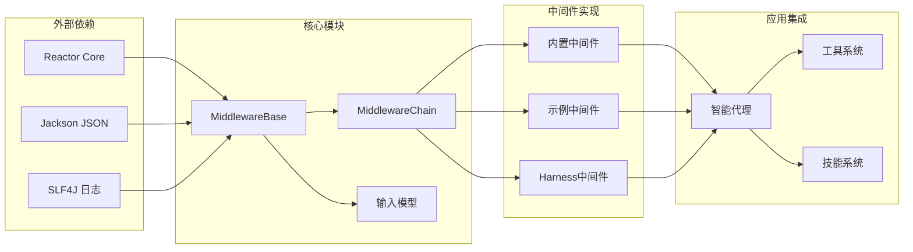

# 中间件系统改进

<cite>
**本文档引用的文件**
- [MiddlewareBase.java](file://agentscope-core/src/main/java/io/agentscope/core/middleware/MiddlewareBase.java)
- [MiddlewareChain.java](file://agentscope-core/src/main/java/io/agentscope/core/middleware/MiddlewareChain.java)
- [AgentInput.java](file://agentscope-core/src/main/java/io/agentscope/core/middleware/AgentInput.java)
- [ReasoningInput.java](file://agentscope-core/src/main/java/io/agentscope/core/middleware/ReasoningInput.java)
- [ActingInput.java](file://agentscope-core/src/main/java/io/agentscope/core/middleware/ActingInput.java)
- [ModelCallInput.java](file://agentscope-core/src/main/java/io/agentscope/core/middleware/ModelCallInput.java)
- [TaskReminderMiddleware.java](file://agentscope-core/src/main/java/io/agentscope/core/middleware/TaskReminderMiddleware.java)
- [GracefulShutdownMiddleware.java](file://agentscope-core/src/main/java/io/agentscope/core/shutdown/GracefulShutdownMiddleware.java)
- [GracefulShutdownManager.java](file://agentscope-core/src/main/java/io/agentscope/core/shutdown/GracefulShutdownManager.java)
- [OtelTracingMiddleware.java](file://agentscope-core/src/main/java/io/agentscope/core/tracing/OtelTracingMiddleware.java)
- [DynamicSkillMiddleware.java](file://agentscope-core/src/main/java/io/agentscope/core/skill/DynamicSkillMiddleware.java)
- [CustomizedMiddlewareExample.java](file://agentscope-examples/documentation/src/main/java/io/agentscope/examples/documentation2/middleware/CustomizedMiddlewareExample.java)
- [ModelCallMiddlewareExample.java](file://agentscope-examples/documentation/src/main/java/io/agentscope/examples/documentation2/middleware/ModelCallMiddlewareExample.java)
- [SystemPromptMiddlewareExample.java](file://agentscope-examples/documentation/src/main/java/io/agentscope/examples/documentation2/middleware/SystemPromptMiddlewareExample.java)
- [MessageQueueMiddleware.java](file://agentscope-examples/agents/agentscope-codingagent/src/main/java/io/agentscope/harness/coding/middleware/MessageQueueMiddleware.java)
- [ModelCallLimitMiddleware.java](file://agentscope-examples/agents/agentscope-codingagent/src/main/java/io/agentscope/harness/coding/middleware/ModelCallLimitMiddleware.java)
- [ThreadBudgetMiddleware.java](file://agentscope-examples/agents/agentscope-codingagent/src/main/java/io/agentscope/harness/coding/middleware/ThreadBudgetMiddleware.java)
- [AgentTraceMiddleware.java](file://agentscope-harness/src/main/java/io/agentscope/harness/agent/middleware/AgentTraceMiddleware.java)
- [AsyncToolMiddleware.java](file://agentscope-harness/src/main/java/io/agentscope/harness/agent/middleware/AsyncToolMiddleware.java)
- [AtPathExpansionMiddleware.java](file://agentscope-harness/src/main/java/io/agentscope/harness/agent/middleware/AtPathExpansionMiddleware.java)
- [CompactionMiddleware.java](file://agentscope-harness/src/main/java/io/agentscope/harness/agent/middleware/CompactionMiddleware.java)
- [DynamicSubagentsMiddleware.java](file://agentscope-harness/src/main/java/io/agentscope/harness/agent/middleware/DynamicSubagentsMiddleware.java)
- [HarnessAgent.java](file://agentscope-harness/src/main/java/io/agentscope/harness/agent/HarnessAgent.java)
</cite>

## 更新摘要
**所做更改**
- 新增了关于GracefulShutdownMiddleware防重复实例化改进的章节
- 更新了中间件实例化流程说明，强调系统中间件的单例保护
- 增加了中间件过滤机制的详细说明
- 补充了中间件复制策略的实现细节

## 目录
1. [引言](#引言)
2. [项目结构](#项目结构)
3. [核心组件](#核心组件)
4. [架构概览](#架构概览)
5. [详细组件分析](#详细组件分析)
6. [中间件实例化改进](#中间件实例化改进)
7. [依赖关系分析](#依赖关系分析)
8. [性能考虑](#性能考虑)
9. [故障排除指南](#故障排除指南)
10. [结论](#结论)

## 引言

Agentscope Java项目的中间件系统是一个高度模块化和可扩展的架构设计，它为智能代理提供了强大的拦截和处理能力。该系统采用洋葱模型（Onion Pattern）和管道模式（Pipeline Pattern）相结合的设计理念，允许开发者在代理生命周期的关键节点进行精确控制和增强。

中间件系统的核心价值在于其灵活性和可组合性，使得开发者可以轻松地添加监控、日志记录、安全检查、性能优化等功能，而无需修改核心代理逻辑。这种设计模式在现代微服务架构中得到了广泛应用，为Agentscope项目提供了强大的扩展能力。

**更新** 本版本重点介绍了HarnessAgent中GracefulShutdownMiddleware的防重复实例化改进，确保系统中间件不会被重复克隆，同时保持用户定义中间件的正确复制。

## 项目结构

中间件系统的组织结构体现了清晰的关注点分离和模块化设计：

```mermaid
graph TB
subgraph "核心中间件模块"
MB[MiddlewareBase 接口]
MC[MiddlewareChain 类]
AI[AgentInput 记录类]
RI[ReasoningInput 记录类]
AC[ActingInput 记录类]
MCI[ModelCallInput 记录类]
end
subgraph "内置中间件"
TRM[TaskReminderMiddleware]
GSM[GracefulShutdownMiddleware]
OTM[OtelTracingMiddleware]
DSM[DynamicSkillMiddleware]
end
subgraph "示例中间件"
CME[CustomizedMiddlewareExample]
MMM[ModelCallMiddlewareExample]
SPM[SystemPromptMiddlewareExample]
MQM[MessageQueueMiddleware]
MCLM[ModelCallLimitMiddleware]
TBM[ThreadBudgetMiddleware]
end
subgraph "Harness中间件"
ATM[AgentTraceMiddleware]
ATMM[AsyncToolMiddleware]
APEM[AtPathExpansionMiddleware]
CM[CompactionMiddleware]
DSMH[DynamicSubagentsMiddleware]
end
MB --> MC
MB --> TRM
MB --> GSM
MB --> OTM
MB --> DSM
MB --> CME
MB --> MMM
MB --> SPM
MB --> MQM
MB --> MCLM
MB --> TBM
MB --> ATM
MB --> ATMM
MB --> APEM
MB --> CM
MB --> DSMH
```

**图表来源**
- [MiddlewareBase.java:25-143](file://agentscope-core/src/main/java/io/agentscope/core/middleware/MiddlewareBase.java#L25-L143)
- [MiddlewareChain.java:31-78](file://agentscope-core/src/main/java/io/agentscope/core/middleware/MiddlewareChain.java#L31-L78)

**章节来源**
- [MiddlewareBase.java:25-143](file://agentscope-core/src/main/java/io/agentscope/core/middleware/MiddlewareBase.java#L25-L143)
- [MiddlewareChain.java:31-78](file://agentscope-core/src/main/java/io/agentscope/core/middleware/MiddlewareChain.java#L31-L78)

## 核心组件

### 中间件基础接口

MiddlewareBase接口定义了中间件系统的核心契约，提供了五个关键的拦截点：

1. **onAgent**: 拦截整个代理调用
2. **onReasoning**: 拦截推理/模型调用阶段
3. **onActing**: 拦截工具调用执行阶段
4. **onModelCall**: 拦截原始模型API调用
5. **onSystemPrompt**: 系统提示词转换（管道模式）

每个方法都有默认实现，允许子类只重写需要的功能。

### 中间件链构建器

MiddlewareChain类实现了洋葱模型的核心机制，通过反向构建中间件链来确保正确的执行顺序。链的构建过程体现了装饰器模式的经典实现：

**图表来源**
- [MiddlewareChain.java:46-62](file://agentscope-core/src/main/java/io/agentscope/core/middleware/MiddlewareChain.java#L46-L62)

**章节来源**
- [MiddlewareBase.java:25-143](file://agentscope-core/src/main/java/io/agentscope/core/middleware/MiddlewareBase.java#L25-L143)
- [MiddlewareChain.java:31-78](file://agentscope-core/src/main/java/io/agentscope/core/middleware/MiddlewareChain.java#L31-L78)

## 架构概览

中间件系统采用分层架构设计，每层都有明确的职责分工：

**图表来源**
- [MiddlewareBase.java:25-58](file://agentscope-core/src/main/java/io/agentscope/core/middleware/MiddlewareBase.java#L25-L58)
- [MiddlewareChain.java:25-31](file://agentscope-core/src/main/java/io/agentscope/core/middleware/MiddlewareChain.java#L25-L31)

### 数据输入类型

系统定义了四种专门的输入类型来支持不同阶段的中间件处理：

| 输入类型 | 用途 | 关键属性 |
|---------|------|----------|
| AgentInput | 整个代理调用 | 消息列表 |
| ReasoningInput | 推理阶段 | 模型配置、工具选择 |
| ActingInput | 工具执行阶段 | 工具调用序列 |
| ModelCallInput | 原始模型调用 | 请求参数、头部信息 |

**章节来源**
- [AgentInput.java:21-26](file://agentscope-core/src/main/java/io/agentscope/core/middleware/AgentInput.java#L21-L26)
- [ReasoningInput.java](file://agentscope-core/src/main/java/io/agentscope/core/middleware/ReasoningInput.java)
- [ActingInput.java](file://agentscope-core/src/main/java/io/agentscope/core/middleware/ActingInput.java)
- [ModelCallInput.java](file://agentscope-core/src/main/java/io/agentscope/core/middleware/ModelCallInput.java)

## 详细组件分析

### 内置中间件分析

#### 任务提醒中间件

TaskReminderMiddleware展示了如何实现基于状态的任务管理功能：

**图表来源**
- [TaskReminderMiddleware.java:53-31](file://agentscope-core/src/main/java/io/agentscope/core/middleware/TaskReminderMiddleware.java#L53-L31)
- [MiddlewareBase.java:25-143](file://agentscope-core/src/main/java/io/agentscope/core/middleware/MiddlewareBase.java#L25-L143)

#### 优雅关闭中间件

GracefulShutdownMiddleware实现了系统级的优雅关闭机制：

**图表来源**
- [GracefulShutdownMiddleware.java:30-53](file://agentscope-core/src/main/java/io/agentscope/core/shutdown/GracefulShutdownMiddleware.java#L30-L53)

**章节来源**
- [TaskReminderMiddleware.java:53-31](file://agentscope-core/src/main/java/io/agentscope/core/middleware/TaskReminderMiddleware.java#L53-L31)
- [GracefulShutdownMiddleware.java:30-53](file://agentscope-core/src/main/java/io/agentscope/core/shutdown/GracefulShutdownMiddleware.java#L30-L53)

### 示例中间件实现

#### 自定义中间件示例

CustomizedMiddlewareExample展示了如何创建功能性的中间件：

**图表来源**
- [CustomizedMiddlewareExample.java:134-58](file://agentscope-examples/documentation/src/main/java/io/agentscope/examples/documentation2/middleware/CustomizedMiddlewareExample.java#L134-L58)

#### 模型调用审计中间件

ModelCallMiddlewareExample实现了详细的调用审计功能：

**章节来源**
- [CustomizedMiddlewareExample.java:134-58](file://agentscope-examples/documentation/src/main/java/io/agentscope/examples/documentation2/middleware/CustomizedMiddlewareExample.java#L134-L58)
- [ModelCallMiddlewareExample.java:133-65](file://agentscope-examples/documentation/src/main/java/io/agentscope/examples/documentation2/middleware/ModelCallMiddlewareExample.java#L133-L65)

### Harness中间件特性

Harness模块提供了与实际应用集成的中间件实现：

| 中间件名称 | 功能描述 | 使用场景 |
|-----------|----------|----------|
| AgentTraceMiddleware | 代理执行跟踪 | 调试和性能分析 |
| AsyncToolMiddleware | 异步工具调用 | 提高并发性能 |
| AtPathExpansionMiddleware | 路径展开处理 | 文件系统操作 |
| CompactionMiddleware | 内存压缩优化 | 资源管理 |
| DynamicSubagentsMiddleware | 动态子代理管理 | 复杂任务分解 |

**章节来源**
- [AgentTraceMiddleware.java](file://agentscope-harness/src/main/java/io/agentscope/harness/agent/middleware/AgentTraceMiddleware.java)
- [AsyncToolMiddleware.java](file://agentscope-harness/src/main/java/io/agentscope/harness/agent/middleware/AsyncToolMiddleware.java)
- [AtPathExpansionMiddleware.java](file://agentscope-harness/src/main/java/io/agentscope/harness/agent/middleware/AtPathExpansionMiddleware.java)
- [CompactionMiddleware.java](file://agentscope-harness/src/main/java/io/agentscope/harness/agent/middleware/CompactionMiddleware.java)
- [DynamicSubagentsMiddleware.java](file://agentscope-harness/src/main/java/io/agentscope/harness/agent/middleware/DynamicSubagentsMiddleware.java)

## 中间件实例化改进

### GracefulShutdownMiddleware防重复实例化

**更新** 本节详细介绍HarnessAgent中GracefulShutdownMiddleware的防重复实例化改进。

在HarnessAgent的构建过程中，系统中间件采用了特殊的实例化策略，确保关键系统中间件不会被重复克隆：

**图表来源**
- [HarnessAgent.java:1374-1386](file://agentscope-harness/src/main/java/io/agentscope/harness/agent/HarnessAgent.java#L1374-L1386)
- [HarnessAgent.java:2113-2120](file://agentscope-harness/src/main/java/io/agentscope/harness/agent/HarnessAgent.java#L2113-L2120)

#### 中间件过滤机制

HarnessAgent在从源ReActAgent继承中间件时，实施了严格的过滤策略：

1. **系统中间件保护**: `HarnessRuntimeMiddleware` 和 `GracefulShutdownMiddleware` 被明确排除
2. **用户自定义中间件复制**: 其他所有中间件都会被复制并添加到新的中间件链中
3. **单例保护**: 确保系统关键中间件只存在一个实例

#### 实例化流程

**图表来源**
- [HarnessAgent.java:1257-1268](file://agentscope-harness/src/main/java/io/agentscope/harness/agent/HarnessAgent.java#L1257-L1268)
- [HarnessAgent.java:1374-1386](file://agentscope-harness/src/main/java/io/agentscope/harness/agent/HarnessAgent.java#L1374-L1386)

**章节来源**
- [HarnessAgent.java:1374-1386](file://agentscope-harness/src/main/java/io/agentscope/harness/agent/HarnessAgent.java#L1374-L1386)
- [HarnessAgent.java:2113-2120](file://agentscope-harness/src/main/java/io/agentscope/harness/agent/HarnessAgent.java#L2113-L2120)

### 中间件复制策略

#### 用户中间件复制

用户定义的中间件会经过深拷贝处理，确保：

1. **独立性保证**: 每个HarnessAgent实例拥有独立的中间件副本
2. **状态隔离**: 避免中间件状态在不同实例间的相互影响
3. **配置独立**: 用户可以在不同HarnessAgent实例中配置不同的中间件参数

#### 系统中间件保护

系统中间件（如GracefulShutdownMiddleware）采用以下保护措施：

1. **类型检查**: 通过`instanceof`判断中间件类型
2. **显式排除**: 在过滤列表中明确标注要排除的中间件类型
3. **单例管理**: 确保系统中间件在整个应用中只存在一个实例

**章节来源**
- [HarnessAgent.java:1374-1386](file://agentscope-harness/src/main/java/io/agentscope/harness/agent/HarnessAgent.java#L1374-L1386)

## 依赖关系分析

中间件系统的依赖关系体现了清晰的层次结构：

**图表来源**
- [MiddlewareBase.java:18-25](file://agentscope-core/src/main/java/io/agentscope/core/middleware/MiddlewareBase.java#L18-L25)
- [MiddlewareChain.java:18-24](file://agentscope-core/src/main/java/io/agentscope/core/middleware/MiddlewareChain.java#L18-L24)

### 性能特征分析

中间件系统在设计时充分考虑了性能影响：

| 组件 | 性能影响 | 优化策略 |
|------|----------|----------|
| 中间件链构建 | O(n) 时间复杂度 | 缓存构建结果 |
| 事件流处理 | 响应式无阻塞 | 合理使用背压 |
| 数据转换 | CPU密集型操作 | 异步处理和缓存 |
| 内存管理 | 潜在内存泄漏风险 | 及时释放资源 |

**章节来源**
- [MiddlewareChain.java:46-62](file://agentscope-core/src/main/java/io/agentscope/core/middleware/MiddlewareChain.java#L46-L62)

## 性能考虑

### 并发处理优化

中间件系统采用响应式编程模型，能够有效处理高并发场景：

1. **非阻塞I/O**: 利用Reactor框架实现异步处理
2. **背压传播**: 通过Flux/Mono实现流量控制
3. **线程池管理**: 合理配置执行器以避免过度并发

### 内存使用优化

1. **流式处理**: 避免一次性加载大量数据到内存
2. **及时清理**: 在中间件链结束后释放临时资源
3. **对象复用**: 减少频繁的对象创建和销毁

## 故障排除指南

### 常见问题诊断

| 问题类型 | 症状 | 解决方案 |
|----------|------|----------|
| 中间件未生效 | 事件流异常 | 检查中间件注册顺序 |
| 性能下降 | 响应时间增加 | 分析中间件链深度 |
| 内存泄漏 | 堆内存持续增长 | 检查资源释放逻辑 |
| 死锁问题 | 线程阻塞 | 审查同步代码块 |

### 调试技巧

1. **启用详细日志**: 在开发环境中开启中间件调试日志
2. **性能分析**: 使用JVM分析工具识别瓶颈
3. **单元测试**: 为关键中间件编写独立测试用例

**章节来源**
- [MiddlewareBase.java:25-58](file://agentscope-core/src/main/java/io/agentscope/core/middleware/MiddlewareBase.java#L25-L58)

## 结论

Agentscope Java项目的中间件系统展现了现代软件架构的最佳实践。通过精心设计的接口抽象、灵活的链式调用机制和丰富的内置功能，该系统为智能代理应用提供了强大而易用的扩展平台。

**更新** 本次更新重点介绍了HarnessAgent中GracefulShutdownMiddleware的防重复实例化改进，这一改进确保了系统中间件不会被重复克隆，同时保持用户定义中间件的正确复制，提高了系统的稳定性和可靠性。

系统的主要优势包括：

1. **高度模块化**: 每个中间件都是独立的功能单元
2. **灵活组合**: 支持动态配置和运行时调整
3. **性能优化**: 采用响应式编程模型确保高效处理
4. **易于扩展**: 清晰的接口设计便于第三方集成
5. **安全性保障**: 通过中间件过滤机制防止系统中间件被意外修改

未来的发展方向可能包括：

1. **更多内置中间件**: 扩展监控、安全、性能等领域的功能
2. **配置驱动**: 提供更灵活的配置方式
3. **插件系统**: 支持热插拔的中间件扩展
4. **云原生支持**: 增强对容器化和微服务架构的支持

这个中间件系统为Agentscope项目奠定了坚实的技术基础，使其能够在复杂的AI应用场景中保持良好的可维护性和可扩展性。
