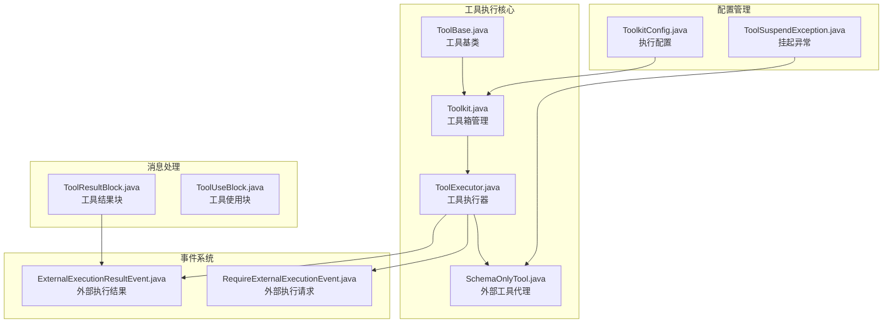
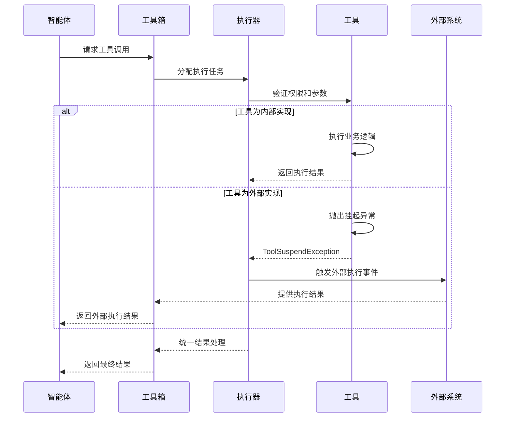
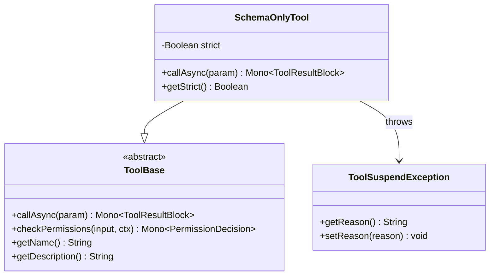
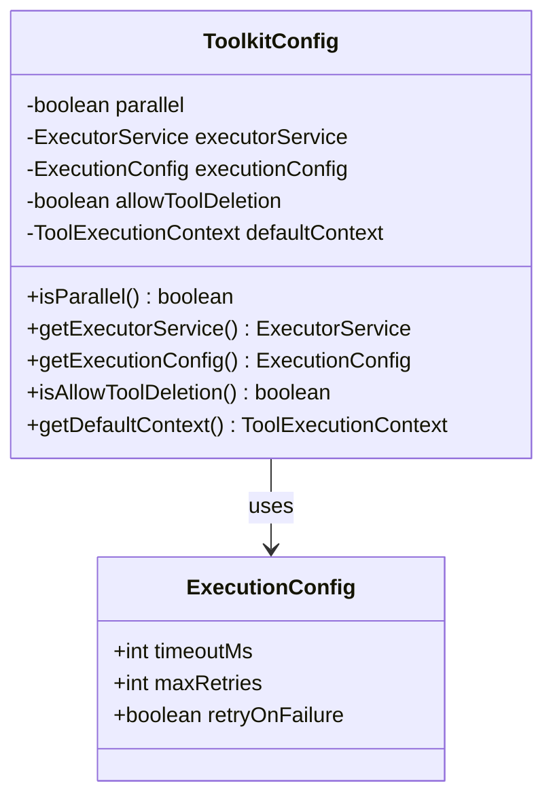
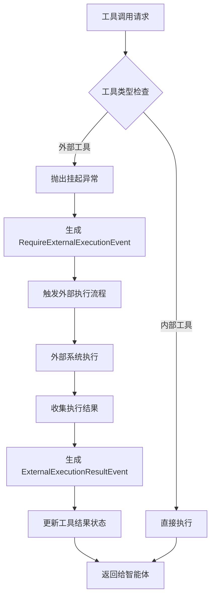
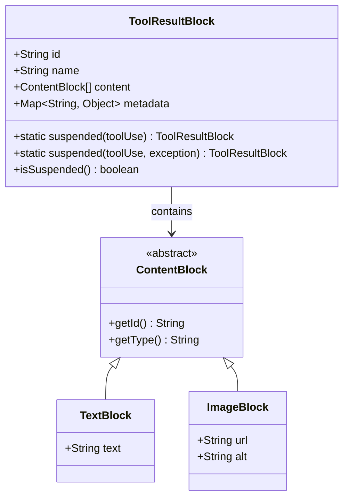
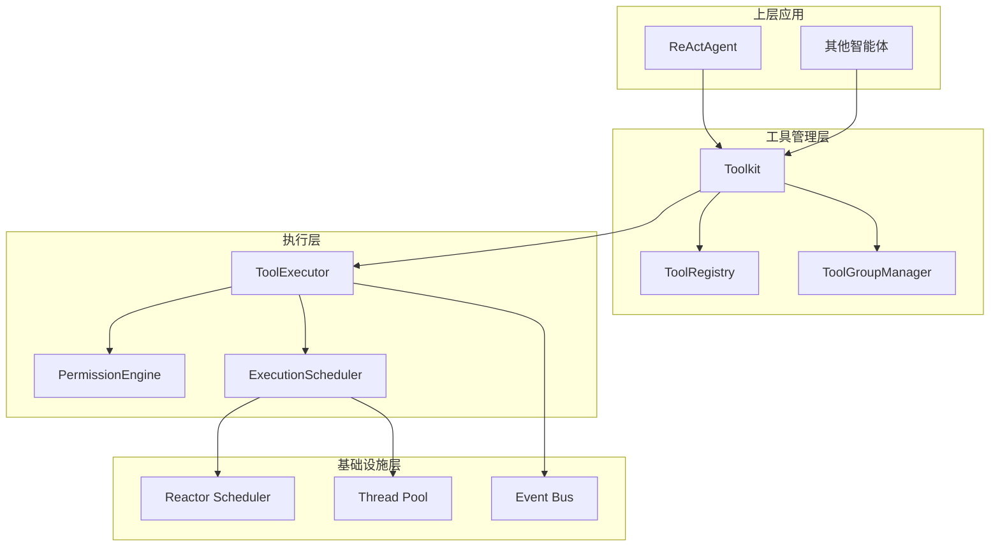
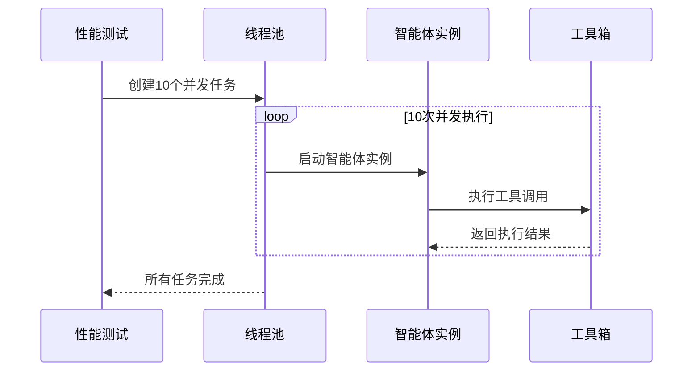

# 异步工具执行框架

<cite>
**本文档引用的文件**
- [SchemaOnlyTool.java](file://agentscope-core/src/main/java/io/agentscope/core/tool/SchemaOnlyTool.java)
- [ToolkitConfig.java](file://agentscope-core/src/main/java/io/agentscope/core/tool/ToolkitConfig.java)
- [Tool.java](file://agentscope-core/src/main/java/io/agentscope/core/tool/Tool.java)
- [ToolResultBlock.java](file://agentscope-core/src/main/java/io/agentscope/core/message/ToolResultBlock.java)
- [RequireExternalExecutionEvent.java](file://agentscope-core/src/main/java/io/agentscope/core/event/RequireExternalExecutionEvent.java)
- [ExternalExecutionResultEvent.java](file://agentscope-core/src/main/java/io/agentscope/core/event/ExternalExecutionResultEvent.java)
- [Tracer.java](file://agentscope-core/src/main/java/io/agentscope/core/tracing/Tracer.java)
- [StreamingHook.java](file://agentscope-core/src/main/java/io/agentscope/core/agent/StreamingHook.java)
- [Hook.java](file://agentscope-core/src/main/java/io/agentscope/core/hook/Hook.java)
- [AgentPerformanceTest.java](file://agentscope-core/src/test/java/io/agentscope/core/agent/integration/AgentPerformanceTest.java)
- [ReActAgentCoarseStreamTest.java](file://agentscope-core/src/test/java/io/agentscope/core/agent/ReActAgentCoarseStreamTest.java)
</cite>

## 目录
1. [简介](#简介)
2. [项目结构](#项目结构)
3. [核心组件](#核心组件)
4. [架构概览](#架构概览)
5. [详细组件分析](#详细组件分析)
6. [依赖关系分析](#依赖关系分析)
7. [性能考虑](#性能考虑)
8. [故障排除指南](#故障排除指南)
9. [结论](#结论)

## 简介

异步工具执行框架是 Agentscope Java 项目中的核心功能模块，负责管理智能体与外部工具之间的交互。该框架提供了完整的异步工具调用机制，支持工具注册、权限验证、并发执行、外部工具协调等功能。框架基于 Reactor 异步编程模型构建，确保高性能和响应式的工具执行体验。

## 项目结构

异步工具执行框架主要分布在以下核心包中：

**图表来源**
- [ToolBase.java](file://agentscope-core/src/main/java/io/agentscope/core/tool/ToolBase.java)
- [Toolkit.java](file://agentscope-core/src/main/java/io/agentscope/core/tool/Toolkit.java)
- [SchemaOnlyTool.java](file://agentscope-core/src/main/java/io/agentscope/core/tool/SchemaOnlyTool.java)
- [RequireExternalExecutionEvent.java](file://agentscope-core/src/main/java/io/agentscope/core/event/RequireExternalExecutionEvent.java)
- [ExternalExecutionResultEvent.java](file://agentscope-core/src/main/java/io/agentscope/core/event/ExternalExecutionResultEvent.java)

**章节来源**
- [ToolkitConfig.java:32-38](file://agentscope-core/src/main/java/io/agentscope/core/tool/ToolkitConfig.java#L32-L38)
- [SchemaOnlyTool.java:26-56](file://agentscope-core/src/main/java/io/agentscope/core/tool/SchemaOnlyTool.java#L26-L56)

## 核心组件

### 工具基础架构

框架的核心由多个相互协作的组件构成：

#### 工具接口定义
工具接口通过注解驱动的方式定义，支持多种执行模式：
- 同步/异步执行
- 权限控制
- 并发安全
- 外部工具标识

#### 工具执行配置
提供灵活的执行配置选项：
- 并行 vs 串行执行模式
- 自定义线程池
- 超时和重试机制
- 工具删除权限

#### 工具结果处理
统一的工具结果封装，支持：
- 文本、图像、数据块等多种内容类型
- 挂起状态管理
- 错误处理和恢复

**章节来源**
- [Tool.java:99-128](file://agentscope-core/src/main/java/io/agentscope/core/tool/Tool.java#L99-L128)
- [ToolkitConfig.java:32-38](file://agentscope-core/src/main/java/io/agentscope/core/tool/ToolkitConfig.java#L32-L38)
- [ToolResultBlock.java:156-186](file://agentscope-core/src/main/java/io/agentscope/core/message/ToolResultBlock.java#L156-L186)

## 架构概览

异步工具执行框架采用分层架构设计，确保高内聚低耦合：

**图表来源**
- [SchemaOnlyTool.java:135-138](file://agentscope-core/src/main/java/io/agentscope/core/tool/SchemaOnlyTool.java#L135-L138)
- [RequireExternalExecutionEvent.java:26-59](file://agentscope-core/src/main/java/io/agentscope/core/event/RequireExternalExecutionEvent.java#L26-L59)
- [ExternalExecutionResultEvent.java:26-59](file://agentscope-core/src/main/java/io/agentscope/core/event/ExternalExecutionResultEvent.java#L26-L59)

## 详细组件分析

### SchemaOnlyTool 外部工具代理

SchemaOnlyTool 是框架中用于外部工具执行的核心组件，实现了工具调用的挂起机制：

**图表来源**
- [SchemaOnlyTool.java:57-139](file://agentscope-core/src/main/java/io/agentscope/core/tool/SchemaOnlyTool.java#L57-L139)

外部工具代理的工作流程：

1. **工具注册阶段**：通过 `toolkit.registerSchema()` 或 `toolkit.registerAgentTool()` 注册外部工具
2. **调用触发阶段**：当模型返回工具调用请求时，SchemaOnlyTool 抛出 ToolSuspendException
3. **挂起处理阶段**：框架捕获异常并转换为挂起的 ToolResultBlock
4. **外部执行阶段**：生成 RequireExternalExecutionEvent 通知外部系统
5. **结果回传阶段**：外部系统执行完成后返回 ExternalExecutionResultEvent

**章节来源**
- [SchemaOnlyTool.java:26-56](file://agentscope-core/src/main/java/io/agentscope/core/tool/SchemaOnlyTool.java#L26-L56)
- [SchemaOnlyTool.java:135-138](file://agentscope-core/src/main/java/io/agentscope/core/tool/SchemaOnlyTool.java#L135-L138)

### 工具执行配置系统

ToolkitConfig 提供了灵活的执行配置选项：

**图表来源**
- [ToolkitConfig.java:32-38](file://agentscope-core/src/main/java/io/agentscope/core/tool/ToolkitConfig.java#L32-L38)

配置选项说明：
- **parallel**: 控制工具执行是否并行化
- **executorService**: 自定义线程池，为空时使用默认调度器
- **executionConfig**: 包含超时和重试策略
- **allowToolDeletion**: 是否允许动态删除工具
- **defaultContext**: 默认的工具执行上下文

**章节来源**
- [ToolkitConfig.java:21-31](file://agentscope-core/src/main/java/io/agentscope/core/tool/ToolkitConfig.java#L21-L31)

### 事件驱动的外部执行协调

框架通过事件系统实现外部工具执行的协调：

**图表来源**
- [RequireExternalExecutionEvent.java:26-59](file://agentscope-core/src/main/java/io/agentscope/core/event/RequireExternalExecutionEvent.java#L26-L59)
- [ExternalExecutionResultEvent.java:26-59](file://agentscope-core/src/main/java/io/agentscope/core/event/ExternalExecutionResultEvent.java#L26-L59)

事件处理流程：
1. **RequireExternalExecutionEvent**：当检测到外部工具调用时触发
2. **外部系统处理**：外部系统接收事件并执行相应操作
3. **结果回传**：通过 ExternalExecutionResultEvent 返回执行结果
4. **状态更新**：框架更新工具结果状态并继续智能体流程

**章节来源**
- [RequireExternalExecutionEvent.java:23-59](file://agentscope-core/src/main/java/io/agentscope/core/event/RequireExternalExecutionEvent.java#L23-L59)
- [ExternalExecutionResultEvent.java:23-59](file://agentscope-core/src/main/java/io/agentscope/core/event/ExternalExecutionResultEvent.java#L23-L59)

### 工具结果统一处理

ToolResultBlock 提供了统一的工具结果处理机制：

**图表来源**
- [ToolResultBlock.java:156-186](file://agentscope-core/src/main/java/io/agentscope/core/message/ToolResultBlock.java#L156-L186)

结果处理特性：
- **挂起状态管理**：通过 metadata 标记挂起状态
- **多格式支持**：支持文本、图像、数据等多种内容格式
- **统一接口**：提供静态工厂方法创建不同类型的工具结果

**章节来源**
- [ToolResultBlock.java:156-186](file://agentscope-core/src/main/java/io/agentscope/core/message/ToolResultBlock.java#L156-L186)

## 依赖关系分析

异步工具执行框架的依赖关系呈现清晰的层次结构：

**图表来源**
- [Tracer.java:41-74](file://agentscope-core/src/main/java/io/agentscope/core/tracing/Tracer.java#L41-L74)
- [StreamingHook.java:49-66](file://agentscope-core/src/main/java/io/agentscope/core/agent/StreamingHook.java#L49-L66)

依赖关系特点：
- **松耦合设计**：各层之间通过接口通信，降低耦合度
- **可扩展性**：支持自定义执行器和权限引擎
- **可观测性**：通过 Tracer 和 Hook 系统提供完整的监控能力

**章节来源**
- [Tracer.java:41-74](file://agentscope-core/src/main/java/io/agentscope/core/tracing/Tracer.java#L41-L74)
- [Hook.java:56-96](file://agentscope-core/src/main/java/io/agentscope/core/hook/Hook.java#L56-L96)

## 性能考虑

框架在设计时充分考虑了性能优化：

### 并发执行策略
- **默认异步执行**：所有工具调用默认使用 Reactor 的异步调度
- **并行配置**：通过 ToolkitConfig 控制工具执行的并行程度
- **线程池优化**：支持自定义线程池以适应不同负载场景

### 内存管理
- **流式处理**：支持大型工具输出的流式传输
- **资源清理**：自动管理工具执行过程中的资源分配和释放
- **内存限制**：通过配置控制工具执行的内存使用上限

### 性能测试验证

框架包含完善的性能测试用例，验证并发执行的稳定性：

**图表来源**
- [AgentPerformanceTest.java:75-118](file://agentscope-core/src/test/java/io/agentscope/core/agent/integration/AgentPerformanceTest.java#L75-L118)

**章节来源**
- [AgentPerformanceTest.java:56-118](file://agentscope-core/src/test/java/io/agentscope/core/agent/integration/AgentPerformanceTest.java#L56-L118)
- [ReActAgentCoarseStreamTest.java:124-131](file://agentscope-core/src/test/java/io/agentscope/core/agent/ReActAgentCoarseStreamTest.java#L124-L131)

## 故障排除指南

### 常见问题及解决方案

#### 工具执行超时
**问题描述**：工具执行超过配置的超时时间
**解决方法**：
1. 检查 ExecutionConfig 的 timeoutMs 设置
2. 优化工具执行逻辑或增加超时时间
3. 考虑使用异步执行替代同步阻塞

#### 外部工具挂起状态异常
**问题描述**：外部工具调用后无法正常恢复
**解决方法**：
1. 确认 RequireExternalExecutionEvent 和 ExternalExecutionResultEvent 的配对
2. 检查工具结果的状态标记
3. 验证事件处理流程的完整性

#### 并发执行冲突
**问题描述**：多个智能体并发执行时出现资源竞争
**解决方法**：
1. 使用合适的并发配置（parallel vs sequential）
2. 实现工具的并发安全性
3. 检查共享资源的访问控制

**章节来源**
- [ToolkitConfig.java:21-31](file://agentscope-core/src/main/java/io/agentscope/core/tool/ToolkitConfig.java#L21-L31)
- [ToolResultBlock.java:156-186](file://agentscope-core/src/main/java/io/agentscope/core/message/ToolResultBlock.java#L156-L186)

## 结论

异步工具执行框架通过精心设计的架构和丰富的功能特性，为智能体系统提供了强大而灵活的工具执行能力。框架的主要优势包括：

1. **高度异步化**：基于 Reactor 的完全异步执行模型
2. **灵活的配置**：支持多种执行模式和自定义配置
3. **完善的事件系统**：通过事件驱动实现外部工具协调
4. **优秀的性能表现**：经过充分的并发测试验证
5. **良好的扩展性**：支持自定义工具、执行器和权限引擎

该框架为构建复杂的智能体应用奠定了坚实的基础，能够满足从简单工具调用到复杂多智能体协作的各种应用场景需求。
