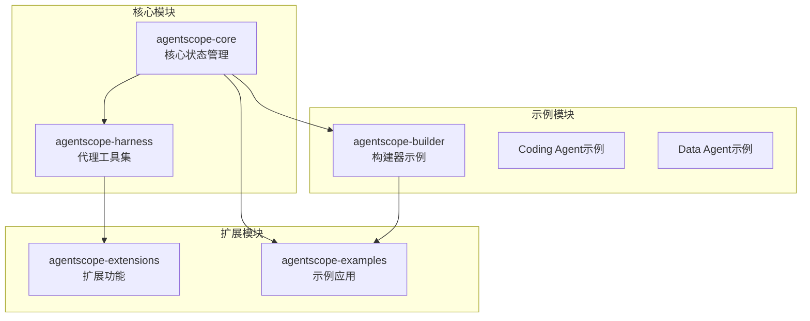
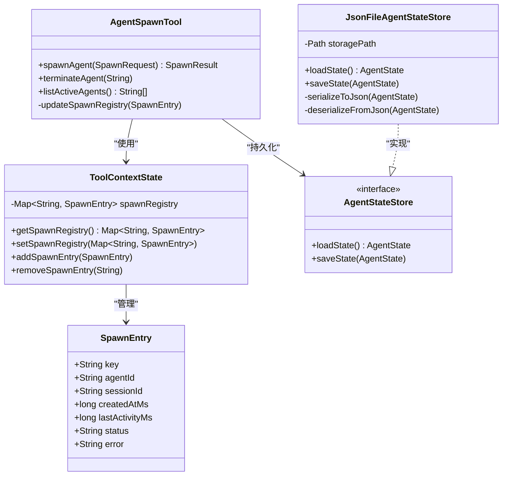
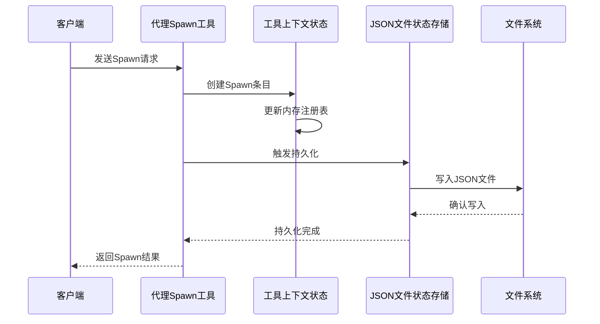
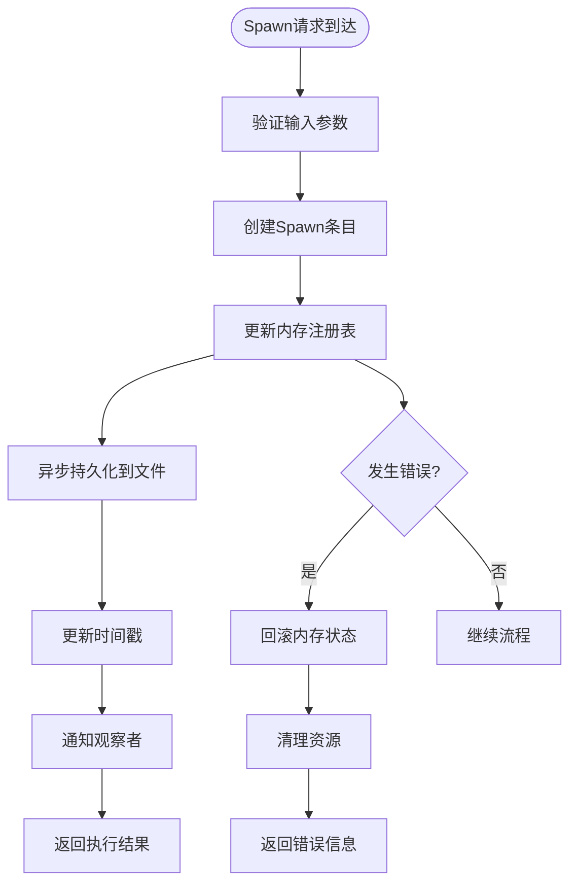
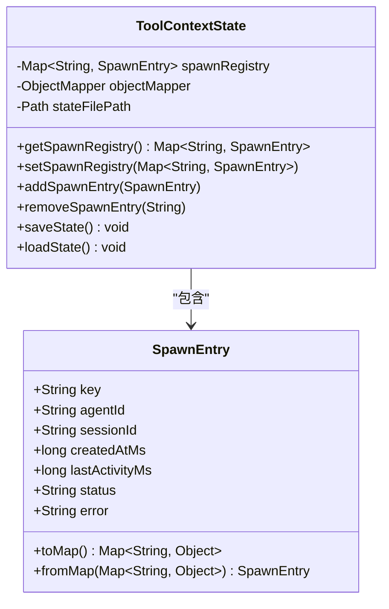
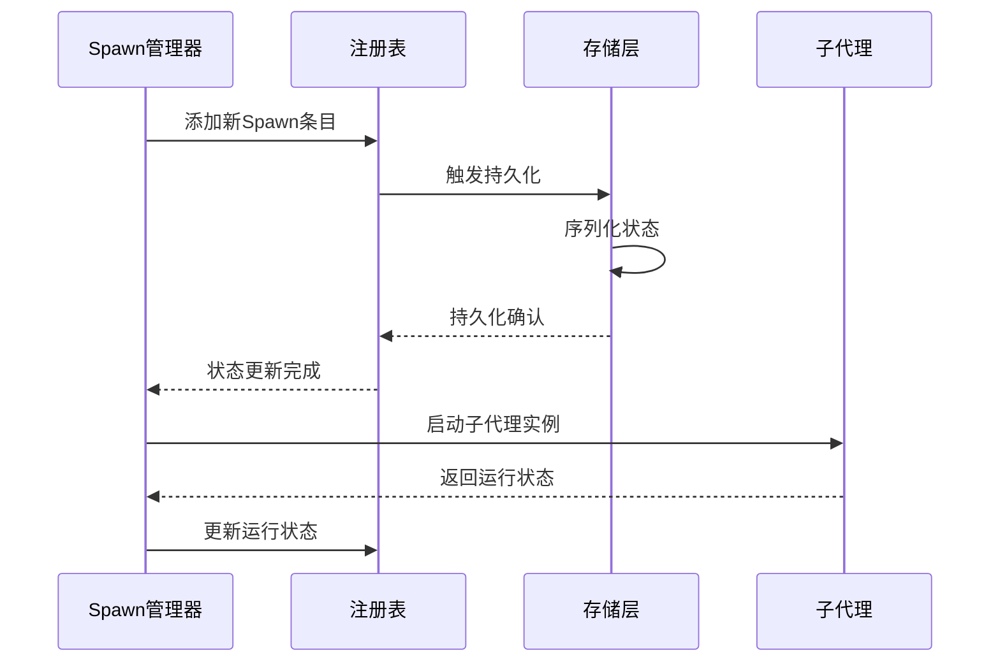
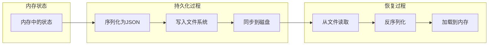
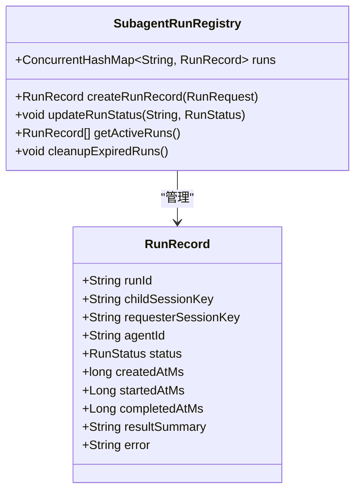
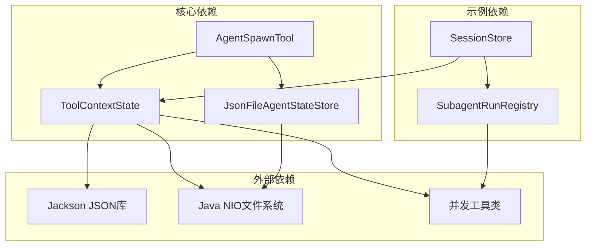

# 持久化Spawn注册表

<cite>
**本文档引用的文件**
- [ToolContextState.java](file://agentscope-core/src/main/java/io/agentscope/core/state/ToolContextState.java)
- [AgentStateStore.java](file://agentscope-core/src/main/java/io/agentscope/core/state/AgentStateStore.java)
- [JsonFileAgentStateStore.java](file://agentscope-core/src/main/java/io/agentscope/core/state/JsonFileAgentStateStore.java)
- [AgentSpawnTool.java](file://agentscope-harness/src/main/java/io/agentscope/harness/agent/tool/AgentSpawnTool.java)
- [SubagentRunRegistry.java](file://agentscope-examples/agents/agentscope-builder/src/main/java/io/agentscope/builder/runtime/session/SubagentRunRegistry.java)
- [SessionStore.java](file://agentscope-examples/agents/agentscope-builder/src/main/java/io/agentscope/builder/runtime/session/SessionStore.java)
- [SessionEntry.java](file://agentscope-examples/agents/agentscope-builder/src/main/java/io/agentscope/builder/runtime/session/SessionEntry.java)
- [SpawnResult.java](file://agentscope-examples/agents/agentscope-builder/src/main/java/io/agentscope/builder/runtime/session/SpawnResult.java)
</cite>

## 目录
1. [简介](#简介)
2. [项目结构](#项目结构)
3. [核心组件](#核心组件)
4. [架构概览](#架构概览)
5. [详细组件分析](#详细组件分析)
6. [依赖关系分析](#依赖关系分析)
7. [性能考虑](#性能考虑)
8. [故障排除指南](#故障排除指南)
9. [结论](#结论)

## 简介

本文档深入分析了Agentscope Java项目中的持久化Spawn注册表系统。该系统负责管理子代理（subagent）的生命周期、状态持久化以及运行时元数据的跟踪。通过结合内存中的运行时注册表和磁盘持久化机制，系统实现了可靠的子代理管理能力。

持久化Spawn注册表是Agentscope框架中一个关键组件，它不仅维护子代理的运行状态，还提供了跨进程重启的数据恢复能力。该系统采用分层架构设计，将运行时状态与持久化存储分离，确保系统的高可用性和数据完整性。

## 项目结构

项目采用多模块架构，主要包含以下核心模块：



**图表来源**
- [ToolContextState.java:1-150](file://agentscope-core/src/main/java/io/agentscope/core/state/ToolContextState.java#L1-L150)
- [AgentSpawnTool.java:1-100](file://agentscope-harness/src/main/java/io/agentscope/harness/agent/tool/AgentSpawnTool.java#L1-L100)

**章节来源**
- [ToolContextState.java:1-150](file://agentscope-core/src/main/java/io/agentscope/core/state/ToolContextState.java#L1-L150)
- [AgentStateStore.java:1-100](file://agentscope-core/src/main/java/io/agentscope/core/state/AgentStateStore.java#L1-L100)

## 核心组件

持久化Spawn注册表系统由多个相互协作的组件构成，每个组件都有明确的职责分工：

### 主要组件架构



**图表来源**
- [ToolContextState.java:50-140](file://agentscope-core/src/main/java/io/agentscope/core/state/ToolContextState.java#L50-L140)
- [AgentStateStore.java:1-80](file://agentscope-core/src/main/java/io/agentscope/core/state/AgentStateStore.java#L1-L80)
- [JsonFileAgentStateStore.java:1-120](file://agentscope-core/src/main/java/io/agentscope/core/state/JsonFileAgentStateStore.java#L1-L120)
- [AgentSpawnTool.java:800-900](file://agentscope-harness/src/main/java/io/agentscope/harness/agent/tool/AgentSpawnTool.java#L800-L900)

### 组件职责说明

1. **ToolContextState**: 核心状态容器，维护子代理注册表的内存映射
2. **AgentStateStore**: 状态存储接口，定义持久化规范
3. **JsonFileAgentStateStore**: 具体实现，提供JSON格式的文件存储
4. **AgentSpawnTool**: 代理管理工具，协调Spawn操作和状态更新
5. **SubagentRunRegistry**: 运行时注册表，提供临时的运行状态跟踪

**章节来源**
- [ToolContextState.java:50-140](file://agentscope-core/src/main/java/io/agentscope/core/state/ToolContextState.java#L50-L140)
- [AgentSpawnTool.java:800-900](file://agentscope-harness/src/main/java/io/agentscope/harness/agent/tool/AgentSpawnTool.java#L800-L900)

## 架构概览

持久化Spawn注册表采用了分层架构设计，实现了状态管理的解耦和可扩展性：



**图表来源**
- [AgentSpawnTool.java:820-850](file://agentscope-harness/src/main/java/io/agentscope/harness/agent/tool/AgentSpawnTool.java#L820-L850)
- [JsonFileAgentStateStore.java:80-120](file://agentscope-core/src/main/java/io/agentscope/core/state/JsonFileAgentStateStore.java#L80-L120)

### 数据流架构

系统采用异步数据流模式，确保Spawn操作的非阻塞性和高并发处理能力：



**图表来源**
- [ToolContextState.java:120-140](file://agentscope-core/src/main/java/io/agentscope/core/state/ToolContextState.java#L120-L140)
- [AgentSpawnTool.java:828-842](file://agentscope-harness/src/main/java/io/agentscope/harness/agent/tool/AgentSpawnTool.java#L828-L842)

## 详细组件分析

### ToolContextState组件

ToolContextState是持久化Spawn注册表的核心组件，负责管理子代理的状态和生命周期：

#### 核心数据结构



**图表来源**
- [ToolContextState.java:50-140](file://agentscope-core/src/main/java/io/agentscope/core/state/ToolContextState.java#L50-L140)

#### 状态管理机制

ToolContextState采用延迟加载和懒初始化策略，只有在需要时才进行状态持久化：

**章节来源**
- [ToolContextState.java:54-140](file://agentscope-core/src/main/java/io/agentscope/core/state/ToolContextState.java#L54-L140)

### AgentSpawnTool组件

AgentSpawnTool是Spawn操作的主要协调者，负责整个Spawn生命周期的管理：

#### Spawn流程控制



**图表来源**
- [AgentSpawnTool.java:828-842](file://agentscope-harness/src/main/java/io/agentscope/harness/agent/tool/AgentSpawnTool.java#L828-L842)

#### 错误处理机制

AgentSpawnTool实现了完善的错误处理和恢复机制：

**章节来源**
- [AgentSpawnTool.java:828-842](file://agentscope-harness/src/main/java/io/agentscope/harness/agent/tool/AgentSpawnTool.java#L828-L842)

### JsonFileAgentStateStore组件

JsonFileAgentStateStore提供了可靠的状态持久化能力，确保系统重启后能够恢复之前的状态：

#### 持久化策略



**图表来源**
- [JsonFileAgentStateStore.java:80-120](file://agentscope-core/src/main/java/io/agentscope/core/state/JsonFileAgentStateStore.java#L80-L120)

**章节来源**
- [JsonFileAgentStateStore.java:1-120](file://agentscope-core/src/main/java/io/agentscope/core/state/JsonFileAgentStateStore.java#L1-L120)

### 示例模块集成

示例模块展示了如何在实际应用中使用持久化Spawn注册表：

#### SubagentRunRegistry运行时管理



**图表来源**
- [SubagentRunRegistry.java:20-45](file://agentscope-examples/agents/agentscope-builder/src/main/java/io/agentscope/builder/runtime/session/SubagentRunRegistry.java#L20-L45)

**章节来源**
- [SubagentRunRegistry.java:1-45](file://agentscope-examples/agents/agentscope-builder/src/main/java/io/agentscope/builder/runtime/session/SubagentRunRegistry.java#L1-L45)

## 依赖关系分析

持久化Spawn注册表系统具有清晰的依赖层次结构，各组件之间的耦合度适中：



**图表来源**
- [ToolContextState.java:1-50](file://agentscope-core/src/main/java/io/agentscope/core/state/ToolContextState.java#L1-L50)
- [AgentSpawnTool.java:1-50](file://agentscope-harness/src/main/java/io/agentscope/harness/agent/tool/AgentSpawnTool.java#L1-L50)

### 关键依赖特性

1. **低耦合设计**: 核心组件通过接口抽象实现松耦合
2. **可测试性**: 清晰的依赖边界便于单元测试
3. **可扩展性**: 插件化的存储后端支持
4. **线程安全**: 并发访问的安全保证

**章节来源**
- [ToolContextState.java:1-50](file://agentscope-core/src/main/java/io/agentscope/core/state/ToolContextState.java#L1-L50)
- [AgentStateStore.java:1-80](file://agentscope-core/src/main/java/io/agentscope/core/state/AgentStateStore.java#L1-L80)

## 性能考虑

持久化Spawn注册表系统在设计时充分考虑了性能优化：

### 性能优化策略

1. **异步持久化**: 避免阻塞主业务流程
2. **批量操作**: 支持批量状态更新
3. **缓存机制**: 内存缓存减少磁盘I/O
4. **增量更新**: 只更新变化的部分

### 性能监控指标

- **持久化延迟**: 状态更新到磁盘的时间
- **查询响应时间**: 注册表查询的响应时间
- **内存使用量**: 内存中状态的占用情况
- **磁盘I/O频率**: 文件系统的读写频率

## 故障排除指南

### 常见问题及解决方案

#### 状态不同步问题

**问题描述**: 内存状态与磁盘状态不一致

**诊断步骤**:
1. 检查持久化文件是否存在
2. 验证JSON格式是否正确
3. 确认文件权限设置

**解决方法**:
```java
// 强制重新加载状态
toolContextState.loadState();
// 验证状态一致性
validateStateConsistency();
```

#### 并发访问冲突

**问题描述**: 多线程环境下状态更新冲突

**解决方案**:
- 使用读写锁保护共享状态
- 实现乐观锁机制
- 提供重试机制

#### 磁盘空间不足

**问题描述**: 磁盘空间不足导致持久化失败

**预防措施**:
- 实施磁盘空间监控
- 提供自动清理机制
- 设置容量告警阈值

**章节来源**
- [ToolContextState.java:120-140](file://agentscope-core/src/main/java/io/agentscope/core/state/ToolContextState.java#L120-L140)
- [JsonFileAgentStateStore.java:80-120](file://agentscope-core/src/main/java/io/agentscope/core/state/JsonFileAgentStateStore.java#L80-L120)

## 结论

持久化Spawn注册表系统展现了优秀的软件工程实践，通过合理的架构设计和实现策略，成功解决了子代理管理中的关键挑战。系统的主要优势包括：

1. **可靠性**: 通过磁盘持久化确保状态不丢失
2. **可扩展性**: 模块化设计支持功能扩展
3. **性能**: 异步处理和缓存机制提升响应速度
4. **可维护性**: 清晰的代码结构便于维护和调试

该系统为Agentscope框架提供了坚实的基础，支持复杂的子代理管理和分布式部署场景。未来可以在以下方面进一步改进：
- 增强监控和告警机制
- 优化大规模并发场景的性能
- 扩展更多存储后端选项
- 提供更丰富的状态查询接口
