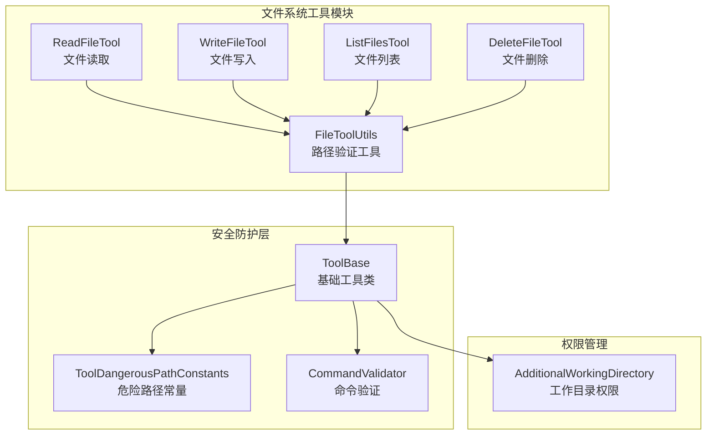
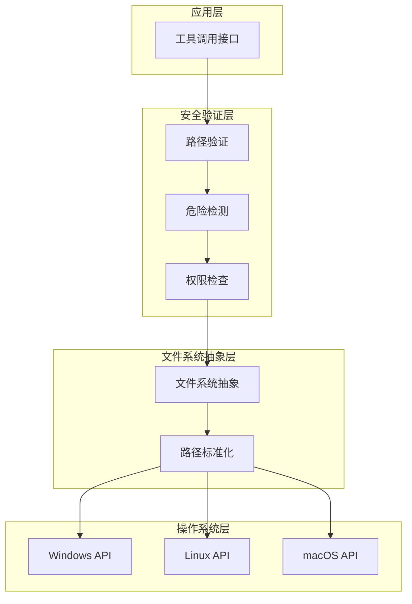
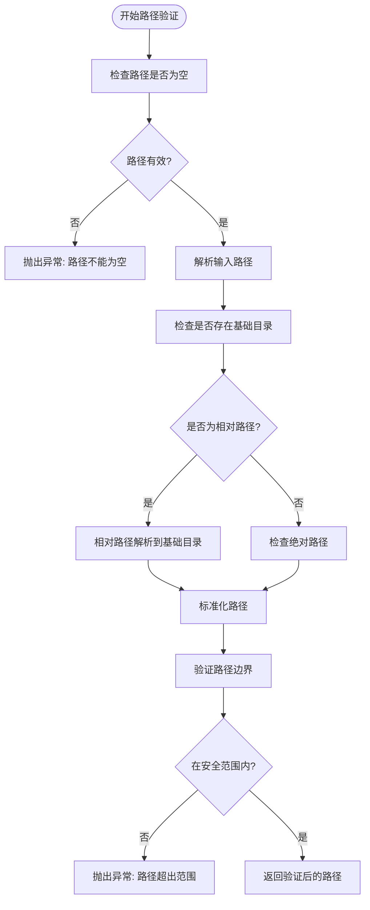
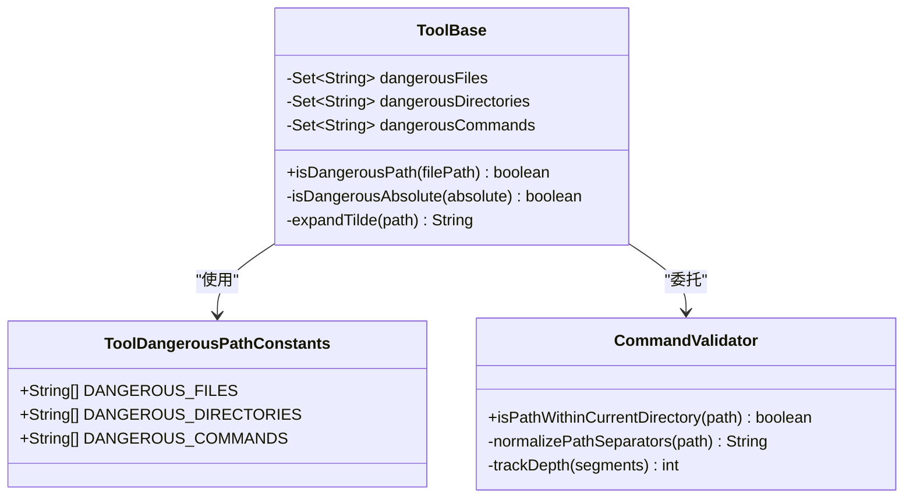
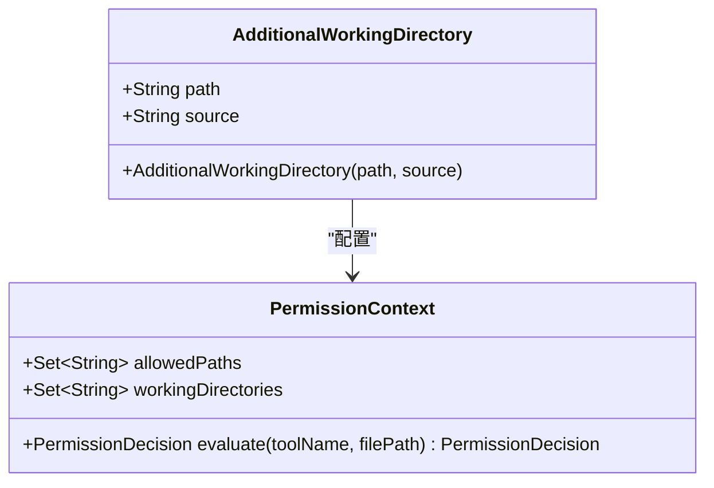
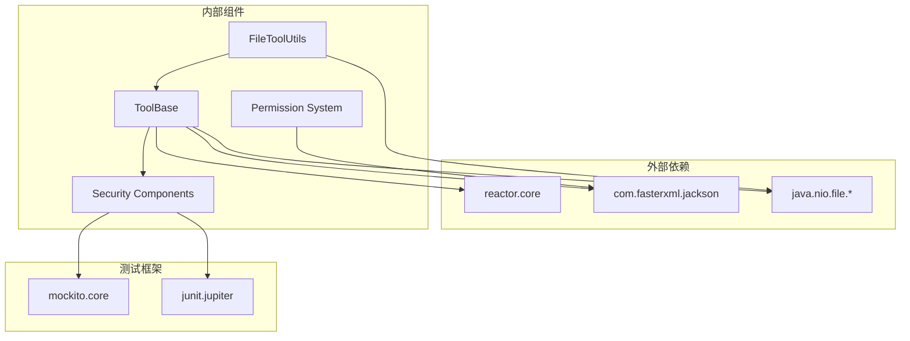

# 文件系统跨平台支持

<cite>
**本文档引用的文件**
- [FileToolUtils.java](file://agentscope-core/src/main/java/io/agentscope/core/tool/file/FileToolUtils.java)
- [ToolBase.java](file://agentscope-core/src/main/java/io/agentscope/core/tool/ToolBase.java)
- [ToolDangerousPathConstants.java](file://agentscope-core/src/main/java/io/agentscope/core/tool/ToolDangerousPathConstants.java)
- [CommandValidator.java](file://agentscope-core/src/main/java/io/agentscope/core/tool/coding/CommandValidator.java)
- [AdditionalWorkingDirectory.java](file://agentscope-core/src/main/java/io/agentscope/core/permission/AdditionalWorkingDirectory.java)
- [ReadFileTool.java](file://agentscope-core/src/main/java/io/agentscope/core/tool/file/ReadFileTool.java)
- [WriteFileTool.java](file://agentscope-core/src/main/java/io/agentscope/core/tool/file/WriteFileTool.java)
- [ListFilesTool.java](file://agentscope-core/src/main/java/io/agentscope/core/tool/file/ListFilesTool.java)
- [DeleteFileTool.java](file://agentscope-core/src/main/java/io/agentscope/core/tool/file/DeleteFileTool.java)
</cite>

## 目录
1. [简介](#简介)
2. [项目结构](#项目结构)
3. [核心组件](#核心组件)
4. [架构概览](#架构概览)
5. [详细组件分析](#详细组件分析)
6. [依赖关系分析](#依赖关系分析)
7. [性能考虑](#性能考虑)
8. [故障排除指南](#故障排除指南)
9. [结论](#结论)

## 简介

Agentscope Java项目在文件系统跨平台支持方面采用了多层次的安全防护机制。该系统通过统一的路径验证、危险路径检测和权限控制来确保在不同操作系统（Windows、Linux、macOS）上的安全文件操作。

系统的核心设计目标是在保持跨平台兼容性的同时，提供严格的安全边界，防止路径遍历攻击和未经授权的文件访问。通过标准化的路径处理和严格的权限验证，确保工具在各种环境下的可靠运行。

## 项目结构

文件系统相关功能主要分布在以下模块中：

**图表来源**
- [FileToolUtils.java:1-100](file://agentscope-core/src/main/java/io/agentscope/core/tool/file/FileToolUtils.java#L1-L100)
- [ToolBase.java:1-300](file://agentscope-core/src/main/java/io/agentscope/core/tool/ToolBase.java#L1-L300)
- [AdditionalWorkingDirectory.java:1-39](file://agentscope-core/src/main/java/io/agentscope/core/permission/AdditionalWorkingDirectory.java#L1-L39)

**章节来源**
- [FileToolUtils.java:1-100](file://agentscope-core/src/main/java/io/agentscope/core/tool/file/FileToolUtils.java#L1-L100)
- [ToolBase.java:1-300](file://agentscope-core/src/main/java/io/agentscope/core/tool/ToolBase.java#L1-L300)

## 核心组件

### 路径验证系统

文件系统安全的核心是统一的路径验证机制，该机制确保所有文件操作都在预定义的安全边界内进行。

#### FileToolUtils - 路径验证工具

路径验证系统提供了以下核心功能：

- **相对路径解析**：将相对路径相对于指定的基础目录解析
- **绝对路径规范化**：转换为标准的绝对路径格式
- **路径遍历防护**：防止通过特殊字符逃逸到安全边界之外
- **跨平台兼容**：自动处理不同操作系统的路径分隔符差异

#### ToolBase - 安全基类

基础工具类实现了全面的安全检查机制：

- **危险文件检测**：识别可能对系统造成损害的文件类型
- **危险目录检测**：防止访问系统关键目录
- **符号链接解析**：检测并处理可能绕过安全限制的符号链接
- **用户主目录展开**：正确处理波浪号（~）表示的用户主目录

**章节来源**
- [FileToolUtils.java:34-64](file://agentscope-core/src/main/java/io/agentscope/core/tool/file/FileToolUtils.java#L34-L64)
- [ToolBase.java:218-260](file://agentscope-core/src/main/java/io/agentscope/core/tool/ToolBase.java#L218-L260)

## 架构概览

文件系统跨平台支持采用分层架构设计，每层都有特定的安全职责：

**图表来源**
- [ToolBase.java:218-260](file://agentscope-core/src/main/java/io/agentscope/core/tool/ToolBase.java#L218-L260)
- [FileToolUtils.java:49-64](file://agentscope-core/src/main/java/io/agentscope/core/tool/file/FileToolUtils.java#L49-L64)

## 详细组件分析

### 路径验证流程

路径验证是整个文件系统安全机制的核心，采用多阶段验证策略：

**图表来源**
- [FileToolUtils.java:49-64](file://agentscope-core/src/main/java/io/agentscope/core/tool/file/FileToolUtils.java#L49-L64)

#### 危险路径检测算法

系统实现了复杂的危险路径检测机制，能够识别潜在威胁：

**图表来源**
- [ToolBase.java:218-260](file://agentscope-core/src/main/java/io/agentscope/core/tool/ToolBase.java#L218-L260)
- [ToolDangerousPathConstants.java:66-80](file://agentscope-core/src/main/java/io/agentscope/core/tool/ToolDangerousPathConstants.java#L66-L80)
- [CommandValidator.java:119-121](file://agentscope-core/src/main/java/io/agentscope/core/tool/coding/CommandValidator.java#L119-L121)

### 权限控制系统

权限控制是文件系统安全的重要组成部分，通过多层次的权限检查确保操作的安全性：

#### AdditionalWorkingDirectory - 工作目录权限

**图表来源**
- [AdditionalWorkingDirectory.java:31-39](file://agentscope-core/src/main/java/io/agentscope/core/permission/AdditionalWorkingDirectory.java#L31-L39)

**章节来源**
- [AdditionalWorkingDirectory.java:22-39](file://agentscope-core/src/main/java/io/agentscope/core/permission/AdditionalWorkingDirectory.java#L22-L39)

### 文件操作工具

系统提供了多种文件操作工具，每个工具都遵循统一的安全规范：

#### ReadFileTool - 文件读取工具

文件读取工具实现了完整的安全检查流程：

1. **路径验证**：使用FileToolUtils.validatePath()确保路径安全
2. **存在性检查**：验证目标文件是否存在
3. **权限验证**：检查读取权限
4. **内容读取**：安全地读取文件内容

#### WriteFileTool - 文件写入工具

文件写入工具提供了更严格的安全检查：

1. **行号验证**：确保插入位置的有效性
2. **路径验证**：确认目标文件在安全范围内
3. **文件存在性**：验证目标文件已存在
4. **内容处理**：安全地处理文件内容修改

**章节来源**
- [ReadFileTool.java:1-200](file://agentscope-core/src/main/java/io/agentscope/core/tool/file/ReadFileTool.java#L1-L200)
- [WriteFileTool.java:102-148](file://agentscope-core/src/main/java/io/agentscope/core/tool/file/WriteFileTool.java#L102-L148)

## 依赖关系分析

文件系统安全机制的依赖关系体现了清晰的分层设计：

**图表来源**
- [FileToolUtils.java:1-50](file://agentscope-core/src/main/java/io/agentscope/core/tool/file/FileToolUtils.java#L1-L50)
- [ToolBase.java:1-50](file://agentscope-core/src/main/java/io/agentscope/core/tool/ToolBase.java#L1-L50)

**章节来源**
- [FileToolUtils.java:1-50](file://agentscope-core/src/main/java/io/agentscope/core/tool/file/FileToolUtils.java#L1-L50)
- [ToolBase.java:1-50](file://agentscope-core/src/main/java/io/agentscope/core/tool/ToolBase.java#L1-L50)

## 性能考虑

文件系统跨平台支持在性能方面的优化策略：

### 路径处理优化

1. **延迟解析**：仅在必要时进行路径解析和标准化
2. **缓存机制**：对常用路径进行缓存以减少重复计算
3. **批量操作**：支持批量文件操作以提高效率

### 内存管理

1. **流式处理**：大文件采用流式读取避免内存溢出
2. **资源管理**：使用try-with-resources确保资源及时释放
3. **对象复用**：重用缓冲区和其他临时对象

### 并发安全

1. **不可变对象**：使用不可变数据结构确保线程安全
2. **无锁设计**：尽量避免使用锁机制
3. **原子操作**：对关键操作使用原子操作保证一致性

## 故障排除指南

### 常见问题及解决方案

#### 路径验证失败

**问题描述**：文件路径被拒绝访问
**可能原因**：
- 路径包含非法字符或序列
- 路径超出安全边界
- 相对路径解析失败

**解决步骤**：
1. 检查路径字符串是否包含特殊字符
2. 验证路径是否在允许的目录范围内
3. 确认相对路径的解析逻辑

#### 权限不足错误

**问题描述**：文件操作被拒绝
**可能原因**：
- 用户没有足够的文件系统权限
- 目标文件位于受保护的系统目录
- 符号链接指向危险位置

**解决步骤**：
1. 检查用户权限设置
2. 验证目标文件位置的安全性
3. 检查符号链接的目标路径

#### 跨平台兼容性问题

**问题描述**：在某些操作系统上出现异常行为
**可能原因**：
- 路径分隔符处理不一致
- 文件名大小写敏感性差异
- 文件系统权限模型差异

**解决步骤**：
1. 使用标准化的路径处理方法
2. 统一处理文件名大小写
3. 遵循各平台的权限管理最佳实践

**章节来源**
- [FileToolUtils.java:49-64](file://agentscope-core/src/main/java/io/agentscope/core/tool/file/FileToolUtils.java#L49-L64)
- [ToolBase.java:218-260](file://agentscope-core/src/main/java/io/agentscope/core/tool/ToolBase.java#L218-L260)

## 结论

Agentscope Java项目的文件系统跨平台支持通过多层次的安全防护机制，成功实现了在不同操作系统环境下的安全文件操作。系统的设计充分考虑了安全性、可维护性和性能要求。

关键成就包括：

1. **统一的安全边界**：通过FileToolUtils实现了一致的路径验证机制
2. **全面的危险检测**：ToolBase提供了多层次的危险路径识别能力
3. **灵活的权限控制**：AdditionalWorkingDirectory支持细粒度的权限管理
4. **跨平台兼容性**：通过标准化的路径处理确保在各种操作系统上的正常运行

这些特性使得Agentscope能够在复杂的生产环境中安全可靠地执行文件系统操作，为构建企业级AI代理应用奠定了坚实的基础。
