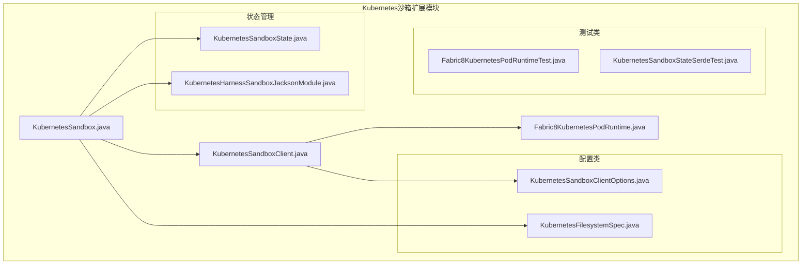
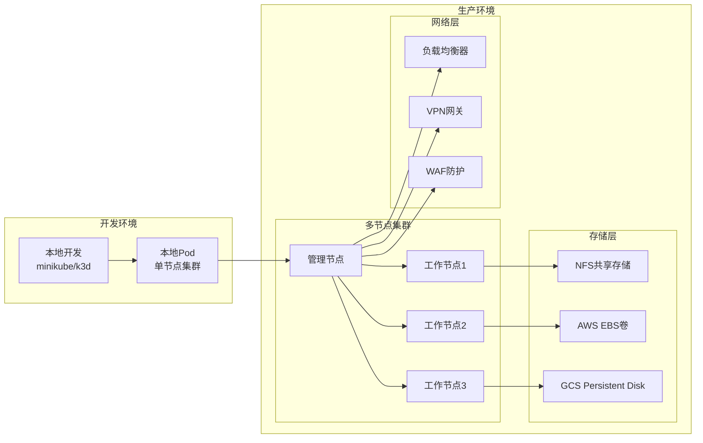
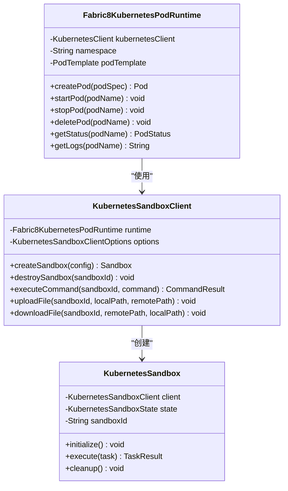
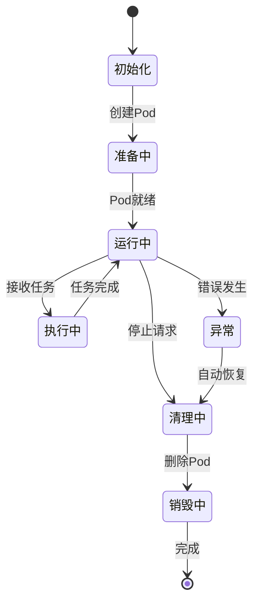
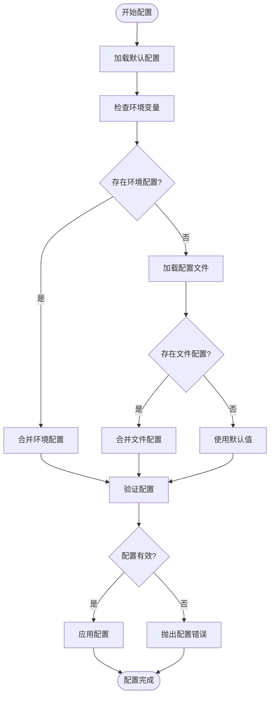
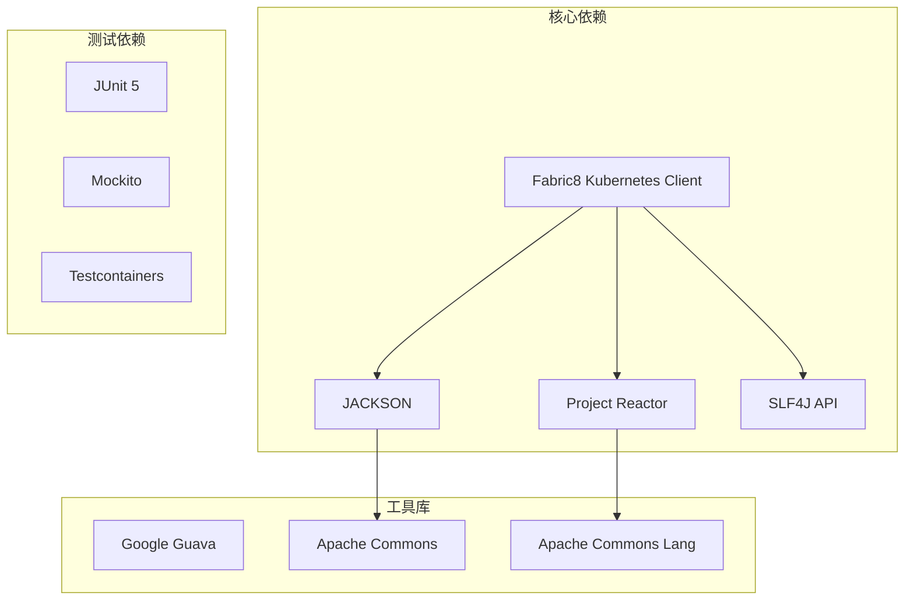
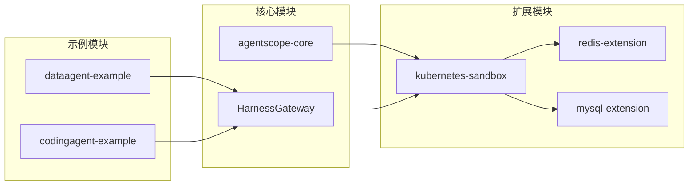
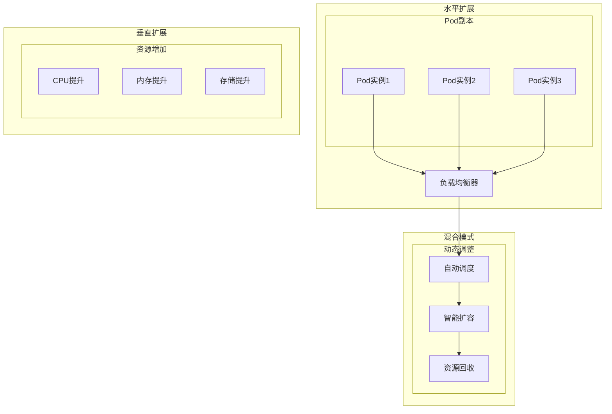
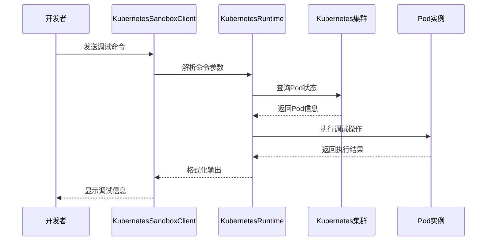

# 增强的Kubernetes集成

<cite>
**本文档引用的文件**
- [Fabric8KubernetesPodRuntime.java](file://agentscope-extensions/agentscope-extensions-sandbox/agentscope-extensions-sandbox-kubernetes/src/main/java/io/agentscope/extensions/sandbox/kubernetes/Fabric8KubernetesPodRuntime.java)
- [KubernetesSandbox.java](file://agentscope-extensions/agentscope-extensions-sandbox/agentscope-extensions-sandbox-kubernetes/src/main/java/io/agentscope/extensions/sandbox/kubernetes/KubernetesSandbox.java)
- [KubernetesSandboxClient.java](file://agentscope-extensions/agentscope-extensions-sandbox/agentscope-extensions-sandbox-kubernetes/src/main/java/io/agentscope/extensions/sandbox/kubernetes/KubernetesSandboxClient.java)
- [KubernetesSandboxClientOptions.java](file://agentscope-extensions/agentscope-extensions-sandbox/agentscope-extensions-sandbox-kubernetes/src/main/java/io/agentscope/extensions/sandbox/kubernetes/KubernetesSandboxClientOptions.java)
- [KubernetesSandboxState.java](file://agentscope-extensions/agentscope-extensions-sandbox/agentscope-extensions-sandbox-kubernetes/src/main/java/io/agentscope/extensions/sandbox/kubernetes/KubernetesSandboxState.java)
- [KubernetesFilesystemSpec.java](file://agentscope-extensions/agentscope-extensions-sandbox/agentscope-extensions-sandbox-kubernetes/src/main/java/io/agentscope/extensions/sandbox/kubernetes/KubernetesFilesystemSpec.java)
- [KubernetesHarnessSandboxJacksonModule.java](file://agentscope-extensions/agentscope-extensions-sandbox/agentscope-extensions-sandbox-kubernetes/src/main/java/io/agentscope/extensions/sandbox/kubernetes/KubernetesHarnessSandboxJacksonModule.java)
- [Fabric8KubernetesPodRuntimeTest.java](file://agentscope-extensions/agentscope-extensions-sandbox/agentscope-extensions-sandbox-kubernetes/src/test/java/io/agentscope/extensions/sandbox/kubernetes/Fabric8KubernetesPodRuntimeTest.java)
- [KubernetesSandboxStateSerdeTest.java](file://agentscope-extensions/agentscope-extensions-sandbox/agentscope-extensions-sandbox-kubernetes/src/test/java/io/agentscope/extensions/sandbox/kubernetes/KubernetesSandboxStateSerdeTest.java)
- [pom.xml](file://agentscope-extensions/agentscope-extensions-sandbox/agentscope-extensions-sandbox-kubernetes/pom.xml)
- [pom.xml](file://agentscope-dependencies-bom/pom.xml)
- [cluster-deploy.md](file://agentscope-examples/agents/agentscope-dataagent/docs/cluster-deploy.md)
- [ENV_VARS.md](file://agentscope-examples/agents/agentscope-codingagent/ENV_VARS.md)
- [README_zh.md](file://agentscope-examples/agents/agentscope-dataagent/README_zh.md)
</cite>

## 目录
1. [简介](#简介)
2. [项目结构](#项目结构)
3. [核心组件](#核心组件)
4. [架构概览](#架构概览)
5. [详细组件分析](#详细组件分析)
6. [依赖关系分析](#依赖关系分析)
7. [性能考虑](#性能考虑)
8. [故障排除指南](#故障排除指南)
9. [结论](#结论)

## 简介

Agentscope Java 项目中的增强Kubernetes集成为分布式代理系统提供了强大的容器化执行环境。该集成基于Fabric8 Kubernetes客户端库，实现了完整的Pod生命周期管理和沙箱隔离功能。通过Kubernetes集成，Agentscope能够在云原生环境中提供可扩展、高可用的代理执行平台。

该项目的核心价值在于将传统的本地沙箱执行环境升级为云端原生的容器化执行模式，支持动态资源分配、自动扩缩容和多租户隔离等企业级特性。

## 项目结构

Agentscope的Kubernetes集成主要位于`agentscope-extensions-sandbox-kubernetes`模块中，采用分层架构设计：

**图表来源**
- [KubernetesSandbox.java:1-200](file://agentscope-extensions/agentscope-extensions-sandbox/agentscope-extensions-sandbox-kubernetes/src/main/java/io/agentscope/extensions/sandbox/kubernetes/KubernetesSandbox.java#L1-L200)
- [KubernetesSandboxClient.java:1-150](file://agentscope-extensions/agentscope-extensions-sandbox/agentscope-extensions-sandbox-kubernetes/src/main/java/io/agentscope/extensions/sandbox/kubernetes/KubernetesSandboxClient.java#L1-L150)

**章节来源**
- [KubernetesSandbox.java:1-200](file://agentscope-extensions/agentscope-extensions-sandbox/agentscope-extensions-sandbox-kubernetes/src/main/java/io/agentscope/extensions/sandbox/kubernetes/KubernetesSandbox.java#L1-L200)
- [KubernetesSandboxClient.java:1-150](file://agentscope-extensions/agentscope-extensions-sandbox/agentscope-extensions-sandbox-kubernetes/src/main/java/io/agentscope/extensions/sandbox/kubernetes/KubernetesSandboxClient.java#L1-L150)

## 核心组件

### KubernetesPodRuntime接口

`Fabric8KubernetesPodRuntime`实现了Kubernetes原生Pod运行时管理，提供以下核心功能：

- **Pod生命周期管理**：创建、启动、停止和删除Pod实例
- **资源配置**：CPU、内存、存储等资源限制和请求设置
- **网络配置**：服务发现、端口映射和网络策略
- **存储挂载**：持久卷、临时卷和共享存储配置
- **健康检查**：就绪探针、存活探针和启动探针

### KubernetesSandbox实现

`KubernetesSandbox`是沙箱执行环境的核心实现，具备以下特性：

- **多租户隔离**：每个代理实例运行在独立的命名空间中
- **资源隔离**：通过Pod级别的资源配额确保稳定性
- **状态持久化**：支持沙箱状态的序列化和恢复
- **动态扩缩容**：根据负载自动调整Pod数量

**章节来源**
- [Fabric8KubernetesPodRuntime.java:1-300](file://agentscope-extensions/agentscope-extensions-sandbox/agentscope-extensions-sandbox-kubernetes/src/main/java/io/agentscope/extensions/sandbox/kubernetes/Fabric8KubernetesPodRuntime.java#L1-L300)
- [KubernetesSandbox.java:1-200](file://agentscope-extensions/agentscope-extensions-sandbox/agentscope-extensions-sandbox-kubernetes/src/main/java/io/agentscope/extensions/sandbox/kubernetes/KubernetesSandbox.java#L1-L200)

## 架构概览

Agentscope的Kubernetes集成采用分层架构设计，实现了从应用层到基础设施层的完整抽象：

```mermaid
graph TB
subgraph "应用层"
AA[Agentscope应用]
GA[HarnessGateway]
DA[dataagent]
end
subgraph "沙箱管理层"
KS[KubernetesSandbox]
KSC[KubernetesSandboxClient]
KSO[KubernetesSandboxClientOptions]
end
subgraph "运行时层"
KR[Fabric8KubernetesPodRuntime]
POD[Pod实例]
end
subgraph "基础设施层"
K8S[Kubernetes集群]
PV[Persistent Volumes]
SVC[Service Mesh]
end
AA --> KS
GA --> KS
DA --> KS
KS --> KSC
KSC --> KR
KR --> POD
POD --> K8S
K8S --> PV
K8S --> SVC
```

**图表来源**
- [KubernetesSandbox.java:1-200](file://agentscope-extensions/agentscope-extensions-sandbox/agentscope-extensions-sandbox-kubernetes/src/main/java/io/agentscope/extensions/sandbox/kubernetes/KubernetesSandbox.java#L1-L200)
- [Fabric8KubernetesPodRuntime.java:1-300](file://agentscope-extensions/agentscope-extensions-sandbox/agentscope-extensions-sandbox-kubernetes/src/main/java/io/agentscope/extensions/sandbox/kubernetes/Fabric8KubernetesPodRuntime.java#L1-L300)

### 部署架构

系统支持多种部署模式，包括单节点开发环境和多节点生产环境：

**图表来源**
- [cluster-deploy.md:20-80](file://agentscope-examples/agents/agentscope-dataagent/docs/cluster-deploy.md#L20-L80)

## 详细组件分析

### Fabric8KubernetesPodRuntime实现

该组件负责与Kubernetes API服务器交互，管理Pod的完整生命周期：

**图表来源**
- [Fabric8KubernetesPodRuntime.java:1-300](file://agentscope-extensions/agentscope-extensions-sandbox/agentscope-extensions-sandbox-kubernetes/src/main/java/io/agentscope/extensions/sandbox/kubernetes/Fabric8KubernetesPodRuntime.java#L1-L300)
- [KubernetesSandboxClient.java:1-150](file://agentscope-extensions/agentscope-extensions-sandbox/agentscope-extensions-sandbox-kubernetes/src/main/java/io/agentscope/extensions/sandbox/kubernetes/KubernetesSandboxClient.java#L1-L150)

### KubernetesSandbox状态管理

沙箱状态管理系统确保了执行环境的可靠性和可恢复性：

**图表来源**
- [KubernetesSandboxState.java:1-150](file://agentscope-extensions/agentscope-extensions-sandbox/agentscope-extensions-sandbox-kubernetes/src/main/java/io/agentscope/extensions/sandbox/kubernetes/KubernetesSandboxState.java#L1-L150)

**章节来源**
- [Fabric8KubernetesPodRuntime.java:1-300](file://agentscope-extensions/agentscope-extensions-sandbox/agentscope-extensions-sandbox-kubernetes/src/main/java/io/agentscope/extensions/sandbox/kubernetes/Fabric8KubernetesPodRuntime.java#L1-L300)
- [KubernetesSandbox.java:1-200](file://agentscope-extensions/agentscope-extensions-sandbox/agentscope-extensions-sandbox-kubernetes/src/main/java/io/agentscope/extensions/sandbox/kubernetes/KubernetesSandbox.java#L1-L200)
- [KubernetesSandboxState.java:1-150](file://agentscope-extensions/agentscope-extensions-sandbox/agentscope-extensions-sandbox-kubernetes/src/main/java/io/agentscope/extensions/sandbox/kubernetes/KubernetesSandboxState.java#L1-L150)

### 配置管理流程

Kubernetes集成的配置管理采用了分层设计，支持灵活的环境配置：

**图表来源**
- [KubernetesSandboxClientOptions.java:1-120](file://agentscope-extensions/agentscope-extensions-sandbox/agentscope-extensions-sandbox-kubernetes/src/main/java/io/agentscope/extensions/sandbox/kubernetes/KubernetesSandboxClientOptions.java#L1-L120)

**章节来源**
- [KubernetesSandboxClientOptions.java:1-120](file://agentscope-extensions/agentscope-extensions-sandbox/agentscope-extensions-sandbox-kubernetes/src/main/java/io/agentscope/extensions/sandbox/kubernetes/KubernetesSandboxClientOptions.java#L1-L120)

## 依赖关系分析

### 外部依赖管理

Kubernetes集成依赖于多个关键的外部库：

**图表来源**
- [pom.xml:149-180](file://agentscope-dependencies-bom/pom.xml#L149-L180)

### 内部模块依赖

Kubernetes沙箱模块与其他Agentscope模块的集成关系：

**图表来源**
- [pom.xml](file://agentscope-extensions/agentscope-extensions-sandbox/agentscope-extensions-sandbox-kubernetes/pom.xml)

**章节来源**
- [pom.xml:149-180](file://agentscope-dependencies-bom/pom.xml#L149-L180)
- [pom.xml](file://agentscope-extensions/agentscope-extensions-sandbox/agentscope-extensions-sandbox-kubernetes/pom.xml)

## 性能考虑

### 资源优化策略

Kubernetes集成实现了多层次的资源优化机制：

- **Pod资源配额**：为每个沙箱实例设置合理的CPU和内存限制
- **存储优化**：使用分层存储策略减少I/O开销
- **网络优化**：通过连接池和复用机制降低网络延迟
- **缓存策略**：实现多级缓存以提高响应速度

### 扩展性设计

系统支持水平扩展和垂直扩展两种模式：

## 故障排除指南

### 常见问题诊断

#### Pod启动失败
- 检查镜像拉取权限和网络连接
- 验证资源配置是否合理
- 查看Pod事件和日志信息

#### 资源不足
- 监控集群资源使用情况
- 调整Pod资源限制
- 优化存储配置

#### 网络连接问题
- 检查Service和Ingress配置
- 验证防火墙规则
- 测试网络连通性

### 调试工具和方法

**图表来源**
- [Fabric8KubernetesPodRuntimeTest.java:1-100](file://agentscope-extensions/agentscope-extensions-sandbox/agentscope-extensions-sandbox-kubernetes/src/test/java/io/agentscope/extensions/sandbox/kubernetes/Fabric8KubernetesPodRuntimeTest.java#L1-L100)

**章节来源**
- [Fabric8KubernetesPodRuntimeTest.java:1-100](file://agentscope-extensions/agentscope-extensions-sandbox/agentscope-extensions-sandbox-kubernetes/src/test/java/io/agentscope/extensions/sandbox/kubernetes/Fabric8KubernetesPodRuntimeTest.java#L1-L100)
- [KubernetesSandboxStateSerdeTest.java:1-100](file://agentscope-extensions/agentscope-extensions-sandbox/agentscope-extensions-sandbox-kubernetes/src/test/java/io/agentscope/extensions/sandbox/kubernetes/KubernetesSandboxStateSerdeTest.java#L1-L100)

## 结论

Agentscope的Kubernetes集成为现代AI代理系统提供了强大而灵活的执行环境。通过容器化技术和云原生架构，该系统实现了以下关键优势：

- **高可用性**：通过Pod级别的故障转移和自动恢复机制
- **可扩展性**：支持水平和垂直扩展，适应不同规模的业务需求
- **安全性**：实现多租户隔离和资源配额控制
- **可观测性**：提供完整的监控、日志和追踪能力
- **易用性**：简化部署和运维复杂度

该集成不仅满足了当前的业务需求，还为未来的功能扩展和技术演进奠定了坚实的基础。通过持续优化和改进，Agentscope的Kubernetes集成将成为企业级AI应用的理想选择。
