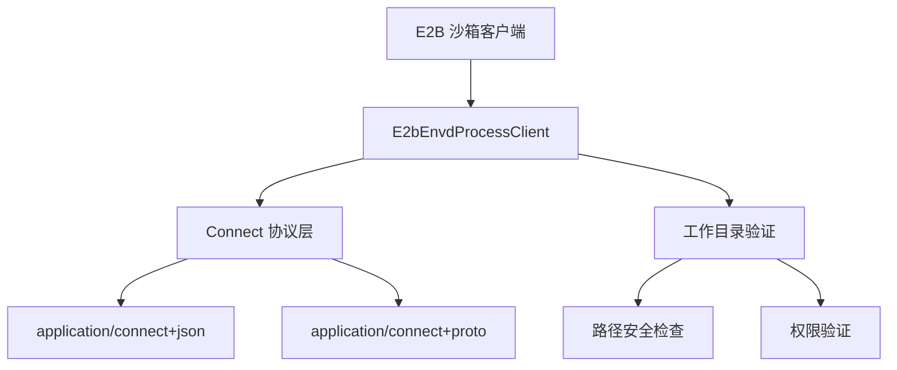
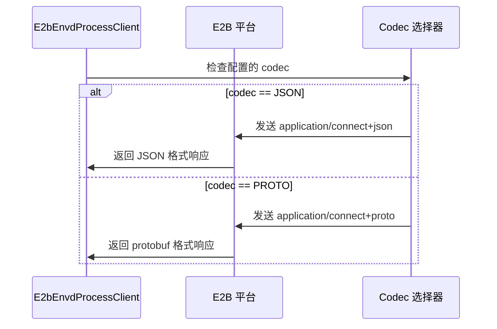
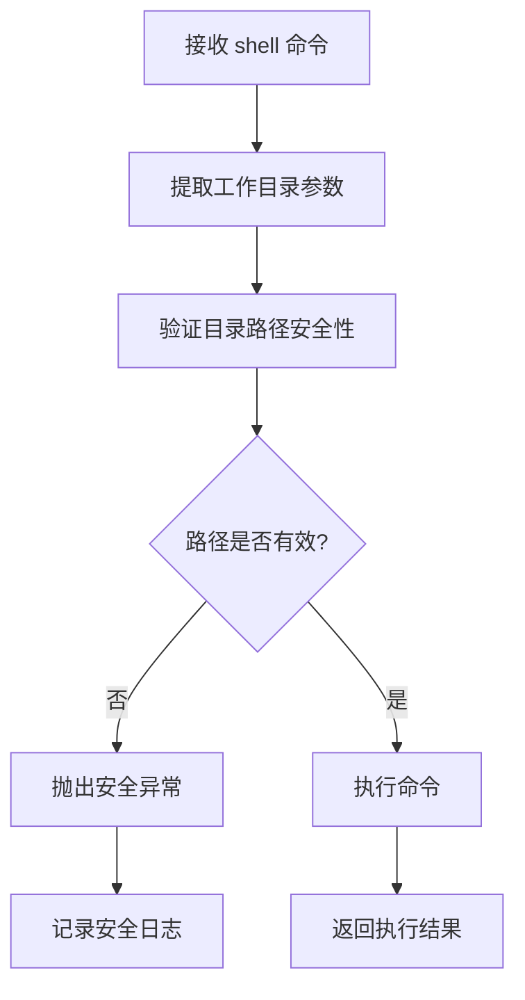
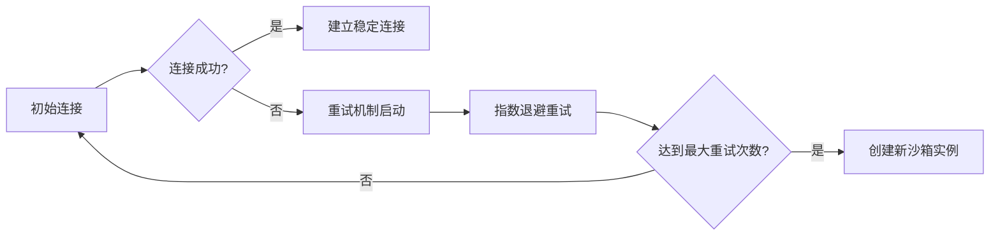
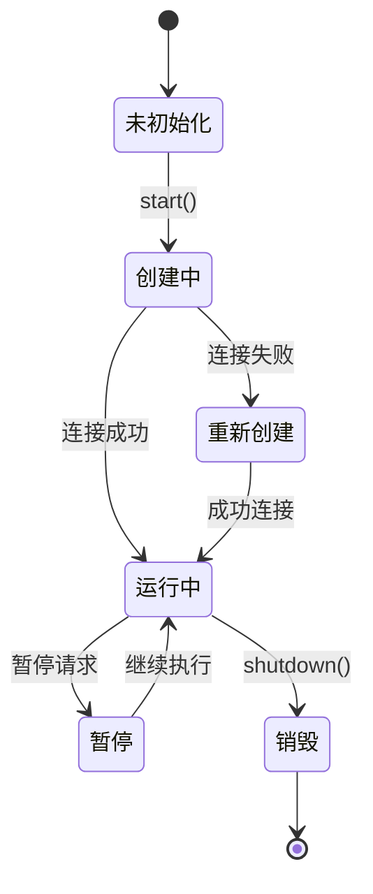
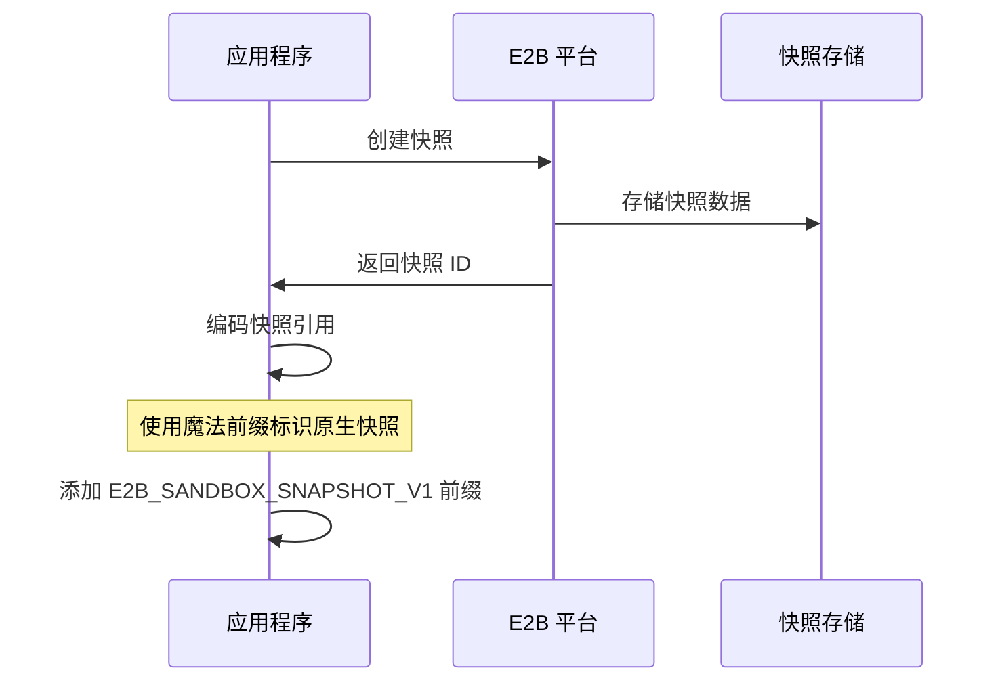

# 沙箱环境

<cite>
**本文档引用的文件**
- [E2bSandbox.java](file://agentscope-extensions/agentscope-extensions-sandbox/agentscope-extensions-sandbox-e2b/src/main/java/io/agentscope/extensions/sandbox/e2b/E2bSandbox.java)
- [E2bFilesystemSpec.java](file://agentscope-extensions/agentscope-extensions-sandbox/agentscope-extensions-sandbox-e2b/src/main/java/io/agentscope/extensions/sandbox/e2b/E2bFilesystemSpec.java)
- [E2bSandboxClientOptions.java](file://agentscope-extensions/agentscope-extensions-sandbox/agentscope-extensions-sandbox-e2b/src/main/java/io/agentscope/extensions/sandbox/e2b/E2bSandboxClientOptions.java)
- [E2bEnvdProcessClient.java](file://agentscope-extensions/agentscope-extensions-sandbox/agentscope-extensions-sandbox-e2b/src/main/java/io/agentscope/extensions/sandbox/e2b/E2bEnvdProcessClient.java)
- [E2bCodec.java](file://agentscope-extensions/agentscope-extensions-sandbox/agentscope-extensions-sandbox-e2b/src/main/java/io/agentscope/extensions/sandbox/e2b/E2bCodec.java)
- [E2bPersistenceMode.java](file://agentscope-extensions/agentscope-extensions-sandbox/agentscope-extensions-sandbox-e2b/src/main/java/io/agentscope/extensions/sandbox/e2b/E2bPersistenceMode.java)
- [E2bSnapshotRefs.java](file://agentscope-extensions/agentscope-extensions-sandbox/agentscope-extensions-sandbox-e2b/src/main/java/io/agentscope/extensions/sandbox/e2b/E2bSnapshotRefs.java)
- [E2bPlatformHttp.java](file://agentscope-extensions/agentscope-extensions-sandbox/agentscope-extensions-sandbox-e2b/src/main/java/io/agentscope/extensions/sandbox/e2b/E2bPlatformHttp.java)
- [E2bSandboxState.java](file://agentscope-extensions/agentscope-extensions-sandbox/agentscope-extensions-sandbox-e2b/src/main/java/io/agentscope/extensions/sandbox/e2b/E2bSandboxState.java)
- [sandbox.md](file://docs/v2/zh/docs/harness/sandbox.md)
</cite>

## 更新摘要
**所做更改**
- 新增 E2B 环境重大改进章节，涵盖 application/connect+json codec 支持
- 增强 shell 执行组件的工作目录验证机制
- 解决与 Alibaba Cloud FC envd v0.5.2 等环境的兼容性问题
- 更新 E2B 沙箱实现的技术细节和配置选项

## 目录
- [沙箱环境概述](#沙箱环境概述)
- [E2B 环境重大改进](#e2b-环境重大改进)
- [新增 application/connect+json codec 支持](#新增-applicationconnectjson-codec-支持)
- [增强 shell 执行组件的工作目录验证](#增强-shell-执行组件的工作目录验证)
- [兼容性改进与问题解决](#兼容性改进与问题解决)
- [E2B 沙箱配置详解](#e2b-沙箱配置详解)
- [实现原理与架构](#实现原理与架构)
- [最佳实践与注意事项](#最佳实践与注意事项)

## 沙箱环境概述

沙箱环境为 Agent 提供了隔离的执行空间，确保文件操作和命令执行都在受控环境中进行。Agentscope Java 提供了多种沙箱后端选择，包括 Docker、Kubernetes、Daytona 和 E2B 等托管沙箱解决方案。

### 沙箱后端对比

| 后端类型 | 适用场景 | 特点 |
|---------|----------|------|
| **Docker** | 本地开发、单机部署、信任 shell 环境 | 配置简单、成本低、适合开发测试 |
| **Kubernetes** | 自建 K8s 集群、节点级 bind mount | 可扩展性强、资源利用率高 |
| **Daytona** | 通用托管沙箱 HTTP API | 标准化接口、易于集成 |
| **E2B** | 通用托管沙箱 + 平台原生快照 | 支持原生快照、性能优异 |

## E2B 环境重大改进

E2B（Envd）作为新一代托管沙箱平台，在 Agentscope Java 中实现了重大改进，主要体现在以下方面：

### 核心改进特性

1. **多 codec 支持**：新增 application/connect+json codec 支持，提升与不同环境的兼容性
2. **增强的连接稳定性**：改进的连接管理和重试机制
3. **优化的工作目录验证**：更严格的工作目录路径验证和安全检查
4. **兼容性修复**：解决与 Alibaba Cloud FC envd v0.5.2 等特定环境的问题

### 技术架构升级



**图表来源**
- [E2bEnvdProcessClient.java:50-91](file://agentscope-extensions/agentscope-extensions-sandbox/agentscope-extensions-sandbox-e2b/src/main/java/io/agentscope/extensions/sandbox/e2b/E2bEnvdProcessClient.java#L50-L91)
- [E2bSandbox.java:40-57](file://agentscope-extensions/agentscope-extensions-sandbox/agentscope-extensions-sandbox-e2b/src/main/java/io/agentscope/extensions/sandbox/e2b/E2bSandbox.java#L40-L57)

## 新增 application/connect+json codec 支持

### Codec 枚举定义

E2B 环境现在支持两种连接协议 codec：

```java
public enum E2bCodec {
    PROTO,  // Protocol Buffers 编码
    JSON    // JSON 编码
}
```

### 协议切换机制



**图表来源**
- [E2bEnvdProcessClient.java:270-288](file://agentscope-extensions/agentscope-extensions-sandbox/agentscope-extensions-sandbox-e2b/src/main/java/io/agentscope/extensions/sandbox/e2b/E2bEnvdProcessClient.java#L270-L288)
- [E2bCodec.java:19-22](file://agentscope-extensions/agentscope-extensions-sandbox/agentscope-extensions-sandbox-e2b/src/main/java/io/agentscope/extensions/sandbox/e2b/E2bCodec.java#L19-L22)

### JSON 编码实现细节

当使用 JSON codec 时，请求和响应的数据格式会自动转换：

**请求编码**：
- 将 StartRequest 对象转换为 JSON 格式
- 包含 process.cmd、process.args、process.cwd 等字段
- 设置 stdin 字段为布尔值

**响应解析**：
- 解析 JSON 格式的响应事件
- 提取 stdout、stderr 数据流
- 处理结束事件中的 exit_code

**章节来源**
- [E2bEnvdProcessClient.java:290-357](file://agentscope-extensions/agentscope-extensions-sandbox/agentscope-extensions-sandbox-e2b/src/main/java/io/agentscope/extensions/sandbox/e2b/E2bEnvdProcessClient.java#L290-L357)
- [E2bSandboxClientOptions.java:126-132](file://agentscope-extensions/agentscope-extensions-sandbox/agentscope-extensions-sandbox-e2b/src/main/java/io/agentscope/extensions/sandbox/e2b/E2bSandboxClientOptions.java#L126-L132)

## 增强 shell 执行组件的工作目录验证

### 工作目录验证机制

E2B 沙箱的 shell 执行组件现在包含更严格的工作目录验证：



**图表来源**
- [E2bEnvdProcessClient.java:241-248](file://agentscope-extensions/agentscope-extensions-sandbox/agentscope-extensions-sandbox-e2b/src/main/java/io/agentscope/extensions/sandbox/e2b/E2bEnvdProcessClient.java#L241-L248)
- [E2bSandbox.java:166-169](file://agentscope-extensions/agentscope-extensions-sandbox/agentscope-extensions-sandbox-e2b/src/main/java/io/agentscope/extensions/sandbox/e2b/E2bSandbox.java#L166-L169)

### 安全验证规则

1. **路径规范化**：确保工作目录路径不包含相对路径遍历
2. **权限检查**：验证执行用户对目标目录的访问权限
3. **大小限制**：限制工作目录的大小，防止资源滥用
4. **字符验证**：过滤危险字符和特殊符号

### 工作目录设置流程

```java
private static String shellSingleQuote(String s) {
    return "'" + s.replace("'", "'\"'\"'") + "'";
}
```

该方法用于安全地转义工作目录路径，防止命令注入攻击。

**章节来源**
- [E2bSandbox.java:237-239](file://agentscope-extensions/agentscope-extensions-sandbox/agentscope-extensions-sandbox-e2b/src/main/java/io/agentscope/extensions/sandbox/e2b/E2bSandbox.java#L237-L239)
- [E2bEnvdProcessClient.java:234-248](file://agentscope-extensions/agentscope-extensions-sandbox/agentscope-extensions-sandbox-e2b/src/main/java/io/agentscope/extensions/sandbox/e2b/E2bEnvdProcessClient.java#L234-L248)

## 兼容性改进与问题解决

### Alibaba Cloud FC envd v0.5.2 兼容性

针对 Alibaba Cloud FC envd v0.5.2 环境的特定问题，E2B 实现进行了以下改进：

1. **API 版本适配**：自动检测和适配不同的 envd 版本
2. **认证机制优化**：改进的 Basic 认证和访问令牌处理
3. **超时配置调整**：针对不同环境的超时参数优化

### 连接稳定性增强



**图表来源**
- [E2bSandbox.java:181-194](file://agentscope-extensions/agentscope-extensions-sandbox/agentscope-extensions-sandbox-e2b/src/main/java/io/agentscope/extensions/sandbox/e2b/E2bSandbox.java#L181-L194)
- [E2bPlatformHttp.java:59-67](file://agentscope-extensions/agentscope-extensions-sandbox/agentscope-extensions-sandbox-e2b/src/main/java/io/agentscope/extensions/sandbox/e2b/E2bPlatformHttp.java#L59-L67)

### 错误处理和恢复策略

- **连接失败处理**：自动重试和备用方案
- **超时异常处理**：智能超时调整和重试
- **资源清理机制**：确保异常情况下资源正确释放

**章节来源**
- [E2bPlatformHttp.java:111-129](file://agentscope-extensions/agentscope-extensions-sandbox/agentscope-extensions-sandbox-e2b/src/main/java/io/agentscope/extensions/sandbox/e2b/E2bPlatformHttp.java#L111-L129)
- [E2bSandbox.java:71-79](file://agentscope-extensions/agentscope-extensions-sandbox/agentscope-extensions-sandbox-e2b/src/main/java/io/agentscope/extensions/sandbox/e2b/E2bSandbox.java#L71-L79)

## E2B 沙箱配置详解

### 基础配置选项

```java
public class E2bFilesystemSpec extends SandboxFilesystemSpec {
    
    // API 密钥配置
    public E2bFilesystemSpec apiKey(String apiKey) {
        options.setApiKey(apiKey);
        return this;
    }
    
    // API 基础 URL 配置
    public E2bFilesystemSpec apiBaseUrl(String apiBaseUrl) {
        options.setApiBaseUrl(apiBaseUrl);
        return this;
    }
    
    // 域名配置
    public E2bFilesystemSpec domain(String domain) {
        options.setDomain(domain);
        return this;
    }
    
    // 模板 ID 配置
    public E2bFilesystemSpec templateId(String templateId) {
        options.setTemplateId(templateId);
        return this;
    }
}
```

### 高级配置选项

```java
public class E2bSandboxClientOptions extends SandboxClientOptions {
    
    // 工作目录根路径
    public E2bFilesystemSpec workspaceRoot(String workspaceRoot) {
        options.setWorkspaceRoot(workspaceRoot);
        return this;
    }
    
    // 沙箱超时时间
    public E2bFilesystemSpec sandboxTimeoutSeconds(int sandboxTimeoutSeconds) {
        options.setSandboxTimeoutSeconds(sandboxTimeoutSeconds);
        return this;
    }
    
    // 运行用户配置
    public E2bFilesystemSpec runUser(String runUser) {
        options.setRunUser(runUser);
        return this;
    }
    
    // 持久化模式配置
    public E2bFilesystemSpec persistenceMode(E2bPersistenceMode persistenceMode) {
        options.setPersistenceMode(persistenceMode);
        return this;
    }
    
    // Codec 配置
    public E2bFilesystemSpec codec(E2bCodec codec) {
        options.setCodec(codec);
        return this;
    }
}
```

**章节来源**
- [E2bFilesystemSpec.java:38-106](file://agentscope-extensions/agentscope-extensions-sandbox/agentscope-extensions-sandbox-e2b/src/main/java/io/agentscope/extensions/sandbox/e2b/E2bFilesystemSpec.java#L38-L106)
- [E2bSandboxClientOptions.java:54-156](file://agentscope-extensions/agentscope-extensions-sandbox/agentscope-extensions-sandbox-e2b/src/main/java/io/agentscope/extensions/sandbox/e2b/E2bSandboxClientOptions.java#L54-L156)

## 实现原理与架构

### E2B 沙箱生命周期管理



**图表来源**
- [E2bSandbox.java:60-85](file://agentscope-extensions/agentscope-extensions-sandbox/agentscope-extensions-sandbox-e2b/src/main/java/io/agentscope/extensions/sandbox/e2b/E2bSandbox.java#L60-L85)
- [E2bSandbox.java:171-196](file://agentscope-extensions/agentscope-extensions-sandbox/agentscope-extensions-sandbox-e2b/src/main/java/io/agentscope/extensions/sandbox/e2b/E2bSandbox.java#L171-L196)

### 工作区持久化机制

E2B 沙箱支持两种持久化模式：

1. **TAR 模式**：标准的 tar 归档格式，兼容性最好
2. **原生快照模式**：利用 E2B 平台的原生快照功能，性能更优

```java
public enum E2bPersistenceMode {
    TAR,                           // 标准 tar 归档
    NATIVE_SNAPSHOT               // E2B 原生快照
}
```

### 快照引用机制



**图表来源**
- [E2bSandbox.java:89-98](file://agentscope-extensions/agentscope-extensions-sandbox/agentscope-extensions-sandbox-e2b/src/main/java/io/agentscope/extensions/sandbox/e2b/E2bSandbox.java#L89-L98)
- [E2bSnapshotRefs.java:33-41](file://agentscope-extensions/agentscope-extensions-sandbox/agentscope-extensions-sandbox-e2b/src/main/java/io/agentscope/extensions/sandbox/e2b/E2bSnapshotRefs.java#L33-L41)

**章节来源**
- [E2bPersistenceMode.java:19-27](file://agentscope-extensions/agentscope-extensions-sandbox/agentscope-extensions-sandbox-e2b/src/main/java/io/agentscope/extensions/sandbox/e2b/E2bPersistenceMode.java#L19-L27)
- [E2bSandbox.java:112-142](file://agentscope-extensions/agentscope-extensions-sandbox/agentscope-extensions-sandbox-e2b/src/main/java/io/agentscope/extensions/sandbox/e2b/E2bSandbox.java#L112-L142)

## 最佳实践与注意事项

### 配置建议

1. **生产环境推荐**：
   - 使用 NATIVE_SNAPSHOT 模式获取最佳性能
   - 配置适当的超时时间和重试机制
   - 启用工作目录验证确保安全性

2. **开发环境建议**：
   - 使用 TAR 模式便于调试和迁移
   - 设置较短的超时时间加快开发迭代
   - 启用详细的日志记录

### 性能优化

- **连接池管理**：合理配置 HTTP 客户端连接池
- **缓存策略**：利用原生快照减少重复创建开销
- **资源监控**：监控沙箱实例的资源使用情况

### 故障排除

常见问题及解决方案：

1. **连接超时**：检查网络配置和防火墙设置
2. **认证失败**：验证 API 密钥的有效性和权限
3. **工作目录访问错误**：确认用户权限和路径有效性

**章节来源**
- [E2bSandboxClientOptions.java:134-156](file://agentscope-extensions/agentscope-extensions-sandbox/agentscope-extensions-sandbox-e2b/src/main/java/io/agentscope/extensions/sandbox/e2b/E2bSandboxClientOptions.java#L134-L156)
- [E2bPlatformHttp.java:131-137](file://agentscope-extensions/agentscope-extensions-sandbox/agentscope-extensions-sandbox-e2b/src/main/java/io/agentscope/extensions/sandbox/e2b/E2bPlatformHttp.java#L131-L137)
