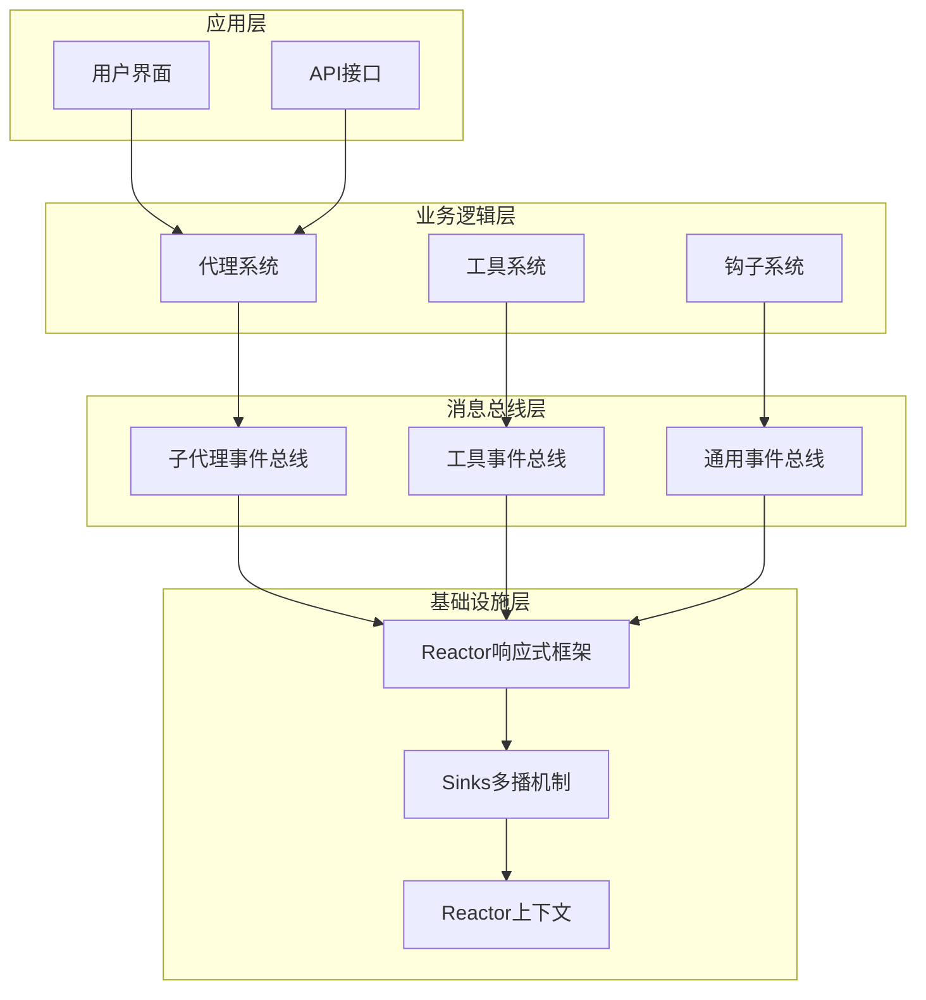
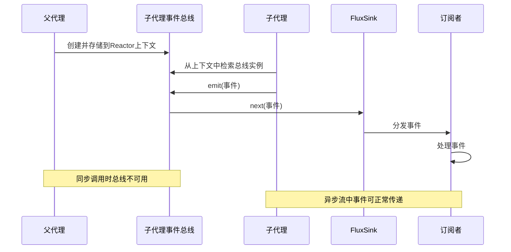
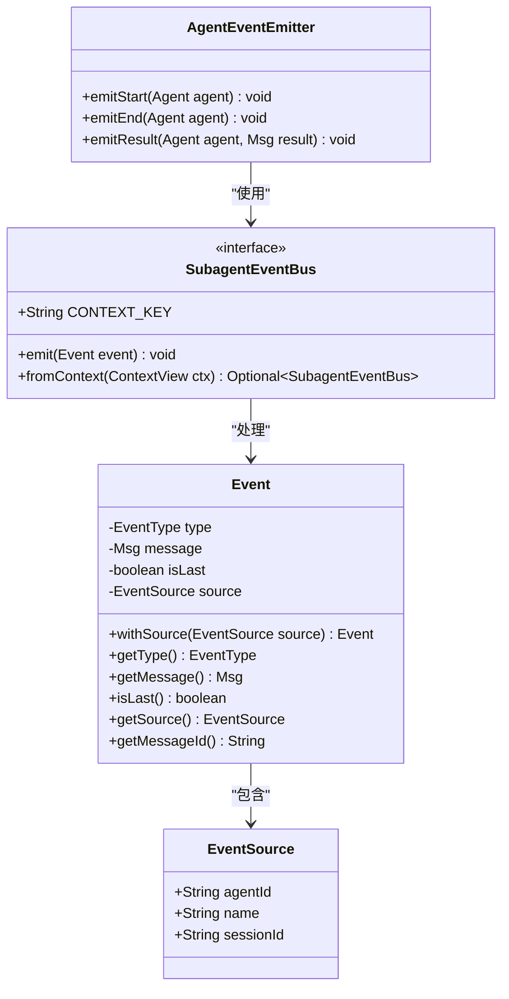
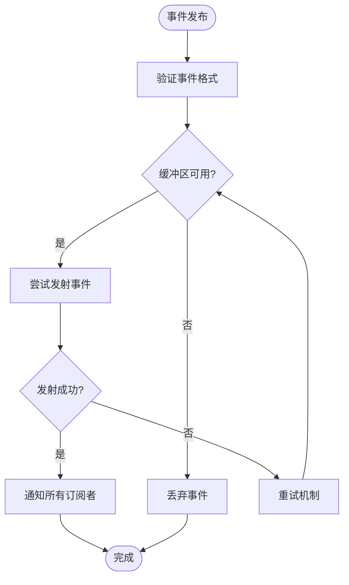
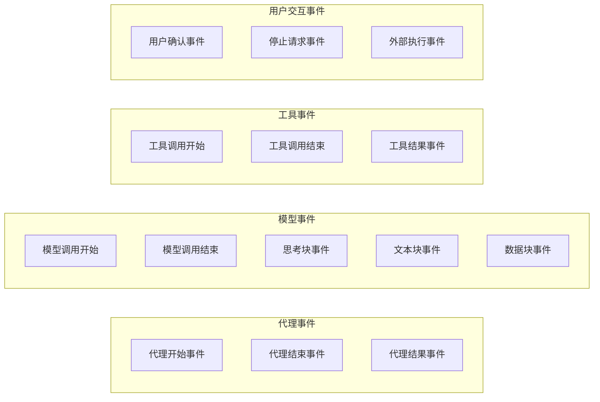
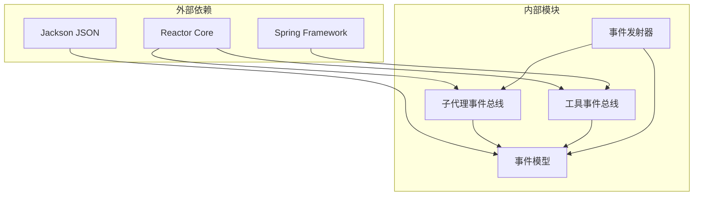

# 消息总线基础设施

<cite>
**本文档引用的文件**
- [SubagentEventBus.java](file://agentscope-core/src/main/java/io/agentscope/core/agent/SubagentEventBus.java)
- [Event.java](file://agentscope-core/src/main/java/io/agentscope/core/agent/Event.java)
- [EventType.java](file://agentscope-core/src/main/java/io/agentscope/core/agent/EventType.java)
- [EventSource.java](file://agentscope-core/src/main/java/io/agentscope/core/agent/EventSource.java)
- [AgentEventEmitter.java](file://agentscope-core/src/main/java/io/agentscope/core/event/AgentEventEmitter.java)
- [AgentEventType.java](file://agentscope-core/src/main/java/io/agentscope/core/event/AgentEventType.java)
- [ToolEventBus.java](file://agentscope-examples/agents/agentscope-builder/src/main/java/io/agentscope/builder/web/toolbus/ToolEventBus.java)
</cite>

## 目录
1. [简介](#简介)
2. [项目结构](#项目结构)
3. [核心组件](#核心组件)
4. [架构概览](#架构概览)
5. [详细组件分析](#详细组件分析)
6. [依赖关系分析](#依赖关系分析)
7. [性能考虑](#性能考虑)
8. [故障排除指南](#故障排除指南)
9. [结论](#结论)

## 简介

消息总线基础设施是Agentscope Java框架中的核心通信机制，负责在代理系统中传递各种事件和消息。该基础设施基于Reactor响应式编程模型构建，提供了高效、可扩展的消息传递能力，支持同步和异步操作模式。

消息总线主要包含两个核心组件：子代理事件总线（SubagentEventBus）和工具事件总线（ToolEventBus）。前者专门处理子代理与父代理之间的事件传递，后者用于工具调用事件的发布订阅。

## 项目结构

Agentscope项目的整体架构采用分层设计，消息总线基础设施位于核心层，为上层代理系统提供基础通信能力：

**图表来源**
- [SubagentEventBus.java:21-69](file://agentscope-core/src/main/java/io/agentscope/core/agent/SubagentEventBus.java#L21-L69)
- [ToolEventBus.java:24-39](file://agentscope-examples/agents/agentscope-builder/src/main/java/io/agentscope/builder/web/toolbus/ToolEventBus.java#L24-L39)

**章节来源**
- [SubagentEventBus.java:18-69](file://agentscope-core/src/main/java/io/agentscope/core/agent/SubagentEventBus.java#L18-L69)
- [ToolEventBus.java:1-39](file://agentscope-examples/agents/agentscope-builder/src/main/java/io/agentscope/builder/web/toolbus/ToolEventBus.java#L1-L39)

## 核心组件

消息总线基础设施由多个核心组件构成，每个组件都有特定的职责和功能：

### 事件模型
事件是消息总线中的基本数据单元，包含类型、消息内容和源信息等属性。事件系统支持多种事件类型，包括代理开始/结束事件、模型调用事件、工具调用事件等。

### 事件源标识
事件源（EventSource）用于标识事件的来源，支持父子代理关系的追踪。这对于调试和监控非常重要，可以清楚地看到事件在代理层次结构中的传播路径。

### 上下文集成
消息总线通过Reactor的上下文机制进行集成，确保事件可以在整个响应式流中正确传递。这种设计使得事件处理具有良好的线程安全性和性能表现。

**章节来源**
- [Event.java:104-219](file://agentscope-core/src/main/java/io/agentscope/core/agent/Event.java#L104-L219)
- [EventType.java](file://agentscope-core/src/main/java/io/agentscope/core/agent/EventType.java)
- [EventSource.java](file://agentscope-core/src/main/java/io/agentscope/core/agent/EventSource.java)

## 架构概览

消息总线基础设施采用分层架构设计，从底层的Reactor响应式框架到上层的应用组件，形成了完整的事件处理管道：

**图表来源**
- [SubagentEventBus.java:25-69](file://agentscope-core/src/main/java/io/agentscope/core/agent/SubagentEventBus.java#L25-L69)

该架构的关键特性包括：

1. **线程安全**：所有事件传递都通过Reactor的FluxSink进行，保证了线程安全性
2. **背压处理**：使用onBackpressureBuffer机制处理高负载情况
3. **上下文集成**：通过Reactor上下文实现事件的透明传递
4. **异步支持**：完全支持响应式编程模型

## 详细组件分析

### 子代理事件总线

子代理事件总线是消息总线的核心组件，专门为父子代理之间的事件传递而设计：

**图表来源**
- [SubagentEventBus.java:37-69](file://agentscope-core/src/main/java/io/agentscope/core/agent/SubagentEventBus.java#L37-L69)
- [Event.java:104-219](file://agentscope-core/src/main/java/io/agentscope/core/agent/Event.java#L104-L219)
- [EventSource.java](file://agentscope-core/src/main/java/io/agentscope/core/agent/EventSource.java)

#### 关键特性

1. **上下文存储**：总线实例存储在Reactor上下文中，键名为"agentscope.subagent.event.bus"
2. **线程安全**：emit方法是线程安全的，可以在任何线程上调用
3. **空值检查**：fromContext方法会检查上下文是否存在，不存在时返回Optional.empty()
4. **事件验证**：要求事件必须包含EventSource，确保事件来源可追踪

### 工具事件总线

工具事件总线是示例项目中的专用事件总线，用于处理工具调用相关的事件：

**图表来源**
- [ToolEventBus.java:33-39](file://agentscope-examples/agents/agentscope-builder/src/main/java/io/agentscope/builder/web/toolbus/ToolEventBus.java#L33-L39)

#### 设计特点

1. **内存单例**：使用Spring组件注解创建单例实例
2. **多播机制**：支持多个订阅者同时接收事件
3. **背压处理**：使用onBackpressureBuffer(256, false)处理高并发场景
4. **无阻塞**：tryEmitNext方法非阻塞，提高性能

### 事件类型系统

事件类型系统定义了消息总线中支持的所有事件类型，包括代理生命周期事件、模型交互事件、工具调用事件等：

**图表来源**
- [AgentEventType.java](file://agentscope-core/src/main/java/io/agentscope/core/event/AgentEventType.java)
- [AgentEventEmitter.java](file://agentscope-core/src/main/java/io/agentscope/core/event/AgentEventEmitter.java)

**章节来源**
- [SubagentEventBus.java:37-69](file://agentscope-core/src/main/java/io/agentscope/core/agent/SubagentEventBus.java#L37-L69)
- [ToolEventBus.java:24-39](file://agentscope-examples/agents/agentscope-builder/src/main/java/io/agentscope/builder/web/toolbus/ToolEventBus.java#L24-L39)
- [AgentEventEmitter.java](file://agentscope-core/src/main/java/io/agentscope/core/event/AgentEventEmitter.java)

## 依赖关系分析

消息总线基础设施的依赖关系相对简单但功能完整，主要依赖于Reactor响应式编程框架：

**图表来源**
- [SubagentEventBus.java:18-20](file://agentscope-core/src/main/java/io/agentscope/core/agent/SubagentEventBus.java#L18-L20)
- [ToolEventBus.java:18-22](file://agentscope-examples/agents/agentscope-builder/src/main/java/io/agentscope/builder/web/toolbus/ToolEventBus.java#L18-L22)

### 依赖管理

1. **Reactor依赖**：核心响应式编程框架，提供Flux和Mono支持
2. **Jackson依赖**：JSON序列化和反序列化支持
3. **Spring依赖**：工具事件总线的Spring组件支持

### 版本兼容性

消息总线基础设施设计时考虑了版本兼容性，确保不同版本间的平滑升级：

- Reactor版本升级不影响API使用
- Jackson版本更新保持向后兼容
- Spring版本变化对工具总线有影响但可通过配置解决

**章节来源**
- [SubagentEventBus.java:18-20](file://agentscope-core/src/main/java/io/agentscope/core/agent/SubagentEventBus.java#L18-L20)
- [ToolEventBus.java:18-22](file://agentscope-examples/agents/agentscope-builder/src/main/java/io/agentscope/builder/web/toolbus/ToolEventBus.java#L18-L22)

## 性能考虑

消息总线基础设施在设计时充分考虑了性能优化，采用了多种策略来确保高吞吐量和低延迟：

### 背压处理策略

工具事件总线使用了onBackpressureBuffer(256, false)策略，当订阅者无法及时处理事件时，会将事件缓存到固定大小的缓冲区中，避免事件丢失。

### 线程安全保证

所有事件传递都通过Reactor的FluxSink进行，确保了线程安全性。emit方法是线程安全的，可以在任何线程上调用而不产生竞态条件。

### 内存管理

- 使用tryEmitNext而非emit方法，避免阻塞等待
- 固定大小的缓冲区限制内存使用
- 及时清理不再使用的事件引用

### 延迟优化

- 避免不必要的对象创建
- 使用Optional模式减少null检查开销
- 直接传递事件引用而非复制

## 故障排除指南

### 常见问题及解决方案

#### 1. 事件未到达订阅者

**症状**：事件发布后没有被订阅者接收

**可能原因**：
- 事件总线未正确初始化
- 订阅者在事件发布后才注册
- 事件类型不匹配

**解决方案**：
- 检查Reactor上下文中的总线实例
- 确保订阅者在事件发布前已注册
- 验证事件类型过滤逻辑

#### 2. 内存泄漏问题

**症状**：应用程序内存使用持续增长

**可能原因**：
- 订阅者未正确取消订阅
- 事件引用未及时释放
- 缓冲区满导致事件丢失

**解决方案**：
- 实现自动取消订阅机制
- 定期清理不再使用的事件引用
- 监控缓冲区使用情况

#### 3. 线程安全问题

**症状**：并发环境下出现数据竞争或死锁

**可能原因**：
- 直接修改共享状态
- 不正确的同步机制
- 错误的线程切换

**解决方案**：
- 使用Reactor提供的线程安全API
- 避免在事件处理器中进行阻塞操作
- 正确使用背压机制

**章节来源**
- [SubagentEventBus.java:63-69](file://agentscope-core/src/main/java/io/agentscope/core/agent/SubagentEventBus.java#L63-L69)
- [ToolEventBus.java:33-39](file://agentscope-examples/agents/agentscope-builder/src/main/java/io/agentscope/builder/web/toolbus/ToolEventBus.java#L33-L39)

## 结论

消息总线基础设施为Agentscope Java框架提供了强大而灵活的事件传递能力。通过精心设计的架构和实现，该基础设施能够满足复杂代理系统的通信需求。

### 主要优势

1. **高性能**：基于Reactor的响应式编程模型，提供优秀的性能表现
2. **可扩展性**：模块化设计支持功能扩展和定制
3. **可靠性**：完善的错误处理和恢复机制
4. **易用性**：简洁的API设计，降低使用复杂度

### 未来发展方向

1. **分布式支持**：扩展到分布式环境的消息传递
2. **监控增强**：增加更详细的性能监控和诊断功能
3. **协议标准化**：制定统一的事件格式和传输协议
4. **安全加固**：增强事件传输的安全性和完整性保护

消息总线基础设施作为Agentscope的核心组件，为整个框架的稳定运行和功能扩展奠定了坚实的基础。
