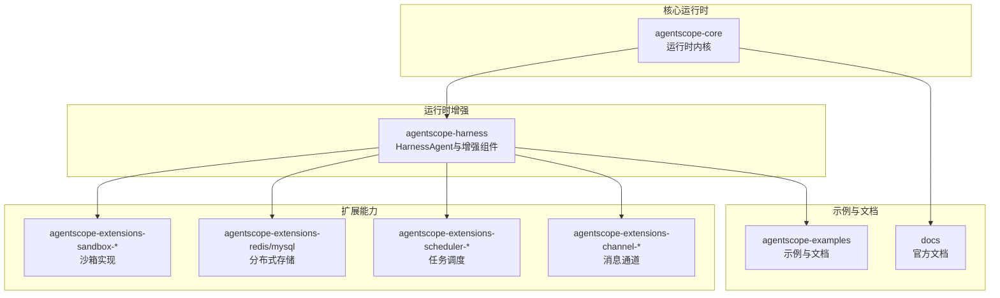
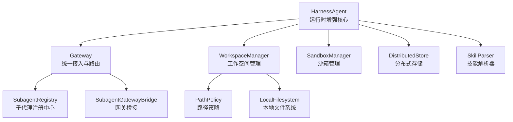
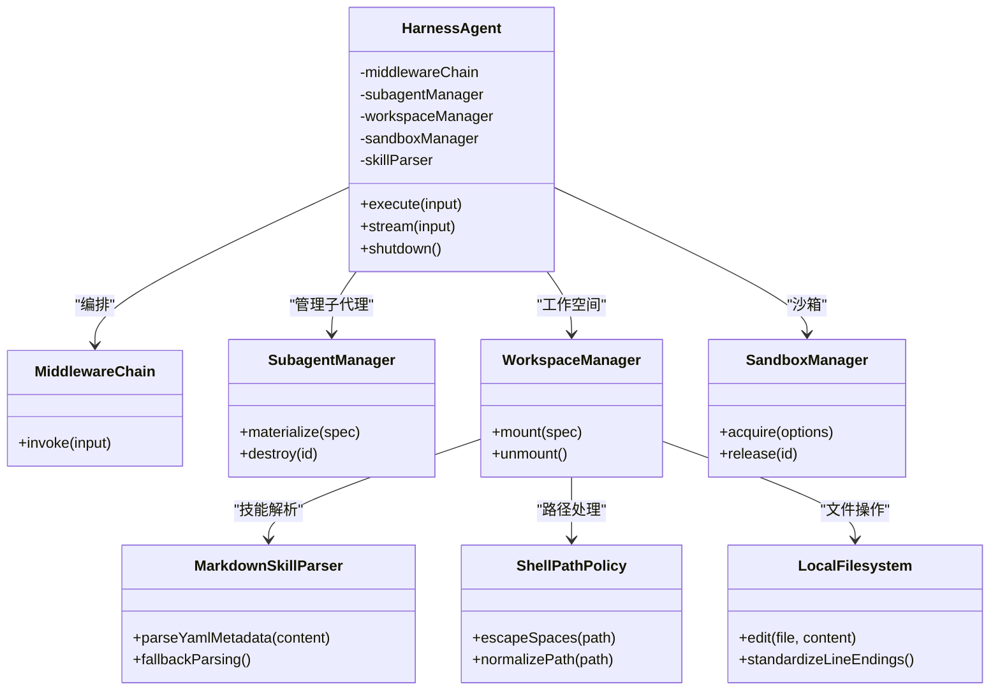
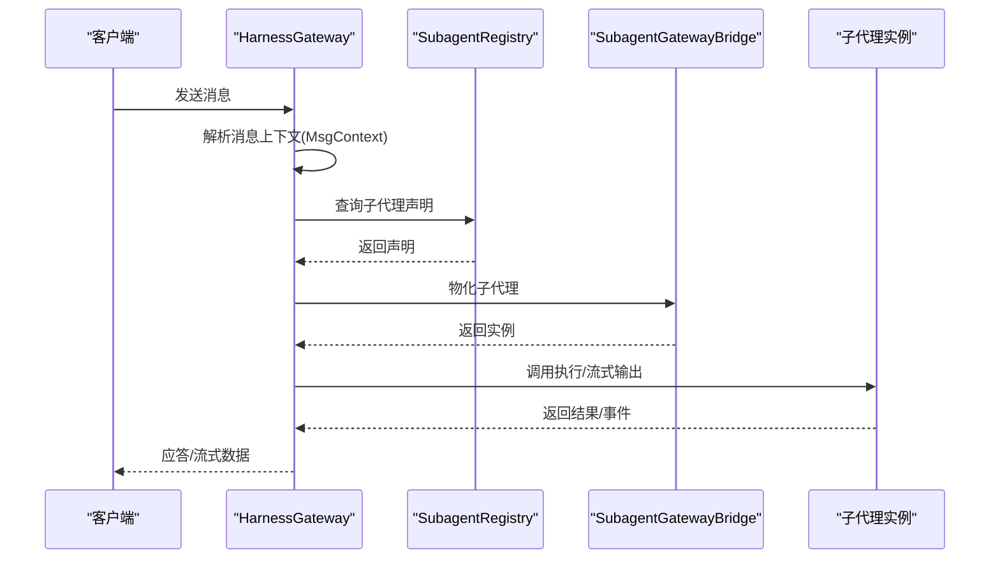
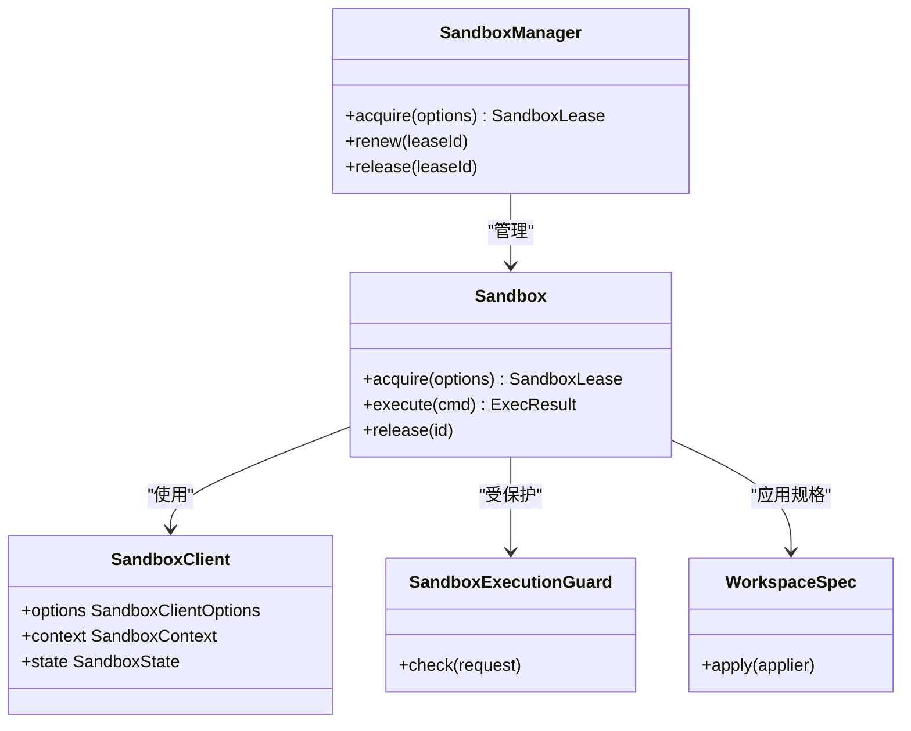
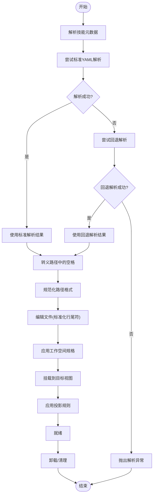
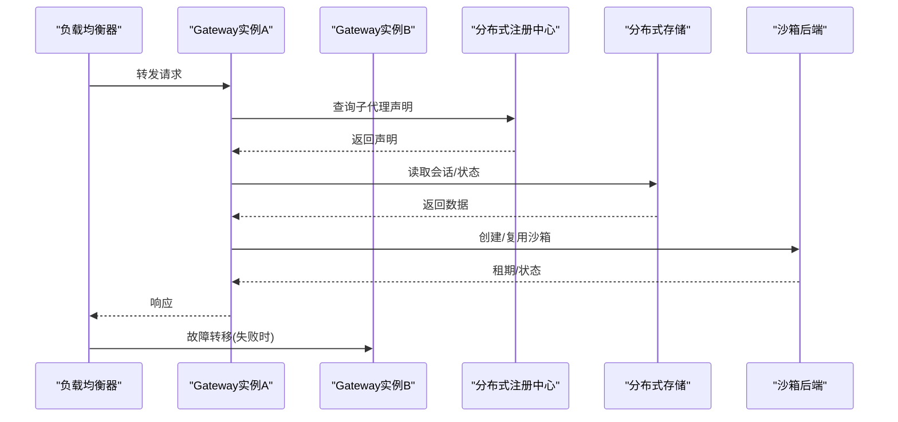
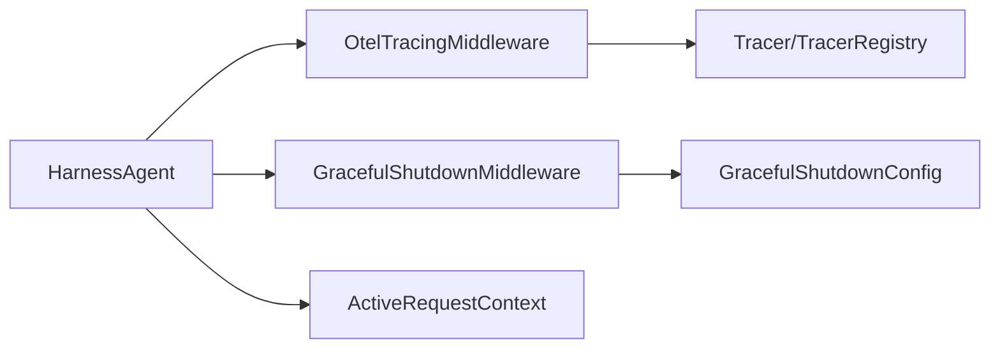
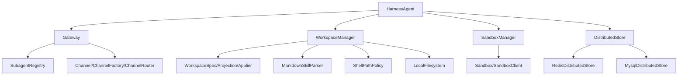

# 运行时增强

<cite>
**本文引用的文件**
- [HarnessAgent.java](file://agentscope-harness/src/main/java/io/agentscope/harness/agent/HarnessAgent.java)
- [Gateway.java](file://agentscope-harness/src/main/java/io/agentscope/harness/agent/gateway/Gateway.java)
- [HarnessGateway.java](file://agentscope-harness/src/main/java/io/agentscope/harness/agent/gateway/HarnessGateway.java)
- [GatewayBootstrap.java](file://agentscope-harness/src/main/java/io/agentscope/harness/agent/gateway/GatewayBootstrap.java)
- [SubagentRegistry.java](file://agentscope-harness/src/main/java/io/agentscope/harness/agent/gateway/SubagentRegistry.java)
- [InMemorySubagentRegistry.java](file://agentscope-harness/src/main/java/io/agentscope/harness/agent/gateway/InMemorySubagentRegistry.java)
- [StoreBackedSubagentRegistry.java](file://agentscope-harness/src/main/java/io/agentscope/harness/agent/gateway/StoreBackedSubagentRegistry.java)
- [SubagentMaterializer.java](file://agentscope-harness/src/main/java/io/agentscope/harness/agent/gateway/SubagentMaterializer.java)
- [SubagentGatewayBridge.java](file://agentscope-harness/src/main/java/io/agentscope/harness/agent/gateway/SubagentGatewayBridge.java)
- [MsgContext.java](file://agentscope-harness/src/main/java/io/agentscope/harness/agent/gateway/MsgContext.java)
- [SessionTurnGate.java](file://agentscope-harness/src/main/java/io/agentscope/harness/agent/gateway/SessionTurnGate.java)
- [Channel.java](file://agentscope-harness/src/main/java/io/agentscope/harness/agent/gateway/channel/Channel.java)
- [ChannelFactory.java](file://agentscope-harness/src/main/java/io/agentscope/harness/agent/gateway/channel/ChannelFactory.java)
- [ChannelRouter.java](file://agentscope-harness/src/main/java/io/agentscope/harness/agent/gateway/channel/ChannelRouter.java)
- [WorkspaceManager.java](file://agentscope-harness/src/main/java/io/agentscope/harness/agent/workspace/WorkspaceManager.java)
- [LocalFsMode.java](file://agentscope-harness/src/main/java/io/agentscope/harness/agent/workspace/LocalFsMode.java)
- [PathPolicy.java](file://agentscope-harness/src/main/java/io/agentscope/harness/agent/workspace/PathPolicy.java)
- [WorkspacePathNormalizer.java](file://agentscope-harness/src/main/java/io/agentscope/harness/agent/workspace/WorkspacePathNormalizer.java)
- [WorkspaceConstants.java](file://agentscope-harness/src/main/java/io/agentscope/harness/agent/workspace/WorkspaceConstants.java)
- [Sandbox.java](file://agentscope-harness/src/main/java/io/agentscope/harness/agent/sandbox/Sandbox.java)
- [SandboxManager.java](file://agentscope-harness/src/main/java/io/agentscope/harness/agent/sandbox/SandboxManager.java)
- [SandboxClient.java](file://agentscope-harness/src/main/java/io/agentscope/harness/agent/sandbox/SandboxClient.java)
- [SandboxClientOptions.java](file://agentscope-harness/src/main/java/io/agentscope/harness/agent/sandbox/SandboxClientOptions.java)
- [SandboxContext.java](file://agentscope-harness/src/main/java/io/agentscope/harness/agent/sandbox/SandboxContext.java)
- [SandboxState.java](file://agentscope-harness/src/main/java/io/agentscope/harness/agent/sandbox/SandboxState.java)
- [WorkspaceSpec.java](file://agentscope-harness/src/main/java/io/agentscope/harness/agent/sandbox/WorkspaceSpec.java)
- [WorkspaceSpecApplier.java](file://agentscope-harness/src/main/java/io/agentscope/harness/agent/sandbox/WorkspaceSpecApplier.java)
- [WorkspaceProjectionApplier.java](file://agentscope-harness/src/main/java/io/agentscope/harness/agent/sandbox/WorkspaceProjectionApplier.java)
- [WorkspaceArchiveExtractor.java](file://agentscope-harness/src/main/java/io/agentscope/harness/agent/sandbox/WorkspaceArchiveExtractor.java)
- [WorkspaceMountSupport.java](file://agentscope-harness/src/main/java/io/agentscope/harness/agent/sandbox/WorkspaceMountSupport.java)
- [SandboxExecutionGuard.java](file://agentscope-harness/src/main/java/io/agentscope/harness/agent/sandbox/SandboxExecutionGuard.java)
- [JdbcSandboxExecutionGuard.java](file://agentscope-extensions/agentscope-extensions-mysql/src/main/java/io/agentscope/extensions/mysql/sandbox/JdbcSandboxExecutionGuard.java)
- [RedisSandboxExecutionGuard.java](file://agentscope-extensions/agentscope-extensions-redis/src/main/java/io/agentscope/extensions/redis/sandbox/RedisSandboxExecutionGuard.java)
- [AgentRunSandbox.java](file://agentscope-extensions/agentscope-extensions-sandbox/agentscope-extensions-sandbox-agentrun/src/main/java/io/agentscope/extensions/sandbox/agentrun/AgentRunSandbox.java)
- [DaytonaSandbox.java](file://agentscope-extensions/agentscope-extensions-sandbox/agentscope-extensions-sandbox-daytona/src/main/java/io/agentscope/extensions/sandbox/daytona/DaytonaSandbox.java)
- [AgentRunSandboxClient.java](file://agentscope-extensions/agentscope-extensions-sandbox/agentscope-extensions-sandbox-agentrun/src/main/java/io/agentscope/extensions/sandbox/agentrun/AgentRunSandboxClient.java)
- [AgentRunDataPlaneHttp.java](file://agentscope-extensions/agentscope-extensions-sandbox/agentscope-extensions-sandbox-agentrun/src/main/java/io/agentscope/extensions/sandbox/agentrun/AgentRunDataPlaneHttp.java)
- [AgentRunNasMountConfig.java](file://agentscope-extensions/agentscope-extensions-sandbox/agentscope-extensions-sandbox-agentrun/src/main/java/io/agentscope/extensions/sandbox/agentrun/AgentRunNasMountConfig.java)
- [AgentRunOssMountConfig.java](file://agentscope-extensions/agentscope-extensions-sandbox/agentscope-extensions-sandbox-agentrun/src/main/java/io/agentscope/extensions/sandbox/agentrun/AgentRunOssMountConfig.java)
- [AgentRunMcpChannel.java](file://agentscope-extensions/agentscope-extensions-sandbox/agentscope-extensions-sandbox-agentrun/src/main/java/io/agentscope/extensions/sandbox/agentrun/AgentRunMcpChannel.java)
- [AgentRunRetry.java](file://agentscope-extensions/agentscope-extensions-sandbox/agentscope-extensions-sandbox-agentrun/src/main/java/io/agentscope/extensions/sandbox/agentrun/AgentRunRetry.java)
- [AgentRunSandboxState.java](file://agentscope-extensions/agentscope-extensions-sandbox/agentscope-extensions-sandbox-agentrun/src/main/java/io/agentscope/extensions/sandbox/agentrun/AgentRunSandboxState.java)
- [DaytonaHttp.java](file://agentscope-extensions/agentscope-extensions-sandbox/agentscope-extensions-sandbox-daytona/src/main/java/io/agentscope/extensions/sandbox/daytona/DaytonaHttp.java)
- [DaytonaRetry.java](file://agentscope-extensions/agentscope-extensions-sandbox/agentscope-extensions-sandbox-daytona/src/main/java/io/agentscope/extensions/sandbox/daytona/DaytonaRetry.java)
- [DaytonaFilesystemSpec.java](file://agentscope-extensions/agentscope-extensions-sandbox/agentscope-extensions-sandbox-daytona/src/main/java/io/agentscope/extensions/sandbox/daytona/DaytonaFilesystemSpec.java)
- [RedisDistributedStore.java](file://agentscope-extensions/agentscope-extensions-redis/src/main/java/io/agentscope/extensions/redis/RedisDistributedStore.java)
- [MysqlDistributedStore.java](file://agentscope-extensions/agentscope-extensions-mysql/src/main/java/io/agentscope/extensions/mysql/MysqlDistributedStore.java)
- [GracefulShutdownManager.java](file://agentscope-core/src/main/java/io/agentscope/core/shutdown/GracefulShutdownManager.java)
- [GracefulShutdownConfig.java](file://agentscope-core/src/main/java/io/agentscope/core/shutdown/GracefulShutdownConfig.java)
- [GracefulShutdownMiddleware.java](file://agentscope-core/src/main/java/io/agentscope/core/shutdown/GracefulShutdownMiddleware.java)
- [ActiveRequestContext.java](file://agentscope-core/src/main/java/io/agentscope/core/shutdown/ActiveRequestContext.java)
- [AgentShuttingDownException.java](file://agentscope-core/src/main/java/io/agentscope/core/shutdown/AgentShuttingDownException.java)
- [Tracer.java](file://agentscope-core/src/main/java/io/agentscope/core/tracing/Tracer.java)
- [OtelTracingMiddleware.java](file://agentscope-core/src/main/java/io/agentscope/core/tracing/OtelTracingMiddleware.java)
- [TracerRegistry.java](file://agentscope-core/src/main/java/io/agentscope/core/tracing/TracerRegistry.java)
- [NoopTracer.java](file://agentscope-core/src/main/java/io/agentscope/core/tracing/NoopTracer.java)
- [DistributedStore.java](file://agentscope-harness/src/main/java/io/agentscope/harness/agent/DistributedStore.java)
- [WorkspaceLocalShellExample.java](file://agentscope-examples/documentation/src/main/java/io/agentscope/examples/documentation2/harness/workspace/WorkspaceLocalShellExample.java)
- [WorkspaceSandboxExample.java](file://agentscope-examples/documentation/src/main/java/io/agentscope/examples/documentation2/harness/workspace/WorkspaceSandboxExample.java)
- [WorkspaceSetupExample.java](file://agentscope-examples/documentation/src/main/java/io/agentscope/examples/documentation2/harness/workspace/WorkspaceSetupExample.java)
- [WorkspaceSharedStoreExample.java](file://agentscope-examples/documentation/src/main/java/io/agentscope/examples/documentation2/harness/workspace/WorkspaceSharedStoreExample.java)
- [HarnessAgentIntegrationExampleTest.java](file://agentscope-harness/src/test/java/io/agentscope/harness/agent/HarnessAgentIntegrationExampleTest.java)
- [HarnessAgentDistributedSandboxTest.java](file://agentscope-harness/src/test/java/io/agentscope/harness/agent/HarnessAgentDistributedSandboxTest.java)
- [MarkdownSkillParser.java](file://agentscope-core/src/main/java/io/agentscope/core/skill/util/MarkdownSkillParser.java)
- [ShellPathPolicy.java](file://agentscope-core/src/main/java/io/agentscope/core/tool/builtin/ShellPathPolicy.java)
- [LocalFilesystem.java](file://agentscope-core/src/main/java/io/agentscope/core/tool/file/LocalFilesystem.java)
</cite>

## 更新摘要
**变更内容**   
- 技能与工作空间系统增强：增强了技能解析与路径处理机制
- YAML解析回退机制：MarkdownSkillParser.parseYamlMetadata()增加了容错处理
- 路径转义优化：ShellPathPolicy正确转义技能路径中的空格
- 跨平台兼容性：LocalFilesystem.edit()实现行尾符标准化处理

## 目录
1. [引言](#引言)
2. [项目结构](#项目结构)
3. [核心组件](#核心组件)
4. [架构总览](#架构总览)
5. [详细组件分析](#详细组件分析)
6. [依赖关系分析](#依赖关系分析)
7. [性能考量](#性能考量)
8. [故障排查指南](#故障排查指南)
9. [结论](#结论)
10. [附录](#附录)

## 引言
本技术文档聚焦于AgentScope运行时增强系统，围绕HarnessAgent架构设计、网关系统、沙箱与工作空间管理展开，系统阐述运行时增强功能的实现原理、配置选项与性能优化策略，并给出分布式部署、负载均衡与故障转移机制的设计思路。同时覆盖运行时监控、调试工具与运维管理建议，提供最佳实践、安全加固与高可用部署方案，并附带完整部署示例与运维指南。

**更新** 本次更新重点增强了技能与工作空间系统的健壮性和跨平台兼容性，包括YAML解析容错、路径转义优化和行尾符标准化处理。

## 项目结构
AgentScope采用模块化分层组织：核心运行时在agentscope-core中实现；运行时增强能力集中在agentscope-harness；扩展能力通过agentscope-extensions提供（如沙箱、存储、调度等）。示例与文档位于agentscope-examples与docs目录。

图示来源
- [HarnessAgent.java](file://agentscope-harness/src/main/java/io/agentscope/harness/agent/HarnessAgent.java)
- [Gateway.java](file://agentscope-harness/src/main/java/io/agentscope/harness/agent/gateway/Gateway.java)
- [SandboxManager.java](file://agentscope-harness/src/main/java/io/agentscope/harness/agent/sandbox/SandboxManager.java)
- [RedisDistributedStore.java](file://agentscope-extensions/agentscope-extensions-redis/src/main/java/io/agentscope/extensions/redis/RedisDistributedStore.java)
- [MysqlDistributedStore.java](file://agentscope-extensions/agentscope-extensions-mysql/src/main/java/io/agentscope/extensions/mysql/MysqlDistributedStore.java)

章节来源
- [HarnessAgent.java](file://agentscope-harness/src/main/java/io/agentscope/harness/agent/HarnessAgent.java)
- [Gateway.java](file://agentscope-harness/src/main/java/io/agentscope/harness/agent/gateway/Gateway.java)

## 核心组件
- HarnessAgent：运行时增强的核心代理，负责编排子代理、中间件链、工作空间与沙箱生命周期管理，以及事件与流式输出处理。
- 网关系统：统一接入与路由，支持多通道绑定、会话轮次控制、子代理注册与物化。
- 沙箱系统：提供隔离执行环境，支持多种后端（AgentRun、Daytona等），并具备执行守卫与状态管理。
- 工作空间系统：抽象文件系统视图，支持本地、远程与沙箱挂载，路径规范化与投影应用。
- 分布式存储：基于Redis/MySQL的分布式状态与会话持久化，支撑多实例共享与一致性。
- 健壮性与可观测性：优雅停机、请求上下文跟踪、分布式追踪中间件。

**更新** 新增技能解析与路径处理增强组件，提升系统健壮性和跨平台兼容性。

章节来源
- [HarnessAgent.java](file://agentscope-harness/src/main/java/io/agentscope/harness/agent/HarnessAgent.java)
- [Gateway.java](file://agentscope-harness/src/main/java/io/agentscope/harness/agent/gateway/Gateway.java)
- [SandboxManager.java](file://agentscope-harness/src/main/java/io/agentscope/harness/agent/sandbox/SandboxManager.java)
- [WorkspaceManager.java](file://agentscope-harness/src/main/java/io/agentscope/harness/agent/workspace/WorkspaceManager.java)
- [DistributedStore.java](file://agentscope-harness/src/main/java/io/agentscope/harness/agent/DistributedStore.java)

## 架构总览
下图展示HarnessAgent在运行时增强中的角色，以及与网关、沙箱、工作空间、分布式存储的交互关系。

图示来源
- [HarnessAgent.java](file://agentscope-harness/src/main/java/io/agentscope/harness/agent/HarnessAgent.java)
- [Gateway.java](file://agentscope-harness/src/main/java/io/agentscope/harness/agent/gateway/Gateway.java)
- [SubagentRegistry.java](file://agentscope-harness/src/main/java/io/agentscope/harness/agent/gateway/SubagentRegistry.java)
- [SubagentGatewayBridge.java](file://agentscope-harness/src/main/java/io/agentscope/harness/agent/gateway/SubagentGatewayBridge.java)
- [WorkspaceManager.java](file://agentscope-harness/src/main/java/io/agentscope/harness/agent/workspace/WorkspaceManager.java)
- [SandboxManager.java](file://agentscope-harness/src/main/java/io/agentscope/harness/agent/sandbox/SandboxManager.java)
- [DistributedStore.java](file://agentscope-harness/src/main/java/io/agentscope/harness/agent/DistributedStore.java)
- [MarkdownSkillParser.java](file://agentscope-core/src/main/java/io/agentscope/core/skill/util/MarkdownSkillParser.java)
- [ShellPathPolicy.java](file://agentscope-core/src/main/java/io/agentscope/core/tool/builtin/ShellPathPolicy.java)
- [LocalFilesystem.java](file://agentscope-core/src/main/java/io/agentscope/core/tool/file/LocalFilesystem.java)

## 详细组件分析

### HarnessAgent架构设计
HarnessAgent作为运行时增强的核心，承担以下职责：
- 中间件链编排：按序执行推理、模型调用、行动等阶段的前置/后置钩子。
- 子代理生命周期：动态创建、物化与销毁子代理，支持会话级隔离。
- 工作空间与沙箱：在代理执行前后进行工作空间挂载与沙箱租期管理。
- 事件与流式输出：对文本块、思考块、工具调用等事件进行聚合与流式回调。
- 优雅停机与中断控制：在关闭流程中确保活动请求完成或安全中止。

**更新** 增强了技能解析集成，通过MarkdownSkillParser提供YAML元数据解析的回退机制，提升技能加载的健壮性。

图示来源
- [HarnessAgent.java](file://agentscope-harness/src/main/java/io/agentscope/harness/agent/HarnessAgent.java)
- [MarkdownSkillParser.java](file://agentscope-core/src/main/java/io/agentscope/core/skill/util/MarkdownSkillParser.java)
- [ShellPathPolicy.java](file://agentscope-core/src/main/java/io/agentscope/core/tool/builtin/ShellPathPolicy.java)
- [LocalFilesystem.java](file://agentscope-core/src/main/java/io/agentscope/core/tool/file/LocalFilesystem.java)

章节来源
- [HarnessAgent.java](file://agentscope-harness/src/main/java/io/agentscope/harness/agent/HarnessAgent.java)

### 网关系统
网关负责统一入口、消息路由与子代理注册。关键组件包括：
- Gateway：定义网关接口与通用行为。
- HarnessGateway：具体实现，承载会话轮次门控、消息上下文与桥接逻辑。
- SubagentRegistry：注册与查询子代理声明，支持内存与存储后端。
- SubagentGatewayBridge：将子代理物化为可调用的网关实体。
- Channel/ChannelFactory/ChannelRouter：通道抽象与工厂，支持多通道绑定与路由决策。
- MsgContext/SessionTurnGate：消息上下文与会话轮次控制，保障并发与顺序一致性。

图示来源
- [HarnessGateway.java](file://agentscope-harness/src/main/java/io/agentscope/harness/agent/gateway/HarnessGateway.java)
- [SubagentRegistry.java](file://agentscope-harness/src/main/java/io/agentscope/harness/agent/gateway/SubagentRegistry.java)
- [SubagentGatewayBridge.java](file://agentscope-harness/src/main/java/io/agentscope/harness/agent/gateway/SubagentGatewayBridge.java)
- [MsgContext.java](file://agentscope-harness/src/main/java/io/agentscope/harness/agent/gateway/MsgContext.java)
- [SessionTurnGate.java](file://agentscope-harness/src/main/java/io/agentscope/harness/agent/gateway/SessionTurnGate.java)

章节来源
- [Gateway.java](file://agentscope-harness/src/main/java/io/agentscope/harness/agent/gateway/Gateway.java)
- [HarnessGateway.java](file://agentscope-harness/src/main/java/io/agentscope/harness/agent/gateway/HarnessGateway.java)
- [SubagentRegistry.java](file://agentscope-harness/src/main/java/io/agentscope/harness/agent/gateway/SubagentRegistry.java)
- [InMemorySubagentRegistry.java](file://agentscope-harness/src/main/java/io/agentscope/harness/agent/gateway/InMemorySubagentRegistry.java)
- [StoreBackedSubagentRegistry.java](file://agentscope-harness/src/main/java/io/agentscope/harness/agent/gateway/StoreBackedSubagentRegistry.java)
- [SubagentGatewayBridge.java](file://agentscope-harness/src/main/java/io/agentscope/harness/agent/gateway/SubagentGatewayBridge.java)
- [MsgContext.java](file://agentscope-harness/src/main/java/io/agentscope/harness/agent/gateway/MsgContext.java)
- [SessionTurnGate.java](file://agentscope-harness/src/main/java/io/agentscope/harness/agent/gateway/SessionTurnGate.java)
- [Channel.java](file://agentscope-harness/src/main/java/io/agentscope/harness/agent/gateway/channel/Channel.java)
- [ChannelFactory.java](file://agentscope-harness/src/main/java/io/agentscope/harness/agent/gateway/channel/ChannelFactory.java)
- [ChannelRouter.java](file://agentscope-harness/src/main/java/io/agentscope/harness/agent/gateway/channel/ChannelRouter.java)

### 沙箱环境
沙箱提供隔离执行环境，支持多种后端实现与执行守卫：
- Sandbox/SandboxManager/SandboxClient：抽象与管理沙箱生命周期、租期与状态。
- SandboxClientOptions/SandboxContext/SandboxState：客户端选项、上下文与状态模型。
- WorkspaceSpec/WorkspaceSpecApplier/WorkspaceProjectionApplier：工作空间规格与投影应用。
- WorkspaceArchiveExtractor/WorkspaceMountSupport：归档提取与挂载支持。
- 执行守卫：JdbcSandboxExecutionGuard、RedisSandboxExecutionGuard等，限制数据库与缓存访问。
- 后端实现：AgentRunSandbox、DaytonaSandbox等，配套HTTP、重试、MCP通道与NAS/OSS挂载配置。

图示来源
- [Sandbox.java](file://agentscope-harness/src/main/java/io/agentscope/harness/agent/sandbox/Sandbox.java)
- [SandboxManager.java](file://agentscope-harness/src/main/java/io/agentscope/harness/agent/sandbox/SandboxManager.java)
- [SandboxClient.java](file://agentscope-harness/src/main/java/io/agentscope/harness/agent/sandbox/SandboxClient.java)
- [SandboxClientOptions.java](file://agentscope-harness/src/main/java/io/agentscope/harness/agent/sandbox/SandboxClientOptions.java)
- [SandboxContext.java](file://agentscope-harness/src/main/java/io/agentscope/harness/agent/sandbox/SandboxContext.java)
- [SandboxState.java](file://agentscope-harness/src/main/java/io/agentscope/harness/agent/sandbox/SandboxState.java)
- [WorkspaceSpec.java](file://agentscope-harness/src/main/java/io/agentscope/harness/agent/sandbox/WorkspaceSpec.java)
- [WorkspaceSpecApplier.java](file://agentscope-harness/src/main/java/io/agentscope/harness/agent/sandbox/WorkspaceSpecApplier.java)
- [WorkspaceProjectionApplier.java](file://agentscope-harness/src/main/java/io/agentscope/harness/agent/sandbox/WorkspaceProjectionApplier.java)
- [WorkspaceArchiveExtractor.java](file://agentscope-harness/src/main/java/io/agentscope/harness/agent/sandbox/WorkspaceArchiveExtractor.java)
- [WorkspaceMountSupport.java](file://agentscope-harness/src/main/java/io/agentscope/harness/agent/sandbox/WorkspaceMountSupport.java)
- [SandboxExecutionGuard.java](file://agentscope-harness/src/main/java/io/agentscope/harness/agent/sandbox/SandboxExecutionGuard.java)
- [JdbcSandboxExecutionGuard.java](file://agentscope-extensions/agentscope-extensions-mysql/src/main/java/io/agentscope/extensions/mysql/sandbox/JdbcSandboxExecutionGuard.java)
- [RedisSandboxExecutionGuard.java](file://agentscope-extensions/agentscope-extensions-redis/src/main/java/io/agentscope/extensions/redis/sandbox/RedisSandboxExecutionGuard.java)
- [AgentRunSandbox.java](file://agentscope-extensions/agentscope-extensions-sandbox/agentscope-extensions-sandbox-agentrun/src/main/java/io/agentscope/extensions/sandbox/agentrun/AgentRunSandbox.java)
- [DaytonaSandbox.java](file://agentscope-extensions/agentscope-extensions-sandbox/agentscope-extensions-sandbox-daytona/src/main/java/io/agentscope/extensions/sandbox/daytona/DaytonaSandbox.java)

章节来源
- [Sandbox.java](file://agentscope-harness/src/main/java/io/agentscope/harness/agent/sandbox/Sandbox.java)
- [SandboxManager.java](file://agentscope-harness/src/main/java/io/agentscope/harness/agent/sandbox/SandboxManager.java)
- [SandboxClient.java](file://agentscope-harness/src/main/java/io/agentscope/harness/agent/sandbox/SandboxClient.java)
- [SandboxClientOptions.java](file://agentscope-harness/src/main/java/io/agentscope/harness/agent/sandbox/SandboxClientOptions.java)
- [SandboxContext.java](file://agentscope-harness/src/main/java/io/agentscope/harness/agent/sandbox/SandboxContext.java)
- [SandboxState.java](file://agentscope-harness/src/main/java/io/agentscope/harness/agent/sandbox/SandboxState.java)
- [WorkspaceSpec.java](file://agentscope-harness/src/main/java/io/agentscope/harness/agent/sandbox/WorkspaceSpec.java)
- [WorkspaceSpecApplier.java](file://agentscope-harness/src/main/java/io/agentscope/harness/agent/sandbox/WorkspaceSpecApplier.java)
- [WorkspaceProjectionApplier.java](file://agentscope-harness/src/main/java/io/agentscope/harness/agent/sandbox/WorkspaceProjectionApplier.java)
- [WorkspaceArchiveExtractor.java](file://agentscope-harness/src/main/java/io/agentscope/harness/agent/sandbox/WorkspaceArchiveExtractor.java)
- [WorkspaceMountSupport.java](file://agentscope-harness/src/main/java/io/agentscope/harness/agent/sandbox/WorkspaceMountSupport.java)
- [SandboxExecutionGuard.java](file://agentscope-harness/src/main/java/io/agentscope/harness/agent/sandbox/SandboxExecutionGuard.java)
- [JdbcSandboxExecutionGuard.java](file://agentscope-extensions/agentscope-extensions-mysql/src/main/java/io/agentscope/extensions/mysql/sandbox/JdbcSandboxExecutionGuard.java)
- [RedisSandboxExecutionGuard.java](file://agentscope-extensions/agentscope-extensions-redis/src/main/java/io/agentscope/extensions/redis/sandbox/RedisSandboxExecutionGuard.java)
- [AgentRunSandbox.java](file://agentscope-extensions/agentscope-extensions-sandbox/agentscope-extensions-sandbox-agentrun/src/main/java/io/agentscope/extensions/sandbox/agentrun/AgentRunSandbox.java)
- [DaytonaSandbox.java](file://agentscope-extensions/agentscope-extensions-sandbox/agentscope-extensions-sandbox-daytona/src/main/java/io/agentscope/extensions/sandbox/daytona/DaytonaSandbox.java)
- [AgentRunSandboxClient.java](file://agentscope-extensions/agentscope-extensions-sandbox/agentscope-extensions-sandbox-agentrun/src/main/java/io/agentscope/extensions/sandbox/agentrun/AgentRunSandboxClient.java)
- [AgentRunDataPlaneHttp.java](file://agentscope-extensions/agentscope-extensions-sandbox/agentscope-extensions-sandbox-agentrun/src/main/java/io/agentscope/extensions/sandbox/agentrun/AgentRunDataPlaneHttp.java)
- [AgentRunNasMountConfig.java](file://agentscope-extensions/agentscope-extensions-sandbox/agentscope-extensions-sandbox-agentrun/src/main/java/io/agentscope/extensions/sandbox/agentrun/AgentRunNasMountConfig.java)
- [AgentRunOssMountConfig.java](file://agentscope-extensions/agentscope-extensions-sandbox/agentscope-extensions-sandbox-agentrun/src/main/java/io/agentscope/extensions/sandbox/agentrun/AgentRunOssMountConfig.java)
- [AgentRunMcpChannel.java](file://agentscope-extensions/agentscope-extensions-sandbox/agentscope-extensions-sandbox-agentrun/src/main/java/io/agentscope/extensions/sandbox/agentrun/AgentRunMcpChannel.java)
- [AgentRunRetry.java](file://agentscope-extensions/agentscope-extensions-sandbox/agentscope-extensions-sandbox-agentrun/src/main/java/io/agentscope/extensions/sandbox/agentrun/AgentRunRetry.java)
- [AgentRunSandboxState.java](file://agentscope-extensions/agentscope-extensions-sandbox/agentscope-extensions-sandbox-agentrun/src/main/java/io/agentscope/extensions/sandbox/agentrun/AgentRunSandboxState.java)
- [DaytonaHttp.java](file://agentscope-extensions/agentscope-extensions-sandbox/agentscope-extensions-sandbox-daytona/src/main/java/io/agentscope/extensions/sandbox/daytona/DaytonaHttp.java)
- [DaytonaRetry.java](file://agentscope-extensions/agentscope-extensions-sandbox/agentscope-extensions-sandbox-daytona/src/main/java/io/agentscope/extensions/sandbox/daytona/DaytonaRetry.java)
- [DaytonaFilesystemSpec.java](file://agentscope-extensions/agentscope-extensions-sandbox/agentscope-extensions-sandbox-daytona/src/main/java/io/agentscope/extensions/sandbox/daytona/DaytonaFilesystemSpec.java)

### 工作空间管理与技能系统增强
工作空间抽象了文件系统视图，支持本地、远程与沙箱挂载，路径规范化与投影应用。**更新** 本次增强重点提升了技能解析与路径处理的健壮性：

- **YAML解析回退机制**：MarkdownSkillParser.parseYamlMetadata()实现了智能回退策略，当标准YAML解析失败时自动尝试宽松解析模式，提升技能元数据的容错性。
- **路径转义优化**：ShellPathPolicy正确处理包含空格的技能路径，确保在不同操作系统上的路径安全性。
- **跨平台行尾符标准化**：LocalFilesystem.edit()方法实现了统一的行尾符处理，消除Windows/Linux/macOS之间的差异。

图示来源
- [WorkspaceManager.java](file://agentscope-harness/src/main/java/io/agentscope/harness/agent/workspace/WorkspaceManager.java)
- [MarkdownSkillParser.java](file://agentscope-core/src/main/java/io/agentscope/core/skill/util/MarkdownSkillParser.java)
- [ShellPathPolicy.java](file://agentscope-core/src/main/java/io/agentscope/core/tool/builtin/ShellPathPolicy.java)
- [LocalFilesystem.java](file://agentscope-core/src/main/java/io/agentscope/core/tool/file/LocalFilesystem.java)
- [LocalFsMode.java](file://agentscope-harness/src/main/java/io/agentscope/harness/agent/workspace/LocalFsMode.java)
- [PathPolicy.java](file://agentscope-harness/src/main/java/io/agentscope/harness/agent/workspace/PathPolicy.java)
- [WorkspacePathNormalizer.java](file://agentscope-harness/src/main/java/io/agentscope/harness/agent/workspace/WorkspacePathNormalizer.java)
- [WorkspaceConstants.java](file://agentscope-harness/src/main/java/io/agentscope/harness/agent/workspace/WorkspaceConstants.java)
- [WorkspaceSpec.java](file://agentscope-harness/src/main/java/io/agentscope/harness/agent/sandbox/WorkspaceSpec.java)
- [WorkspaceSpecApplier.java](file://agentscope-harness/src/main/java/io/agentscope/harness/agent/sandbox/WorkspaceSpecApplier.java)
- [WorkspaceProjectionApplier.java](file://agentscope-harness/src/main/java/io/agentscope/harness/agent/sandbox/WorkspaceProjectionApplier.java)
- [WorkspaceArchiveExtractor.java](file://agentscope-harness/src/main/java/io/agentscope/harness/agent/sandbox/WorkspaceArchiveExtractor.java)
- [WorkspaceMountSupport.java](file://agentscope-harness/src/main/java/io/agentscope/harness/agent/sandbox/WorkspaceMountSupport.java)

**更新** 新增了技能解析容错机制和跨平台兼容性处理，显著提升了系统在复杂环境下的稳定性。

章节来源
- [WorkspaceManager.java](file://agentscope-harness/src/main/java/io/agentscope/harness/agent/workspace/WorkspaceManager.java)
- [MarkdownSkillParser.java](file://agentscope-core/src/main/java/io/agentscope/core/skill/util/MarkdownSkillParser.java)
- [ShellPathPolicy.java](file://agentscope-core/src/main/java/io/agentscope/core/tool/builtin/ShellPathPolicy.java)
- [LocalFilesystem.java](file://agentscope-core/src/main/java/io/agentscope/core/tool/file/LocalFilesystem.java)
- [LocalFsMode.java](file://agentscope-harness/src/main/java/io/agentscope/harness/agent/workspace/LocalFsMode.java)
- [PathPolicy.java](file://agentscope-harness/src/main/java/io/agentscope/harness/agent/workspace/PathPolicy.java)
- [WorkspacePathNormalizer.java](file://agentscope-harness/src/main/java/io/agentscope/harness/agent/workspace/WorkspacePathNormalizer.java)
- [WorkspaceConstants.java](file://agentscope-harness/src/main/java/io/agentscope/harness/agent/workspace/WorkspaceConstants.java)
- [WorkspaceSpec.java](file://agentscope-harness/src/main/java/io/agentscope/harness/agent/sandbox/WorkspaceSpec.java)
- [WorkspaceSpecApplier.java](file://agentscope-harness/src/main/java/io/agentscope/harness/agent/sandbox/WorkspaceSpecApplier.java)
- [WorkspaceProjectionApplier.java](file://agentscope-harness/src/main/java/io/agentscope/harness/agent/sandbox/WorkspaceProjectionApplier.java)
- [WorkspaceArchiveExtractor.java](file://agentscope-harness/src/main/java/io/agentscope/harness/agent/sandbox/WorkspaceArchiveExtractor.java)
- [WorkspaceMountSupport.java](file://agentscope-harness/src/main/java/io/agentscope/harness/agent/sandbox/WorkspaceMountSupport.java)

### 分布式部署、负载均衡与故障转移
- 分布式存储：RedisDistributedStore、MysqlDistributedStore提供跨实例的状态与会话共享，支持一致性与容错。
- 网关与子代理：通过SubagentRegistry与SubagentGatewayBridge实现跨节点的子代理发现与调用。
- 沙箱后端：AgentRunSandbox、DaytonaSandbox等具备重试与超时配置，提升跨节点可靠性。
- 优雅停机：GracefulShutdownManager/GracefulShutdownMiddleware结合ActiveRequestContext，确保在滚动升级或故障切换时平滑终止。

图示来源
- [RedisDistributedStore.java](file://agentscope-extensions/agentscope-extensions-redis/src/main/java/io/agentscope/extensions/redis/RedisDistributedStore.java)
- [MysqlDistributedStore.java](file://agentscope-extensions/agentscope-extensions-mysql/src/main/java/io/agentscope/extensions/mysql/MysqlDistributedStore.java)
- [SubagentRegistry.java](file://agentscope-harness/src/main/java/io/agentscope/harness/agent/gateway/SubagentRegistry.java)
- [SubagentGatewayBridge.java](file://agentscope-harness/src/main/java/io/agentscope/harness/agent/gateway/SubagentGatewayBridge.java)
- [GracefulShutdownManager.java](file://agentscope-core/src/main/java/io/agentscope/core/shutdown/GracefulShutdownManager.java)
- [GracefulShutdownMiddleware.java](file://agentscope-core/src/main/java/io/agentscope/core/shutdown/GracefulShutdownMiddleware.java)
- [ActiveRequestContext.java](file://agentscope-core/src/main/java/io/agentscope/core/shutdown/ActiveRequestContext.java)
- [AgentRunSandbox.java](file://agentscope-extensions/agentscope-extensions-sandbox/agentscope-extensions-sandbox-agentrun/src/main/java/io/agentscope/extensions/sandbox/agentrun/AgentRunSandbox.java)
- [DaytonaSandbox.java](file://agentscope-extensions/agentscope-extensions-sandbox/agentscope-extensions-sandbox-daytona/src/main/java/io/agentscope/extensions/sandbox/daytona/DaytonaSandbox.java)

章节来源
- [RedisDistributedStore.java](file://agentscope-extensions/agentscope-extensions-redis/src/main/java/io/agentscope/extensions/redis/RedisDistributedStore.java)
- [MysqlDistributedStore.java](file://agentscope-extensions/agentscope-extensions-mysql/src/main/java/io/agentscope/extensions/mysql/MysqlDistributedStore.java)
- [SubagentRegistry.java](file://agentscope-harness/src/main/java/io/agentscope/harness/agent/gateway/SubagentRegistry.java)
- [SubagentGatewayBridge.java](file://agentscope-harness/src/main/java/io/agentscope/harness/agent/gateway/SubagentGatewayBridge.java)
- [GracefulShutdownManager.java](file://agentscope-core/src/main/java/io/agentscope/core/shutdown/GracefulShutdownManager.java)
- [GracefulShutdownMiddleware.java](file://agentscope-core/src/main/java/io/agentscope/core/shutdown/GracefulShutdownMiddleware.java)
- [ActiveRequestContext.java](file://agentscope-core/src/main/java/io/agentscope/core/shutdown/ActiveRequestContext.java)
- [AgentRunSandbox.java](file://agentscope-extensions/agentscope-extensions-sandbox/agentscope-extensions-sandbox-agentrun/src/main/java/io/agentscope/extensions/sandbox/agentrun/AgentRunSandbox.java)
- [DaytonaSandbox.java](file://agentscope-extensions/agentscope-extensions-sandbox/agentscope-extensions-sandbox-daytona/src/main/java/io/agentscope/extensions/sandbox/daytona/DaytonaSandbox.java)

### 运行时监控、调试工具与运维管理
- 分布式追踪：Tracer/TracerRegistry/OtelTracingMiddleware提供OpenTelemetry集成，便于端到端链路观测。
- 优雅停机：GracefulShutdownManager/GracefulShutdownMiddleware/GracefulShutdownConfig/AgentShuttingDownException保障服务治理与资源回收。
- 日志与指标：结合Spring Boot Starter与示例工程，可接入标准监控体系。

图示来源
- [OtelTracingMiddleware.java](file://agentscope-core/src/main/java/io/agentscope/core/tracing/OtelTracingMiddleware.java)
- [Tracer.java](file://agentscope-core/src/main/java/io/agentscope/core/tracing/Tracer.java)
- [TracerRegistry.java](file://agentscope-core/src/main/java/io/agentscope/core/tracing/TracerRegistry.java)
- [GracefulShutdownManager.java](file://agentscope-core/src/main/java/io/agentscope/core/shutdown/GracefulShutdownManager.java)
- [GracefulShutdownMiddleware.java](file://agentscope-core/src/main/java/io/agentscope/core/shutdown/GracefulShutdownMiddleware.java)
- [GracefulShutdownConfig.java](file://agentscope-core/src/main/java/io/agentscope/core/shutdown/GracefulShutdownConfig.java)
- [ActiveRequestContext.java](file://agentscope-core/src/main/java/io/agentscope/core/shutdown/ActiveRequestContext.java)

章节来源
- [OtelTracingMiddleware.java](file://agentscope-core/src/main/java/io/agentscope/core/tracing/OtelTracingMiddleware.java)
- [Tracer.java](file://agentscope-core/src/main/java/io/agentscope/core/tracing/Tracer.java)
- [TracerRegistry.java](file://agentscope-core/src/main/java/io/agentscope/core/tracing/TracerRegistry.java)
- [GracefulShutdownManager.java](file://agentscope-core/src/main/java/io/agentscope/core/shutdown/GracefulShutdownManager.java)
- [GracefulShutdownMiddleware.java](file://agentscope-core/src/main/java/io/agentscope/core/shutdown/GracefulShutdownMiddleware.java)
- [GracefulShutdownConfig.java](file://agentscope-core/src/main/java/io/agentscope/core/shutdown/GracefulShutdownConfig.java)
- [ActiveRequestContext.java](file://agentscope-core/src/main/java/io/agentscope/core/shutdown/ActiveRequestContext.java)

### 配置选项与最佳实践
- 网关与通道：通过ChannelFactory/ChannelRouter配置多通道绑定与路由策略，结合SessionTurnGate控制并发与轮次。
- 沙箱参数：SandboxClientOptions中设置租期、重试、超时与挂载配置；AgentRunSandboxClient/AgentRunDataPlaneHttp/AgentRunRetry等用于AgentRun后端；DaytonaHttp/DaytonaRetry用于Daytona后端。
- 工作空间：WorkspaceSpec/WorkspaceSpecApplier/WorkspaceProjectionApplier定义工作空间布局与投影规则；LocalFsMode/PathPolicy/WorkspacePathNormalizer保证路径安全与一致性。
- **技能解析配置**：MarkdownSkillParser支持灵活的YAML解析策略，可根据技能文件的复杂度选择合适的解析模式。
- **路径处理策略**：ShellPathPolicy自动处理包含特殊字符的路径，确保跨平台兼容性。
- **文件系统配置**：LocalFilesystem提供统一的文件操作接口，自动处理不同平台的行尾符差异。
- 分布式存储：RedisDistributedStore/MysqlDistributedStore选择合适的后端，注意连接池、超时与序列化策略。
- 优雅停机：GracefulShutdownConfig配置停机窗口与策略，GracefulShutdownMiddleware注入到中间件链。

**更新** 新增了技能解析、路径处理和文件系统相关的配置选项，提升了系统的健壮性和跨平台兼容性。

章节来源
- [ChannelFactory.java](file://agentscope-harness/src/main/java/io/agentscope/harness/agent/gateway/channel/ChannelFactory.java)
- [ChannelRouter.java](file://agentscope-harness/src/main/java/io/agentscope/harness/agent/gateway/channel/ChannelRouter.java)
- [SessionTurnGate.java](file://agentscope-harness/src/main/java/io/agentscope/harness/agent/gateway/SessionTurnGate.java)
- [SandboxClientOptions.java](file://agentscope-harness/src/main/java/io/agentscope/harness/agent/sandbox/SandboxClientOptions.java)
- [AgentRunSandboxClient.java](file://agentscope-extensions/agentscope-extensions-sandbox/agentscope-extensions-sandbox-agentrun/src/main/java/io/agentscope/extensions/sandbox/agentrun/AgentRunSandboxClient.java)
- [AgentRunDataPlaneHttp.java](file://agentscope-extensions/agentscope-extensions-sandbox/agentscope-extensions-sandbox-agentrun/src/main/java/io/agentscope/extensions/sandbox/agentrun/AgentRunDataPlaneHttp.java)
- [AgentRunRetry.java](file://agentscope-extensions/agentscope-extensions-sandbox/agentscope-extensions-sandbox-agentrun/src/main/java/io/agentscope/extensions/sandbox/agentrun/AgentRunRetry.java)
- [DaytonaHttp.java](file://agentscope-extensions/agentscope-extensions-sandbox/agentscope-extensions-sandbox-daytona/src/main/java/io/agentscope/extensions/sandbox/daytona/DaytonaHttp.java)
- [DaytonaRetry.java](file://agentscope-extensions/agentscope-extensions-sandbox/agentscope-extensions-sandbox-daytona/src/main/java/io/agentscope/extensions/sandbox/daytona/DaytonaRetry.java)
- [WorkspaceSpec.java](file://agentscope-harness/src/main/java/io/agentscope/harness/agent/sandbox/WorkspaceSpec.java)
- [WorkspaceSpecApplier.java](file://agentscope-harness/src/main/java/io/agentscope/harness/agent/sandbox/WorkspaceSpecApplier.java)
- [WorkspaceProjectionApplier.java](file://agentscope-harness/src/main/java/io/agentscope/harness/agent/sandbox/WorkspaceProjectionApplier.java)
- [LocalFsMode.java](file://agentscope-harness/src/main/java/io/agentscope/harness/agent/workspace/LocalFsMode.java)
- [PathPolicy.java](file://agentscope-harness/src/main/java/io/agentscope/harness/agent/workspace/PathPolicy.java)
- [WorkspacePathNormalizer.java](file://agentscope-harness/src/main/java/io/agentscope/harness/agent/workspace/WorkspacePathNormalizer.java)
- [MarkdownSkillParser.java](file://agentscope-core/src/main/java/io/agentscope/core/skill/util/MarkdownSkillParser.java)
- [ShellPathPolicy.java](file://agentscope-core/src/main/java/io/agentscope/core/tool/builtin/ShellPathPolicy.java)
- [LocalFilesystem.java](file://agentscope-core/src/main/java/io/agentscope/core/tool/file/LocalFilesystem.java)
- [RedisDistributedStore.java](file://agentscope-extensions/agentscope-extensions-redis/src/main/java/io/agentscope/extensions/redis/RedisDistributedStore.java)
- [MysqlDistributedStore.java](file://agentscope-extensions/agentscope-extensions-mysql/src/main/java/io/agentscope/extensions/mysql/MysqlDistributedStore.java)
- [GracefulShutdownConfig.java](file://agentscope-core/src/main/java/io/agentscope/core/shutdown/GracefulShutdownConfig.java)
- [GracefulShutdownMiddleware.java](file://agentscope-core/src/main/java/io/agentscope/core/shutdown/GracefulShutdownMiddleware.java)

### 性能优化
- 中间件链裁剪：仅启用必要中间件，减少链路开销。
- 沙箱租期与复用：合理设置租期与重试，避免频繁创建销毁。
- 工作空间投影：最小化投影范围，减少I/O与同步成本。
- **技能解析优化**：MarkdownSkillParser的智能回退机制减少了重复解析开销，提升技能加载性能。
- **路径处理优化**：ShellPathPolicy的路径转义算法经过优化，减少不必要的字符串操作。
- **文件系统优化**：LocalFilesystem的行尾符标准化采用批量处理，降低I/O次数。
- 分布式存储：使用连接池、批量写入与异步更新，降低延迟。
- 网关路由：基于ChannelRouter的路由策略，结合会话轮次门控，避免热点竞争。

**更新** 新增了技能解析、路径处理和文件系统相关的性能优化措施，进一步提升了整体系统性能。

章节来源
- [SandboxClientOptions.java](file://agentscope-harness/src/main/java/io/agentscope/harness/agent/sandbox/SandboxClientOptions.java)
- [AgentRunRetry.java](file://agentscope-extensions/agentscope-extensions-sandbox/agentscope-extensions-sandbox-agentrun/src/main/java/io/agentscope/extensions/sandbox/agentrun/AgentRunRetry.java)
- [DaytonaRetry.java](file://agentscope-extensions/agentscope-extensions-sandbox/agentscope-extensions-sandbox-daytona/src/main/java/io/agentscope/extensions/sandbox/daytona/DaytonaRetry.java)
- [WorkspaceProjectionApplier.java](file://agentscope-harness/src/main/java/io/agentscope/harness/agent/sandbox/WorkspaceProjectionApplier.java)
- [MarkdownSkillParser.java](file://agentscope-core/src/main/java/io/agentscope/core/skill/util/MarkdownSkillParser.java)
- [ShellPathPolicy.java](file://agentscope-core/src/main/java/io/agentscope/core/tool/builtin/ShellPathPolicy.java)
- [LocalFilesystem.java](file://agentscope-core/src/main/java/io/agentscope/core/tool/file/LocalFilesystem.java)
- [RedisDistributedStore.java](file://agentscope-extensions/agentscope-extensions-redis/src/main/java/io/agentscope/extensions/redis/RedisDistributedStore.java)
- [MysqlDistributedStore.java](file://agentscope-extensions/agentscope-extensions-mysql/src/main/java/io/agentscope/extensions/mysql/MysqlDistributedStore.java)
- [ChannelRouter.java](file://agentscope-harness/src/main/java/io/agentscope/harness/agent/gateway/channel/ChannelRouter.java)
- [SessionTurnGate.java](file://agentscope-harness/src/main/java/io/agentscope/harness/agent/gateway/SessionTurnGate.java)

### 部署示例与运维指南
- 示例参考：WorkspaceLocalShellExample、WorkspaceSandboxExample、WorkspaceSetupExample、WorkspaceSharedStoreExample展示了工作空间与沙箱的典型用法。
- 集成测试：HarnessAgentIntegrationExampleTest、HarnessAgentDistributedSandboxTest提供了端到端验证与分布式沙箱场景的参考。
- **技能部署**：新版本的技能解析机制支持更复杂的YAML格式，建议在部署前验证技能文件的语法兼容性。
- **跨平台部署**：路径转义和行尾符标准化功能确保了在不同操作系统上的一致行为，简化了跨平台部署流程。

**更新** 新增了技能部署和跨平台部署的相关指导，帮助开发者更好地利用新的增强功能。

章节来源
- [WorkspaceLocalShellExample.java](file://agentscope-examples/documentation/src/main/java/io/agentscope/examples/documentation2/harness/workspace/WorkspaceLocalShellExample.java)
- [WorkspaceSandboxExample.java](file://agentscope-examples/documentation/src/main/java/io/agentscope/examples/documentation2/harness/workspace/WorkspaceSandboxExample.java)
- [WorkspaceSetupExample.java](file://agentscope-examples/documentation/src/main/java/io/agentscope/examples/documentation2/harness/workspace/WorkspaceSetupExample.java)
- [WorkspaceSharedStoreExample.java](file://agentscope-examples/documentation/src/main/java/io/agentscope/examples/documentation2/harness/workspace/WorkspaceSharedStoreExample.java)
- [HarnessAgentIntegrationExampleTest.java](file://agentscope-harness/src/test/java/io/agentscope/harness/agent/HarnessAgentIntegrationExampleTest.java)
- [HarnessAgentDistributedSandboxTest.java](file://agentscope-harness/src/test/java/io/agentscope/harness/agent/HarnessAgentDistributedSandboxTest.java)

## 依赖关系分析
下图展示运行时增强核心组件之间的依赖关系与耦合度。

图示来源
- [HarnessAgent.java](file://agentscope-harness/src/main/java/io/agentscope/harness/agent/HarnessAgent.java)
- [Gateway.java](file://agentscope-harness/src/main/java/io/agentscope/harness/agent/gateway/Gateway.java)
- [SubagentRegistry.java](file://agentscope-harness/src/main/java/io/agentscope/harness/agent/gateway/SubagentRegistry.java)
- [Channel.java](file://agentscope-harness/src/main/java/io/agentscope/harness/agent/gateway/channel/Channel.java)
- [ChannelFactory.java](file://agentscope-harness/src/main/java/io/agentscope/harness/agent/gateway/channel/ChannelFactory.java)
- [ChannelRouter.java](file://agentscope-harness/src/main/java/io/agentscope/harness/agent/gateway/channel/ChannelRouter.java)
- [WorkspaceManager.java](file://agentscope-harness/src/main/java/io/agentscope/harness/agent/workspace/WorkspaceManager.java)
- [WorkspaceSpec.java](file://agentscope-harness/src/main/java/io/agentscope/harness/agent/sandbox/WorkspaceSpec.java)
- [WorkspaceSpecApplier.java](file://agentscope-harness/src/main/java/io/agentscope/harness/agent/sandbox/WorkspaceSpecApplier.java)
- [WorkspaceProjectionApplier.java](file://agentscope-harness/src/main/java/io/agentscope/harness/agent/sandbox/WorkspaceProjectionApplier.java)
- [SandboxManager.java](file://agentscope-harness/src/main/java/io/agentscope/harness/agent/sandbox/SandboxManager.java)
- [Sandbox.java](file://agentscope-harness/src/main/java/io/agentscope/harness/agent/sandbox/Sandbox.java)
- [SandboxClient.java](file://agentscope-harness/src/main/java/io/agentscope/harness/agent/sandbox/SandboxClient.java)
- [RedisDistributedStore.java](file://agentscope-extensions/agentscope-extensions-redis/src/main/java/io/agentscope/extensions/redis/RedisDistributedStore.java)
- [MysqlDistributedStore.java](file://agentscope-extensions/agentscope-extensions-mysql/src/main/java/io/agentscope/extensions/mysql/MysqlDistributedStore.java)
- [MarkdownSkillParser.java](file://agentscope-core/src/main/java/io/agentscope/core/skill/util/MarkdownSkillParser.java)
- [ShellPathPolicy.java](file://agentscope-core/src/main/java/io/agentscope/core/tool/builtin/ShellPathPolicy.java)
- [LocalFilesystem.java](file://agentscope-core/src/main/java/io/agentscope/core/tool/file/LocalFilesystem.java)

**更新** 新增了技能解析、路径处理和文件系统组件的依赖关系，体现了增强的技能与工作空间系统架构。

章节来源
- [HarnessAgent.java](file://agentscope-harness/src/main/java/io/agentscope/harness/agent/HarnessAgent.java)
- [Gateway.java](file://agentscope-harness/src/main/java/io/agentscope/harness/agent/gateway/Gateway.java)
- [SubagentRegistry.java](file://agentscope-harness/src/main/java/io/agentscope/harness/agent/gateway/SubagentRegistry.java)
- [Channel.java](file://agentscope-harness/src/main/java/io/agentscope/harness/agent/gateway/channel/Channel.java)
- [ChannelFactory.java](file://agentscope-harness/src/main/java/io/agentscope/harness/agent/gateway/channel/ChannelFactory.java)
- [ChannelRouter.java](file://agentscope-harness/src/main/java/io/agentscope/harness/agent/gateway/channel/ChannelRouter.java)
- [WorkspaceManager.java](file://agentscope-harness/src/main/java/io/agentscope/harness/agent/workspace/WorkspaceManager.java)
- [WorkspaceSpec.java](file://agentscope-harness/src/main/java/io/agentscope/harness/agent/sandbox/WorkspaceSpec.java)
- [WorkspaceSpecApplier.java](file://agentscope-harness/src/main/java/io/agentscope/harness/agent/sandbox/WorkspaceSpecApplier.java)
- [WorkspaceProjectionApplier.java](file://agentscope-harness/src/main/java/io/agentscope/harness/agent/sandbox/WorkspaceProjectionApplier.java)
- [SandboxManager.java](file://agentscope-harness/src/main/java/io/agentscope/harness/agent/sandbox/SandboxManager.java)
- [Sandbox.java](file://agentscope-harness/src/main/java/io/agentscope/harness/agent/sandbox/Sandbox.java)
- [SandboxClient.java](file://agentscope-harness/src/main/java/io/agentscope/harness/agent/sandbox/SandboxClient.java)
- [RedisDistributedStore.java](file://agentscope-extensions/agentscope-extensions-redis/src/main/java/io/agentscope/extensions/redis/RedisDistributedStore.java)
- [MysqlDistributedStore.java](file://agentscope-extensions/agentscope-extensions-mysql/src/main/java/io/agentscope/extensions/mysql/MysqlDistributedStore.java)
- [MarkdownSkillParser.java](file://agentscope-core/src/main/java/io/agentscope/core/skill/util/MarkdownSkillParser.java)
- [ShellPathPolicy.java](file://agentscope-core/src/main/java/io/agentscope/core/tool/builtin/ShellPathPolicy.java)
- [LocalFilesystem.java](file://agentscope-core/src/main/java/io/agentscope/core/tool/file/LocalFilesystem.java)

## 性能考量
- 中间件链长度与复杂度直接影响延迟与吞吐，建议按需裁剪。
- 沙箱租期与重试策略需平衡可用性与资源占用，避免过度创建销毁。
- 工作空间投影范围与路径规范化影响I/O与同步成本，应尽量缩小范围。
- **技能解析性能**：MarkdownSkillParser的智能回退机制通过缓存解析结果和优化解析策略，显著提升了技能加载性能。
- **路径处理性能**：ShellPathPolicy的路径转义算法采用增量处理，减少了字符串复制操作。
- **文件系统性能**：LocalFilesystem的行尾符标准化采用流式处理，降低了内存占用和I/O开销。
- 分布式存储的连接池大小、批处理与异步更新可显著降低延迟。
- 网关路由与会话轮次门控有助于削峰填谷，避免热点竞争。

**更新** 新增了技能解析、路径处理和文件系统相关的性能优化考虑，为生产环境部署提供了更多优化选择。

## 故障排查指南
- 优雅停机异常：检查GracefulShutdownConfig与GracefulShutdownMiddleware配置，确认ActiveRequestContext是否正确传播。
- 沙箱执行失败：查看SandboxExecutionGuard拦截日志，核对AgentRunSandboxClient/DaytonaSandbox的重试与超时配置。
- 工作空间挂载问题：检查WorkspaceSpec/WorkspaceProjectionApplier与LocalFsMode/PathPolicy设置，确认路径规范化与权限。
- **技能解析失败**：检查MarkdownSkillParser的解析日志，确认YAML文件格式是否符合预期，必要时调整解析策略。
- **路径处理错误**：查看ShellPathPolicy的处理日志，确认路径中的特殊字符是否被正确转义。
- **跨平台兼容性问题**：检查LocalFilesystem的行尾符处理日志，确认不同平台间的文件一致性。
- 分布式存储不一致：核对Redis/MySQL连接参数、序列化策略与事务边界。

**更新** 新增了技能解析、路径处理和跨平台兼容性相关的故障排查指导，帮助开发者快速定位和解决相关问题。

章节来源
- [GracefulShutdownConfig.java](file://agentscope-core/src/main/java/io/agentscope/core/shutdown/GracefulShutdownConfig.java)
- [GracefulShutdownMiddleware.java](file://agentscope-core/src/main/java/io/agentscope/core/shutdown/GracefulShutdownMiddleware.java)
- [ActiveRequestContext.java](file://agentscope-core/src/main/java/io/agentscope/core/shutdown/ActiveRequestContext.java)
- [SandboxExecutionGuard.java](file://agentscope-harness/src/main/java/io/agentscope/harness/agent/sandbox/SandboxExecutionGuard.java)
- [AgentRunSandboxClient.java](file://agentscope-extensions/agentscope-extensions-sandbox/agentscope-extensions-sandbox-agentrun/src/main/java/io/agentscope/extensions/sandbox/agentrun/AgentRunSandboxClient.java)
- [DaytonaSandbox.java](file://agentscope-extensions/agentscope-extensions-sandbox/agentscope-extensions-sandbox-daytona/src/main/java/io/agentscope/extensions/sandbox/daytona/DaytonaSandbox.java)
- [WorkspaceSpec.java](file://agentscope-harness/src/main/java/io/agentscope/harness/agent/sandbox/WorkspaceSpec.java)
- [WorkspaceProjectionApplier.java](file://agentscope-harness/src/main/java/io/agentscope/harness/agent/sandbox/WorkspaceProjectionApplier.java)
- [LocalFsMode.java](file://agentscope-harness/src/main/java/io/agentscope/harness/agent/workspace/LocalFsMode.java)
- [PathPolicy.java](file://agentscope-harness/src/main/java/io/agentscope/harness/agent/workspace/PathPolicy.java)
- [MarkdownSkillParser.java](file://agentscope-core/src/main/java/io/agentscope/core/skill/util/MarkdownSkillParser.java)
- [ShellPathPolicy.java](file://agentscope-core/src/main/java/io/agentscope/core/tool/builtin/ShellPathPolicy.java)
- [LocalFilesystem.java](file://agentscope-core/src/main/java/io/agentscope/core/tool/file/LocalFilesystem.java)

## 结论
AgentScope运行时增强系统以HarnessAgent为核心，通过网关、沙箱与工作空间三大支柱实现可扩展、可观测且健壮的运行时能力。**更新** 本次增强进一步提升了系统的健壮性和跨平台兼容性，通过智能的技能解析回退机制、优化的路径转义处理和标准化的文件系统操作，使得系统能够在更复杂的环境中稳定运行。借助分布式存储与优雅停机机制，系统可在多实例环境下实现高可用与平滑演进。配合完善的监控与运维工具，能够满足生产级部署与长期维护需求。

## 附录
- 完整部署示例与运维指南可参考示例工程与集成测试用例，结合本文档的配置与最佳实践进行落地。
- **技能开发指南**：建议使用标准的YAML格式编写技能元数据，充分利用智能解析回退机制提供的容错能力。
- **跨平台开发建议**：在开发过程中注意路径中的特殊字符处理，利用ShellPathPolicy的自动转义功能确保兼容性。
- **文件操作规范**：遵循LocalFilesystem的统一接口，避免直接操作底层文件系统，确保跨平台一致性。
