# 部署与运维

<cite>
**本文引用的文件**   
- [pom.xml](file://agentscope-core/pom.xml)
- [application.yml（dataagent 示例）](file://agentscope-examples/agents/agentscope-dataagent/src/main/resources/application.yml)
- [application-jdbc.yml（dataagent 示例）](file://agentscope-examples/agents/agentscope-dataagent/src/main/resources/application-jdbc.yml)
- [application.yml（builder 示例）](file://agentscope-examples/agents/agentscope-builder/src/main/resources/application.yml)
- [application.yml（codingagent 示例）](file://agentscope-examples/agents/agentscope-codingagent/src/main/resources/application.yml)
- [Dockerfile（coding-sandbox）](file://agentscope-examples/agents/agentscope-codingagent/src/main/docker/coding-sandbox/Dockerfile)
- [HarnessAgent.java](file://agentscope-harness/src/main/java/io/agentscope/harness/agent/HarnessAgent.java)
- [Tracer.java](file://agentscope-core/src/main/java/io/agentscope/core/tracing/Tracer.java)
- [GracefulShutdownManager.java](file://agentscope-core/src/main/java/io/agentscope/core/shutdown/GracefulShutdownManager.java)
- [HttpTransportFactory.java](file://agentscope-core/src/main/java/io/agentscope/core/model/transport/HttpTransportFactory.java)
- [ToolkitConfig.java](file://agentscope-core/src/main/java/io/agentscope/core/tool/ToolkitConfig.java)
- [PermissionDecision.java](file://agentscope-core/src/main/java/io/agentscope/core/permission/PermissionDecision.java)
- [PermissionRule.java](file://agentscope-core/src/main/java/io/agentscope/core/permission/PermissionRule.java)
- [README.md](file://README.md)
- [.github/instructions/code-review.instructions.md](file://.github/instructions/code-review.instructions.md)
</cite>

## 目录
1. [简介](#简介)
2. [项目结构](#项目结构)
3. [核心组件](#核心组件)
4. [架构总览](#架构总览)
5. [详细组件分析](#详细组件分析)
6. [依赖关系分析](#依赖关系分析)
7. [性能考虑](#性能考虑)
8. [故障排查指南](#故障排查指南)
9. [结论](#结论)
10. [附录](#附录)

## 简介
本指南面向在生产环境中部署与运维 AgentScope 的工程团队，目标是提供一套覆盖容器化、Kubernetes 编排、云平台集成、监控与日志、告警与故障恢复、高可用与负载均衡、数据备份与灾备、安全加固与合规检查、以及 CI/CD 自动化的完整方案。文档同时强调可靠性、可扩展性与可维护性，并结合仓库中的实际代码与示例资源进行落地说明。

## 项目结构
AgentScope 采用多模块 Maven 结构，核心能力集中在 agentscope-core，示例与集成位于 agentscope-examples，运行时与沙箱能力由 agentscope-harness 提供。示例中包含 Spring Boot 应用配置与 Dockerfile，便于快速容器化部署。

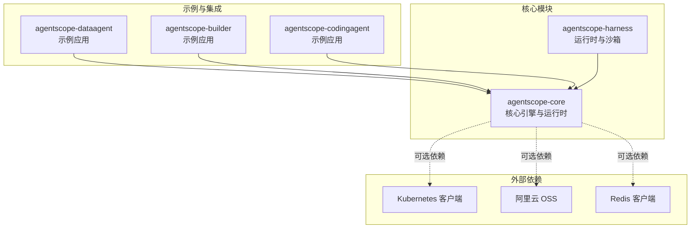

图示来源
- [pom.xml:199-231](file://agentscope-core/pom.xml#L199-L231)
- [application.yml（dataagent 示例）](file://agentscope-examples/agents/agentscope-dataagent/src/main/resources/application.yml)
- [application.yml（builder 示例）](file://agentscope-examples/agents/agentscope-builder/src/main/resources/application.yml)
- [application.yml（codingagent 示例）](file://agentscope-examples/agents/agentscope-codingagent/src/main/resources/application.yml)

章节来源
- [pom.xml:199-231](file://agentscope-core/pom.xml#L199-L231)
- [application.yml（dataagent 示例）](file://agentscope-examples/agents/agentscope-dataagent/src/main/resources/application.yml)
- [application.yml（builder 示例）](file://agentscope-examples/agents/agentscope-builder/src/main/resources/application.yml)
- [application.yml（codingagent 示例）](file://agentscope-examples/agents/agentscope-codingagent/src/main/resources/application.yml)

## 核心组件
- 运行时与沙箱：HarnessAgent 提供运行时能力与环境标签配置，支持技能管理工具与推广门禁等特性，便于在不同环境（如 prod）下差异化控制。
- 监控与追踪：Tracer 接口已标记为废弃，建议使用 OtelTracingMiddleware 实现可观测性；GracefulShutdownManager 提供优雅停机与活动请求跟踪，保障服务平滑下线。
- 工具执行与并发：ToolkitConfig 支持并行执行开关、自定义执行器与超时重试配置，便于在高并发场景下优化吞吐与稳定性。
- 权限与合规：PermissionDecision 与 PermissionRule 提供权限决策与规则模型，可用于对工具调用与输入进行合规校验与行为约束。
- 网络传输：HttpTransportFactory 提供默认 HTTP 传输实例与受管传输生命周期管理，便于统一网络层配置与清理。

章节来源
- [HarnessAgent.java:1607-1638](file://agentscope-harness/src/main/java/io/agentscope/harness/agent/HarnessAgent.java#L1607-L1638)
- [Tracer.java:1-39](file://agentscope-core/src/main/java/io/agentscope/core/tracing/Tracer.java#L1-L39)
- [GracefulShutdownManager.java:37-58](file://agentscope-core/src/main/java/io/agentscope/core/shutdown/GracefulShutdownManager.java#L37-L58)
- [ToolkitConfig.java:40-180](file://agentscope-core/src/main/java/io/agentscope/core/tool/ToolkitConfig.java#L40-L180)
- [PermissionDecision.java:1-36](file://agentscope-core/src/main/java/io/agentscope/core/permission/PermissionDecision.java#L1-L36)
- [PermissionRule.java:1-20](file://agentscope-core/src/main/java/io/agentscope/core/permission/PermissionRule.java#L1-L20)
- [HttpTransportFactory.java:58-91](file://agentscope-core/src/main/java/io/agentscope/core/model/transport/HttpTransportFactory.java#L58-L91)

## 架构总览
下图展示生产环境典型部署形态：前端通过网关或反向代理接入，后端由多个 Spring Boot 实例组成无状态服务集群，配合数据库、对象存储与缓存实现数据持久化与共享；可选地通过 Kubernetes 管理容器编排与弹性伸缩。

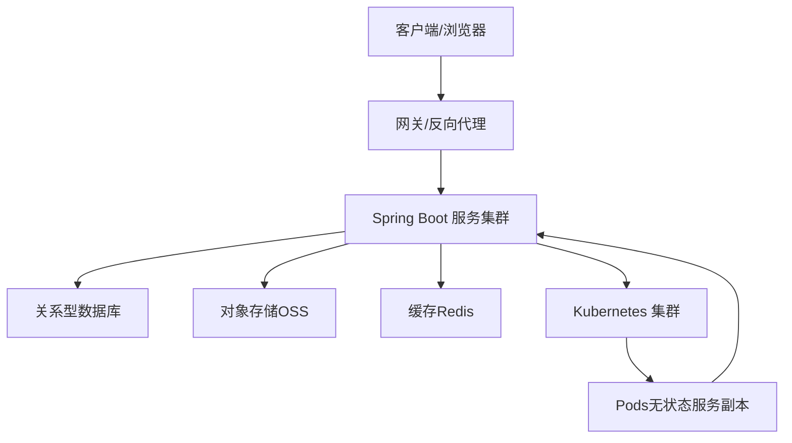

图示来源
- [pom.xml:206-212](file://agentscope-core/pom.xml#L206-L212)
- [application-jdbc.yml（dataagent 示例）](file://agentscope-examples/agents/agentscope-dataagent/src/main/resources/application-jdbc.yml)

## 详细组件分析

### 组件一：容器化与镜像构建
- 使用示例中的 Dockerfile 构建沙箱或运行时镜像，建议基于最小基础镜像并启用多阶段构建以减小体积。
- 在 CI 中将构建产物打包为容器镜像并推送至企业镜像仓库，结合版本标签与摘要进行可追溯发布。

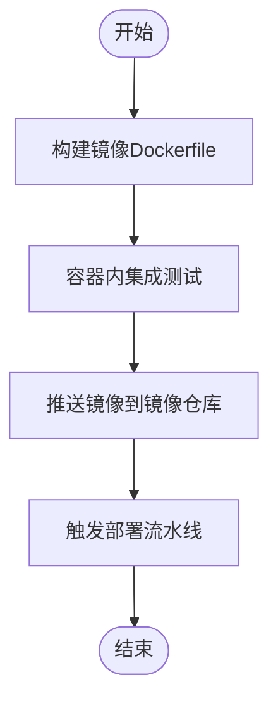

图示来源
- [Dockerfile（coding-sandbox）](file://agentscope-examples/agents/agentscope-codingagent/src/main/docker/coding-sandbox/Dockerfile)

章节来源
- [Dockerfile（coding-sandbox）](file://agentscope-examples/agents/agentscope-codingagent/src/main/docker/coding-sandbox/Dockerfile)

### 组件二：Spring Boot 配置与环境隔离
- 示例 application.yml 展示了通用配置项（如服务器端口、日志级别、工作空间路径等），建议按环境拆分配置文件（dev/staging/prod）并通过 Spring Profile 切换。
- application-jdbc.yml 演示了数据库连接参数与初始化脚本，生产环境应使用只读凭证与连接池参数优化。

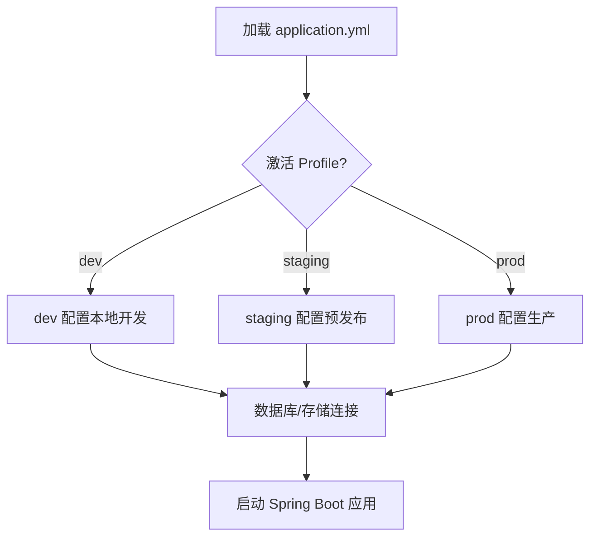

图示来源
- [application.yml（dataagent 示例）](file://agentscope-examples/agents/agentscope-dataagent/src/main/resources/application.yml)
- [application-jdbc.yml（dataagent 示例）](file://agentscope-examples/agents/agentscope-dataagent/src/main/resources/application-jdbc.yml)

章节来源
- [application.yml（dataagent 示例）](file://agentscope-examples/agents/agentscope-dataagent/src/main/resources/application.yml)
- [application-jdbc.yml（dataagent 示例）](file://agentscope-examples/agents/agentscope-dataagent/src/main/resources/application-jdbc.yml)

### 组件三：运行时与环境标签
- HarnessAgent 提供 environment 方法设置环境标签，用于过滤与可见性控制，便于在不同环境间区分策略与可见范围。

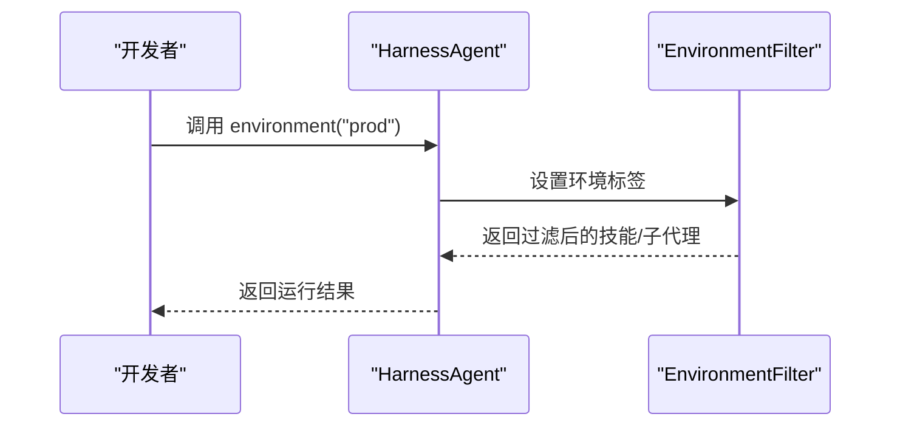

图示来源
- [HarnessAgent.java:1634-1638](file://agentscope-harness/src/main/java/io/agentscope/harness/agent/HarnessAgent.java#L1634-L1638)

章节来源
- [HarnessAgent.java:1607-1638](file://agentscope-harness/src/main/java/io/agentscope/harness/agent/HarnessAgent.java#L1607-L1638)

### 组件四：可观测性与追踪
- 建议使用 OtelTracingMiddleware 替代已废弃的 Tracer 接口，统一采集链路追踪、指标与日志。
- 结合 Spring Boot Actuator 暴露健康检查端点，便于探活与自动扩缩容。

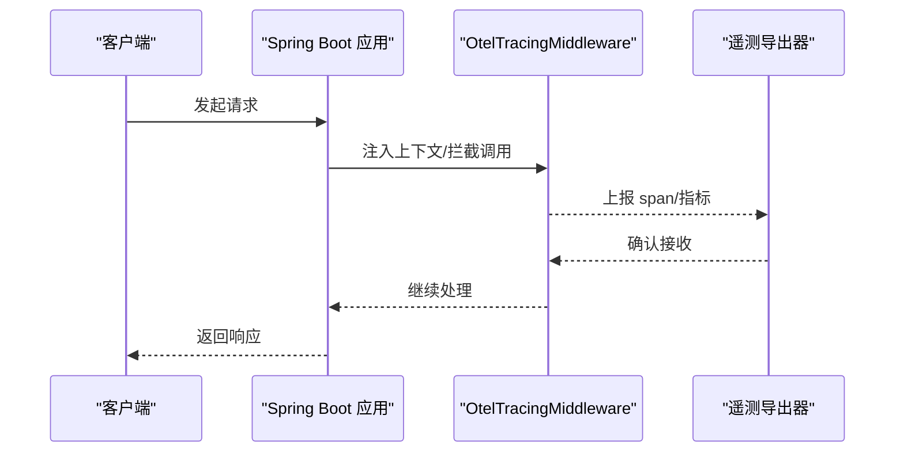

图示来源
- [Tracer.java:1-39](file://agentscope-core/src/main/java/io/agentscope/core/tracing/Tracer.java#L1-L39)

章节来源
- [Tracer.java:1-39](file://agentscope-core/src/main/java/io/agentscope/core/tracing/Tracer.java#L1-L39)

### 组件五：优雅停机与活动请求跟踪
- GracefulShutdownManager 全局管理优雅停机状态与活动请求，避免在停机过程中中断用户会话或丢失中间状态。

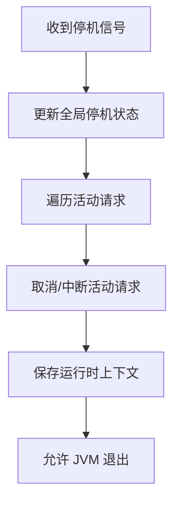

图示来源
- [GracefulShutdownManager.java:37-58](file://agentscope-core/src/main/java/io/agentscope/core/shutdown/GracefulShutdownManager.java#L37-L58)

章节来源
- [GracefulShutdownManager.java:37-58](file://agentscope-core/src/main/java/io/agentscope/core/shutdown/GracefulShutdownManager.java#L37-L58)

### 组件六：工具执行与并发控制
- ToolkitConfig 支持并行执行、自定义执行器与超时重试配置，适合在高并发场景下平衡吞吐与稳定性。

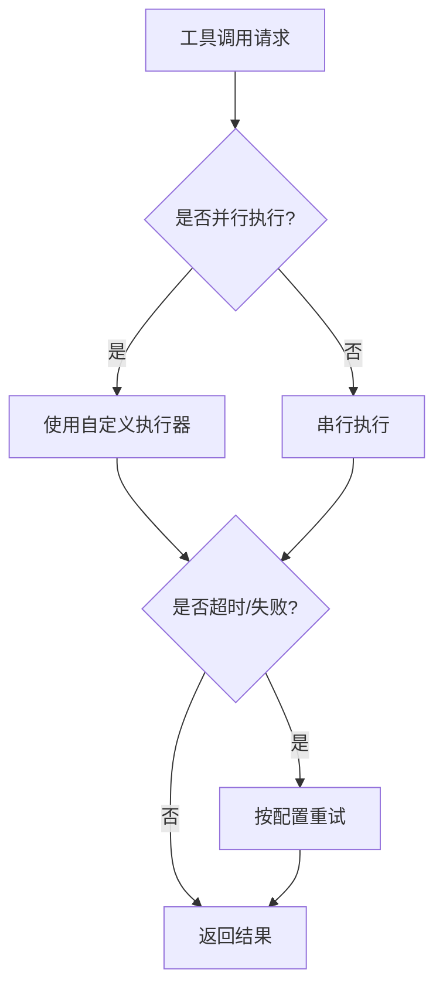

图示来源
- [ToolkitConfig.java:40-180](file://agentscope-core/src/main/java/io/agentscope/core/tool/ToolkitConfig.java#L40-L180)

章节来源
- [ToolkitConfig.java:40-180](file://agentscope-core/src/main/java/io/agentscope/core/tool/ToolkitConfig.java#L40-L180)

### 组件七：权限与合规
- PermissionDecision 与 PermissionRule 提供权限决策与规则模型，可用于对工具调用与输入进行合规校验与行为约束，降低越权与敏感信息泄露风险。

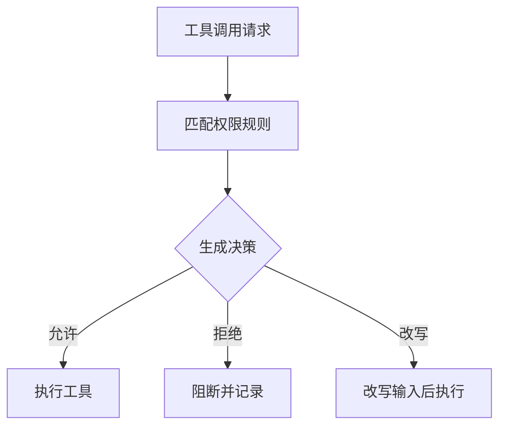

图示来源
- [PermissionDecision.java:1-36](file://agentscope-core/src/main/java/io/agentscope/core/permission/PermissionDecision.java#L1-L36)
- [PermissionRule.java:1-20](file://agentscope-core/src/main/java/io/agentscope/core/permission/PermissionRule.java#L1-L20)

章节来源
- [PermissionDecision.java:1-36](file://agentscope-core/src/main/java/io/agentscope/core/permission/PermissionDecision.java#L1-L36)
- [PermissionRule.java:1-20](file://agentscope-core/src/main/java/io/agentscope/core/permission/PermissionRule.java#L1-L20)

### 组件八：网络传输与生命周期管理
- HttpTransportFactory 提供默认传输实例与受管传输集合，便于集中管理网络连接与生命周期清理。

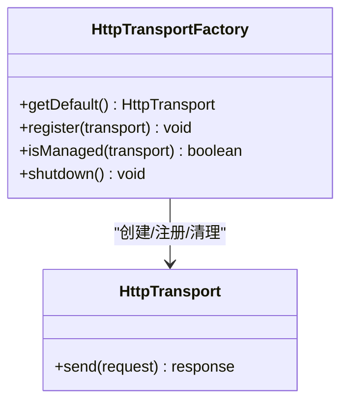

图示来源
- [HttpTransportFactory.java:58-91](file://agentscope-core/src/main/java/io/agentscope/core/model/transport/HttpTransportFactory.java#L58-L91)

章节来源
- [HttpTransportFactory.java:58-91](file://agentscope-core/src/main/java/io/agentscope/core/model/transport/HttpTransportFactory.java#L58-L91)

## 依赖关系分析
- 可选依赖包括 Kubernetes 客户端、阿里云 OSS SDK、Redis 客户端等，用于扩展沙箱、快照与对象存储能力。
- 示例应用通过 application.yml 与 application-jdbc.yml 引入数据库与日志配置，建议在生产环境使用只读凭证与连接池参数优化。

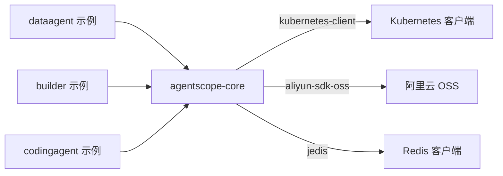

图示来源
- [pom.xml:199-231](file://agentscope-core/pom.xml#L199-L231)
- [application-jdbc.yml（dataagent 示例）](file://agentscope-examples/agents/agentscope-dataagent/src/main/resources/application-jdbc.yml)

章节来源
- [pom.xml:199-231](file://agentscope-core/pom.xml#L199-L231)
- [application-jdbc.yml（dataagent 示例）](file://agentscope-examples/agents/agentscope-dataagent/src/main/resources/application-jdbc.yml)

## 性能考虑
- 并发与执行器：通过 ToolkitConfig 启用并行执行与自定义执行器，结合限流与队列深度控制，避免过载。
- 网络层：使用 HttpTransportFactory 管理传输实例，合理设置超时与重试，减少长尾延迟。
- 数据访问：数据库连接池参数需根据 QPS 与事务特性调优；缓存命中率与失效策略影响整体延迟。
- 观测性：开启链路追踪与指标采集，结合告警阈值与自动扩缩容策略，提升系统弹性。

## 故障排查指南
- 优雅停机：若出现请求中断或状态丢失，检查 GracefulShutdownManager 的活动请求跟踪与保存逻辑。
- 权限问题：当工具调用被阻断，核对 PermissionDecision 与 PermissionRule 的匹配与改写逻辑。
- 网络异常：检查 HttpTransportFactory 的默认传输实例与受管传输集合，确认是否存在重复注册或未清理实例。
- 配置错误：核对 application.yml 与环境 Profile，确保数据库、存储与日志配置正确。

章节来源
- [GracefulShutdownManager.java:37-58](file://agentscope-core/src/main/java/io/agentscope/core/shutdown/GracefulShutdownManager.java#L37-L58)
- [PermissionDecision.java:1-36](file://agentscope-core/src/main/java/io/agentscope/core/permission/PermissionDecision.java#L1-L36)
- [PermissionRule.java:1-20](file://agentscope-core/src/main/java/io/agentscope/core/permission/PermissionRule.java#L1-L20)
- [HttpTransportFactory.java:58-91](file://agentscope-core/src/main/java/io/agentscope/core/model/transport/HttpTransportFactory.java#L58-L91)
- [application.yml（dataagent 示例）](file://agentscope-examples/agents/agentscope-dataagent/src/main/resources/application.yml)

## 结论
通过容器化与 Kubernetes 编排、完善的监控与日志体系、严格的权限与合规控制、以及优雅停机与网络传输治理，AgentScope 可在生产环境中实现高可用、可扩展与可维护的稳定运行。建议结合示例配置与核心组件的最佳实践，在 CI/CD 流程中固化部署与运维规范。

## 附录
- 安全与合规：遵循代码审查指令中的安全检查要点，避免硬编码密钥与敏感信息泄露，强化输入验证与 OWASP 十大风险防护。
- CI/CD：在流水线中集成镜像构建、容器扫描、配置校验与端到端测试，确保变更质量与可追溯性。
- 文档同步：任何影响功能的行为变更需同步更新文档，保持运维手册与用户文档一致。

章节来源
- [.github/instructions/code-review.instructions.md:1-42](file://.github/instructions/code-review.instructions.md#L1-L42)
- [README.md](file://README.md)
