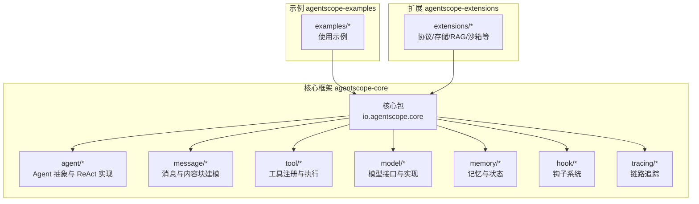
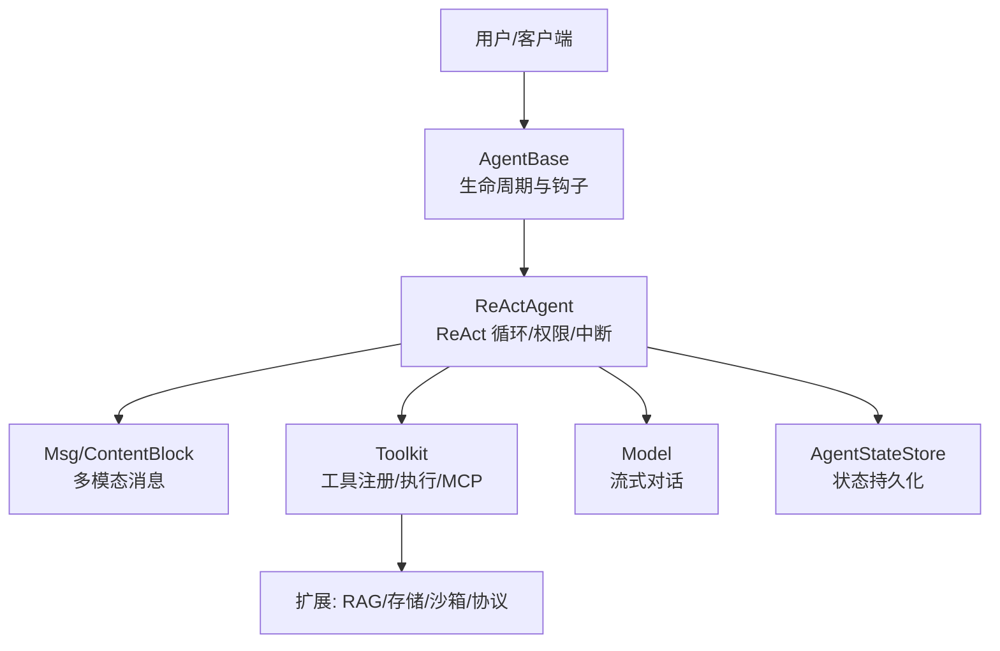
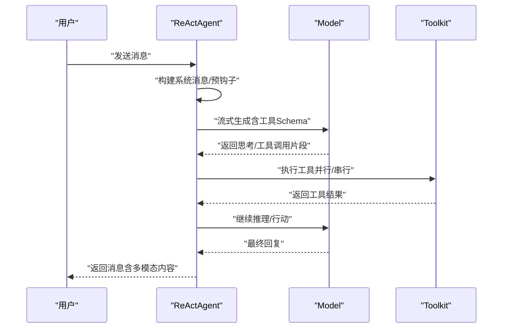
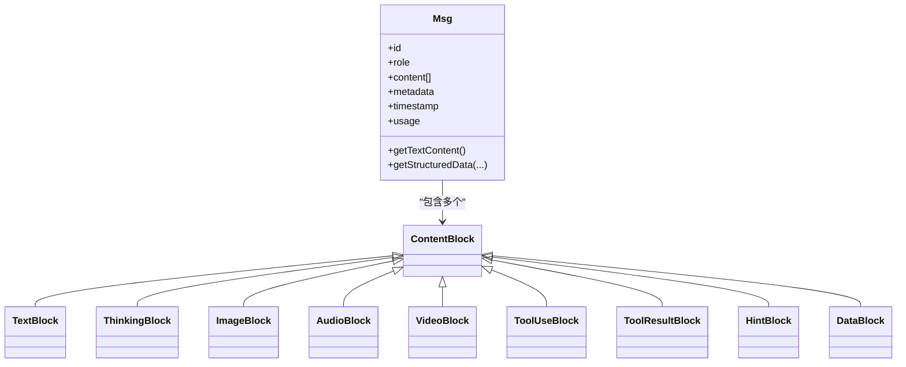
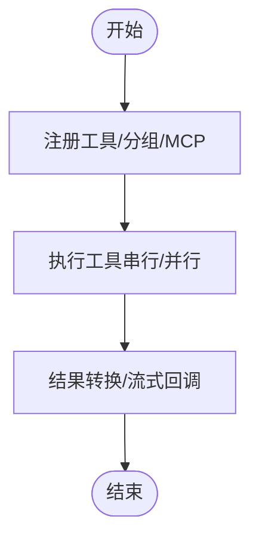
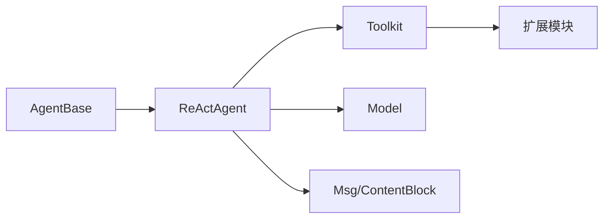

# 框架介绍

<cite>
**本文引用的文件**
- [README.md](file://README.md)
- [Version.java](file://agentscope-core/src/main/java/io/agentscope/core/Version.java)
- [ReActAgent.java](file://agentscope-core/src/main/java/io/agentscope/core/ReActAgent.java)
- [AgentBase.java](file://agentscope-core/src/main/java/io/agentscope/core/agent/AgentBase.java)
- [Msg.java](file://agentscope-core/src/main/java/io/agentscope/core/message/Msg.java)
- [ContentBlock.java](file://agentscope-core/src/main/java/io/agentscope/core/message/ContentBlock.java)
- [ThinkingBlock.java](file://agentscope-core/src/main/java/io/agentscope/core/message/ThinkingBlock.java)
- [ToolUseBlock.java](file://agentscope-core/src/main/java/io/agentscope/core/message/ToolUseBlock.java)
- [ToolResultBlock.java](file://agentscope-core/src/main/java/io/agentscope/core/message/ToolResultBlock.java)
- [Toolkit.java](file://agentscope-core/src/main/java/io/agentscope/core/tool/Toolkit.java)
- [Model.java](file://agentscope-core/src/main/java/io/agentscope/core/model/Model.java)
- [Memory.java](file://agentscope-core/src/main/java/io/agentscope/core/memory/Memory.java)
</cite>

## 目录
1. [引言](#引言)
2. [项目结构](#项目结构)
3. [核心组件](#核心组件)
4. [架构总览](#架构总览)
5. [详细组件分析](#详细组件分析)
6. [依赖关系分析](#依赖关系分析)
7. [性能考虑](#性能考虑)
8. [故障排查指南](#故障排查指南)
9. [结论](#结论)
10. [附录](#附录)

## 引言
AgentScope 是一个面向生产的 LLM 应用智能体开发框架，采用 ReAct（推理-行动）范式，支持工具调用、记忆管理、多智能体协作与流式输出等能力。它通过响应式（Project Reactor）设计实现非阻塞执行，并提供安全沙箱、可观测性与运行时干预机制，满足企业级部署对稳定性、可恢复性与可审计性的要求。

- 核心价值主张
  - 以 ReAct 为核心范式，让智能体具备“思考-决策-行动”的自适应能力
  - 提供安全中断、优雅取消、人机协同（HITL）等生产级控制手段
  - 内置结构化输出解析、长程记忆、RAG 等常用能力
  - 支持 MCP 协议与 A2A 协议，无缝扩展外部工具与多智能体协作
  - 基于 GraalVM 原生镜像，实现低冷启动延迟，适配无服务器与弹性扩缩容

- 解决的问题
  - 传统工作流刚性、缺乏动态决策与上下文持久化
  - 工具调用与模型输出格式不一致导致的解析与鲁棒性问题
  - 缺乏统一的中断、恢复与可观测性机制，难以在生产环境落地
  - 多智能体协作与外部工具生态接入复杂度高

- 定位与场景
  - 面向需要复杂任务规划与多步执行的企业级应用
  - 支持客服问答、知识检索增强、自动化流程编排、代码生成与调试等典型场景

**章节来源**
- [README.md:1-128](file://README.md#L1-L128)

## 项目结构
AgentScope 采用模块化分层组织：核心框架 agentscope-core 提供 Agent 抽象、ReAct 实现、消息与内容块建模、工具集、模型接口、内存与状态管理；examples 展示典型用法；extensions 提供协议扩展（MCP/A2A）、RAG、存储与沙箱等能力；distribution 提供打包与发布配置。

**图表来源**
- [AgentBase.java:1-120](file://agentscope-core/src/main/java/io/agentscope/core/agent/AgentBase.java#L1-L120)
- [ReActAgent.java:1-120](file://agentscope-core/src/main/java/io/agentscope/core/ReActAgent.java#L1-L120)
- [Msg.java:1-120](file://agentscope-core/src/main/java/io/agentscope/core/message/Msg.java#L1-L120)
- [Toolkit.java:1-120](file://agentscope-core/src/main/java/io/agentscope/core/tool/Toolkit.java#L1-L120)
- [Model.java:1-54](file://agentscope-core/src/main/java/io/agentscope/core/model/Model.java#L1-L54)
- [Memory.java:1-79](file://agentscope-core/src/main/java/io/agentscope/core/memory/Memory.java#L1-L79)

**章节来源**
- [README.md:28-100](file://README.md#L28-L100)

## 核心组件
- Agent 抽象与生命周期
  - AgentBase 提供统一的调用生命周期：获取执行资源、序列化并发调用、预钩子通知、实际执行、后钩子通知、错误处理与中断恢复、释放资源
  - ReActAgent 在此基础上实现 ReAct 循环：交替进行“推理（思考/计划）”与“行动（工具调用）”，支持最大迭代次数、结构化输出、权限与中断控制

- 消息与内容块
  - Msg 表达一次交互单元，支持多种角色（用户/助手/系统/工具），内容由 ContentBlock 组成，包括文本、图像/音频/视频、思维块、工具调用/结果、提示块与通用数据块
  - ThinkingBlock 用于承载推理过程；ToolUseBlock/ToolResultBlock 描述工具请求与结果；ContentBlock 作为密封类确保类型安全与序列化一致性

- 工具系统
  - Toolkit 负责工具注册、分组、Schema 生成、执行器与 MCP 客户端集成；支持预设参数、元工具（动态切换工具组）、并行/串行执行与流式回调

- 模型接口
  - Model 接口定义流式对话能力，支持传入工具 Schema 与生成选项；不同厂商实现（如 DashScope/OpenAI/Gemini/Ollama）通过适配器接入

- 记忆与状态
  - Memory 为历史会话存储接口（已标记废弃，新版本使用 AgentState）
  - ReActAgent 通过 AgentState 与 AgentStateStore 管理会话上下文、工具激活组、权限上下文与中断控制

**章节来源**
- [AgentBase.java:47-120](file://agentscope-core/src/main/java/io/agentscope/core/agent/AgentBase.java#L47-L120)
- [ReActAgent.java:148-200](file://agentscope-core/src/main/java/io/agentscope/core/ReActAgent.java#L148-L200)
- [Msg.java:40-120](file://agentscope-core/src/main/java/io/agentscope/core/message/Msg.java#L40-L120)
- [ContentBlock.java:22-68](file://agentscope-core/src/main/java/io/agentscope/core/message/ContentBlock.java#L22-L68)
- [ThinkingBlock.java:23-80](file://agentscope-core/src/main/java/io/agentscope/core/message/ThinkingBlock.java#L23-L80)
- [ToolUseBlock.java:24-120](file://agentscope-core/src/main/java/io/agentscope/core/message/ToolUseBlock.java#L24-L120)
- [ToolResultBlock.java:26-120](file://agentscope-core/src/main/java/io/agentscope/core/message/ToolResultBlock.java#L26-L120)
- [Toolkit.java:37-120](file://agentscope-core/src/main/java/io/agentscope/core/tool/Toolkit.java#L37-L120)
- [Model.java:22-54](file://agentscope-core/src/main/java/io/agentscope/core/model/Model.java#L22-L54)
- [Memory.java:22-79](file://agentscope-core/src/main/java/io/agentscope/core/memory/Memory.java#L22-L79)

## 架构总览
AgentScope 的整体架构围绕“响应式 + 可观测 + 可扩展”的设计展开：AgentBase 统一调度生命周期与中断；ReActAgent 将“推理-行动”循环与工具调用、结构化输出、权限与记忆整合；消息与内容块提供多模态输入输出的统一抽象；工具系统与模型接口解耦具体实现；扩展模块提供协议与基础设施能力。

**图表来源**
- [AgentBase.java:252-322](file://agentscope-core/src/main/java/io/agentscope/core/agent/AgentBase.java#L252-L322)
- [ReActAgent.java:497-556](file://agentscope-core/src/main/java/io/agentscope/core/ReActAgent.java#L497-L556)
- [Msg.java:67-120](file://agentscope-core/src/main/java/io/agentscope/core/message/Msg.java#L67-L120)
- [Toolkit.java:66-120](file://agentscope-core/src/main/java/io/agentscope/core/tool/Toolkit.java#L66-L120)
- [Model.java:22-54](file://agentscope-core/src/main/java/io/agentscope/core/model/Model.java#L22-L54)

## 详细组件分析

### ReAct 代理模式与优势
- 概念
  - ReAct 将“推理（思考/计划）”与“行动（工具调用）”交替进行，直到完成目标或达到最大迭代限制
  - 框架通过 ThinkingBlock/ToolUseBlock/ToolResultBlock 明确区分“思考”“工具请求”“工具结果”，提升可解释性与可观测性

- 优势
  - 动态决策：根据当前上下文选择下一步行动，而非固定流程
  - 可恢复性：支持安全中断、优雅取消与人类在回路（HITL）干预
  - 结构化输出：内置结构化输出解析，保证模型输出符合预期格式
  - 多模态消息：统一的消息与内容块抽象，支持文本、图片、音频、视频与工具结果

**图表来源**
- [ReActAgent.java:795-800](file://agentscope-core/src/main/java/io/agentscope/core/ReActAgent.java#L795-L800)
- [Model.java:22-54](file://agentscope-core/src/main/java/io/agentscope/core/model/Model.java#L22-L54)
- [Toolkit.java:490-525](file://agentscope-core/src/main/java/io/agentscope/core/tool/Toolkit.java#L490-L525)

**章节来源**
- [ReActAgent.java:148-200](file://agentscope-core/src/main/java/io/agentscope/core/ReActAgent.java#L148-L200)
- [ThinkingBlock.java:23-80](file://agentscope-core/src/main/java/io/agentscope/core/message/ThinkingBlock.java#L23-L80)
- [ToolUseBlock.java:24-120](file://agentscope-core/src/main/java/io/agentscope/core/message/ToolUseBlock.java#L24-L120)
- [ToolResultBlock.java:26-120](file://agentscope-core/src/main/java/io/agentscope/core/message/ToolResultBlock.java#L26-L120)

### 多模态消息处理
- 设计要点
  - ContentBlock 作为密封类，统一多模态内容类型（文本、图像/音频/视频、思维、工具调用/结果、提示与通用数据）
  - Msg 作为消息载体，支持角色、时间戳、用量统计与元数据，便于跨组件传递与持久化
  - 工具结果支持多内容块输出，便于组合文本、图片、JSON 等异构数据

**图表来源**
- [Msg.java:67-120](file://agentscope-core/src/main/java/io/agentscope/core/message/Msg.java#L67-L120)
- [ContentBlock.java:58-68](file://agentscope-core/src/main/java/io/agentscope/core/message/ContentBlock.java#L58-L68)
- [ThinkingBlock.java:37-80](file://agentscope-core/src/main/java/io/agentscope/core/message/ThinkingBlock.java#L37-L80)
- [ToolUseBlock.java:34-120](file://agentscope-core/src/main/java/io/agentscope/core/message/ToolUseBlock.java#L34-L120)
- [ToolResultBlock.java:35-120](file://agentscope-core/src/main/java/io/agentscope/core/message/ToolResultBlock.java#L35-L120)

**章节来源**
- [Msg.java:40-120](file://agentscope-core/src/main/java/io/agentscope/core/message/Msg.java#L40-L120)
- [ContentBlock.java:22-68](file://agentscope-core/src/main/java/io/agentscope/core/message/ContentBlock.java#L22-L68)

### 工具系统与执行
- 能力
  - 注册与发现：基于注解或显式注册，支持外部工具 Schema 与 MCP 客户端
  - 分组与动态控制：通过工具组与元工具实现运行时动态启用/禁用
  - 执行策略：支持并行/串行执行、超时与重试合并策略、流式进度回调
  - 权限与安全：结合权限引擎与沙箱，保障工具调用的安全可控

**图表来源**
- [Toolkit.java:150-243](file://agentscope-core/src/main/java/io/agentscope/core/tool/Toolkit.java#L150-L243)
- [Toolkit.java:490-525](file://agentscope-core/src/main/java/io/agentscope/core/tool/Toolkit.java#L490-L525)

**章节来源**
- [Toolkit.java:37-120](file://agentscope-core/src/main/java/io/agentscope/core/tool/Toolkit.java#L37-L120)
- [Toolkit.java:490-525](file://agentscope-core/src/main/java/io/agentscope/core/tool/Toolkit.java#L490-L525)

### 模型接口与结构化输出
- Model 接口提供统一的流式对话能力，支持传入工具 Schema 与生成选项
- 对于支持原生结构化输出的模型，可直接注入 JSON Schema，避免额外工具包装

**章节来源**
- [Model.java:22-54](file://agentscope-core/src/main/java/io/agentscope/core/model/Model.java#L22-L54)

### 记忆与状态管理
- Memory 接口用于历史会话存储（已标记废弃）
- 新版本通过 AgentState 与 AgentStateStore 管理会话上下文、工具激活组、权限上下文与中断控制，支持分布式部署下的状态同步

**章节来源**
- [Memory.java:22-79](file://agentscope-core/src/main/java/io/agentscope/core/memory/Memory.java#L22-L79)
- [ReActAgent.java:412-422](file://agentscope-core/src/main/java/io/agentscope/core/ReActAgent.java#L412-L422)

## 依赖关系分析
- 组件耦合
  - AgentBase 与 ReActAgent：前者提供生命周期与钩子，后者实现 ReAct 循环
  - ReActAgent 与 Toolkit/Model：前者驱动工具调用与模型交互
  - Msg/ContentBlock：贯穿消息传递与工具结果封装
- 外部依赖
  - Project Reactor：非阻塞响应式编程
  - Jackson：多模态内容与消息的序列化
  - OpenTelemetry：链路追踪（扩展）

**图表来源**
- [AgentBase.java:92-120](file://agentscope-core/src/main/java/io/agentscope/core/agent/AgentBase.java#L92-L120)
- [ReActAgent.java:200-330](file://agentscope-core/src/main/java/io/agentscope/core/ReActAgent.java#L200-L330)
- [Toolkit.java:66-120](file://agentscope-core/src/main/java/io/agentscope/core/tool/Toolkit.java#L66-L120)
- [Model.java:22-54](file://agentscope-core/src/main/java/io/agentscope/core/model/Model.java#L22-L54)
- [Msg.java:67-120](file://agentscope-core/src/main/java/io/agentscope/core/message/Msg.java#L67-L120)

**章节来源**
- [AgentBase.java:92-120](file://agentscope-core/src/main/java/io/agentscope/core/agent/AgentBase.java#L92-L120)
- [ReActAgent.java:200-330](file://agentscope-core/src/main/java/io/agentscope/core/ReActAgent.java#L200-L330)

## 性能考虑
- 响应式与非阻塞：基于 Project Reactor 的响应式管线，降低线程阻塞与上下文切换开销
- 并行执行：工具执行支持并行策略，结合超时与重试配置，平衡吞吐与稳定性
- 冷启动优化：支持 GraalVM 原生镜像，显著缩短冷启动时间，适合无服务器与弹性扩缩容场景
- 观测性：内嵌 OpenTelemetry 集成，便于端到端链路追踪与性能分析

**章节来源**
- [README.md:65-71](file://README.md#L65-L71)
- [AgentBase.java:252-322](file://agentscope-core/src/main/java/io/agentscope/core/agent/AgentBase.java#L252-L322)
- [Toolkit.java:490-525](file://agentscope-core/src/main/java/io/agentscope/core/tool/Toolkit.java#L490-L525)

## 故障排查指南
- 中断与恢复
  - 使用 ReActAgent.interrupt(...) 触发中断，框架在合适检查点抛出中断异常并进入恢复流程
  - 通过状态持久化（AgentStateStore）保存会话状态，支持恢复与重放
- 错误处理
  - AgentBase 的错误处理器将 InterruptedException 特殊处理并交由 handleInterrupt 回调，其他错误通过钩子链路上报
- 结构化输出校验
  - 若模型输出不符合预期格式，可通过结构化输出能力自动纠错并映射到目标对象
- 工具执行异常
  - 工具抛出 ToolSuspendException 时，框架生成 Suspended 结果，提示外部执行；普通异常则转为错误结果

**章节来源**
- [AgentBase.java:494-502](file://agentscope-core/src/main/java/io/agentscope/core/agent/AgentBase.java#L494-L502)
- [ReActAgent.java:686-722](file://agentscope-core/src/main/java/io/agentscope/core/ReActAgent.java#L686-L722)
- [ToolResultBlock.java:142-187](file://agentscope-core/src/main/java/io/agentscope/core/message/ToolResultBlock.java#L142-L187)

## 结论
AgentScope 以 ReAct 为核心范式，结合响应式、可观测与可扩展的设计，为企业级智能体应用提供了从消息建模、工具执行到记忆与权限控制的一体化解决方案。其多模态消息抽象、结构化输出与生产级中断/恢复机制，使其既能满足初学者快速上手，也能帮助专家高效构建复杂、可维护的智能体系统。

## 附录
- 版本与用户代理
  - 框架版本与 User-Agent 字符串由 Version 类统一管理，便于追踪与统计
- 快速开始
  - 通过 Maven 引入依赖，使用 ReActAgent.builder 创建智能体，调用 call(...) 发送消息并接收响应

**章节来源**
- [Version.java:24-46](file://agentscope-core/src/main/java/io/agentscope/core/Version.java#L24-L46)
- [README.md:72-100](file://README.md#L72-L100)
