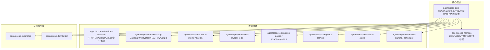
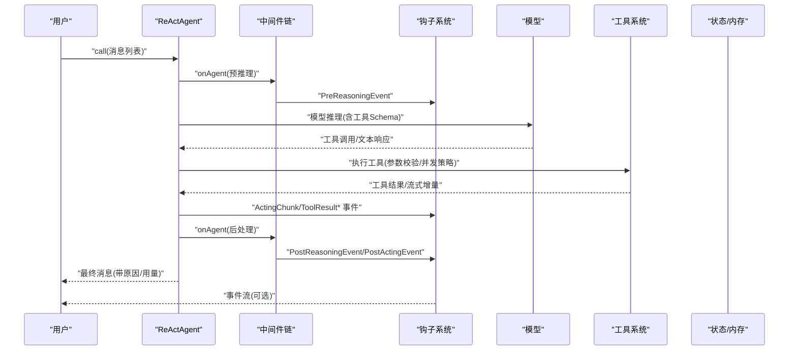
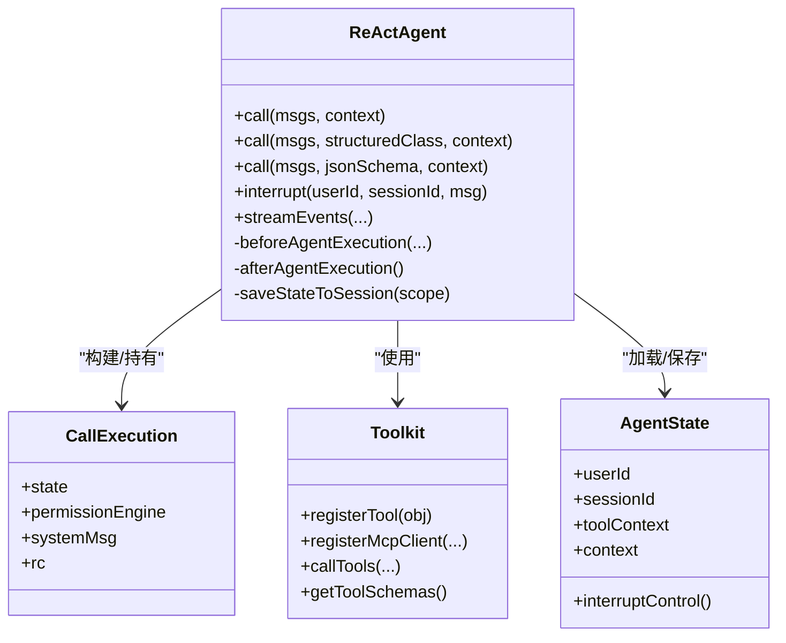
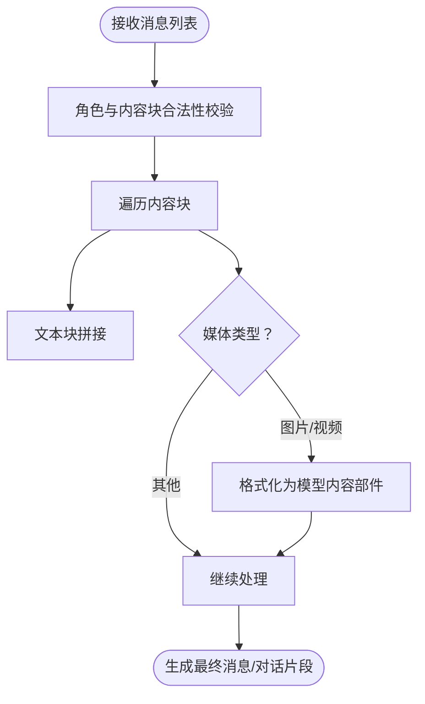
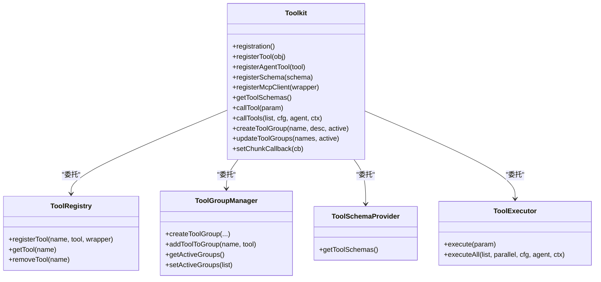
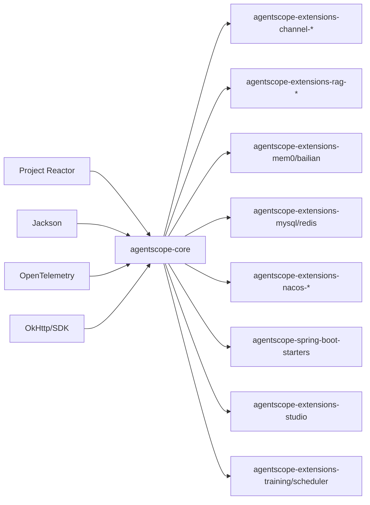

# 项目概述

<cite>
**本文引用的文件**
- [README.md](file://README.md)
- [README_zh.md](file://README_zh.md)
- [Version.java](file://agentscope-core/src/main/java/io/agentscope/core/Version.java)
- [ReActAgent.java](file://agentscope-core/src/main/java/io/agentscope/core/ReActAgent.java)
- [Msg.java](file://agentscope-core/src/main/java/io/agentscope/core/message/Msg.java)
- [Toolkit.java](file://agentscope-core/src/main/java/io/agentscope/core/tool/Toolkit.java)
- [LongTermMemory.java](file://agentscope-core/src/main/java/io/agentscope/core/memory/LongTermMemory.java)
- [pom.xml](file://agentscope-core/pom.xml)
- [SKILL.md](file://SKILL.md)
- [OtelTracingMiddleware.java](file://agentscope-core/src/main/java/io/agentscope/core/tracing/OtelTracingMiddleware.java)
- [StudioManager.java](file://agentscope-extensions/agentscope-extensions-studio/src/main/java/io/agentscope/core/studio/StudioManager.java)
- [IsolationScope.java](file://agentscope-harness/src/main/java/io/agentscope/harness/agent/IsolationScope.java)
- [HarnessAgent.java](file://agentscope-harness/src/main/java/io/agentscope/harness/agent/HarnessAgent.java)
- [agentscope-spring-boot-starters/pom.xml](file://agentscope-extensions/agentscope-spring-boot-starters/pom.xml)
- [agentscope-extensions-agent-protocol/pom.xml](file://agentscope-extensions/agentscope-extensions-protocol/agentscope-extensions-agent-protocol/pom.xml)
</cite>

## 目录
1. [引言](#引言)
2. [项目结构](#项目结构)
3. [核心组件](#核心组件)
4. [架构总览](#架构总览)
5. [详细组件分析](#详细组件分析)
6. [依赖关系分析](#依赖关系分析)
7. [性能考量](#性能考量)
8. [故障排查指南](#故障排查指南)
9. [结论](#结论)
10. [附录](#附录)

## 引言
AgentScope Java 是一个面向生产的大型语言模型（LLM）智能体开发框架，采用 ReAct 推理-行动范式，结合工具调用、多模态消息、内存与状态管理、中间件与钩子系统、以及可观测性与安全沙箱，提供从单智能体到多智能体协作的完整能力。其设计强调“可控的自治”：既赋予智能体动态决策的能力，又通过中断、取消、人机协同等机制保障生产可用性。

- 核心使命：以 Java 为基础，构建“可生产、可观察、可治理”的智能体应用体系。
- 设计理念：Reactive（响应式）、消息驱动、事件可观测、工具即能力、状态即契约。
- 架构优势：非阻塞执行、模块化插件、统一事件流、可扩展的中间件与钩子、跨平台沙箱与分布式协议支持。

## 项目结构
仓库采用多模块分层组织，核心模块包括：
- agentscope-core：框架内核，包含 ReAct 智能体、消息模型、工具系统、中间件、钩子、内存与状态、模型适配器、权限与中断控制、可观测性等。
- agentscope-extensions：扩展生态，覆盖通道（钉钉、飞书、GitHub、GitLab、企业微信）、RAG、MySQL/Redis 分布式存储、Nacos 服务发现、Spring Boot Starter、Studio 可视化、训练与调度等。
- agentscope-harness：运行时与沙箱集成、工作区抽象、分布式状态存储、子智能体与文件系统后端等。
- agentscope-examples：示例工程与文档，涵盖快速入门、多模态、中间件、技能、状态、流式、结构化输出等场景。
- agentscope-distribution：发布与聚合模块，提供 BOM、All 打包与分发配置。

图示来源
- [pom.xml:1-263](file://agentscope-core/pom.xml#L1-L263)
- [agentscope-spring-boot-starters/pom.xml:1-58](file://agentscope-extensions/agentscope-spring-boot-starters/pom.xml#L1-L58)

章节来源
- [pom.xml:1-263](file://agentscope-core/pom.xml#L1-L263)
- [agentscope-spring-boot-starters/pom.xml:1-58](file://agentscope-extensions/agentscope-spring-boot-starters/pom.xml#L1-L58)

## 核心组件
- ReAct 智能体：以“推理-行动”循环为核心，支持最大迭代次数、结构化输出、事件流、Hook 与中间件、权限与中断控制、会话状态持久化。
- 消息与多模态：统一的消息模型支持文本、图片、音频、视频、思考块、工具调用与结果块；多格式到各模型的格式化器。
- 工具系统：工具注册、分组、Schema 生成、参数校验、执行器、MCP 客户端、元工具（动态管理工具组）。
- 中间件与钩子：统一的生命周期拦截点，贯穿预推理、推理、模型调用、行动、后处理等阶段。
- 内存与状态：会话级 AgentState 存储、工具激活组同步、权限引擎缓存、分布式状态绑定。
- 观测性：OpenTelemetry 中间件、事件流、Studio 可视化调试与监控。
- 安全与隔离：沙箱隔离、文件系统命名空间、远程存储、隔离作用域（按用户/会话/智能体/全局）。

章节来源
- [ReActAgent.java:148-200](file://agentscope-core/src/main/java/io/agentscope/core/ReActAgent.java#L148-L200)
- [Msg.java:40-67](file://agentscope-core/src/main/java/io/agentscope/core/message/Msg.java#L40-L67)
- [Toolkit.java:37-65](file://agentscope-core/src/main/java/io/agentscope/core/tool/Toolkit.java#L37-L65)
- [OtelTracingMiddleware.java:1-38](file://agentscope-core/src/main/java/io/agentscope/core/tracing/OtelTracingMiddleware.java#L1-L38)

## 架构总览
AgentScope 采用“消息驱动 + 事件流 + 中间件钩子”的统一执行管线，ReAct 智能体作为入口协调模型、工具与外部系统，并通过事件流对外暴露执行过程，便于观测与干预。

图示来源
- [ReActAgent.java:795-800](file://agentscope-core/src/main/java/io/agentscope/core/ReActAgent.java#L795-L800)
- [OtelTracingMiddleware.java:1-38](file://agentscope-core/src/main/java/io/agentscope/core/tracing/OtelTracingMiddleware.java#L1-L38)

## 详细组件分析

### ReAct 智能体（ReActAgent）
- 关键特性
  - 响应式非阻塞：基于 Project Reactor，支持流式事件与终端消息。
  - 结构化输出：每调用一次返回单一 Msg，支持类型安全输出与 JSON Schema 自纠正。
  - 事件流：统一的 AgentStartEvent/AgentEndEvent 包裹完整生命周期，中间穿插推理、模型调用、行动、工具结果等细粒度事件。
  - 会话与状态：按 (userId, sessionId) 切片，每个切片维护独立 AgentState 与权限引擎缓存；支持持久化与分布式一致性。
  - 中断与取消：支持安全中断、优雅取消、人机协同（HITL）注入。
- 设计要点
  - CallExecution 作为每次调用的执行上下文，贯穿系统消息、工具执行、事件发射与状态保存。
  - 中间件链在 onAgent 层面统一应用，确保所有调用路径一致。
  - 工具执行器支持顺序/并行策略与超时/重试配置合并。

图示来源
- [ReActAgent.java:200-330](file://agentscope-core/src/main/java/io/agentscope/core/ReActAgent.java#L200-L330)
- [Toolkit.java:66-117](file://agentscope-core/src/main/java/io/agentscope/core/tool/Toolkit.java#L66-L117)

章节来源
- [ReActAgent.java:148-200](file://agentscope-core/src/main/java/io/agentscope/core/ReActAgent.java#L148-L200)
- [ReActAgent.java:627-637](file://agentscope-core/src/main/java/io/agentscope/core/ReActAgent.java#L627-L637)
- [ReActAgent.java:795-800](file://agentscope-core/src/main/java/io/agentscope/core/ReActAgent.java#L795-L800)

### 多模态消息（Msg 与内容块）
- 消息模型
  - 支持角色区分（用户/助手/系统/工具），内容块可组合，元数据用于结构化输出、用量统计、生成原因等。
  - 内容块类型：文本、数据（图片/音频/视频）、思考块、工具调用/结果块。
- 多模态格式化
  - 针对不同模型（DashScope、Anthropic 等）提供对话合并器与多模态格式转换器，确保图片/视频等媒体正确序列化。
- 用途
  - 用户输入多模态内容、模型输出文本+工具调用、工具返回多模态结果，形成闭环。

图示来源
- [Msg.java:166-198](file://agentscope-core/src/main/java/io/agentscope/core/message/Msg.java#L166-L198)
- [DashScopeConversationMerger.java:193-282](file://agentscope-core/src/main/java/io/agentscope/core/formatter/dashscope/DashScopeConversationMerger.java#L193-L282)
- [AnthropicMultiAgentFormatter.java:192-219](file://agentscope-core/src/main/java/io/agentscope/core/formatter/anthropic/AnthropicMultiAgentFormatter.java#L192-L219)

章节来源
- [Msg.java:40-67](file://agentscope-core/src/main/java/io/agentscope/core/message/Msg.java#L40-L67)
- [Msg.java:527-535](file://agentscope-core/src/main/java/io/agentscope/core/message/Msg.java#L527-L535)

### 工具系统（Toolkit 与工具生态）
- 工具注册与分组
  - 支持对象方法扫描注册、AgentTool 直接注册、SchemaOnly 工具、MCP 客户端注册与动态工具组。
  - 工具组支持 META/EXTERNAL 两种作用域，配合元工具实现运行时动态启用/停用。
- 执行与校验
  - 参数校验（JSON Schema）、结果转换、并发/顺序策略、超时与重试合并、预设参数动态更新。
- 流式回调
  - 支持设置 chunk 回调，将工具进度通过事件流暴露给上层。

图示来源
- [Toolkit.java:37-65](file://agentscope-core/src/main/java/io/agentscope/core/tool/Toolkit.java#L37-L65)
- [Toolkit.java:146-148](file://agentscope-core/src/main/java/io/agentscope/core/tool/Toolkit.java#L146-L148)
- [Toolkit.java:490-525](file://agentscope-core/src/main/java/io/agentscope/core/tool/Toolkit.java#L490-L525)

章节来源
- [Toolkit.java:146-148](file://agentscope-core/src/main/java/io/agentscope/core/tool/Toolkit.java#L146-L148)
- [Toolkit.java:294-325](file://agentscope-core/src/main/java/io/agentscope/core/tool/Toolkit.java#L294-L325)
- [Toolkit.java:490-525](file://agentscope-core/src/main/java/io/agentscope/core/tool/Toolkit.java#L490-L525)

### 内存与状态（会话级 AgentState）
- 会话切片
  - 以 (userId, sessionId) 为键，每个切片维护独立 AgentState 与权限引擎缓存，避免并发污染。
- 状态持久化
  - 可选 AgentStateStore 实现跨实例一致性；默认内存缓存；支持从旧版会话迁移。
- 工具激活组
  - 工具组激活状态与 AgentState 同步，确保每次调用看到正确的工具表面。

章节来源
- [ReActAgent.java:437-478](file://agentscope-core/src/main/java/io/agentscope/core/ReActAgent.java#L437-L478)
- [ReActAgent.java:412-422](file://agentscope-core/src/main/java/io/agentscope/core/ReActAgent.java#L412-L422)
- [LongTermMemory.java:22-45](file://agentscope-core/src/main/java/io/agentscope/core/memory/LongTermMemory.java#L22-L45)

### 观测性与可视化（OpenTelemetry 与 Studio）
- OpenTelemetry 中间件
  - 在模型调用、工具调用、行动等关键节点打点，传播上下文，支持分布式追踪。
- Studio 可视化
  - 提供事件流展示、调试面板、实时监控与日志聚合，辅助开发与运维。

章节来源
- [OtelTracingMiddleware.java:1-38](file://agentscope-core/src/main/java/io/agentscope/core/tracing/OtelTracingMiddleware.java#L1-L38)
- [StudioManager.java:1-24](file://agentscope-extensions/agentscope-extensions-studio/src/main/java/io/agentscope/core/studio/StudioManager.java#L1-L24)

### 安全与隔离（沙箱与隔离作用域）
- 沙箱
  - 为不可信工具代码提供隔离执行环境，支持文件系统、GUI 自动化、移动端交互等场景。
- 隔离作用域
  - 支持按用户、会话、智能体、全局四种作用域进行状态与文件命名空间隔离。
- 运行时集成
  - 与工作区抽象、分布式存储、子智能体工厂协同，实现跨进程/容器的一致性。

章节来源
- [IsolationScope.java:21-86](file://agentscope-harness/src/main/java/io/agentscope/harness/agent/IsolationScope.java#L21-L86)
- [HarnessAgent.java:1425-1465](file://agentscope-harness/src/main/java/io/agentscope/harness/agent/HarnessAgent.java#L1425-L1465)

## 依赖关系分析
- 核心依赖
  - Project Reactor：非阻塞响应式编程基础。
  - Jackson：JSON 序列化与 Schema 生成。
  - OpenTelemetry：分布式追踪。
  - OkHttp/SDK：模型厂商客户端（DashScope、Gemini、Anthropic 等）。
- 示例与测试
  - 示例工程覆盖多模态、中间件、技能、状态、流式、结构化输出等主题。
- Spring Boot 集成
  - 提供多个 Starter，简化在 Spring Boot 环境下的集成与配置。

图示来源
- [pom.xml:52-176](file://agentscope-core/pom.xml#L52-L176)
- [agentscope-spring-boot-starters/pom.xml:1-58](file://agentscope-extensions/agentscope-spring-boot-starters/pom.xml#L1-L58)

章节来源
- [pom.xml:52-176](file://agentscope-core/pom.xml#L52-L176)
- [agentscope-spring-boot-starters/pom.xml:1-58](file://agentscope-extensions/agentscope-spring-boot-starters/pom.xml#L1-L58)

## 性能考量
- 响应式非阻塞：基于 Reactor 的异步执行，减少线程阻塞，提升吞吐。
- 并发与序列化：按会话切片串行化同一会话内的多次调用，避免状态竞争；跨会话并发执行。
- 冷启动优化：GraalVM 原生镜像支持，缩短冷启动时间，适合 Serverless 与弹性扩缩容。
- 观测性开销：中间件与追踪仅在启用时生效，避免对无追踪场景造成额外负担。

## 故障排查指南
- 中断与取消
  - 使用 interrupt(userId, sessionId, msg) 在任意阶段触发中断；工具执行可被优雅取消而不破坏状态。
- 事件流定位
  - 通过 streamEvents 获取细粒度事件流，结合 OpenTelemetry Span ID 定位问题。
- 结构化输出异常
  - 若模型输出不符合 Schema，系统会自动引导修正；检查工具 Schema 生成与转换器配置。
- 权限与工具组
  - 确认工具组激活状态与权限规则；必要时通过元工具动态调整。
- 沙箱与隔离
  - 检查 IsolationScope 设置与工作区命名空间；确认远程存储与快照配置。

章节来源
- [ReActAgent.java:686-722](file://agentscope-core/src/main/java/io/agentscope/core/ReActAgent.java#L686-L722)
- [OtelTracingMiddleware.java:1-38](file://agentscope-core/src/main/java/io/agentscope/core/tracing/OtelTracingMiddleware.java#L1-L38)
- [Toolkit.java:633-641](file://agentscope-core/src/main/java/io/agentscope/core/tool/Toolkit.java#L633-L641)

## 结论
AgentScope Java 将 ReAct 推理范式、工具即能力、消息驱动与可观测性有机结合，形成一套兼顾灵活性与生产可用性的智能体开发体系。通过中间件与钩子的统一拦截、事件流的可观测、沙箱与隔离的作用域控制，以及 Spring Boot 与企业协议的无缝集成，框架既能满足初学者快速上手，也能支撑企业级复杂场景的演进与落地。

## 附录

### 技术栈概览
- 编程语言与运行时：Java 17+，GraalVM 原生镜像（可选）
- 核心库：Project Reactor、Jackson、OpenTelemetry
- 模型 SDK：DashScope、Gemini、Anthropic 等
- 企业集成：MCP、A2A、Nacos、Spring Boot、OpenTelemetry

章节来源
- [pom.xml:52-176](file://agentscope-core/pom.xml#L52-L176)
- [agentscope-spring-boot-starters/pom.xml:1-58](file://agentscope-extensions/agentscope-spring-boot-starters/pom.xml#L1-L58)

### 版本信息与许可证
- 版本：当前核心版本号见 Version 类；示例依赖版本见 README。
- 许可证：Apache License 2.0

章节来源
- [Version.java:26-44](file://agentscope-core/src/main/java/io/agentscope/core/Version.java#L26-L44)
- [README.md:112-114](file://README.md#L112-L114)

### 项目背景、发展历史与社区生态
- 背景与愿景：面向生产级智能体应用，强调可控自治、可观测与可治理。
- 发展历程：持续演进至 2.0 版本，逐步引入中间件与新可观测性方案，同时保持向后兼容。
- 社区生态：提供 Discord、钉钉、微信等多种沟通渠道；贡献指南与技能模板帮助开发者参与。

章节来源
- [README.md:102-127](file://README.md#L102-L127)
- [README_zh.md:36-82](file://README_zh.md#L36-L82)
- [SKILL.md:1-24](file://SKILL.md#L1-L24)
