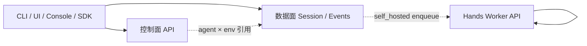

# Managed Agents API 清单（已实现 / 缺口）

> 面向后续 CLI / UI / Console / SDK 发布：把 Builder 的 HTTP 面按 **控制面（Control Plane）** 与 **数据面（Data Plane）** 整理，并对照 [Claude Managed Agents](https://platform.claude.com/docs/en/managed-agents/overview)（`/v1/*`，beta `managed-agents-2026-04-01`）。
>
> 路径前缀：Builder 为 `/api/*`（JWT）；Claude 为 `/v1/*`（API Key）。语义对齐优先于路径字面一致。
>
> 最后更新：2026-07-21

---

## 0. 分层约定

| 平面 | 职责 | 典型消费者 |
|---|---|---|
| **控制面** | 定义与治理资源：Agent 版本、Environment、Memory/Vault、Deployments、ACL、Skills/Tools 配置 | Console、CLI `create/list/update`、编排器 |
| **数据面（Session）** | 运行实例：创建 Session、投递/拉取事件、SSE、interrupt / HITL | Chat UI、IM 网关、自动化脚本 |
| **Hands / Worker（执行面 API）** | `self_hosted` 工作队列：poll / ack / heartbeat / stop / list / stats；Env key 鉴权 | 独立 Worker 进程（非终端用户） |

Claude 的 Brain/Hands 拆分对应：控制面 + Session 事件在 Brain；Hands 通过 Environment work 队列或 cloud sandbox 完成。

---

## 1. 已实现：控制面 API

### 1.1 Agents（版本化配置）

| Method | Path | 说明 | Claude 对照 |
|---|---|---|---|
| `GET` | `/api/agents` | 列出可见 Agent | `GET /v1/agents` |
| `GET` | `/api/agents/{id}` | 获取定义 | `GET /v1/agents/{id}` |
| `POST` | `/api/agents` | 创建 | `POST /v1/agents` |
| `PUT` | `/api/agents/{id}` | 更新（产生新版本） | `POST /v1/agents/{id}` |
| `POST` | `/api/agents/{id}/archive` | 归档 | `POST /v1/agents/{id}/archive` |
| `DELETE` | `/api/agents/{id}` | 删除 | （Claude 以 archive 为主） |
| `GET` | `/api/agents/{id}/versions` | 版本列表 | `GET /v1/agents/{id}/versions` |
| `GET` | `/api/agents/{id}/versions/{version}` | 单版本快照 | Claude 列表内含版本；无独立 get 时可用 list |

**Agent 附属配置（定义类已收进 Agent body；前端 Tools/Settings 已跟进 `system` / `tools` / `mcpServers`）**

| Method | Path | 说明 |
|---|---|---|
| `GET` | `/api/agents/{id}/tools/catalog/builtins` | 内置工具目录（只读发现） |
| `GET` | `/api/agents/{id}/tools/catalog/mcp-servers` | MCP 目录（只读发现） |
| ~~`GET/PUT …/tools/config`~~ | — | **已删除**；改 `GET/PUT /api/agents/{id}` body 的 `tools` / `mcpServers` |
| ~~`GET …/tools/active`~~ | — | **已删除**；由 Agent body / versions 表达 |
| `GET/PUT/DELETE…` | `/api/agents/{id}/skills/workspace*` | Skill 工作区 / install |
| `GET…` | `/api/agents/{id}/skills/repositories*` | 仓库技能浏览 |
| `GET…/PUT…/DELETE…` | `/api/agents/{id}/workspace/*` | Agent workspace 文件 / memory / subagents |
| `GET/POST/DELETE` | `/api/agents/{id}/shares` | Agent ACL 分享 |
| `GET/POST/PUT/DELETE` | `/api/agents/{id}/bindings` | 渠道绑定 |
| `POST` | `/api/agents/{id}/clone` | 克隆 |
| `GET` | `/api/agents/{id}/activity` | 活动审计 |
| `POST` | `/api/agents/draft` | AI 草稿生成 |

### 1.2 Environments（执行模板）

| Method | Path | 说明 | Claude 对照 |
|---|---|---|---|
| `GET` | `/api/environments` | 列表 | `GET /v1/environments` |
| `GET` | `/api/environments/{id}` | 详情 | `GET /v1/environments/{id}` |
| `POST` | `/api/environments` | 创建（local / sandbox / self_hosted / remote…） | `POST /v1/environments` |
| `POST` | `/api/environments/{id}/archive` | 归档 | `POST …/archive` |
| `DELETE` | `/api/environments/{id}` | 删除 | `DELETE …` |
| `GET/POST/DELETE` | `/api/environments/{id}/shares*` | 资源分享 | （Claude 用 org/account scope） |

### 1.3 Memory Stores

| Method | Path | 说明 | Claude 对照 |
|---|---|---|---|
| `GET` | `/api/memory-stores` | 列表 | `GET /v1/memory_stores` |
| `GET` | `/api/memory-stores/{id}` | 详情 | `GET …/{id}` |
| `POST` | `/api/memory-stores` | 创建 | `POST /v1/memory_stores` |
| `DELETE` | `/api/memory-stores/{id}` | 删除 | （Claude 另有 archive） |
| `GET` | `/api/memory-stores/{id}/memories` | 列出记忆 | `GET …/memories` |
| `GET` | `/api/memory-stores/{id}/memories/{*path}` | 读一条 | `GET …/memories/{id}` |
| `PUT` | `/api/memory-stores/{id}/memories/{*path}` | 写/更新 | `POST …/memories/{id}` |
| `DELETE` | `/api/memory-stores/{id}/memories/{*path}` | 删除 | `DELETE …` |
| `GET` | `/api/memory-stores/{id}/memories/versions/{*path}` | 版本历史（catch-all 必须在末尾） | `GET …/memory_versions?memory_id=` |
| `GET/POST/DELETE` | `/api/memory-stores/{id}/shares*` | 分享 | — |

Session 创建时可挂载：`memoryStoreIds`（见数据面）。

### 1.4 Vaults

| Method | Path | 说明 | Claude 对照 |
|---|---|---|---|
| `GET` | `/api/vaults` | 列表 | `GET /v1/vaults` |
| `GET` | `/api/vaults/{id}` | 详情 | `GET …/{id}` |
| `POST` | `/api/vaults` | 创建 | `POST /v1/vaults` |
| `DELETE` | `/api/vaults/{id}` | 删除 | `DELETE …` |
| `GET` | `/api/vaults/{id}/credentials` | 凭据列表 | `GET …/credentials` |
| `POST` | `/api/vaults/{id}/credentials` | 添加凭据 | `POST …/credentials` |
| `DELETE` | `/api/vaults/{id}/credentials/{credentialId}` | 删除凭据 | `DELETE …` |
| `GET/POST/DELETE` | `/api/vaults/{id}/shares*` | 分享 | — |

Session 创建时可挂载：`vaultIds`。

### 1.5 Deployments（定时 / 触发）

| Method | Path | 说明 | Claude 对照 |
|---|---|---|---|
| `GET` | `/api/deployments` | 列表 | `GET /v1/deployments` |
| `GET` | `/api/deployments/{id}` | 详情 | `GET …/{id}` |
| `POST` | `/api/deployments` | 创建（cron / webhook 等） | `POST /v1/deployments` |
| `PATCH` | `/api/deployments/{id}` | 更新 | `POST …/{id}` |
| `POST` | `/api/deployments/{id}/archive` | 归档 | `POST …/archive` |
| `DELETE` | `/api/deployments/{id}` | 删除 | — |
| `POST` | `/api/deployments/{id}/run` | 立即跑一次 | `POST …/run` |
| `POST` | `/api/deployments/webhook/{token}` | Webhook 触发 | Builder 扩展 |

### 1.6 平台周边（非 Claude MA 核心，但控制面常用）

| 区域 | 主要 Path |
|---|---|
| Auth | `POST /api/auth/login`，`GET /api/auth/me`，`/api/user/*`，`/api/admin/users/*` |
| Channels | `/api/channels*`，`POST /api/agents/{id}/channels/{channelId}/default` |
| Templates / Marketplaces | `/api/templates*`，`/api/marketplaces*` |
| Outbound | `POST /api/outbound/send` |
| Hands 观测 | `GET /api/hands/status` |

---

## 2. 已实现：数据面 API（Session × Events）

核心资源与 Claude 对齐：`Agent × Environment → Session`，交互靠 **events**。

| Method | Path | 说明 | Claude 对照 |
|---|---|---|---|
| `POST` | `/api/sessions` | 创建；body：`agent`（id / pin / `agent_with_overrides`）、`environmentId`、`memoryStoreIds`、`vaultIds`、`resources[]` | `POST /v1/sessions` |
| `GET` | `/api/sessions` | 列表（可选 `agentId`） | `GET /v1/sessions` |
| `GET` | `/api/sessions/{id}` | 详情 / 状态 | `GET /v1/sessions/{id}` |
| `POST` | `/api/sessions/{id}/archive` | 归档 | `POST …/archive` |
| `DELETE` | `/api/sessions/{id}` | 删除（含事件） | `DELETE …` |
| `POST` | `/api/sessions/{id}/events` | 投递入站事件 | `POST …/events` |
| `GET` | `/api/sessions/{id}/events` | 拉取历史（`after` 游标） | `GET …/events` |
| `GET` | `/api/sessions/{id}/events/stream` | SSE；可选 `event_deltas=` 流式预览（不落库） | `GET …/events/stream` |
| `GET` | `/api/sessions/{id}/hands-stats` | Hands 租约指标 | Builder 扩展 |

### 已支持的入站事件类型

| `type` | 行为 |
|---|---|
| `user.message` | 追加事件并触发 turn |
| `user.interrupt` | 中断当前 turn |
| `user.tool_confirmation` | HITL（`tool_use_id` / `toolUseId`） |
| `user.custom_tool_result` | **已落地**：注入结果并续跑（Worker 自定义工具 SPI 见 SELF_HOSTED_GAPS） |
| `user.tool_result` | **已落地**：self_hosted / 外化工具回传并续跑 |
| `user.define_outcome` | 骨架：落库 outcome |
| `system.message` | Session 级 system 覆盖，下轮生效 |

未知 `type` → **400** 统一错误体（`unknown_event_type`），禁止静默 append。

### 已产出的出站 / 系统事件（节选）

见 [events/README.md](events/README.md)。对外名：`agent.message` / `agent.thinking` / `agent.tool_use` / `agent.tool_result`、`span.model_request_*`、`session.status_*`（含 `terminated`）、`session.error`、`session.interrupted` 等。流式增量仅 SSE `event_start` / `event_delta`。

### Legacy 数据面（deprecated，勿作为对外 MA API）

| Method | Path | 说明 |
|---|---|---|
| `POST` | `/api/agents/{id}/chat/stream` | 旧 SSE 聊天 |
| `GET` | `/api/agents/{id}/chat/session` | 旧 session |
| `POST` | `/api/agents/{id}/chat/send` | 旧发送 |
| `*` | `/api/agents/{id}/sessions/*` | IM inbox / 渠道会话键，非 MA Session |

---

## 3. 已实现：Hands / Worker API（执行面）

供 `self_hosted` Environment 的 worker 使用（对齐 Claude `…/work/poll|ack|heartbeat|stop`）。详见 [events/worker.md](events/worker.md)。

| Method | Path | 说明 | Claude 对照 |
|---|---|---|---|
| `GET` | `/api/environments/{id}/work/poll` | 长轮询认领 | `GET …/work/poll` |
| `GET` | `/api/environments/{id}/work` | 列表 | `GET …/work` |
| `GET` | `/api/environments/{id}/work/{workId}` | 单条 | `GET …/work/{id}` |
| `GET` | `/api/environments/{id}/work/stats` | 队列统计 | `GET …/work/stats` |
| `POST` | `/api/environments/{id}/work/{workId}/ack` | 确认 / sandbox 就绪 | `POST …/ack` |
| `POST` | `/api/environments/{id}/work/{workId}/heartbeat` | 保活 | `POST …/heartbeat` |
| `POST` | `/api/environments/{id}/work/{workId}/stop` | 停止 | `POST …/stop` |
| `POST` | `/api/environments/{id}/keys/rotate` | 轮换 environment key | — |

Worker 认证：`X-Builder-Environment-Key`（create / rotate 时明文出现一次）。默认进程内 worker（`builder.hands.in-process-worker`）无需外部调用。

---

## 4. 缺口：相对 Claude MA 仍缺 / 明显偏弱的 API

下列按「对外发布 MA 产品面」优先级排列。实现细节的生产债见 [FOLLOW_UP_PRODUCTION.md](FOLLOW_UP_PRODUCTION.md)。数据面契约落地见 [DATA_PLANE_CONTRACT.md](DATA_PLANE_CONTRACT.md)。

### 4.1 控制面缺口

| 缺口 | Claude | 现状 | 建议 |
|---|---|---|---|
| **Environment 更新** | `POST /v1/environments/{id}` | 无 PATCH/POST update | 补更新 API（packages / networking / 元数据） |
| **Vault 更新 / 归档** | `POST …/vaults/{id}`，`…/archive` | 仅 CRUD 子集 | 补 update + archive |
| **Credential 读/改/归档/校验** | get / update / archive / `mcp_oauth_validate` | 仅 list + create + delete | OAuth 闭环必备 |
| **Memory Store 归档** | `POST …/archive` | 仅 delete | 与 Claude 生命周期对齐 |
| **Memory 版本 get / redact** | `GET …/memory_versions/{id}`，`POST …/redact` | 仅 path 下 list versions | 审计与合规 |
| **一等 Skills 资源** | `/v1/skills` + versions CRUD | 挂在 agent workspace / marketplace | 若要对齐 Claude「可引用 skill_id」需一等资源 |
| **一等 Files 资源** | `/v1/files` upload/list/get/download/delete | Session `resources[]` 占位；workspace upload 是 agent 侧 | **发布级缺口**：独立 Files API + session mount |
| **Deployments pause/unpause** | `POST …/pause`，`…/unpause` | 无；可用 archive/patch 凑 | 补语义清晰的 pause |
| **Agent 更新动词** | Claude 用 `POST` | Builder 用 `PUT` | 文档/SDK 约定即可；可选兼容别名 |
| **分页 / cursor** | `after_id` / `before_id` / `limit` | 多数 list 全量 | 控制面 list 补分页 |

### 4.2 数据面缺口

| 缺口 | Claude | 现状 | 建议 |
|---|---|---|---|
| **Session 更新** | `POST /v1/sessions/{id}`（idle 时改 tools/mcp） | 无 | 中途改权限 / MCP 必备 |
| **Session Resources CRUD** | `/sessions/{id}/resources*` | 仅 create 时 `resources[]` | 运行中挂载 git/file |
| **Multiagent Threads API** | `/sessions/{id}/threads*` + thread events/stream | 协调器内部 fan-out，无对外 thread 资源 | 要对齐 Claude multiagent 需补 |
| **自定义工具续跑** | `user.custom_tool_result` 驱动 resume | Brain 已接线；Worker SPI 未做 | 见 SELF_HOSTED_GAPS |
| **MCP 工具分型** | `agent.mcp_tool_*` | 仍可能混在 `agent.tool_use` | SessionEventMapper 分型 |
| **Session 分享 ACL** | org 级隐式 | 多为 owner-only | 文档或补 share API |

### 4.3 Hands / Worker 缺口

Worker 管理面（poll / ack / heartbeat / stop / list / get / stats）与 **environment key** 鉴权已落地，见 [events/worker.md](events/worker.md) 与产品指南 [guide/08-hands-worker.md](guide/08-hands-worker.md)。

剩余多为生产增强（Worker SPI、E2B packages/networking、多副本 interrupt 等），见 [FOLLOW_UP_PRODUCTION.md](FOLLOW_UP_PRODUCTION.md)、[SELF_HOSTED_GAPS.md](SELF_HOSTED_GAPS.md)、[SANDBOX_GAPS.md](SANDBOX_GAPS.md)。跨机 Hands（事件驱动）与 `user.tool_result` 续跑已落地，勿再当作「缺 claim/ready / 共享盘」缺口。

### 4.4 契约与发布层缺口（非单个 REST，但是「完善 API」的一部分）

| 项 | 说明 |
|---|---|
| **稳定 OpenAPI / 版本头** | Claude 有 beta header；Builder 无对外 API 版本策略 |
| **公共 SDK / CLI 骨架** | 控制面 + 数据面最小命令：`agents|environments|sessions events` |
| **事件 schema 文档** | 类型清单见 [events/README.md](events/README.md)；逐 type JSON Schema 仍可加强 |
| **Idempotency / 限流** | Claude 有 org RPM；Builder 未作为产品面承诺 |

> 统一错误模型与出站事件命名（`agent.thinking` / `span.*` / `session.error`）已按 [DATA_PLANE_CONTRACT.md](DATA_PLANE_CONTRACT.md) 落地。

---

## 5. 最小对外发布面（建议）

若只暴露「可支撑 CLI + Console」的稳定子集，建议先承诺：

**控制面**

- Agents：CRUD + archive + versions  
- Environments：CRUD + archive（+ 尽快补 update）  
- Memory Stores / Vaults：CRUD + memories/credentials（+ vault validate）  
- Deployments：CRUD + archive + run  

**数据面**

- Sessions：create / get / list / archive / delete  
- Events：send / list / stream  
- 入站：`user.message` | `user.interrupt` | `user.tool_confirmation`  

**Worker（可选文档分区）**

- poll / ack / heartbeat / stop / list / get / stats + environment key  

其余（Files、Threads、Session update、Skills 一等资源）标为 **vNext**。  
产品指南：[guide/README.md](guide/README.md)。事件 / Worker / 错误见 [DATA_PLANE_CONTRACT.md](DATA_PLANE_CONTRACT.md)；Agent body 收拢见 [API_REFACTOR.md](API_REFACTOR.md)；生产债见 [FOLLOW_UP_PRODUCTION.md](FOLLOW_UP_PRODUCTION.md)。

---

## 6. 参考

- 产品指南（Overview / Quickstart / 模块）：[guide/README.md](guide/README.md)  
- Claude overview: https://platform.claude.com/docs/en/managed-agents/overview  
- Claude sessions: https://platform.claude.com/docs/en/managed-agents/sessions  
- Claude session operations: https://platform.claude.com/docs/en/managed-agents/session-operations  
- Claude reference (events): https://platform.claude.com/docs/en/managed-agents/reference  
- API 资源页：`/docs/en/api/beta/{agents,environments,sessions,vaults,deployments,files,skills}`  
- API 改造（Agent body）：[API_REFACTOR.md](API_REFACTOR.md)  
- 数据面契约（事件 / Worker / 错误）：[DATA_PLANE_CONTRACT.md](DATA_PLANE_CONTRACT.md)  
- 事件类型：[events/README.md](events/README.md)  
- 生产后续：[FOLLOW_UP_PRODUCTION.md](FOLLOW_UP_PRODUCTION.md)
