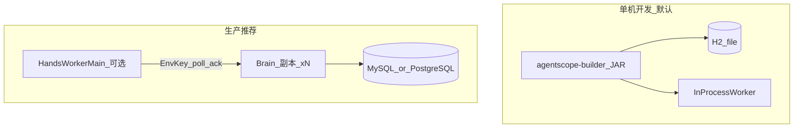

# 部署运维 · 把 Managed Agents 跑起来

[← Limitations](12-limitations.md) · [回目录](README.md) · [下一页：产品验证 →](14-validation.md)

---

本章讲 **如何把 Builder（含 Managed Agents 控制面 / 数据面 / Hands）部署并运维起来**。  
不要与 [Deployments](10-deployments.md)（产品资源：cron / webhook 触发会话）混淆。

更细的配置表见仓库 [README_zh.md](../../README_zh.md) / [README.md](../../README.md)；多副本生产债见 [FOLLOW_UP_PRODUCTION.md](../FOLLOW_UP_PRODUCTION.md)。部署完成后用 [产品验证清单](14-validation.md) 做实操验收。

## 部署形态速览



| 形态 | 数据库 | Hands | 适用 |
|---|---|---|---|
| 本地试跑 | 嵌入式 H2 文件库 | 进程内 Worker（默认开） | 开发 / Demo / local Environment |
| 单机生产 | MySQL / PostgreSQL | `sandbox`=E2B；或 `self_hosted`+独立 Worker | 小流量上线 |
| 多副本 Brain | **同一** JDBC DataSource | 同上；Worker **仅出站**连任一 Brain（无需共享盘） | 水平扩展控制面 |

## 1. 本地最快路径

```bash
export DASHSCOPE_API_KEY=sk-xxx

mvn -pl agentscope-examples/agents/agentscope-builder -am clean package -DskipTests
java -jar agentscope-examples/agents/agentscope-builder/target/agentscope-builder-*.jar
```

- 默认端口：`http://localhost:8080`（静态前端 + `/api/**`）
- 默认账号：`admin` / `admin`（另有 demo：`bob`/`bob`、`alice`/`alice`）
- 目录库：`${user.home}/.agentscope-builder/db.*`（**不在** `builder.workspace` 下，避免把 catalog 打进 workspace 卷）
- 创建 Agent / Session 的产品步骤见 [Quickstart](03-quickstart.md)

健康检查（若启用 actuator）：`/actuator/health`、`/actuator/info` 在 Security 中放行。

## 2. 生产必改清单

上线前至少设置：

| 项 | 环境变量 / 配置 | 说明 |
|---|---|---|
| JWT 签名 | `BUILDER_JWT_SECRET`（≥32 字符） | 勿用开发默认值 |
| Vault 主密钥 | `BUILDER_VAULT_MASTER_KEY` | 凭证 AES-GCM；未设会用开发默认并打 WARN |
| 模型密钥 | `DASHSCOPE_API_KEY` 或自备 `Model` Bean | 无模型无法跑 turn |
| 外部库 | `SPRING_PROFILES_ACTIVE=jdbc` + `BUILDER_DB_*` | 见下一节 |
| 改密 | 登录后立刻改 `admin` 密码 | 种子账号仅用于冷启动 |

可选但推荐：

| 项 | 变量 | 说明 |
|---|---|---|
| 实例 ID | `BUILDER_INSTANCE_ID` | 多副本区分 turn 租约持有者；不设则自动生成 |
| Turn 租约 TTL | `BUILDER_TURN_LEASE_TTL_SECONDS`（默认 90） | 过期后其他副本可收口 |
| HITL 超时 | `BUILDER_TOOL_CONFIRMATION_TIMEOUT_MS` | 确认票过期 |
| 工作目录 | `BUILDER_WORKSPACE` | Agent 工作区根；与 H2/catalog 路径分离 |
| 关闭进程内 Hands | `BUILDER_HANDS_IN_PROCESS_WORKER=false` | 配合独立 `HandsWorkerMain` |

属性前缀统一为 `builder.*` / `BUILDER_*`（旧 `claw.*` 仅兼容迁移）。

## 3. 数据库：H2 → MySQL / PostgreSQL

默认 H2 适合单机。生产激活 `jdbc` profile：

```bash
export SPRING_PROFILES_ACTIVE=jdbc
export BUILDER_DB_URL='jdbc:mysql://db:3306/agentscope_builder?useUnicode=true&characterEncoding=utf8&useSSL=false&serverTimezone=UTC'
export BUILDER_DB_USER=agentscope
export BUILDER_DB_PASSWORD='***'
# PostgreSQL 示例：改 URL + BUILDER_DB_DRIVER=org.postgresql.Driver
```

或：

```bash
java -jar agentscope-builder-*.jar --spring.profiles.active=jdbc
```

要点：

- MySQL / PostgreSQL 驱动已在 classpath；Hibernate 按 URL 选方言。
- `jdbc` profile 会把 SQL init 设为不跑 H2 种子脚本；自行准备账号或首次用 admin 种子策略以实际配置为准。
- `BUILDER_JPA_DDL_AUTO` 默认 `update`；严肃生产建议改 `validate` 并自管 Flyway/Liquibase。
- **多副本必须指向同一 DataSource**：共享 Agent 目录、Session 事件、`builder_agent_state`、以及 `builder_coord_*`（turn 租约 / HITL / work 队列 / cron fire）。

也可不激活 profile，直接覆盖 `BUILDER_DB_URL` 等（见 `application.yml` 注释）。

## 4. 单机生产最小启动示例

```bash
export DASHSCOPE_API_KEY=sk-xxx
export BUILDER_JWT_SECRET='replace-with-long-random-secret-32+'
export BUILDER_VAULT_MASTER_KEY='replace-with-vault-master-key-32+'
export SPRING_PROFILES_ACTIVE=jdbc
export BUILDER_DB_URL='jdbc:mysql://127.0.0.1:3306/agentscope_builder?...'
export BUILDER_DB_USER=agentscope
export BUILDER_DB_PASSWORD='***'
export BUILDER_WORKSPACE=/var/lib/agentscope/builder

java -jar agentscope-builder-*.jar
```

前端与 API 同端口；反向代理时把 `/` 与 `/api` 转到该端口，并保留 WebSocket/SSE 缓冲设置（SSE：`/api/sessions/{id}/events/stream`）。

## 5. Hands：进程内 vs 独立 Worker

仅 **`type=self_hosted`** 需要 Worker。`sandbox`（E2B）与 `local` **不走** work 队列。

### 进程内（默认，开发）

`builder.hands.in-process-worker=true`（默认）。同 JVM `InProcessEnvironmentWorker` 自动 poll / 执行外化工具 / 回传结果。  
**这是开发便利，不是生产 self_hosted。** 验收生产路径请关进程内并起独立 Worker（见 [14-validation.md](14-validation.md) 路径 C）。

### 独立 Worker（生产 self_hosted）

```bash
# Brain
export BUILDER_HANDS_IN_PROCESS_WORKER=false
java -jar agentscope-builder-*.jar

# Worker（另进程；仅出站 HTTPS；无入站端口、无共享盘要求）
java -cp agentscope-builder-*.jar io.agentscope.builder.worker.HandsWorkerMain \
  --base-url http://brain:8080 \
  --environment-id env_xxx \
  --environment-key ebk_xxx \
  --hands-root /var/lib/agentscope/hands \
  --worker-id worker-1
```

运维注意：

- Design 1：**不在 Brain 创建 WorkspaceSandbox**；Worker 本地执行后 `POST …/tool-results` 续跑。
- Environment key 只在 create / rotate 时明文出现一次，按密钥保管。
- 协议见 [Hands / Worker](08-hands-worker.md)；验收见 [产品验证清单](14-validation.md)。

## 5.1 E2B sandbox（`type=sandbox`）

```bash
export BUILDER_E2B_API_KEY=ek_xxx
# 可选：BUILDER_E2B_TEMPLATE_ID、BUILDER_E2B_SANDBOX_TIMEOUT_SECONDS …
```

创建 Environment `type=sandbox` 后 Session 的 shell/FS 在 E2B 云端执行。**不需要** Docker daemon，也**不要**再配已废弃的 `builder.sandbox.*`。详见 [05-environments.md](05-environments.md)、[SANDBOX_GAPS.md](../SANDBOX_GAPS.md)。

## 6. Environment 选型（运维视角）

创建 Session 时选的 Environment `type` 决定执行面成本与隔离：

| type | 运维含义 |
|---|---|
| `local` | 宿主机 FS；开发默认 |
| `sandbox` | **E2B 云沙箱**；需 `BUILDER_E2B_API_KEY`（或 env `config.apiKey`）；多副本共享 AgentStateStore 以便 resume |
| `remote` | 依赖分布式 `BaseStore`；无 shell |
| `self_hosted` | 依赖 Worker 队列；生产常关进程内 Worker |

Managed Environment `type=sandbox` **不**使用本机 Docker，也不读已废弃的 `builder.sandbox.*` Docker 键。

全局 `builder.workspace-store` 控制 Composite 工作区后端，与单个 Environment 资源的 `type` 层级不同——部署时按租户隔离需求分别配置。详见 README 与 [05-environments.md](05-environments.md)。

## 7. 多副本 Brain

1. N 个 JAR/容器，**相同** `BUILDER_JWT_SECRET`、`BUILDER_VAULT_MASTER_KEY`、`BUILDER_DB_*`。
2. 建议设置不同的 `BUILDER_INSTANCE_ID`。
3. 负载均衡：HTTP API 可无会话粘滞；**`event_deltas` SSE 仅 turn-owner best-effort**，权威以落库事件为准。
4. 跨副本 `user.interrupt` 可能 409——尚未保证瞬时 cancel 远端 Flux（见 Limitations / FOLLOW_UP）。
5. 可选：用自研 Redis 实现覆盖 `CoordinationStore` / `AgentStateStore` bean（默认 JDBC 已够同库多副本）。

## 8. 日常运维检查项

| 检查 | 做法 |
|---|---|
| 服务存活 | 打 `/actuator/health` 或登录 `POST /api/auth/login` |
| Hands 队列 | `GET /api/environments/{id}/work/stats`（JWT）；`GET /api/hands/status` |
| Session Hands 指标 | `GET /api/sessions/{id}/hands-stats` |
| 卡住的 turn | 查 `builder_coord_*` 租约是否过期；看 `session.status_*` / `session.error` |
| 轮换 Env key | `POST /api/environments/{id}/keys/rotate`，同步更新 Worker |
| 备份 | 备份 JDBC 库 + 需要的 workspace / hands 目录 |

## 9. 配置项速查（运维常用）

| 变量 | 默认倾向 | 用途 |
|---|---|---|
| `DASHSCOPE_API_KEY` | 空 | 模型 |
| `BUILDER_MODEL_NAME` | `qwen-max` | 默认模型名 |
| `BUILDER_JWT_SECRET` | 开发占位 | JWT |
| `BUILDER_VAULT_MASTER_KEY` | 空 | Vault |
| `BUILDER_WORKSPACE` | JVM cwd | 工作区 |
| `SPRING_PROFILES_ACTIVE=jdbc` | 关 | 外置库 |
| `BUILDER_DB_URL` / `USER` / `PASSWORD` / `DRIVER` | H2 文件 | JDBC |
| `BUILDER_JPA_DDL_AUTO` | `update` | 生产改 `validate` |
| `BUILDER_INSTANCE_ID` | 自动 | 副本标识 |
| `BUILDER_HANDS_IN_PROCESS_WORKER` | `true` | 进程内 Hands（self_hosted 开发） |
| `BUILDER_E2B_API_KEY` | 空 | Managed `type=sandbox` 的 E2B key |
| `BUILDER_E2B_TEMPLATE_ID` | `base` | 默认 E2B 模板 |
| `BUILDER_TURN_LEASE_TTL_SECONDS` | `90` | turn 租约 |
| `BUILDER_E2B_*` | 见 README | E2B managed sandbox |

完整表以 README「环境变量参考」为准。

## 10. 推荐阅读顺序

1. 本章（部署形态与必改项）  
2. [Quickstart](03-quickstart.md) 验证产品链路  
3. [Environments](05-environments.md) + [Hands / Worker](08-hands-worker.md)  
4. [FOLLOW_UP_PRODUCTION.md](../FOLLOW_UP_PRODUCTION.md) 多副本 / 跨机 Hands  
5. [Limitations](12-limitations.md) 能力边界
