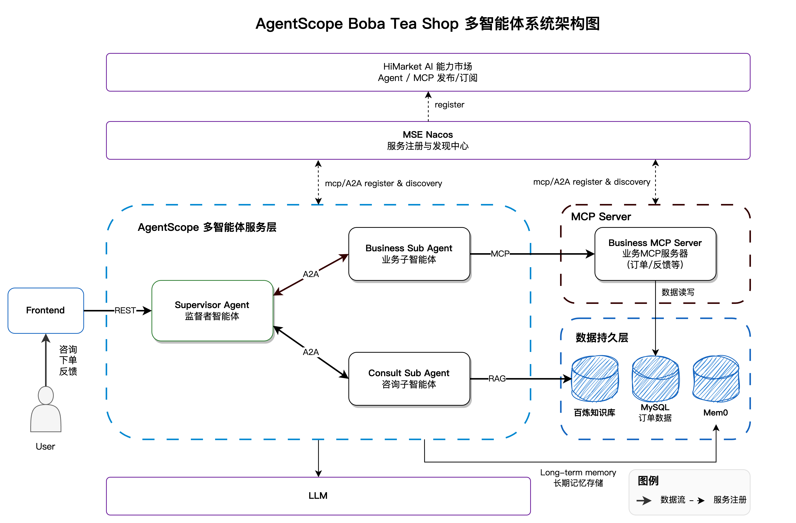

# 🧋 AgentScope Boba Tea Shop

<p align="center">
  <strong>A Multi-Agent Boba Tea Shop Demo System Built with AgentScope Java Framework</strong>
</p>

<p align="center">
  <a href="#introduction">Introduction</a> •
  <a href="#features">Features</a> •
  <a href="#system-architecture">System Architecture</a> •
  <a href="#tech-stack">Tech Stack</a> •
  <a href="#core-components">Core Components</a> •
  <a href="#quick-start">Quick Start</a> •
  <a href="#protocols">Protocols</a>
</p>

---

## 📖 Introduction

Boba Tea Shop is a multi-agent system example built with the **AgentScope Java** framework, simulating a complete business scenario of an intelligent boba tea shop. This system demonstrates how to use the AgentScope framework to implement collaboration between multiple agents, including task distribution, business processing, knowledge retrieval, and other core capabilities.

Through this example, you can learn:

- 🤖 **Multi-Agent Collaboration Patterns**: How Supervisor Agent coordinates multiple sub-agents to complete complex tasks
- 🔗 **A2A Protocol**: Implementation and application of Agent-to-Agent communication protocol
- 🛠️ **MCP Protocol**: Practical use of Model Context Protocol for tool invocation
- 📚 **RAG Knowledge Retrieval**: Intelligent Q&A based on Bailian knowledge base
- 💾 **Session Management**: Session state management with MySQL persistence support
- 🧠 **Intelligent Memory**: Auto-compressed short-term memory and Mem0-based long-term memory
- ☁️ **Cloud-Native Deployment**: Support for Docker, Kubernetes, and other deployment methods

---

## ✨ Features

### Business Features

| Feature | Description |
|---------|-------------|
| 🛒 **Smart Ordering** | Natural language ordering with automatic recognition of products, sweetness, ice level, and other preferences |
| 📋 **Order Inquiry** | Query order history, order details, multi-dimensional filtering |
| 💬 **Product Consultation** | RAG knowledge base-powered product information and store inquiries |
| 📝 **User Feedback** | Receive and process user complaints, suggestions, and reviews |
| 📊 **Business Reports** | Auto-generated store business analysis reports (optional) |
| ⏰ **Scheduled Tasks** | Support for XXL-JOB scheduled Agent task triggering (optional) |

### Technical Features

| Feature | Description |
|---------|-------------|
| 🔄 **Streaming Response** | SSE streaming output with real-time display of Agent thinking process |
| 💾 **Session Persistence** | MySQL-based session state storage and recovery |
| 🔍 **Service Discovery** | Nacos-based service registration and discovery |
| 📡 **Protocol Support** | Support for both A2A and MCP agent communication protocols |

---

## 🏗️ System Architecture



---

## 🛠️ Tech Stack

### Backend Stack

| Technology | Description |
|------------|-------------|
| **AgentScope Java** | Multi-agent framework core |
| **Spring Boot** | Application framework |
| **MCP Spring Webflux** | MCP Server building |
| **MySQL** | Relational database |
| **Nacos** | Service registry and configuration center |

### Frontend Stack

| Technology | Description |
|------------|-------------|
| **Vue 3** | Frontend framework |
| **TypeScript** | Type safety |
| **Vue Router** | Route management |
| **Pinia** | State management |

### AI Services

| Service | Description |
|---------|-------------|
| **DashScope** | Alibaba Cloud LLM service (qwen-max, etc.) |
| **Bailian RAG** | Alibaba Cloud Bailian knowledge base retrieval service |
| **Mem0** | User memory management service |
| **OpenAI** | Optional, supports OpenAI-compatible interface |

### AgentScope Extensions

| Extension | Description |
|-----------|-------------|
| `agentscope-core` | Core framework, includes ReActAgent, etc. |
| `agentscope-extensions-nacos-a2a` | A2A protocol Nacos service discovery |
| `agentscope-extensions-mcp-nacos` | MCP protocol Nacos service discovery |
| `agentscope-extensions-mem0` | Mem0 memory service integration |
| `agentscope-extensions-session-mysql` | MySQL session persistence |
| `agentscope-extensions-scheduler-xxl-job` | XXL-JOB scheduled tasks (optional) |

---

## 📦 Core Components

### 1. Supervisor Agent

**Responsibility**: As the system's entry point and coordinator, responsible for receiving user requests and distributing them to appropriate sub-agents for processing.

**Core Implementation**:

```java
// Supervisor agent implemented based on ReActAgent
ReActAgent agent = ReActAgent.builder()
    .name("supervisor_agent")
    .sysPrompt(sysPrompt)
    .toolkit(toolkit)      // Contains A2A invocation tools
    .model(model)          // LLM model
    .build();
```

**Key Features**:
- Invokes sub-agents through `A2aAgentTools`
- Supports MySQL session persistence

### 2. Business Sub Agent

**Responsibility**: Handles business operations such as order creation, inquiry, modification, as well as user complaints and feedback.

**Core Implementation**:
- Registers to Nacos as an A2A Server
- Invokes Business MCP Server through MCP protocol

### 3. Consult Sub Agent

**Responsibility**: Handles consultation requests such as product inquiries and store information queries.

**Core Implementation**:
- Integrates Bailian RAG knowledge base retrieval
- Provides product information query and search tools

### 4. Business MCP Server

**Responsibility**: Provides MCP tool interfaces for business capabilities such as orders, inventory, and feedback.

**Available MCP Tools**:

| Tool Name | Function |
|-----------|----------|
| `order-create-order-with-user` | Create order |
| `order-get-order` | Query order |
| `order-get-orders-by-user` | Query user order list |
| `order-query-orders` | Multi-dimensional order query |
| `order-check-stock` | Check inventory |
| `order-delete-order` | Delete order |
| `feedback-*` | Feedback-related operations |

### 5. Frontend

**Responsibility**: Provides user interaction interface, supports conversation with Agent.

**Core Pages**:
- **Chat**: Conversation interface with streaming output and Markdown rendering support
- **Settings**: Configure backend address and user ID
- **Reports**: View business reports (optional feature)

---

## 🔌 Protocols

### A2A (Agent-to-Agent) Protocol

The A2A protocol is used for communication between agents. The Supervisor Agent invokes sub-agents through the A2A protocol.

**Service Discovery**: Implemented based on Nacos. Sub-agents automatically register at startup, and the Supervisor Agent discovers and invokes them by service name.

### MCP (Model Context Protocol)

The MCP protocol is used for agents to invoke external tool services. The Business Sub Agent invokes the Business MCP Server through MCP.

**MCP Server Registration**:

```yaml
agentscope:
  mcp:
    nacos:
      server-addr: ${NACOS_SERVER_ADDR:127.0.0.1:8848}
      namespace: ${NACOS_NAMESPACE:public}
```

---

## 🚀 Quick Start

### Configuration Variables

The following tables summarize the configuration variables used in local deployment, Docker deployment, and Kubernetes deployment.

#### Model Configuration (Required)

| Description | Local/Docker Environment Variable | K8S values.yaml Parameter | Default Value |
|-------------|-----------------------------------|---------------------------|---------------|
| Model Provider | `MODEL_PROVIDER` | `agentscope.model.provider` | `dashscope` |
| Model API Key | `MODEL_API_KEY` | `agentscope.model.apiKey` | - |
| Model Name | `MODEL_NAME` | `agentscope.model.modelName` | `qwen-max` |
| OpenAI Base URL | `MODEL_BASE_URL` | `agentscope.model.baseUrl` | - |

#### Bailian Knowledge Base Configuration (Required)

| Description | Local/Docker Environment Variable | K8S values.yaml Parameter | Default Value |
|-------------|-----------------------------------|---------------------------|---------------|
| Alibaba Cloud Access Key ID | `DASHSCOPE_ACCESS_KEY_ID` | `dashscope.accessKeyId` | - |
| Alibaba Cloud Access Key Secret | `DASHSCOPE_ACCESS_KEY_SECRET` | `dashscope.accessKeySecret` | - |
| Bailian Workspace ID | `DASHSCOPE_WORKSPACE_ID` | `dashscope.workspaceId` | - |
| Knowledge Base Index ID | `DASHSCOPE_INDEX_ID` | `dashscope.indexId` | - |

> 💡 **Tip**: The RAG knowledge base index can be built using files in the `consult-sub-agent/src/main/resources/knowledge` directory.

#### Mem0 Memory Service Configuration (Required)

| Description | Local/Docker Environment Variable | K8S values.yaml Parameter | Default Value |
|-------------|-----------------------------------|---------------------------|---------------|
| Mem0 API Key | `MEM0_API_KEY` | `mem0.apiKey` | - |

#### MySQL Database Configuration (Required)

| Description | Local/Docker Environment Variable | K8S values.yaml Parameter | Default Value |
|-------------|-----------------------------------|---------------------------|---------------|
| Deploy Built-in MySQL | - | `mysql.deployEnabled` | `true` |
| Host Address | `DB_HOST` | `mysql.host` | `localhost` / `mysql` |
| Port | `DB_PORT` / `MYSQL_PORT` | - | `3306` |
| Database Name | `DB_NAME` | `mysql.dbname` | `multi_agent_demo` |
| Username | `DB_USERNAME` | `mysql.username` | `multi_agent_demo` |
| Password | `DB_PASSWORD` | `mysql.password` | `multi_agent_demo@321` |

#### Nacos Service Configuration (Required)

| Description | Local/Docker Environment Variable | K8S values.yaml Parameter | Default Value |
|-------------|-----------------------------------|---------------------------|---------------|
| Deploy Built-in Nacos | - | `nacos.deployEnabled` | `true` |
| Server Address | `NACOS_SERVER_ADDR` | `nacos.serverAddr` | `localhost:8848` / `nacos-server:8848` |
| Namespace | `NACOS_NAMESPACE` | `nacos.namespace` | `public` |
| Enable Service Registration | `NACOS_REGISTER_ENABLED` | `nacos.registerEnabled` | `true` |

#### Image Configuration (Docker/K8S)

| Description | Docker Environment Variable | K8S values.yaml Parameter | Default Value |
|-------------|----------------------------|---------------------------|---------------|
| Image Registry | `IMAGE_REGISTRY` | `image.registry` | `registry.cn-hangzhou.aliyuncs.com/agentscope` |
| Image Tag | `IMAGE_TAG` | `image.tag` | `1.0.1` |
| Image Pull Policy | - | `image.pullPolicy` | `Always` |

### One-Click Deployment

#### Option 1: Local Deployment (Recommended)

Suitable for development and debugging. Requires local installation of JDK 17+, Node.js 18+, Maven 3.6+.

```bash
# 1. Configure environment variables
cp local-env.example local-env.sh
vim local-env.sh  # Fill in environment variables

# 2. Load environment variables and start
source local-env.sh
./local-deploy.sh start
```

#### Option 2: Kubernetes Deployment (Recommended)

Suitable for production environments. Supports Helm one-click deployment.

```bash
# 1. Modify values.yaml file
# 2. Create namespace
kubectl create namespace agentscope

# 3. Deploy
helm install agentscope helm/ \
  --namespace agentscope \
  --values helm/values.yaml
```

#### Option 3: Docker Deployment

Suitable for quick experience. Only requires Docker and Docker Compose installation.

```bash
# 1. Configure environment variables
cp docker-env.example .env
vim .env  # Fill in API Keys

# 2. Start all services
docker-compose up -d
``` 

#### HiMarket
For HiMarket introduction and build/deployment guide, see [HIMARKET_DEPLOYMENT.md](HIMARKET_DEPLOYMENT.md)

### Feature Verification

1. Access the frontend page
2. Click the **Settings** icon in the upper right corner
3. Configure the backend access address and user ID, then save
4. Chat with the Agent

### Image Building

To build images yourself:

👉 **Detailed Guide**: [IMAGE_BUILD_GUIDE.md](IMAGE_BUILD_GUIDE.md)

```bash
# Build all modules
./build.sh -m all -v 1.0.0 -p linux/amd64 -r your-registry --push
```

## 📂 Project Structure

```
boba-tea-shop/
├── supervisor-agent/          # Supervisor Agent
│   ├── src/main/java/         # Java source code
│   │   └── agent/             # Agent implementation
│   │   └── config/            # Configuration classes
│   │   └── controller/        # REST controllers
│   │   └── tools/             # A2A tools
│   └── src/main/resources/    # Configuration files
│
├── business-sub-agent/        # Business Sub Agent
│   └── src/main/java/
│       └── config/            # A2A Server configuration
│
├── consult-sub-agent/         # Consult Sub Agent
│   ├── src/main/java/
│   │   └── service/           # Knowledge base retrieval service
│   │   └── tools/             # Consultation tools
│   └── src/main/resources/
│       └── knowledge/         # Knowledge base documents
│
├── business-mcp-server/       # Business MCP Server
│   └── src/main/java/
│       └── OrderMcpTools.java # Order MCP tools
│       └── FeedbackMcpTools.java
│
├── frontend/                  # Vue Frontend
│   └── src/
│       └── components/        # Components
│       └── views/             # Pages
│       └── stores/            # State management
│
├── helm/                      # Kubernetes Helm Charts
├── mysql-image/               # MySQL Docker image
├── nacos-image/               # Nacos Docker image
│
├── docker-compose.yml         # Docker Compose configuration
├── build.sh                   # Build script
├── local-deploy.sh            # Local deployment script
└── pom.xml                    # Maven parent POM
```

---

## 📄 License

This project is licensed under the Apache License 2.0.

---

<p align="center">
  <sub>Built with ❤️ by AgentScope Team</sub>
</p>
