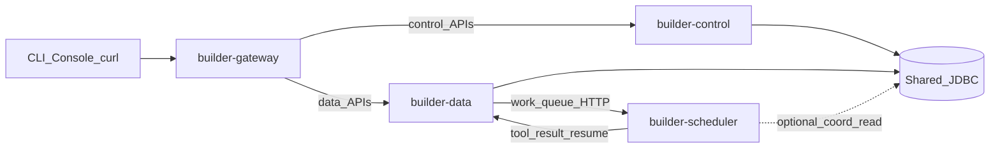
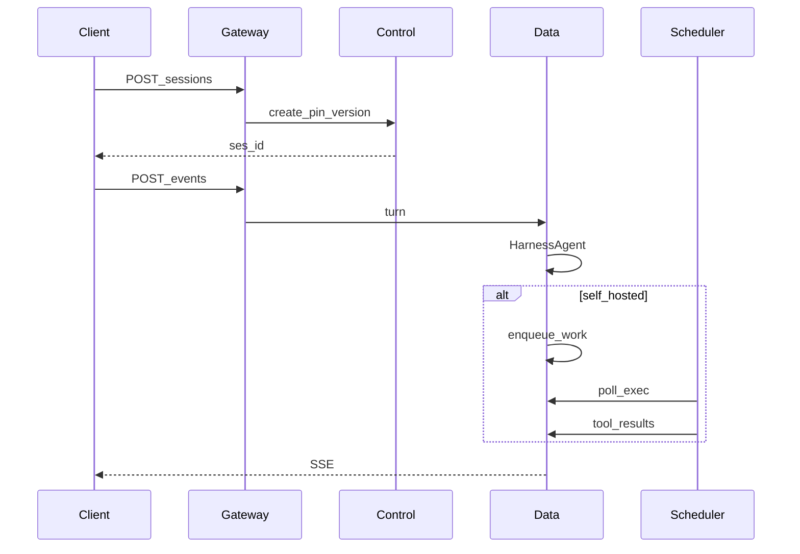

# AgentScope Builder 四层拆分改造计划（终态优先）

## 原则

- **未发布项目**：不保留老单体 `agentscope-builder` 兼容入口，不做 `builder-all` / 双写 / deprecated 别名。
- **终态即默认**：本地与 CI 一律按 **Gateway + Control + Data + Scheduler** 四进程（或等价 compose）验证。
- **可删则删**：遗留 `/api/agents/{id}/chat/**`、`HarnessGateway` 会话引擎、`InProcessEnvironmentWorker` 生产路径直接移除，不迁入新模块「过渡」。

## 终态拓扑

**边界锁定：**

| 层 | 拥有 | 禁止 |
|---|---|---|
| **Gateway** | Spring Cloud Gateway 路径转发、统一入口 | 业务逻辑、DB |
| **Control** | Agent/Env/Memory/Vault/Deployment/ACL；Session **创建/归档/列表**；SPA | `HarnessAgent`、turn、work 队列、SSE |
| **Data** | `user.message` / events / SSE / interrupt / HITL；`HarnessAgent`；work 队列 **服务端**；turn 租约 | Agent 定义 CRUD；静态资源 |
| **Scheduler** | Hands Worker 执行；未来 Channel inbound、分布式调度消费 | 推理循环；Agent/Env CRUD |

Phase 1 仍用 **共享 JDBC**（Session 行 pin 版本、事件、协调表）。跨面 **禁止** Maven 互依赖：只依赖 `builder-common`。后续若要弱化共享库，另开演进，不阻塞本次拆分。

## 模块清单（终态）

将现目录改造成多模块父工程（替换单体 jar 为父 POM）：

| Module | 产物 |
|---|---|
| `builder-common` | 契约 jar：Entity/Repository、错误体、事件常量、DTO、JWT/EnvKey 过滤器、CoordinationStore |
| `builder-gateway` | Boot：SCG → `CONTROL_URL` / `DATA_URL` |
| `builder-control` | Boot：控制面 API + SPA |
| `builder-data` | Boot：数据面 API + Harness |
| `builder-scheduler` | Boot/可执行：HandsWorker + Channel adapters |

删除目标：现有单体 [`BuilderApp`](agentscope-examples/agents/agentscope-builder/src/main/java/io/agentscope/builder/BuilderApp.java) 作为唯一入口的定位；脚本与文档改为 compose 启四服务。

本地开发：`docker-compose`（或 `scripts/dev-up.sh`）起 GW+CP+DP+Scheduler(+DB)；前端 `vite` proxy 只指向 Gateway。

## Gateway 路由（终态）

**→ Control**

- `/api/auth/**`、`/api/agents/**`（catalog、skills、workspace、shares、versions；**无** chat）
- `/api/environments/**`（CRUD/archive/shares/keys；**无** `/work/**`）
- `/api/memory-stores/**`、`/api/vaults/**`、`/api/deployments/**`
- `/api/sessions`：`POST` create、`GET` list/get、`POST …/archive`、`DELETE`
- SPA `/`、`/assets/**`

**→ Data**

- `/api/sessions/{id}/events/**`（含 stream）
- interrupt / hands-stats 等 turn 运维面
- `/api/environments/{id}/work/**`
- `/api/environments/{id}/sessions/{sid}/pending-tools|tool-results|skills`

**不路由 / 直接删除**：`/api/agents/{id}/chat/**`、旧 claim/ready Worker 路径。

## 包归属（终态，无过渡包）

**`builder-common`** — [`web/persistence/jpa`](agentscope-examples/agents/agentscope-builder/src/main/java/io/agentscope/builder/web/persistence/jpa)、[`web/api/error`](agentscope-examples/agents/agentscope-builder/src/main/java/io/agentscope/builder/web/api/error)、[`web/coord`](agentscope-examples/agents/agentscope-builder/src/main/java/io/agentscope/builder/web/coord)、鉴权公共件、事件/DTO。

**`builder-control`** — [`web/catalog`](agentscope-examples/agents/agentscope-builder/src/main/java/io/agentscope/builder/web/catalog)、[`web/share`](agentscope-examples/agents/agentscope-builder/src/main/java/io/agentscope/builder/web/share)、Env/Memory/Vault/Deployment/Version；`SessionLifecycleService`（原 `ManagedSessionService` 的 create/list/get/archive/delete）；SPA。

**`builder-data`** — [`SessionTurnRunner`](agentscope-examples/agents/agentscope-builder/src/main/java/io/agentscope/builder/web/managed/SessionTurnRunner.java)、EventLog/Mapper/PreviewBus、Harness 构建与缓存、WorkQueue + Worker HTTP API、TurnLease、HITL。

**`builder-scheduler`** — [`HandsWorkerMain`](agentscope-examples/agents/agentscope-builder/src/main/java/io/agentscope/builder/worker/HandsWorkerMain.java)、[`selfhosted`](agentscope-examples/agents/agentscope-builder/src/main/java/io/agentscope/builder/web/managed/selfhosted) 执行器；`scheduler.channel.*` / `scheduler.dist.*`。

**删除不迁：**

- [`runtime/gateway/HarnessGateway`](agentscope-examples/agents/agentscope-builder/src/main/java/io/agentscope/builder/runtime/gateway) 与 [`runtime/session`](agentscope-examples/agents/agentscope-builder/src/main/java/io/agentscope/builder/runtime/session) 遗留会话引擎
- [`ChatController`](agentscope-examples/agents/agentscope-builder/src/main/java/io/agentscope/builder/web/api) 遗留 chat API（若存在）
- [`InProcessEnvironmentWorker`](agentscope-examples/agents/agentscope-builder/src/main/java/io/agentscope/builder/web/managed/InProcessEnvironmentWorker.java) 作为 Brain 内嵌 Worker（调度只出站进程）

## Session 创建 vs Turn

1. Control `POST /api/sessions`：校验并 pin `agentVersion`，写 Session 行；不触碰 Harness。
2. Data `POST …/events`：读 Session → 租约 → 按快照建/缓存 Harness → 事件落库 → 更新 status。
3. Control/Data **无** `@Lazy` 互相注入；status 变更只在 Data 写库。

## 落地阶段（仍分步，但每步交付终态切片）

### Phase 0 — 父工程与 common

- 多模块父 POM；抽出 `builder-common`。
- 文档「部署拓扑」只写四进程；更新 [`MANAGED_AGENTS_API.md`](agentscope-examples/agents/agentscope-builder/docs/MANAGED_AGENTS_API.md) / 架构图。
- 测试按模块重建（不再以单体 `BuilderAppContextLoadTest` 为唯一门槛）。

### Phase 1 — 四面可部署

- 切 Session 生命周期 vs Turn；删遗留 chat / in-process Worker。
- 四个 Boot 应用 + Gateway 路由 + 共享 `BUILDER_DB_*`。
- compose/脚本：一键起全栈；前端只打 Gateway。
- Scheduler 为唯一 Hands 执行面（含 local 开发）。

### Phase 2 — Channel 与硬化

- IM Channel inbound 进入 scheduler（→ CP 建 Session → DP post events）。
- 跨进程 E2E：self_hosted、多副本 lease、interrupt。
- 分平面指标与告警。

### 后续演进（非本次必做）

- 控制面版本只读 API + 数据面快照缓存，弱化共享写。
- CoordinationStore → Redis；Workspace 强制共享存储。

## 风险对策

| 风险 | 对策 |
|---|---|
| Harness 构建需读定义 | Data 经 common 只读 Version/Env 仓储；创建时 pin 快照 |
| Session 元数据 vs 运行态 | Create 在 CP；status/events 只在 DP |
| Worker 打错平面 | Gateway 强制 work/tool-results → Data |
| 开发成本升高 | compose 一键；不做单体回退 |
| jar 循环依赖 | control ↔ data 零 Maven 依赖 |

## 验收（终态）

- 仅通过 Gateway：创建 Agent/Env/Session → `user.message` → SSE；interrupt OK。
- Scheduler 独立进程完成 `self_hosted` 工具执行与续跑。
- 仓库中无可用的单体 all-in-one 启动入口；无遗留 chat API；无 Brain 内嵌 Hands Worker。
- 文档与控制面/数据面架构图一致。
